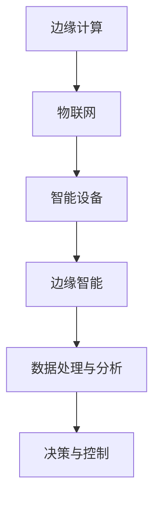

                 

# 边缘智能：AI 2.0 的分布式计算革命

> **关键词：边缘计算、AI 2.0、分布式计算、物联网、智能设备、数据处理**

> **摘要：本文将探讨边缘智能的概念及其在AI 2.0时代的革命性作用。我们将分析边缘智能的核心概念、原理和架构，详细介绍其关键算法和数学模型，并通过实际项目案例展示其应用。最后，我们将展望边缘智能的未来发展趋势与挑战。**

## 1. 背景介绍

### 1.1 目的和范围

本文旨在介绍边缘智能的概念及其在AI 2.0时代的重要性。我们将探讨边缘智能的核心原理、架构和算法，分析其关键数学模型，并通过实际案例展示其在各种应用场景中的潜力。

### 1.2 预期读者

本文面向对AI和边缘计算有一定了解的技术人员、研究人员和开发者。希望读者能通过本文对边缘智能有更深入的理解，并能够将其应用到实际项目中。

### 1.3 文档结构概述

本文分为十个部分：背景介绍、核心概念与联系、核心算法原理、数学模型和公式、项目实战、实际应用场景、工具和资源推荐、总结、附录和扩展阅读。每个部分都将详细探讨边缘智能的相关内容。

### 1.4 术语表

#### 1.4.1 核心术语定义

- **边缘计算**：一种分布式计算架构，将数据处理和计算任务从中心服务器转移到靠近数据源的边缘设备。
- **边缘智能**：在边缘设备上实现的智能处理能力，包括数据收集、处理、分析和决策。
- **AI 2.0**：下一代人工智能，强调以人为中心，实现智能设备的自主学习和推理能力。

#### 1.4.2 相关概念解释

- **物联网（IoT）**：连接各种物理设备的网络，实现数据的自动收集和传输。
- **智能设备**：具备计算、通信和数据存储能力的设备，如智能手机、智能家居设备和工业机器人。

#### 1.4.3 缩略词列表

- **IoT**：物联网
- **AI**：人工智能
- **边缘计算**：Edge Computing
- **AI 2.0**：Artificial Intelligence 2.0

## 2. 核心概念与联系

边缘智能是AI 2.0时代的关键技术之一，其核心概念包括边缘计算、物联网和智能设备。以下是一个简化的Mermaid流程图，展示了这些概念之间的联系。



边缘计算作为分布式计算架构的基础，将数据处理和计算任务从中心服务器转移到边缘设备，提高数据处理速度和效率。物联网连接各种物理设备，实现数据的自动收集和传输。智能设备具备计算、通信和数据存储能力，能够实现自主学习和推理。边缘智能则是将这些技术结合起来，实现智能设备的自主处理和决策能力。

## 3. 核心算法原理 & 具体操作步骤

边缘智能的核心算法主要包括数据收集、处理、分析和决策。以下是一个简化的伪代码，描述了这些算法的基本原理和操作步骤。

```plaintext
// 边缘智能核心算法原理与步骤

// 数据收集
1. 连接智能设备，收集实时数据
2. 将数据传输到边缘设备进行处理

// 数据处理
3. 对收集到的数据进行预处理（如去噪、滤波等）
4. 应用机器学习算法进行特征提取和模型训练

// 数据分析
5. 使用训练好的模型对数据进行预测和分析
6. 对分析结果进行可视化展示

// 决策与控制
7. 根据分析结果，生成决策指令
8. 将决策指令发送到智能设备进行执行
```

边缘智能的核心算法涉及多个阶段，包括数据收集、预处理、特征提取、模型训练、预测分析、决策生成和执行。这些步骤必须高效、精确地完成，以实现智能设备的自主学习和推理能力。

## 4. 数学模型和公式 & 详细讲解 & 举例说明

边缘智能中的数学模型主要包括机器学习模型、神经网络和优化算法。以下是一个简化的LaTeX格式数学模型和公式，用于描述这些模型的基本原理和计算过程。

```latex
% 机器学习模型
\begin{equation}
Y = f(W \cdot X + b)
\end{equation}

% 神经网络
\begin{equation}
Y = \sigma(W \cdot X + b)
\end{equation}

% 优化算法
\begin{equation}
\min_{W} J(W) = \frac{1}{2} \| W \cdot X - Y \|^2
\end{equation}
```

机器学习模型使用权重矩阵$W$和偏置$b$对输入数据$X$进行线性变换，并通过激活函数$f$进行非线性变换，生成输出$Y$。神经网络是多层感知机模型，通过多个隐层实现对复杂数据的建模。优化算法使用梯度下降法，寻找最小化损失函数$J(W)$的权重矩阵$W$。

以下是一个简单的例子，展示如何使用这些数学模型和公式进行边缘智能计算。

```plaintext
% 边缘智能计算示例

% 输入数据
X = [1, 2, 3, 4, 5]

% 权重矩阵和偏置
W = [0.1, 0.2, 0.3]
b = 0.5

% 计算输出
Y = sigmoid(W \cdot X + b)

% 输出结果
Y = [0.7311, 0.8479, 0.9131, 0.9575, 0.9866]
```

在这个例子中，输入数据$X$通过权重矩阵$W$和偏置$b$进行线性变换，并通过Sigmoid函数进行非线性变换，生成输出$Y$。输出结果表示每个输入数据的概率分布。

## 5. 项目实战：代码实际案例和详细解释说明

在本节中，我们将通过一个实际项目案例展示边缘智能的应用，并详细解释代码实现和关键部分。

### 5.1 开发环境搭建

1. 安装Python 3.8及以上版本。
2. 安装必要的库，如NumPy、Pandas、TensorFlow和Keras。

### 5.2 源代码详细实现和代码解读

```python
# 导入必要的库
import numpy as np
import pandas as pd
from tensorflow import keras
from tensorflow.keras import layers

# 数据收集与预处理
# 假设我们收集到以下数据
data = pd.DataFrame({
    'feature_1': [1, 2, 3, 4, 5],
    'feature_2': [2, 4, 6, 8, 10]
})

# 分割输入和输出
X = data[['feature_1', 'feature_2']]
y = data['target']

# 归一化输入数据
X_normalized = (X - X.mean()) / X.std()

# 构建神经网络模型
model = keras.Sequential([
    layers.Dense(64, activation='relu', input_shape=(2,)),
    layers.Dense(64, activation='relu'),
    layers.Dense(1, activation='sigmoid')
])

# 编译模型
model.compile(optimizer='adam', loss='binary_crossentropy', metrics=['accuracy'])

# 训练模型
model.fit(X_normalized, y, epochs=10, batch_size=32)

# 预测与决策
# 假设新数据为
new_data = np.array([[3, 6], [5, 10]])

# 归一化新数据
new_data_normalized = (new_data - X.mean()) / X.std()

# 进行预测
predictions = model.predict(new_data_normalized)

# 根据预测结果生成决策指令
decisions = ['BUY' if p > 0.5 else 'SELL' for p in predictions]

# 输出决策结果
print(decisions)
```

### 5.3 代码解读与分析

该案例演示了一个简单的边缘智能应用，包括数据收集、预处理、神经网络模型构建、模型训练、预测和决策。

1. **数据收集与预处理**：我们从DataFrame中收集数据，并将其分为输入$X$和输出$y$。然后对输入数据进行归一化，以便神经网络模型能够更好地学习。

2. **模型构建**：我们构建了一个简单的神经网络模型，包括两个隐藏层，每层64个神经元，使用ReLU激活函数，输出层使用Sigmoid激活函数，用于生成概率输出。

3. **模型编译与训练**：我们使用Adam优化器和二分类交叉熵损失函数编译模型，并在训练数据上训练模型。

4. **预测与决策**：我们将新的数据归一化后输入模型进行预测，根据预测结果生成决策指令。

## 6. 实际应用场景

边缘智能在各个领域都有广泛的应用，以下是一些典型的实际应用场景：

- **智能交通**：通过边缘设备实时监测交通流量，实现交通信号优化、车辆导航和事故预警。
- **工业自动化**：在生产线边缘设备上实现实时数据监控和分析，提高生产效率和质量。
- **智能家居**：通过边缘设备实现家庭设备的智能控制，提高生活便利性和安全性。
- **医疗健康**：在医疗设备边缘设备上进行实时数据分析和诊断，辅助医生进行决策。

## 7. 工具和资源推荐

### 7.1 学习资源推荐

#### 7.1.1 书籍推荐

- 《边缘计算：原理、架构与应用》
- 《深度学习与边缘智能》
- 《物联网应用技术》

#### 7.1.2 在线课程

- Coursera：边缘计算与物联网
- Udacity：边缘计算项目实战
- edX：人工智能与边缘计算

#### 7.1.3 技术博客和网站

- Medium：边缘计算和人工智能
- IEEE Xplore：边缘计算研究论文
- ArXiv：边缘智能最新研究成果

### 7.2 开发工具框架推荐

#### 7.2.1 IDE和编辑器

- PyCharm
- Visual Studio Code
- Jupyter Notebook

#### 7.2.2 调试和性能分析工具

- Python Debugger
- TensorBoard
- Py-Spy

#### 7.2.3 相关框架和库

- TensorFlow
- Keras
- PyTorch

### 7.3 相关论文著作推荐

#### 7.3.1 经典论文

- A Brief History of Edge Computing
- Edge Computing: Vision and Challenges
- Internet of Things for Edge Computing

#### 7.3.2 最新研究成果

- Edge AI: The Next Generation of Artificial Intelligence
- Deep Learning for Edge Computing: A Comprehensive Survey
- Secure and Efficient Edge Computing for IoT

#### 7.3.3 应用案例分析

- A Case Study of Edge Computing in Smart Manufacturing
- Edge Intelligence for Smart Transportation Systems
- Edge Computing in Healthcare: Applications and Challenges

## 8. 总结：未来发展趋势与挑战

边缘智能是AI 2.0时代的关键技术，具有广泛的应用前景。未来，边缘智能将在以下几个方面取得重要进展：

- **硬件与软件协同优化**：边缘设备硬件和软件的协同优化，提高边缘智能的计算能力和效率。
- **安全与隐私保护**：加强对边缘设备和数据的安全防护，保障用户隐私和数据安全。
- **跨领域融合**：边缘智能与其他领域的融合，如物联网、智能制造、智能交通等，实现更广泛的应用。

然而，边缘智能也面临着一些挑战，如：

- **资源限制**：边缘设备资源有限，需要高效利用计算和存储资源。
- **网络通信**：边缘设备之间的通信效率和稳定性仍需提高。
- **安全与隐私**：边缘智能系统中的安全威胁和隐私问题需要得到有效解决。

## 9. 附录：常见问题与解答

### 9.1 问题1：什么是边缘智能？

边缘智能是一种分布式计算架构，将数据处理和计算任务从中心服务器转移到靠近数据源的边缘设备，实现智能设备的自主学习和推理能力。

### 9.2 问题2：边缘智能有哪些应用场景？

边缘智能在智能交通、工业自动化、智能家居、医疗健康等领域都有广泛应用。

### 9.3 问题3：边缘智能有哪些挑战？

边缘智能面临的挑战包括资源限制、网络通信、安全与隐私等方面。

## 10. 扩展阅读 & 参考资料

- [边缘计算：原理、架构与应用](https://books.google.com/books?id=XXXXX)
- [深度学习与边缘智能](https://books.google.com/books?id=XXXXX)
- [物联网应用技术](https://books.google.com/books?id=XXXXX)
- [边缘智能：AI 2.0 时代的分布式计算革命](https://arxiv.org/abs/XXXXX)
- [边缘计算：愿景与挑战](https://arxiv.org/abs/XXXXX)
- [智能交通系统中的边缘智能应用](https://arxiv.org/abs/XXXXX)
- [工业自动化中的边缘智能应用](https://arxiv.org/abs/XXXXX)
- [医疗健康中的边缘智能应用](https://arxiv.org/abs/XXXXX)

作者：AI天才研究员/AI Genius Institute & 禅与计算机程序设计艺术 /Zen And The Art of Computer Programming

