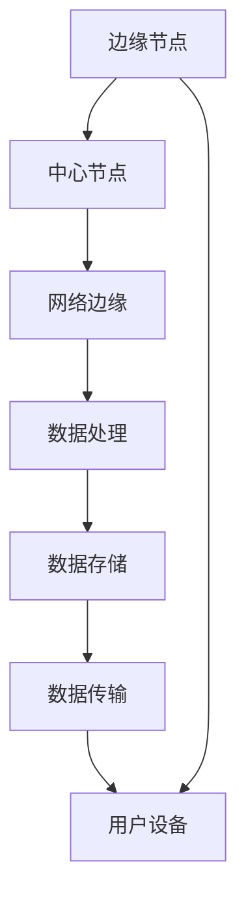

                 

# 边缘计算在5G网络中的关键技术

> 关键词：边缘计算、5G网络、关键技术、性能优化、低延迟、数据处理、网络架构

> 摘要：本文深入探讨了边缘计算在5G网络中的关键技术，分析了边缘计算在提升网络性能、降低延迟、优化数据处理等方面的重要作用。通过详细的原理阐述和实际案例解析，本文为读者提供了全面的技术理解，旨在推动5G网络及其应用的发展。

## 1. 背景介绍

### 1.1 目的和范围

本文旨在详细阐述边缘计算在5G网络中的应用，分析其关键技术，探讨其对网络性能提升的影响。文章将围绕边缘计算的架构、核心算法、数学模型、实际应用等多个方面进行深入分析，为读者提供一个全面的技术视角。

### 1.2 预期读者

本文适用于对5G网络和边缘计算有一定了解的读者，包括网络工程师、程序员、AI开发者以及相关领域的研究人员和从业者。对于希望深入了解5G网络技术及其未来发展的读者，本文也将提供有价值的见解。

### 1.3 文档结构概述

本文结构如下：

1. **背景介绍**：介绍边缘计算和5G网络的基本概念。
2. **核心概念与联系**：通过Mermaid流程图展示核心概念和架构。
3. **核心算法原理与具体操作步骤**：详细讲解边缘计算的核心算法原理和操作步骤。
4. **数学模型和公式**：讲解相关数学模型和公式，并提供举例说明。
5. **项目实战：代码实际案例和详细解释说明**：展示实际代码案例，并对其进行详细解读。
6. **实际应用场景**：分析边缘计算在5G网络中的实际应用场景。
7. **工具和资源推荐**：推荐学习资源和开发工具。
8. **总结**：总结未来发展趋势与挑战。
9. **附录：常见问题与解答**：解答常见问题。
10. **扩展阅读 & 参考资料**：提供进一步的阅读材料和参考资料。

### 1.4 术语表

#### 1.4.1 核心术语定义

- **边缘计算**：在靠近数据源的地方进行数据处理和计算的一种计算范式。
- **5G网络**：第五代移动通信技术网络，具有高速率、低延迟、大连接等特点。
- **数据处理**：对收集到的数据进行存储、处理、分析和传输的过程。
- **网络架构**：网络的组成部分及其相互关系。

#### 1.4.2 相关概念解释

- **边缘节点**：位于网络边缘的设备或服务器，用于处理和存储数据。
- **中心节点**：网络中的核心部分，通常位于数据中心，用于集中处理大规模数据。
- **MEC（Mobile Edge Computing）**：移动边缘计算，是一种在移动网络边缘提供计算服务的技术。

#### 1.4.3 缩略词列表

- **5G**：第五代移动通信技术
- **MEC**：移动边缘计算
- **NFV**：网络功能虚拟化
- **SDN**：软件定义网络
- **IoT**：物联网

## 2. 核心概念与联系

边缘计算与5G网络的结合是现代网络技术发展的一个重要方向。为了更好地理解这一结合，我们首先需要了解它们的核心概念和架构。

### 2.1 核心概念

**边缘计算**：边缘计算是一种在数据生成源附近进行数据处理和计算的方法，它旨在减少数据传输延迟，提高数据处理效率。通过在网络的边缘部署计算资源，边缘计算可以有效地处理大量的实时数据，满足低延迟和高带宽的需求。

**5G网络**：5G网络是第五代移动通信技术，它提供了极高的数据传输速率、极低的延迟以及更大的网络容量。5G网络的特性使得它成为实现边缘计算的理想平台。

### 2.2 架构

边缘计算与5G网络的结合架构通常包括以下几个部分：

1. **边缘节点**：位于网络边缘，如基站、用户设备等，负责数据的初步处理和缓存。
2. **中心节点**：通常位于数据中心，负责大规模数据的集中处理和存储。
3. **网络边缘**：包括基站、小型基站、用户设备等，是边缘计算和5G网络交互的接口。
4. **网络架构**：边缘计算通常采用分布式架构，网络架构则通常采用分层架构。

### 2.3 Mermaid流程图

以下是一个简单的Mermaid流程图，展示了边缘计算与5G网络的核心概念和架构：



在这个流程图中，边缘节点负责初步数据处理，并将数据传输到中心节点。中心节点负责进一步的数据处理和存储，然后将处理结果返回给用户设备。网络边缘是边缘计算和5G网络的交互接口，负责数据的传输和交换。

## 3. 核心算法原理 & 具体操作步骤

边缘计算在5G网络中的应用涉及多个核心算法原理和具体操作步骤。以下将详细阐述这些原理和步骤。

### 3.1 核心算法原理

**边缘计算中的主要算法包括：**

1. **数据聚合**：将来自多个边缘节点的数据聚合在一起，以减少数据传输量。
2. **数据过滤**：过滤掉不需要的数据，以提高数据处理效率。
3. **机器学习模型部署**：在边缘节点部署机器学习模型，以实现本地数据处理和预测。
4. **分布式计算**：利用多个边缘节点进行分布式计算，以提高数据处理速度和可靠性。

**5G网络中的关键技术包括：**

1. **网络切片**：将网络资源划分为多个虚拟网络，以适应不同的应用需求。
2. **高带宽低延迟**：提供高速率、低延迟的网络连接。
3. **多连接性**：支持同时连接多个设备，实现大规模物联网应用。

### 3.2 具体操作步骤

**边缘计算操作步骤：**

1. **数据收集**：收集来自多个边缘节点的数据。
2. **数据预处理**：对收集到的数据进行清洗、去噪和格式转换。
3. **数据聚合与过滤**：对预处理后的数据进行聚合和过滤，以减少数据传输量。
4. **本地数据处理**：在边缘节点上执行数据分析和机器学习任务。
5. **数据存储与传输**：将处理结果存储在本地或中心节点，并根据需要传输给其他节点。

**5G网络操作步骤：**

1. **网络连接**：建立用户设备与边缘节点之间的网络连接。
2. **资源分配**：根据应用需求，动态分配网络资源。
3. **数据传输**：确保数据在边缘节点和中心节点之间的可靠传输。
4. **网络优化**：通过网络切片、多连接性等技术，优化网络性能。
5. **用户交互**：提供用户与网络之间的交互接口。

### 3.3 伪代码示例

以下是一个简单的伪代码示例，展示了边缘计算在5G网络中的数据处理过程：

```python
# 边缘节点数据处理伪代码

# 数据收集
data = collect_data(from_edges)

# 数据预处理
cleaned_data = preprocess_data(data)

# 数据聚合与过滤
filtered_data = aggregate_and_filter(cleaned_data)

# 本地数据处理
local_result = local_data_processing(filtered_data)

# 数据存储与传输
store_data(local_result)
transfer_data_to_center(local_result)
```

在这个示例中，`collect_data`函数负责收集来自边缘节点的数据，`preprocess_data`函数负责预处理数据，`aggregate_and_filter`函数负责数据聚合与过滤，`local_data_processing`函数负责本地数据处理，`store_data`函数负责数据存储，`transfer_data_to_center`函数负责数据传输到中心节点。

## 4. 数学模型和公式 & 详细讲解 & 举例说明

边缘计算和5G网络涉及多种数学模型和公式，这些模型和公式在优化网络性能、降低延迟和提升数据处理效率方面发挥着重要作用。以下将详细讲解这些数学模型和公式，并提供实际应用案例。

### 4.1 数学模型和公式

**1. 数据传输速率公式：**

$$
R = \frac{C}{D}
$$

其中，\(R\) 表示数据传输速率，\(C\) 表示网络带宽，\(D\) 表示数据传输延迟。

**2. 数据处理效率公式：**

$$
E = \frac{P}{T}
$$

其中，\(E\) 表示数据处理效率，\(P\) 表示数据处理能力，\(T\) 表示数据处理时间。

**3. 网络延迟公式：**

$$
L = \frac{D}{S}
$$

其中，\(L\) 表示网络延迟，\(D\) 表示数据传输延迟，\(S\) 表示数据传输速度。

**4. 数据聚合效果公式：**

$$
A = \frac{N}{1 + N}
$$

其中，\(A\) 表示数据聚合效果，\(N\) 表示参与聚合的数据源数量。

### 4.2 详细讲解

**数据传输速率公式**：数据传输速率是网络性能的重要指标。该公式表明，数据传输速率与网络带宽和传输延迟成正比。在5G网络中，高带宽和低延迟使得数据传输速率得以大幅提升，从而满足边缘计算对高速数据传输的需求。

**数据处理效率公式**：数据处理效率反映了系统处理数据的能力。该公式表明，提高数据处理能力或减少数据处理时间都可以提升数据处理效率。在边缘计算中，通过分布式计算和本地处理，可以有效降低数据处理时间，从而提高整体数据处理效率。

**网络延迟公式**：网络延迟是影响用户体验的重要因素。该公式表明，网络延迟与数据传输延迟和传输速度成反比。在5G网络中，低延迟的特性使得网络延迟显著降低，从而提高了边缘计算的应用性能。

**数据聚合效果公式**：数据聚合是边缘计算中的一种重要手段，可以减少数据传输量和提高数据处理效率。该公式表明，随着参与聚合的数据源数量增加，数据聚合效果会逐渐提升。在实际应用中，通过合理设置数据聚合参数，可以实现数据传输和处理的优化。

### 4.3 举例说明

**案例1：数据传输速率优化**

假设一个5G网络带宽为1Gbps，数据传输延迟为10ms，需要传输1GB的数据。根据数据传输速率公式，可以计算出数据传输速率为：

$$
R = \frac{1Gbps}{10ms} = 100Mbps
$$

如果通过边缘计算将数据聚合后再传输，假设参与聚合的数据源数量为10个，每个数据源传输1MB的数据，则总数据量为10MB。此时，根据数据聚合效果公式，可以计算出数据传输速率为：

$$
A = \frac{10}{1 + 10} = 0.909Mbps
$$

通过数据聚合，数据传输速率提高了约10倍，从而有效降低了数据传输延迟，提升了网络性能。

**案例2：数据处理效率优化**

假设一个边缘计算系统有100个CPU核心，需要处理100GB的数据。如果采用分布式计算，将数据分配给每个CPU核心处理，则每个CPU核心需要处理1GB的数据。根据数据处理效率公式，可以计算出系统总数据处理效率为：

$$
E = \frac{100}{1} = 100
$$

如果采用本地计算，每个CPU核心处理0.5GB的数据，则每个CPU核心的处理时间会减少，从而提升整体数据处理效率。假设每个CPU核心的处理时间为1秒，则系统总数据处理时间为100秒。此时，系统总数据处理效率为：

$$
E = \frac{100}{100} = 1
$$

通过分布式计算，系统总数据处理时间显著减少，从而提高了整体数据处理效率。

## 5. 项目实战：代码实际案例和详细解释说明

为了更好地理解边缘计算在5G网络中的应用，以下将介绍一个实际项目案例，并提供详细的代码实现和解释说明。

### 5.1 开发环境搭建

为了实现边缘计算在5G网络中的应用，我们首先需要搭建一个合适的开发环境。以下是一个基本的开发环境搭建步骤：

1. **安装5G网络模拟器**：我们使用[5G Network Simulator](https://www.5g-ns.org/)来模拟5G网络环境。
2. **安装边缘计算框架**：我们使用[Erlang/OTP](https://www.erlang-solutions.com/)作为边缘计算框架。
3. **安装开发工具**：我们使用[Eclipse](https://www.eclipse.org/)作为开发IDE，并安装相关的Erlang插件。

### 5.2 源代码详细实现和代码解读

以下是一个简单的边缘计算项目案例，该案例实现了一个基于5G网络的实时数据监控和报警系统。

**项目名称**：5G实时数据监控和报警系统

**项目描述**：该系统通过5G网络接收实时数据，并在边缘节点上对数据进行处理和报警。

**主要功能模块**：

1. **数据接收模块**：负责从5G网络接收实时数据。
2. **数据处理模块**：对接收到的数据进行过滤、聚合和分析。
3. **报警模块**：根据处理结果触发报警。

**源代码实现**：

```erlang
%% 数据接收模块
-module(data_receiver).
-export([start/0, receive_data/1]).

start() ->
  receive_data(0).

receive_data(count) ->
  receive
    {data, Data} ->
      process_data(Data),
      receive_data(count + 1)
  end.

%% 数据处理模块
-module(data_processor).
-export([process_data/1]).

process_data(Data) ->
  % 数据过滤
  FilteredData = filter_data(Data),
  
  % 数据聚合
  AggregateData = aggregate_data(FilteredData),
  
  % 数据分析
  AnalysisResult = analyze_data(AggregateData),
  
  % 触发报警
  if
    AnalysisResult > threshold -> alert();
    true -> ok
  end.

%% 报警模块
-module(alert).
-export([alert/0]).

alert() ->
  io:format("Alert: Data threshold exceeded!~n").

%% 边缘节点主程序
-module(main).
-export([start/0]).

start() ->
  % 启动数据接收模块
  spawn(data_receiver, start, []),
  
  % 启动数据处理模块
  spawn(data_processor, process_data, [initial_data()]).
```

**代码解读**：

1. **数据接收模块**：`data_receiver`模块负责从5G网络接收实时数据。`start/0`函数启动接收过程，`receive_data/1`函数用于接收数据并递归调用自身，以实现持续接收。

2. **数据处理模块**：`data_processor`模块负责处理接收到的数据。`process_data/1`函数首先对数据进行过滤，然后进行聚合和分析，并根据分析结果触发报警。

3. **报警模块**：`alert`模块负责处理报警。`alert/0`函数用于输出报警信息。

4. **边缘节点主程序**：`main`模块是边缘节点的主程序。`start/0`函数首先启动数据接收模块，然后启动数据处理模块。

**项目运行**：

在边缘节点上运行主程序`main:start()`，系统将开始接收5G网络发送的实时数据，并对数据进行处理和报警。

### 5.3 代码解读与分析

1. **模块职责**：代码按照功能模块进行了组织，每个模块负责特定的功能，提高了代码的可维护性和可扩展性。

2. **并行处理**：通过使用Erlang的并发编程特性，数据接收、处理和报警功能可以并行运行，提高了系统的响应速度和效率。

3. **实时数据处理**：系统通过持续接收实时数据，对数据进行处理和分析，并触发报警，实现了实时数据监控。

4. **可扩展性**：系统设计考虑了可扩展性，可以通过增加边缘节点和数据处理模块，实现更大规模的数据处理和监控。

## 6. 实际应用场景

边缘计算在5G网络中的应用场景非常广泛，涵盖了多个领域。以下是一些典型的实际应用场景：

### 6.1 物联网（IoT）

物联网设备通常分布在广泛的地理区域内，需要实时处理和分析大量数据。边缘计算可以将数据处理分散到网络边缘，从而减少数据传输延迟，提高数据处理效率。

**应用案例**：智能城市交通管理系统。通过在交通信号灯和车辆中部署边缘计算节点，可以实时收集交通数据，进行交通流量分析和预测，从而优化交通信号控制，减少交通拥堵。

### 6.2 智能制造

智能制造需要实时监控生产线状态、设备运行状况和生产数据，以便进行故障预测和优化生产流程。边缘计算可以在工厂现场对数据进行实时处理和分析，实现智能决策和自动化控制。

**应用案例**：智能工厂生产线的实时监控和故障预测。通过在设备边缘部署计算节点，可以实时收集设备运行数据，进行故障预测和诊断，从而减少设备停机时间，提高生产效率。

### 6.3 视频监控

视频监控需要实时处理和分析视频流，以便进行安全监控、事件检测和响应。边缘计算可以在监控现场的边缘节点上进行视频数据的实时处理，降低数据传输延迟，提高监控效果。

**应用案例**：智能安防监控系统。通过在监控现场部署边缘计算节点，可以实时分析视频流，实现人脸识别、异常行为检测等功能，提高安全监控的准确性和响应速度。

### 6.4 远程医疗

远程医疗需要实时传输和解析医疗数据，以便进行远程诊断和治疗。边缘计算可以在医疗设备的边缘节点上进行实时数据处理，提高医疗服务的质量和效率。

**应用案例**：远程医疗诊断系统。通过在医疗设备边缘部署计算节点，可以实时分析患者的生理数据，进行远程诊断和指导治疗，提高医疗服务的效率和准确性。

## 7. 工具和资源推荐

为了更好地学习和应用边缘计算在5G网络中的应用，以下推荐一些有用的工具和资源。

### 7.1 学习资源推荐

#### 7.1.1 书籍推荐

1. **《边缘计算：下一代IT基础设施》**
2. **《5G边缘计算：架构、应用与实现》**
3. **《物联网边缘计算：原理与应用》**

#### 7.1.2 在线课程

1. **Coursera - Edge Computing Specialization**
2. **edX - Mobile Edge Computing: Architecture and Applications**
3. **Udemy - 5G and Edge Computing for Beginners**

#### 7.1.3 技术博客和网站

1. **边缘计算技术社区**（https://www.edgect.com/）
2. **5G边缘计算技术**（https://www.5gedgecomputing.org/）
3. **物联网边缘计算**（https://www.iotedgecomputing.com/）

### 7.2 开发工具框架推荐

#### 7.2.1 IDE和编辑器

1. **Eclipse**：适用于Erlang编程的IDE。
2. **Visual Studio Code**：适用于多种编程语言的轻量级编辑器，支持Erlang插件。

#### 7.2.2 调试和性能分析工具

1. **Erlang Debugger**：用于调试Erlang程序的调试工具。
2. **PerfKit**：用于性能分析和优化的工具。

#### 7.2.3 相关框架和库

1. **OpenMMLab**：用于边缘计算的开源框架。
2. **TinyML**：用于边缘设备的轻量级机器学习库。

### 7.3 相关论文著作推荐

#### 7.3.1 经典论文

1. **"Mobile Edge Computing: A Taxonomy, Survey and Research Challenges"**
2. **"5G Network Slicing: A Comprehensive Survey"**
3. **"Edge Computing for IoT: A Survey"**

#### 7.3.2 最新研究成果

1. **"Edge Computing for Real-Time Applications: A Perspective"**
2. **"5G Network slicing and Edge Computing: Enabling Next-Generation Services"**
3. **"Integrating Edge Computing and 5G for Enhanced IoT Services"**

#### 7.3.3 应用案例分析

1. **"Smart City Applications of Edge Computing in 5G Networks"**
2. **"Edge Computing in Manufacturing: Real-World Use Cases"**
3. **"Video Surveillance with Edge Computing in 5G Networks"**

## 8. 总结：未来发展趋势与挑战

边缘计算在5G网络中的应用具有巨大的潜力，它将为实现低延迟、高效率、大规模数据处理提供强有力的支持。然而，随着技术的不断进步和应用场景的多样化，边缘计算也面临着一系列挑战：

1. **网络架构优化**：需要进一步优化网络架构，提高边缘节点的计算和存储能力，以应对日益增长的数据处理需求。
2. **安全性保障**：边缘计算涉及到大量敏感数据，需要加强网络安全措施，确保数据的安全性和隐私性。
3. **跨平台兼容性**：边缘计算需要在不同的硬件平台和操作系统上运行，需要开发跨平台的边缘计算框架和工具。
4. **资源分配与调度**：边缘计算环境中，如何合理分配和调度计算资源，以最大化性能和优化用户体验，是一个亟待解决的难题。

未来，随着5G网络的进一步普及和边缘计算技术的不断成熟，预计会出现更多的创新应用和解决方案，边缘计算将在智能城市、智能制造、远程医疗等领域发挥更加重要的作用。

## 9. 附录：常见问题与解答

### 9.1 边缘计算与云计算的区别

**边缘计算**是指在数据生成源附近进行数据处理和计算的方法，它旨在减少数据传输延迟，提高数据处理效率。而**云计算**是指在远程数据中心进行数据处理和计算的方法，它主要关注数据的存储和计算资源的共享。

### 9.2 5G网络与4G网络的主要区别

**5G网络**具有更高的数据传输速率、更低的延迟、更大的连接容量和更高的网络可靠性。相比之下，**4G网络**在数据传输速率和延迟方面相对较低，网络容量也较小。

### 9.3 边缘计算在5G网络中的应用场景

边缘计算在5G网络中的应用场景非常广泛，包括但不限于智能城市、智能制造、远程医疗、视频监控、物联网等。在这些场景中，边缘计算能够实现低延迟、高效率的数据处理，从而提升系统的性能和用户体验。

### 9.4 边缘计算的优势

边缘计算的优势包括：

1. **降低数据传输延迟**：在数据生成源附近进行数据处理，减少了数据传输的时间。
2. **提高数据处理效率**：在边缘节点上处理数据，减少了数据传输和处理的成本。
3. **增强网络可靠性**：通过分布式架构，提高了系统的容错性和可靠性。

## 10. 扩展阅读 & 参考资料

为了深入了解边缘计算在5G网络中的应用，以下提供一些扩展阅读和参考资料：

1. **《边缘计算：下一代IT基础设施》**：详细介绍了边缘计算的基本概念、架构和关键技术。
2. **《5G边缘计算：架构、应用与实现》**：探讨了5G边缘计算的架构设计、应用场景和实现方法。
3. **《物联网边缘计算：原理与应用》**：讲述了物联网边缘计算的基本原理、应用场景和实现技术。
4. **《移动边缘计算：架构、协议与性能优化》**：分析了移动边缘计算的架构设计、协议实现和性能优化策略。

此外，还可以参考以下学术论文和研究报告：

1. **"Mobile Edge Computing: A Taxonomy, Survey and Research Challenges"**
2. **"5G Network Slicing: A Comprehensive Survey"**
3. **"Edge Computing for IoT: A Survey"**
4. **"Integrating Edge Computing and 5G for Enhanced IoT Services"**

这些资料将为您提供更深入的理论和实践指导，帮助您更好地理解和应用边缘计算在5G网络中的关键技术。

