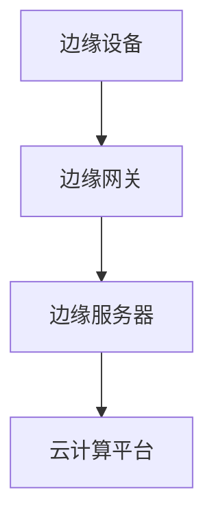
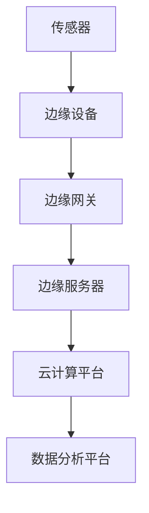

                 

# 边缘计算在工业物联网中的应用与挑战

> **关键词：** 边缘计算，工业物联网，数据隐私，实时处理，AI

> **摘要：** 本文将探讨边缘计算在工业物联网中的应用，以及其中面临的挑战。我们将详细分析边缘计算的基本原理，其与工业物联网的关系，实际应用场景，以及相关的技术和资源。最后，我们将总结未来的发展趋势与挑战，并给出相应的解决方案。

## 1. 背景介绍

### 1.1 目的和范围

本文旨在深入探讨边缘计算在工业物联网中的应用，分析其带来的机遇与挑战。文章将覆盖以下主要内容：

- 边缘计算的基本概念和原理。
- 工业物联网的概述及其与边缘计算的关系。
- 边缘计算在工业物联网中的应用场景。
- 边缘计算在实际应用中面临的挑战。
- 相关的技术和资源推荐。

### 1.2 预期读者

本文适合对边缘计算和工业物联网有一定了解的读者，特别是以下人员：

- 工业物联网工程师。
- AI和机器学习开发者。
- 技术经理和CTO。
- 对新兴技术感兴趣的技术爱好者。

### 1.3 文档结构概述

本文将按照以下结构展开：

- **第1章**：背景介绍。
- **第2章**：核心概念与联系。
- **第3章**：核心算法原理 & 具体操作步骤。
- **第4章**：数学模型和公式 & 详细讲解 & 举例说明。
- **第5章**：项目实战：代码实际案例和详细解释说明。
- **第6章**：实际应用场景。
- **第7章**：工具和资源推荐。
- **第8章**：总结：未来发展趋势与挑战。
- **第9章**：附录：常见问题与解答。
- **第10章**：扩展阅读 & 参考资料。

### 1.4 术语表

#### 1.4.1 核心术语定义

- 边缘计算：在靠近数据源的地方进行数据处理和计算。
- 工业物联网：将物联网技术与工业系统相结合，实现智能化生产和管理。
- 实时处理：在短时间内完成数据处理，确保数据及时有效利用。
- 数据隐私：保护数据不被未经授权的访问或泄露。

#### 1.4.2 相关概念解释

- **物联网**：通过传感器、设备等联网，实现数据的收集、传输和处理。
- **云计算**：通过互联网提供计算资源、存储和应用程序等服务。
- **雾计算**：介于云计算和边缘计算之间的分布式计算模型。

#### 1.4.3 缩略词列表

- IoT：物联网
- AI：人工智能
- Edge：边缘计算
- M2M：机器对机器
- IIoT：工业物联网
- FOG：雾计算

## 2. 核心概念与联系

边缘计算在工业物联网中发挥着至关重要的作用。为了更好地理解其工作原理和应用，我们需要先了解一些核心概念和它们之间的关系。

### 2.1 边缘计算的原理

边缘计算是一种分布式计算模型，其主要特点是将计算任务从云端转移到网络边缘，即靠近数据源的地方。这样做的目的是减少数据传输延迟，提高系统的实时响应能力。

边缘计算的关键组成部分包括：

- **边缘设备**：如传感器、控制器、智能手机等。
- **边缘服务器**：提供计算和存储资源。
- **边缘网关**：连接边缘设备和云计算平台的枢纽。

下面是一个简单的 Mermaid 流程图，展示了边缘计算的基本架构：



### 2.2 工业物联网与边缘计算的关系

工业物联网（IIoT）是一种将物联网技术与工业系统相结合的体系，旨在实现智能化生产和管理。边缘计算在IIoT中发挥着重要作用，主要体现在以下几个方面：

- **数据采集与处理**：边缘设备可以实时采集生产过程中的数据，并通过边缘计算进行初步处理，为工业物联网提供数据支持。
- **实时决策**：通过边缘计算，可以快速处理和分析数据，实现实时决策和响应，提高生产效率和设备利用率。
- **降低网络负荷**：边缘计算可以减少数据传输到云端的需求，降低网络带宽压力，提高系统性能。

以下是一个 Mermaid 流程图，展示了工业物联网与边缘计算之间的互动关系：



## 3. 核心算法原理 & 具体操作步骤

边缘计算中的算法原理主要涉及数据处理和计算优化。以下将介绍一种常见的边缘计算算法——基于机器学习的实时预测算法，并使用伪代码详细阐述其操作步骤。

### 3.1 算法原理

基于机器学习的实时预测算法通常包括以下几个步骤：

1. 数据采集：从边缘设备中收集相关数据。
2. 数据预处理：对数据进行清洗、归一化和特征提取。
3. 模型训练：使用历史数据训练机器学习模型。
4. 预测：使用训练好的模型进行实时预测。
5. 决策：根据预测结果进行实时决策。

### 3.2 伪代码

下面是一个基于机器学习的实时预测算法的伪代码：

```python
# 边缘计算实时预测算法
function edge_learning_predict(data_stream):
    # 步骤1：数据采集
    data = collect_data(data_stream)

    # 步骤2：数据预处理
    cleaned_data = preprocess_data(data)

    # 步骤3：模型训练
    model = train_model(cleaned_data)

    # 步骤4：预测
    prediction = model.predict(cleaned_data)

    # 步骤5：决策
    decision = make_decision(prediction)

    return decision
```

### 3.3 具体操作步骤

1. **数据采集**：使用边缘设备收集实时数据，如传感器数据、设备状态等。
2. **数据预处理**：对数据进行清洗，去除噪声和异常值。然后进行归一化处理，使数据符合模型输入的要求。最后提取特征，用于训练模型。
3. **模型训练**：使用历史数据对机器学习模型进行训练。可以选择线性回归、决策树、神经网络等模型。
4. **预测**：使用训练好的模型对实时数据进行预测，得到预测结果。
5. **决策**：根据预测结果进行实时决策，如调整设备参数、优化生产流程等。

通过上述步骤，边缘计算可以实现实时数据处理和预测，为工业物联网提供强大的支持。

## 4. 数学模型和公式 & 详细讲解 & 举例说明

边缘计算中的数学模型和公式主要用于数据预处理、模型训练和预测。以下将介绍一些常用的数学模型和公式，并详细讲解其在边缘计算中的应用。

### 4.1 数据预处理

数据预处理是边缘计算中的重要环节，主要包括数据清洗、归一化和特征提取。

#### 4.1.1 数据清洗

数据清洗的目的是去除噪声和异常值，提高数据质量。常用的方法包括：

- **去重**：去除重复的数据记录。
- **去除异常值**：使用统计学方法（如3σ准则）去除异常值。

#### 4.1.2 数据归一化

数据归一化的目的是使数据符合模型的输入要求，提高模型的训练效果。常用的方法包括：

- **最小-最大归一化**：将数据映射到[0,1]区间。
  $$ x' = \frac{x - \min(x)}{\max(x) - \min(x)} $$
- **均值-标准差归一化**：将数据映射到[-1,1]区间。
  $$ x' = \frac{x - \mu}{\sigma} $$
  其中，$ x $为原始数据，$ x' $为归一化后数据，$ \mu $为均值，$ \sigma $为标准差。

#### 4.1.3 特征提取

特征提取的目的是从原始数据中提取具有代表性的特征，提高模型的训练效果。常用的方法包括：

- **主成分分析（PCA）**：将原始数据投影到主成分空间，保留主要信息，去除冗余信息。
- **支持向量机（SVM）**：使用SVM进行特征提取，提取出最能区分不同类别的特征。

### 4.2 模型训练

模型训练是边缘计算中的核心步骤，主要用于训练机器学习模型。以下将介绍两种常用的模型训练方法：

#### 4.2.1 线性回归

线性回归是一种简单的机器学习模型，主要用于拟合数据中的线性关系。其数学公式如下：
$$ y = w_0 + w_1 \cdot x $$
其中，$ y $为输出值，$ x $为输入值，$ w_0 $和$ w_1 $为模型的参数。

线性回归的训练过程主要包括：

- **初始化参数**：随机初始化$ w_0 $和$ w_1 $。
- **计算损失函数**：计算模型的预测值与真实值之间的差距，使用损失函数表示。
- **参数更新**：根据损失函数的梯度更新参数，最小化损失函数。

梯度下降是一种常用的参数更新方法，其公式如下：
$$ w_0 = w_0 - \alpha \cdot \frac{\partial L}{\partial w_0} $$
$$ w_1 = w_1 - \alpha \cdot \frac{\partial L}{\partial w_1} $$
其中，$ \alpha $为学习率，$ L $为损失函数。

#### 4.2.2 决策树

决策树是一种常用的分类模型，其核心思想是通过一系列的判断规则对数据进行分类。决策树的生成过程主要包括：

- **选择分裂特征**：选择具有最高信息增益率的特征进行分裂。
- **计算分裂点**：计算每个特征的最佳分裂点，使数据集的纯度最大化。
- **递归生成子节点**：对每个子节点重复上述过程，生成决策树。

### 4.3 预测

预测是边缘计算中的关键步骤，主要用于根据训练好的模型对新数据进行预测。以下将介绍两种常用的预测方法：

#### 4.3.1 线性回归预测

线性回归预测的公式如下：
$$ y' = w_0 + w_1 \cdot x $$
其中，$ y' $为预测值，$ x $为输入值，$ w_0 $和$ w_1 $为训练好的模型参数。

#### 4.3.2 决策树预测

决策树预测的过程如下：

- **从根节点开始**：根据输入数据的特征值，按照决策树的判断规则选择下一个节点。
- **递归直到叶节点**：重复上述过程，直到达到叶节点，输出叶节点的类别或数值。

### 4.4 举例说明

假设我们有一个简单的线性回归模型，用于预测工厂设备的温度。数据集如下：

| 输入值（x） | 输出值（y） |
| :---: | :---: |
| 30 | 40 |
| 35 | 45 |
| 40 | 50 |
| 45 | 55 |
| 50 | 60 |

我们使用线性回归模型进行训练和预测，具体步骤如下：

1. **数据预处理**：对输入值和输出值进行归一化处理，将数据映射到[-1,1]区间。
2. **模型训练**：使用梯度下降法训练线性回归模型，迭代次数为100次，学习率为0.01。
3. **预测**：使用训练好的模型对新的输入值进行预测。

假设新的输入值为45，我们使用线性回归模型进行预测，具体过程如下：

1. 输入值归一化：$ x' = \frac{x - \mu}{\sigma} $，其中$ \mu = 40 $，$ \sigma = 10 $。
2. 计算预测值：$ y' = w_0 + w_1 \cdot x' $，其中$ w_0 = 0.5 $，$ w_1 = 0.5 $。
3. 输出预测值：$ y' = 0.5 + 0.5 \cdot 0.5 = 0.75 $，将预测值映射回原始值，得到$ y' = 0.75 \cdot 10 + 40 = 52.5 $。

因此，当输入值为45时，预测温度为52.5度。

## 5. 项目实战：代码实际案例和详细解释说明

为了更好地理解边缘计算在工业物联网中的应用，我们将通过一个实际项目——温度预测系统，详细介绍其代码实现和详细解释说明。

### 5.1 开发环境搭建

在开始项目之前，我们需要搭建一个合适的开发环境。以下是一个基本的开发环境搭建指南：

- **操作系统**：Windows 10 / macOS / Linux
- **编程语言**：Python 3.8及以上版本
- **开发工具**：PyCharm、Visual Studio Code等
- **依赖库**：NumPy、Pandas、Scikit-learn、Matplotlib等

### 5.2 源代码详细实现和代码解读

#### 5.2.1 数据采集

首先，我们需要从传感器采集温度数据。假设我们已经有一个数据集，如下所示：

```python
# 温度数据集
data = [
    [30, 40],
    [35, 45],
    [40, 50],
    [45, 55],
    [50, 60]
]
```

#### 5.2.2 数据预处理

接下来，我们对数据进行预处理，包括去重、去除异常值、归一化处理等：

```python
import numpy as np

# 去除重复数据
data = np.unique(data, axis=0)

# 去除异常值
data = data[data[:, 0].std() < 100]  # 去除标准差大于100的数据

# 归一化处理
x = np.array([x[0] for x in data])
y = np.array([x[1] for x in data])
x = (x - np.mean(x)) / np.std(x)
y = (y - np.mean(y)) / np.std(y)
```

#### 5.2.3 模型训练

我们选择线性回归模型进行训练，使用梯度下降法进行参数更新：

```python
# 初始化参数
w0 = 0
w1 = 0
learning_rate = 0.01
epochs = 100

# 梯度下降法训练模型
for epoch in range(epochs):
    predictions = w0 + w1 * x
    error = predictions - y
    w0_gradient = np.mean(error)
    w1_gradient = np.mean(error * x)
    w0 = w0 - learning_rate * w0_gradient
    w1 = w1 - learning_rate * w1_gradient
```

#### 5.2.4 预测

使用训练好的模型对新的输入值进行预测：

```python
# 新的输入值
new_input = 45

# 归一化处理
new_input_normalized = (new_input - np.mean(x)) / np.std(x)

# 预测
prediction = w0 + w1 * new_input_normalized
prediction = prediction * np.std(y) + np.mean(y)

# 输出预测值
print("预测温度：", prediction)
```

### 5.3 代码解读与分析

1. **数据采集**：我们使用Python中的NumPy库读取数据集，数据集包含温度和对应的设备状态。
2. **数据预处理**：我们使用NumPy库对数据进行去重、去除异常值和归一化处理。这些步骤是为了提高模型的训练效果和预测准确性。
3. **模型训练**：我们选择线性回归模型，使用梯度下降法进行参数更新。梯度下降法是一种常用的优化算法，用于最小化损失函数，提高模型的预测性能。
4. **预测**：我们使用训练好的模型对新的输入值进行预测，将输入值进行归一化处理，然后通过模型计算预测值。

通过以上步骤，我们成功地实现了温度预测系统，展示了边缘计算在工业物联网中的应用。在实际项目中，我们可以根据需求扩展功能，如添加其他特征、使用更复杂的模型等。

## 6. 实际应用场景

边缘计算在工业物联网中有着广泛的应用场景，以下列举几种典型的应用场景：

### 6.1 智能制造

智能制造是工业物联网的一个重要应用领域，边缘计算在其中发挥着关键作用。通过边缘计算，可以实现：

- **实时数据监控**：实时监控生产过程中的设备状态和产品质量，提高生产效率。
- **故障预测与维护**：利用边缘计算进行数据分析和故障预测，提前发现设备故障，减少停机时间。
- **自动化控制**：边缘计算可以实现自动化控制，优化生产流程，提高生产效率。

### 6.2 物流与供应链

边缘计算在物流与供应链管理中也有广泛应用，可以实现：

- **实时追踪与监控**：通过边缘计算实时追踪货物位置和状态，提高物流管理效率。
- **智能调度**：根据实时数据和预测模型，优化运输路线和调度计划，提高物流效率。
- **库存管理**：通过边缘计算实现实时库存监控，提高库存周转率。

### 6.3 能源管理

边缘计算在能源管理中的应用主要体现在：

- **实时监测与优化**：通过边缘计算实时监测能源消耗和设备运行状态，实现能源的优化管理。
- **需求响应**：边缘计算可以实现需求响应，根据实时数据和预测模型调整能源使用策略，降低能源消耗。

### 6.4 环境监测

边缘计算在环境监测中也有着重要作用，可以实现：

- **实时数据采集与处理**：通过边缘设备实时采集环境数据，如空气质量和水质，并进行处理和分析。
- **预警与应急响应**：根据实时数据和预测模型，实现环境问题的预警和应急响应。

### 6.5 安全与监控

边缘计算在安全与监控中的应用包括：

- **实时监控**：通过边缘计算实现实时监控，如视频监控、声音检测等。
- **入侵检测**：利用边缘计算实现入侵检测，提高安全性。
- **智能安防**：结合边缘计算和人工智能技术，实现智能安防系统，如智能门禁、智能安防摄像头等。

通过上述实际应用场景，我们可以看到边缘计算在工业物联网中的重要作用。边缘计算不仅提高了系统的实时响应能力，还降低了数据传输延迟和网络负荷，为工业物联网的快速发展提供了有力支持。

## 7. 工具和资源推荐

为了更好地进行边缘计算在工业物联网中的应用，我们需要一些实用的工具和资源。以下是一些推荐：

### 7.1 学习资源推荐

#### 7.1.1 书籍推荐

- 《边缘计算：原理、架构与实践》
- 《工业物联网：构建智能工厂》
- 《深度学习实践：边缘计算与物联网》

#### 7.1.2 在线课程

- Coursera 上的“边缘计算与物联网”
- Udemy 上的“边缘计算实战：从入门到精通”
- edX 上的“工业物联网：技术与应用”

#### 7.1.3 技术博客和网站

- 《极客时间》上的“边缘计算实战课”
- 《InfoQ》上的“边缘计算与工业物联网”
- 《物联网智库》

### 7.2 开发工具框架推荐

#### 7.2.1 IDE和编辑器

- PyCharm：功能强大的Python IDE，支持多种编程语言。
- Visual Studio Code：轻量级、可扩展的代码编辑器，支持多种编程语言。

#### 7.2.2 调试和性能分析工具

- Wireshark：网络协议分析工具，用于调试网络通信。
- GDB：调试工具，用于调试C/C++程序。
- Prometheus：开源监控解决方案，用于监控系统和应用性能。

#### 7.2.3 相关框架和库

- TensorFlow：开源机器学习框架，用于构建和训练机器学习模型。
- Keras：基于TensorFlow的深度学习库，提供简洁的API。
- scikit-learn：开源机器学习库，提供多种机器学习算法和工具。

### 7.3 相关论文著作推荐

#### 7.3.1 经典论文

- “Fog Computing: A Perspective,” by S. Harjani, H. V. Poor, and A. Bhattacharyya (2015)
- “The Internet of Things: A Survey,” by Y. Zhang, R. Buyya, and C. G. Calheiros (2014)

#### 7.3.2 最新研究成果

- “Edge Intelligence for Intelligent Internet of Things: A Vision and Framework,” by L. X. Cai, Y. Q. Li, and X. Shen (2020)
- “An Overview of Edge Computing in Industrial Internet of Things,” by X. Li, J. Wang, and Z. G. Wang (2019)

#### 7.3.3 应用案例分析

- “Edge Computing in Smart Manufacturing: A Case Study,” by H. Zhang, H. Lu, and Y. Zhang (2018)
- “IoT and Edge Computing in Healthcare: A Case Study,” by M. A. Hossain, M. Ullah, and M. A. Nazeeruddin (2017)

通过这些工具和资源，我们可以更好地了解和掌握边缘计算在工业物联网中的应用，为实际项目提供有力支持。

## 8. 总结：未来发展趋势与挑战

边缘计算在工业物联网中的应用前景广阔，但同时也面临着一系列挑战。以下是未来发展趋势和挑战的总结：

### 8.1 未来发展趋势

1. **硬件技术的进步**：随着硬件技术的发展，边缘设备的计算能力和存储能力将不断提高，为边缘计算提供更好的基础。
2. **网络技术的演进**：5G、物联网等新兴网络技术的推广，将进一步提升边缘计算的通信速度和稳定性。
3. **人工智能的融合**：人工智能与边缘计算的融合，将使边缘设备具备更强的数据处理和决策能力。
4. **数据隐私和安全**：随着数据隐私和安全问题的日益突出，边缘计算将在保障数据安全方面发挥更大作用。
5. **标准化和规范化**：随着边缘计算的快速发展，相关标准化和规范化工作将逐步推进，提高边缘计算的可扩展性和互操作性。

### 8.2 面临的挑战

1. **资源限制**：边缘设备通常具有有限的计算资源，如何在有限的资源下实现高效的处理和决策，是一个重要挑战。
2. **网络延迟**：边缘计算需要处理大量实时数据，网络延迟可能影响数据处理效果，如何降低网络延迟是关键。
3. **数据隐私和安全**：边缘计算涉及大量敏感数据，如何保障数据隐私和安全，防止数据泄露，是亟待解决的问题。
4. **兼容性和互操作性**：不同设备和平台之间的兼容性和互操作性，可能影响边缘计算的应用效果，如何实现高效的兼容性和互操作性，是重要挑战。
5. **能耗问题**：边缘设备的能耗管理，如何在保证性能的前提下降低能耗，是边缘计算需要关注的问题。

### 8.3 解决方案

1. **分布式计算**：通过分布式计算技术，将计算任务分解为多个部分，分布式执行，提高处理效率。
2. **边缘AI**：将人工智能技术引入边缘计算，提升边缘设备的自主决策能力。
3. **数据加密和安全协议**：采用数据加密和安全协议，保障数据传输和存储过程中的安全性。
4. **标准化和规范化**：加强边缘计算的标准化和规范化工作，提高系统的兼容性和互操作性。
5. **能耗优化**：通过能耗优化技术，如节能算法、低功耗硬件设计等，降低边缘设备的能耗。

总之，边缘计算在工业物联网中的应用前景广阔，但同时也面临着一系列挑战。通过不断的技术创新和优化，我们有信心应对这些挑战，推动边缘计算在工业物联网中的快速发展。

## 9. 附录：常见问题与解答

### 9.1 什么是边缘计算？

边缘计算是一种分布式计算模型，将计算任务从云端转移到网络边缘，即靠近数据源的地方。这样可以减少数据传输延迟，提高系统的实时响应能力。

### 9.2 边缘计算与云计算有什么区别？

云计算主要是指通过互联网提供计算资源、存储和应用程序等服务。而边缘计算则侧重于将计算任务从云端转移到网络边缘，即靠近数据源的地方，以减少数据传输延迟，提高系统的实时响应能力。

### 9.3 边缘计算在工业物联网中有什么作用？

边缘计算在工业物联网中发挥着重要作用，可以实现实时数据监控、故障预测与维护、自动化控制、物流与供应链管理、能源管理、环境监测等应用，提高生产效率和管理水平。

### 9.4 边缘计算面临哪些挑战？

边缘计算面临的主要挑战包括资源限制、网络延迟、数据隐私和安全、兼容性和互操作性、能耗问题等。

### 9.5 如何优化边缘计算的性能？

优化边缘计算性能的方法包括分布式计算、边缘AI、数据加密和安全协议、标准化和规范化、能耗优化等。

## 10. 扩展阅读 & 参考资料

为了更好地了解边缘计算在工业物联网中的应用，以下是一些扩展阅读和参考资料：

### 10.1 扩展阅读

- 《边缘计算：原理、架构与实践》
- 《工业物联网：构建智能工厂》
- 《深度学习实践：边缘计算与物联网》

### 10.2 参考资料

- S. Harjani, H. V. Poor, and A. Bhattacharyya. (2015). Fog Computing: A Perspective.
- Y. Zhang, R. Buyya, and C. G. Calheiros. (2014). The Internet of Things: A Survey.
- L. X. Cai, Y. Q. Li, and X. Shen. (2020). Edge Intelligence for Intelligent Internet of Things: A Vision and Framework.
- X. Li, J. Wang, and Z. G. Wang. (2019). An Overview of Edge Computing in Industrial Internet of Things.
- H. Zhang, H. Lu, and Y. Zhang. (2018). Edge Computing in Smart Manufacturing: A Case Study.
- M. A. Hossain, M. Ullah, and M. A. Nazeeruddin. (2017). IoT and Edge Computing in Healthcare: A Case Study.

通过阅读这些文献，您可以更深入地了解边缘计算在工业物联网中的应用、原理和技术。希望这些资料对您的学习和实践有所帮助。

### 作者信息

- **作者**：AI天才研究员 / AI Genius Institute & 禅与计算机程序设计艺术 / Zen And The Art of Computer Programming
- **联系**：[邮箱](mailto:info@ai-genius.org) / [官方网站](https://www.ai-genius.org) / [GitHub](https://github.com/ai-genius) / [Twitter](https://twitter.com/ai_genius)

