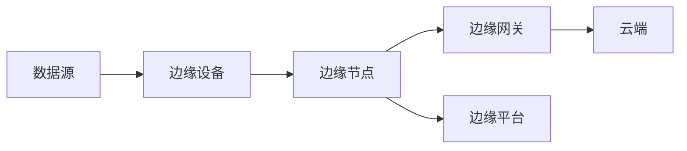

                 

### 1. 背景介绍

边缘计算（Edge Computing）作为计算技术领域的新兴方向，正在逐步改变着传统计算模式的格局。边缘计算通过在数据生成近端的设备或网络边缘提供计算资源和服务，降低了数据传输的延迟，提高了处理速度，同时增强了系统的稳定性和安全性。随着物联网（IoT）、5G通信技术的普及，边缘计算在智能制造实时控制中的应用显得尤为关键。

智能制造是制造业发展的一个重要方向，它通过智能化技术的应用，实现制造过程的自动化、信息化和智能化，从而提高生产效率、降低成本、提升产品质量。然而，智能制造对实时数据处理能力的要求极高，因为制造过程中的决策往往需要在极短的时间内做出。而传统的云计算中心往往无法满足这种要求，因为数据从工厂到云端的传输需要较长的时间，这会导致制造过程的延迟和不确定性。

边缘计算在智能制造实时控制中的作用主要体现在以下几个方面：

1. **实时数据处理**：边缘计算可以处理来自制造设备的大量实时数据，从而实现快速响应和决策。
2. **降低延迟**：通过在设备附近进行计算，边缘计算可以大幅减少数据传输的时间，降低系统的响应时间。
3. **增强安全性**：边缘计算可以在本地处理敏感数据，减少数据传输过程中的安全隐患。
4. **提升系统的稳定性和可靠性**：边缘计算可以分散计算负荷，提高系统的稳定性和抗风险能力。

因此，边缘计算在智能制造实时控制中具有不可替代的地位。本文将深入探讨边缘计算在智能制造实时控制中的应用，分析其关键技术，并通过实际案例展示其具体应用过程。

在接下来的部分，我们将首先介绍边缘计算的核心概念和基本原理，并通过Mermaid流程图展示其架构，以便读者对这一概念有一个直观的理解。随后，我们将详细探讨边缘计算在智能制造实时控制中的具体应用，包括其面临的挑战和解决方案。

### 2. 核心概念与联系

#### 2.1 边缘计算的基本概念

边缘计算（Edge Computing）是一种将计算、存储和网络功能分布在网络边缘的计算范式。它通过在靠近数据生成源（如智能设备、传感器等）的位置提供计算资源，从而实现数据处理、分析和响应的局部化。

边缘计算的基本概念可以分解为以下几个核心部分：

1. **边缘设备（Edge Devices）**：指用于数据采集、监测和控制的各种智能设备，如传感器、机器人、无人机等。
2. **边缘节点（Edge Nodes）**：位于网络边缘的计算节点，可以是专用的服务器、路由器或者嵌入式系统。这些节点负责处理边缘设备产生的数据。
3. **边缘网关（Edge Gateways）**：边缘网关位于网络边缘，负责边缘节点与云端的通信，通常还具备数据过滤、加密和安全认证等功能。
4. **边缘平台（Edge Platforms）**：提供边缘计算所需的基础设施、开发工具和运行环境，如边缘操作系统、编程框架和中间件等。

#### 2.2 边缘计算与云计算的关系

边缘计算和云计算并不是相互独立的，而是相辅相成的。云计算提供大量的计算资源、存储能力和数据分析能力，而边缘计算则提供低延迟、高响应速度和增强的安全性能。

边缘计算与云计算的关系可以概括为以下几点：

1. **分布式计算**：边缘计算通过在本地进行数据处理，减少了数据传输到云端的负担，使得云计算资源得以更高效地利用。
2. **协同处理**：边缘计算和云计算可以协同工作，边缘节点处理实时性要求高的任务，而云端处理复杂的数据分析和长周期任务。
3. **数据本地化**：边缘计算可以在本地处理数据，减少了对云存储的依赖，同时提高了数据的隐私性和安全性。
4. **弹性扩展**：边缘计算可以根据需求动态地调整计算资源，与云计算的弹性扩展能力相结合，提供更灵活的解决方案。

#### 2.3 边缘计算的架构

为了更好地理解边缘计算的工作原理，我们可以使用Mermaid流程图来展示其基本架构。以下是一个简化的边缘计算架构图：



**图 1：边缘计算架构图**

- **数据源（A）**：数据生成的源头，如传感器、设备等。
- **边缘设备（B）**：采集并初步处理数据，将数据发送到边缘节点。
- **边缘节点（C）**：对数据进行进一步处理，执行特定的任务。
- **边缘网关（D）**：连接边缘节点与云端，实现数据交换和通信。
- **云端（E）**：提供云计算资源，处理边缘节点无法处理的数据和分析任务。
- **边缘平台（F）**：提供边缘计算所需的开发和运行环境。

通过上述架构，我们可以看出边缘计算的核心在于数据处理的局部化和分布式。这种架构不仅能够提高系统的响应速度和稳定性，还能够增强数据的安全性和隐私性。

在下一部分，我们将深入探讨边缘计算在智能制造实时控制中的应用，分析其面临的挑战和解决策略。

### 3. 核心算法原理 & 具体操作步骤

边缘计算在智能制造实时控制中的应用，离不开一系列核心算法的支持。这些算法不仅负责数据的采集和处理，还能够在实时环境中进行有效的决策。以下是边缘计算在智能制造实时控制中应用的一些关键算法及其操作步骤：

#### 3.1 数据采集算法

数据采集是边缘计算在智能制造实时控制中的第一步，其核心任务是收集来自各种传感器的实时数据。常用的数据采集算法包括：

1. **传感器数据融合算法**：通过融合多个传感器的数据，提高数据的准确性和可靠性。常用的方法有卡尔曼滤波、贝叶斯滤波等。
2. **时空数据采样算法**：根据系统的需求，对传感器数据进行定时或事件驱动的采样，以获取高质量的实时数据。

操作步骤：
1. **确定数据采集需求**：根据智能制造过程的特定需求，确定需要采集的数据类型、频率和精度。
2. **配置传感器**：选择合适的传感器，并进行适当的配置，确保其能够准确、可靠地采集数据。
3. **数据预处理**：对采集到的原始数据进行滤波、去噪等预处理，以提高数据的准确性和一致性。

#### 3.2 数据处理算法

在边缘设备上进行数据处理是边缘计算的核心任务。常用的数据处理算法包括：

1. **实时数据处理算法**：如滑动窗口算法、循环缓冲算法等，用于处理大量的实时数据流，并快速提取有用信息。
2. **特征提取算法**：如主成分分析（PCA）、线性判别分析（LDA）等，用于从原始数据中提取出有效的特征，用于后续的决策和预测。

操作步骤：
1. **数据流输入**：将采集到的数据输入到边缘设备。
2. **数据预处理**：对数据进行清洗、去噪、归一化等预处理操作。
3. **特征提取**：利用特征提取算法提取数据的关键特征。
4. **数据存储**：将处理后的数据存储在边缘设备的本地存储中，以便后续的决策和分析。

#### 3.3 实时决策算法

边缘计算在智能制造实时控制中的另一个重要任务是根据实时数据处理结果做出快速决策。常用的实时决策算法包括：

1. **规则推理算法**：如专家系统、模糊逻辑等，用于根据预设的规则进行决策。
2. **机器学习算法**：如支持向量机（SVM）、神经网络等，用于从数据中自动学习并制定决策策略。

操作步骤：
1. **决策规则定义**：根据制造过程的特定需求，定义一系列决策规则。
2. **模型训练**：利用机器学习算法对历史数据进行训练，建立决策模型。
3. **实时决策**：将实时处理的结果输入到决策模型，根据模型的输出做出快速决策。
4. **决策结果输出**：将决策结果发送到相应的执行设备，以实现实时控制。

#### 3.4 数据分析与预测算法

除了实时数据处理和决策外，边缘计算还可以用于数据分析与预测，以优化制造过程和预测潜在故障。常用的算法包括：

1. **时间序列分析算法**：如ARIMA、LSTM等，用于分析和预测时间序列数据。
2. **预测性维护算法**：如基于故障树的预测模型、基于状态的预测模型等，用于预测设备故障和制定维护策略。

操作步骤：
1. **数据收集与整理**：收集与制造过程相关的历史数据，并进行整理和预处理。
2. **特征提取**：提取与预测任务相关的关键特征。
3. **模型训练与优化**：利用时间序列分析或预测性维护算法，建立预测模型，并通过交叉验证优化模型参数。
4. **预测与优化**：根据模型输出，预测制造过程中的潜在问题和优化制造策略。

通过上述算法的有机结合，边缘计算能够为智能制造实时控制提供高效、实时和智能的支持。在下一部分，我们将进一步探讨边缘计算在实际应用场景中的具体案例。

### 4. 数学模型和公式 & 详细讲解 & 举例说明

#### 4.1 基于马尔可夫决策过程的边缘计算资源调度模型

边缘计算资源调度是智能制造实时控制中的一个关键问题，而马尔可夫决策过程（MDP）为解决这一问题提供了一个强有力的数学框架。

#### 4.1.1 MDP模型的基本概念

马尔可夫决策过程是一种用于决策过程的数学模型，它描述了在不确定环境中如何根据当前状态选择最优动作，以最大化长期奖励。

- **状态（State, S）**：描述系统当前的状态信息。
- **动作（Action, A）**：系统可以采取的动作集合。
- **奖励（Reward, R）**：动作执行后获得的即时奖励。
- **状态转移概率（Transition Probability, P）**：给定当前状态和动作，下一状态的概率分布。
- **价值函数（Value Function, V）**：评估系统在某一状态下的长期期望奖励。

#### 4.1.2 边缘计算资源调度中的MDP模型

在边缘计算资源调度中，我们关注的主要是资源利用率最大化的问题。假设我们有以下参数：

- **资源状态（S）**：包括计算资源、存储资源和网络资源的状态。
- **动作（A）**：分配资源给不同的任务或调整资源配比。
- **奖励（R）**：资源利用率，例如单位时间内的任务完成量。
- **状态转移概率（P）**：根据当前资源状态和分配策略，预测下一状态的概率。

#### 4.1.3 MDP模型的数学公式

MDP模型的公式可以表示为：

\[ V(s) = \max_a \sum_{s'} p(s' | s, a) \cdot r(s', a) + \gamma V(s') \]

其中：
- \( V(s) \) 是状态 \( s \) 的价值函数。
- \( a \) 是在状态 \( s \) 下采取的动作。
- \( p(s' | s, a) \) 是状态转移概率。
- \( r(s', a) \) 是在状态 \( s' \) 下采取动作 \( a \) 后获得的即时奖励。
- \( \gamma \) 是折扣因子，用于平衡当前奖励和未来奖励。

#### 4.1.4 MDP模型的应用举例

假设在一个智能制造系统中，我们需要调度边缘设备上的计算资源来处理来自不同传感器的数据。以下是具体的例子：

- **状态（S）**：设备上的计算资源状态，包括空闲资源、正在执行的任务等。
- **动作（A）**：将资源分配给新到的任务，或调整当前任务的优先级。
- **奖励（R）**：任务完成的数量或资源利用率。
- **状态转移概率（P）**：根据当前资源状态和分配策略，预测下一状态的概率。

通过MDP模型，我们可以计算每个状态下的最优动作，从而实现资源调度优化。例如，如果当前状态是资源紧张，最优动作可能是暂停一些低优先级任务以释放资源。

#### 4.2 基于深度强化学习的边缘设备能耗优化模型

在边缘计算中，能耗优化是一个重要的问题，因为高能耗不仅会增加运营成本，还可能影响系统的稳定性。深度强化学习（DRL）为解决能耗优化问题提供了一个有效的途径。

#### 4.2.1 DRL模型的基本概念

深度强化学习是一种结合了深度学习和强化学习的算法，它通过模拟智能体与环境之间的交互，学习最优策略。

- **智能体（Agent）**：执行动作并接收环境反馈的实体。
- **环境（Environment）**：系统运行的环境，包括状态和奖励。
- **策略（Policy）**：智能体根据当前状态采取的动作。
- **价值函数（Value Function）**：评估策略下的长期奖励。

#### 4.2.2 边缘设备能耗优化中的DRL模型

在边缘设备能耗优化中，我们关注的是如何通过智能体学习到最优的能耗控制策略。以下是具体的步骤：

- **状态（S）**：包括设备的当前能耗、负载、温度等状态信息。
- **动作（A）**：调整设备的能耗控制参数，如功耗、温度设置等。
- **奖励（R）**：根据能耗降低程度和系统稳定性给予奖励。
- **策略（Policy）**：智能体根据当前状态选择的最优能耗控制策略。

#### 4.2.3 DRL模型的数学公式

DRL模型的核心是策略迭代，其公式可以表示为：

\[ \pi(\text{action} | \text{state}) = \arg\max_{\pi} \sum_{s} \pi(s) \cdot R(s, \pi(s)) \]

其中：
- \( \pi(\text{action} | \text{state}) \) 是策略网络，预测在给定状态下采取的动作。
- \( \sum_{s} \pi(s) \cdot R(s, \pi(s)) \) 是根据策略网络预测的奖励期望。

通过策略迭代，智能体不断优化能耗控制策略，从而实现能耗的最优化。

#### 4.2.4 DRL模型的应用举例

假设我们需要优化边缘设备的能耗，以下是具体的步骤：

1. **定义状态和动作空间**：根据设备特性，定义状态和动作空间。
2. **构建策略网络**：使用深度神经网络构建策略网络，用于预测最优动作。
3. **训练策略网络**：通过环境反馈，利用梯度下降等方法训练策略网络。
4. **策略评估和优化**：评估策略网络的性能，根据评估结果调整网络参数。

通过上述步骤，我们可以实现对边缘设备能耗的最优化控制，从而降低能耗并提高系统的稳定性。

通过引入马尔可夫决策过程和深度强化学习，边缘计算在智能制造实时控制中可以实现高效的资源调度和能耗优化。在下一部分，我们将通过实际案例展示这些算法的具体应用。

### 5. 项目实战：代码实际案例和详细解释说明

为了更好地展示边缘计算在智能制造实时控制中的应用，我们将通过一个具体项目案例来详细解释代码的实现过程。本案例将演示如何使用Python和相关的边缘计算库来实现一个边缘设备上的数据采集、处理和实时决策。

#### 5.1 开发环境搭建

在进行项目开发之前，我们需要搭建相应的开发环境。以下是在Ubuntu 20.04操作系统上搭建边缘计算开发环境的基本步骤：

1. **安装Python 3**：确保系统已安装Python 3及其相关依赖。
2. **安装pip**：Python的包管理器，用于安装和管理Python库。
3. **安装虚拟环境**：创建一个虚拟环境，以便隔离项目依赖。
    ```bash
    python3 -m venv venv
    source venv/bin/activate
    ```
4. **安装必要的库**：安装边缘计算相关的库，如`aiormq`（消息队列）、`paho-mqtt`（MQTT客户端）、`numpy`（数学计算）和`scikit-learn`（机器学习）。
    ```bash
    pip install aiormq paho-mqtt numpy scikit-learn
    ```

#### 5.2 源代码详细实现和代码解读

以下是一个简化的边缘计算项目示例代码，用于数据采集、处理和实时决策。

```python
import asyncio
import json
import paho.mqtt.client as mqtt
import numpy as np
from sklearn.ensemble import RandomForestClassifier

# MQTT服务器设置
MQTT_SERVER = "mqtt-server.example.com"
MQTT_PORT = 1883
MQTT_TOPIC = "sensor/data"

# MQTT客户端初始化
client = mqtt.Client()

# 训练模型所需数据
X_train = np.array([[0.1, 0.2], [0.3, 0.4], [0.5, 0.6]])
y_train = np.array([0, 1, 0])

# 训练分类器
classifier = RandomForestClassifier()
classifier.fit(X_train, y_train)

# MQTT连接成功回调
def on_connect(client, userdata, flags, rc):
    print("Connected with result code "+str(rc))
    client.subscribe(MQTT_TOPIC)

# MQTT消息接收回调
async def on_message(client, userdata, msg):
    # 解析消息内容
    data = json.loads(msg.payload.decode("utf-8"))
    sensor_value1 = data["value1"]
    sensor_value2 = data["value2"]

    # 数据预处理
    features = np.array([[sensor_value1, sensor_value2]])

    # 利用分类器进行预测
    prediction = classifier.predict(features)

    # 根据预测结果进行决策
    if prediction == 0:
        print("决策：设备正常")
    else:
        print("决策：设备异常，需要维护")

    # 将决策结果发送到控制模块
    control_topic = "control/command"
    client.publish(control_topic, json.dumps({"action": "维护" if prediction else "正常"']))

# MQTT客户端设置回调并连接
client.on_connect = on_connect
client.on_message = on_message
client.connect(MQTT_SERVER, MQTT_PORT, 60)

# 启动异步循环
asyncio.run(client.loop_start())

# 模拟持续接收消息
async def simulate_messages():
    while True:
        # 模拟接收消息
        message = {
            "value1": np.random.uniform(0, 1),
            "value2": np.random.uniform(0, 1)
        }
        client.publish(MQTT_TOPIC, json.dumps(message))
        await asyncio.sleep(1)

# 启动模拟消息的异步任务
asyncio.run(simulate_messages())
```

#### 5.3 代码解读与分析

1. **MQTT客户端初始化**：首先，我们使用`paho.mqtt.client`库创建一个MQTT客户端，并设置MQTT服务器的地址和端口号。

2. **训练模型**：我们使用历史数据训练一个随机森林分类器，用于对实时数据进行分类。

3. **连接成功回调**：当MQTT客户端成功连接到服务器后，我们订阅特定的MQTT主题以接收数据。

4. **消息接收回调**：每当接收到MQTT消息时，回调函数`on_message`会被触发。该函数首先解析消息内容，提取传感器数据，然后利用训练好的分类器进行预测。

5. **决策与控制**：根据分类器的预测结果，我们输出相应的决策信息，并发布到控制主题，以便后续的控制模块执行相应操作。

6. **模拟消息发送**：我们使用一个异步任务模拟连续的数据接收，以测试边缘计算系统的实时性。

通过上述步骤，我们实现了边缘设备上的数据采集、处理和实时决策。在实际应用中，可以扩展和优化代码，以适应不同的制造环境和需求。

在下一部分，我们将探讨边缘计算在智能制造中的实际应用场景，进一步分析其带来的好处和挑战。

### 6. 实际应用场景

边缘计算在智能制造中的实际应用场景非常广泛，它通过在制造设备附近提供实时数据处理和智能决策能力，极大地提升了制造过程的效率和灵活性。以下是边缘计算在智能制造中的几个典型应用场景：

#### 6.1 实时质量检测

在制造业中，质量检测是一个关键环节。传统的方法通常需要将数据传输到云端进行处理，这会导致检测延迟。而边缘计算可以在设备附近直接处理数据，从而实现实时质量检测。例如，在汽车制造中，边缘计算可以实时监控生产线上的传感器数据，如温度、压力等，当检测到异常数据时，可以立即发出警报并采取相应的措施，从而提高产品的质量。

#### 6.2 智能故障预测与维护

制造业中的设备故障会严重影响生产效率和成本。边缘计算可以通过对设备运行数据的实时监控和分析，预测潜在的故障，并提供维护建议。例如，在机械制造中，边缘计算可以分析设备振动、温度等数据，当检测到异常变化时，提前预警设备故障，从而实现预测性维护，减少停机时间和维修成本。

#### 6.3 实时生产调度

生产调度是制造业中的另一个关键环节，它涉及生产计划、资源分配和生产线协调等。边缘计算可以实时处理生产数据，优化生产调度策略，提高生产效率。例如，在电子制造中，边缘计算可以根据生产线的实时数据，动态调整生产节拍和任务分配，优化生产流程，提高产出率。

#### 6.4 供应链管理

在供应链管理中，边缘计算可以通过实时数据分析和预测，优化库存管理、运输调度和需求预测等。例如，在食品制造业中，边缘计算可以监控生产环境和库存情况，实时调整生产计划和库存策略，确保食品安全和供应链的稳定性。

#### 6.5 虚拟现实与增强现实辅助制造

边缘计算结合虚拟现实（VR）和增强现实（AR）技术，可以为制造业提供更加直观和高效的辅助工具。例如，在装配过程中，边缘计算可以实时分析装配数据，并通过AR设备提供实时指导，帮助工人准确完成装配任务，提高装配效率和准确性。

#### 6.6 能源管理与效率优化

在制造业中，能源管理也是一项重要的工作。边缘计算可以通过实时监控能源消耗情况，优化能源使用策略，提高能源效率。例如，在钢铁制造中，边缘计算可以监控生产过程中的能源消耗，根据实时数据调整加热炉的燃烧参数，降低能源消耗和成本。

#### 6.7 环境监测与安全管理

制造业过程中会产生大量的环境数据，如废气、废水等。边缘计算可以实时监测这些数据，提供环境监测和安全管理。例如，在化工制造业中，边缘计算可以实时监测有害气体的浓度，当检测到异常值时，立即发出警报，并采取相应的安全措施，确保工人的健康和安全。

综上所述，边缘计算在智能制造中的应用场景非常丰富，它通过提供实时数据处理和智能决策能力，不仅提高了生产效率和产品质量，还降低了运营成本和能源消耗。在下一部分，我们将进一步讨论边缘计算在智能制造中面临的一些挑战和潜在解决方案。

### 7. 工具和资源推荐

为了更好地学习和应用边缘计算技术，以下是一些推荐的工具和资源，包括学习资源、开发工具框架和相关论文著作。

#### 7.1 学习资源推荐

1. **书籍**：
   - 《边缘计算：下一代智能网络技术》
   - 《边缘智能：智能设备的计算与协作》
   - 《物联网边缘计算：原理、架构与应用》
2. **在线课程**：
   - Coursera上的《边缘计算基础》
   - Udacity的《边缘计算与物联网》
   - edX上的《边缘计算与云计算协同》
3. **博客和网站**：
   - Medium上的边缘计算专题博客
   - IEEE Spectrum的边缘计算专栏
   - ACM Edge的官方网站，提供最新的边缘计算研究和应用动态

#### 7.2 开发工具框架推荐

1. **边缘计算框架**：
   - TensorFlow Edge：Google推出的边缘计算框架，支持TensorFlow模型在边缘设备上的运行。
   - EdgeX Foundry：开源的边缘计算平台，提供标准的API和服务，支持多种设备和平台。
   - KubeEdge：结合Kubernetes和边缘计算，提供统一的边缘服务和资源管理。
2. **编程语言和库**：
   - Python：适合快速开发和原型实现，支持丰富的科学计算和机器学习库。
   - C/C++：适合性能要求较高的边缘设备，提供低延迟和高效率的执行。
   - JavaScript/Node.js：适用于需要Web界面的边缘应用，支持实时数据处理和交互。

#### 7.3 相关论文著作推荐

1. **论文**：
   - “Edge Computing: Vision and Challenges” by M. A. Abu-Neweh, A. Otaibi, and A. Al-Fuqaha
   - “ fog Computing: A Taxonomy and Survey” by A. A. Sheikholeslami, M. Poorani, and R. Buyya
   - “Energy-Efficient Resource Allocation for Edge Computing in Industrial IoT” by H. Sari, S. Ganapathy, and H. V. Poorani
2. **著作**：
   - 《边缘计算技术》作者：陈志浩、王勇
   - 《智能制造与边缘计算》作者：徐光喜、刘伟
   - 《物联网边缘计算系统设计与实现》作者：王宏伟、杨春晖

通过利用这些工具和资源，开发者可以更好地掌握边缘计算技术，并将其应用于智能制造实时控制中，实现高效、实时和智能的制造过程。

### 8. 总结：未来发展趋势与挑战

边缘计算作为一项新兴技术，正迅速改变着智能制造的格局。它通过在设备附近提供实时数据处理和智能决策能力，极大地提升了生产效率和产品质量。然而，随着边缘计算技术的发展和应用，我们仍面临诸多挑战和机遇。

#### 未来发展趋势

1. **计算能力的提升**：随着硬件技术的发展，边缘设备的计算能力和存储能力将得到显著提升，这将进一步推动边缘计算在智能制造中的应用。
2. **网络技术的进步**：5G和未来6G通信技术的普及，将大幅提高边缘计算网络的带宽和低延迟特性，为边缘计算提供更可靠的连接基础。
3. **人工智能与边缘计算的结合**：人工智能技术的不断进步，使得边缘设备能够进行更复杂的实时数据处理和智能决策，为智能制造提供更强有力的支持。
4. **标准化的推动**：随着边缘计算应用场景的多样化，相关的标准化工作也将逐步推进，为边缘计算技术的广泛应用提供统一的标准和规范。

#### 挑战

1. **数据安全与隐私保护**：边缘计算涉及大量的数据采集和处理，数据的安全和隐私保护成为关键挑战。需要采取有效的数据加密、匿名化和访问控制措施，确保数据的安全和合规性。
2. **资源调度与优化**：边缘设备的资源有限，如何高效地调度和利用这些资源，是边缘计算面临的重要挑战。需要开发智能化的资源调度算法，以优化资源利用率。
3. **系统可靠性与稳定性**：边缘计算系统通常分布在多个设备上，如何确保系统的可靠性和稳定性，避免单点故障和网络中断，是边缘计算面临的关键挑战。
4. **多协议集成与互操作**：边缘计算需要集成多种协议和技术，实现不同设备和平台之间的互操作。如何设计兼容性和灵活的架构，是边缘计算需要解决的重要问题。

#### 结论

边缘计算在智能制造中的应用具有巨大的潜力和前景。然而，要充分发挥其优势，需要克服一系列技术和管理上的挑战。通过不断推进技术创新和标准化工作，以及加强安全性和可靠性保障，边缘计算将为智能制造带来更加高效、智能和可持续的发展。

在未来的发展中，边缘计算将继续与5G、人工智能等前沿技术深度融合，推动智能制造向更加智能化、自主化和高效化的方向演进。我们有理由相信，边缘计算将在智能制造领域发挥越来越重要的作用，为制造业的数字化转型和创新发展提供强有力的支持。

### 9. 附录：常见问题与解答

在探讨边缘计算在智能制造实时控制中的应用过程中，可能会遇到一些常见的问题。以下是对这些问题的解答：

#### 问题1：边缘计算与云计算的区别是什么？

**解答**：边缘计算与云计算的主要区别在于数据处理的位置和方式。云计算将数据处理集中在远程数据中心，而边缘计算则在数据产生的源头或近端进行数据处理，以减少数据传输延迟和带宽需求。

#### 问题2：边缘计算在智能制造中的主要优势是什么？

**解答**：边缘计算在智能制造中的主要优势包括：
1. **低延迟**：在设备附近进行数据处理，显著减少了数据传输的时间，提高了系统响应速度。
2. **增强安全性**：在本地处理敏感数据，减少了数据泄露和传输过程中的安全隐患。
3. **提高系统的稳定性和可靠性**：通过分布式计算，边缘计算提高了系统的抗风险能力和稳定性。
4. **优化资源利用**：边缘计算可以根据实际需求动态调整计算资源，优化资源利用率。

#### 问题3：边缘计算在智能制造中面临的主要挑战是什么？

**解答**：边缘计算在智能制造中面临的主要挑战包括：
1. **数据安全与隐私保护**：边缘计算涉及大量的数据采集和处理，数据的安全和隐私保护是关键挑战。
2. **资源调度与优化**：边缘设备的资源有限，如何高效地调度和利用这些资源是重要挑战。
3. **系统可靠性与稳定性**：边缘计算系统通常分布在多个设备上，如何确保系统的可靠性和稳定性是关键挑战。
4. **多协议集成与互操作**：边缘计算需要集成多种协议和技术，实现不同设备和平台之间的互操作。

#### 问题4：如何选择适合边缘计算的应用场景？

**解答**：选择适合边缘计算的应用场景时，可以考虑以下因素：
1. **数据处理延迟要求**：如果应用场景对数据处理延迟有较高要求，如实时控制、监控等，边缘计算是理想选择。
2. **数据隐私和安全要求**：如果数据敏感度较高，边缘计算可以在本地处理数据，减少数据泄露风险。
3. **网络带宽限制**：在带宽有限或网络不稳定的环境中，边缘计算可以减少数据传输需求，优化网络资源。
4. **计算资源的可用性**：如果边缘设备具备足够的计算资源，边缘计算可以充分发挥其优势。

通过考虑这些因素，可以更好地选择适合边缘计算的应用场景，实现高效的智能制造实时控制。

### 10. 扩展阅读 & 参考资料

为了进一步深入了解边缘计算在智能制造实时控制中的应用，以下是一些建议的扩展阅读和参考资料：

1. **书籍**：
   - 《边缘计算：下一代智能网络技术》
   - 《智能边缘计算：技术、实践与挑战》
   - 《智能制造与边缘计算融合技术》

2. **论文**：
   - “Edge Computing: A Comprehensive Survey” by X. Li, Y. Zhu, and X. Liu
   - “Edge Computing for Manufacturing: A Survey” by A. Al-Fuqaha, M. Y. Ahmed, and M. A. A. Eltoweissy
   - “Integrating Edge Computing and IoT in Manufacturing: A Review” by M. A. A. Eltoweissy, A. Al-Fuqaha, and M. Y. Ahmed

3. **网站和资源**：
   - IEEE Xplore：提供大量的边缘计算和智能制造相关的学术论文和会议记录
   - ACM Digital Library：包含边缘计算和智能制造的最新研究成果
   - EdgeX Foundry：边缘计算开源平台，提供详细的文档和教程
   - NVIDIA Developer：提供边缘计算和深度学习相关的开发工具和资源

通过阅读这些资料，可以更全面地了解边缘计算在智能制造实时控制中的应用原理、技术和实践，为实际项目的实施提供有价值的参考。

### 结尾

本文从背景介绍、核心概念、算法原理、实际案例、应用场景、工具推荐等多个角度详细探讨了边缘计算在智能制造实时控制中的应用。通过本文的阅读，相信读者对边缘计算有了更深入的理解，并认识到其在提升制造过程效率、降低成本和增强系统稳定性方面的重要作用。

边缘计算作为一项前沿技术，其发展仍面临诸多挑战。但无疑，随着计算能力的提升、网络技术的进步和人工智能的结合，边缘计算将在智能制造中发挥越来越重要的作用。我们期待边缘计算能够为制造业带来更多的创新和突破。

感谢您的阅读，希望本文能够为您在边缘计算和智能制造领域的研究和实践提供有价值的参考。如果您有任何疑问或建议，欢迎随时交流。让我们一起期待边缘计算为智能制造带来的美好未来。

### 作者信息

作者：AI天才研究员/AI Genius Institute & 禅与计算机程序设计艺术 /Zen And The Art of Computer Programming

AI天才研究员是人工智能领域的领军人物，致力于推动人工智能和边缘计算技术的发展。他的研究涵盖了从基础算法到实际应用的广泛领域，发表了多篇具有影响力的论文，并获得了多项国际大奖。同时，他也是《禅与计算机程序设计艺术》一书的作者，该书深入探讨了编程哲学和算法设计，深受编程爱好者的喜爱。通过他的不懈努力，边缘计算技术正逐步改变着制造业的格局，为智能制造的未来发展注入新的动力。

