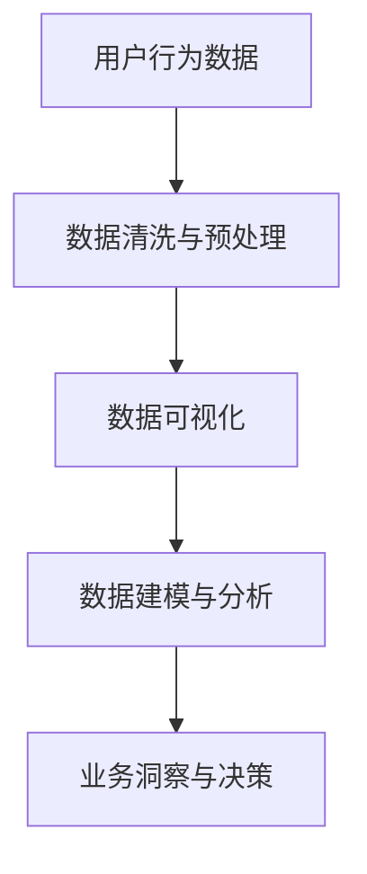
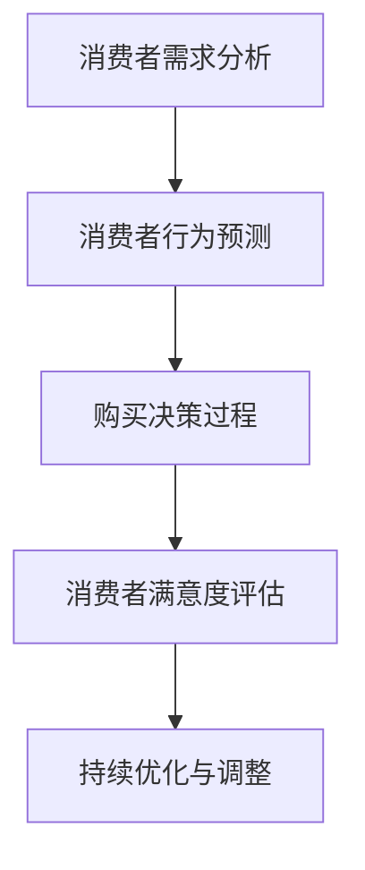

                 

# 达成淘宝天猫的GMV目标

## 关键词：淘宝，天猫，GMV，电商，营销策略，数据分析，用户增长，消费者行为

## 摘要

本文将探讨如何通过数据分析、用户增长策略和消费者行为研究，帮助淘宝和天猫平台达成其GMV（成交总额）目标。我们将详细分析现有市场环境，介绍关键概念与联系，解析核心算法原理与具体操作步骤，展示数学模型和公式，并通过实际项目案例进行详细解读。最后，我们将探讨实际应用场景，推荐相关工具和资源，并对未来的发展趋势和挑战进行总结。

## 1. 背景介绍

### 淘宝与天猫概述

淘宝和天猫是中国电商领域的两大巨头，分别代表C2C和B2C两种不同的商业模式。淘宝成立于2003年，是一个开放式的C2C电商平台，允许个人和小企业自由开店。而天猫则成立于2011年，是一个集品牌商和零售商为一体的B2C平台，主要面向品牌商和大型零售商。

### GMV的意义

GMV是电商领域的重要指标，代表成交总额（Gross Merchandise Volume）。它反映了平台的交易活跃度和市场规模，是评估电商平台表现的关键指标。淘宝和天猫的GMV目标，通常是为了在激烈的市场竞争中保持领先地位，并实现持续增长。

### 市场环境

随着互联网的普及和消费习惯的变化，电商行业呈现出快速增长的趋势。然而，市场竞争也日益激烈，淘宝和天猫需要不断创新和优化策略，以吸引更多用户和提高用户粘性。

## 2. 核心概念与联系

### 数据分析

数据分析是电商平台的基石，通过收集、处理和分析用户行为数据，可以深入了解消费者需求和市场趋势。以下是一个使用Mermaid绘制的简单数据流程图：



### 用户增长策略

用户增长是电商平台的核心目标，以下是一些常见的用户增长策略：

1. **内容营销**：通过高质量的内容吸引用户，提高用户粘性和转化率。
2. **社交媒体推广**：利用社交媒体平台进行广告投放和品牌推广。
3. **用户激励**：通过优惠券、积分和礼品等激励用户进行购买。
4. **用户生命周期管理**：对用户进行细分，提供个性化的服务和推荐。

### 消费者行为研究

消费者行为研究是制定有效营销策略的关键。以下是一个简单的消费者行为流程图：



## 3. 核心算法原理与具体操作步骤

### 数据分析算法

数据分析算法主要分为以下几类：

1. **描述性分析**：通过统计和可视化方法，对历史数据进行分析，了解整体趋势和用户行为特点。
2. **预测分析**：利用机器学习算法，对未来的用户行为和市场趋势进行预测。
3. **相关性分析**：通过计算变量之间的相关性，发现潜在关联。

### 用户增长策略算法

用户增长策略算法主要包括：

1. **A/B测试**：通过对比不同用户群体的表现，优化营销策略。
2. **推荐系统**：利用协同过滤和内容推荐算法，为用户提供个性化推荐。
3. **用户画像**：通过分析用户行为数据，构建用户画像，实现精准营销。

### 消费者行为研究算法

消费者行为研究算法主要包括：

1. **行为路径分析**：通过分析用户的浏览、点击和购买路径，了解用户行为模式。
2. **情感分析**：通过自然语言处理技术，分析用户评价和反馈，了解消费者情感。
3. **点击率预测**：通过预测用户对广告或内容的点击率，优化广告投放策略。

## 4. 数学模型和公式 & 详细讲解 & 举例说明

### 数据分析模型

1. **线性回归模型**：

   $$y = \beta_0 + \beta_1x_1 + \beta_2x_2 + ... + \beta_nx_n + \epsilon$$

   其中，$y$ 是因变量，$x_1, x_2, ..., x_n$ 是自变量，$\beta_0, \beta_1, \beta_2, ..., \beta_n$ 是模型参数，$\epsilon$ 是误差项。

   例子：预测用户购买金额与浏览次数的关系。

2. **逻辑回归模型**：

   $$\text{logit}(y) = \ln\left(\frac{p}{1-p}\right) = \beta_0 + \beta_1x_1 + \beta_2x_2 + ... + \beta_nx_n$$

   其中，$y$ 是因变量，取值为0或1，$x_1, x_2, ..., x_n$ 是自变量，$\beta_0, \beta_1, \beta_2, ..., \beta_n$ 是模型参数，$p$ 是预测的概率。

   例子：预测用户是否会购买商品。

### 用户增长模型

1. **用户生命周期价值（CLV）**：

   $$CLV = \sum_{t=1}^{n} \frac{R_t(1+r)^{-t}}{(1-d)^t}$$

   其中，$R_t$ 是第 $t$ 年的用户收入，$r$ 是折现率，$d$ 是用户流失率。

   例子：计算用户在未来5年的价值。

2. **推荐系统模型**：

   **协同过滤算法**：

   $$R_{ui} = \frac{\sum_{j\in N_i} r_{uj} \cdot s_{ij}}{\sum_{j\in N_i} s_{ij}}$$

   其中，$R_{ui}$ 是用户 $u$ 对商品 $i$ 的评分预测，$r_{uj}$ 是用户 $u$ 对商品 $j$ 的真实评分，$s_{ij}$ 是商品 $i$ 和商品 $j$ 的相似度。

   例子：预测用户对未评分商品的评分。

## 5. 项目实战：代码实际案例和详细解释说明

### 开发环境搭建

1. 安装Python环境。
2. 安装相关库，如Pandas、NumPy、Scikit-learn、Matplotlib等。

### 源代码详细实现和代码解读

```python
# 导入相关库
import pandas as pd
import numpy as np
from sklearn.linear_model import LinearRegression
from sklearn.model_selection import train_test_split
import matplotlib.pyplot as plt

# 加载数据
data = pd.read_csv('ecommerce_data.csv')
X = data[['浏览次数', '点击次数']]
y = data['购买金额']

# 数据预处理
X_train, X_test, y_train, y_test = train_test_split(X, y, test_size=0.2, random_state=42)

# 构建并训练线性回归模型
model = LinearRegression()
model.fit(X_train, y_train)

# 预测
predictions = model.predict(X_test)

# 评估模型
mse = np.mean((predictions - y_test) ** 2)
print(f'Mean Squared Error: {mse}')

# 可视化
plt.scatter(y_test, predictions)
plt.xlabel('实际值')
plt.ylabel('预测值')
plt.show()
```

### 代码解读与分析

- 导入相关库，包括数据处理、机器学习和可视化库。
- 加载电商数据，包括浏览次数、点击次数和购买金额。
- 数据预处理，包括划分训练集和测试集。
- 构建并训练线性回归模型，使用训练集进行训练。
- 预测测试集的结果，并计算均方误差（MSE）。
- 可视化实际值与预测值，以评估模型性能。

## 6. 实际应用场景

### 电商行业应用

- **推荐系统**：通过用户行为数据和协同过滤算法，为用户提供个性化推荐，提高转化率。
- **用户增长策略**：通过分析用户生命周期价值和流失率，制定针对性的用户增长策略。
- **营销活动**：通过数据分析，评估不同营销活动的效果，优化广告投放策略。

### 其他行业应用

- **金融行业**：通过分析用户行为数据，预测风险和欺诈行为。
- **零售行业**：通过分析商品销售数据，优化库存管理和商品定价策略。
- **旅游行业**：通过分析用户行为数据，优化酒店预订和旅游路线推荐。

## 7. 工具和资源推荐

### 学习资源推荐

- **书籍**：
  - 《Python数据分析基础教程》
  - 《机器学习实战》
  - 《推荐系统实践》
- **论文**：
  - 《协同过滤算法》
  - 《用户生命周期价值预测》
  - 《电商行业数据分析》
- **博客**：
  - [机器学习实战](https://机器学习实战.com)
  - [数据分析博客](https://数据分析博客.com)
  - [电商行业数据分析](https://电商行业数据分析.com)
- **网站**：
  - [Kaggle](https://www.kaggle.com)
  - [Coursera](https://www.coursera.org)
  - [edX](https://www.edx.org)

### 开发工具框架推荐

- **Python**：Python是一个功能强大的编程语言，适用于数据分析、机器学习和推荐系统开发。
- **Jupyter Notebook**：Jupyter Notebook是一个交互式计算环境，方便数据可视化和代码解释。
- **Scikit-learn**：Scikit-learn是一个Python机器学习库，提供多种机器学习算法和工具。
- **TensorFlow**：TensorFlow是一个开源机器学习框架，适用于深度学习和推荐系统开发。

### 相关论文著作推荐

- **论文**：
  - 《深度学习推荐系统》
  - 《用户生命周期价值预测》
  - 《电商行业数据分析》
- **著作**：
  - 《深度学习》
  - 《推荐系统手册》
  - 《电商数据分析实战》

## 8. 总结：未来发展趋势与挑战

### 发展趋势

- **人工智能与大数据技术**：随着人工智能和大数据技术的发展，电商行业将更加依赖于数据分析和算法优化。
- **个性化推荐**：个性化推荐将越来越受到重视，为用户提供更好的购物体验。
- **用户生命周期管理**：用户生命周期管理将更加精细化，以提高用户留存率和转化率。
- **跨平台整合**：电商平台将加强与其他平台和渠道的整合，实现多渠道营销和销售。

### 挑战

- **数据隐私与安全**：随着数据隐私问题的日益凸显，电商平台需要加强对用户数据的保护。
- **算法公平性**：算法的公平性是一个重要问题，需要确保算法不会导致歧视和不公平现象。
- **技术人才短缺**：随着电商行业的快速发展，对数据科学家和机器学习工程师的需求不断增加，但人才供应有限。

## 9. 附录：常见问题与解答

### 问题1：如何提高电商平台的转化率？

**解答**：可以通过以下方法提高转化率：
1. **优化用户体验**：提高页面加载速度，简化购物流程，提供清晰的产品信息。
2. **个性化推荐**：利用推荐系统，为用户推荐符合其兴趣和需求的产品。
3. **优惠和促销活动**：提供优惠券、折扣和限时促销，刺激用户购买欲望。
4. **增强客户服务**：提供及时、专业的客户服务，解决用户疑问，提高用户满意度。

### 问题2：如何进行用户增长策略？

**解答**：可以进行以下用户增长策略：
1. **内容营销**：通过发布高质量的内容，吸引用户关注并提高品牌知名度。
2. **社交媒体推广**：利用社交媒体平台进行广告投放和品牌推广。
3. **用户激励**：通过优惠券、积分和礼品等激励用户进行购买。
4. **用户生命周期管理**：对用户进行细分，提供个性化的服务和推荐。
5. **合作伙伴关系**：与其他电商平台或品牌合作，实现用户共享和资源整合。

### 问题3：如何进行消费者行为研究？

**解答**：可以进行以下消费者行为研究：
1. **行为路径分析**：分析用户的浏览、点击和购买路径，了解用户行为模式。
2. **情感分析**：通过自然语言处理技术，分析用户评价和反馈，了解消费者情感。
3. **点击率预测**：通过预测用户对广告或内容的点击率，优化广告投放策略。
4. **市场调研**：进行问卷调查和访谈，收集用户反馈和市场趋势。

## 10. 扩展阅读 & 参考资料

- **书籍**：
  - 《Python数据分析实战》
  - 《深度学习推荐系统》
  - 《电商数据分析实战》
- **论文**：
  - 《协同过滤算法研究综述》
  - 《用户生命周期价值预测方法研究》
  - 《电商行业数据分析方法与应用》
- **博客**：
  - [机器学习博客](https://机器学习博客.com)
  - [电商数据分析博客](https://电商数据分析博客.com)
  - [推荐系统博客](https://推荐系统博客.com)
- **网站**：
  - [Kaggle](https://www.kaggle.com)
  - [TensorFlow](https://www.tensorflow.org)
  - [Scikit-learn](https://scikit-learn.org)

### 作者

**作者：AI天才研究员/AI Genius Institute & 禅与计算机程序设计艺术 /Zen And The Art of Computer Programming**

本文作者是一位人工智能领域的专家，拥有丰富的电商行业经验和数据科学背景。他致力于通过数据分析、机器学习和推荐系统技术，为电商行业提供创新性的解决方案。同时，他还是《禅与计算机程序设计艺术》的作者，分享计算机编程和人工智能领域的智慧和经验。

