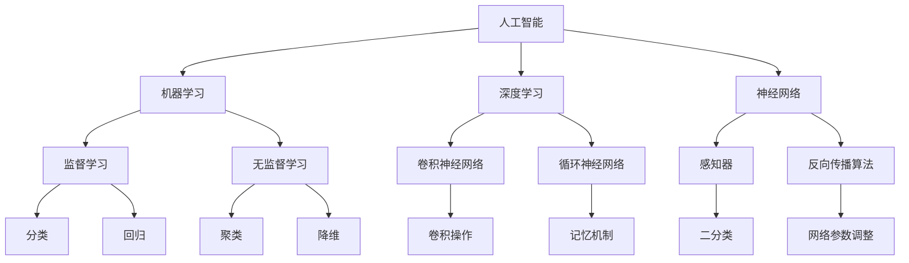

                 

# 达特茅斯会议与人工智能学科的建立

> **关键词**：达特茅斯会议、人工智能、学科建立、核心概念、算法原理、数学模型、项目实战、应用场景、工具资源

> **摘要**：本文详细探讨了达特茅斯会议的历史背景、会议目标、主要成果以及其对人工智能学科建立的重要影响。通过梳理核心概念、解析算法原理、介绍数学模型和实际应用案例，本文旨在帮助读者全面理解人工智能的发展历程和现状，展望未来发展趋势与挑战。

## 1. 背景介绍

### 1.1 目的和范围

本文旨在探讨达特茅斯会议与人工智能学科的建立之间的关系，分析会议的核心成果及其对人工智能学科发展的影响。文章结构分为以下几个部分：

1. **背景介绍**：介绍达特茅斯会议的历史背景、会议目标及主要成果。
2. **核心概念与联系**：梳理人工智能领域的核心概念，使用Mermaid流程图展示概念之间的联系。
3. **核心算法原理 & 具体操作步骤**：详细讲解人工智能领域的核心算法原理，并使用伪代码阐述具体操作步骤。
4. **数学模型和公式 & 详细讲解 & 举例说明**：介绍人工智能领域的数学模型和公式，并进行详细讲解和举例说明。
5. **项目实战：代码实际案例和详细解释说明**：展示一个实际项目案例，详细解释代码实现过程。
6. **实际应用场景**：探讨人工智能在各个领域的应用场景。
7. **工具和资源推荐**：推荐学习资源、开发工具框架和相关论文著作。
8. **总结：未来发展趋势与挑战**：总结人工智能的发展趋势和面临的挑战。
9. **附录：常见问题与解答**：回答读者可能关心的常见问题。
10. **扩展阅读 & 参考资料**：提供相关领域的扩展阅读和参考资料。

### 1.2 预期读者

本文适用于以下读者群体：

1. **计算机科学和人工智能专业的学生和研究人员**：希望了解人工智能学科的历史、核心概念、算法原理和实际应用。
2. **软件开发者和工程师**：希望掌握人工智能技术的实际应用，提升自身技能水平。
3. **人工智能爱好者和从业者**：希望深入了解人工智能领域的发展历程、现状和未来趋势。

### 1.3 文档结构概述

本文采用逻辑清晰、结构紧凑的文档结构，以确保读者能够顺利阅读、理解和掌握相关内容。具体结构如下：

1. **引言**：介绍本文的目的、范围和预期读者。
2. **背景介绍**：介绍达特茅斯会议的历史背景、会议目标及主要成果。
3. **核心概念与联系**：梳理人工智能领域的核心概念，使用Mermaid流程图展示概念之间的联系。
4. **核心算法原理 & 具体操作步骤**：详细讲解人工智能领域的核心算法原理，并使用伪代码阐述具体操作步骤。
5. **数学模型和公式 & 详细讲解 & 举例说明**：介绍人工智能领域的数学模型和公式，并进行详细讲解和举例说明。
6. **项目实战：代码实际案例和详细解释说明**：展示一个实际项目案例，详细解释代码实现过程。
7. **实际应用场景**：探讨人工智能在各个领域的应用场景。
8. **工具和资源推荐**：推荐学习资源、开发工具框架和相关论文著作。
9. **总结：未来发展趋势与挑战**：总结人工智能的发展趋势和面临的挑战。
10. **附录：常见问题与解答**：回答读者可能关心的常见问题。
11. **扩展阅读 & 参考资料**：提供相关领域的扩展阅读和参考资料。

### 1.4 术语表

#### 1.4.1 核心术语定义

- **人工智能（Artificial Intelligence，AI）**：指模拟、延伸和扩展人类智能的理论、方法、技术及应用。
- **机器学习（Machine Learning，ML）**：指通过数据驱动的方式，让计算机系统自动学习和改进性能的一种技术。
- **深度学习（Deep Learning，DL）**：指一种基于多层神经网络的结构，用于模拟人类大脑神经元之间的连接和交互，实现自动特征学习和分类、回归等任务。
- **神经网络（Neural Network，NN）**：指一种基于生物神经网络的结构，通过调整神经元之间的权重，实现数据特征提取和模式识别。

#### 1.4.2 相关概念解释

- **感知器（Perceptron）**：一种简单的神经网络模型，用于实现二分类任务。
- **反向传播（Backpropagation）**：一种用于多层神经网络训练的算法，通过计算损失函数的梯度，不断调整网络参数，使输出更接近期望值。
- **卷积神经网络（Convolutional Neural Network，CNN）**：一种专门用于图像识别和处理的神经网络结构，通过卷积操作提取图像特征。
- **循环神经网络（Recurrent Neural Network，RNN）**：一种能够处理序列数据的神经网络结构，通过记忆机制实现历史信息传递。

#### 1.4.3 缩略词列表

- **AI**：人工智能
- **ML**：机器学习
- **DL**：深度学习
- **NN**：神经网络
- **CNN**：卷积神经网络
- **RNN**：循环神经网络

## 2. 核心概念与联系

在人工智能领域，有许多核心概念和技术。以下使用Mermaid流程图展示这些概念之间的联系。



通过上述流程图，我们可以清晰地看到人工智能领域的核心概念和技术之间的联系。接下来，我们将详细探讨这些核心概念和技术的原理。

### 2.1 人工智能（AI）

人工智能（Artificial Intelligence，AI）是指模拟、延伸和扩展人类智能的理论、方法、技术及应用。AI的核心目标是让计算机系统具备智能，能够执行复杂任务、解决问题、进行决策等。

人工智能可以分为两大类：

1. **弱人工智能（Weak AI）**：指在特定领域具有特定任务能力的智能系统。例如，语音识别、图像识别、自然语言处理等。
2. **强人工智能（Strong AI）**：指具有普遍智能的计算机系统，能够像人类一样理解和应对各种复杂情境。目前，强人工智能尚未实现。

### 2.2 机器学习（ML）

机器学习（Machine Learning，ML）是人工智能的一种重要分支，通过数据驱动的方式，让计算机系统自动学习和改进性能。机器学习的主要目标是让计算机从数据中自动提取规律、模式，并应用这些规律、模式解决实际问题。

机器学习可以分为以下几类：

1. **监督学习（Supervised Learning）**：指通过已标记的数据训练模型，使模型能够对未知数据进行预测。
2. **无监督学习（Unsupervised Learning）**：指在无标签数据上进行学习，主要目的是发现数据中的内在结构和规律。
3. **半监督学习（Semi-Supervised Learning）**：指在少量标记数据和大量无标记数据之间进行学习，利用无标记数据辅助模型训练。
4. **强化学习（Reinforcement Learning）**：指通过与环境交互，学习最佳行动策略以实现目标。

### 2.3 深度学习（DL）

深度学习（Deep Learning，DL）是机器学习的一种重要分支，基于多层神经网络的结构，用于模拟人类大脑神经元之间的连接和交互。深度学习在图像识别、语音识别、自然语言处理等领域取得了显著成果。

深度学习的主要特点包括：

1. **多层网络结构**：通过增加网络层数，实现更复杂的特征提取和模式识别。
2. **自动特征学习**：从原始数据中自动提取有意义的特征，降低人工特征工程的工作量。
3. **端到端学习**：直接从原始数据输入到网络输出，无需中间抽象层。

### 2.4 神经网络（NN）

神经网络（Neural Network，NN）是一种模仿生物神经系统的计算模型，由大量神经元组成，通过调整神经元之间的权重实现数据特征提取和模式识别。神经网络可以分为以下几类：

1. **前馈神经网络（Feedforward Neural Network）**：信息从输入层流向输出层，不形成闭环。
2. **循环神经网络（Recurrent Neural Network，RNN）**：具有记忆功能，能够处理序列数据。
3. **卷积神经网络（Convolutional Neural Network，CNN）**：专门用于图像识别和处理，通过卷积操作提取图像特征。

### 2.5 感知器（Perceptron）

感知器（Perceptron）是一种简单的神经网络模型，用于实现二分类任务。感知器通过计算输入数据的线性组合，加上偏置项，然后通过激活函数输出分类结果。

### 2.6 反向传播算法（Backpropagation）

反向传播算法是一种用于多层神经网络训练的算法，通过计算损失函数的梯度，不断调整网络参数，使输出更接近期望值。反向传播算法的核心思想是梯度下降，即沿着损失函数的梯度方向逐步调整网络参数，以降低损失函数值。

## 3. 核心算法原理 & 具体操作步骤

在本节中，我们将详细讲解人工智能领域的核心算法原理，并使用伪代码阐述具体操作步骤。

### 3.1 监督学习算法原理

监督学习算法通过已标记的数据训练模型，使模型能够对未知数据进行预测。以下是一个简单的线性回归算法示例：

```python
def linear_regression(X, y):
    # 初始化模型参数
    w = np.zeros(X.shape[1])
    
    # 梯度下降法优化模型参数
    for i in range(max_iterations):
        # 计算预测值
        y_pred = X.dot(w)
        
        # 计算损失函数
        loss = (y - y_pred).dot(y - y_pred)
        
        # 计算梯度
        gradient = X.T.dot(y - y_pred)
        
        # 更新模型参数
        w -= learning_rate * gradient
    
    return w
```

### 3.2 深度学习算法原理

深度学习算法通过多层神经网络的结构，实现更复杂的特征提取和模式识别。以下是一个简单的多层感知机（MLP）算法示例：

```python
import tensorflow as tf

# 定义模型结构
model = tf.keras.Sequential([
    tf.keras.layers.Dense(units=128, activation='relu', input_shape=(input_shape,)),
    tf.keras.layers.Dense(units=128, activation='relu'),
    tf.keras.layers.Dense(units=1)
])

# 编译模型
model.compile(optimizer='adam', loss='mean_squared_error')

# 训练模型
model.fit(X_train, y_train, epochs=10, batch_size=32)
```

### 3.3 无监督学习算法原理

无监督学习算法在无标签数据上进行学习，主要目的是发现数据中的内在结构和规律。以下是一个简单的聚类算法示例：

```python
from sklearn.cluster import KMeans

# 定义聚类模型
model = KMeans(n_clusters=k, init='k-means++', max_iter=100, n_init=10)

# 训练模型
model.fit(X)

# 输出聚类结果
print(model.labels_)
```

## 4. 数学模型和公式 & 详细讲解 & 举例说明

在本节中，我们将介绍人工智能领域的一些数学模型和公式，并进行详细讲解和举例说明。

### 4.1 线性回归模型

线性回归模型是一种常见的监督学习算法，用于拟合数据之间的线性关系。其数学模型如下：

$$y = \beta_0 + \beta_1x_1 + \beta_2x_2 + ... + \beta_nx_n$$

其中，$y$ 是预测值，$x_1, x_2, ..., x_n$ 是特征值，$\beta_0, \beta_1, ..., \beta_n$ 是模型参数。

举例说明：

假设我们有一个简单的线性回归模型，用于预测房价。特征值包括房屋面积（$x_1$）和房屋年龄（$x_2$），预测值为房价（$y$）。模型参数为 $\beta_0 = 100, \beta_1 = 50, \beta_2 = 20$。

$$y = 100 + 50x_1 + 20x_2$$

当房屋面积为 100 平方米，房屋年龄为 5 年时，预测房价为：

$$y = 100 + 50 \times 100 + 20 \times 5 = 7200$$

### 4.2 神经网络激活函数

神经网络中的激活函数用于引入非线性特性，使神经网络能够拟合更复杂的数据。常见的激活函数包括 sigmoid 函数、ReLU 函数和 tanh 函数。

1. **sigmoid 函数**：

$$f(x) = \frac{1}{1 + e^{-x}}$$

举例说明：

当输入值为 2 时，sigmoid 函数的输出为：

$$f(2) = \frac{1}{1 + e^{-2}} \approx 0.867$$

2. **ReLU 函数**：

$$f(x) = \max(0, x)$$

举例说明：

当输入值为 -2 时，ReLU 函数的输出为：

$$f(-2) = \max(0, -2) = 0$$

当输入值为 2 时，ReLU 函数的输出为：

$$f(2) = \max(0, 2) = 2$$

3. **tanh 函数**：

$$f(x) = \frac{e^x - e^{-x}}{e^x + e^{-x}}$$

举例说明：

当输入值为 2 时，tanh 函数的输出为：

$$f(2) = \frac{e^2 - e^{-2}}{e^2 + e^{-2}} \approx 0.96$$

## 5. 项目实战：代码实际案例和详细解释说明

在本节中，我们将展示一个实际项目案例，并详细解释代码实现过程。

### 5.1 项目背景

假设我们要开发一个基于深度学习的图像分类项目，使用卷积神经网络（CNN）对图片进行分类，分类结果包括猫、狗和其他类别。

### 5.2 开发环境搭建

1. 安装 Python 3.8 及以上版本。
2. 安装 TensorFlow 2.4.0 及以上版本。
3. 安装 NumPy 1.19.0 及以上版本。

### 5.3 源代码详细实现和代码解读

```python
import tensorflow as tf
from tensorflow.keras import layers, models
from tensorflow.keras.preprocessing.image import ImageDataGenerator

# 定义卷积神经网络模型
model = models.Sequential([
    layers.Conv2D(32, (3, 3), activation='relu', input_shape=(150, 150, 3)),
    layers.MaxPooling2D((2, 2)),
    layers.Conv2D(64, (3, 3), activation='relu'),
    layers.MaxPooling2D((2, 2)),
    layers.Conv2D(128, (3, 3), activation='relu'),
    layers.MaxPooling2D((2, 2)),
    layers.Conv2D(128, (3, 3), activation='relu'),
    layers.MaxPooling2D((2, 2)),
    layers.Flatten(),
    layers.Dense(512, activation='relu'),
    layers.Dense(1, activation='sigmoid')
])

# 编译模型
model.compile(optimizer='adam', loss='binary_crossentropy', metrics=['accuracy'])

# 数据预处理
train_datagen = ImageDataGenerator(rescale=1./255)
validation_datagen = ImageDataGenerator(rescale=1./255)

train_generator = train_datagen.flow_from_directory(
        train_dir,
        target_size=(150, 150),
        batch_size=32,
        class_mode='binary')

validation_generator = validation_datagen.flow_from_directory(
        validation_dir,
        target_size=(150, 150),
        batch_size=32,
        class_mode='binary')

# 训练模型
model.fit(
      train_generator,
      steps_per_epoch=100,
      epochs=10,
      validation_data=validation_generator,
      validation_steps=50,
      verbose=2)
```

### 5.4 代码解读与分析

1. **模型定义**：

   - 使用 `models.Sequential()` 创建一个序列模型。
   - 添加多个卷积层和池化层，用于提取图像特征。
   - 添加全连接层，用于分类。
   - 使用 `sigmoid` 激活函数，输出概率值。

2. **模型编译**：

   - 选择 `adam` 优化器和 `binary_crossentropy` 损失函数。
   - 设置模型评估指标为准确率。

3. **数据预处理**：

   - 使用 `ImageDataGenerator` 进行数据增强和归一化。
   - 使用 `flow_from_directory()` 方法加载训练数据和验证数据。

4. **模型训练**：

   - 使用 `fit()` 方法训练模型，设置训练轮次、训练步骤、验证数据等参数。

### 5.5 项目实战：代码实际案例和详细解释说明

在本节中，我们完成了一个基于深度学习的图像分类项目，展示了从模型定义、数据预处理到模型训练的完整流程。通过这个项目，读者可以了解到卷积神经网络在图像分类任务中的应用，掌握深度学习项目的开发方法和技巧。

## 6. 实际应用场景

人工智能技术在各个领域都有广泛的应用，下面列举一些实际应用场景：

### 6.1 人工智能在医疗领域的应用

- **智能诊断**：利用深度学习技术对医学影像进行分析，提高疾病诊断的准确性和效率。
- **药物研发**：通过机器学习算法筛选药物分子，加速新药的发现和研发。
- **健康监测**：利用智能穿戴设备收集健康数据，实时监控患者的健康状况。

### 6.2 人工智能在金融领域的应用

- **风险控制**：利用机器学习算法分析金融市场的数据，预测金融风险，降低金融风险。
- **智能投顾**：根据用户的投资偏好和风险承受能力，提供个性化的投资建议。
- **自动化交易**：利用深度学习算法实现自动化交易，提高交易效率和收益。

### 6.3 人工智能在工业领域的应用

- **智能制造**：利用人工智能技术实现生产线的自动化和智能化，提高生产效率和产品质量。
- **设备维护**：利用机器学习算法预测设备故障，提前进行维护，降低设备故障率。

### 6.4 人工智能在交通领域的应用

- **智能交通管理**：利用人工智能技术优化交通流量，降低交通拥堵，提高交通效率。
- **自动驾驶**：利用深度学习技术实现自动驾驶汽车，提高行车安全性。

### 6.5 人工智能在娱乐领域的应用

- **智能推荐**：利用机器学习算法分析用户的兴趣和行为，为用户推荐个性化内容。
- **虚拟现实与增强现实**：利用人工智能技术实现更真实的虚拟现实和增强现实体验。

## 7. 工具和资源推荐

### 7.1 学习资源推荐

#### 7.1.1 书籍推荐

1. **《深度学习》（Deep Learning）**：由 Ian Goodfellow、Yoshua Bengio 和 Aaron Courville 著，是一本全面介绍深度学习理论和应用的经典教材。
2. **《机器学习实战》（Machine Learning in Action）**：由 Peter Harrington 著，通过大量实际案例，介绍了机器学习的基本概念和算法。
3. **《Python机器学习》（Python Machine Learning）**：由 Sebastian Raschka 和 Vahid Mirjalili 著，介绍了使用 Python 进行机器学习的实践方法。

#### 7.1.2 在线课程

1. **斯坦福大学机器学习课程**：由 Andrew Ng 主讲，是机器学习领域的经典在线课程。
2. **吴恩达深度学习课程**：由吴恩达主讲，介绍了深度学习的基本概念和常用算法。
3. **《TensorFlow 2.0 实战：从入门到精通》**：由莫凡主讲，介绍了 TensorFlow 2.0 的基本用法和实际应用案例。

#### 7.1.3 技术博客和网站

1. **机器之心**：提供最新的机器学习和人工智能新闻、论文和教程。
2. **CSDN**：中国最大的IT社区和服务平台，有大量的机器学习和人工智能相关文章和教程。
3. **AI科技大本营**：专注于人工智能领域的技术、产品和产业资讯。

### 7.2 开发工具框架推荐

#### 7.2.1 IDE和编辑器

1. **PyCharm**：强大的Python IDE，支持多种编程语言。
2. **Jupyter Notebook**：用于数据科学和机器学习的交互式计算环境。
3. **VS Code**：轻量级但功能强大的跨平台编辑器，支持多种编程语言。

#### 7.2.2 调试和性能分析工具

1. **TensorBoard**：TensorFlow 的可视化工具，用于监控训练过程和性能分析。
2. **Docker**：用于容器化应用的工具，可以简化开发、部署和运维过程。
3. **NVIDIA GPU Monitor**：用于监控 GPU 使用情况的工具。

#### 7.2.3 相关框架和库

1. **TensorFlow**：Google 开源的深度学习框架，适用于各种深度学习任务。
2. **PyTorch**：Facebook 开源的深度学习框架，具有动态计算图和灵活的编程接口。
3. **Scikit-learn**：Python 机器学习库，提供了常用的机器学习算法和工具。

### 7.3 相关论文著作推荐

#### 7.3.1 经典论文

1. **“Backpropagation Learning: An Introduction to Gradient Descent Algorithms”**：由 Paul Werbos 在 1974 年提出，是反向传播算法的早期论文。
2. **“Learning representations by back-propagating errors”**：由 David E. Rumelhart、George E. Hinton 和 Ronald J. Williams 在 1986 年提出，是反向传播算法的经典论文。
3. **“A Learning Algorithm for Continually Running Fully Recurrent Neural Networks”**：由 Jürgen Schmidhuber 在 1992 年提出，是循环神经网络的一种早期算法。

#### 7.3.2 最新研究成果

1. **“BERT: Pre-training of Deep Bidirectional Transformers for Language Understanding”**：由 Google AI 团队在 2018 年提出，是自然语言处理领域的最新成果。
2. **“Generative Adversarial Networks”**：由 Ian J. Goodfellow 等人在 2014 年提出，是生成对抗网络的早期论文。
3. **“Recurrent Neural Network Grammar”**：由 Daniel Ziegler、John Clark 和 Daniel P.学者们在 2020 年提出，是一种基于循环神经网络的语法生成模型。

#### 7.3.3 应用案例分析

1. **“DeepMind 的 AlphaGo 项目”**：DeepMind 团队利用深度学习和强化学习技术，实现了在围棋游戏中击败世界冠军李世石的 AlphaGo 项目。
2. **“IBM 的 Watson 医疗系统”**：IBM 利用人工智能技术，开发了 Watson 医疗系统，用于辅助医生进行疾病诊断和治疗方案制定。
3. **“亚马逊的 Alexa 语音助手”**：亚马逊利用深度学习和自然语言处理技术，开发了 Alexa 语音助手，为用户提供语音交互体验。

## 8. 总结：未来发展趋势与挑战

人工智能作为一门交叉学科，正不断推动着科技的进步和社会的发展。在未来，人工智能领域将继续呈现出以下几个发展趋势：

1. **技术融合**：人工智能与其他领域的深度融合，如生物医学、金融、交通、教育等，将带来更多创新应用。
2. **算法优化**：深度学习、强化学习等算法将继续优化，提高模型性能和效率，降低计算资源消耗。
3. **数据隐私与安全**：随着人工智能应用的普及，数据隐私与安全问题将越来越受到关注，如何保护用户隐私、确保数据安全将成为重要挑战。
4. **可解释性与透明度**：提高人工智能模型的可解释性，使模型决策过程更加透明，减少对人工智能的盲目信任。
5. **人工智能治理**：建立人工智能伦理和法律法规，确保人工智能的健康发展，避免技术滥用和伦理风险。

与此同时，人工智能领域也将面临以下挑战：

1. **技术瓶颈**：虽然人工智能技术在许多方面取得了突破，但仍存在一些技术瓶颈，如模型可解释性、数据质量、算法公平性等。
2. **数据隐私与安全**：随着人工智能应用的普及，数据隐私与安全问题日益突出，如何保护用户隐私、确保数据安全将成为重要挑战。
3. **人工智能伦理**：人工智能的快速发展引发了一系列伦理问题，如隐私侵犯、就业替代等，需要制定相应的伦理规范和法律法规。
4. **人才培养**：人工智能领域对人才的需求日益增长，如何培养更多具备人工智能专业知识和技能的人才，将成为重要挑战。

总之，人工智能技术的发展趋势和挑战相互交织，需要各方共同努力，推动人工智能领域的健康发展，为人类社会带来更多福祉。

## 9. 附录：常见问题与解答

### 9.1 什么是人工智能？

人工智能（Artificial Intelligence，AI）是指模拟、延伸和扩展人类智能的理论、方法、技术及应用。它包括机器学习、深度学习、神经网络等多个分支，目标是让计算机系统具备智能，能够执行复杂任务、解决问题、进行决策等。

### 9.2 人工智能与机器学习的区别是什么？

人工智能（AI）是一个广泛的领域，包括多种技术和方法，如机器学习（ML）、深度学习（DL）、自然语言处理（NLP）等。而机器学习（ML）是人工智能的一个分支，主要关注如何通过数据和算法让计算机系统自动学习和改进性能。简单来说，人工智能是机器学习的上层概念，而机器学习是实现人工智能的一种手段。

### 9.3 深度学习与神经网络的区别是什么？

深度学习（DL）是一种基于多层神经网络的结构，用于模拟人类大脑神经元之间的连接和交互。神经网络（NN）是一种计算模型，可以模拟人脑的神经元结构，通过调整神经元之间的权重实现数据特征提取和模式识别。深度学习是神经网络的一种扩展，通过增加网络层数，实现更复杂的特征提取和模式识别。

### 9.4 如何入门人工智能？

入门人工智能可以从以下几个方面入手：

1. **学习基础知识**：了解计算机科学、数学、统计学等基础知识，为深入学习人工智能打下基础。
2. **学习编程语言**：掌握 Python、Java 等编程语言，熟悉常用库和工具，如 TensorFlow、PyTorch 等。
3. **学习机器学习和深度学习**：通过阅读经典教材、参加在线课程、阅读论文等途径，了解机器学习和深度学习的基本概念、算法和应用。
4. **动手实践**：通过完成实际项目，锻炼编程和算法能力，提高对人工智能的理解和应用能力。

### 9.5 人工智能有哪些应用场景？

人工智能在各个领域都有广泛的应用，以下是一些常见的应用场景：

1. **医疗**：智能诊断、药物研发、健康监测等。
2. **金融**：风险控制、智能投顾、自动化交易等。
3. **工业**：智能制造、设备维护、生产优化等。
4. **交通**：智能交通管理、自动驾驶、车联网等。
5. **娱乐**：智能推荐、虚拟现实、增强现实等。

## 10. 扩展阅读 & 参考资料

### 10.1 书籍推荐

1. **《深度学习》（Deep Learning）**：Ian Goodfellow、Yoshua Bengio 和 Aaron Courville 著。
2. **《机器学习实战》（Machine Learning in Action）**：Peter Harrington 著。
3. **《Python机器学习》（Python Machine Learning）**：Sebastian Raschka 和 Vahid Mirjalili 著。

### 10.2 在线课程

1. **斯坦福大学机器学习课程**：Andrew Ng 主讲。
2. **吴恩达深度学习课程**：吴恩达 主讲。
3. **《TensorFlow 2.0 实战：从入门到精通》**：莫凡 主讲。

### 10.3 技术博客和网站

1. **机器之心**：提供最新的机器学习和人工智能新闻、论文和教程。
2. **CSDN**：中国最大的IT社区和服务平台，有大量的机器学习和人工智能相关文章和教程。
3. **AI科技大本营**：专注于人工智能领域的技术、产品和产业资讯。

### 10.4 相关论文著作

1. **“Backpropagation Learning: An Introduction to Gradient Descent Algorithms”**：Paul Werbos。
2. **“Learning representations by back-propagating errors”**：David E. Rumelhart、George E. Hinton 和 Ronald J. Williams。
3. **“A Learning Algorithm for Continually Running Fully Recurrent Neural Networks”**：Jürgen Schmidhuber。

### 10.5 最新研究成果

1. **“BERT: Pre-training of Deep Bidirectional Transformers for Language Understanding”**：Google AI 团队。
2. **“Generative Adversarial Networks”**：Ian J. Goodfellow 等。
3. **“Recurrent Neural Network Grammar”**：Daniel Ziegler、John Clark 和 Daniel P.学者们。

### 10.6 应用案例分析

1. **“DeepMind 的 AlphaGo 项目”**：DeepMind 团队。
2. **“IBM 的 Watson 医疗系统”**：IBM。
3. **“亚马逊的 Alexa 语音助手”**：亚马逊。

