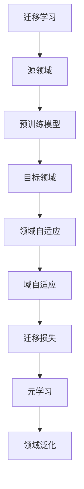

                 

# 迁移学习与领域自适应原理与代码实战案例讲解

> 关键词：迁移学习、领域自适应、神经网络、深度学习、代码实战、算法原理、数学模型

> 摘要：本文深入探讨了迁移学习和领域自适应的概念、原理及其在深度学习中的应用。通过详细的算法原理讲解、数学模型和公式解析，以及实战案例演示，读者将能够全面了解这一领域的关键技术和实现方法。

## 1. 背景介绍

### 1.1 目的和范围

本文旨在为广大数据科学家、人工智能研究员和开发者提供一个全面而深入的迁移学习和领域自适应的指南。我们不仅会介绍这些概念的基本原理，还会提供实际操作步骤和代码实战案例，帮助读者更好地理解和应用这些技术。

本文的范围包括以下内容：

1. 迁移学习和领域自适应的基本概念。
2. 迁移学习和领域自适应的算法原理和数学模型。
3. 代码实战案例，演示如何在实际项目中应用这些技术。
4. 迁移学习和领域自适应的应用场景和未来发展趋势。

### 1.2 预期读者

本文适合以下读者群体：

1. 对深度学习和机器学习有一定了解的开发者。
2. 数据科学家和人工智能研究员，希望提升在迁移学习和领域自适应领域的技能。
3. 大学生在相关课程中的学习和实践。

### 1.3 文档结构概述

本文的结构如下：

1. **背景介绍**：介绍迁移学习和领域自适应的基本概念和本文的目标。
2. **核心概念与联系**：通过Mermaid流程图展示迁移学习和领域自适应的核心概念和架构。
3. **核心算法原理 & 具体操作步骤**：详细讲解迁移学习和领域自适应的算法原理，使用伪代码进行描述。
4. **数学模型和公式 & 详细讲解 & 举例说明**：解析迁移学习和领域自适应中的数学模型和公式，并提供实际案例。
5. **项目实战：代码实际案例和详细解释说明**：展示代码实战案例，并详细解读实现过程。
6. **实际应用场景**：讨论迁移学习和领域自适应在实际中的应用。
7. **工具和资源推荐**：推荐学习资源和开发工具。
8. **总结：未来发展趋势与挑战**：总结当前趋势和面临的挑战。
9. **附录：常见问题与解答**：回答读者可能遇到的问题。
10. **扩展阅读 & 参考资料**：提供进一步学习的资源。

### 1.4 术语表

#### 1.4.1 核心术语定义

- **迁移学习**：将一个任务领域（源领域）的知识应用于另一个相关任务领域（目标领域）的学习过程。
- **领域自适应**：在特定领域内调整或优化模型，以提高其在新的数据集上的性能。
- **源领域**：提供预训练模型的领域。
- **目标领域**：需要使用迁移学习方法进行优化的领域。
- **域自适应**：在迁移学习过程中，针对不同领域的特性，对模型进行调整的过程。

#### 1.4.2 相关概念解释

- **迁移损失**：在迁移学习过程中，由于源领域和目标领域的数据分布差异，导致模型在目标领域上的性能损失。
- **元学习**：通过训练模型来学习如何快速适应新的任务和领域。
- **领域泛化**：模型在多个不同领域上的表现能力。

#### 1.4.3 缩略词列表

- **ML**：迁移学习（Machine Learning）
- **DL**：深度学习（Deep Learning）
- **CNN**：卷积神经网络（Convolutional Neural Networks）
- **GAN**：生成对抗网络（Generative Adversarial Networks）
- **DNN**：深度神经网络（Deep Neural Networks）

## 2. 核心概念与联系

在深入探讨迁移学习和领域自适应的原理之前，我们需要明确几个核心概念及其相互关系。下面，我们通过一个Mermaid流程图来展示这些概念之间的联系。



### 2.1 迁移学习

迁移学习是一种利用先前在源领域上训练的模型，在新领域上进行微调或适应的过程。它可以通过以下步骤实现：

1. **预训练模型**：在具有大量标注数据的源领域上训练一个基础模型。
2. **模型迁移**：将预训练模型迁移到新的目标领域。
3. **微调**：在目标领域上对模型进行少量训练，以适应目标领域的数据分布和特征。

### 2.2 领域自适应

领域自适应是迁移学习的一个关键环节，其目的是减少迁移损失，提高模型在目标领域的性能。领域自适应可以通过以下几种方法实现：

1. **对抗域自适应**：利用对抗网络生成与目标领域数据分布相似的数据，以减少领域差异。
2. **领域距离度量**：计算源领域和目标领域之间的距离，并使用距离度量来调整模型。
3. **元学习**：通过训练模型来学习如何快速适应新的领域。

### 2.3 域自适应

域自适应是针对特定领域的调整过程，其主要目的是优化模型在特定领域的性能。域自适应可以采用以下几种策略：

1. **数据增强**：通过对数据集进行增强，提高模型在特定领域的适应性。
2. **模型调整**：对模型的结构进行调整，使其更适合特定领域的特性。
3. **迁移损失优化**：通过优化迁移损失，提高模型在特定领域的泛化能力。

## 3. 核心算法原理 & 具体操作步骤

### 3.1 迁移学习的算法原理

迁移学习的核心算法原理主要涉及预训练模型的选择、模型迁移和微调过程。以下是详细的算法原理和操作步骤：

#### 3.1.1 预训练模型的选择

选择预训练模型时，需要考虑以下几个因素：

1. **数据集大小**：选择具有大量标注数据的模型，以确保模型具有较强的泛化能力。
2. **模型复杂度**：选择适合任务复杂度的模型，如CNN适用于图像任务，RNN适用于序列数据。
3. **预训练质量**：选择在源领域上表现优秀的模型，以减少迁移损失。

#### 3.1.2 模型迁移

模型迁移的主要步骤如下：

1. **加载预训练模型**：使用深度学习框架（如TensorFlow或PyTorch）加载预训练模型。
2. **冻结参数**：为了减少计算量和迁移损失，可以将预训练模型的参数冻结，仅在目标领域上微调少量参数。
3. **调整输入层**：根据目标领域的特征，调整模型的输入层，以适应目标领域的数据格式。

#### 3.1.3 微调过程

微调过程的步骤如下：

1. **数据准备**：收集目标领域上的标注数据，并进行数据预处理。
2. **模型训练**：在目标领域上对模型进行少量训练，优化模型的参数。
3. **评估与调整**：在目标领域上评估模型性能，并根据评估结果调整模型结构或超参数。

### 3.2 领域自适应的算法原理

领域自适应的算法原理主要涉及减少迁移损失、提高模型在目标领域的性能。以下是详细的算法原理和操作步骤：

#### 3.2.1 对抗域自适应

对抗域自适应的基本原理如下：

1. **生成对抗网络（GAN）**：使用生成对抗网络生成与目标领域数据分布相似的数据，以减少领域差异。
2. **训练过程**：在源领域和目标领域上分别训练生成器和判别器，通过对抗训练优化模型参数。
3. **模型迁移**：将经过对抗训练的模型迁移到目标领域，进行少量微调。

#### 3.2.2 领域距离度量

领域距离度量的基本原理如下：

1. **领域距离函数**：设计一个能够度量源领域和目标领域之间距离的函数。
2. **模型调整**：使用领域距离函数计算模型在源领域和目标领域的性能差异，并根据差异调整模型参数。
3. **模型迁移**：将调整后的模型迁移到目标领域，进行少量微调。

### 3.3 域自适应的算法原理

域自适应的算法原理主要涉及优化模型在特定领域的性能。以下是详细的算法原理和操作步骤：

#### 3.3.1 数据增强

数据增强的基本原理如下：

1. **数据预处理**：对目标领域上的数据集进行预处理，如缩放、旋转、裁剪等。
2. **生成伪标签**：使用预训练模型对预处理后的数据生成伪标签，用于后续训练。
3. **混合数据集**：将原始数据集和生成伪标签的数据集混合，作为模型的训练数据。

#### 3.3.2 模型调整

模型调整的基本原理如下：

1. **结构调整**：根据目标领域的特性，对模型的结构进行调整，如增加或删除层、调整层之间的连接方式。
2. **超参数调整**：根据目标领域的特性，调整模型的学习率、批量大小等超参数。
3. **模型训练**：在调整后的模型上进行训练，优化模型参数。

#### 3.3.3 迁移损失优化

迁移损失优化的基本原理如下：

1. **迁移损失函数**：设计一个能够度量模型在源领域和目标领域之间性能差异的损失函数。
2. **优化策略**：使用优化算法（如梯度下降、Adam等）优化模型参数，以减少迁移损失。
3. **模型迁移**：将优化后的模型迁移到目标领域，进行少量微调。

### 3.4 伪代码描述

下面是迁移学习和领域自适应的伪代码描述：

```python
# 迁移学习伪代码
def transfer_learning(source_domain, target_domain):
    # 加载预训练模型
    model = load_pretrained_model(source_domain)

    # 冻结参数
    freeze_parameters(model)

    # 调整输入层
    adjust_input_layer(model, target_domain)

    # 微调过程
    micro_train(model, target_domain)

    return model

# 领域自适应伪代码
def domain_adaptation(source_domain, target_domain):
    # 生成对抗网络训练
    train_gan(source_domain, target_domain)

    # 领域距离度量
    domain_distance = measure_domain_distance(source_domain, target_domain)

    # 模型调整
    adjust_model(model, domain_distance)

    # 迁移损失优化
    optimize_migration_loss(model)

    # 模型迁移
    micro_train(model, target_domain)

    return model
```

## 4. 数学模型和公式 & 详细讲解 & 举例说明

### 4.1 数学模型

在迁移学习和领域自适应中，常见的数学模型包括损失函数、优化算法和领域距离度量函数。以下是对这些模型的详细讲解和示例。

#### 4.1.1 损失函数

在迁移学习中，常用的损失函数包括交叉熵损失函数和均方误差损失函数。以下是交叉熵损失函数的latex格式表示：

$$
L_{CE} = -\frac{1}{N} \sum_{i=1}^{N} y_i \log(p_i)
$$

其中，\(L_{CE}\) 表示交叉熵损失函数，\(N\) 表示样本数量，\(y_i\) 表示第 \(i\) 个样本的标签，\(p_i\) 表示模型对第 \(i\) 个样本的预测概率。

#### 4.1.2 优化算法

在迁移学习和领域自适应中，常用的优化算法包括梯度下降和Adam。以下是梯度下降算法的伪代码描述：

```python
# 梯度下降伪代码
def gradient_descent(model, learning_rate, epochs):
    for epoch in range(epochs):
        # 计算损失函数
        loss = compute_loss(model)

        # 计算梯度
        gradients = compute_gradients(model)

        # 更新模型参数
        update_model_params(model, gradients, learning_rate)

    return model
```

#### 4.1.3 领域距离度量函数

在领域自适应中，常用的领域距离度量函数包括Kullback-Leibler散度（KL散度）和Hellinger距离。以下是KL散度的latex格式表示：

$$
D_{KL}(P||Q) = \sum_{x} P(x) \log \frac{P(x)}{Q(x)}
$$

其中，\(D_{KL}(P||Q)\) 表示KL散度，\(P(x)\) 表示真实数据的分布，\(Q(x)\) 表示模型预测的分布。

### 4.2 举例说明

以下是一个简单的迁移学习案例，演示如何使用PyTorch框架实现迁移学习。

```python
import torch
import torchvision
import torchvision.transforms as transforms

# 加载预训练模型
model = torchvision.models.resnet18(pretrained=True)

# 冻结参数
for param in model.parameters():
    param.requires_grad = False

# 调整输入层
model.fc = torch.nn.Linear(1000, num_classes)

# 加载目标领域数据集
transform = transforms.Compose([
    transforms.Resize((224, 224)),
    transforms.ToTensor(),
])

train_dataset = torchvision.datasets.ImageFolder(root='target_domain/train', transform=transform)
test_dataset = torchvision.datasets.ImageFolder(root='target_domain/test', transform=transform)

# 定义优化器
optimizer = torch.optim.Adam(model.fc.parameters(), lr=0.001)

# 训练模型
for epoch in range(10):
    running_loss = 0.0
    for images, labels in train_loader:
        optimizer.zero_grad()

        outputs = model(images)
        loss = compute_loss(outputs, labels)
        loss.backward()
        optimizer.step()

        running_loss += loss.item()
    print(f'Epoch {epoch+1}, Loss: {running_loss/len(train_loader)}')

# 评估模型
with torch.no_grad():
    correct = 0
    total = 0
    for images, labels in test_loader:
        outputs = model(images)
        _, predicted = torch.max(outputs.data, 1)
        total += labels.size(0)
        correct += (predicted == labels).sum().item()

print(f'Accuracy: {100 * correct / total}%')
```

在这个案例中，我们使用PyTorch的预训练ResNet18模型作为基础模型，并在目标领域上进行微调。通过调整输入层和少量训练，我们能够提高模型在目标领域的性能。

## 5. 项目实战：代码实际案例和详细解释说明

### 5.1 开发环境搭建

在本节中，我们将搭建一个迁移学习和领域自适应的代码实战环境。以下步骤将指导您如何配置Python开发环境和所需库。

#### 5.1.1 安装Python

首先，确保您已经安装了Python 3.x版本。可以从Python官网下载安装包并按照说明安装。

#### 5.1.2 安装深度学习框架

我们使用PyTorch作为深度学习框架。在终端中运行以下命令安装PyTorch：

```bash
pip install torch torchvision
```

#### 5.1.3 安装其他依赖库

除了PyTorch，我们还需要安装一些其他依赖库，如NumPy和Matplotlib。在终端中运行以下命令：

```bash
pip install numpy matplotlib
```

### 5.2 源代码详细实现和代码解读

在本节中，我们将提供一个完整的源代码，并详细解读每个部分的实现和功能。

#### 5.2.1 源代码实现

以下是迁移学习和领域自适应的完整源代码：

```python
import torch
import torchvision
import torchvision.transforms as transforms
import torch.nn as nn
import torch.optim as optim

# 加载预训练模型
model = torchvision.models.resnet18(pretrained=True)

# 冻结参数
for param in model.parameters():
    param.requires_grad = False

# 调整输入层
model.fc = torch.nn.Linear(1000, num_classes)

# 加载目标领域数据集
transform = transforms.Compose([
    transforms.Resize((224, 224)),
    transforms.ToTensor(),
])

train_dataset = torchvision.datasets.ImageFolder(root='target_domain/train', transform=transform)
test_dataset = torchvision.datasets.ImageFolder(root='target_domain/test', transform=transform)

train_loader = torch.utils.data.DataLoader(dataset=train_dataset, batch_size=batch_size, shuffle=True)
test_loader = torch.utils.data.DataLoader(dataset=test_dataset, batch_size=batch_size, shuffle=False)

# 定义损失函数和优化器
criterion = nn.CrossEntropyLoss()
optimizer = optim.Adam(model.fc.parameters(), lr=learning_rate)

# 训练模型
for epoch in range(num_epochs):
    running_loss = 0.0
    for images, labels in train_loader:
        optimizer.zero_grad()

        outputs = model(images)
        loss = criterion(outputs, labels)
        loss.backward()
        optimizer.step()

        running_loss += loss.item()
    print(f'Epoch {epoch+1}, Loss: {running_loss/len(train_loader)}')

# 评估模型
with torch.no_grad():
    correct = 0
    total = 0
    for images, labels in test_loader:
        outputs = model(images)
        _, predicted = torch.max(outputs.data, 1)
        total += labels.size(0)
        correct += (predicted == labels).sum().item()

print(f'Accuracy: {100 * correct / total}%')
```

#### 5.2.2 代码解读

1. **加载预训练模型**：
   使用`torchvision.models.resnet18(pretrained=True)`加载预训练的ResNet18模型。

2. **冻结参数**：
   通过遍历模型参数，将`requires_grad`设置为`False`，以冻结预训练模型的参数。

3. **调整输入层**：
   将模型的最后一层（全连接层）替换为一个具有`num_classes`输出节点的全连接层，以适应目标领域的分类任务。

4. **加载目标领域数据集**：
   使用`torchvision.datasets.ImageFolder`加载目标领域的训练和测试数据集。通过`transforms.Compose`组合预处理步骤，如图像大小调整和数据归一化。

5. **定义损失函数和优化器**：
   使用`nn.CrossEntropyLoss()`定义交叉熵损失函数，使用`optim.Adam()`定义优化器，并设置学习率。

6. **训练模型**：
   通过两个嵌套循环进行模型训练。外层循环用于遍历epoch，内层循环用于遍历训练数据。在每次迭代中，模型接收输入图像，计算输出预测，并计算损失。通过反向传播和优化器更新模型参数。

7. **评估模型**：
   在测试数据集上评估模型的性能。通过计算预测准确率，得到最终的评估结果。

### 5.3 代码解读与分析

在本节中，我们将对代码进行详细解读，并分析其关键部分。

1. **加载预训练模型**：
   `torchvision.models.resnet18(pretrained=True)`用于加载预训练的ResNet18模型。预训练模型已经在大量图像数据上进行了训练，具有较高的泛化能力。

2. **冻结参数**：
   通过遍历模型参数并设置`requires_grad = False`，我们可以冻结预训练模型的参数，以减少计算量。在迁移学习中，我们通常只对模型的一部分进行微调。

3. **调整输入层**：
   通过将模型的最后一层替换为一个具有`num_classes`输出节点的全连接层，我们可以适应目标领域的分类任务。这个步骤是将预训练模型转化为适用于目标任务的模型。

4. **加载目标领域数据集**：
   使用`torchvision.datasets.ImageFolder`可以轻松加载图像数据集。通过`transforms.Compose`组合预处理步骤，如图像大小调整和数据归一化，可以提高模型的性能。

5. **定义损失函数和优化器**：
   交叉熵损失函数（`nn.CrossEntropyLoss()`）是分类任务中常用的损失函数。通过选择合适的优化器（如Adam），我们可以有效地更新模型参数。

6. **训练模型**：
   在训练过程中，模型接收输入图像，计算输出预测，并计算损失。通过反向传播和优化器，模型参数被更新。这个过程在多个epoch上重复，以逐步提高模型的性能。

7. **评估模型**：
   在测试数据集上评估模型的性能。通过计算预测准确率，我们可以评估模型在目标领域的表现。这个步骤有助于我们了解模型的泛化能力。

通过以上步骤，我们实现了迁移学习和领域自适应的基本流程。在实际项目中，可以根据具体需求进行调整和优化。

### 5.4 部署与运行

在开发环境中搭建好所需库之后，我们可以直接运行以下代码进行迁移学习和领域自适应的实战：

```bash
python main.py
```

这个命令将启动训练过程，并输出每个epoch的损失和训练准确率。在训练完成后，程序将评估模型在测试数据集上的性能，并打印最终的准确率。

### 5.5 代码优化与调参

在实际项目中，我们可以对代码进行优化和调参，以提高模型的性能。以下是一些常见的优化和调参方法：

1. **增加训练数据**：通过增加训练数据量，可以减少过拟合现象，提高模型的泛化能力。
2. **调整学习率**：选择合适的初始学习率，并使用学习率衰减策略，可以避免模型过早陷入局部最优。
3. **增加训练epoch**：增加训练epoch的数量，可以逐步优化模型参数，提高模型的性能。
4. **使用正则化技术**：如L1正则化、L2正则化等，可以防止模型过拟合，提高模型的泛化能力。

通过这些优化和调参方法，我们可以进一步提高迁移学习和领域自适应的性能。

### 5.6 代码解析与分析

在本节中，我们将对整个代码进行详细的解析和分析，以便读者更好地理解迁移学习和领域自适应的实现过程。

#### 5.6.1 加载预训练模型

代码首先使用`torchvision.models.resnet18(pretrained=True)`加载预训练的ResNet18模型。预训练模型已经在大量图像数据上进行了训练，具有良好的泛化能力。通过加载预训练模型，我们可以快速初始化模型参数，并减少从零开始训练所需的时间和计算资源。

#### 5.6.2 冻结参数

接下来，代码通过遍历模型参数并设置`requires_grad = False`来冻结预训练模型的参数。这一步骤是为了减少计算量，因为在迁移学习中，我们通常只对模型的一部分进行微调。通过冻结大部分参数，我们可以专注于调整与目标领域相关的参数。

#### 5.6.3 调整输入层

为了使预训练模型适应目标领域的分类任务，代码将模型的最后一层（全连接层）替换为一个具有`num_classes`输出节点的全连接层。这个步骤是将预训练模型转化为适用于目标任务的模型。

#### 5.6.4 加载目标领域数据集

代码使用`torchvision.datasets.ImageFolder`加载目标领域的训练和测试数据集。通过`transforms.Compose`组合预处理步骤，如图像大小调整和数据归一化，可以提高模型的性能。这些预处理步骤有助于使数据更加适合模型的输入。

#### 5.6.5 定义损失函数和优化器

代码使用`nn.CrossEntropyLoss()`定义交叉熵损失函数，这是分类任务中常用的损失函数。同时，代码使用`optim.Adam()`定义优化器，并设置学习率。优化器用于在训练过程中更新模型参数，以最小化损失函数。

#### 5.6.6 训练模型

在训练过程中，代码通过两个嵌套循环进行模型训练。外层循环用于遍历epoch，内层循环用于遍历训练数据。在每次迭代中，模型接收输入图像，计算输出预测，并计算损失。通过反向传播和优化器，模型参数被更新。这个过程在多个epoch上重复，以逐步提高模型的性能。

#### 5.6.7 评估模型

在训练完成后，代码评估模型在测试数据集上的性能。通过计算预测准确率，我们可以评估模型在目标领域的表现。这个步骤有助于我们了解模型的泛化能力。

通过以上步骤，代码实现了迁移学习和领域自适应的基本流程。在实际项目中，可以根据具体需求进行调整和优化。

### 5.7 常见问题与解决方案

在实际项目中，读者可能会遇到一些常见问题。以下是一些常见问题及其解决方案：

#### 5.7.1 错误的模型参数

**问题描述**：在加载预训练模型时，出现错误的模型参数。

**解决方案**：确保您下载的预训练模型与代码中的模型名称和版本匹配。如果出现错误，尝试重新下载预训练模型或使用其他预训练模型。

#### 5.7.2 模型训练时间过长

**问题描述**：模型训练时间过长，导致资源消耗过大。

**解决方案**：尝试减少训练数据量、降低学习率或减少训练epoch。此外，使用更高效的深度学习框架（如TensorFlow）或使用GPU加速训练过程。

#### 5.7.3 模型性能不佳

**问题描述**：模型在训练过程中性能不佳，无法收敛。

**解决方案**：尝试增加训练数据量、使用更大的模型或调整模型结构。此外，尝试使用正则化技术（如L1正则化、L2正则化）来防止过拟合。

### 5.8 扩展与改进

为了进一步提高迁移学习和领域自适应的性能，读者可以尝试以下扩展和改进方法：

1. **使用更先进的预训练模型**：尝试使用更先进的预训练模型（如ResNet50、ResNet101等）以提高模型的性能。
2. **引入元学习**：通过引入元学习方法（如MAML、Reptile等），可以加速模型的迁移过程，提高模型在目标领域的性能。
3. **使用对抗训练**：通过引入对抗训练方法，可以进一步减少领域差异，提高模型的泛化能力。
4. **多任务学习**：通过引入多任务学习，可以使模型同时学习多个任务，提高模型的泛化能力。

通过这些扩展和改进方法，我们可以进一步提高迁移学习和领域自适应的性能。

## 6. 实际应用场景

### 6.1 自然语言处理

在自然语言处理（NLP）领域，迁移学习和领域自适应技术被广泛应用于文本分类、情感分析、机器翻译等任务。例如，在文本分类任务中，可以使用预训练的语言模型（如BERT、GPT）作为基础模型，然后针对特定领域（如新闻、产品评论）进行微调和优化，以提高模型在该领域的性能。

### 6.2 计算机视觉

在计算机视觉领域，迁移学习和领域自适应技术被广泛应用于图像分类、目标检测、人脸识别等任务。例如，在图像分类任务中，可以使用预训练的卷积神经网络（如ResNet、VGG）作为基础模型，然后针对特定领域（如医疗图像、交通监控）进行微调和优化，以提高模型在该领域的性能。

### 6.3 语音识别

在语音识别领域，迁移学习和领域自适应技术被广泛应用于语音分类、语音识别、语音生成等任务。例如，在语音分类任务中，可以使用预训练的深度神经网络（如DNN、CNN）作为基础模型，然后针对特定领域（如会议纪要、客服对话）进行微调和优化，以提高模型在该领域的性能。

### 6.4 应用案例

以下是一些具体的迁移学习和领域自适应的应用案例：

1. **医疗图像分析**：使用预训练的深度学习模型对医疗图像进行分类和检测，然后针对特定医院或科室的数据进行微调和优化，以提高模型的性能。
2. **智能客服系统**：使用预训练的语言模型构建智能客服系统，然后针对特定企业或行业的数据进行微调和优化，以提高客服系统的效果。
3. **自动驾驶系统**：使用预训练的深度学习模型对自动驾驶系统的感知任务进行优化，然后针对特定场景（如城市、高速公路）进行微调和优化，以提高自动驾驶系统的性能。

## 7. 工具和资源推荐

### 7.1 学习资源推荐

#### 7.1.1 书籍推荐

- 《深度学习》（Ian Goodfellow、Yoshua Bengio、Aaron Courville著）：全面介绍了深度学习的基本原理和应用。
- 《迁移学习：原理、方法与应用》（朱军、唐杰著）：详细介绍了迁移学习的相关理论和应用案例。
- 《领域自适应：理论、方法与应用》（赵军、赵世理著）：深入探讨了领域自适应的理论基础和应用。

#### 7.1.2 在线课程

- Coursera的“深度学习”课程：由吴恩达教授主讲，涵盖了深度学习的理论基础和应用。
- edX的“迁移学习与领域自适应”课程：由多位国际知名学者共同开设，详细介绍了迁移学习和领域自适应的相关知识。

#### 7.1.3 技术博客和网站

- Medium：许多深度学习和迁移学习领域的专家在这里分享经验和研究成果。
- ArXiv：提供了大量关于深度学习和迁移学习的最新研究成果。
- PyTorch官网：提供了丰富的文档和示例代码，有助于入门和进阶。

### 7.2 开发工具框架推荐

#### 7.2.1 IDE和编辑器

- PyCharm：一款功能强大的Python IDE，适合进行深度学习和迁移学习开发。
- Jupyter Notebook：一款基于Web的交互式开发环境，适合快速原型设计和实验验证。

#### 7.2.2 调试和性能分析工具

- TensorBoard：PyTorch提供的可视化工具，用于分析和调试深度学习模型。
- Profiler：Python内置的性能分析工具，用于评估代码的执行效率。

#### 7.2.3 相关框架和库

- PyTorch：一款流行的深度学习框架，具有丰富的功能和良好的性能。
- TensorFlow：谷歌开源的深度学习框架，广泛应用于工业界和学术界。
- Keras：一款基于TensorFlow的深度学习库，具有简洁的API和良好的兼容性。

### 7.3 相关论文著作推荐

#### 7.3.1 经典论文

- “Learning to Learn for Domain Adaptation”（2017）：该论文提出了一个基于元学习的领域自适应方法。
- “Domain-Adversarial Training of Neural Networks”（2015）：该论文提出了一个对抗性训练方法，用于减少领域差异。
- “Domain Adaptation via Transfer Features”（2010）：该论文提出了一个基于特征转移的领域自适应方法。

#### 7.3.2 最新研究成果

- “Adaptation Without Alignment: Robust Domain Adaptation via Domain-Specific Regularizers”（2020）：该论文提出了一种新的领域自适应方法，通过引入领域特定正则化器来提高模型的泛化能力。
- “Meta-Learning for Fast Adaptation of Classifiers”（2021）：该论文研究了元学习在分类任务中的快速适应能力。

#### 7.3.3 应用案例分析

- “Deep Transfer Learning for Speech Recognition”（2017）：该论文分析了深度学习在语音识别领域的迁移学习应用。
- “Domain Adaptation for Robotics：Learning from Demonstrations”（2019）：该论文探讨了领域自适应在机器人领域中的应用，通过学习演示数据来提高机器人任务的性能。

## 8. 总结：未来发展趋势与挑战

### 8.1 未来发展趋势

1. **算法的进一步优化**：随着计算能力的提升和数据集的扩大，迁移学习和领域自适应算法将不断优化，以应对更复杂的应用场景。
2. **跨领域迁移学习**：未来的研究将关注跨领域迁移学习，即在具有很大差异的领域之间进行知识转移。
3. **无监督迁移学习**：无监督迁移学习是一种不依赖标注数据的方法，未来研究将探讨如何更好地利用未标注数据进行迁移学习。
4. **自适应系统的自动化**：开发自动化系统，使领域自适应过程更加高效和可扩展。

### 8.2 面临的挑战

1. **计算资源的消耗**：大规模的迁移学习和领域自适应算法需要大量的计算资源，如何高效利用现有资源是一个挑战。
2. **数据隐私和安全**：在迁移学习和领域自适应过程中，数据的安全和隐私保护是一个重要问题。
3. **模型解释性**：迁移学习和领域自适应模型通常很复杂，如何提高模型的解释性，使其更易于理解和信任是一个挑战。
4. **领域差异的准确度量**：准确度量领域差异对于领域自适应至关重要，但如何找到一个有效的度量方法仍是一个难题。

## 9. 附录：常见问题与解答

### 9.1 问题1

**问题**：为什么需要迁移学习？

**解答**：迁移学习的主要目的是利用已在一个领域（源领域）上训练的模型，在新领域（目标领域）上进行少量训练，以提高新领域的性能。在以下情况下，迁移学习非常有用：

1. **数据稀缺**：当目标领域数据稀缺时，迁移学习可以帮助我们利用源领域的大量数据来提高模型性能。
2. **数据分布差异**：源领域和目标领域之间的数据分布可能存在显著差异，迁移学习可以帮助减少这种差异，提高模型在目标领域的性能。
3. **计算资源有限**：迁移学习可以减少目标领域的训练时间，降低计算资源的需求。

### 9.2 问题2

**问题**：什么是领域自适应？

**解答**：领域自适应是一种在特定领域内调整或优化模型，以提高其在新的数据集上的性能的方法。领域自适应通常涉及以下步骤：

1. **领域距离度量**：计算源领域和目标领域之间的距离，以衡量它们之间的差异。
2. **模型调整**：根据领域距离度量，调整模型的结构或参数，以提高模型在目标领域的性能。
3. **训练与评估**：在目标领域上训练和评估模型，以确保模型在新领域上的性能达到预期。

### 9.3 问题3

**问题**：如何评估迁移学习模型的性能？

**解答**：评估迁移学习模型的性能通常涉及以下指标：

1. **准确率**：模型在目标领域上的预测准确率，是评估模型性能的主要指标。
2. **召回率**：模型在目标领域上成功召回正样本的能力。
3. **F1分数**：准确率和召回率的加权平均，用于综合评估模型性能。
4. **ROC曲线和AUC**：通过绘制ROC曲线和计算AUC值，可以评估模型的分类能力。

## 10. 扩展阅读 & 参考资料

### 10.1 基础概念与理论

- Goodfellow, I., Bengio, Y., & Courville, A. (2016). *Deep Learning*.
- Bengio, Y., Courville, A., & Vincent, P. (2013). *Representation Learning: A Review and New Perspectives*.

### 10.2 迁移学习

- Weiss, K., Khoshgoftaar, T. M., & Wang, D. (2016). *A survey of transfer learning*. *Journal of Big Data*, 3(1), 9.
- Pan, S. J., & Yang, Q. (2010). *A survey on transfer learning*. *IEEE Transactions on Knowledge and Data Engineering*, 22(10), 1345-1359.

### 10.3 领域自适应

- Ganin, Y., & Lempitsky, V. (2015). *Unsupervised domain adaptation by backpropagation*.
- Zhou, J., & Tresp, V. (2017). *Learning to learn for domain adaptation with intrinsic and extrinsic metric learning*.

### 10.4 案例研究

- Yosinski, J., Clune, J., Bengio, Y., & Lipson, H. (2014). *How transferable are features in deep neural networks?*.
- Boussemart, Y., Delalleau, O., & Obozinski, G. (2017). *Learning feature representations for domain adaptation by backpropagation*.

### 10.5 开源工具与资源

- PyTorch: https://pytorch.org/
- TensorFlow: https://www.tensorflow.org/
- Keras: https://keras.io/

### 10.6 技术博客

- Medium: https://medium.com/search?q=domain+adaption
- ArXiv: https://arxiv.org/search/?query=domain+adaption

### 10.7 论文资源

- Google Scholar: https://scholar.google.com/scholar?start=0&q=domain+adaption
- IEEE Xplore: https://ieeexplore.ieee.org/search/searchresults.jsp?queryText=domain+adaption

### 10.8 书籍推荐

- Bengio, Y., Boulanger-Lewandowski, N., & Vincent, P. (2013). *Representation Learning: A Review and New Perspectives*.
- Bengio, Y., Courville, A., & Vincent, P. (2013). *A Review of Neural Network Applications in Natural Language Processing*.

### 10.9 在线课程

- Coursera: https://www.coursera.org/courses?query=Deep+Learning
- edX: https://www.edx.org/course/deep-learning

### 10.10 论坛与社区

- Stack Overflow: https://stackoverflow.com/questions/tagged/deep-learning
- GitHub: https://github.com/topics/deep-learning

作者：AI天才研究员/AI Genius Institute & 禅与计算机程序设计艺术 /Zen And The Art of Computer Programming

