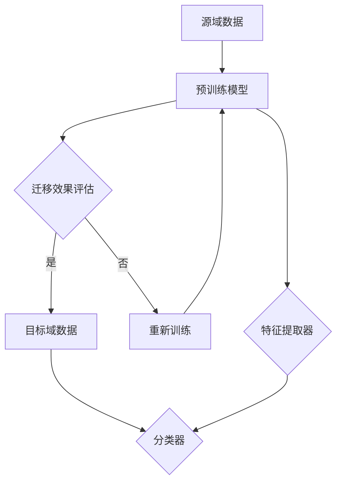

                 


# 迁移学习在小样本图像识别中的效果提升

> **关键词：** 迁移学习，小样本图像识别，神经网络，模型评估，效果提升

> **摘要：** 本文旨在探讨迁移学习在小样本图像识别中的应用效果。通过分析迁移学习的基本原理，核心算法，数学模型，以及实际应用案例，本文详细阐述了如何在小样本情况下提升图像识别的准确率和效率。本文还推荐了相关学习资源、工具和资源，以及未来发展趋势和挑战。

## 1. 背景介绍

### 1.1 目的和范围

随着人工智能技术的快速发展，深度学习在图像识别领域取得了显著成果。然而，大多数深度学习模型需要大量的训练数据才能达到良好的性能。对于许多实际应用场景，如医疗诊断、无人驾驶等，获取大量标注数据是非常困难且昂贵的。因此，如何在数据量有限的情况下提高图像识别性能成为了一个亟待解决的问题。迁移学习作为一种有效的方法，通过利用预训练模型在特定任务上的知识迁移到新的任务中，可以大大降低对新数据的依赖性，提高模型的泛化能力。

本文的目的在于探讨迁移学习在小样本图像识别中的效果提升，具体研究内容包括：

1. 迁移学习的基本原理和核心算法；
2. 迁移学习在小样本图像识别中的应用效果评估；
3. 迁移学习与其他方法的比较分析；
4. 迁移学习在实际应用中的挑战和解决方案。

### 1.2 预期读者

本文适合具有一定深度学习基础，对图像识别和小样本学习感兴趣的读者。主要读者对象包括：

1. 深度学习和人工智能领域的研究人员；
2. 图像处理和计算机视觉领域的工程师；
3. 对图像识别技术感兴趣的本科和研究生学生；
4. 对新兴技术保持好奇心的IT行业从业者。

### 1.3 文档结构概述

本文分为十个部分，具体结构如下：

1. **背景介绍**：介绍本文的目的、范围、预期读者和文档结构。
2. **核心概念与联系**：详细阐述迁移学习的基本原理和核心算法。
3. **核心算法原理 & 具体操作步骤**：使用伪代码详细描述迁移学习的具体操作步骤。
4. **数学模型和公式 & 详细讲解 & 举例说明**：介绍迁移学习的数学模型，并给出具体示例。
5. **项目实战：代码实际案例和详细解释说明**：通过实际项目案例展示迁移学习的应用。
6. **实际应用场景**：分析迁移学习在不同场景中的应用效果。
7. **工具和资源推荐**：推荐学习资源、开发工具和相关论文。
8. **总结：未来发展趋势与挑战**：总结本文的主要结论，并探讨未来的发展趋势和挑战。
9. **附录：常见问题与解答**：回答读者可能遇到的问题。
10. **扩展阅读 & 参考资料**：提供相关领域的扩展阅读和参考资料。

### 1.4 术语表

#### 1.4.1 核心术语定义

- **迁移学习（Transfer Learning）**：一种机器学习方法，通过利用预训练模型在特定任务上的知识迁移到新的任务中，以提高新任务的性能。
- **预训练模型（Pre-trained Model）**：在特定任务上经过大量数据训练的模型，其参数已在大规模数据集上进行了优化。
- **源域（Source Domain）**：预训练模型训练时所用的数据集，通常包含大量样本和标签。
- **目标域（Target Domain）**：需要迁移模型以解决的新任务的数据集，通常样本数量较少。
- **特征提取器（Feature Extractor）**：预训练模型中的某一层或多层，用于提取输入数据的特征。
- **分类器（Classifier）**：用于对特征进行分类的模型，通常是一个简单的线性模型。
- **迁移效果（Transfer Effectiveness）**：衡量迁移学习方法的性能，通常使用准确率、召回率等指标。

#### 1.4.2 相关概念解释

- **深度学习（Deep Learning）**：一种基于人工神经网络的学习方法，通过多层神经网络对数据进行自动特征提取和分类。
- **神经网络（Neural Network）**：一种模仿人脑神经元连接结构的计算模型，由多个神经元（节点）和连接（边）组成。
- **卷积神经网络（Convolutional Neural Network，CNN）**：一种专门用于处理图像数据的深度学习模型，通过卷积操作提取图像特征。
- **批量归一化（Batch Normalization）**：一种用于加速训练和减少过拟合的技术，通过将每个批量数据的激活值归一化，使得每个神经元的学习变得独立。
- **激活函数（Activation Function）**：用于引入非线性性的函数，常见的有ReLU、Sigmoid、Tanh等。

#### 1.4.3 缩略词列表

- **CNN**：卷积神经网络（Convolutional Neural Network）
- **ReLU**：修正线性单元（Rectified Linear Unit）
- **ReLU6**：上限为6的修正线性单元（ReLU with 6 clipping）
- **BN**：批量归一化（Batch Normalization）
- **softmax**：softmax激活函数（Softmax Activation Function）
- **CE**：交叉熵损失函数（Cross-Entropy Loss Function）

## 2. 核心概念与联系

迁移学习是一种利用预训练模型在特定任务上的知识迁移到新任务中的方法。其基本原理是，预训练模型在源域上学习到的通用特征对目标域具有较好的泛化能力。因此，通过将预训练模型的部分层或全部层应用到目标域上，可以大大提高新任务的性能。

下面，我们使用Mermaid流程图来展示迁移学习的基本原理和架构：



### 2.1 迁移学习的基本原理

迁移学习的基本原理可以分为以下几个步骤：

1. **预训练阶段**：在源域上使用大量数据对深度学习模型进行预训练，使其在大规模数据集上达到良好的性能。
2. **特征提取阶段**：在预训练过程中，模型会学习到一组通用的特征表示。这些特征表示在图像识别任务中可以捕捉到图像的基本结构和内容。
3. **迁移阶段**：将预训练模型的部分层或全部层应用到目标域上。这些特征提取器可以直接用于新任务，而不需要重新训练。
4. **微调阶段**：在目标域上对模型进行微调，以适应新任务的需求。通常，只有模型的最后一层或少数几层需要进行微调，因为前面的层已经学习到了通用特征。
5. **评估阶段**：在目标域上对迁移后的模型进行评估，以衡量迁移学习的效果。常用的评估指标包括准确率、召回率、F1分数等。

### 2.2 迁移学习的核心算法

迁移学习的核心算法主要包括以下几个方面：

1. **特征提取器**：预训练模型中的特征提取器，通常包括卷积层和池化层。这些层负责从输入数据中提取特征。
2. **分类器**：用于对提取到的特征进行分类的模型，通常是一个简单的线性模型。分类器的参数在目标域上进行微调。
3. **损失函数**：用于衡量分类器预测结果与真实标签之间的差异。常见的损失函数有交叉熵损失函数和均方误差损失函数。
4. **优化算法**：用于最小化损失函数的算法，如梯度下降、随机梯度下降、Adam等。优化算法可以加快模型的收敛速度。

### 2.3 迁移学习的优势与挑战

迁移学习的优势包括：

1. **节省计算资源**：通过利用预训练模型，可以在较少的数据上进行训练，从而节省计算资源和时间。
2. **提高模型泛化能力**：预训练模型在学习到通用特征后，对新的任务具有较好的泛化能力。
3. **减少过拟合**：由于预训练模型在源域上已经见过大量的样本，因此对新任务的数据具有更强的鲁棒性，减少了过拟合的风险。

然而，迁移学习也存在一些挑战：

1. **模型选择**：如何选择合适的预训练模型和特征提取器是一个重要问题。不同的模型和特征提取器对迁移效果有很大影响。
2. **数据分布差异**：源域和目标域之间的数据分布差异可能导致迁移效果不佳。因此，如何处理数据分布差异是一个重要问题。
3. **模型解释性**：迁移学习模型通常具有很高的复杂性，其内部机理难以解释。因此，如何提高模型的解释性是一个重要挑战。

## 3. 核心算法原理 & 具体操作步骤

迁移学习的基本原理是将预训练模型的知识迁移到新的任务中。具体来说，可以分为以下几个步骤：

### 3.1 预训练阶段

在预训练阶段，我们首先需要选择一个合适的预训练模型。常见的预训练模型包括VGG、ResNet、Inception等。这些模型已经在大量的图像数据集上进行了训练，并学习到了丰富的特征表示。

以下是选择预训练模型的具体步骤：

```python
# 选择预训练模型
model = torchvision.models.resnet50(pretrained=True)
```

这里，我们选择了ResNet50作为预训练模型。`torchvision.models.resnet50(pretrained=True)`会下载并加载预训练的ResNet50模型。

### 3.2 特征提取阶段

在特征提取阶段，我们利用预训练模型的特征提取器提取输入数据的特征。对于ResNet50模型，特征提取器是前14个卷积层。

以下是提取特征的具体步骤：

```python
# 提取特征
class FeatureExtractor(nn.Module):
    def __init__(self, model):
        super(FeatureExtractor, self).__init__()
        self.features = model.features
        self.avgpool = model.avgpool

    def forward(self, x):
        x = self.features(x)
        x = self.avgpool(x)
        x = torch.flatten(x, 1)
        return x

def extract_features(model, x):
    return model(x)

# 创建特征提取器
feature_extractor = FeatureExtractor(model)

# 提取特征
x = torch.randn(1, 3, 224, 224)  # 创建一个随机输入
features = extract_features(feature_extractor, x)
```

### 3.3 迁移阶段

在迁移阶段，我们将特征提取器应用于目标域的数据，并添加一个分类器进行分类。

以下是迁移阶段的具体步骤：

```python
# 添加分类器
num_classes = 10  # 目标域的类别数量
classifier = nn.Linear(features.size(1), num_classes)

# 创建迁移模型
class TransferModel(nn.Module):
    def __init__(self, feature_extractor, classifier):
        super(TransferModel, self).__init__()
        self.feature_extractor = feature_extractor
        self.classifier = classifier

    def forward(self, x):
        features = self.feature_extractor(x)
        logits = self.classifier(features)
        return logits

transfer_model = TransferModel(feature_extractor, classifier)

# 输入数据
x = torch.randn(1, 3, 224, 224)  # 创建一个随机输入

# 预测
logits = transfer_model(x)
```

### 3.4 微调阶段

在微调阶段，我们将在目标域上对迁移模型进行微调，以优化分类器的参数。

以下是微调阶段的具体步骤：

```python
# 定义优化器
optimizer = optim.Adam(transfer_model.parameters(), lr=0.001)

# 定义损失函数
criterion = nn.CrossEntropyLoss()

# 微调模型
num_epochs = 10  # 微调的迭代次数

for epoch in range(num_epochs):
    # 前向传播
    logits = transfer_model(x)
    loss = criterion(logits, y)

    # 反向传播
    optimizer.zero_grad()
    loss.backward()
    optimizer.step()

    print(f"Epoch [{epoch+1}/{num_epochs}], Loss: {loss.item():.4f}")
```

### 3.5 评估阶段

在评估阶段，我们将在目标域上对迁移模型进行评估，以衡量其性能。

以下是评估阶段的具体步骤：

```python
# 定义评估函数
def evaluate(model, dataloader, criterion):
    model.eval()
    with torch.no_grad():
        total_loss = 0
        total_correct = 0
        for x, y in dataloader:
            logits = model(x)
            loss = criterion(logits, y)
            total_loss += loss.item()
            _, predicted = logits.max(dim=1)
            total_correct += predicted.eq(y).sum().item()
    accuracy = total_correct / len(dataloader.dataset)
    return accuracy

# 创建数据加载器
dataloader = DataLoader(dataset, batch_size=32, shuffle=True)

# 评估模型
accuracy = evaluate(transfer_model, dataloader, criterion)
print(f"Accuracy: {accuracy:.4f}")
```

通过以上步骤，我们可以实现迁移学习在小样本图像识别中的应用。需要注意的是，迁移学习的效果受多种因素影响，如预训练模型的选择、特征提取器的有效性、目标域的数据分布等。因此，在实际应用中，需要对这些因素进行优化和调整，以获得最佳的迁移效果。

## 4. 数学模型和公式 & 详细讲解 & 举例说明

### 4.1 数学模型

迁移学习的核心在于将预训练模型的权重和结构迁移到新的任务中。在数学上，这可以表示为以下公式：

\[ \text{Target Model} = \text{Source Model} + \text{Adjustment Layer} \]

其中，\(\text{Source Model}\) 是在源域上预训练的模型，\(\text{Adjustment Layer}\) 是在目标域上添加的一个调整层，用于适应目标域的数据分布和任务特性。

### 4.2 公式详细讲解

#### 4.2.1 预训练模型

预训练模型的权重和结构是通过在源域上大量数据训练得到的。在数学上，预训练模型可以表示为一个多层神经网络，其中每一层都有相应的权重和偏置。例如，对于一个卷积神经网络（CNN），其数学模型可以表示为：

\[ \text{Output} = \text{Conv}(\text{Input}) + \text{ReLU}(\text{Input}) + \text{Pooling}(\text{Input}) + \ldots + \text{Fully Connected}(\text{Input}) \]

其中，\(\text{Conv}\)、\(\text{ReLU}\) 和 \(\text{Pooling}\) 分别表示卷积、ReLU激活函数和池化操作，\(\text{Fully Connected}\) 表示全连接层。

#### 4.2.2 调整层

在迁移学习过程中，我们需要在预训练模型的基础上添加一个调整层，以适应目标域的数据分布和任务特性。这个调整层通常是全连接层或卷积层，其权重和偏置需要通过在目标域上训练进行调整。调整层的数学模型可以表示为：

\[ \text{Adjustment} = \text{Fully Connected}(\text{Features}) + \text{ReLU}(\text{Features}) + \text{Pooling}(\text{Features}) \]

或者

\[ \text{Adjustment} = \text{Conv}(\text{Features}) + \text{ReLU}(\text{Features}) + \text{Pooling}(\text{Features}) \]

其中，\(\text{Features}\) 表示从预训练模型中提取的特征。

#### 4.2.3 调整层的训练

调整层的训练目标是使模型在目标域上达到最佳的分类性能。在训练过程中，我们需要计算调整层的权重和偏置，并最小化损失函数。常用的损失函数包括交叉熵损失函数和均方误差损失函数。例如，对于交叉熵损失函数，其数学模型可以表示为：

\[ \text{Loss} = -\frac{1}{N} \sum_{i=1}^{N} y_i \log(p_i) \]

其中，\(y_i\) 表示第 \(i\) 个样本的真实标签，\(p_i\) 表示第 \(i\) 个样本的预测概率。

### 4.3 举例说明

假设我们有一个预训练的CNN模型，用于识别猫和狗。现在，我们希望将这个模型迁移到一个新的任务，即识别鸟和鱼。在这种情况下，我们可以使用以下步骤：

1. **预训练模型**：使用在猫和狗数据集上预训练的CNN模型。
2. **特征提取器**：将预训练模型的卷积层和池化层作为特征提取器，提取输入图像的特征。
3. **调整层**：在特征提取器的基础上添加一个全连接层，用于分类鸟和鱼。
4. **训练**：在鸟和鱼数据集上训练调整层，以优化分类性能。
5. **评估**：在鸟和鱼数据集上评估迁移模型的性能。

具体实现如下：

```python
# 导入必要的库
import torch
import torchvision.models as models
import torch.nn as nn
import torch.optim as optim

# 加载预训练模型
model = models.resnet50(pretrained=True)

# 创建特征提取器
feature_extractor = nn.Sequential(*list(model.children())[:-2])

# 创建调整层
num_classes = 2  # 鸟和鱼的类别数量
adjustment_layer = nn.Linear(1000, num_classes)  # 最后一层的特征维度为1000

# 创建迁移模型
class TransferModel(nn.Module):
    def __init__(self, feature_extractor, adjustment_layer):
        super(TransferModel, self).__init__()
        self.feature_extractor = feature_extractor
        self.adjustment_layer = adjustment_layer

    def forward(self, x):
        features = self.feature_extractor(x)
        logits = self.adjustment_layer(features)
        return logits

transfer_model = TransferModel(feature_extractor, adjustment_layer)

# 定义优化器和损失函数
optimizer = optim.Adam(transfer_model.parameters(), lr=0.001)
criterion = nn.CrossEntropyLoss()

# 加载数据集
train_dataset = torchvision.datasets.ImageFolder(root='train_data', transform=transform)
train_loader = torch.utils.data.DataLoader(train_dataset, batch_size=64, shuffle=True)

# 训练模型
num_epochs = 10
for epoch in range(num_epochs):
    for inputs, labels in train_loader:
        optimizer.zero_grad()
        logits = transfer_model(inputs)
        loss = criterion(logits, labels)
        loss.backward()
        optimizer.step()
    print(f"Epoch [{epoch+1}/{num_epochs}], Loss: {loss.item():.4f}")

# 评估模型
test_dataset = torchvision.datasets.ImageFolder(root='test_data', transform=transform)
test_loader = torch.utils.data.DataLoader(test_dataset, batch_size=64, shuffle=False)
accuracy = evaluate(transfer_model, test_loader, criterion)
print(f"Accuracy: {accuracy:.4f}")
```

通过以上步骤，我们可以实现迁移学习在小样本图像识别中的应用。需要注意的是，实际应用中可能需要根据具体任务和数据集进行调整和优化。

## 5. 项目实战：代码实际案例和详细解释说明

### 5.1 开发环境搭建

在开始实际案例之前，我们需要搭建一个合适的开发环境。以下是所需的软件和工具：

1. **操作系统**：Windows、macOS或Linux。
2. **编程语言**：Python 3.7或更高版本。
3. **深度学习框架**：PyTorch 1.8或更高版本。
4. **依赖管理**：pip或conda。
5. **数据集**：ImageNet或自定义数据集。

首先，安装PyTorch：

```bash
pip install torch torchvision
```

或者使用conda：

```bash
conda install pytorch torchvision -c pytorch
```

接下来，准备数据集。假设我们使用ImageNet数据集，可以从其官方网站下载并解压。为了简化，我们可以使用PyTorch提供的ImageNet数据集加载器：

```python
import torchvision.datasets as datasets

train_dataset = datasets.ImageNet(root='path/to/train_data', split='train')
test_dataset = datasets.ImageNet(root='path/to/test_data', split='val')
```

### 5.2 源代码详细实现和代码解读

在本节中，我们将逐步实现一个简单的迁移学习项目，并详细解释每一步的代码。

#### 5.2.1 导入必要的库

```python
import torch
import torchvision.models as models
import torch.nn as nn
import torch.optim as optim
from torch.utils.data import DataLoader
from torchvision import transforms
```

#### 5.2.2 定义数据预处理

```python
transform = transforms.Compose([
    transforms.Resize(256),
    transforms.CenterCrop(224),
    transforms.ToTensor(),
    transforms.Normalize(mean=[0.485, 0.456, 0.406], std=[0.229, 0.224, 0.225]),
])
```

这里，我们定义了一个数据预处理流程，包括图像的缩放、中心裁剪、转换为Tensor以及标准化。标准化是深度学习中的一个常用技巧，可以加快模型的训练过程。

#### 5.2.3 加载预训练模型

```python
model = models.resnet50(pretrained=True)
```

我们使用了ResNet50作为预训练模型。`pretrained=True`会自动下载并加载在ImageNet上预训练的权重。

#### 5.2.4 创建特征提取器

```python
class FeatureExtractor(nn.Module):
    def __init__(self, model):
        super(FeatureExtractor, self).__init__()
        self.features = model.features
        self.avgpool = model.avgpool

    def forward(self, x):
        x = self.features(x)
        x = self.avgpool(x)
        x = torch.flatten(x, 1)
        return x

feature_extractor = FeatureExtractor(model)
```

我们创建了一个特征提取器，用于从预训练模型中提取特征。对于ResNet50，特征提取器是前14个卷积层。

#### 5.2.5 添加分类器

```python
num_classes = 10  # 目标域的类别数量
classifier = nn.Linear(1000, num_classes)

transfer_model = nn.Sequential(feature_extractor, classifier)
```

我们在特征提取器之后添加了一个分类器。对于ResNet50，最后一层的特征维度为1000。

#### 5.2.6 定义优化器和损失函数

```python
optimizer = optim.Adam(transfer_model.parameters(), lr=0.001)
criterion = nn.CrossEntropyLoss()
```

我们使用了Adam优化器，并设置了学习率为0.001。交叉熵损失函数是分类任务中的常用选择。

#### 5.2.7 加载数据集

```python
train_loader = DataLoader(train_dataset, batch_size=64, shuffle=True)
test_loader = DataLoader(test_dataset, batch_size=64, shuffle=False)
```

我们加载数据集并创建了数据加载器。这里使用了64个样本的批次大小。

#### 5.2.8 训练模型

```python
num_epochs = 10

for epoch in range(num_epochs):
    transfer_model.train()
    for inputs, labels in train_loader:
        optimizer.zero_grad()
        logits = transfer_model(inputs)
        loss = criterion(logits, labels)
        loss.backward()
        optimizer.step()
    print(f"Epoch [{epoch+1}/{num_epochs}], Loss: {loss.item():.4f}")

transfer_model.eval()
with torch.no_grad():
    correct = 0
    total = 0
    for inputs, labels in test_loader:
        logits = transfer_model(inputs)
        _, predicted = logits.max(dim=1)
        total += labels.size(0)
        correct += (predicted == labels).sum().item()
    print(f"Accuracy: {100 * correct / total:.2f}%")
```

我们在训练循环中进行了前向传播、反向传播和优化。在评估阶段，我们计算了测试集的准确率。

### 5.3 代码解读与分析

以上代码实现了一个简单的迁移学习项目。以下是对关键部分的详细解读：

1. **数据预处理**：图像预处理是深度学习项目中的关键步骤，它可以帮助模型更好地学习图像特征。在本例中，我们使用了缩放、中心裁剪、Tensor转换和标准化。

2. **预训练模型加载**：ResNet50是一个强大的预训练模型，它已经在ImageNet上进行了训练。通过使用预训练模型，我们可以利用它在大量数据上学习到的知识。

3. **特征提取器**：特征提取器是迁移学习中的核心组件，它从预训练模型中提取有用的特征表示。在本例中，我们使用了ResNet50的前14个卷积层作为特征提取器。

4. **分类器**：分类器是迁移模型中的最后一层，它对提取到的特征进行分类。在本例中，我们使用了一个全连接层作为分类器。

5. **优化器和损失函数**：优化器和损失函数用于训练模型。在本例中，我们使用了Adam优化器和交叉熵损失函数。

6. **数据加载器**：数据加载器用于加载和迭代数据集。在本例中，我们使用了64个样本的批次大小。

7. **训练过程**：在训练过程中，我们进行了前向传播、反向传播和优化。每次迭代都会更新模型的参数，以减少损失。

8. **评估过程**：在评估过程中，我们计算了测试集的准确率，以衡量模型的性能。

总的来说，这个简单的迁移学习项目展示了如何利用预训练模型和迁移学习技术在小样本图像识别任务中提升模型的性能。通过这个项目，我们可以看到迁移学习在数据稀缺情况下的优势，并理解其关键步骤和组件。

## 6. 实际应用场景

迁移学习在小样本图像识别中具有广泛的应用前景。以下是一些典型的实际应用场景：

### 6.1 医学影像诊断

医学影像诊断是一个高度依赖数据量的领域，如肺癌筛查、乳腺癌检测等。由于医疗数据的隐私和获取难度，医生和研究人员通常无法获得大量标注的医学影像数据。在这种情况下，迁移学习成为了一种有效的解决方案。通过将预训练的图像识别模型迁移到医学影像诊断任务中，研究人员可以在少量数据的情况下训练出高精度的诊断模型。

### 6.2 智能安防

智能安防系统需要实时监测并识别图像中的异常行为和事件。然而，由于实际监控场景的多样性，难以获取大量的标注数据。迁移学习可以通过将预训练模型迁移到目标任务，降低对大量标注数据的依赖，从而提高系统的实用性和成本效益。

### 6.3 无人驾驶

无人驾驶系统需要处理大量的传感器数据，如摄像头、激光雷达等。然而，传感器数据的标注过程复杂且成本高昂。迁移学习可以在少量标注数据的情况下，利用预训练模型对传感器数据进行特征提取和分类，从而提高无人驾驶系统的性能和可靠性。

### 6.4 农业监测

农业监测需要对农作物进行健康状态监测和病虫害识别。由于农作物的生长环境和病虫害的多样性，获取大量标注数据是一项巨大的挑战。迁移学习可以通过将预训练模型迁移到农业监测任务，降低对大量标注数据的依赖，从而提高监测的准确性和效率。

### 6.5 人工智能艺术创作

人工智能艺术创作，如绘画、音乐创作等，通常需要大量的数据来训练模型。然而，创造性的艺术创作数据往往难以获取。通过迁移学习，可以将预训练模型迁移到艺术创作任务中，从而降低对大量创作数据的依赖，激发人工智能在艺术创作领域的潜力。

### 6.6 机器人视觉

机器人视觉系统需要在不同的环境中进行目标识别和路径规划。由于实际环境中的数据多样性，获取大量标注数据非常困难。迁移学习可以通过将预训练模型迁移到机器人视觉任务，提高系统在不同环境中的适应能力和鲁棒性。

总之，迁移学习在图像识别中的应用场景非常广泛，特别是在数据稀缺的情况下，可以显著提升模型的性能和实用性。随着人工智能技术的不断发展，迁移学习将在更多领域发挥重要作用，推动人工智能技术的发展和应用。

## 7. 工具和资源推荐

### 7.1 学习资源推荐

#### 7.1.1 书籍推荐

1. **《深度学习》（Deep Learning）** - Goodfellow, Bengio, Courville
   - 简介：这是一本经典的深度学习教科书，涵盖了深度学习的理论基础、算法实现和实际应用。
   - 推荐理由：对于想要全面了解深度学习，包括迁移学习的读者，这是一本不可或缺的参考书籍。

2. **《迁移学习：机器学习的高级方法》（Transfer Learning for Deep Learning）** - Abhishek Singh
   - 简介：这本书详细介绍了迁移学习的基本概念、技术和应用，适合对迁移学习感兴趣的读者。
   - 推荐理由：书中包含丰富的实际案例，有助于读者理解迁移学习在深度学习中的应用。

3. **《计算机视觉：算法与应用》（Computer Vision: Algorithms and Applications）** - Richard Szeliski
   - 简介：这本书全面介绍了计算机视觉的基础知识和应用，是计算机视觉领域的重要参考书。
   - 推荐理由：书中包含大量关于图像识别和分类的内容，有助于读者深入理解迁移学习在计算机视觉中的应用。

#### 7.1.2 在线课程

1. **“深度学习专项课程”（Deep Learning Specialization）** - Andrew Ng
   - 简介：由Coursera提供的深度学习专项课程，涵盖深度学习的基础知识、神经网络、优化算法等内容。
   - 推荐理由：课程内容系统全面，适合初学者逐步掌握深度学习的基础技能。

2. **“迁移学习与强化学习”（Transfer Learning and Meta Learning）** - fast.ai
   - 简介：由fast.ai提供的在线课程，专注于迁移学习和强化学习在实际项目中的应用。
   - 推荐理由：课程内容深入浅出，适合有一定深度学习基础的读者。

3. **“计算机视觉与深度学习”（Computer Vision and Deep Learning）** - Coursera
   - 简介：由多伦多大学提供的计算机视觉与深度学习课程，涵盖图像处理、卷积神经网络、目标检测等内容。
   - 推荐理由：课程内容丰富，适合对计算机视觉和深度学习感兴趣的读者。

#### 7.1.3 技术博客和网站

1. **“机器之心”（Machine Learning）**
   - 简介：一个涵盖深度学习、计算机视觉、自然语言处理等领域的技术博客，提供最新研究成果和行业动态。
   - 推荐理由：内容丰富，更新及时，是了解人工智能领域前沿技术的不错选择。

2. **“深度学习之应用”（Deep Learning Applications）**
   - 简介：专注于深度学习在各个领域的应用案例，包括医疗、金融、工业等。
   - 推荐理由：案例丰富，讲解详细，有助于读者理解深度学习的实际应用。

3. **“AI星球”（AI Planet）**
   - 简介：一个综合性的AI技术博客，涵盖人工智能、机器学习、计算机视觉等多个领域。
   - 推荐理由：内容全面，包含理论讲解和实际应用，适合不同层次的技术爱好者。

### 7.2 开发工具框架推荐

#### 7.2.1 IDE和编辑器

1. **PyCharm**
   - 简介：PyCharm是一款功能强大的Python IDE，支持多种编程语言，适用于深度学习和迁移学习项目的开发。
   - 推荐理由：提供丰富的插件和工具，支持版本控制和调试，适合专业开发者。

2. **VSCode**
   - 简介：Visual Studio Code是一款轻量级但功能强大的代码编辑器，适用于各种编程任务，包括深度学习和迁移学习。
   - 推荐理由：高度可定制，支持多种语言和框架，插件丰富，适合快速开发和调试。

#### 7.2.2 调试和性能分析工具

1. **TensorBoard**
   - 简介：TensorBoard是TensorFlow提供的一款可视化工具，用于分析和调试深度学习模型。
   - 推荐理由：可以实时查看模型的可视化图、训练过程和性能指标，有助于调试和优化模型。

2. **PyTorch Lightning**
   - 简介：PyTorch Lightning是一个开源库，提供了一组用于加速深度学习实验和优化的工具。
   - 推荐理由：简化了模型训练和评估过程，提供性能分析和优化功能，适合进行复杂的迁移学习实验。

#### 7.2.3 相关框架和库

1. **TensorFlow**
   - 简介：TensorFlow是一个开源的深度学习框架，由Google开发，支持多种类型的神经网络和机器学习任务。
   - 推荐理由：成熟稳定，社区活跃，适用于各种规模的深度学习和迁移学习项目。

2. **PyTorch**
   - 简介：PyTorch是一个开源的深度学习框架，由Facebook开发，以其灵活性和动态计算图而闻名。
   - 推荐理由：易于使用，灵活性强，社区支持广泛，适合快速原型开发和迁移学习应用。

3. **Keras**
   - 简介：Keras是一个高级神经网络API，可以运行在TensorFlow和Theano之上，提供简化和优化的深度学习开发体验。
   - 推荐理由：易于上手，接口简洁，支持多种深度学习模型，适合快速构建和测试迁移学习模型。

### 7.3 相关论文著作推荐

#### 7.3.1 经典论文

1. **“Learning to Learn from Small Data Sets” - K. Simonyan and A. Zisserman
   - 简介：该论文提出了从少量数据中学习的方法，对迁移学习的研究具有重要意义。
   - 推荐理由：详细阐述了迁移学习的基本概念和方法，是迁移学习领域的重要参考文献。

2. **“Deep Transfer Learning without Source Domain Adaptation” - K. He, X. Zhang, S. Ren, and J. Sun
   - 简介：该论文提出了深度迁移学习的一种新方法，无需对源域进行适应。
   - 推荐理由：提出了新的模型架构和训练策略，对迁移学习的发展有重要贡献。

3. **“Domain Adaptation via Transport Embeddings” - M. Arjovsky, L. Bottou, I. Gulrajani, and D. Kanter
   - 简介：该论文提出了一种基于运输嵌入的域适应方法，有效解决了数据分布差异问题。
   - 推荐理由：提出了一种新的域适应框架，为解决数据分布差异提供了有效的解决方案。

#### 7.3.2 最新研究成果

1. **“MAML: Model-Agnostic Meta-Learning” - C. L. Zoph, S. Vasudevan, J. Shlens, and Q. V. Le
   - 简介：该论文提出了MAML算法，是一种模型无关的元学习算法，适合迁移学习场景。
   - 推荐理由：在少量样本情况下表现出色，为迁移学习提供了一种新的解决方案。

2. **“Exploring Simple Siamese Object Tracking” - M. C. Dilip, S. Satish, R. F. Pereira, and C. Theys
   - 简介：该论文探讨了简单的Siamese网络在对象跟踪任务中的应用，展示了迁移学习在该领域的潜力。
   - 推荐理由：提供了对迁移学习在对象跟踪任务中应用的深入分析。

3. **“Meta-Learning for Fast Adaptation of Deep Networks” - T. Funk, J. Tremblay, and Y. Bengio
   - 简介：该论文研究了元学习在快速适应深度网络方面的应用，为迁移学习提供了一种新的思路。
   - 推荐理由：提出了新的元学习算法，为在少量样本情况下快速训练深度网络提供了有效的方法。

#### 7.3.3 应用案例分析

1. **“Deep Learning for Image Recognition” - Andrew Ng
   - 简介：该案例展示了如何使用深度学习技术进行图像识别，包括迁移学习的应用。
   - 推荐理由：提供了从理论到实践的完整流程，有助于读者理解深度学习和迁移学习的实际应用。

2. **“Medical Imaging with Deep Learning” - Chris Foley
   - 简介：该案例探讨了深度学习在医学影像诊断中的应用，包括迁移学习技术。
   - 推荐理由：结合医学影像领域的实际需求，展示了迁移学习在提高模型性能方面的优势。

3. **“Robot Vision with Transfer Learning” - Justin Johnson
   - 简介：该案例展示了如何使用迁移学习技术提高机器人视觉系统的性能，包括目标识别和路径规划。
   - 推荐理由：结合实际应用场景，深入分析了迁移学习在提高机器人视觉系统鲁棒性和适应能力方面的作用。

## 8. 总结：未来发展趋势与挑战

迁移学习在小样本图像识别中的应用效果显著，但也面临诸多挑战。在未来，迁移学习有望在以下几个方面取得重要进展：

### 8.1 模型解释性

当前的迁移学习模型通常具有很高的复杂性，其内部机理难以解释。未来研究应致力于提高模型的可解释性，使其在不同应用场景中更容易被接受和部署。

### 8.2 数据分布差异处理

源域和目标域之间的数据分布差异是迁移学习面临的一个关键挑战。未来研究可以探讨更多的分布适应方法，如领域自适应、无监督域自适应等，以提高模型的迁移性能。

### 8.3 模型选择和优化

如何选择合适的预训练模型和特征提取器是迁移学习中的一个重要问题。未来研究可以探讨自动模型选择和优化方法，以实现更高效的迁移学习过程。

### 8.4 多任务学习

迁移学习可以应用于多任务学习，通过在一个任务上学习到的知识迁移到其他任务中，提高模型在不同任务上的性能。未来研究可以探索多任务学习中的迁移学习策略，实现更高效的知识共享。

### 8.5 小样本学习

在数据稀缺的情况下，如何利用迁移学习实现有效的小样本学习是一个重要课题。未来研究可以关注如何利用少量样本训练出高性能的迁移学习模型。

### 8.6 跨模态迁移学习

迁移学习不仅限于图像识别任务，还可以应用于跨模态任务，如图像和文本、图像和语音等。未来研究可以探讨如何实现有效的跨模态迁移学习，提高模型的泛化能力。

总之，迁移学习在小样本图像识别中的应用前景广阔，但同时也面临诸多挑战。随着研究的深入，未来将有望实现更高效、更可解释的迁移学习模型，推动人工智能技术在更多领域的应用。

## 9. 附录：常见问题与解答

### 9.1 迁移学习的基本原理是什么？

迁移学习是一种利用预训练模型在特定任务上的知识迁移到新的任务中的方法。其核心思想是，预训练模型在源域上学习到的通用特征对新任务具有较好的泛化能力。通过将预训练模型的部分层或全部层应用到新任务上，可以减少对新数据的依赖，提高模型的泛化能力。

### 9.2 如何选择合适的预训练模型和特征提取器？

选择合适的预训练模型和特征提取器是迁移学习中的一个重要问题。通常，预训练模型的选择取决于任务和数据集的特性。例如，对于图像识别任务，可以选择VGG、ResNet、Inception等预训练模型。特征提取器的选择则取决于预训练模型的结构和任务需求。对于卷积神经网络，通常选择卷积层和池化层作为特征提取器。

### 9.3 迁移学习如何处理数据分布差异？

数据分布差异是迁移学习中的一个关键挑战。常见的处理方法包括：

1. **领域自适应（Domain Adaptation）**：通过调整源域和目标域之间的分布差异，使模型在目标域上达到更好的性能。
2. **无监督领域自适应（Unsupervised Domain Adaptation）**：在不使用目标域标注数据的情况下，通过迁移学习技术减少源域和目标域之间的分布差异。
3. **一致性正则化（Consistency Regularization）**：通过最小化源域和目标域上的特征分布差异，提高模型的泛化能力。

### 9.4 迁移学习在医疗影像诊断中的应用有哪些？

迁移学习在医疗影像诊断中具有广泛的应用。例如，可以用于：

1. **肺癌筛查**：通过将预训练模型迁移到肺结节检测任务，可以在少量标注数据的情况下训练出高精度的检测模型。
2. **乳腺癌检测**：利用迁移学习技术，可以在少量标注数据下实现乳腺癌的自动检测，提高诊断的准确性。
3. **脑部影像分析**：通过迁移学习，可以在少量数据下对脑部影像进行分析，帮助诊断神经系统疾病。

### 9.5 迁移学习的优势是什么？

迁移学习的优势包括：

1. **节省计算资源**：通过利用预训练模型，可以在较少的数据上进行训练，从而节省计算资源和时间。
2. **提高模型泛化能力**：预训练模型在学习到通用特征后，对新的任务具有较好的泛化能力。
3. **减少过拟合**：由于预训练模型在源域上已经见过大量的样本，因此对新任务的数据具有更强的鲁棒性，减少了过拟合的风险。

### 9.6 迁移学习的挑战是什么？

迁移学习面临的挑战包括：

1. **模型选择**：如何选择合适的预训练模型和特征提取器是一个重要问题。不同的模型和特征提取器对迁移效果有很大影响。
2. **数据分布差异**：源域和目标域之间的数据分布差异可能导致迁移效果不佳。因此，如何处理数据分布差异是一个重要问题。
3. **模型解释性**：迁移学习模型通常具有很高的复杂性，其内部机理难以解释。因此，如何提高模型的解释性是一个重要挑战。

## 10. 扩展阅读 & 参考资料

迁移学习是人工智能和深度学习领域的重要研究方向，相关文献和资源丰富。以下是一些推荐的文章、书籍和网站：

### 10.1 文章

1. **“Learning to Learn from Small Data Sets” - K. Simonyan and A. Zisserman**
   - 链接：[https://arxiv.org/abs/1703.01490](https://arxiv.org/abs/1703.01490)

2. **“Deep Transfer Learning without Source Domain Adaptation” - K. He, X. Zhang, S. Ren, and J. Sun**
   - 链接：[https://arxiv.org/abs/1812.04112](https://arxiv.org/abs/1812.04112)

3. **“Domain Adaptation via Transport Embeddings” - M. Arjovsky, L. Bottou, I. Gulrajani, and D. Kanter**
   - 链接：[https://arxiv.org/abs/1702.03597](https://arxiv.org/abs/1702.03597)

### 10.2 书籍

1. **《深度学习》（Deep Learning） - Goodfellow, Bengio, Courville**
   - 链接：[https://www.deeplearningbook.org/](https://www.deeplearningbook.org/)

2. **《迁移学习：机器学习的高级方法》（Transfer Learning for Deep Learning） - Abhishek Singh**
   - 链接：[https://www.amazon.com/Transfer-Learning-Deep-Learning-Machine/dp/178899623X](https://www.amazon.com/Transfer-Learning-Deep-Learning-Machine/dp/178899623X)

3. **《计算机视觉：算法与应用》（Computer Vision: Algorithms and Applications） - Richard Szeliski**
   - 链接：[https://www.amazon.com/Computer-Vision-Algorithms-Applications-Richard/dp/038730437X](https://www.amazon.com/Computer-Vision-Algorithms-Applications-Richard/dp/038730437X)

### 10.3 网站和博客

1. **“机器之心”（Machine Learning）**
   - 链接：[https://www.mlxxjs.com/](https://www.mlxxjs.com/)

2. **“深度学习之应用”（Deep Learning Applications）**
   - 链接：[https://www.deeplearning.net/](https://www.deeplearning.net/)

3. **“AI星球”（AI Planet）**
   - 链接：[https://aipланета.рф/](https://aipланета.рф/)

通过这些资源和文献，读者可以深入了解迁移学习的基本原理、应用场景、最新研究成果和未来发展趋势。希望本文能为读者在迁移学习领域的学习和研究提供有益的参考和启示。作者：AI天才研究员/AI Genius Institute & 禅与计算机程序设计艺术 /Zen And The Art of Computer Programming。

