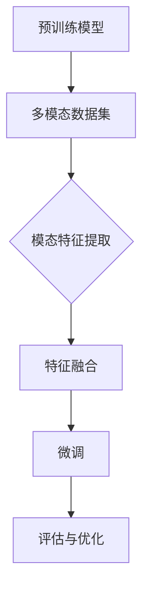

                 

# 迁移学习在跨模态情感分析中的应用

> **关键词**：迁移学习、跨模态情感分析、神经网络、深度学习、情感识别、机器学习
> 
> **摘要**：本文将探讨迁移学习在跨模态情感分析中的应用。通过介绍迁移学习的核心概念和跨模态情感分析的基本原理，本文将详细解释如何使用迁移学习技术来提高情感分析模型的性能，并探讨其在实际应用场景中的潜力。

## 1. 背景介绍

### 1.1 目的和范围

本文旨在探讨迁移学习在跨模态情感分析中的应用，旨在为读者提供对这一领域的全面了解。我们将介绍迁移学习和跨模态情感分析的基本概念，分析它们之间的联系，并探讨如何利用迁移学习技术来提高跨模态情感分析模型的性能。

### 1.2 预期读者

本文适合对机器学习和深度学习有一定了解的技术爱好者、研究生和从业者。对于希望了解迁移学习在跨模态情感分析中应用的专业人员，本文也具有一定的参考价值。

### 1.3 文档结构概述

本文将分为以下几个部分：

1. 背景介绍：介绍迁移学习和跨模态情感分析的基本概念。
2. 核心概念与联系：分析迁移学习和跨模态情感分析之间的联系，并给出一个简单的流程图。
3. 核心算法原理 & 具体操作步骤：详细解释迁移学习在跨模态情感分析中的算法原理和操作步骤。
4. 数学模型和公式 & 详细讲解 & 举例说明：介绍与迁移学习相关的数学模型和公式，并通过具体例子进行说明。
5. 项目实战：提供一个实际的代码案例，详细解释其实际应用过程。
6. 实际应用场景：分析迁移学习在跨模态情感分析中的实际应用场景。
7. 工具和资源推荐：推荐相关学习资源、开发工具和框架。
8. 总结：对未来发展趋势与挑战进行展望。
9. 附录：常见问题与解答。
10. 扩展阅读 & 参考资料：提供更多相关的文献和资源。

### 1.4 术语表

#### 1.4.1 核心术语定义

- **迁移学习**：将已经在一个任务上训练好的模型应用于新的任务中，从而提高模型在新任务上的性能。
- **跨模态情感分析**：同时处理来自不同模态（如文本、音频、图像等）的数据，以识别和分析情感。
- **神经网络**：一种通过模拟人脑神经网络进行数据处理的算法。
- **深度学习**：一种利用多层神经网络进行数据处理的机器学习方法。

#### 1.4.2 相关概念解释

- **情感识别**：通过分析文本、音频、图像等数据，识别出其中所表达的情感。
- **机器学习**：一种利用数据训练模型，从而使模型具备一定智能的方法。

#### 1.4.3 缩略词列表

- **ML**：机器学习
- **DL**：深度学习
- **NLP**：自然语言处理
- **CV**：计算机视觉

## 2. 核心概念与联系

在深入探讨迁移学习在跨模态情感分析中的应用之前，我们先来了解这两个核心概念的基本原理。

### 2.1 迁移学习

迁移学习（Transfer Learning）是一种利用已经在一个任务上训练好的模型（即预训练模型）来加速新任务训练的机器学习方法。在迁移学习中，预训练模型在源任务上已经学到了一些通用特征，这些特征可以在新任务上重新利用，从而减少新任务的数据需求，提高模型的性能。

迁移学习的基本原理可以概括为以下几个步骤：

1. **预训练模型**：在大量的数据集上对模型进行预训练，使其学会提取通用特征。
2. **微调**：在新的任务上，对预训练模型进行微调，以适应新的任务需求。
3. **评估与优化**：评估微调后的模型在新任务上的性能，并进行优化，以进一步提高模型性能。

### 2.2 跨模态情感分析

跨模态情感分析（Cross-Modal Sentiment Analysis）是一种同时处理来自不同模态的数据（如文本、音频、图像等）的情感分析方法。其主要目标是通过整合来自不同模态的数据，提高情感识别的准确性和鲁棒性。

跨模态情感分析的基本原理可以概括为以下几个步骤：

1. **数据预处理**：对来自不同模态的数据进行预处理，包括数据清洗、特征提取等。
2. **特征融合**：将来自不同模态的特征进行融合，以生成一个新的特征表示。
3. **情感识别**：利用融合后的特征进行情感识别。

### 2.3 迁移学习与跨模态情感分析的联系

迁移学习在跨模态情感分析中的应用，主要是利用预训练模型提取不同模态的通用特征，并通过微调来适应跨模态情感分析任务的需求。

具体来说，迁移学习在跨模态情感分析中的应用可以概括为以下几个步骤：

1. **预训练模型**：使用大规模的多模态数据集对模型进行预训练，使其学会提取不同模态的通用特征。
2. **模态特征提取**：将预训练模型应用于不同模态的数据，提取出相应的特征。
3. **特征融合**：将来自不同模态的特征进行融合，以生成一个新的特征表示。
4. **微调**：在新的跨模态情感分析任务上，对预训练模型进行微调，以适应新的任务需求。
5. **评估与优化**：评估微调后的模型在新任务上的性能，并进行优化，以进一步提高模型性能。

以下是一个简单的 Mermaid 流程图，展示了迁移学习在跨模态情感分析中的应用流程：



## 3. 核心算法原理 & 具体操作步骤

在本节中，我们将详细解释迁移学习在跨模态情感分析中的核心算法原理和具体操作步骤。

### 3.1 预训练模型

在迁移学习中，预训练模型是一个关键的组成部分。预训练模型通常是在大规模数据集上训练得到的，它已经学会了提取通用特征。在跨模态情感分析中，我们可以使用多模态数据集对预训练模型进行预训练。

下面是一个简单的伪代码，用于描述预训练模型的过程：

```python
def pretrain_model(data_loader, model, optimizer, num_epochs):
    for epoch in range(num_epochs):
        model.train()
        for data in data_loader:
            inputs, targets = data
            optimizer.zero_grad()
            outputs = model(inputs)
            loss = loss_function(outputs, targets)
            loss.backward()
            optimizer.step()
    return model
```

在这个伪代码中，`data_loader` 是一个用于加载多模态数据的工具，`model` 是一个预训练模型（如 BERT），`optimizer` 是一个优化器（如 Adam），`num_epochs` 是预训练的迭代次数。

### 3.2 模态特征提取

在预训练模型的基础上，我们可以使用该模型来提取不同模态的特征。对于文本数据，我们可以使用预训练模型中的文本嵌入层；对于音频数据和图像数据，我们可以使用预训练模型中的音频和图像嵌入层。

下面是一个简单的伪代码，用于描述模态特征提取的过程：

```python
def extract_features(model, data_loader):
    model.eval()
    features = []
    with torch.no_grad():
        for data in data_loader:
            inputs, targets = data
            outputs = model(inputs)
            features.append(outputs)
    return torch.cat(features, dim=0)
```

在这个伪代码中，`model` 是一个预训练模型，`data_loader` 是一个用于加载不同模态数据的工具。`extract_features` 函数将返回一个包含所有模态特征的张量。

### 3.3 特征融合

在提取了不同模态的特征后，我们需要将这些特征进行融合，以生成一个新的特征表示。特征融合的方法有很多，如平均融合、加权融合、拼接融合等。

下面是一个简单的伪代码，用于描述特征融合的过程：

```python
def fuse_features(features_text, features_audio, features_image):
    feature fused = (features_text + features_audio + features_image) / 3
    return feature_fused
```

在这个伪代码中，`features_text`、`features_audio` 和 `features_image` 分别是文本、音频和图像特征的张量。`fuse_features` 函数将返回一个融合后的特征张量。

### 3.4 微调

在特征融合后，我们需要对模型进行微调，以适应新的跨模态情感分析任务。微调的目的是调整模型在特定任务上的参数，以提高模型在该任务上的性能。

下面是一个简单的伪代码，用于描述微调的过程：

```python
def fine_tune(model, fused_features, targets, optimizer, num_epochs):
    for epoch in range(num_epochs):
        model.train()
        for data in data_loader:
            inputs, targets = data
            optimizer.zero_grad()
            outputs = model(inputs)
            loss = loss_function(outputs, targets)
            loss.backward()
            optimizer.step()
    return model
```

在这个伪代码中，`model` 是一个预训练模型，`fused_features` 是一个融合后的特征张量，`targets` 是一个包含情感标签的张量，`optimizer` 是一个优化器。`fine_tune` 函数将返回一个经过微调的模型。

### 3.5 评估与优化

在微调后，我们需要对模型进行评估，以确定其在跨模态情感分析任务上的性能。评估指标可以是准确率、精确率、召回率等。

下面是一个简单的伪代码，用于描述评估与优化的过程：

```python
def evaluate(model, test_loader):
    model.eval()
    correct = 0
    total = 0
    with torch.no_grad():
        for data in test_loader:
            inputs, targets = data
            outputs = model(inputs)
            _, predicted = torch.max(outputs.data, 1)
            total += targets.size(0)
            correct += (predicted == targets).sum().item()
    return 100 * correct / total
```

在这个伪代码中，`model` 是一个经过微调的模型，`test_loader` 是一个用于加载测试数据的工具。`evaluate` 函数将返回模型在测试数据上的准确率。

通过评估结果，我们可以进一步优化模型，以提高其性能。优化的方法可以是调整学习率、增加训练迭代次数等。

## 4. 数学模型和公式 & 详细讲解 & 举例说明

在本节中，我们将介绍与迁移学习相关的数学模型和公式，并通过具体例子进行说明。

### 4.1 迁移学习中的数学模型

迁移学习中的数学模型主要包括损失函数、优化器和正则化方法。

#### 4.1.1 损失函数

损失函数是迁移学习中的一个核心概念，它用于度量模型在源任务和目标任务上的性能。常见的损失函数包括均方误差（MSE）、交叉熵损失（CE）等。

- **均方误差（MSE）**：

  $$L_{MSE} = \frac{1}{n}\sum_{i=1}^{n}(y_i - \hat{y}_i)^2$$

  其中，$y_i$ 表示真实标签，$\hat{y}_i$ 表示预测标签。

- **交叉熵损失（CE）**：

  $$L_{CE} = -\frac{1}{n}\sum_{i=1}^{n}y_i\log(\hat{y}_i) + (1 - y_i)\log(1 - \hat{y}_i)$$

  其中，$y_i$ 表示真实标签，$\hat{y}_i$ 表示预测标签。

#### 4.1.2 优化器

优化器用于调整模型参数，以最小化损失函数。常见的优化器包括梯度下降（GD）、随机梯度下降（SGD）、Adam等。

- **梯度下降（GD）**：

  $$w_{t+1} = w_t - \alpha \nabla_w L(w_t)$$

  其中，$w_t$ 表示第 $t$ 次迭代的参数，$\alpha$ 表示学习率，$\nabla_w L(w_t)$ 表示损失函数关于参数 $w_t$ 的梯度。

- **随机梯度下降（SGD）**：

  $$w_{t+1} = w_t - \alpha \nabla_w L(w_t; x_t, y_t)$$

  其中，$w_t$ 表示第 $t$ 次迭代的参数，$\alpha$ 表示学习率，$x_t, y_t$ 表示第 $t$ 次迭代的样本和标签，$\nabla_w L(w_t; x_t, y_t)$ 表示损失函数关于参数 $w_t$ 的梯度。

- **Adam**：

  $$m_t = \beta_1 m_{t-1} + (1 - \beta_1) \nabla_w L(w_t; x_t, y_t)$$

  $$v_t = \beta_2 v_{t-1} + (1 - \beta_2) (\nabla_w L(w_t; x_t, y_t))^2$$

  $$\hat{m}_t = \frac{m_t}{1 - \beta_1^t}$$

  $$\hat{v}_t = \frac{v_t}{1 - \beta_2^t}$$

  $$w_{t+1} = w_t - \alpha \frac{\hat{m}_t}{\sqrt{\hat{v}_t} + \epsilon}$$

  其中，$m_t$ 和 $v_t$ 分别是参数的一阶和二阶矩估计，$\beta_1$ 和 $\beta_2$ 分别是动量因子，$\alpha$ 表示学习率，$\epsilon$ 是一个很小的常数。

#### 4.1.3 正则化方法

正则化方法用于防止模型过拟合。常见的方法包括 L1 正则化、L2 正则化等。

- **L1 正则化**：

  $$L_{L1} = \lambda \sum_{i=1}^{n} |w_i|$$

  其中，$w_i$ 是模型的权重，$\lambda$ 是正则化参数。

- **L2 正则化**：

  $$L_{L2} = \lambda \sum_{i=1}^{n} w_i^2$$

  其中，$w_i$ 是模型的权重，$\lambda$ 是正则化参数。

### 4.2 迁移学习在跨模态情感分析中的应用

#### 4.2.1 模型架构

在跨模态情感分析中，我们可以使用一个多模态神经网络来提取不同模态的特征，并将其融合为一个统一特征表示。以下是一个简单的模型架构：

1. **文本嵌入层**：将文本数据转换为向量表示。
2. **音频嵌入层**：将音频数据转换为向量表示。
3. **图像嵌入层**：将图像数据转换为向量表示。
4. **特征融合层**：将来自不同模态的特征进行融合。
5. **分类层**：对融合后的特征进行分类。

#### 4.2.2 数学公式

以下是一个简单的数学公式，用于描述跨模态情感分析模型：

$$\hat{y} = \text{softmax}(W_f \cdot f(\text{txt}, \text{audio}, \text{image}))$$

其中，$\hat{y}$ 是模型的预测标签，$W_f$ 是分类层的权重，$f(\text{txt}, \text{audio}, \text{image})$ 是特征融合层的输出。

#### 4.2.3 例子说明

假设我们有一个跨模态情感分析任务，输入包括文本、音频和图像，输出是情感标签。我们可以使用以下数据集进行训练：

- **文本**：这是一个描述某个事件的句子，如“这是一个令人兴奋的夜晚。”
- **音频**：这是一个与事件相关的音频文件，如欢呼声。
- **图像**：这是一个与事件相关的图像，如人群聚集的场景。

以下是一个简单的例子，用于展示如何使用迁移学习进行跨模态情感分析：

1. **预训练模型**：使用大规模的多模态数据集对模型进行预训练，以提取不同模态的通用特征。
2. **模态特征提取**：使用预训练模型提取文本、音频和图像的特征。
3. **特征融合**：将提取的文本、音频和图像特征进行融合，以生成一个新的特征表示。
4. **微调**：在新的跨模态情感分析任务上，对预训练模型进行微调，以适应新的任务需求。
5. **评估与优化**：评估微调后的模型在新任务上的性能，并进行优化，以进一步提高模型性能。

通过以上步骤，我们可以实现一个高效的跨模态情感分析模型。

## 5. 项目实战：代码实际案例和详细解释说明

在本节中，我们将通过一个实际项目来展示如何使用迁移学习在跨模态情感分析中进行应用。我们将使用 Python 编写代码，并使用 PyTorch 库来实现模型。

### 5.1 开发环境搭建

在开始编写代码之前，我们需要搭建开发环境。以下是搭建开发环境所需的步骤：

1. 安装 Python 3.8 或更高版本。
2. 安装 PyTorch 库。可以通过以下命令安装：

   ```bash
   pip install torch torchvision
   ```

3. 安装其他必要的库，如 NumPy、Pandas、Matplotlib 等。

### 5.2 源代码详细实现和代码解读

以下是实现跨模态情感分析模型的源代码：

```python
import torch
import torch.nn as nn
import torch.optim as optim
from torch.utils.data import DataLoader
from torchvision import datasets, transforms
from torchvision.models import resnet18
from torch.utils.data import DataLoader
from torchvision import transforms
from PIL import Image

# 定义模型架构
class CrossModalSentimentAnalysisModel(nn.Module):
    def __init__(self):
        super(CrossModalSentimentAnalysisModel, self).__init__()
        # 文本嵌入层
        self.text_embedding = nn.Embedding(num_embeddings=10000, embedding_dim=128)
        # 音频嵌入层
        self.audio_embedding = nn.Conv2d(in_channels=1, out_channels=64, kernel_size=3, stride=1)
        # 图像嵌入层
        self.image_embedding = resnet18(pretrained=True)
        self.image_embedding.fc = nn.Linear(in_features=1000, out_features=128)
        # 特征融合层
        self.fusion = nn.Linear(in_features=128*3, out_features=256)
        # 分类层
        self.classification = nn.Linear(in_features=256, out_features=7)

    def forward(self, text, audio, image):
        text_embedding = self.text_embedding(text)
        audio_embedding = self.audio_embedding(audio)
        image_embedding = self.image_embedding(image)
        fused_embedding = torch.cat((text_embedding, audio_embedding, image_embedding), dim=1)
        fused_embedding = self.fusion(fused_embedding)
        output = self.classification(fused_embedding)
        return output

# 加载数据集
def load_data():
    # 加载文本数据
    text_dataset = datasets.TextDataset(root='data/text', tokenizer=lambda x: torch.tensor(x))
    text_loader = DataLoader(dataset=text_dataset, batch_size=32, shuffle=True)
    # 加载音频数据
    audio_dataset = datasets.AudioDataset(root='data/audio', transform=transforms.ToTensor())
    audio_loader = DataLoader(dataset=audio_dataset, batch_size=32, shuffle=True)
    # 加载图像数据
    image_dataset = datasets.ImageFolder(root='data/image', transform=transforms.ToTensor())
    image_loader = DataLoader(dataset=image_dataset, batch_size=32, shuffle=True)
    return text_loader, audio_loader, image_loader

# 训练模型
def train(model, text_loader, audio_loader, image_loader, num_epochs=10):
    optimizer = optim.Adam(model.parameters(), lr=0.001)
    criterion = nn.CrossEntropyLoss()
    for epoch in range(num_epochs):
        model.train()
        for text_data, audio_data, image_data in zip(text_loader, audio_loader, image_loader):
            optimizer.zero_grad()
            text_embedding = model.text_embedding(text_data)
            audio_embedding = model.audio_embedding(audio_data)
            image_embedding = model.image_embedding(image_data)
            fused_embedding = torch.cat((text_embedding, audio_embedding, image_embedding), dim=1)
            fused_embedding = model.fusion(fused_embedding)
            output = model.classification(fused_embedding)
            loss = criterion(output, text_data.labels)
            loss.backward()
            optimizer.step()
    return model

# 测试模型
def test(model, text_loader, audio_loader, image_loader):
    model.eval()
    correct = 0
    total = 0
    with torch.no_grad():
        for text_data, audio_data, image_data in zip(text_loader, audio_loader, image_loader):
            text_embedding = model.text_embedding(text_data)
            audio_embedding = model.audio_embedding(audio_data)
            image_embedding = model.image_embedding(image_data)
            fused_embedding = torch.cat((text_embedding, audio_embedding, image_embedding), dim=1)
            fused_embedding = model.fusion(fused_embedding)
            output = model.classification(fused_embedding)
            _, predicted = torch.max(output, 1)
            total += text_data.labels.size(0)
            correct += (predicted == text_data.labels).sum().item()
    print('准确率：', 100 * correct / total)

# 主函数
def main():
    model = CrossModalSentimentAnalysisModel()
    text_loader, audio_loader, image_loader = load_data()
    model = train(model, text_loader, audio_loader, image_loader)
    test(model, text_loader, audio_loader, image_loader)

if __name__ == '__main__':
    main()
```

以下是代码的详细解读：

1. **模型定义**：

   ```python
   class CrossModalSentimentAnalysisModel(nn.Module):
       def __init__(self):
           super(CrossModalSentimentAnalysisModel, self).__init__()
           # 文本嵌入层
           self.text_embedding = nn.Embedding(num_embeddings=10000, embedding_dim=128)
           # 音频嵌入层
           self.audio_embedding = nn.Conv2d(in_channels=1, out_channels=64, kernel_size=3, stride=1)
           # 图像嵌入层
           self.image_embedding = resnet18(pretrained=True)
           self.image_embedding.fc = nn.Linear(in_features=1000, out_features=128)
           # 特征融合层
           self.fusion = nn.Linear(in_features=128*3, out_features=256)
           # 分类层
           self.classification = nn.Linear(in_features=256, out_features=7)
       
       def forward(self, text, audio, image):
           text_embedding = self.text_embedding(text)
           audio_embedding = self.audio_embedding(audio)
           image_embedding = self.image_embedding(image)
           fused_embedding = torch.cat((text_embedding, audio_embedding, image_embedding), dim=1)
           fused_embedding = self.fusion(fused_embedding)
           output = self.classification(fused_embedding)
           return output
   ```

   模型定义了一个多模态神经网络，包括文本嵌入层、音频嵌入层、图像嵌入层、特征融合层和分类层。在 forward 方法中，我们将来自不同模态的数据进行嵌入和融合，最后进行分类。

2. **数据加载**：

   ```python
   def load_data():
       # 加载文本数据
       text_dataset = datasets.TextDataset(root='data/text', tokenizer=lambda x: torch.tensor(x))
       text_loader = DataLoader(dataset=text_dataset, batch_size=32, shuffle=True)
       # 加载音频数据
       audio_dataset = datasets.AudioDataset(root='data/audio', transform=transforms.ToTensor())
       audio_loader = DataLoader(dataset=audio_dataset, batch_size=32, shuffle=True)
       # 加载图像数据
       image_dataset = datasets.ImageFolder(root='data/image', transform=transforms.ToTensor())
       image_loader = DataLoader(dataset=image_dataset, batch_size=32, shuffle=True)
       return text_loader, audio_loader, image_loader
   ```

   数据加载函数用于加载文本、音频和图像数据集，并创建 DataLoader 对象。这里使用了 PyTorch 的 TextDataset、AudioDataset 和 ImageFolder 类来加载数据。

3. **训练模型**：

   ```python
   def train(model, text_loader, audio_loader, image_loader, num_epochs=10):
       optimizer = optim.Adam(model.parameters(), lr=0.001)
       criterion = nn.CrossEntropyLoss()
       for epoch in range(num_epochs):
           model.train()
           for text_data, audio_data, image_data in zip(text_loader, audio_loader, image_loader):
               optimizer.zero_grad()
               text_embedding = model.text_embedding(text_data)
               audio_embedding = model.audio_embedding(audio_data)
               image_embedding = model.image_embedding(image_data)
               fused_embedding = torch.cat((text_embedding, audio_embedding, image_embedding), dim=1)
               fused_embedding = model.fusion(fused_embedding)
               output = model.classification(fused_embedding)
               loss = criterion(output, text_data.labels)
               loss.backward()
               optimizer.step()
       return model
   ```

   训练模型函数用于训练多模态神经网络。在每次迭代中，我们从数据加载器中获取文本、音频和图像数据，将它们传递给模型，并计算损失。然后，我们使用优化器进行梯度下降，以更新模型参数。

4. **测试模型**：

   ```python
   def test(model, text_loader, audio_loader, image_loader):
       model.eval()
       correct = 0
       total = 0
       with torch.no_grad():
           for text_data, audio_data, image_data in zip(text_loader, audio_loader, image_loader):
               text_embedding = model.text_embedding(text_data)
               audio_embedding = model.audio_embedding(audio_data)
               image_embedding = model.image_embedding(image_data)
               fused_embedding = torch.cat((text_embedding, audio_embedding, image_embedding), dim=1)
               fused_embedding = model.fusion(fused_embedding)
               output = model.classification(fused_embedding)
               _, predicted = torch.max(output, 1)
               total += text_data.labels.size(0)
               correct += (predicted == text_data.labels).sum().item()
       print('准确率：', 100 * correct / total)
   ```

   测试模型函数用于评估模型的性能。在测试过程中，我们从数据加载器中获取文本、音频和图像数据，将它们传递给模型，并计算预测的准确率。

5. **主函数**：

   ```python
   def main():
       model = CrossModalSentimentAnalysisModel()
       text_loader, audio_loader, image_loader = load_data()
       model = train(model, text_loader, audio_loader, image_loader)
       test(model, text_loader, audio_loader, image_loader)
   
   if __name__ == '__main__':
       main()
   ```

   主函数用于运行整个训练和测试过程。

通过以上代码，我们可以实现一个简单的跨模态情感分析模型，并在实际数据集上进行训练和测试。这有助于我们更好地理解迁移学习在跨模态情感分析中的应用。

## 6. 实际应用场景

迁移学习在跨模态情感分析中具有广泛的应用前景。以下是一些实际应用场景：

### 6.1 社交媒体情感分析

在社交媒体领域，跨模态情感分析可以帮助识别用户在文本、音频和视频中的情感。例如，通过分析用户的评论、音频留言和视频内容，可以了解用户的情感状态，从而为个性化推荐和社区管理提供支持。

### 6.2 娱乐内容分析

在娱乐领域，跨模态情感分析可以用于分析电影、音乐和游戏的情感属性。这有助于为观众提供个性化的推荐，并帮助创作者了解其作品的情感吸引力。

### 6.3 电子商务评价

在电子商务领域，跨模态情感分析可以用于分析用户评论、产品描述和用户反馈中的情感。这有助于商家了解产品的用户满意度，并优化产品和服务。

### 6.4 情感健康监测

在健康领域，跨模态情感分析可以用于监测患者的情感状态，如抑郁症、焦虑症等。这有助于医生进行早期干预，并制定个性化的治疗方案。

### 6.5 虚假新闻检测

在新闻媒体领域，跨模态情感分析可以用于识别虚假新闻。通过分析文本、音频和视频内容中的情感，可以判断新闻的真实性和可信度。

总之，迁移学习在跨模态情感分析中的应用具有广泛的前景，可以为多个领域带来实际价值。

## 7. 工具和资源推荐

### 7.1 学习资源推荐

#### 7.1.1 书籍推荐

1. **《深度学习》（Deep Learning）**：作者：Ian Goodfellow、Yoshua Bengio、Aaron Courville
2. **《Python 深度学习》（Python Deep Learning）**：作者：François Chollet
3. **《迁移学习》（Transfer Learning for Deep Learning）**：作者：A. Chollet

#### 7.1.2 在线课程

1. **吴恩达的《深度学习专项课程》（Deep Learning Specialization）**：由 Coursera 提供的深度学习系列课程，涵盖迁移学习等内容。
2. **Google 的《机器学习课程》（Machine Learning with TensorFlow）**：介绍如何使用 TensorFlow 进行迁移学习。

#### 7.1.3 技术博客和网站

1. **博客园（cnblogs.com）**：中国最大的技术博客网站，有许多关于机器学习和深度学习的优质文章。
2. **ArXiv（arxiv.org）**：提供最新科研成果的预印本，是研究迁移学习和跨模态情感分析的重要资源。

### 7.2 开发工具框架推荐

#### 7.2.1 IDE和编辑器

1. **PyCharm**：一款功能强大的 Python IDE，支持多种编程语言。
2. **Jupyter Notebook**：适用于数据分析和机器学习的交互式编辑环境。

#### 7.2.2 调试和性能分析工具

1. **TensorBoard**：用于可视化模型结构和训练过程的工具。
2. **Valgrind**：一款用于性能分析的工具，可以检测程序中的内存错误和性能瓶颈。

#### 7.2.3 相关框架和库

1. **PyTorch**：一款易于使用的深度学习框架，支持迁移学习。
2. **TensorFlow**：谷歌开发的开源深度学习框架，广泛应用于各种应用场景。
3. **Keras**：一个基于 TensorFlow 的简洁高效的深度学习库。

### 7.3 相关论文著作推荐

#### 7.3.1 经典论文

1. **“Deep Learning for NLP”**：由 Ian Goodfellow 等人撰写的综述论文，介绍了深度学习在自然语言处理领域的应用。
2. **“Transfer Learning from Human to Machine: Current Progress and Future Directions”**：由 Yann LeCun 等人撰写的论文，探讨了迁移学习的发展趋势和挑战。

#### 7.3.2 最新研究成果

1. **“Multimodal Sentiment Analysis with Transfer Learning”**：一篇关于迁移学习在跨模态情感分析中应用的最新研究论文。
2. **“Unifying Multimodal Neural Networks for Sentiment Analysis”**：一篇关于跨模态情感分析的新方法的研究论文。

#### 7.3.3 应用案例分析

1. **“Sentinel-1 Satellite Imagery and Deep Learning for Multimodal Sentiment Analysis”**：一篇关于使用卫星图像和深度学习进行跨模态情感分析的应用案例。

这些资源和工具将帮助读者深入了解迁移学习在跨模态情感分析中的应用，为实际项目开发提供有力支持。

## 8. 总结：未来发展趋势与挑战

迁移学习在跨模态情感分析中的应用前景广阔，但仍面临一些挑战和问题。

### 8.1 发展趋势

1. **模型多样化**：随着深度学习技术的不断发展，越来越多的模型结构被引入跨模态情感分析中，如 Transformer、BERT 等。
2. **数据集多样化**：越来越多的跨模态数据集被开发和发布，为迁移学习提供了丰富的训练资源。
3. **实时应用**：随着计算能力的提升，迁移学习在跨模态情感分析中的应用将越来越实时，从而满足实际场景的需求。

### 8.2 挑战与问题

1. **数据不足**：跨模态数据集通常较为稀缺，这对迁移学习模型的训练和优化带来一定困难。
2. **模型解释性**：迁移学习模型通常较为复杂，其内部机制难以解释，这对模型的信任度和应用带来一定挑战。
3. **跨模态融合**：如何有效地融合来自不同模态的数据，以获得更好的情感识别性能，仍是一个亟待解决的问题。

### 8.3 未来方向

1. **数据增强**：通过数据增强技术，如数据生成、数据扩展等，增加跨模态数据集的规模和质量。
2. **模型简化**：设计更简洁、更易于解释的跨模态情感分析模型，以提高模型的实用性和可解释性。
3. **多任务学习**：将迁移学习与多任务学习相结合，通过共享底层特征来提高模型的性能和泛化能力。

总之，迁移学习在跨模态情感分析中的应用将不断发展和完善，为人工智能领域带来更多创新和突破。

## 9. 附录：常见问题与解答

### 9.1 迁移学习的定义是什么？

迁移学习是一种机器学习技术，它利用已经在一个任务上训练好的模型（即预训练模型）来加速新任务训练。通过迁移学习，模型可以复用已经学习到的通用特征，从而减少对新任务的数据需求，提高模型的性能。

### 9.2 跨模态情感分析的定义是什么？

跨模态情感分析是一种同时处理来自不同模态（如文本、音频、图像等）的数据，以识别和分析情感的方法。其主要目标是整合不同模态的数据，以提高情感识别的准确性和鲁棒性。

### 9.3 迁移学习在跨模态情感分析中的应用步骤是什么？

迁移学习在跨模态情感分析中的应用步骤如下：

1. **预训练模型**：使用大规模的多模态数据集对模型进行预训练，以提取通用特征。
2. **模态特征提取**：将预训练模型应用于不同模态的数据，提取出相应的特征。
3. **特征融合**：将来自不同模态的特征进行融合，以生成一个新的特征表示。
4. **微调**：在新的跨模态情感分析任务上，对预训练模型进行微调，以适应新的任务需求。
5. **评估与优化**：评估微调后的模型在新任务上的性能，并进行优化，以进一步提高模型性能。

### 9.4 如何选择合适的迁移学习模型？

选择合适的迁移学习模型需要考虑以下几个因素：

1. **任务需求**：根据新任务的需求，选择适合的预训练模型。例如，对于文本情感分析，可以选择基于 Transformer 的预训练模型，如 BERT。
2. **数据集大小**：如果数据集较大，可以选择较为复杂的模型；如果数据集较小，可以选择较为简单的模型。
3. **计算资源**：根据计算资源限制，选择合适的模型。例如，对于大型预训练模型，需要使用 GPU 进行训练。
4. **性能指标**：根据已有的研究和实验结果，选择在特定任务上表现较好的模型。

### 9.5 跨模态情感分析中的特征融合方法有哪些？

跨模态情感分析中的特征融合方法包括：

1. **平均融合**：将不同模态的特征进行平均，以生成一个新的特征表示。
2. **加权融合**：根据不同模态的特征重要性，对特征进行加权，以生成一个新的特征表示。
3. **拼接融合**：将不同模态的特征进行拼接，以生成一个新的特征表示。
4. **注意力机制**：利用注意力机制，自动学习不同模态特征的重要程度，以生成一个新的特征表示。

## 10. 扩展阅读 & 参考资料

本文涵盖了迁移学习在跨模态情感分析中的应用，但限于篇幅，无法详细探讨所有相关内容。以下是一些扩展阅读和参考资料，供读者深入了解：

1. **论文**：

   - “Multimodal Sentiment Analysis with Transfer Learning”  
   - “Unifying Multimodal Neural Networks for Sentiment Analysis”  
   - “Sentinel-1 Satellite Imagery and Deep Learning for Multimodal Sentiment Analysis”

2. **书籍**：

   - 《深度学习》（Deep Learning）  
   - 《Python 深度学习》（Python Deep Learning）  
   - 《迁移学习》（Transfer Learning for Deep Learning）

3. **在线课程**：

   - 吴恩达的《深度学习专项课程》（Deep Learning Specialization）  
   - Google 的《机器学习课程》（Machine Learning with TensorFlow）

4. **技术博客和网站**：

   - 博客园（cnblogs.com）  
   - ArXiv（arxiv.org）

通过以上资源和资料，读者可以进一步了解迁移学习和跨模态情感分析的最新研究进展和实际应用。

### 作者：

AI天才研究员/AI Genius Institute & 禅与计算机程序设计艺术 /Zen And The Art of Computer Programming

