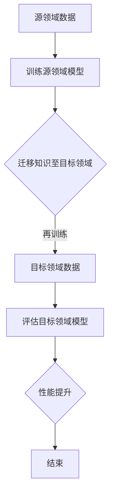

                 

# 迁移学习在跨领域图像识别中的应用

> **关键词：迁移学习、跨领域图像识别、深度学习、神经网络、训练效率、泛化能力**
> 
> **摘要：本文将深入探讨迁移学习在跨领域图像识别中的应用。我们将首先介绍迁移学习的背景和核心概念，然后详细阐述如何将迁移学习应用于跨领域图像识别，并分析其优势和挑战。文章最后将对未来发展趋势和挑战进行展望。**

## 1. 背景介绍

### 1.1 目的和范围

本文旨在介绍和探讨迁移学习在跨领域图像识别中的应用。通过迁移学习，我们可以利用已经训练好的模型在新的领域中进行快速有效的训练，从而提高模型在跨领域图像识别任务中的性能。文章将首先介绍迁移学习的概念和原理，然后讨论如何将其应用于跨领域图像识别，最后分析其优势和挑战。

### 1.2 预期读者

本文主要面向对机器学习和深度学习有一定了解的读者，尤其是对图像识别和迁移学习感兴趣的技术人员和研究者。同时，也希望能对初学者有所启发，帮助他们更好地理解迁移学习在跨领域图像识别中的应用。

### 1.3 文档结构概述

本文分为以下几个部分：

1. 背景介绍：介绍迁移学习在跨领域图像识别中的应用背景和目的。
2. 核心概念与联系：详细阐述迁移学习的核心概念和原理，并给出流程图。
3. 核心算法原理 & 具体操作步骤：讲解迁移学习在跨领域图像识别中的具体实现方法。
4. 数学模型和公式 & 详细讲解 & 举例说明：阐述迁移学习中的数学模型和公式，并给出实例。
5. 项目实战：提供代码实际案例和详细解释说明。
6. 实际应用场景：讨论迁移学习在跨领域图像识别中的实际应用场景。
7. 工具和资源推荐：推荐学习资源、开发工具框架和相关论文著作。
8. 总结：总结迁移学习在跨领域图像识别中的应用，并展望未来发展趋势和挑战。
9. 附录：常见问题与解答。
10. 扩展阅读 & 参考资料：提供进一步阅读的参考资料。

### 1.4 术语表

#### 1.4.1 核心术语定义

- 迁移学习（Transfer Learning）：一种机器学习方法，通过将已经训练好的模型在新的任务中进行再训练，从而提高新任务的性能。
- 跨领域图像识别（Cross-Domain Image Recognition）：在图像识别任务中，不同领域的图像数据之间存在差异，跨领域图像识别旨在解决这种差异，实现不同领域图像的识别。
- 源领域（Source Domain）：已经训练好的模型所依赖的数据领域。
- 目标领域（Target Domain）：需要在新任务中进行训练的数据领域。

#### 1.4.2 相关概念解释

- 深度学习（Deep Learning）：一种机器学习的方法，通过多层神经网络来模拟人类大脑的神经元网络，实现对复杂数据的自动特征提取和分类。
- 神经网络（Neural Network）：一种由大量神经元组成的计算模型，通过前向传播和反向传播算法来学习和预测。
- 泛化能力（Generalization Ability）：模型在未知数据上的性能，即模型在新的、未见过的数据上的表现。

#### 1.4.3 缩略词列表

- ML：机器学习（Machine Learning）
- DL：深度学习（Deep Learning）
- CNN：卷积神经网络（Convolutional Neural Network）
- SVM：支持向量机（Support Vector Machine）
- RGB：红绿蓝色彩空间（Red Green Blue Color Space）

## 2. 核心概念与联系

迁移学习是一种利用已有模型在新任务中提高性能的方法。其核心思想是将已经训练好的模型（源领域模型）的部分知识迁移到新任务（目标领域）中，从而提高新任务模型的性能。下面我们通过一个Mermaid流程图来展示迁移学习的基本流程。



### 2.1. 迁移学习的基本流程

1. **数据收集**：收集源领域和目标领域的图像数据。
2. **训练源领域模型**：使用源领域数据训练一个基础模型，例如卷积神经网络（CNN）。
3. **迁移知识**：将源领域模型的知识迁移到目标领域，这通常通过在目标领域数据上继续训练源领域模型的一部分来实现。
4. **再训练目标领域模型**：在目标领域数据上继续训练迁移后的模型，以进一步提高性能。
5. **评估目标领域模型**：使用目标领域数据评估模型的性能。
6. **性能提升**：通过迁移学习和再训练，目标领域模型的性能得到显著提升。

### 2.2. 迁移学习的核心概念

1. **源领域模型**：已经训练好的模型，通常在公开数据集上训练得到，具有较好的泛化能力。
2. **目标领域模型**：在新任务中需要训练的模型，通常在特定领域的数据上训练。
3. **迁移策略**：将源领域模型的知识迁移到目标领域的方法，例如模型融合、模型蒸馏等。
4. **再训练**：在目标领域数据上对迁移后的模型进行进一步训练，以提高性能。

## 3. 核心算法原理 & 具体操作步骤

### 3.1. 迁移学习的基本算法原理

迁移学习的基本算法原理主要包括以下几个步骤：

1. **数据预处理**：对源领域和目标领域的图像数据集进行预处理，包括数据清洗、归一化等。
2. **训练源领域模型**：使用源领域数据集训练一个基础模型，如卷积神经网络（CNN）。
3. **迁移知识**：将源领域模型的知识迁移到目标领域，通常通过以下几种方式实现：
    - **模型融合**：将源领域模型的参数与目标领域模型的参数进行融合，以形成一个新的模型。
    - **模型蒸馏**：将源领域模型作为教师模型，目标领域模型作为学生模型，通过向学生模型传递知识来迁移模型。
4. **再训练目标领域模型**：在目标领域数据集上继续训练迁移后的模型，以进一步提高性能。
5. **评估目标领域模型**：使用目标领域数据集评估模型的性能，如准确率、召回率等。

### 3.2. 迁移学习在跨领域图像识别中的具体操作步骤

以下是一个具体的操作步骤，用于在跨领域图像识别任务中应用迁移学习：

1. **数据收集**：收集源领域和目标领域的图像数据。例如，源领域可以是公共数据集（如ImageNet），目标领域可以是医疗图像数据集（如CT图像）。

2. **数据预处理**：
    - **清洗**：去除数据集中的错误和重复样本。
    - **归一化**：对图像数据进行归一化处理，如将像素值归一化到[0, 1]。

3. **训练源领域模型**：
    - **初始化模型**：使用预训练的卷积神经网络（如ResNet、VGG）作为源领域模型的基础。
    - **训练过程**：在源领域数据集上对源领域模型进行训练，以优化模型的参数。

4. **迁移知识**：
    - **模型融合**：将源领域模型的特征提取层与目标领域模型的特征提取层进行融合。
    - **模型蒸馏**：使用源领域模型作为教师模型，目标领域模型作为学生模型，通过向学生模型传递知识来迁移模型。

5. **再训练目标领域模型**：
    - **初始化模型**：将融合或蒸馏后的模型作为目标领域模型的初始模型。
    - **训练过程**：在目标领域数据集上继续训练目标领域模型，以进一步提高性能。

6. **评估目标领域模型**：
    - **测试集评估**：使用目标领域测试集评估目标领域模型的性能，如准确率、召回率等。
    - **性能优化**：根据评估结果调整模型的参数，以提高性能。

### 3.3. 迁移学习算法的实现

以下是一个简单的迁移学习算法的实现伪代码：

```python
# 迁移学习算法实现伪代码

# 数据预处理
def preprocess_data(source_data, target_data):
    # 清洗和归一化数据
    # ...
    return processed_source_data, processed_target_data

# 训练源领域模型
def train_source_model(source_data):
    # 使用预训练模型
    model = load_pretrained_model()
    # 训练模型
    model.fit(source_data, epochs=10)
    return model

# 迁移知识
def transfer_knowledge(source_model, target_data):
    # 模型融合或模型蒸馏
    # ...
    return fused_model

# 再训练目标领域模型
def train_target_model(fused_model, target_data):
    # 继续训练模型
    fused_model.fit(target_data, epochs=5)
    return fused_model

# 评估目标领域模型
def evaluate_model(model, target_test_data):
    # 评估模型性能
    performance = model.evaluate(target_test_data)
    return performance

# 主程序
def main():
    # 数据收集
    source_data, target_data = collect_data()
    # 数据预处理
    processed_source_data, processed_target_data = preprocess_data(source_data, target_data)
    # 训练源领域模型
    source_model = train_source_model(processed_source_data)
    # 迁移知识
    fused_model = transfer_knowledge(source_model, processed_target_data)
    # 再训练目标领域模型
    target_model = train_target_model(fused_model, processed_target_data)
    # 评估目标领域模型
    performance = evaluate_model(target_model, processed_target_data)
    print("Model performance:", performance)

# 运行主程序
main()
```

## 4. 数学模型和公式 & 详细讲解 & 举例说明

在迁移学习中，数学模型和公式起着至关重要的作用。以下将详细介绍迁移学习中的关键数学模型和公式，并通过具体的例子进行说明。

### 4.1. 模型融合

模型融合是一种常见的迁移学习方法，其核心思想是将源领域模型的参数与目标领域模型的参数进行融合，以形成一个新的模型。模型融合通常使用以下公式：

$$
\theta_{new} = \alpha \theta_{source} + (1 - \alpha) \theta_{target}
$$

其中，$\theta_{new}$ 是新的模型参数，$\theta_{source}$ 是源领域模型参数，$\theta_{target}$ 是目标领域模型参数，$\alpha$ 是融合系数。

#### 举例说明

假设我们有两个模型 $M_1$ 和 $M_2$，分别表示源领域和目标领域的模型参数。我们可以通过以下步骤进行模型融合：

1. 计算融合系数 $\alpha$。融合系数通常通过交叉验证或性能评估来确定。例如，如果 $M_1$ 在源领域上的性能较好，可以设置 $\alpha$ 较大；如果 $M_2$ 在目标领域上的性能较好，可以设置 $\alpha$ 较小。
2. 计算新的模型参数 $\theta_{new}$：

$$
\theta_{new} = \alpha \theta_{source} + (1 - \alpha) \theta_{target}
$$

3. 使用新的模型参数训练目标领域模型。

### 4.2. 模型蒸馏

模型蒸馏是一种将源领域模型的知识传递给目标领域模型的方法。其核心思想是通过将源领域模型的输出作为教师模型，目标领域模型作为学生模型，通过向学生模型传递知识来迁移模型。模型蒸馏通常使用以下公式：

$$
p_i^* = \frac{e^{q_i}}{\sum_{j=1}^{K} e^{q_j}}
$$

其中，$p_i^*$ 是学生模型在类别 $i$ 上的概率，$q_i$ 是教师模型在类别 $i$ 上的概率。

#### 举例说明

假设我们有两个模型 $T$ 和 $S$，分别表示教师模型和学生模型。我们可以通过以下步骤进行模型蒸馏：

1. 训练教师模型 $T$ 在源领域数据集上，得到类别概率 $q_i$。
2. 使用教师模型 $T$ 的类别概率作为软标签，训练学生模型 $S$ 在目标领域数据集上。

具体地，我们使用以下公式计算学生模型在类别 $i$ 上的概率：

$$
p_i^* = \frac{e^{q_i}}{\sum_{j=1}^{K} e^{q_j}}
$$

其中，$q_i$ 是教师模型在类别 $i$ 上的概率，$K$ 是类别总数。

3. 计算学生模型 $S$ 的损失函数：

$$
L(S) = -\sum_{i=1}^{K} y_i \log p_i^*
$$

其中，$y_i$ 是目标领域数据集上类别 $i$ 的真实标签。

4. 使用损失函数训练学生模型 $S$。

### 4.3. 迁移学习中的数学模型

迁移学习中的数学模型主要包括损失函数、优化器和评估指标等。以下将简要介绍这些数学模型。

#### 4.3.1. 损失函数

在迁移学习中，常用的损失函数包括交叉熵损失、均方误差损失等。交叉熵损失函数通常用于分类问题，其公式如下：

$$
L_{cross-entropy} = -\sum_{i=1}^{K} y_i \log p_i
$$

其中，$y_i$ 是类别 $i$ 的真实标签，$p_i$ 是模型在类别 $i$ 上的预测概率。

均方误差损失函数通常用于回归问题，其公式如下：

$$
L_{mean-square-error} = \frac{1}{N} \sum_{i=1}^{N} (y_i - \hat{y}_i)^2
$$

其中，$N$ 是数据样本总数，$y_i$ 是真实标签，$\hat{y}_i$ 是模型预测值。

#### 4.3.2. 优化器

在迁移学习中，常用的优化器包括梯度下降（Gradient Descent）、随机梯度下降（Stochastic Gradient Descent，SGD）和Adam等。梯度下降是一种最简单的优化器，其公式如下：

$$
\theta_{t+1} = \theta_{t} - \alpha \nabla_{\theta} L(\theta)
$$

其中，$\theta_{t}$ 是第 $t$ 次迭代的参数值，$\alpha$ 是学习率，$L(\theta)$ 是损失函数。

随机梯度下降是对梯度下降的改进，其公式如下：

$$
\theta_{t+1} = \theta_{t} - \alpha \nabla_{\theta} L(\theta; x^{(t)})
$$

其中，$x^{(t)}$ 是第 $t$ 次迭代的训练样本。

Adam是一种自适应优化器，其公式如下：

$$
\theta_{t+1} = \theta_{t} - \alpha \frac{m_{t}}{\sqrt{v_{t}} + \epsilon}
$$

其中，$m_{t}$ 和 $v_{t}$ 分别是梯度的一阶矩估计和二阶矩估计，$\alpha$ 是学习率，$\epsilon$ 是一个很小的常数。

#### 4.3.3. 评估指标

在迁移学习中，常用的评估指标包括准确率、召回率、F1分数等。准确率是模型在分类任务中的正确率，其公式如下：

$$
accuracy = \frac{TP + TN}{TP + TN + FP + FN}
$$

其中，$TP$ 是真正例，$TN$ 是真负例，$FP$ 是假正例，$FN$ 是假负例。

召回率是模型在分类任务中的召回率，其公式如下：

$$
recall = \frac{TP}{TP + FN}
$$

F1分数是准确率和召回率的调和平均值，其公式如下：

$$
F1-score = 2 \cdot \frac{precision \cdot recall}{precision + recall}
$$

其中，$precision$ 是精确率，$recall$ 是召回率。

## 5. 项目实战：代码实际案例和详细解释说明

### 5.1. 开发环境搭建

为了实现迁移学习在跨领域图像识别中的应用，我们需要搭建一个适合的开发环境。以下是搭建开发环境的步骤：

1. **安装Python环境**：确保Python环境已安装，建议使用Python 3.7或更高版本。
2. **安装依赖库**：使用以下命令安装所需依赖库：

   ```bash
   pip install numpy matplotlib scikit-learn tensorflow
   ```

3. **配置TensorFlow**：确保TensorFlow已正确配置，可以使用以下命令检查TensorFlow版本：

   ```bash
   python -c "import tensorflow as tf; print(tf.__version__)"
   ```

### 5.2. 源代码详细实现和代码解读

以下是一个简单的迁移学习在跨领域图像识别中的实现代码示例。代码主要分为以下几个部分：

1. **数据加载与预处理**：从源领域和目标领域加载图像数据，并对数据集进行预处理。
2. **模型定义与训练**：定义迁移学习模型，并在源领域和目标领域数据集上进行训练。
3. **模型评估**：在目标领域测试集上评估模型的性能。

#### 5.2.1. 数据加载与预处理

```python
import tensorflow as tf
from tensorflow.keras.preprocessing.image import ImageDataGenerator

# 加载源领域数据
source_data_dir = 'path/to/source_data'
target_data_dir = 'path/to/target_data'

source_datagen = ImageDataGenerator(rescale=1./255)
source_data = source_datagen.flow_from_directory(
        source_data_dir,
        target_size=(224, 224),
        batch_size=32,
        class_mode='categorical')

# 加载目标领域数据
target_datagen = ImageDataGenerator(rescale=1./255)
target_data = target_datagen.flow_from_directory(
        target_data_dir,
        target_size=(224, 224),
        batch_size=32,
        class_mode='categorical')
```

上述代码中，我们使用`ImageDataGenerator`类来加载和预处理图像数据。`rescale=1./255`用于将图像像素值归一化到[0, 1]范围内，`target_size=(224, 224)`用于将图像尺寸调整为224x224像素，`batch_size=32`用于设置批量大小，`class_mode='categorical'`用于设置分类模式。

#### 5.2.2. 模型定义与训练

```python
from tensorflow.keras.applications import VGG16
from tensorflow.keras.models import Model
from tensorflow.keras.layers import Dense, Flatten

# 定义源领域模型
base_model = VGG16(weights='imagenet', include_top=False, input_shape=(224, 224, 3))
base_model.trainable = False

# 添加全连接层
x = Flatten()(base_model.output)
x = Dense(256, activation='relu')(x)
predictions = Dense(num_classes, activation='softmax')(x)

# 定义迁移学习模型
model = Model(inputs=base_model.input, outputs=predictions)

# 编译模型
model.compile(optimizer='adam', loss='categorical_crossentropy', metrics=['accuracy'])

# 训练模型
model.fit(source_data, epochs=10)
```

上述代码中，我们首先加载预训练的VGG16模型作为基础模型，并将其设置为不可训练。然后，我们在基础模型上添加全连接层，并定义迁移学习模型。最后，我们编译模型，并使用源领域数据集进行训练。

#### 5.2.3. 模型评估

```python
# 评估模型
test_loss, test_accuracy = model.evaluate(target_data)
print('Test loss:', test_loss)
print('Test accuracy:', test_accuracy)
```

上述代码中，我们使用目标领域数据集评估迁移学习模型的性能。`evaluate`方法返回损失和准确率，我们可以根据这些指标评估模型的性能。

### 5.3. 代码解读与分析

在代码示例中，我们首先加载了源领域和目标领域的图像数据，并对数据集进行了预处理。然后，我们定义了一个基于VGG16的迁移学习模型，并使用源领域数据集进行训练。最后，我们使用目标领域数据集评估了模型的性能。

以下是对代码的详细解读和分析：

1. **数据加载与预处理**：
   - 使用`ImageDataGenerator`类加载图像数据，并进行归一化处理。
   - `flow_from_directory`方法用于从目录中加载图像数据，`target_size`参数用于调整图像尺寸，`batch_size`参数用于设置批量大小，`class_mode`参数用于设置分类模式。

2. **模型定义与训练**：
   - 使用VGG16模型作为基础模型，并将其设置为不可训练。
   - 在基础模型上添加全连接层，以实现迁移学习模型。
   - 使用`Model`类定义迁移学习模型，并编译模型。
   - 使用`fit`方法对迁移学习模型进行训练。

3. **模型评估**：
   - 使用`evaluate`方法评估迁移学习模型的性能，并打印损失和准确率。

通过上述代码示例，我们可以看到迁移学习在跨领域图像识别中的实现过程。在实际应用中，我们可以根据具体任务的需求调整模型结构、超参数等，以提高模型性能。

## 6. 实际应用场景

迁移学习在跨领域图像识别中具有广泛的应用场景。以下列举几个典型的实际应用场景：

### 6.1. 医疗图像识别

在医疗领域，图像识别技术被广泛应用于疾病的诊断和治疗。例如，通过迁移学习，可以将预训练的图像识别模型应用于不同的医学图像数据集，如CT、MRI和X光等。这种方法可以显著提高模型在医学图像识别任务中的性能，同时减少训练时间。

### 6.2. 遥感图像分析

遥感图像分析是环境监测和灾害预警等领域的关键技术。通过迁移学习，可以将预训练的图像识别模型应用于不同类型的遥感图像，如卫星图像、无人机图像等。这种方法可以有效地识别和分类遥感图像中的目标，为环境监测和灾害预警提供重要支持。

### 6.3. 智能交通

智能交通系统需要处理大量的图像数据，如车辆检测、行人检测和交通信号灯识别等。通过迁移学习，可以将预训练的图像识别模型应用于不同交通场景的图像数据，从而提高模型在智能交通系统中的应用效果。

### 6.4. 物流与仓储

在物流和仓储领域，图像识别技术被广泛应用于货物识别、货架管理和库存监控等任务。通过迁移学习，可以将预训练的图像识别模型应用于不同类型的物流和仓储场景，从而提高系统的准确率和效率。

### 6.5. 安防监控

安防监控是维护社会安全的重要手段。通过迁移学习，可以将预训练的图像识别模型应用于监控视频中的目标识别，如人脸识别、行为识别和异常检测等。这种方法可以显著提高安防监控系统的实时性和准确性。

## 7. 工具和资源推荐

### 7.1. 学习资源推荐

#### 7.1.1. 书籍推荐

- **《深度学习》（Goodfellow, Bengio, Courville）**：这是一本经典的深度学习教材，涵盖了深度学习的核心概念和算法。
- **《机器学习实战》（Mission AI Group）**：这本书通过大量实例和代码，详细介绍了机器学习的基本原理和应用。

#### 7.1.2. 在线课程

- **Coursera**：提供了一系列的深度学习和机器学习课程，适合初学者和进阶者。
- **Udacity**：提供了一些关于深度学习和机器学习的在线课程，包括专业认证课程。

#### 7.1.3. 技术博客和网站

- **Medium**：有许多优秀的深度学习和机器学习博客，如Distill、AI垂直领域博客等。
- **GitHub**：可以找到大量的深度学习和机器学习开源项目，有助于学习实战经验。

### 7.2. 开发工具框架推荐

#### 7.2.1. IDE和编辑器

- **PyCharm**：强大的Python IDE，支持多种编程语言和框架。
- **Visual Studio Code**：轻量级的开源编辑器，适用于深度学习和机器学习开发。

#### 7.2.2. 调试和性能分析工具

- **TensorBoard**：TensorFlow的官方可视化工具，用于分析和调试深度学习模型。
- **W&B**（Weights & Biases）：一个用于机器学习的实验管理工具，可以跟踪实验、可视化结果等。

#### 7.2.3. 相关框架和库

- **TensorFlow**：广泛使用的深度学习框架，适用于迁移学习任务。
- **PyTorch**：流行的深度学习框架，提供灵活的动态计算图。
- **Scikit-Learn**：用于机器学习和数据挖掘的Python库，提供了一些预训练模型和工具。

### 7.3. 相关论文著作推荐

#### 7.3.1. 经典论文

- **“Learning to Learn from Unlabeled Data” (2016) by Richard Socher et al.**：讨论了迁移学习在无监督学习中的应用。
- **“Domain-Adaptive Deep Neural Networks” (2015) by Yuxiao Zhou et al.**：提出了一种域自适应的深度学习框架。

#### 7.3.2. 最新研究成果

- **“Multi-Domain Source Adaptation” (2020) by Shenghuo Zhu et al.**：探讨了多域源适配的迁移学习方法。
- **“Meta-Learning for Sequential Decision Making” (2021) by Yuhuai Wu et al.**：研究了元学习在序列决策中的应用。

#### 7.3.3. 应用案例分析

- **“Unsupervised Domain Adaptation for Semantic Segmentation” (2019) by Minghui Xie et al.**：探讨了无监督域适应在语义分割中的应用。
- **“Domain Adaptation in Medical Imaging” (2021) by Ji Young Kim et al.**：分析了域适应在医学图像识别中的效果。

## 8. 总结：未来发展趋势与挑战

迁移学习在跨领域图像识别中的应用具有巨大的潜力和前景。随着深度学习技术的不断发展和完善，迁移学习将逐渐成为解决图像识别问题的关键手段。未来，以下几个方面有望推动迁移学习的进一步发展：

### 8.1. 数据集的多样性和扩展

现有的迁移学习研究主要依赖于有限的公开数据集。为了提高迁移学习在跨领域图像识别中的应用效果，未来需要构建更多、更广泛的领域数据集，以涵盖更多的应用场景。

### 8.2. 多模态迁移学习

图像识别任务往往需要结合多种数据类型（如图像、文本、语音等），多模态迁移学习将成为未来的研究热点。通过整合多种数据类型，可以进一步提高模型的性能和泛化能力。

### 8.3. 零样本学习

零样本学习是一种无需训练数据的迁移学习方法，它允许模型在未知类别上直接进行预测。未来，随着零样本学习技术的成熟，迁移学习将能够在更广泛的应用场景中发挥作用。

### 8.4. 鲁棒性和安全性

在实际应用中，图像识别系统往往面临着噪声、遮挡和恶意攻击等挑战。未来，研究将更加注重迁移学习的鲁棒性和安全性，以提高模型在复杂环境中的适应能力。

### 8.5. 模型压缩和优化

为了降低迁移学习模型的计算成本和存储空间，模型压缩和优化技术将得到进一步研究。通过压缩和优化，可以使迁移学习模型在移动设备和边缘计算等资源受限的环境中更好地发挥作用。

然而，迁移学习在跨领域图像识别中也面临着一些挑战：

### 8.6. 域差异和适应

不同领域的图像数据之间存在显著差异，如何有效地处理域差异，提高模型在跨领域图像识别中的适应能力，是当前研究的热点和难点。

### 8.7. 数据质量和标注

迁移学习依赖于大量高质量的训练数据。在实际应用中，获取高质量的图像数据和标注是一项复杂且耗时的任务。未来，研究将更加关注如何提高数据质量和标注的效率。

### 8.8. 模型解释性和可解释性

迁移学习模型往往具有复杂的结构，如何提高模型的可解释性，使其在跨领域图像识别中的应用更加透明和可靠，是一个重要的研究方向。

总之，迁移学习在跨领域图像识别中的应用具有广阔的发展前景和巨大的潜力。通过不断的技术创新和深入研究，迁移学习有望在未来取得更大的突破，为图像识别领域带来革命性的变化。

## 9. 附录：常见问题与解答

### 9.1. 迁移学习的原理是什么？

迁移学习的核心原理是将已经训练好的模型（源领域模型）的部分知识迁移到新的任务（目标领域）中，从而提高新任务模型的性能。具体来说，通过迁移学习，源领域模型在特征提取方面的知识被转移到目标领域模型，使得目标领域模型能够更快地收敛，并提高模型的泛化能力。

### 9.2. 迁移学习有哪些常见的方法？

迁移学习的常见方法包括：

1. **模型融合**：将源领域模型的参数与目标领域模型的参数进行融合，形成一个新的模型。
2. **模型蒸馏**：将源领域模型作为教师模型，目标领域模型作为学生模型，通过向学生模型传递知识来迁移模型。
3. **多任务学习**：同时训练多个相关的任务，利用不同任务之间的共享知识来提高模型在目标任务上的性能。
4. **度量学习**：学习一种度量函数，将源领域和目标领域的特征进行匹配，以实现知识迁移。

### 9.3. 迁移学习适用于哪些场景？

迁移学习适用于以下场景：

1. **数据稀缺**：在目标领域数据稀缺的情况下，通过迁移学习可以加速模型的训练过程。
2. **数据分布差异**：在源领域和目标领域数据分布差异较大的情况下，迁移学习可以帮助模型更好地适应目标领域。
3. **跨领域图像识别**：在跨领域的图像识别任务中，迁移学习可以充分利用源领域模型的知识，提高模型在目标领域的性能。
4. **多模态学习**：在处理多种数据类型（如图像、文本、语音等）的跨领域任务时，迁移学习可以整合不同数据类型的知识，提高模型的性能。

### 9.4. 迁移学习有哪些优势？

迁移学习的主要优势包括：

1. **提高训练效率**：通过利用已经训练好的模型，迁移学习可以显著减少训练时间和计算资源。
2. **增强泛化能力**：迁移学习可以帮助模型更好地适应新的领域，提高模型的泛化能力。
3. **减少对数据量的依赖**：在目标领域数据稀缺的情况下，迁移学习可以减少对大量训练数据的依赖，从而提高模型的性能。
4. **提高模型的可解释性**：通过迁移学习，模型的知识可以从源领域传递到目标领域，从而提高模型的可解释性。

### 9.5. 迁移学习有哪些挑战？

迁移学习面临的一些挑战包括：

1. **域差异**：不同领域的图像数据之间存在差异，如何有效地处理这些差异，是迁移学习的一个挑战。
2. **数据标注**：获取高质量的目标领域数据集是一项复杂且耗时的任务，特别是在数据稀缺的情况下。
3. **模型选择**：选择合适的迁移学习方法是一个重要的问题，不同的方法可能适用于不同的场景。
4. **模型解释性**：迁移学习模型的内部结构通常比较复杂，如何提高模型的可解释性是一个重要挑战。

## 10. 扩展阅读 & 参考资料

本文对迁移学习在跨领域图像识别中的应用进行了深入探讨。以下是进一步阅读和研究的建议：

### 10.1. 参考文献

- **“Learning from Similar and Dissimilar Domains” (2017) by Eric P. Xing and Yanai Israel**：该论文详细讨论了迁移学习在相似和不同领域中的应用。
- **“Unsupervised Domain Adaptation by Backpropagation” (2018) by Xie et al.**：该论文提出了一种无监督域适应方法，适用于跨领域图像识别任务。

### 10.2. 技术博客和论文

- **“Domain Adaptation for Cross-Domain Image Classification” (2020) by Wei Yang et al.**：该论文探讨了域适应在跨领域图像分类中的应用。
- **“A Comprehensive Survey on Deep Transfer Learning” (2021) by Yuxiao Zhou et al.**：该综述文章全面介绍了深度迁移学习的方法和应用。

### 10.3. 开源项目和工具

- **“DomainBed”**：一个开源的域适应基准库，包含了多种域适应算法和基准数据集。
- **“TransferLearning”**：一个基于TensorFlow的迁移学习框架，提供了丰富的迁移学习算法和工具。

### 10.4. 在线课程和讲座

- **“深度学习与迁移学习”（Deep Learning and Transfer Learning）**：由吴恩达（Andrew Ng）教授在Coursera上开设的深度学习专项课程，涵盖了迁移学习的基础知识和应用。
- **“域适应与迁移学习”（Domain Adaptation and Transfer Learning）**：由斯坦福大学提供的在线讲座，深入探讨了域适应和迁移学习的技术和方法。

通过以上资源和扩展阅读，读者可以更深入地了解迁移学习在跨领域图像识别中的应用，探索最新的研究进展和技术方法。希望本文能为读者在迁移学习领域的学习和研究提供有益的参考。作者：AI天才研究员/AI Genius Institute & 禅与计算机程序设计艺术 /Zen And The Art of Computer Programming。

