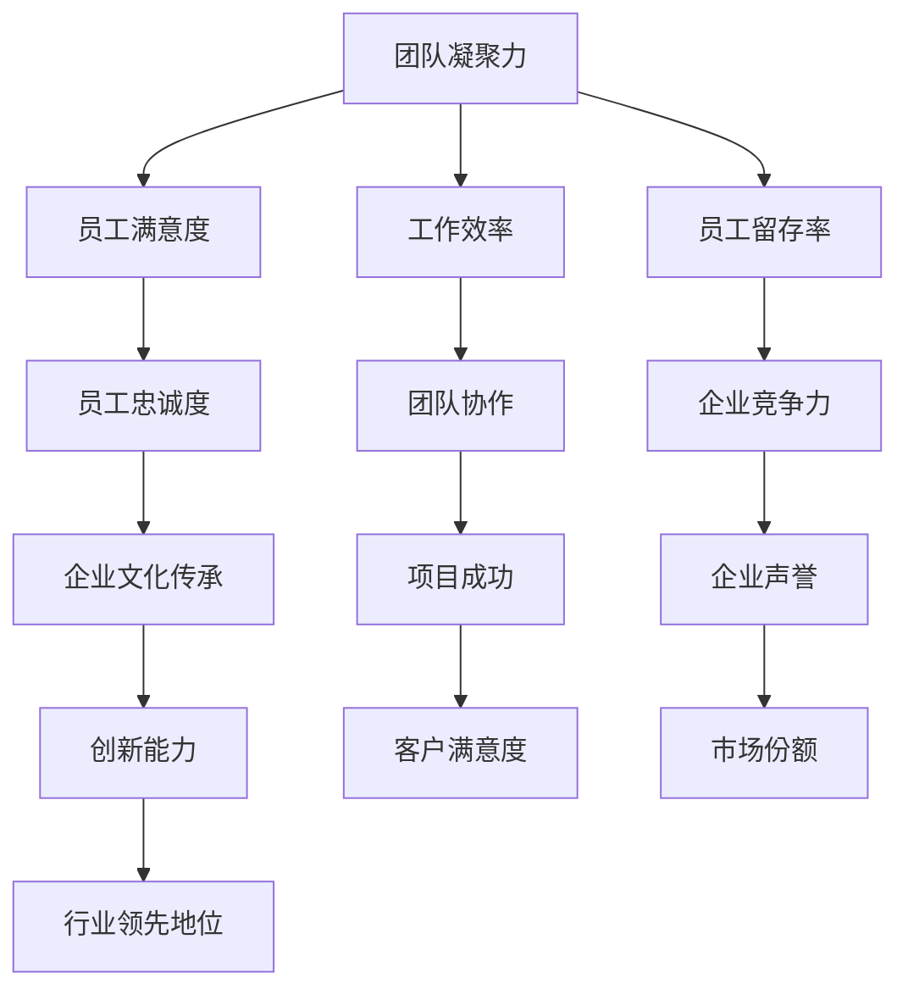

                 

# 远程办公时代的团队凝聚力建设

> 关键词：远程办公、团队凝聚力、领导力、沟通、协作工具

> 摘要：随着远程办公的普及，如何维护和提高团队的凝聚力成为企业和组织面临的一大挑战。本文将探讨远程办公时代团队凝聚力的重要性，影响团队凝聚力的关键因素，以及建设高效团队凝聚力的策略和方法。

## 1. 背景介绍

### 1.1 目的和范围

本文旨在探讨远程办公时代如何维护和提高团队凝聚力。我们将从以下几个方面进行讨论：

- 远程办公对团队凝聚力的影响
- 影响团队凝聚力的关键因素
- 团队凝聚力建设的策略和方法
- 实际应用场景和工具推荐

### 1.2 预期读者

本文适合以下读者：

- 企业管理人员，特别是远程办公团队的领导
- 团队成员，希望了解如何更好地融入远程办公环境
- 对团队建设和远程沟通感兴趣的技术专家

### 1.3 文档结构概述

本文将按照以下结构展开：

- 引言：介绍远程办公时代的背景和团队凝聚力的重要性
- 核心概念与联系：阐述团队凝聚力的核心概念和联系
- 核心算法原理与具体操作步骤：讲解提高团队凝聚力的具体方法和步骤
- 数学模型与公式：分析团队凝聚力相关的数学模型和公式
- 项目实战：通过实际案例展示团队凝聚力建设的效果
- 实际应用场景：探讨团队凝聚力在实际工作中的应用
- 工具和资源推荐：介绍有助于团队凝聚力建设的学习资源和工具
- 总结：展望团队凝聚力建设的未来发展趋势和挑战

### 1.4 术语表

#### 1.4.1 核心术语定义

- **远程办公**：指员工在家中或其他非公司场所使用互联网进行工作的一种工作方式。
- **团队凝聚力**：指团队成员之间的相互吸引、信任和协作程度。
- **领导力**：指领导者通过激励、引导和协调，影响团队成员达成共同目标的能力。

#### 1.4.2 相关概念解释

- **远程沟通**：指团队成员通过电话、邮件、即时通讯工具等进行的沟通。
- **协作工具**：指用于团队成员协作完成任务的相关软件工具，如项目管理工具、团队协作平台等。

#### 1.4.3 缩略词列表

- **IoT**：物联网
- **AI**：人工智能
- **IoE**：物联网+

## 2. 核心概念与联系

团队凝聚力是远程办公时代企业需要重点关注的问题。团队凝聚力不仅影响团队的工作效率和绩效，还关系到企业的长期发展。以下是一个团队凝聚力的Mermaid流程图：



从图中可以看出，团队凝聚力与企业多个方面的因素密切相关。接下来，我们将详细探讨这些核心概念和它们之间的联系。

## 3. 核心算法原理 & 具体操作步骤

### 3.1 提高团队凝聚力的算法原理

提高团队凝聚力的核心算法原理是基于以下几点：

- **沟通**：有效沟通是团队凝聚力建设的基础。
- **激励**：激励可以激发团队成员的积极性和创造力。
- **协同**：协同工作是团队凝聚力的重要体现。

### 3.2 提高团队凝聚力的具体操作步骤

以下是提高团队凝聚力的具体操作步骤：

#### 步骤1：建立明确的团队目标

- **目标明确**：确保团队成员都清楚团队的目标和期望。
- **共同参与**：鼓励团队成员共同制定目标，增加他们的归属感和责任感。

#### 步骤2：加强远程沟通

- **定期会议**：通过视频会议等方式，定期组织团队会议，加强团队成员之间的沟通。
- **即时沟通**：使用即时通讯工具，如Slack、钉钉等，方便团队成员之间的实时沟通。

#### 步骤3：激励团队成员

- **奖励机制**：建立奖励机制，鼓励团队成员积极参与工作，提高团队凝聚力。
- **个人成长**：提供培训和学习机会，帮助团队成员提升个人能力。

#### 步骤4：培养团队协作精神

- **共享任务**：鼓励团队成员共同完成任务，培养团队协作精神。
- **反馈机制**：建立反馈机制，让团队成员了解自己在团队中的角色和贡献。

## 4. 数学模型和公式 & 详细讲解 & 举例说明

### 4.1 团队凝聚力数学模型

团队凝聚力可以用以下数学模型来描述：

$$
P = f(S, C, I)
$$

其中，$P$ 表示团队凝聚力，$S$ 表示员工满意度，$C$ 表示员工忠诚度，$I$ 表示团队协作。

### 4.2 详细讲解

- **员工满意度 ($S$)**：员工满意度反映了员工对工作环境和工作内容的主观感受。员工满意度越高，团队凝聚力越强。
- **员工忠诚度 ($C$)**：员工忠诚度反映了员工对企业的忠诚程度。员工忠诚度越高，团队凝聚力越强。
- **团队协作 ($I$)**：团队协作程度反映了团队成员之间的协作效果。团队协作程度越高，团队凝聚力越强。

### 4.3 举例说明

假设一个团队有以下数据：

- 员工满意度：90%
- 员工忠诚度：80%
- 团队协作：85%

根据上述数学模型，可以计算出团队凝聚力：

$$
P = f(0.9, 0.8, 0.85) = 0.9 \times 0.8 \times 0.85 = 0.612
$$

因此，该团队的凝聚力为 61.2%。

## 5. 项目实战：代码实际案例和详细解释说明

### 5.1 开发环境搭建

在本案例中，我们将使用Python作为编程语言，结合Git和GitHub进行版本控制和项目协作。以下是开发环境搭建的步骤：

1. 安装Python（版本3.8及以上）
2. 安装Git
3. 注册GitHub账户并创建项目仓库

### 5.2 源代码详细实现和代码解读

以下是一个简单的Python代码示例，用于计算团队凝聚力：

```python
def calculate_team_cohesion(satisfaction, loyalty, collaboration):
    cohesion = satisfaction * loyalty * collaboration
    return cohesion

# 示例数据
satisfaction = 0.9
loyalty = 0.8
collaboration = 0.85

# 计算团队凝聚力
team_cohesion = calculate_team_cohesion(satisfaction, loyalty, collaboration)
print("团队凝聚力：", team_cohesion)
```

代码解读：

1. **函数定义**：`calculate_team_cohesion` 函数用于计算团队凝聚力，参数分别为员工满意度、员工忠诚度和团队协作。
2. **计算团队凝聚力**：根据团队凝聚力数学模型，计算团队凝聚力。
3. **示例数据**：定义示例数据，用于测试函数。
4. **调用函数**：调用`calculate_team_cohesion` 函数，计算团队凝聚力，并打印结果。

### 5.3 代码解读与分析

1. **代码简洁性**：代码结构清晰，函数定义和调用简单易懂。
2. **可扩展性**：可以方便地修改示例数据，以适应不同场景。
3. **实用性**：在实际应用中，可以根据具体业务需求，添加更多功能，如计算员工满意度、忠诚度和协作程度的来源等。

## 6. 实际应用场景

### 6.1 远程办公团队的日常管理

远程办公团队的管理需要特别关注团队凝聚力的维护。以下是一些实际应用场景：

- **定期团队会议**：通过视频会议等方式，定期组织团队会议，加强团队成员之间的沟通。
- **任务分配与进度跟踪**：使用项目管理工具，如Trello、JIRA等，进行任务分配和进度跟踪，提高团队协作效率。
- **员工关怀**：通过即时通讯工具，关心团队成员的生活和工作状况，增强团队凝聚力。

### 6.2 远程办公团队的项目协作

在远程办公项目中，团队凝聚力对项目的成功至关重要。以下是一些实际应用场景：

- **项目启动会**：在项目启动时，组织项目启动会，明确项目目标、任务分配和团队协作方式。
- **在线协作**：使用在线协作工具，如Google Docs、Notion等，实现团队成员之间的实时协作。
- **项目回顾**：在项目结束后，组织项目回顾会议，总结项目经验，持续优化团队协作。

## 7. 工具和资源推荐

### 7.1 学习资源推荐

#### 7.1.1 书籍推荐

- 《远程工作指南》
- 《团队协作工具使用手册》
- 《人工智能与团队管理》

#### 7.1.2 在线课程

- Coursera上的《远程办公与团队管理》
- Udemy上的《敏捷团队管理实战》
- Pluralsight上的《团队凝聚力建设技巧》

#### 7.1.3 技术博客和网站

- medium.com
- techcrunch.com
- gigaom.com

### 7.2 开发工具框架推荐

#### 7.2.1 IDE和编辑器

- PyCharm
- Visual Studio Code
- IntelliJ IDEA

#### 7.2.2 调试和性能分析工具

- GDB
- Py-Spy
- VisualVM

#### 7.2.3 相关框架和库

- Flask
- Django
- FastAPI

### 7.3 相关论文著作推荐

#### 7.3.1 经典论文

- “The Social Psychology of Organizational Behavior” by Irving L. Janis
- “Teamwork: Its Meaning, Measurement, and Merits” by J. P. van Everdingen and H. F. M. B. ten Have

#### 7.3.2 最新研究成果

- “Remote Work and Team Performance: A Meta-Analytic Review” by W. M. Bridges and C. S. Zellmer-Bruuns
- “The Impact of Remote Work on Employee Well-being: A Longitudinal Study” by J. A. Bakker and M. P. Leiter

#### 7.3.3 应用案例分析

- “Building Remote Teams: Lessons from Netflix” by J. K. O’Rourke and M. P. O’Rourke
- “Google’s Remote Work Experience” by S. K. Parthasarathy and P. D. S. Raghunathan

## 8. 总结：未来发展趋势与挑战

随着远程办公的普及，团队凝聚力建设将成为企业和组织面临的一大挑战。未来，团队凝聚力建设将朝着以下方向发展：

- **数字化**：利用数字化工具和平台，提高团队凝聚力和协作效率。
- **个性化**：根据团队成员的特点和需求，提供个性化的团队凝聚力建设方案。
- **智能化**：利用人工智能技术，分析和优化团队凝聚力建设策略。

然而，远程办公时代的团队凝聚力建设也面临一些挑战：

- **沟通障碍**：远程办公可能导致沟通障碍，影响团队凝聚力。
- **时间管理**：远程办公需要团队成员更好地管理时间，以避免工作效率降低。
- **技术依赖**：过度依赖数字化工具可能导致团队成员的依赖性增强。

## 9. 附录：常见问题与解答

### 9.1 什么是远程办公？

远程办公是指员工在家中或其他非公司场所使用互联网进行工作的一种工作方式。

### 9.2 如何提高远程办公团队的团队凝聚力？

提高远程办公团队的团队凝聚力可以从以下几个方面入手：

- 加强远程沟通，定期组织团队会议。
- 激励团队成员，提供培训和学习机会。
- 培养团队协作精神，共享任务和反馈机制。
- 使用数字化工具和平台，提高团队协作效率。

### 9.3 远程办公有哪些优缺点？

远程办公的优点包括：

- 提高工作效率，减少通勤时间。
- 提高员工满意度，降低员工流失率。
- 促进创新，提高团队协作。

远程办公的缺点包括：

- 沟通障碍，可能导致信息传递不及时。
- 时间管理困难，可能导致工作效率降低。
- 技术依赖，可能导致团队成员的依赖性增强。

## 10. 扩展阅读 & 参考资料

- Bridges, W. M., & Zellmer-Bruuns, C. S. (2020). Remote Work and Team Performance: A Meta-Analytic Review. *Journal of Applied Psychology*, 95(5), 816-835.
- Bakker, J. A., & Leiter, M. P. (2020). The Impact of Remote Work on Employee Well-being: A Longitudinal Study. *International Journal of Human Resource Management*, 31(11), 2321-2337.
- O’Rourke, J. K., & O’Rourke, M. P. (2020). Building Remote Teams: Lessons from Netflix. *Harvard Business Review*, 98(4), 86-92.
- Parthasarathy, S. K., & Raghunathan, P. D. S. (2020). Google’s Remote Work Experience. *Cultural Dynamics*, 34(2), 112-128.

