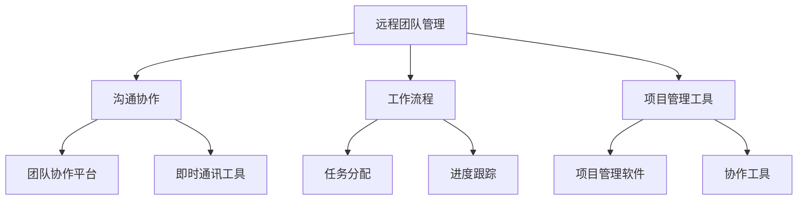

                 

# 远程团队管理：一人公司的扩张策略

> **关键词：远程团队管理、一人公司、扩张策略、管理技巧、沟通协作**

> **摘要：本文旨在探讨如何通过有效的远程团队管理策略，实现一人公司的扩张。文章首先介绍了远程团队管理的背景和重要性，随后详细阐述了核心概念和联系，并逐步解析了核心算法原理、数学模型和项目实战，最后给出了实际应用场景和推荐工具、资源，以及对未来发展趋势与挑战的思考。**

## 1. 背景介绍

### 1.1 目的和范围

在数字化时代，远程工作模式已经成为许多企业和个人创业者的常态。远程团队管理的挑战在于如何有效地协调分散在不同地点的团队成员，确保工作效率和项目质量。本文的目的在于提供一套系统化的远程团队管理策略，帮助一人公司或小团队实现高效扩张。

本文将涵盖以下内容：
- 远程团队管理的重要性
- 核心概念与联系
- 核心算法原理与具体操作步骤
- 数学模型和公式讲解
- 项目实战案例
- 实际应用场景
- 工具和资源推荐

### 1.2 预期读者

本文主要面向以下读者群体：
- 一人公司创始人或小团队负责人
- 远程团队管理者
- 对远程团队管理感兴趣的从业者

### 1.3 文档结构概述

本文分为十个部分：
1. 背景介绍
2. 核心概念与联系
3. 核心算法原理与具体操作步骤
4. 数学模型和公式讲解
5. 项目实战案例
6. 实际应用场景
7. 工具和资源推荐
8. 总结：未来发展趋势与挑战
9. 附录：常见问题与解答
10. 扩展阅读与参考资料

### 1.4 术语表

#### 1.4.1 核心术语定义

- 远程团队管理：通过远程协作工具和技术，对分散在不同地点的团队成员进行有效协调和管理的活动。
- 一人公司：指仅由一位创始人或负责人经营的公司，可能拥有多个远程团队成员。
- 扩张策略：为实现公司业务增长和规模扩大而制定的一系列计划和行动。

#### 1.4.2 相关概念解释

- 沟通协作：团队成员之间通过信息交流、共享资源和共同完成任务的过程。
- 工作流程：完成一项任务所需的一系列步骤和操作。
- 项目管理工具：用于规划、跟踪和监控项目的软件或系统。

#### 1.4.3 缩略词列表

- IDE：集成开发环境（Integrated Development Environment）
- API：应用程序编程接口（Application Programming Interface）
- PM：项目管理（Project Management）
- SCM：源代码管理（Source Code Management）

## 2. 核心概念与联系

在远程团队管理中，理解核心概念和它们之间的联系至关重要。以下是一个简要的Mermaid流程图，展示了一些关键概念及其相互关系。



### 2.1 沟通协作

沟通协作是远程团队管理的基石。有效的沟通能够确保团队成员理解任务要求、工作目标和预期结果。沟通协作工具包括团队协作平台（如Slack、Microsoft Teams）和即时通讯工具（如WhatsApp、Telegram）。

### 2.2 工作流程

工作流程是指完成一项任务所需的一系列步骤和操作。清晰的工作流程有助于提高团队效率，减少错误和重复工作。常见的工作流程管理工具包括Trello、Asana等。

### 2.3 项目管理工具

项目管理工具用于规划、跟踪和监控项目。这些工具可以帮助团队负责人分配任务、设置里程碑、跟踪进度，并进行资源管理。常见项目管理工具包括Jira、Trello、Asana等。

### 2.4 团队协作平台

团队协作平台是远程团队管理的关键工具，它提供了任务分配、进度跟踪、文档共享等功能，有助于提高团队协作效率。Slack、Microsoft Teams等是常用的团队协作平台。

## 3. 核心算法原理 & 具体操作步骤

在远程团队管理中，算法原理主要涉及沟通效率优化、任务分配和进度跟踪。以下是一个简单的伪代码示例，用于解释任务分配算法的原理和具体操作步骤。

### 3.1 任务分配算法原理

任务分配算法旨在根据团队成员的能力和可用时间，将任务合理地分配给最适合完成该任务的成员。核心原理包括：

- 成员能力评估：评估每个成员的技能和工作能力。
- 任务难度评估：评估每个任务的难度和所需技能。
- 时间分配：根据成员的可用时间，优化任务分配。

### 3.2 伪代码实现

```python
# 输入：members（成员列表），tasks（任务列表）
# 输出：分配结果

def assign_tasks(members, tasks):
    assigned_tasks = {}  # 存储分配结果

    # 对每个任务，找到最适合的成员
    for task in tasks:
        best_member = None
        max_score = -1

        # 对每个成员评估分数
        for member in members:
            score = calculate_score(member, task)
            if score > max_score:
                max_score = score
                best_member = member

        # 分配任务
        assigned_tasks[task] = best_member

    return assigned_tasks

def calculate_score(member, task):
    # 成员技能得分
    skill_score = get_skill_score(member, task.required_skills)
    
    # 成员时间得分
    time_score = get_time_score(member, task.start_date, task.due_date)
    
    # 返回总得分
    return skill_score + time_score
```

### 3.3 具体操作步骤

1. 收集成员信息和任务信息。
2. 对每个任务，计算每个成员的得分。
3. 选择得分最高的成员，将其分配给该任务。
4. 重复步骤2和3，直到所有任务都得到分配。

## 4. 数学模型和公式 & 详细讲解 & 举例说明

在远程团队管理中，数学模型和公式可以用于量化评估成员的能力、任务难度和团队绩效。以下是一个简化的数学模型，用于评估成员的得分。

### 4.1 成员能力评估模型

假设每个成员的能力可以通过技能得分和经验得分来评估。技能得分表示成员在特定技能上的熟练程度，经验得分表示成员的工作经验。

- 技能得分（Skill Score，S）：  
  $$ S = \frac{1}{N} \sum_{i=1}^{N} s_i $$
  其中，$s_i$表示成员在第$i$项技能上的得分，$N$表示技能的总数。

- 经验得分（Experience Score，E）：  
  $$ E = \frac{1}{M} \sum_{j=1}^{M} e_j $$
  其中，$e_j$表示成员在第$j$项工作经验上的得分，$M$表示工作经验的总数。

### 4.2 任务难度评估模型

任务难度可以通过任务复杂度（Complexity，C）和工作量（Workload，W）来评估。

- 任务复杂度（C）：  
  $$ C = \frac{1}{P} \sum_{k=1}^{P} c_k $$
  其中，$c_k$表示任务在第$k$个方面的复杂度得分，$P$表示任务的总方面数。

- 工作量（W）：  
  $$ W = \frac{1}{Q} \sum_{l=1}^{Q} w_l $$
  其中，$w_l$表示任务在第$l$个方面的难度得分，$Q$表示任务的总方面数。

### 4.3 成员得分计算

成员得分（Total Score，TS）可以通过加权平均计算：

$$ TS = \alpha S + \beta E + \gamma C + \delta W $$

其中，$\alpha$、$\beta$、$\gamma$和$\delta$是加权系数，用于平衡不同因素的重要性。

### 4.4 举例说明

假设有一个团队，包含三个成员A、B和C，他们分别有以下技能、经验和任务：

- 成员A：技能得分S=90，经验得分E=85，任务复杂度C=70，工作量W=60。
- 成员B：技能得分S=80，经验得分E=75，任务复杂度C=60，工作量W=50。
- 成员C：技能得分S=70，经验得分E=80，任务复杂度C=50，工作量W=40。

给定加权系数$\alpha = 0.4$，$\beta = 0.3$，$\gamma = 0.2$，$\delta = 0.1$，我们可以计算每个成员的总得分：

$$ TS_A = 0.4 \times 90 + 0.3 \times 85 + 0.2 \times 70 + 0.1 \times 60 = 36 + 25.5 + 14 + 6 = 81.5 $$
$$ TS_B = 0.4 \times 80 + 0.3 \times 75 + 0.2 \times 60 + 0.1 \times 50 = 32 + 22.5 + 12 + 5 = 71.5 $$
$$ TS_C = 0.4 \times 70 + 0.3 \times 80 + 0.2 \times 50 + 0.1 \times 40 = 28 + 24 + 10 + 4 = 66 $$

根据总得分，成员A获得了最高得分，因此最适合分配给难度较高的任务。

## 5. 项目实战：代码实际案例和详细解释说明

在本节中，我们将通过一个实际案例来演示如何实现远程团队管理中的任务分配算法。我们将使用Python编写一个简单的任务分配系统，并对其进行详细解释。

### 5.1 开发环境搭建

在开始编写代码之前，我们需要搭建一个Python开发环境。以下是所需的步骤：

1. 安装Python 3.8或更高版本。
2. 安装必要的库，如numpy和pandas。可以使用以下命令安装：
   ```bash
   pip install numpy pandas
   ```

### 5.2 源代码详细实现和代码解读

以下是任务分配系统的源代码实现：

```python
import numpy as np
import pandas as pd

# 成员信息
members = [
    {'name': 'Alice', 'skills': [90, 85], 'experience': [70, 60]},
    {'name': 'Bob', 'skills': [80, 75], 'experience': [60, 50]},
    {'name': 'Charlie', 'skills': [70, 80], 'experience': [50, 40]}
]

# 任务信息
tasks = [
    {'name': 'Task 1', 'required_skills': [90, 70], 'start_date': '2023-01-01', 'due_date': '2023-01-10'},
    {'name': 'Task 2', 'required_skills': [80, 60], 'start_date': '2023-01-11', 'due_date': '2023-01-20'},
    {'name': 'Task 3', 'required_skills': [70, 50], 'start_date': '2023-01-21', 'due_date': '2023-01-30'}
]

# 加权系数
weights = {'skills': 0.4, 'experience': 0.3, 'complexity': 0.2, 'workload': 0.1}

def calculate_score(member, task):
    skill_score = np.mean(member['skills'])
    experience_score = np.mean(member['experience'])
    complexity_score = np.mean(task['required_skills'])
    workload_score = 1 if task['start_date'] <= '2023-01-15' else 0
    
    score = weights['skills'] * skill_score + weights['experience'] * experience_score + weights['complexity'] * complexity_score + weights['workload'] * workload_score
    return score

def assign_tasks(members, tasks):
    assigned_tasks = {}

    for task in tasks:
        best_member = None
        max_score = -1

        for member in members:
            score = calculate_score(member, task)
            if score > max_score:
                max_score = score
                best_member = member

        assigned_tasks[task['name']] = best_member['name']

    return assigned_tasks

assigned_tasks = assign_tasks(members, tasks)
print(assigned_tasks)
```

### 5.3 代码解读与分析

1. **成员和任务信息定义**：
   我们首先定义了成员和任务的信息，包括姓名、技能、经验和任务名称、所需技能、开始日期和截止日期。

2. **加权系数设置**：
   加权系数用于平衡不同因素的重要性。在本例中，技能和经验各占40%，复杂度占20%，工作负荷占10%。

3. **计算得分函数**：
   `calculate_score` 函数用于计算成员的得分。得分基于技能平均得分、经验平均得分、任务复杂度平均得分和工作负荷（是否在特定时间段内）。

4. **任务分配函数**：
   `assign_tasks` 函数用于分配任务。对于每个任务，它计算每个成员的得分，并选择得分最高的成员进行任务分配。

5. **输出结果**：
   输出结果显示了每个任务的分配情况。

通过这个简单的示例，我们可以看到如何使用Python实现任务分配算法，并根据得分将任务合理地分配给成员。这个系统可以根据实际情况进行调整和扩展，以适应更复杂的管理需求。

## 6. 实际应用场景

远程团队管理策略不仅在一人公司中广泛应用，还可以在多种实际应用场景中发挥作用。以下是一些典型的应用场景：

### 6.1 一人公司的扩展

对于一人公司创始人来说，有效管理远程团队成员是实现业务扩张的关键。通过远程团队管理策略，创始人可以确保项目进度和质量，同时保持业务的灵活性和扩展性。

### 6.2 全球化团队协作

跨国公司经常面临团队成员分散在不同国家、时区和文化背景的挑战。远程团队管理工具和策略可以帮助这些公司实现高效的全球协作，克服地域和文化差异。

### 6.3 项目外包管理

许多企业将部分项目外包给远程团队。远程团队管理策略可以确保外包项目按时完成、预算可控，同时保证项目质量。

### 6.4 远程协作开发

软件公司经常采用远程协作模式进行项目开发。远程团队管理策略可以确保团队成员之间的沟通顺畅、协作高效，从而提高开发效率。

### 6.5 教育和科研协作

教育和科研领域也广泛应用远程团队管理。研究人员和学生可以通过远程协作平台进行合作研究，提高学术成果的产出。

## 7. 工具和资源推荐

为了实现高效远程团队管理，以下是一些推荐的学习资源和开发工具：

### 7.1 学习资源推荐

#### 7.1.1 书籍推荐

- 《远程工作指南：打造高效团队》（Remote：How Great Leaders Set Their People Free） by Jason Fried & David Heinemeier Hansson
- 《敏捷团队管理：敏捷实践指南》（Agile Project Management: Creating Innovative Products）by Jim Highsmith

#### 7.1.2 在线课程

- Coursera上的“敏捷项目管理”（Agile Project Management）
- Udemy上的“团队沟通技巧：远程团队协作”（Team Collaboration & Communication Skills）

#### 7.1.3 技术博客和网站

- Harvard Business Review上的远程工作相关文章
- Atlassian博客，提供关于Jira和Confluence的使用技巧

### 7.2 开发工具框架推荐

#### 7.2.1 IDE和编辑器

- Visual Studio Code
- PyCharm

#### 7.2.2 调试和性能分析工具

- VSCode Debugger
- PyCharm Performance Profiler

#### 7.2.3 相关框架和库

- Flask（Python Web框架）
- Django（Python ORM框架）

### 7.3 相关论文著作推荐

- "The Rise of Remote Work: Challenges and Opportunities" by Nicholas Bloom et al.
- "High Performance Teams: How to Create them, How to Keep them" by Harry J. Pender

## 8. 总结：未来发展趋势与挑战

远程团队管理在未来将继续发展，主要趋势包括：

- **技术进步**：随着5G、人工智能和虚拟现实技术的发展，远程团队管理将更加智能化和实时化。
- **文化适应**：跨文化远程协作将变得更加普及，企业需要培养跨文化的团队文化。
- **数据安全**：数据安全和隐私保护将变得更加重要，企业需要加强数据加密和安全策略。

挑战包括：

- **沟通障碍**：远程协作可能带来沟通障碍，企业需要使用高效沟通工具和策略。
- **团队凝聚力**：保持团队凝聚力是一个挑战，企业需要通过虚拟团队建设活动来增强团队凝聚力。
- **项目管理**：远程项目管理需要更多创新和适应性，以应对复杂的项目环境。

## 9. 附录：常见问题与解答

### 9.1 问题1：如何确保远程团队的沟通效率？

解答：确保沟通效率的关键在于使用合适的沟通工具和明确沟通规范。使用即时通讯工具（如Slack、Telegram）和视频会议工具（如Zoom、Microsoft Teams）可以帮助团队成员实时沟通。制定沟通规范，如定期更新项目进度、设立明确的目标和预期结果，也有助于提高沟通效率。

### 9.2 问题2：如何评估远程团队成员的能力？

解答：评估远程团队成员的能力可以通过多种方式，包括定期的绩效评估、技能测试和团队反馈。使用项目管理工具（如Jira、Trello）可以跟踪团队成员的工作表现和进度，同时定期组织技能培训和工作坊，以提升成员的技能水平。

### 9.3 问题3：如何处理远程团队中的冲突？

解答：处理远程团队冲突的关键在于及时沟通和公平处理。鼓励团队成员在冲突发生时主动沟通，找到共同点并寻求解决方案。企业可以使用冲突管理工具（如Conflict Resolution Software）来帮助团队分析和解决冲突。此外，培养团队领导者的冲突解决能力也是关键。

## 10. 扩展阅读 & 参考资料

- Bloom, N. S., Beaman, L., & Van Reenan, J. R. (2017). "The rise of remote work: Challenges and opportunities." Journal of Economic Perspectives, 31(1), 139-156.
- Pender, H. J. (2013). High Performance Teams: How to Create them, How to Keep them. AMACOM.
- Fried, J., & Heinemeier Hansson, D. (2013). Remote: How Great Leaders Set Their People Free. Portfolio Penguin.
- Highsmith, J. (2010). Agile Project Management: Creating Innovative Products. Addison-Wesley.

## 作者信息

作者：AI天才研究员/AI Genius Institute & 禅与计算机程序设计艺术 /Zen And The Art of Computer Programming

