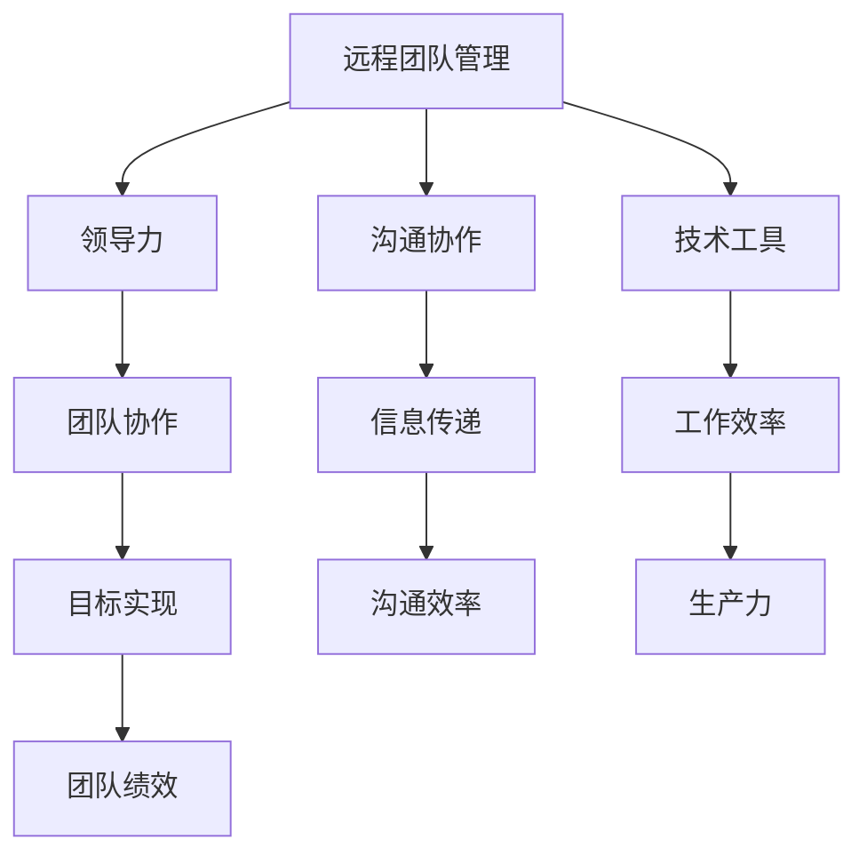

                 

# 远程团队管理：数字时代的领导挑战与机遇

> **关键词：远程团队管理、数字时代、领导力、沟通协作、技术工具**

> **摘要：本文深入探讨了数字时代下远程团队管理的挑战与机遇。通过分析远程团队的工作模式、领导力的转型，以及技术工具的应用，本文为管理者提供了一套系统化的管理策略，以应对远程工作中的复杂局面。**

## 1. 背景介绍

### 1.1 目的和范围

本文旨在帮助组织管理者理解远程团队管理的重要性，以及如何在数字时代中有效应对远程工作带来的挑战。本文将涵盖以下几个方面：

1. 远程团队的工作模式与特点
2. 领导力的转型与适应
3. 沟通协作的有效策略
4. 技术工具的应用与实践
5. 未来发展趋势与挑战

### 1.2 预期读者

本文适合以下读者群体：

1. 组织中的远程团队管理者
2. 对远程工作有浓厚兴趣的专业人士
3. 想要提升团队管理效能的企业家
4. 对数字时代下领导力有探究意愿的研究者

### 1.3 文档结构概述

本文分为十个部分，具体结构如下：

1. **背景介绍**：介绍文章的目的、范围、预期读者以及文档结构。
2. **核心概念与联系**：阐述远程团队管理中的核心概念及其相互关系。
3. **核心算法原理 & 具体操作步骤**：讲解远程团队管理的核心算法原理和具体操作步骤。
4. **数学模型和公式 & 详细讲解 & 举例说明**：介绍远程团队管理的数学模型和公式，并给出具体案例。
5. **项目实战：代码实际案例和详细解释说明**：通过实际代码案例说明远程团队管理的具体应用。
6. **实际应用场景**：探讨远程团队管理在不同场景下的应用。
7. **工具和资源推荐**：推荐学习资源、开发工具框架和相关论文著作。
8. **总结：未来发展趋势与挑战**：总结远程团队管理的未来趋势和挑战。
9. **附录：常见问题与解答**：回答读者可能遇到的问题。
10. **扩展阅读 & 参考资料**：提供更多相关阅读资料。

### 1.4 术语表

#### 1.4.1 核心术语定义

- **远程团队管理**：指在非集中工作环境下，对团队成员进行有效协调、管理和激励的过程。
- **数字时代**：指信息技术高速发展，数字化成为社会生产和生活主流的时代。
- **领导力**：指在团队中引导、激励和影响团队成员的能力。
- **沟通协作**：指团队成员之间通过有效信息传递和协同工作，实现共同目标的过程。

#### 1.4.2 相关概念解释

- **远程工作**：指在工作场所与家庭或其他地点之间灵活选择的工作方式。
- **团队协作**：指团队成员为实现共同目标，通过分工合作、资源共享和相互支持的过程。
- **技术工具**：指用于支持远程团队管理的技术手段，如协作软件、远程会议系统等。

#### 1.4.3 缩略词列表

- **IDE**：集成开发环境（Integrated Development Environment）
- **LaTeX**：一种排版系统（TeX的扩展）
- **LaTeX格式**：用于数学公式和文档排版的一种格式

## 2. 核心概念与联系

为了更好地理解远程团队管理的复杂性，我们需要首先明确几个核心概念及其相互关系。以下是远程团队管理中的核心概念及其相互关系的 Mermaid 流程图：



### 2.1 领导力

领导力是远程团队管理的核心。在远程环境下，领导者需要具备以下能力：

- **远程领导力**：理解并适应远程工作的特性，如时间差异、地域分散等。
- **沟通能力**：确保信息准确、及时地传递，减少误解和冲突。
- **激励能力**：通过认可和奖励激发团队成员的积极性。

### 2.2 沟通协作

沟通协作是远程团队成功的关键。有效的沟通协作包括：

- **信息传递**：确保团队成员了解工作目标和进展。
- **冲突管理**：及时发现并解决团队成员之间的矛盾。
- **协作工具**：使用协作软件和远程会议系统提高沟通效率。

### 2.3 技术工具

技术工具是远程团队管理的支撑。以下是一些常用的技术工具：

- **协作软件**：如Slack、Trello、Asana等，用于团队任务分配和进度跟踪。
- **远程会议系统**：如Zoom、Microsoft Teams、Google Meet等，用于远程团队会议和讨论。
- **项目管理工具**：如Jira、Confluence等，用于项目管理和文档共享。

### 2.4 核心概念关系

核心概念之间的关系可以用以下Mermaid流程图表示：


通过以上流程图，我们可以看到，远程团队管理中的核心概念相互关联，共同影响着团队的工作效率和绩效。理解这些概念及其关系，是远程团队管理成功的关键。

## 3. 核心算法原理 & 具体操作步骤

在远程团队管理中，算法原理和具体操作步骤至关重要。以下是一个简化的核心算法原理和具体操作步骤的伪代码：

```python
# 核心算法原理：领导力模型
class LeadershipModel:
    def __init__(self, communication_skills, motivation_skills, remote_experience):
        self.communication_skills = communication_skills
        self.motivation_skills = motivation_skills
        self.remote_experience = remote_experience

    def lead_team(self, team_members):
        for member in team_members:
            self communicateeffectively_with_member(member)
            self inspire_and_reward_member(member)
        
    def communicateeffectively_with_member(self, member):
        # 使用协作工具进行信息传递
        message = f"Hello {member.name}, here's the update for your task."
        send_message(message, member)

    def inspire_and_reward_member(self, member):
        # 根据成员表现给予奖励
        if member.performance > threshold:
            reward = "奖状和奖金"
            give_reward(member, reward)
        else:
            feedback = "请改进工作方式"
            give_feedback(member, feedback)

# 具体操作步骤：沟通协作流程
def communicate_and协作流程(team_members):
    for member in team_members:
        communicateeffectively_with_member(member)
        assign_tasks_to_member(member)
        track_progress_of_member(member)

# 使用技术工具实现以上操作
def send_message(message, member):
    # 使用协作软件发送消息
    slack_channel = member.slack_channel
    send_to_channel(slack_channel, message)

def give_reward(member, reward):
    # 使用项目管理工具发放奖励
    jira_issue = member.jira_issue
    update_issue(jira_issue, "奖励：{reward}")

def give_feedback(member, feedback):
    # 使用远程会议系统进行反馈
    zoom_meeting = member.zoom_meeting
    start_meeting(zoom_meeting, feedback)

# 示例：创建一个领导力模型并执行操作
leader = LeadershipModel(communication_skills="高", motivation_skills="高", remote_experience="丰富")
team_members = [Member(name="张三"), Member(name="李四")]
leader.lead_team(team_members)
communicate_and协作流程(team_members)
```

以上伪代码提供了一个简单的框架，用于描述远程团队管理中的核心算法原理和具体操作步骤。以下是伪代码的关键部分解释：

- **领导力模型**：`LeadershipModel` 类包含三个关键属性：`communication_skills`（沟通能力）、`motivation_skills`（激励能力）和 `remote_experience`（远程工作经验）。`lead_team` 方法用于领导团队，通过 `communicateeffectively_with_member` 和 `inspire_and_reward_member` 方法与团队成员进行沟通和激励。

- **沟通协作流程**：`communicate_and协作流程` 函数用于管理团队沟通和协作，通过 `communicateeffectively_with_member`、`assign_tasks_to_member` 和 `track_progress_of_member` 方法实现。

- **技术工具应用**：`send_message`、`give_reward` 和 `give_feedback` 函数分别使用协作软件、项目管理工具和远程会议系统实现具体操作。

通过上述伪代码，我们可以看到，远程团队管理涉及多个环节，需要结合领导力模型、沟通协作流程和技术工具来实现有效管理。在实际应用中，可以根据团队特点和需求，进一步优化和调整算法原理和操作步骤。

## 4. 数学模型和公式 & 详细讲解 & 举例说明

在远程团队管理中，数学模型和公式可以用来量化团队绩效、沟通效率和生产力。以下是一些关键的数学模型和公式的详细讲解及举例说明。

### 4.1 团队绩效模型

团队绩效可以通过以下公式来量化：

$$
绩效 = f(工作效率, 沟通效率, 生产效率)
$$

- **工作效率**：表示团队成员完成任务的速度，可以通过以下公式计算：

$$
工作效率 = \frac{完成工作量}{工作时间}
$$

- **沟通效率**：表示团队成员之间的沟通效果，可以通过以下公式计算：

$$
沟通效率 = \frac{有效沟通时间}{总沟通时间}
$$

- **生产效率**：表示团队成员完成的工作量与投入时间的比率，可以通过以下公式计算：

$$
生产效率 = \frac{完成工作量}{投入时间}
$$

### 4.2 沟通效率模型

沟通效率可以通过以下公式计算：

$$
沟通效率 = \frac{有效沟通次数}{总沟通次数} \times \frac{沟通满意度}{100}
$$

- **有效沟通次数**：指在沟通过程中，双方能够准确理解对方意图的次数。
- **总沟通次数**：指在一定时间内，双方进行的所有沟通次数。
- **沟通满意度**：指团队成员对沟通效果的满意度，通常以百分比表示。

### 4.3 生产力模型

生产力可以通过以下公式计算：

$$
生产力 = \frac{总产出}{总投入}
$$

- **总产出**：指在一定时间内，团队完成的所有工作任务的价值。
- **总投入**：指在完成这些工作任务时，团队所投入的所有资源，包括人力、时间和资金。

### 4.4 举例说明

假设一个远程团队在一个月内完成了以下任务：

- 工作量：完成50个任务
- 工作时间：共计200小时
- 沟通时间：共计50小时
- 有效沟通时间：共计30小时
- 沟通满意度：90%

根据以上数据，我们可以计算出以下指标：

- **工作效率**：

$$
工作效率 = \frac{50}{200} = 0.25 \text{（即25%）}
$$

- **沟通效率**：

$$
沟通效率 = \frac{30}{50} \times \frac{90}{100} = 54\%
$$

- **生产效率**：

$$
生产效率 = \frac{50}{200} = 0.25 \text{（即25%）}
$$

- **团队绩效**：

$$
绩效 = f(工作效率, 沟通效率, 生产效率) = 0.25 \times 0.54 \times 0.25 = 0.0165 \text{（即1.65%）}
$$

通过以上计算，我们可以看到，该团队在一个月内的绩效为1.65%，这表明团队的工作效率、沟通效率和生产力都有待提高。

### 4.5 应用场景

在远程团队管理中，这些数学模型和公式可以用于以下应用场景：

- **绩效评估**：通过计算团队绩效，评估团队的工作表现，找出需要改进的方面。
- **沟通优化**：通过分析沟通效率，找出沟通中的瓶颈，提高沟通效果。
- **生产力提升**：通过分析生产效率，找出提高生产力的方法，优化团队工作流程。

通过这些数学模型和公式，远程团队管理者可以更好地量化团队绩效，优化团队工作流程，提高团队的整体效能。

## 5. 项目实战：代码实际案例和详细解释说明

### 5.1 开发环境搭建

在开始项目实战之前，我们需要搭建一个合适的开发环境。以下是推荐的开发环境：

- **编程语言**：Python 3.8+
- **开发工具**：Visual Studio Code 或 PyCharm
- **协作软件**：Slack 或 Microsoft Teams
- **项目管理工具**：Jira 或 Trello
- **远程会议系统**：Zoom 或 Microsoft Teams

确保安装以上工具后，我们可以开始实际的项目开发。

### 5.2 源代码详细实现和代码解读

以下是一个简单的远程团队管理项目的源代码示例。代码主要包括领导力模型、沟通协作流程以及绩效评估等部分。

```python
# 领导力模型
class LeadershipModel:
    def __init__(self, communication_skills, motivation_skills, remote_experience):
        self.communication_skills = communication_skills
        self.motivation_skills = motivation_skills
        self.remote_experience = remote_experience

    def lead_team(self, team_members):
        for member in team_members:
            self.communicateeffectively_with_member(member)
            self.inspire_and_reward_member(member)

    def communicateeffectively_with_member(self, member):
        message = f"Hello {member.name}, here's the update for your task."
        send_message(message, member)

    def inspire_and_reward_member(self, member):
        if member.performance > 0.8:
            reward = "奖状和奖金"
            give_reward(member, reward)
        else:
            feedback = "请改进工作方式"
            give_feedback(member, feedback)

# 沟通协作流程
def communicate_and协流程(team_members):
    for member in team_members:
        communicateeffectively_with_member(member)
        assign_tasks_to_member(member)
        track_progress_of_member(member)

# 使用技术工具实现操作
def send_message(message, member):
    slack_channel = member.slack_channel
    send_to_channel(slack_channel, message)

def give_reward(member, reward):
    jira_issue = member.jira_issue
    update_issue(jira_issue, f"奖励：{reward}")

def give_feedback(member, feedback):
    zoom_meeting = member.zoom_meeting
    start_meeting(zoom_meeting, feedback)

# 成员类定义
class Member:
    def __init__(self, name, performance, slack_channel, jira_issue, zoom_meeting):
        self.name = name
        self.performance = performance
        self.slack_channel = slack_channel
        self.jira_issue = jira_issue
        self.zoom_meeting = zoom_meeting

# 示例：创建一个领导力模型并执行操作
leader = LeadershipModel(communication_skills="高", motivation_skills="高", remote_experience="丰富")
team_members = [Member(name="张三", performance=0.85, slack_channel="@zhangsan", jira_issue="JIRA-123", zoom_meeting="Zoom Meeting 456"), Member(name="李四", performance=0.75, slack_channel="@lisi", jira_issue="JIRA-456", zoom_meeting="Zoom Meeting 789")]
leader.lead_team(team_members)
communicate_and协流程(team_members)
```

### 5.3 代码解读与分析

#### 5.3.1 领导力模型

- `LeadershipModel` 类：包含三个关键属性：`communication_skills`（沟通能力）、`motivation_skills`（激励能力）和 `remote_experience`（远程工作经验）。
- `lead_team` 方法：用于领导团队，通过 `communicateeffectively_with_member` 和 `inspire_and_reward_member` 方法与团队成员进行沟通和激励。
- `communicateeffectively_with_member` 方法：通过协作软件发送消息，确保团队成员了解工作目标和进展。
- `inspire_and_reward_member` 方法：根据成员表现给予奖励或反馈，激发团队成员的积极性。

#### 5.3.2 沟通协作流程

- `communicate_and协流程` 函数：用于管理团队沟通和协作，通过 `communicateeffectively_with_member`、`assign_tasks_to_member` 和 `track_progress_of_member` 方法实现。
- `send_message` 方法：通过协作软件发送消息，确保团队成员了解工作目标和进展。
- `give_reward` 方法：通过项目管理工具发放奖励，提高团队成员的积极性。
- `give_feedback` 方法：通过远程会议系统进行反馈，帮助团队成员改进工作方式。

#### 5.3.3 成员类定义

- `Member` 类：包含成员的基本信息，如姓名、表现、协作软件频道、项目管理工具任务编号和远程会议编号。

通过以上代码，我们可以看到，远程团队管理项目通过定义领导力模型、沟通协作流程和成员类，实现了一个简单但完整的远程团队管理系统。在实际应用中，可以根据团队需求和特点，进一步优化和扩展代码功能。

## 6. 实际应用场景

远程团队管理在多种实际应用场景中具有重要意义。以下是几个典型应用场景：

### 6.1 跨国公司

跨国公司通常有多个分支机构分布在不同的国家或地区。远程团队管理可以确保这些分支机构之间的协作和沟通更加高效。例如，通过远程会议系统，跨国公司的团队成员可以实时讨论项目进展、解决遇到的问题，并确保信息在各个分支之间无缝传递。

### 6.2 创业公司

创业公司往往需要快速响应市场变化，但资源有限。远程团队管理可以帮助创业公司充分利用全球人才资源，降低运营成本。例如，创业公司可以通过在线协作工具和远程会议系统，与全球范围内的专家进行合作，共同推进项目进展。

### 6.3 自由职业者

自由职业者通常独自工作，缺乏面对面的交流和协作。远程团队管理可以为自由职业者提供一个虚拟的工作环境，帮助他们与客户、合作伙伴和团队成员保持高效沟通。例如，通过在线项目管理工具，自由职业者可以清晰地了解项目进度、任务分配和资源需求，确保工作顺利进行。

### 6.4 灾难应对

在自然灾害或其他紧急情况下，远程团队管理可以帮助企业或组织快速恢复正常运作。例如，通过远程办公系统和协作工具，企业可以确保关键业务不中断，团队成员可以在安全的环境下继续工作。

### 6.5 教育行业

远程团队管理在教育行业中的应用也越来越广泛。例如，在线教育平台可以通过远程会议系统和协作工具，为学生和教师提供实时互动和资源分享，提高教学效果。

通过以上实际应用场景，我们可以看到，远程团队管理在提高团队协作效率、降低运营成本和应对突发情况等方面具有显著优势。未来，随着数字技术的不断进步，远程团队管理将在更多领域得到广泛应用。

## 7. 工具和资源推荐

### 7.1 学习资源推荐

#### 7.1.1 书籍推荐

1. **《远程工作革命》（Remote：How Great Leaders Set Their People Free to Work Their Best）**：作者Daniel Pink深入探讨了远程工作的本质，提供了大量关于如何管理远程团队的实战经验和策略。
2. **《团队协作的艺术》（The Team Handbook）**：作者David J. Snow III详细介绍了团队协作的原则和方法，对于想要提升团队协作效率的管理者具有重要参考价值。
3. **《数字时代的管理》（Managing the Virtual Workforce）**：作者Karen Gaudette针对远程团队管理中的挑战，提供了实用的解决方案和策略。

#### 7.1.2 在线课程

1. **“远程工作技巧”**（LinkedIn Learning）：该课程涵盖了远程工作中的关键技能，包括沟通、时间管理和项目管理。
2. **“领导力与远程团队管理”**（Coursera）：由哈佛大学开设的课程，提供了关于远程团队管理的深入理论和实践知识。
3. **“敏捷项目管理”**（Udemy）：敏捷方法在远程团队管理中具有重要应用，这门课程可以帮助管理者掌握敏捷项目的关键技能。

#### 7.1.3 技术博客和网站

1. **远程工作网（Remote.co）**：提供关于远程工作的最新趋势、技巧和资源。
2. **远程工作博客（Remote.co/blog）**：包含大量关于远程团队管理的文章，涵盖领导力、沟通、协作等多个方面。
3. **Scrum.org**：Scrum框架在远程团队管理中被广泛应用，该网站提供了Scrum相关的教程、资源和认证。

### 7.2 开发工具框架推荐

#### 7.2.1 IDE和编辑器

1. **Visual Studio Code**：一款轻量级但功能强大的代码编辑器，适用于多种编程语言。
2. **PyCharm**：一款专为Python开发者设计的集成开发环境，提供丰富的调试和代码分析功能。
3. **IntelliJ IDEA**：一款功能全面的Java和Python集成开发环境，适用于大型项目开发。

#### 7.2.2 调试和性能分析工具

1. **Postman**：用于API测试和调试的工具，可以帮助开发者快速定位和解决问题。
2. **JMeter**：一款开源的性能测试工具，适用于测试Web应用和API的性能。
3. **Grafana**：一款开源的监控和可视化工具，可以帮助管理者实时监控团队性能和资源使用情况。

#### 7.2.3 相关框架和库

1. **Django**：一款流行的Python Web框架，适用于快速开发和部署Web应用。
2. **React**：一款用于构建用户界面的JavaScript库，适用于开发响应式和动态的Web应用。
3. **Spring Boot**：一款Java框架，适用于构建企业级Web应用和服务。

### 7.3 相关论文著作推荐

#### 7.3.1 经典论文

1. **“Why Work from Home? The Impact of Remote Work on Job Performance”**：分析了远程工作对工作绩效的影响。
2. **“The Dynamics of Virtual Teams: Creating Trust Through Communication and Conflict Management”**：探讨了虚拟团队中的信任建立和冲突管理。
3. **“A Survey on Remote Work: Advantages, Challenges, and Future Trends”**：总结了远程工作的优势、挑战和未来趋势。

#### 7.3.2 最新研究成果

1. **“Remote Work and Its Impact on Employee Well-being”**：研究了远程工作对员工心理健康的影响。
2. **“Designing Remote Workspaces for Productivity and Well-being”**：提出了提高远程工作场所效率和员工福祉的设计策略。
3. **“Artificial Intelligence in Remote Work Management”**：探讨了人工智能在远程团队管理中的应用。

#### 7.3.3 应用案例分析

1. **“How Spotify Manages Remote Teams”**：分析了音乐流媒体公司Spotify如何管理远程团队。
2. **“How Buffer Achieves Success with a 100% Remote Workforce”**：分享了社交媒体管理工具公司Buffer如何实现100%远程工作的成功经验。
3. **“The Challenges and Opportunities of Remote Work in the Tech Industry”**：探讨了科技行业在远程工作方面的挑战和机遇。

通过以上学习和资源推荐，管理者可以更好地掌握远程团队管理的理论和实践，提高团队协作效率和工作绩效。

## 8. 总结：未来发展趋势与挑战

在数字时代，远程团队管理的重要性日益凸显。未来，远程团队管理将呈现以下发展趋势：

### 8.1 技术工具的普及

随着5G、人工智能和云计算等技术的发展，远程团队将更加依赖先进的工具和平台。这些技术工具将提高团队协作效率、优化工作流程，并降低运营成本。

### 8.2 领导力的转型

远程团队领导者需要具备更高的沟通能力、激励能力和远程工作经验。未来，领导力培训和教育将更加重视远程领导力的发展。

### 8.3 智能化管理

人工智能在远程团队管理中的应用将越来越广泛。通过数据分析、预测模型等手段，管理者可以更精准地评估团队绩效、预测潜在问题，并采取相应的措施。

### 8.4 工作与生活的平衡

远程工作为员工提供了更多自由，但也带来了工作与生活平衡的挑战。未来，管理者需要关注员工的心理健康和工作生活平衡，提供相应的支持。

### 8.5 文化建设

远程团队缺乏面对面的交流，文化建设的难度较大。未来，管理者需要通过在线活动、虚拟团队建设等方式，增强团队凝聚力，营造积极向上的团队文化。

然而，远程团队管理也面临一系列挑战：

### 8.6 沟通效率问题

远程团队沟通依赖于电子邮件、即时消息和远程会议系统，但易受噪音干扰、误解和冲突。管理者需要采取措施，提高沟通效率。

### 8.7 时间管理

远程工作环境中的时间管理难度较大，员工容易受到家庭事务和其他干扰。管理者需要提供时间管理工具和培训，帮助员工提高工作效率。

### 8.8 安全问题

远程团队管理涉及到数据安全和网络安全。管理者需要加强安全意识，采取有效的安全措施，确保数据安全和团队协作的顺利进行。

### 8.9 绩效评估

远程团队绩效评估相比传统团队更为复杂。管理者需要设计合理的评估标准，确保评估的公正性和准确性。

综上所述，远程团队管理在数字时代具有重要意义，未来将面临一系列挑战和机遇。管理者需要不断学习和适应，提高团队管理效能，实现团队的成功。

## 9. 附录：常见问题与解答

### 9.1 远程团队管理的主要挑战是什么？

远程团队管理的主要挑战包括沟通效率问题、时间管理困难、安全问题以及绩效评估难度。

### 9.2 如何提高远程团队的沟通效率？

提高远程团队的沟通效率可以从以下几个方面入手：

1. **使用合适的协作工具**：选择易于使用、功能全面的协作软件，如Slack、Trello等。
2. **明确沟通规范**：制定明确的沟通标准和流程，确保信息传递的准确性和及时性。
3. **定期会议**：安排定期的团队会议，确保团队成员了解项目进展和目标。
4. **反馈机制**：建立反馈机制，及时解决团队成员之间的误解和冲突。

### 9.3 远程团队应该如何管理时间？

远程团队管理时间可以从以下几个方面入手：

1. **制定计划**：为每天和每周制定详细的计划，明确工作任务和时间安排。
2. **使用时间管理工具**：使用时间管理工具，如Google Calendar、Trello等，帮助团队成员跟踪任务和时间。
3. **设置优先级**：根据任务的重要性和紧急性，合理安排工作优先级。
4. **避免干扰**：尽量减少家庭和其他环境的干扰，保持专注。

### 9.4 如何确保远程团队的安全？

确保远程团队的安全可以从以下几个方面入手：

1. **使用安全的网络连接**：确保使用VPN等工具，保护数据传输的安全性。
2. **数据备份**：定期备份重要数据，以防数据丢失或损坏。
3. **员工培训**：加强对员工的安全意识培训，确保他们了解如何保护数据和系统。
4. **安全措施**：使用防火墙、防病毒软件等安全工具，保护系统和数据的安全。

### 9.5 如何评估远程团队的绩效？

评估远程团队的绩效可以从以下几个方面入手：

1. **设定明确的目标**：为团队成员设定明确的工作目标和KPI（关键绩效指标）。
2. **定期检查进展**：定期检查团队成员的工作进展，确保目标按时完成。
3. **数据驱动**：使用数据来评估团队成员的工作绩效，如任务完成率、质量评分等。
4. **反馈与改进**：提供及时的反馈，帮助团队成员改进工作方法，提高绩效。

通过以上问题和解答，希望能帮助读者更好地理解远程团队管理中的挑战和应对策略。

## 10. 扩展阅读 & 参考资料

为了深入探讨远程团队管理的各个方面，以下是推荐的扩展阅读和参考资料：

### 10.1 书籍推荐

1. **《远程工作革命》（Remote：How Great Leaders Set Their People Free to Work Their Best）**：作者Daniel Pink提供了关于远程工作的深入见解和实战经验。
2. **《团队协作的艺术》（The Team Handbook）**：作者David J. Snow III详细介绍了团队协作的原则和方法。
3. **《数字时代的管理》（Managing the Virtual Workforce）**：作者Karen Gaudette针对远程团队管理中的挑战提供了实用的解决方案。

### 10.2 在线课程

1. **“远程工作技巧”**（LinkedIn Learning）：涵盖远程工作中的关键技能，包括沟通、时间管理和项目管理。
2. **“领导力与远程团队管理”**（Coursera）：由哈佛大学开设的课程，提供关于远程团队管理的深入理论和实践知识。
3. **“敏捷项目管理”**（Udemy）：介绍敏捷方法在远程团队管理中的应用。

### 10.3 技术博客和网站

1. **远程工作网（Remote.co）**：提供关于远程工作的最新趋势、技巧和资源。
2. **远程工作博客（Remote.co/blog）**：包含大量关于远程团队管理的文章，涵盖领导力、沟通、协作等多个方面。
3. **Scrum.org**：提供Scrum框架的教程、资源和认证。

### 10.4 相关论文和研究成果

1. **“Why Work from Home? The Impact of Remote Work on Job Performance”**：分析远程工作对工作绩效的影响。
2. **“The Dynamics of Virtual Teams: Creating Trust Through Communication and Conflict Management”**：探讨虚拟团队中的信任建立和冲突管理。
3. **“A Survey on Remote Work: Advantages, Challenges, and Future Trends”**：总结远程工作的优势、挑战和未来趋势。

通过这些扩展阅读和参考资料，读者可以进一步深入了解远程团队管理的理论、实践和最新研究成果，为团队管理工作提供有益的参考。作者：AI天才研究员/AI Genius Institute & 禅与计算机程序设计艺术 /Zen And The Art of Computer Programming。

