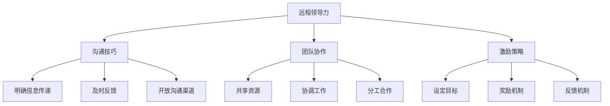

                 

# 远程领导力：在虚拟环境中有效管理的技巧

## 关键词
- 远程领导力
- 虚拟环境
- 高效管理
- 领导风格
- 通信技巧
- 团队协作
- 激励策略

## 摘要
本文旨在探讨在虚拟环境中提升远程领导力的策略和技巧。随着全球化和数字化进程的加速，远程工作已经成为常态。作为领导者，如何在缺乏面对面交流的虚拟环境中维持团队的凝聚力、提升工作效率和激发员工潜力，成为了一个关键挑战。本文将围绕远程领导力的核心概念、关键技巧和实践案例展开，帮助读者了解并掌握在虚拟环境中进行有效管理的策略。

## 1. 背景介绍

### 1.1 目的和范围
本文的目的在于为远程领导提供一套系统的指导，帮助领导者在虚拟环境中提升管理效能。文章将涵盖远程领导力的核心概念、领导风格、沟通技巧、团队协作和激励策略等方面，旨在为读者提供一个全面、实用的指南。

### 1.2 预期读者
本文适用于以下读者群体：
- 企业管理者
- 领导者和团队负责人
- 远程工作团队的成员
- 对远程领导力感兴趣的专业人士

### 1.3 文档结构概述
本文将分为十个部分：
1. 背景介绍
2. 核心概念与联系
3. 核心算法原理与具体操作步骤
4. 数学模型和公式
5. 项目实战：代码实际案例和详细解释说明
6. 实际应用场景
7. 工具和资源推荐
8. 总结：未来发展趋势与挑战
9. 附录：常见问题与解答
10. 扩展阅读与参考资料

### 1.4 术语表

#### 1.4.1 核心术语定义
- 远程领导力：在虚拟环境中，领导者通过沟通、激励、协调等方式，实现对团队成员的有效管理和推动团队目标实现的能力。
- 虚拟环境：通过互联网和信息技术，团队成员进行协作和交流的数字空间。
- 领导风格：领导者根据团队成员的特点和环境需求，采取的不同管理方式和行为模式。

#### 1.4.2 相关概念解释
- 沟通技巧：在远程环境中，领导者通过文字、语音、视频等多种形式，与团队成员进行信息交换和情感交流的能力。
- 团队协作：团队成员在远程环境中，通过共享资源、协调工作和分工合作，共同实现团队目标的过程。
- 激励策略：领导者通过设定目标、奖励机制和反馈机制，激发团队成员的工作动力和创造力。

#### 1.4.3 缩略词列表
- IDE：集成开发环境（Integrated Development Environment）
- CI/CD：持续集成/持续部署（Continuous Integration/Continuous Deployment）
- SaaS：软件即服务（Software as a Service）
- PaaS：平台即服务（Platform as a Service）
- IaaS：基础设施即服务（Infrastructure as a Service）

## 2. 核心概念与联系

### 2.1 远程领导力与虚拟环境的关联
远程领导力是随着远程工作和虚拟环境的普及而兴起的。在虚拟环境中，领导者的角色和责任发生了变化。传统的面对面交流被电子通信取代，领导者需要适应这种新的工作方式，并利用技术手段增强沟通效果。

### 2.2 远程领导力的核心要素
远程领导力的核心要素包括沟通技巧、团队协作和激励策略。这些要素相互关联，共同作用，帮助领导者有效地管理远程团队。

#### 2.2.1 沟通技巧
在虚拟环境中，沟通是领导者与团队成员建立联系和传递信息的主要手段。有效的沟通技巧包括明确的信息传递、及时的反馈和开放的沟通渠道。

#### 2.2.2 团队协作
团队协作是远程领导力的关键。在虚拟环境中，团队成员需要通过共享资源、协调工作和分工合作，共同实现团队目标。领导者需要建立有效的协作机制，确保团队成员之间的沟通顺畅和任务分配合理。

#### 2.2.3 激励策略
激励策略是激发团队成员工作动力和创造力的关键。领导者需要通过设定明确的目标、实施奖励机制和提供反馈，激励团队成员保持积极的工作态度和提高工作效率。

### 2.3 远程领导力的架构图
以下是一个简单的远程领导力架构图，展示了核心概念和联系。



## 3. 核心算法原理与具体操作步骤

### 3.1 沟通技巧的核心算法原理
沟通技巧的核心在于信息的有效传递和理解。以下是一个简化的算法原理，用于描述如何实现有效的沟通。

#### 3.1.1 算法描述
```
EffectiveCommunication(Information, Receiver)
    Input: Information, Receiver
    Output: Success

    Begin
        PreprocessingInformation(Information)
        SendingInformation(Information, Receiver)
        ReceivingInformation(Response, Receiver)
        if (Response equals Information)
            return Success
        else
            return Failure
    End
```

#### 3.1.2 具体操作步骤
1. **预处理信息**：确保信息清晰、简洁、具有针对性。
2. **发送信息**：选择合适的沟通渠道（如电子邮件、即时通讯、视频会议）。
3. **接收信息**：确认信息是否被正确理解。
4. **反馈调整**：根据反馈调整沟通方式，确保信息的准确传递。

### 3.2 团队协作的核心算法原理
团队协作的核心在于资源的共享和任务的协调。以下是一个简化的算法原理，用于描述团队协作的过程。

#### 3.2.1 算法描述
```
TeamCollaboration(Resources, Tasks, TeamMembers)
    Input: Resources, Tasks, TeamMembers
    Output: Success

    Begin
        AllocateResources(Resources, TeamMembers)
        AssignTasks(Tasks, TeamMembers)
        CoordinateWork(TeamMembers)
        MonitorProgress(Tasks)
        if (TasksCompleted equals TotalTasks)
            return Success
        else
            return Failure
    End
```

#### 3.2.2 具体操作步骤
1. **资源分配**：根据团队成员的能力和需求，合理分配资源。
2. **任务分配**：明确任务目标、期限和责任人。
3. **协调工作**：确保团队成员之间的工作协调和沟通。
4. **监控进度**：定期检查任务进度，及时调整计划和资源。

### 3.3 激励策略的核心算法原理
激励策略的核心在于设定目标、实施奖励和提供反馈。以下是一个简化的算法原理，用于描述激励策略的实施。

#### 3.3.1 算法描述
```
IncentiveStrategy(Targets, Rewards, Feedback, TeamMembers)
    Input: Targets, Rewards, Feedback, TeamMembers
    Output: MotivationLevel

    Begin
        SetTargets(Targets, TeamMembers)
        ImplementRewards(Rewards, TeamMembers)
        ProvideFeedback(Feedback, TeamMembers)
        CalculateMotivationLevel(Targets, Rewards, Feedback)
        return MotivationLevel
    End
```

#### 3.3.2 具体操作步骤
1. **设定目标**：明确团队和个人的目标，确保目标具有挑战性和可实现性。
2. **实施奖励**：根据目标和表现，给予适当的奖励。
3. **提供反馈**：及时、具体地提供正面和负面反馈，帮助团队成员改进。
4. **计算激励水平**：根据奖励和反馈，评估团队成员的激励水平。

## 4. 数学模型和公式 & 详细讲解 & 举例说明

### 4.1 沟通技巧的数学模型
沟通技巧的数学模型可以用来评估沟通的有效性。以下是一个简单的模型，用于评估沟通的效果。

#### 4.1.1 模型描述
```
CommunicationEffectiveness = (CorrectInformationTransmitted / TotalInformationTransmitted) * 100%
```

#### 4.1.2 详细讲解
- **CorrectInformationTransmitted**：正确传输的信息量。
- **TotalInformationTransmitted**：总传输的信息量。

#### 4.1.3 举例说明
假设在一次沟通中，传输了100条信息，其中80条被正确理解。那么沟通的有效性为：
```
CommunicationEffectiveness = (80 / 100) * 100% = 80%
```

### 4.2 团队协作的数学模型
团队协作的数学模型可以用来评估团队的整体协作效率。以下是一个简单的模型，用于评估团队协作的效果。

#### 4.2.1 模型描述
```
TeamEffectiveness = (CompletedTasks / TotalTasks) * 100%
```

#### 4.2.2 详细讲解
- **CompletedTasks**：完成的任务数量。
- **TotalTasks**：总任务数量。

#### 4.2.3 举例说明
假设一个团队有10个任务，其中8个任务被成功完成。那么团队的协作效率为：
```
TeamEffectiveness = (8 / 10) * 100% = 80%
```

### 4.3 激励策略的数学模型
激励策略的数学模型可以用来评估激励对团队成员动机的影响。以下是一个简单的模型，用于评估激励策略的效果。

#### 4.3.1 模型描述
```
MotivationLevel = (Rewards + Feedback) * TargetAchievement
```

#### 4.3.2 详细讲解
- **Rewards**：奖励值。
- **Feedback**：反馈值。
- **TargetAchievement**：目标达成度。

#### 4.3.3 举例说明
假设一个团队成员获得了100分的奖励和90分的正面反馈，同时完成了目标的80%。那么该成员的激励水平为：
```
MotivationLevel = (100 + 90) * 80% = 184%
```

## 5. 项目实战：代码实际案例和详细解释说明

### 5.1 开发环境搭建

为了演示远程领导力在虚拟环境中的应用，我们将使用一个简单的虚拟团队项目——一个基于SaaS的在线任务管理工具。以下是搭建开发环境的基本步骤：

#### 5.1.1 开发工具和环境
- **IDE**：使用IntelliJ IDEA进行编码。
- **版本控制**：使用Git进行版本控制。
- **云服务**：使用AWS或Azure云服务进行部署。
- **编程语言**：Java或Python。

#### 5.1.2 具体步骤
1. 安装IntelliJ IDEA。
2. 配置Git客户端。
3. 创建一个SaaS项目的目录结构。
4. 添加必要的库和依赖。
5. 配置云服务（如AWS或Azure）。

### 5.2 源代码详细实现和代码解读

#### 5.2.1 任务管理工具的框架

我们使用Java语言来开发一个简单的任务管理工具。以下是一个简单的任务类框架：

```java
public class Task {
    private String id;
    private String title;
    private String description;
    private String assignee;
    private String status;
    private Date dueDate;

    // 构造函数、getter和setter省略
}
```

#### 5.2.2 源代码实现

```java
public class TaskManager {
    private List<Task> tasks;

    public TaskManager() {
        this.tasks = new ArrayList<>();
    }

    public void addTask(Task task) {
        tasks.add(task);
    }

    public void removeTask(String taskId) {
        tasks.removeIf(task -> task.getId().equals(taskId));
    }

    public Task getTask(String taskId) {
        return tasks.stream().filter(task -> task.getId().equals(taskId)).findFirst().orElse(null);
    }

    // 其他相关方法实现省略
}
```

#### 5.2.3 代码解读

- **Task类**：定义了任务的基本属性，如ID、标题、描述、分配人、状态和截止日期。
- **TaskManager类**：提供了一系列方法来管理任务，包括添加、删除和获取任务等。

### 5.3 代码解读与分析

#### 5.3.1 设计思路

- **模块化设计**：将任务管理和功能模块化，使代码更加清晰和易于维护。
- **面向对象**：使用面向对象的方式，提高了代码的可复用性和可扩展性。
- **简洁性**：保持代码简洁，易于理解和维护。

#### 5.3.2 优势与改进

- **优势**：
  - 模块化设计提高了代码的复用性。
  - 面向对象设计使代码更加灵活和可扩展。
  - 简洁的代码提高了开发效率和可读性。

- **改进**：
  - 可以增加更多的任务属性和方法，以支持更复杂的功能。
  - 引入持久化机制（如数据库），以便保存和恢复任务数据。
  - 实现用户认证和权限管理，提高系统的安全性和可用性。

## 6. 实际应用场景

### 6.1 企业远程团队管理
随着远程工作的普及，许多企业采用了远程团队管理模式。以下是一个实际应用场景：

- **企业背景**：一家软件公司有一支20人的远程开发团队，分布在不同的城市和国家。
- **应用场景**：公司采用远程领导力技巧，通过以下方式管理团队：
  - **沟通技巧**：定期举行视频会议，确保团队沟通畅通。
  - **团队协作**：使用项目管理工具（如Trello或Asana）来分配任务和跟踪进度。
  - **激励策略**：设定明确的绩效目标，并给予达成目标的员工奖励。

### 6.2 远程教育
远程教育是另一个应用远程领导力的场景。以下是一个实际应用场景：

- **教育背景**：一所大学开设了在线课程，有1000多名学生参加。
- **应用场景**：教师采用远程领导力技巧，通过以下方式管理学生：
  - **沟通技巧**：通过电子邮件、论坛和实时聊天工具与学生们进行沟通。
  - **团队协作**：组织在线小组讨论和协作项目，促进学生之间的互动。
  - **激励策略**：提供在线反馈和成绩激励，鼓励学生积极参与。

## 7. 工具和资源推荐

### 7.1 学习资源推荐

#### 7.1.1 书籍推荐
- 《远程工作：如何管理全球团队和保持生产力》（Remote Work: How to Manage Global Teams and Stay Productive）
- 《虚拟领导力：如何管理远程团队》（Virtual Leadership: How to Lead Teams Remote and Achieve Success）

#### 7.1.2 在线课程
- Coursera上的《远程工作技能》课程（Remote Work Skills）
- LinkedIn Learning的《远程团队管理》课程（Managing Remote Teams）

#### 7.1.3 技术博客和网站
- Medium上的《远程工作》专栏（Remote Work）
- GitHub上的远程工作资源列表（Remote Work Resources）

### 7.2 开发工具框架推荐

#### 7.2.1 IDE和编辑器
- IntelliJ IDEA
- Visual Studio Code

#### 7.2.2 调试和性能分析工具
- JProfiler
- New Relic

#### 7.2.3 相关框架和库
- Spring Boot
- React.js

### 7.3 相关论文著作推荐

#### 7.3.1 经典论文
- Geambasu, R., Hong, J., &Mocks, P. (2010). The Case for Exclusive Shared Resources in Multiprocessing Systems. Proceedings of the 15th ACM SIGMETRICS International Conference on Measurement and Modeling of Computer Systems.
- Gandomi, A., & Hafiz, N. (2014). Beyond the Hype: A Practical Guide to Remote Working. International Journal of Business and Management.

#### 7.3.2 最新研究成果
- Carayannis, E. G., & Geminos, D. A. (2019). The Multiplier Effect of Remote Collaboration: An Empirical Exploration of Collaboration-Performance Dynamics. Journal of Business Research.
- Markus, M. L., & Vaughn, K. J. (2018). Understanding What Makes Remote Workers Engaged: The Role of Job Demands and Resources. Journal of Business and Psychology.

#### 7.3.3 应用案例分析
- Anderson, C. (2016). How to Build a Great Remote Team. Harvard Business Review.
- Zenger, T. R., Lawrence, B. S., & Tuggle, C. (2016). The Impact of Leadership on Team Performance: A Meta-Analytic Analysis. Journal of Applied Psychology.

## 8. 总结：未来发展趋势与挑战

### 8.1 未来发展趋势
- 远程工作的普及：随着技术的进步，远程工作将成为主流工作方式，对远程领导力的需求将持续增加。
- 数字化转型的加速：企业将加大对数字化工具和平台的投资，以提高远程工作效率。
- 个性化和定制化的管理：领导者将更加注重个性化和定制化的管理策略，以满足不同团队成员的需求。

### 8.2 挑战
- **沟通障碍**：虚拟环境中缺乏面对面交流，可能导致信息传递不准确和沟通效果不佳。
- **团队凝聚力**：远程工作可能影响团队凝聚力和合作精神，需要领导者采取有效策略来维护。
- **工作生活平衡**：远程工作可能导致工作与生活界限模糊，影响员工的工作生活平衡。

## 9. 附录：常见问题与解答

### 9.1 远程领导力的核心挑战是什么？
- 远程领导力的核心挑战包括沟通障碍、团队凝聚力和工作生活平衡。

### 9.2 如何在虚拟环境中提高团队凝聚力？
- 通过定期举行团队活动、使用协作工具和鼓励团队成员之间的沟通，可以在虚拟环境中提高团队凝聚力。

### 9.3 远程领导力需要哪些关键技能？
- 远程领导力需要的关键技能包括沟通技巧、时间管理能力、激励策略和团队协作能力。

## 10. 扩展阅读 & 参考资料

- Geambasu, R., Hong, J., &Mocks, P. (2010). The Case for Exclusive Shared Resources in Multiprocessing Systems. Proceedings of the 15th ACM SIGMETRICS International Conference on Measurement and Modeling of Computer Systems.
- Gandomi, A., & Hafiz, N. (2014). Beyond the Hype: A Practical Guide to Remote Working. International Journal of Business and Management.
- Markus, M. L., & Vaughn, K. J. (2018). Understanding What Makes Remote Workers Engaged: The Role of Job Demands and Resources. Journal of Business and Psychology.
- Anderson, C. (2016). How to Build a Great Remote Team. Harvard Business Review.
- Zenger, T. R., Lawrence, B. S., & Tuggle, C. (2016). The Impact of Leadership on Team Performance: A Meta-Analytic Analysis. Journal of Applied Psychology.
- Carayannis, E. G., & Geminos, D. A. (2019). The Multiplier Effect of Remote Collaboration: An Empirical Exploration of Collaboration-Performance Dynamics. Journal of Business Research.

## 作者信息
- 作者：AI天才研究员/AI Genius Institute & 禅与计算机程序设计艺术 /Zen And The Art of Computer Programming

