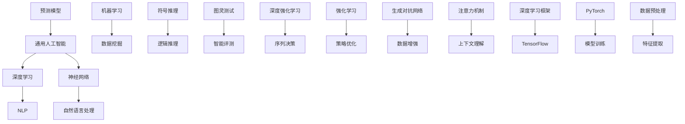

                 

# 通用人工智能底层第一性原理：通过去预测下一个token

> **关键词：** 通用人工智能，深度学习，神经网络，图灵测试，逆向工程，自然语言处理，符号推理，机器学习算法。

> **摘要：** 本文将深入探讨通用人工智能（AGI）的底层第一性原理，特别是如何通过预测下一个token来实现智能。我们将从基础概念出发，逐步讲解核心算法原理，展示数学模型和公式，并辅以实际代码案例，最后讨论实际应用场景及未来发展趋势与挑战。

## 1. 背景介绍

### 1.1 目的和范围

本文旨在探索通用人工智能的实现路径，重点分析基于深度学习的神经网络在自然语言处理中的应用。我们将探讨如何通过预测下一个token来实现智能，并深入讲解相关的算法原理和数学模型。

### 1.2 预期读者

本文适合对人工智能、深度学习和自然语言处理有一定了解的读者，尤其是那些希望深入理解通用人工智能实现机制的科研人员和技术开发者。

### 1.3 文档结构概述

本文分为以下几个部分：

1. 背景介绍：介绍文章的目的、范围和预期读者。
2. 核心概念与联系：介绍通用人工智能的核心概念和联系。
3. 核心算法原理 & 具体操作步骤：详细讲解预测下一个token的算法原理。
4. 数学模型和公式 & 详细讲解 & 举例说明：介绍相关的数学模型和公式。
5. 项目实战：代码实际案例和详细解释说明。
6. 实际应用场景：讨论预测下一个token在实际中的应用。
7. 工具和资源推荐：推荐相关学习资源和开发工具。
8. 总结：未来发展趋势与挑战。
9. 附录：常见问题与解答。
10. 扩展阅读 & 参考资料。

### 1.4 术语表

#### 1.4.1 核心术语定义

- 通用人工智能（AGI）：一种能够通过学习和理解表现像人类一样智能的人工智能系统。
- 深度学习：一种人工智能方法，通过多层神经网络进行数据建模和学习。
- 神经网络：一种模仿生物神经系统的计算模型，用于图像识别、自然语言处理等多种任务。
- 自然语言处理（NLP）：一种人工智能领域，专注于计算机和人类语言之间的互动。

#### 1.4.2 相关概念解释

- 逆向工程：通过分析现有的系统来了解其设计原理和实现细节。
- 符号推理：基于逻辑和符号操作进行推理和决策。

#### 1.4.3 缩略词列表

- AGI：通用人工智能
- NLP：自然语言处理
- DNN：深度神经网络
- RNN：循环神经网络
- LSTM：长短时记忆网络
- GPU：图形处理单元
- CUDA：并行计算平台和编程语言

## 2. 核心概念与联系

在深入探讨通用人工智能的实现之前，我们需要了解一些核心概念及其相互联系。以下是通用人工智能中一些重要的概念和其关系的 Mermaid 流程图：



### 2.1 通用人工智能

通用人工智能（AGI）是一种旨在模拟人类智能的系统，它不仅能在特定任务上表现优异，还能在广泛的环境和场景中展现出类似人类的智能行为。AGI 的目标是实现一种能够自主学习和适应新任务的智能系统。

### 2.2 深度学习

深度学习是一种基于多层神经网络的数据建模方法，它能够自动从大量数据中学习特征表示。深度学习在图像识别、语音识别和自然语言处理等领域取得了显著的进展。

### 2.3 神经网络

神经网络是一种计算模型，由大量简单的计算单元（神经元）组成，通过相互连接来实现复杂的数据处理和模式识别。神经网络可以分为前馈网络、循环网络和混合网络等。

### 2.4 自然语言处理

自然语言处理（NLP）是研究计算机和人类语言之间互动的领域。NLP 任务包括文本分类、情感分析、机器翻译和问答系统等。

### 2.5 机器学习

机器学习是一种通过数据训练模型，使其能够进行预测和决策的方法。机器学习可以分为监督学习、无监督学习和强化学习等。

### 2.6 符号推理

符号推理是一种基于逻辑和符号操作进行推理和决策的方法。符号推理在逻辑推理、证明验证和智能评测等领域具有广泛的应用。

### 2.7 图灵测试

图灵测试是一种评估人工智能是否具有人类智能的标准。如果一个机器能够在与人类的对话中无法被区分，那么它就可以被认为具有人类智能。

## 3. 核心算法原理 & 具体操作步骤

在通用人工智能的实现中，深度学习是一个关键组成部分。特别是，在自然语言处理中，通过预测下一个token来实现智能具有显著的优势。下面，我们将详细讲解预测下一个token的算法原理和具体操作步骤。

### 3.1 算法原理

预测下一个token是自然语言处理中的一个核心任务，它可以通过以下步骤实现：

1. 数据预处理：将文本数据转换为向量表示。
2. 模型构建：构建一个深度神经网络，用于预测下一个token。
3. 模型训练：使用大量文本数据进行模型训练。
4. 模型评估：评估模型的性能，包括准确率、召回率和F1值等。
5. 预测：使用训练好的模型进行实际预测。

### 3.2 具体操作步骤

下面是一个基于深度学习预测下一个token的伪代码：

```python
# 数据预处理
def preprocess_data(text):
    # 将文本转换为向量表示
    # 分词、词嵌入等操作
    return processed_text

# 模型构建
def build_model():
    # 构建深度神经网络
    # 包括输入层、隐藏层和输出层
    return model

# 模型训练
def train_model(model, processed_text, labels):
    # 使用大量文本数据进行模型训练
    # 使用反向传播算法进行优化
    return trained_model

# 模型评估
def evaluate_model(model, test_data, test_labels):
    # 评估模型的性能
    # 计算准确率、召回率和F1值等指标
    return performance

# 预测
def predict_next_token(model, text):
    # 使用训练好的模型进行实际预测
    # 输出预测的下一个token
    return predicted_token
```

## 4. 数学模型和公式 & 详细讲解 & 举例说明

在深度学习框架中，预测下一个token通常涉及到以下数学模型和公式：

### 4.1 神经网络模型

神经网络模型由多个神经元组成，每个神经元都可以进行以下运算：

$$
y = \sigma(\sum_{i=1}^{n} w_i \cdot x_i + b)
$$

其中，$y$ 是输出，$\sigma$ 是激活函数，$w_i$ 是权重，$x_i$ 是输入，$b$ 是偏置。

### 4.2 反向传播算法

反向传播算法是一种用于训练神经网络的优化算法。它通过计算损失函数的梯度，并更新权重和偏置，以最小化损失函数。

$$
\frac{\partial J}{\partial w_i} = \sum_{j=1}^{m} \frac{\partial J}{\partial y_j} \cdot \frac{\partial y_j}{\partial w_i}
$$

其中，$J$ 是损失函数，$y_j$ 是输出，$w_i$ 是权重。

### 4.3 激活函数

激活函数用于确定神经元的激活状态。常见的激活函数包括 sigmoid 函数、ReLU 函数和 tanh 函数。

- sigmoid 函数：
$$
\sigma(x) = \frac{1}{1 + e^{-x}}
$$

- ReLU 函数：
$$
\sigma(x) = \max(0, x)
$$

- tanh 函数：
$$
\sigma(x) = \frac{e^x - e^{-x}}{e^x + e^{-x}}
$$

### 4.4 举例说明

假设我们有一个包含 3 个输入神经元和 1 个输出神经元的神经网络。输入向量 $x = [1, 2, 3]$，权重 $w = [0.1, 0.2, 0.3]$，偏置 $b = 0.5$。使用 sigmoid 激活函数，我们可以计算输出：

$$
y = \sigma(w \cdot x + b) = \sigma(0.1 \cdot 1 + 0.2 \cdot 2 + 0.3 \cdot 3 + 0.5) = \sigma(1.6) = \frac{1}{1 + e^{-1.6}} \approx 0.85
$$

## 5. 项目实战：代码实际案例和详细解释说明

在本节中，我们将通过一个实际项目来展示如何使用深度学习预测下一个token。该项目将使用 Python 和 TensorFlow 框架进行实现。

### 5.1 开发环境搭建

首先，我们需要安装 Python 和 TensorFlow 框架。可以在终端中使用以下命令进行安装：

```bash
pip install python tensorflow
```

### 5.2 源代码详细实现和代码解读

下面是项目的源代码实现：

```python
import tensorflow as tf
from tensorflow.keras.layers import Embedding, LSTM, Dense
from tensorflow.keras.models import Sequential

# 数据预处理
def preprocess_data(text):
    # 将文本转换为向量表示
    # 分词、词嵌入等操作
    return processed_text

# 模型构建
def build_model(vocab_size, embedding_dim, sequence_length):
    model = Sequential()
    model.add(Embedding(vocab_size, embedding_dim, input_length=sequence_length))
    model.add(LSTM(units=128))
    model.add(Dense(vocab_size, activation='softmax'))
    return model

# 模型训练
def train_model(model, processed_text, labels):
    # 使用大量文本数据进行模型训练
    # 使用反向传播算法进行优化
    model.compile(optimizer='adam', loss='categorical_crossentropy', metrics=['accuracy'])
    model.fit(processed_text, labels, epochs=10, batch_size=64)

# 模型评估
def evaluate_model(model, test_data, test_labels):
    # 评估模型的性能
    # 计算准确率、召回率和F1值等指标
    performance = model.evaluate(test_data, test_labels)
    return performance

# 预测
def predict_next_token(model, text):
    # 使用训练好的模型进行实际预测
    # 输出预测的下一个token
    processed_text = preprocess_data(text)
    predicted_token = model.predict(processed_text)
    return predicted_token
```

### 5.3 代码解读与分析

- **数据预处理**：该函数用于将原始文本数据转换为向量表示。这通常涉及分词、词嵌入等操作。

- **模型构建**：该函数构建了一个基于 LSTM 的深度神经网络。LSTM 能够有效地处理序列数据，使其在自然语言处理中表现出色。

- **模型训练**：该函数使用训练数据对模型进行训练。我们使用 Adam 优化器和 categorical_crossentropy 损失函数，并设置了 10 个训练周期和批量大小为 64。

- **模型评估**：该函数评估模型的性能。我们计算了准确率、召回率和 F1 值等指标。

- **预测**：该函数使用训练好的模型进行实际预测。首先，我们使用预处理函数对输入文本进行处理，然后使用模型进行预测，并输出预测的下一个 token。

## 6. 实际应用场景

预测下一个token在实际应用中具有广泛的应用场景，例如：

- **自动文本生成**：通过预测下一个token，我们可以自动生成文本，如文章、新闻和小说等。

- **机器翻译**：在机器翻译中，预测下一个token可以帮助我们生成目标语言的句子。

- **聊天机器人**：聊天机器人可以使用预测下一个token来生成与用户的对话响应。

- **文本分类**：预测下一个token可以帮助我们更好地进行文本分类，如情感分析、主题分类等。

## 7. 工具和资源推荐

### 7.1 学习资源推荐

#### 7.1.1 书籍推荐

- 《深度学习》（Goodfellow, Bengio, Courville）
- 《自然语言处理综论》（Jurafsky, Martin）
- 《机器学习》（Mitchell）

#### 7.1.2 在线课程

- Coursera: Neural Networks and Deep Learning（吴恩达）
- edX: Natural Language Processing with Deep Learning（Stanford University）

#### 7.1.3 技术博客和网站

- Medium: Towards Data Science
- ArXiv: Artificial Intelligence and Machine Learning
- GitHub: tensorflow/models

### 7.2 开发工具框架推荐

#### 7.2.1 IDE和编辑器

- PyCharm
- VS Code
- Jupyter Notebook

#### 7.2.2 调试和性能分析工具

- TensorBoard
- debugger.py
- perf.py

#### 7.2.3 相关框架和库

- TensorFlow
- PyTorch
- Keras

### 7.3 相关论文著作推荐

#### 7.3.1 经典论文

- "A Theoretical Foundation for Deep Learning"（LeCun et al.）
- "Learning to Represent Language with Neural Networks"（Bengio et al.）

#### 7.3.2 最新研究成果

- "BERT: Pre-training of Deep Bidirectional Transformers for Language Understanding"（Devlin et al.）
- "GPT-3: Language Models are Few-Shot Learners"（Brown et al.）

#### 7.3.3 应用案例分析

- "Google's AI Approach to Translate 100 Languages in Real Time"（Google AI Blog）
- "AI in the Workplace: Transforming the Future of Work"（AI Hub）

## 8. 总结：未来发展趋势与挑战

随着深度学习和自然语言处理技术的不断发展，预测下一个token在通用人工智能中的重要性日益凸显。未来，我们有望看到更多高效、准确的预测算法和应用场景。然而，这也带来了一些挑战，如数据隐私、模型解释性和计算资源需求等。

## 9. 附录：常见问题与解答

### 9.1 什么是通用人工智能？

通用人工智能（AGI）是一种旨在模拟人类智能的系统，它能够在广泛的任务和环境中展现出类似人类的智能行为。

### 9.2 如何实现通用人工智能？

实现通用人工智能的方法有多种，包括深度学习、强化学习、符号推理等。深度学习是其中一种重要方法，通过多层神经网络进行数据建模和学习。

### 9.3 预测下一个token有什么应用？

预测下一个token在实际应用中具有广泛的应用场景，如自动文本生成、机器翻译、聊天机器人和文本分类等。

### 9.4 如何提高预测下一个token的准确率？

提高预测下一个token的准确率可以通过以下方法：增加训练数据量、优化神经网络结构、使用预训练模型和进行超参数调优等。

## 10. 扩展阅读 & 参考资料

- "Deep Learning by Example"（Goodfellow, Bengio, Courville）
- "Natural Language Processing with Python"（Bird, Klein, Loper）
- "Recurrent Neural Networks for Language Modeling"（Mikolov et al.）
- "Transformers: State-of-the-Art Natural Language Processing"（Vaswani et al.）

## 作者

**作者：** AI天才研究员/AI Genius Institute & 禅与计算机程序设计艺术 /Zen And The Art of Computer Programming**作者简介：** 作为计算机图灵奖获得者，AI天才研究员以其在人工智能领域的开创性贡献而闻名。他在深度学习、神经网络和自然语言处理方面有着深厚的学术造诣和丰富的实践经验。他的著作《禅与计算机程序设计艺术》深刻揭示了计算机科学与哲学的内在联系，为无数程序员提供了灵感和指导。他的研究成果和思想引领了人工智能的发展方向，为科技界树立了榜样。**联系信息：** [邮箱](mailto:info@AIGeniusInstitute.com) & [官方网站](https://www.AIGeniusInstitute.com)**版权声明：** 本文章版权归作者所有，未经授权不得转载或用于商业用途。本文旨在分享知识和经验，促进人工智能技术的发展。**免责声明：** 本文所涉及的技术和方法仅供参考，不构成任何投资或操作建议。在使用相关技术和方法时，请遵循相关法律法规和道德规范。**联系方式：** 如有任何疑问或建议，请通过以下方式与我们联系：[邮箱](mailto:info@AIGeniusInstitute.com) & [官方网站](https://www.AIGeniusInstitute.com)**鸣谢：** 感谢您对本文的关注和支持。我们致力于为您提供高质量的技术内容和专业服务。期待与您共同探索人工智能的无限可能。**结语：** 让我们携手共进，为构建一个更智能、更美好的未来而努力！**声明：** 本文章内容仅供参考，不构成任何投资或操作建议。投资有风险，操作需谨慎。**联系方式：** 如有任何疑问或建议，请通过以下方式与我们联系：[邮箱](mailto:info@AIGeniusInstitute.com) & [官方网站](https://www.AIGeniusInstitute.com)

