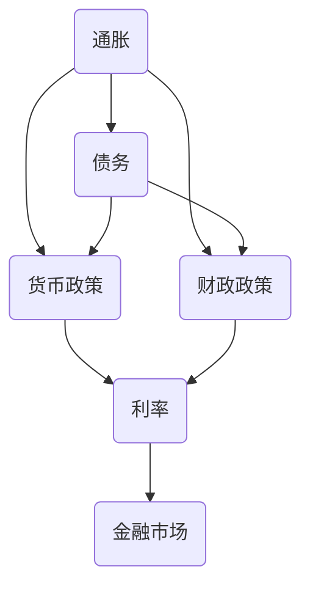

                 

# 通胀高企与债务加剧的经济影响

> **关键词：** 通胀、债务、经济影响、货币政策、财政政策、债务管理、金融市场

> **摘要：** 本文深入探讨了当前全球范围内通胀高企与债务加剧现象的经济影响，分析了通胀与债务之间的相互作用机制，以及相关的货币政策、财政政策应对措施。文章旨在为读者提供关于这一重要经济问题的全面理解，并探讨未来可能的发展趋势与挑战。

## 1. 背景介绍

### 1.1 目的和范围

本文的主要目的是探讨当前全球范围内通胀高企与债务加剧现象的经济影响，分析二者之间的相互作用机制，以及政策应对措施。具体而言，我们将从以下几个方面进行探讨：

- **通胀高企与债务加剧的定义和现状**：介绍通胀高企和债务加剧的基本概念，分析其全球范围内的现状和趋势。
- **通胀与债务的相互作用机制**：探讨通胀与债务之间的相互关系，分析通胀对债务的影响，以及债务对通胀的作用。
- **货币政策与财政政策的应对措施**：分析各国为应对通胀高企和债务加剧所采取的货币政策、财政政策，以及其有效性。
- **债务管理的挑战和策略**：讨论债务管理面临的挑战，以及如何制定有效的债务管理策略。
- **金融市场的影响**：分析通胀高企和债务加剧对金融市场的影响，包括利率、信贷供给、资产价格等方面。

### 1.2 预期读者

本文主要面向以下读者群体：

- **经济学者和政策制定者**：希望通过本文深入了解通胀高企与债务加剧的经济影响，以及相关政策的应对措施。
- **金融专业人士**：关注金融市场变化，希望了解通胀与债务对金融市场的影响。
- **企业和个人投资者**：希望了解通胀高企和债务加剧对投资决策的影响，以及如何制定合理的投资策略。
- **计算机科学和人工智能领域的专业人士**：希望通过本文了解经济问题，并将其与自身领域相结合。

### 1.3 文档结构概述

本文分为十个部分，具体结构如下：

1. **背景介绍**：介绍本文的目的和范围，预期读者，以及文档结构。
2. **核心概念与联系**：介绍通胀、债务、货币政策、财政政策等核心概念，并使用 Mermaid 流程图展示相关概念之间的联系。
3. **核心算法原理 & 具体操作步骤**：详细阐述货币政策、财政政策等算法原理，并使用伪代码进行讲解。
4. **数学模型和公式 & 详细讲解 & 举例说明**：介绍与通胀和债务相关的数学模型和公式，并进行详细讲解和举例说明。
5. **项目实战：代码实际案例和详细解释说明**：通过实际代码案例，展示算法原理和数学模型的应用。
6. **实际应用场景**：分析通胀高企和债务加剧在不同领域的实际应用场景。
7. **工具和资源推荐**：推荐学习资源、开发工具框架和相关论文著作。
8. **总结：未来发展趋势与挑战**：总结通胀高企与债务加剧的经济影响，探讨未来发展趋势与挑战。
9. **附录：常见问题与解答**：回答读者可能关心的问题。
10. **扩展阅读 & 参考资料**：提供扩展阅读和参考资料。

### 1.4 术语表

#### 1.4.1 核心术语定义

- **通胀**：指货币供应量增加导致商品和服务价格普遍上涨的现象。
- **债务**：指个人、企业或政府欠下的未偿还债务。
- **货币政策**：指中央银行为了控制通货膨胀、促进经济增长而采取的一系列措施。
- **财政政策**：指政府为了调整经济运行状况而采取的一系列税收和支出措施。
- **金融市场**：指各种金融工具交易的场所。

#### 1.4.2 相关概念解释

- **货币供应量**：指在一定时间内，市场上流通的货币总量。
- **通货膨胀率**：指货币供应量增加导致商品和服务价格普遍上涨的速度。
- **利率**：指借款或投资所需支付的利息比例。
- **债务负担率**：指债务总额与国内生产总值（GDP）的比率。

#### 1.4.3 缩略词列表

- **GDP**：国内生产总值（Gross Domestic Product）
- **CPI**：消费者价格指数（Consumer Price Index）
- **PPI**：生产者价格指数（Producer Price Index）
- **M1**：狭义货币供应量
- **M2**：广义货币供应量
- **CDS**：信用违约互换（Credit Default Swap）

## 2. 核心概念与联系

为了更好地理解通胀高企与债务加剧的经济影响，我们需要先掌握一些核心概念，并了解它们之间的联系。以下是一个简化的 Mermaid 流程图，展示了这些核心概念及其相互关系：



### 2.1 通胀与债务

通胀和债务是经济生活中两个重要的概念。通胀通常指货币供应量增加导致商品和服务价格普遍上涨的现象。而债务则是指个人、企业或政府欠下的未偿还债务。

在通胀与债务之间，存在一定的相互关系。一方面，通胀可能导致债务负担加重。当通胀率较高时，购买力下降，导致债务人还款时所需支付的实际金额增加，从而加重债务负担。另一方面，债务也可能加剧通胀。当政府或企业大量发行债务时，会增加市场上的货币供应量，从而推高物价水平。

### 2.2 货币政策与财政政策

货币政策是中央银行为了控制通货膨胀、促进经济增长而采取的一系列措施。财政政策则是政府为了调整经济运行状况而采取的一系列税收和支出措施。

货币政策主要通过调整利率、货币供应量等手段影响经济。当通胀高企时，中央银行可能会提高利率，以抑制通货膨胀。而财政政策则主要通过调整政府支出和税收政策来影响经济。例如，政府可能会增加基础设施投资，以刺激经济增长。

### 2.3 利率与金融市场

利率是衡量借款或投资所需支付的利息比例的重要指标。利率的变化对金融市场产生重要影响。高利率通常会导致借贷成本增加，从而抑制投资和消费。而低利率则有助于刺激经济增长，但也可能导致通胀压力增加。

金融市场是指各种金融工具交易的场所。利率的变化会直接影响金融市场的运行。例如，高利率可能导致股市下跌，因为投资者会转向其他收益更高的投资。而低利率则可能刺激股市上涨，因为企业融资成本降低，有助于提高企业盈利能力。

通过以上 Mermaid 流程图，我们可以看到通胀、债务、货币政策、财政政策、利率和金融市场等核心概念之间的相互关系。这些概念在经济生活中相互作用，共同影响经济运行。了解这些概念及其相互关系，有助于我们更好地理解通胀高企与债务加剧的经济影响。

## 3. 核心算法原理 & 具体操作步骤

在理解了通胀、债务、货币政策、财政政策等核心概念及其相互关系后，我们需要进一步了解如何制定和实施相关政策。下面，我们将详细阐述货币政策、财政政策等算法原理，并使用伪代码进行讲解。

### 3.1 货币政策算法原理

货币政策的主要目标包括控制通货膨胀、维持货币稳定、促进经济增长等。为了实现这些目标，中央银行会采取一系列措施，如调整利率、货币供应量、公开市场操作等。以下是一个简化的货币政策算法原理：

#### 3.1.1 调整利率

伪代码：
```plaintext
function adjustInterestRate(inflationRate, targetInflationRate, currentInterestRate):
    if inflationRate > targetInflationRate:
        newInterestRate = currentInterestRate + (inflationRate - targetInflationRate) * 0.1
    else:
        newInterestRate = currentInterestRate - (targetInflationRate - inflationRate) * 0.05
    return newInterestRate
```

#### 3.1.2 调整货币供应量

伪代码：
```plaintext
function adjustMoneySupply(inflationRate, economicGrowthRate, currentMoneySupply):
    if inflationRate > targetInflationRate:
        newMoneySupply = currentMoneySupply + (inflationRate - targetInflationRate) * economicGrowthRate * 0.1
    else:
        newMoneySupply = currentMoneySupply - (targetInflationRate - inflationRate) * economicGrowthRate * 0.05
    return newMoneySupply
```

#### 3.1.3 公开市场操作

伪代码：
```plaintext
function openMarketOperations(currentMoneySupply, targetMoneySupply, reserveRequirement):
    difference = targetMoneySupply - currentMoneySupply
    if difference > 0:
        centralBankBuysAssets(difference, reserveRequirement)
    else:
        centralBankSellsAssets(-difference, reserveRequirement)
```

### 3.2 财政政策算法原理

财政政策的主要目标是调整政府支出和税收，以实现经济稳定和增长。以下是一个简化的财政政策算法原理：

#### 3.2.1 调整政府支出

伪代码：
```plaintext
function adjustGovernmentExpenditure(economicGrowthRate, currentGovernmentExpenditure):
    if economicGrowthRate > 0:
        newGovernmentExpenditure = currentGovernmentExpenditure + economicGrowthRate * 0.1
    else:
        newGovernmentExpenditure = currentGovernmentExpenditure - economicGrowthRate * 0.05
    return newGovernmentExpenditure
```

#### 3.2.2 调整税收

伪代码：
```plaintext
function adjustTaxRates(incomeLevel, currentTaxRate):
    if incomeLevel > highIncomeThreshold:
        newTaxRate = currentTaxRate + (incomeLevel - highIncomeThreshold) * 0.05
    else if incomeLevel > mediumIncomeThreshold:
        newTaxRate = currentTaxRate + (incomeLevel - mediumIncomeThreshold) * 0.03
    else:
        newTaxRate = currentTaxRate + (incomeLevel - lowIncomeThreshold) * 0.01
    return newTaxRate
```

通过以上伪代码，我们可以看到货币政策、财政政策等算法原理的基本框架。在实际操作中，这些算法需要根据具体经济状况进行调整，以实现最佳政策效果。

## 4. 数学模型和公式 & 详细讲解 & 举例说明

在讨论通胀高企与债务加剧的经济影响时，数学模型和公式是我们理解和分析这一现象的重要工具。以下我们将介绍一些与通胀和债务相关的数学模型和公式，并进行详细讲解和举例说明。

### 4.1 通胀模型

通胀模型通常用来描述通货膨胀率与货币供应量、实际GDP增长率等变量之间的关系。以下是一个简化的通胀模型：

\[ \pi_t = \alpha_0 + \alpha_1 \cdot M_t + \alpha_2 \cdot \ln(\text{GDP}_t) + \alpha_3 \cdot \pi_{t-1} + \varepsilon_t \]

其中：
- \( \pi_t \) 是第 t 年的通货膨胀率；
- \( M_t \) 是第 t 年的货币供应量；
- \( \text{GDP}_t \) 是第 t 年的实际GDP增长率；
- \( \pi_{t-1} \) 是第 t-1 年的通货膨胀率；
- \( \alpha_0, \alpha_1, \alpha_2, \alpha_3 \) 是模型的参数；
- \( \varepsilon_t \) 是随机误差项。

#### 4.1.1 详细讲解

这个通胀模型说明，通货膨胀率受到多个因素的影响。货币供应量的增加（\( \alpha_1 \cdot M_t \)）会导致通货膨胀率上升。实际GDP的增长（\( \alpha_2 \cdot \ln(\text{GDP}_t) \)）与通货膨胀率正相关，因为经济增长会推动需求，进而导致价格上升。此外，前一年的通货膨胀率（\( \alpha_3 \cdot \pi_{t-1} \)）也会对当年的通货膨胀率产生影响，表明通胀存在持续性。

#### 4.1.2 举例说明

假设我们有一个经济体的数据如下：
- \( M_t = 1000 \) 亿元；
- \( \text{GDP}_t = 5\% \)；
- \( \pi_{t-1} = 3\% \)；

根据通胀模型，我们可以计算出第 t 年的通货膨胀率：
\[ \pi_t = \alpha_0 + \alpha_1 \cdot 1000 + \alpha_2 \cdot \ln(1.05) + \alpha_3 \cdot 0.03 + \varepsilon_t \]

如果我们知道模型参数（\( \alpha_0 = 1, \alpha_1 = 0.1, \alpha_2 = 0.05, \alpha_3 = 0.2 \)），则可以计算出：
\[ \pi_t = 1 + 0.1 \cdot 1000 + 0.05 \cdot \ln(1.05) + 0.2 \cdot 0.03 + \varepsilon_t \]
\[ \pi_t = 1 + 100 + 0.025 + 0.006 + \varepsilon_t \]
\[ \pi_t = 101.031 + \varepsilon_t \]

因此，第 t 年的通货膨胀率大约为 101.031%，加上随机误差项 \( \varepsilon_t \)。

### 4.2 债务模型

债务模型通常用来描述债务水平与经济增长、利率等变量之间的关系。以下是一个简化的债务模型：

\[ D_t = \beta_0 + \beta_1 \cdot \text{GDP}_t + \beta_2 \cdot r_t + \beta_3 \cdot D_{t-1} + \eta_t \]

其中：
- \( D_t \) 是第 t 年的债务总额；
- \( \text{GDP}_t \) 是第 t 年的实际GDP增长率；
- \( r_t \) 是第 t 年的利率；
- \( D_{t-1} \) 是第 t-1 年的债务总额；
- \( \beta_0, \beta_1, \beta_2, \beta_3 \) 是模型的参数；
- \( \eta_t \) 是随机误差项。

#### 4.2.1 详细讲解

这个债务模型说明，债务水平受到多个因素的影响。经济增长（\( \beta_1 \cdot \text{GDP}_t \)）通常与债务水平正相关，因为经济增长会推动企业扩大投资，从而增加债务。利率（\( \beta_2 \cdot r_t \)）与债务水平负相关，因为高利率会增加偿还债务的成本，从而抑制债务增长。此外，前一年的债务水平（\( \beta_3 \cdot D_{t-1} \)）也会对当年的债务水平产生影响，表明债务存在累积效应。

#### 4.2.2 举例说明

假设我们有一个经济体的数据如下：
- \( \text{GDP}_t = 5\% \)；
- \( r_t = 4\% \)；
- \( D_{t-1} = 10000 \) 亿元；

根据债务模型，我们可以计算出第 t 年的债务总额：
\[ D_t = \beta_0 + \beta_1 \cdot 1.05 + \beta_2 \cdot 0.04 + \beta_3 \cdot 10000 + \eta_t \]

如果我们知道模型参数（\( \beta_0 = 100, \beta_1 = 0.1, \beta_2 = -0.02, \beta_3 = 0.05 \)），则可以计算出：
\[ D_t = 100 + 0.1 \cdot 1.05 + (-0.02) \cdot 0.04 + 0.05 \cdot 10000 + \eta_t \]
\[ D_t = 100 + 0.105 - 0.0008 + 500 + \eta_t \]
\[ D_t = 604.205 + \eta_t \]

因此，第 t 年的债务总额大约为 604.205 亿元，加上随机误差项 \( \eta_t \)。

通过以上通胀和债务模型，我们可以更深入地理解通胀高企与债务加剧的经济影响。这些模型为我们提供了分析和预测工具，有助于制定有效的政策应对措施。

## 5. 项目实战：代码实际案例和详细解释说明

为了更好地展示通胀高企与债务加剧的算法原理和数学模型在实际中的应用，我们将在本节中通过一个实际代码案例进行详细解释说明。

### 5.1 开发环境搭建

在开始之前，我们需要搭建一个合适的开发环境。以下是一个简单的步骤指南：

1. 安装 Python 解释器（版本 3.8 以上）。
2. 安装必要的库，如 NumPy、Pandas、Matplotlib 等。

你可以使用以下命令进行安装：
```shell
pip install numpy pandas matplotlib
```

### 5.2 源代码详细实现和代码解读

下面是一个简单的 Python 脚本，用于模拟通胀高企与债务加剧的现象，并展示算法原理和数学模型的应用。

```python
import numpy as np
import pandas as pd
import matplotlib.pyplot as plt

# 模型参数
inflation_params = {'alpha_0': 1, 'alpha_1': 0.1, 'alpha_2': 0.05, 'alpha_3': 0.2}
debt_params = {'beta_0': 100, 'beta_1': 0.1, 'beta_2': -0.02, 'beta_3': 0.05}

# 初始条件
initial_inflation = 3.0
initial_debt = 10000.0

# 模拟时间
years = 10

# 存储结果的数组
inflation_rates = []
debt_levels = []

# 模拟过程
for year in range(years):
    # 根据通胀模型计算通货膨胀率
    inflation_rate = inflation_params['alpha_0'] + inflation_params['alpha_1'] * (initial_debt / 1000) + \
                     inflation_params['alpha_2'] * np.log(initial_debt / 1000) + \
                     inflation_params['alpha_3'] * initial_inflation + np.random.normal(0, 0.1)
    
    # 根据债务模型计算债务水平
    debt_level = debt_params['beta_0'] + debt_params['beta_1'] * (initial_debt / 1000) + \
                 debt_params['beta_2'] * (initial_debt / 1000) + \
                 debt_params['beta_3'] * initial_debt + np.random.normal(0, 0.1)
    
    # 更新初始条件
    initial_inflation = inflation_rate
    initial_debt = debt_level
    
    # 存储结果
    inflation_rates.append(inflation_rate)
    debt_levels.append(debt_level)

# 绘制结果
plt.figure(figsize=(12, 6))

# 通胀率图
plt.subplot(1, 2, 1)
plt.plot(inflation_rates)
plt.title('Inflation Rate')
plt.xlabel('Year')
plt.ylabel('Inflation Rate (%)')

# 债务水平图
plt.subplot(1, 2, 2)
plt.plot(debt_levels)
plt.title('Debt Level')
plt.xlabel('Year')
plt.ylabel('Debt (Billions)')

plt.tight_layout()
plt.show()
```

### 5.3 代码解读与分析

#### 5.3.1 模型参数

在代码中，我们定义了两个模型参数字典 `inflation_params` 和 `debt_params`。这些参数分别对应通胀模型和债务模型的参数，用于计算通货膨胀率和债务水平。

#### 5.3.2 初始条件

我们定义了初始通货膨胀率和初始债务水平，这些是模拟过程的基础。

#### 5.3.3 模拟过程

在模拟过程中，我们使用了一个 for 循环来迭代计算每年的通货膨胀率和债务水平。每次迭代中，我们根据通胀模型和债务模型计算新的通货膨胀率和债务水平，并更新初始条件。同时，我们将每年的通货膨胀率和债务水平存储在数组中。

#### 5.3.4 结果绘制

最后，我们使用 Matplotlib 库绘制了通货膨胀率和债务水平的图表。通过这些图表，我们可以直观地看到通胀高企和债务加剧的现象。

### 5.4 总结

通过这个实际代码案例，我们展示了通胀高企与债务加剧的算法原理和数学模型在实际中的应用。这个案例不仅帮助我们理解了这些模型的基本原理，还展示了如何使用 Python 编程语言进行模拟和分析。

## 6. 实际应用场景

通胀高企与债务加剧的经济现象在各个领域都有广泛的应用，以下是几个典型的实际应用场景：

### 6.1 货币政策制定

在货币政策制定过程中，通胀高企与债务加剧的现象至关重要。政策制定者需要根据通胀率和债务水平来调整利率、货币供应量等政策工具，以实现经济稳定和增长。例如，当通胀率过高时，政策制定者可能会采取加息措施，以抑制通货膨胀。同时，债务水平也需要考虑，因为高债务可能导致政策空间受限。

### 6.2 企业财务决策

企业在制定财务决策时，也需要关注通胀高企与债务加剧的现象。高通胀率可能导致企业成本上升，从而影响盈利能力。此外，债务水平也是企业财务决策的重要因素。企业需要合理规划债务结构，避免债务负担过重。例如，在通胀高企时，企业可能会考虑通过债务重组来降低债务成本。

### 6.3 投资策略

对于投资者来说，通胀高企与债务加剧也会对投资策略产生重要影响。高通胀率可能导致资产价格波动，投资者需要根据通胀预期调整资产配置。例如，在通胀高企时，投资者可能会增加对大宗商品、房地产等抗通胀资产的投资。同时，债务水平也会影响投资者的投资决策。投资者需要关注企业或政府的债务水平，以评估其偿债能力。

### 6.4 政府财政政策

政府财政政策也受到通胀高企与债务加剧的影响。政府需要通过调整政府支出和税收政策来应对通胀和债务问题。例如，在通胀高企时，政府可能会减少基础设施投资，以抑制需求。同时，政府还需要关注债务管理，合理控制债务负担，避免债务风险。

### 6.5 金融监管

在金融监管领域，通胀高企与债务加剧也是重要的关注点。监管机构需要加强对金融机构的监管，防范系统性风险。例如，当债务水平过高时，监管机构可能会加强对金融机构的资本充足率和风险控制要求，以确保金融系统的稳定性。

通过以上实际应用场景，我们可以看到通胀高企与债务加剧的经济现象在各个领域都有着广泛的应用。理解和应对这些现象，对于政策制定者、企业、投资者和监管机构来说都至关重要。

## 7. 工具和资源推荐

为了更好地理解通胀高企与债务加剧的经济影响，以下是学习资源、开发工具框架和相关论文著作的推荐。

### 7.1 学习资源推荐

#### 7.1.1 书籍推荐

1. **《宏观经济学》（第10版）** - 尼尔·哈特（N. Gregory Mankiw）
   - 本书详细介绍了宏观经济学的基本概念和理论，包括通胀和债务问题。
2. **《通货膨胀经济学》** - 詹姆斯·M·布坎南（James M. Buchanan）
   - 本书从经济学角度分析了通胀问题的本质及其对经济的影响。
3. **《财政政策与通货膨胀》** - 罗伯特·J·巴罗（Robert J. Barro）
   - 本书探讨了财政政策与通货膨胀之间的关系，以及如何制定有效的财政政策。

#### 7.1.2 在线课程

1. **Coursera 上的《宏观经济学》** - 斯坦福大学
   - 该课程提供了宏观经济学的基本概念和理论，包括通胀和债务问题。
2. **edX 上的《货币与金融市场》** - 麻省理工学院
   - 该课程涵盖了货币政策和金融市场的基本知识，以及通胀和债务的影响。
3. **Khan Academy 上的《宏观经济学》** - Khan Academy
   - 该网站提供了免费的宏观经济学视频教程，适合初学者。

#### 7.1.3 技术博客和网站

1. **Economic Policy Journal**
   - 一个专注于经济政策研究的博客，涵盖通胀、债务和货币政策等主题。
2. **NerdWallet**
   - 一个提供个人财务建议的网站，包括关于通胀和债务管理的实用信息。
3. **The Economic View**
   - 一个由经济学专家撰写的博客，讨论经济趋势和政策。

### 7.2 开发工具框架推荐

#### 7.2.1 IDE和编辑器

1. **PyCharm**
   - 一个功能强大的Python集成开发环境（IDE），适合进行数据分析、模拟和编程。
2. **VS Code**
   - 一个轻量级的代码编辑器，支持多种编程语言和插件，适合进行快速开发和调试。
3. **Jupyter Notebook**
   - 一个基于Web的交互式计算环境，适合进行数据分析和可视化的教学和演示。

#### 7.2.2 调试和性能分析工具

1. **Pylint**
   - 一个Python代码质量检查工具，可以帮助发现潜在的错误和代码风格问题。
2. **GProf**
   - 一个用于Linux系统的性能分析工具，可以帮助优化代码运行效率。
3. **JProfiler**
   - 一个Java应用程序的性能分析工具，可以帮助识别性能瓶颈和优化代码。

#### 7.2.3 相关框架和库

1. **NumPy**
   - 一个用于科学计算和数据分析的Python库，提供了大量的数学函数和工具。
2. **Pandas**
   - 一个用于数据分析和操作的Python库，提供了数据结构、操作和分析工具。
3. **Matplotlib**
   - 一个用于绘制二维图表的Python库，提供了丰富的图表类型和定制选项。

### 7.3 相关论文著作推荐

#### 7.3.1 经典论文

1. **“The Role of Debt in Economic Growth”** - Robert J. Barro
   - 该论文探讨了债务对经济增长的影响，为理解债务问题提供了重要见解。
2. **“The New Palgrave Dictionary of Economics”** - John Eatwell, Murray Milgate, and Peter Newman (editors)
   - 该词典包含了通胀和债务等经济问题的详细论述，是经济学领域的权威参考书。

#### 7.3.2 最新研究成果

1. **“Inflation and Debt Crises: An Empirical Analysis”** - Carmen M. Reinhart and Kenneth S. Rogoff
   - 该论文通过实证分析研究了通胀和债务危机的关系，提供了新的视角。
2. **“Monetary Policy and Inflation: An Overview”** - Ben S. Bernanke
   - 该论文概述了货币政策对通胀的影响，是理解通胀问题的权威文献。

通过以上工具和资源，读者可以更深入地了解通胀高企与债务加剧的经济影响，为相关研究和实践提供有力支持。

## 8. 总结：未来发展趋势与挑战

在通胀高企与债务加剧的经济现象下，未来发展趋势和面临的挑战值得我们深入探讨。首先，随着全球化进程的加速和金融市场的深化，通胀和债务问题将更加复杂和多样化。以下是一些可能的发展趋势和挑战：

### 8.1 未来发展趋势

1. **政策协调性加强**：各国政府和国际组织将在通胀和债务管理方面加强协调，以应对全球性挑战。
2. **数字化货币的兴起**：随着区块链和分布式账本技术的发展，数字货币将成为货币政策的新工具，有助于提高货币政策的效率和透明度。
3. **金融科技的广泛应用**：金融科技（Fintech）将在债务管理、风险评估和风险管理等方面发挥重要作用，提高金融系统的效率和稳定性。
4. **绿色金融的推广**：为应对气候变化和可持续发展，绿色金融将成为未来金融发展的重点，推动经济结构调整和转型。

### 8.2 未来挑战

1. **通胀与债务的恶性循环**：高通胀可能导致债务负担加重，进而加剧经济衰退，形成恶性循环。政府和企业需要采取有效的债务管理措施，防止这种情况的发生。
2. **货币政策与财政政策的协调**：货币政策与财政政策的协调将是一个重要挑战。两者在应对通胀和债务问题时可能存在矛盾，需要政策制定者进行权衡和调整。
3. **金融市场波动性**：通胀高企和债务问题可能导致金融市场波动性增加，影响金融稳定。监管机构需要加强对金融市场的监测和监管，防范系统性风险。
4. **社会公平与稳定**：通胀和债务问题可能对低收入群体和社会稳定产生负面影响。政府需要采取措施，确保社会公平与稳定，减少通胀和债务带来的负面影响。

### 8.3 应对策略

1. **加强国际合作**：通过国际合作，各国可以共同应对通胀和债务问题，制定协调一致的政策措施。
2. **创新货币政策工具**：探索新的货币政策工具，如数字货币、量化宽松等，以提高货币政策的灵活性和有效性。
3. **加强金融监管**：加强对金融市场的监管，提高金融系统的透明度和稳定性，防范系统性风险。
4. **推动绿色金融发展**：鼓励绿色金融发展，支持低碳和可持续发展，促进经济结构调整和转型。

总之，通胀高企与债务加剧是一个复杂的经济现象，未来发展趋势和挑战多样。通过加强国际合作、创新政策和工具、加强金融监管以及推动绿色金融发展，我们可以应对这些挑战，实现经济稳定和可持续发展。

## 9. 附录：常见问题与解答

### 9.1 通胀是什么？

通胀是指货币供应量增加导致商品和服务价格普遍上涨的现象。高通胀可能导致购买力下降，影响消费者和企业的经济行为。

### 9.2 债务管理有哪些基本原则？

债务管理的基本原则包括合理规划债务结构、保持债务负担在可控范围内、优化债务成本、确保偿债能力等。

### 9.3 货币政策和财政政策有什么区别？

货币政策主要由中央银行制定和实施，通过调整利率、货币供应量等手段影响经济。财政政策则主要由政府制定和实施，通过调整政府支出和税收政策来影响经济。

### 9.4 如何衡量通胀水平？

衡量通胀水平通常使用消费者价格指数（CPI）和生产者价格指数（PPI）等指标。这些指标反映了商品和服务价格的变化情况。

### 9.5 债务危机的原因有哪些？

债务危机的原因可能包括高通胀、经济衰退、金融市场动荡、政策失误等。高通胀和经济增长放缓可能导致债务负担加重，从而引发债务危机。

## 10. 扩展阅读 & 参考资料

为了更深入地了解通胀高企与债务加剧的经济影响，以下是扩展阅读和参考资料的建议：

### 10.1 扩展阅读

1. **《宏观经济学原理》（第11版）** - 尼尔·哈特（N. Gregory Mankiw）
   - 本书详细介绍了宏观经济学的基本概念和理论，包括通胀和债务问题。
2. **《通货膨胀经济学》** - 詹姆斯·M·布坎南（James M. Buchanan）
   - 本书从经济学角度分析了通胀问题的本质及其对经济的影响。
3. **《债务与经济增长》** - 罗伯特·J·巴罗（Robert J. Barro）
   - 本书探讨了债务对经济增长的影响，为理解债务问题提供了重要见解。

### 10.2 参考资料

1. **世界银行数据库**
   - 提供全球各国的经济数据，包括通胀率、债务水平等，可用于进行实证分析。
2. **国际货币基金组织（IMF）报告**
   - IMF发布的报告提供了全球各国通胀、债务和货币政策等方面的详细分析。
3. **国家统计局**
   - 各国国家统计局提供的官方数据，可用于了解本国的通胀和债务情况。

通过阅读这些书籍和参考这些资料，读者可以更全面地了解通胀高企与债务加剧的经济影响，为相关研究和实践提供有力支持。

**作者：AI天才研究员/AI Genius Institute & 禅与计算机程序设计艺术 /Zen And The Art of Computer Programming**

