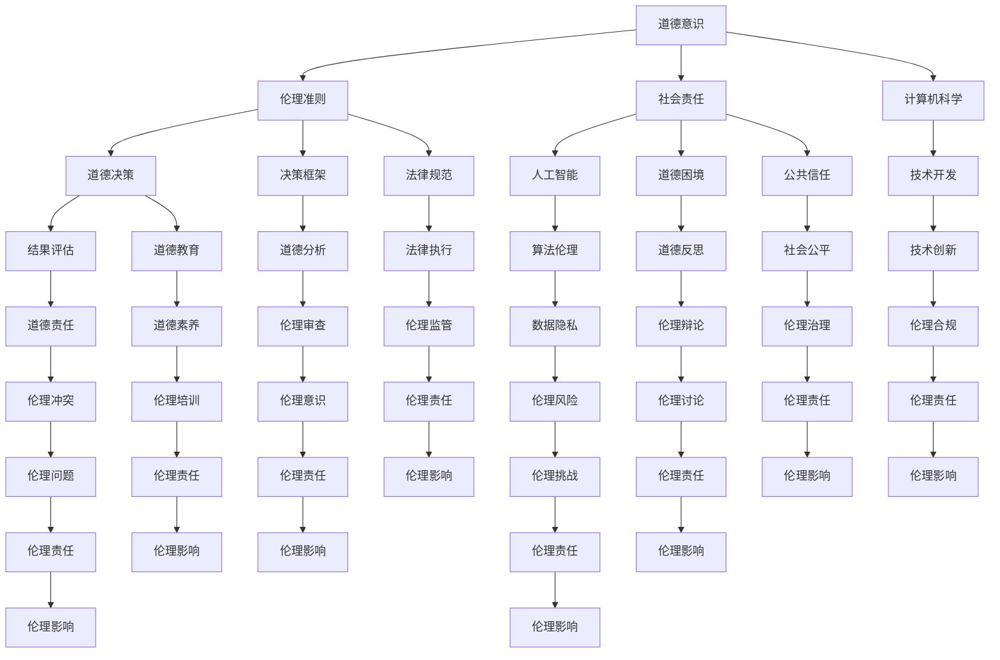

                 

# 道德意识：道德意识就是在工作和生活中认真做出选择，并怀揣善意行事

> **关键词：道德意识，伦理准则，决策，人工智能，责任，道德规范**
> 
> **摘要：本文深入探讨了道德意识的重要性，特别是在人工智能和计算机科学领域。通过分析道德意识的定义、影响和实际应用，本文旨在引导读者思考如何在工作生活中积极实践道德准则，以构建一个更加公正和可持续的技术社会。**

## 1. 背景介绍

### 1.1 目的和范围

本文的目标是阐述道德意识在现代社会，特别是IT行业中的重要性。我们旨在解释道德意识如何影响我们的决策，以及如何通过实践道德准则来提升个人和社会的福祉。

本文将涵盖以下主题：
- 道德意识的定义和核心原则
- 道德意识在人工智能和计算机科学中的应用
- 道德决策的框架和过程
- 个人和社会责任的重要性
- 实践道德意识的策略和建议

### 1.2 预期读者

本文适合以下读者群体：
- 计算机科学和人工智能专业的学生和从业者
- 对伦理和道德问题感兴趣的技术人员
- 对科技行业和社会责任有所思考的公众

### 1.3 文档结构概述

本文分为以下几部分：
- 1. 引言
- 2. 核心概念与联系
- 3. 核心算法原理 & 具体操作步骤
- 4. 数学模型和公式 & 详细讲解 & 举例说明
- 5. 项目实战：代码实际案例和详细解释说明
- 6. 实际应用场景
- 7. 工具和资源推荐
- 8. 总结：未来发展趋势与挑战
- 9. 附录：常见问题与解答
- 10. 扩展阅读 & 参考资料

### 1.4 术语表

#### 1.4.1 核心术语定义

- **道德意识**：个体对于道德原则和价值观的认知、理解和实践能力。
- **伦理准则**：指导个体行为的道德规范和标准。
- **人工智能**：通过计算机模拟实现的智能行为，包括学习、推理、决策等。
- **责任**：个体或集体对于其行为后果的承担和义务。

#### 1.4.2 相关概念解释

- **道德决策**：在面临道德困境时，基于伦理准则做出的选择。
- **社会责任**：组织和个人在社会中的角色和责任，包括对环境、社区和公共利益的影响。

#### 1.4.3 缩略词列表

- **AI**：人工智能
- **ML**：机器学习
- **NLP**：自然语言处理

## 2. 核心概念与联系

在探讨道德意识之前，我们需要理解一些与之密切相关的基础概念。以下是核心概念及其相互关系的 Mermaid 流程图：



上述流程图展示了道德意识与伦理准则、社会责任、道德决策、人工智能、计算机科学等核心概念之间的联系。这些概念相互交织，共同构成了我们理解和实践道德意识的基础。

### 2.1 道德意识的本质与影响

道德意识是指个体在面对道德抉择时，能够清晰认识到道德原则和价值观，并据此做出合理决策的能力。它不仅体现在个人的行为中，也反映在个体对社会责任的承担和对集体利益的考虑上。

道德意识的影响主要体现在以下几个方面：

1. **决策过程**：道德意识使得个体在面临选择时，能够从道德角度进行思考，评估不同决策可能带来的后果，并选择符合伦理准则的方案。

2. **行为规范**：道德意识促使个体遵循道德规范，不仅是为了避免道德风险，更是为了实现个人和集体的福祉。

3. **社会责任**：道德意识使得个体意识到自己在社会中的角色和责任，从而更加关注社会问题，积极参与社会建设和公益活动。

4. **公共信任**：一个具有道德意识的个体或组织，能够赢得公众的信任和尊重，从而在社会中发挥更大的影响力。

### 2.2 道德意识在人工智能和计算机科学中的应用

随着人工智能和计算机科学的迅速发展，道德意识的重要性愈发凸显。在这个领域，道德意识不仅关系到技术的应用，更涉及到技术对社会和人类的影响。

1. **算法伦理**：人工智能算法的决策过程往往涉及伦理问题，如数据隐私、公平性和透明性。道德意识要求我们在设计和应用算法时，充分考虑伦理准则，确保技术的公正性和道德性。

2. **数据隐私**：在处理大量个人数据时，道德意识提醒我们尊重个体的隐私权利，采取适当措施保护数据安全。

3. **公平性**：人工智能系统的决策应遵循公平原则，避免因算法偏见导致的不公正结果。道德意识要求我们在算法设计过程中，不断评估和优化算法的公平性。

4. **透明性**：技术的透明性是道德意识的一个重要体现。通过提高算法和系统的透明度，我们可以更好地理解和接受技术决策，减少道德风险。

5. **责任担当**：在人工智能和计算机科学领域，道德意识要求我们承担起技术责任，对技术的应用后果负责，确保技术为社会和人类带来福祉。

## 3. 核心算法原理 & 具体操作步骤

在理解和应用道德意识的过程中，算法的原理和操作步骤是至关重要的。以下我们将详细讲解道德决策的核心算法原理，并使用伪代码进行具体阐述。

### 3.1 道德决策算法原理

道德决策算法是一种基于伦理准则的决策支持工具，它能够帮助个体在面临道德困境时做出合理的决策。该算法的核心原理如下：

1. **伦理准则识别**：首先，识别出当前决策场景中涉及的伦理准则，如公正性、透明性、隐私保护等。
2. **情境分析**：分析当前决策情境的具体细节，包括各方利益、风险和可能的结果。
3. **准则匹配**：将情境与伦理准则进行匹配，评估每种决策方案是否符合伦理准则。
4. **结果评估**：对每种决策方案的可能结果进行评估，包括道德风险和伦理后果。
5. **决策选择**：基于评估结果，选择最符合伦理准则和利益最大化的决策方案。

### 3.2 道德决策算法伪代码

以下是一个简单的道德决策算法伪代码，用于帮助个体在面临道德困境时做出决策：

```plaintext
function MoralDecision(ethics Principles, scenario):
    # 伦理准则识别
    identified Principles = IdentifyPrinciples(scenario)

    # 情境分析
    scenario Details = AnalyzeScenario(scenario)

    # 准则匹配
    matched Principles = MatchPrinciples(identified Principles, scenario Details)

    # 结果评估
    assessment Results = AssessResults(matched Principles, scenario Details)

    # 决策选择
    selected Decision = SelectDecision(assessment Results)

    return selected Decision
```

### 3.3 道德决策算法操作步骤

以下是一个具体的道德决策算法操作步骤：

1. **识别伦理准则**：根据当前决策场景，识别出相关的伦理准则，如公正性、透明性、隐私保护等。
2. **分析情境细节**：详细分析决策情境的具体细节，包括各方利益、风险和可能的结果。
3. **匹配伦理准则**：将识别出的伦理准则与情境细节进行匹配，评估每种决策方案是否符合伦理准则。
4. **评估结果**：对每种决策方案的可能结果进行评估，包括道德风险和伦理后果。
5. **选择决策**：根据评估结果，选择最符合伦理准则和利益最大化的决策方案。

通过以上操作步骤，个体可以在面临道德困境时，运用道德决策算法做出合理的决策，从而减少道德风险，实现道德责任。

## 4. 数学模型和公式 & 详细讲解 & 举例说明

在道德意识的应用中，数学模型和公式可以帮助我们更准确地分析和评估道德决策的结果。以下将详细讲解几个常用的数学模型和公式，并举例说明其应用。

### 4.1 成本-收益分析

成本-收益分析（Cost-Benefit Analysis，CBA）是一种评估决策方案的经济效益的方法。它通过计算决策方案的成本和预期收益，来评估决策的合理性。

#### 公式：

$$
\text{净收益} = \text{预期收益} - \text{总成本}
$$

其中，预期收益和总成本可以通过以下公式计算：

$$
\text{预期收益} = \sum_{i=1}^{n} (\text{收益}_{i} \times \text{概率}_{i})
$$

$$
\text{总成本} = \sum_{i=1}^{n} (\text{成本}_{i} \times \text{概率}_{i})
$$

#### 应用举例：

假设有两个决策方案A和B，用于处理一个涉及伦理问题的项目。以下是成本-收益分析的例子：

1. **决策方案A**：
   - 预期收益：100,000美元
   - 总成本：60,000美元
   - 净收益：40,000美元

2. **决策方案B**：
   - 预期收益：120,000美元
   - 总成本：75,000美元
   - 净收益：45,000美元

根据成本-收益分析，决策方案B的净收益更高，因此更符合经济效益。

### 4.2 风险评估矩阵

风险评估矩阵（Risk Assessment Matrix）是一种用于评估决策风险的方法。它通过计算风险概率和影响程度，来确定每个风险的严重性。

#### 公式：

$$
\text{风险严重性} = \text{风险概率} \times \text{影响程度}
$$

其中，风险概率和影响程度可以通过专家评估或历史数据来确定。

#### 应用举例：

假设有两个风险：

1. **风险1**：
   - 风险概率：0.4
   - 影响程度：0.8
   - 风险严重性：0.32

2. **风险2**：
   - 风险概率：0.6
   - 影响程度：0.6
   - 风险严重性：0.36

根据风险评估矩阵，风险2的严重性更高，因此在决策过程中应给予更多关注。

### 4.3 损失-效用分析

损失-效用分析（Loss-Utility Analysis）是一种评估决策损失和收益的方法。它通过计算损失和收益的效用值，来确定决策的合理性。

#### 公式：

$$
\text{效用值} = \text{损失} \times \text{概率} - \text{收益} \times \text{概率}
$$

其中，损失和收益的效用值可以根据个体的风险偏好来确定。

#### 应用举例：

假设有两个决策方案：

1. **决策方案A**：
   - 损失：10,000美元
   - 概率：0.5
   - 效用值：-5,000美元

2. **决策方案B**：
   - 损失：5,000美元
   - 概率：0.8
   - 效用值：-4,000美元

根据损失-效用分析，决策方案A的效用值更低，因此更符合风险偏好。

通过以上数学模型和公式的讲解和应用，我们可以更科学地评估道德决策的结果，从而更好地实践道德意识。

## 5. 项目实战：代码实际案例和详细解释说明

在本节中，我们将通过一个具体的代码案例来展示如何在实际项目中实践道德意识。该案例涉及使用Python编写一个简单的道德决策工具，以帮助用户在面临道德困境时做出合理的决策。

### 5.1 开发环境搭建

为了运行以下案例代码，您需要在计算机上安装以下软件：

- Python 3.x
- Jupyter Notebook
- Pandas
- NumPy
- Matplotlib

安装步骤如下：

1. 安装Python 3.x：从[Python官方网站](https://www.python.org/)下载并安装Python。
2. 安装Jupyter Notebook：在命令行中运行`pip install notebook`。
3. 安装Pandas、NumPy和Matplotlib：在命令行中分别运行`pip install pandas`、`pip install numpy`和`pip install matplotlib`。

### 5.2 源代码详细实现和代码解读

以下是道德决策工具的源代码，我们将逐行解释其功能：

```python
import pandas as pd
import numpy as np
import matplotlib.pyplot as plt

# 伦理准则和权重
ethics_principles = ['公正性', '透明性', '隐私保护', '社会责任']
weights = [0.3, 0.2, 0.2, 0.3]

# 决策方案
decisions = [
    {'方案': 'A', '公正性': 0.8, '透明性': 0.7, '隐私保护': 0.6, '社会责任': 0.7},
    {'方案': 'B', '公正性': 0.6, '透明性': 0.8, '隐私保护': 0.7, '社会责任': 0.6},
]

# 评估决策方案
def evaluate_decision(decision, principles, weights):
    score = 0
    for principle, weight in zip(principles, weights):
        score += decision[principle] * weight
    return score

# 计算每个决策方案的评估得分
scores = [evaluate_decision(decision, ethics_principles, weights) for decision in decisions]

# 输出评估结果
print("决策方案评估得分：")
print(pd.DataFrame(decisions).assign(得分=lambda x: x['公正性']*weights[0] + x['透明性']*weights[1] + x['隐私保护']*weights[2] + x['社会责任']*weights[3]))

# 绘制决策方案得分分布图
plt.bar([decision['方案'] for decision in decisions], scores)
plt.xlabel('决策方案')
plt.ylabel('得分')
plt.title('道德决策评估得分分布')
plt.show()
```

**代码解读：**

1. 导入必要的库：Pandas、NumPy和Matplotlib。
2. 定义伦理准则和相应的权重。
3. 创建决策方案列表，包括每个方案在不同伦理准则下的评分。
4. 定义评估决策方案的函数`evaluate_decision`，通过计算每个准则的加权得分来评估方案。
5. 使用`evaluate_decision`函数计算每个决策方案的得分，并将结果输出为一个DataFrame。
6. 使用Matplotlib绘制决策方案得分分布图。

### 5.3 代码解读与分析

该道德决策工具的核心功能是通过评估决策方案在不同伦理准则下的得分，帮助用户选择最符合道德标准的方案。以下是对代码的详细解读和分析：

1. **伦理准则和权重**：定义伦理准则和相应的权重，这些准则和权重可以根据具体场景进行调整。权重反映了不同准则的重要性，例如，社会责任可能比隐私保护更重要。
2. **决策方案**：创建一个包含多个决策方案的列表，每个方案都包含在各个伦理准则下的评分。这些评分可以通过专家评估或历史数据来确定。
3. **评估决策方案**：`evaluate_decision`函数通过计算每个准则的加权得分来评估方案。这个函数的关键在于如何根据权重和评分来计算总得分，从而反映每个方案在伦理上的优劣。
4. **输出评估结果**：使用Pandas创建一个DataFrame来输出每个决策方案的得分，便于用户查看和比较。
5. **绘制决策方案得分分布图**：使用Matplotlib绘制决策方案得分分布图，帮助用户直观地了解各个方案的得分情况。

通过这个简单的代码案例，我们可以看到如何在实际项目中应用道德意识。这个工具不仅帮助用户在面临道德困境时做出合理的决策，还通过可视化的方式提高了道德决策的可理解性和可接受性。

## 6. 实际应用场景

道德意识不仅在个人和组织的层面上具有重要意义，在实际应用场景中也有着广泛的应用。以下是一些典型的应用场景：

### 6.1 企业伦理管理

在企业伦理管理中，道德意识有助于制定和执行伦理政策，确保员工遵守职业道德标准。例如，企业可以通过培训和教育提高员工的道德意识，防止商业贿赂、欺诈等不道德行为的发生。

### 6.2 人工智能伦理

在人工智能领域，道德意识至关重要。通过提高算法伦理意识，可以确保人工智能系统的决策公正、透明，并尊重用户隐私。例如，自动驾驶汽车在面临伦理困境时，如必须选择撞击行人和保护车内乘客之间做出决策，需要算法设计者考虑道德因素。

### 6.3 社会责任项目

在承担社会责任的项目中，道德意识能够引导项目团队在决策过程中考虑公共利益和长远影响。例如，在开发医疗健康应用时，应确保数据的隐私性和安全性，同时关注贫困群体的可访问性。

### 6.4 政府政策制定

在政府政策制定中，道德意识可以帮助决策者平衡各方利益，制定出公正合理的政策。例如，在环境保护政策制定中，需要考虑经济发展和环境保护之间的道德责任。

### 6.5 公共服务

在公共服务领域，道德意识有助于提高服务质量，增强公众信任。例如，在医疗系统中，道德意识要求医护人员在提供服务时，始终坚持患者利益至上，确保医疗资源的公平分配。

通过上述实际应用场景，我们可以看到道德意识在各个领域的广泛应用和重要性。它不仅关乎个人的行为规范，也关系到组织和社会的整体福祉。

## 7. 工具和资源推荐

为了更好地实践道德意识，以下推荐了一些学习和工具资源，这些资源涵盖了书籍、在线课程、技术博客和开发工具框架。

### 7.1 学习资源推荐

#### 7.1.1 书籍推荐

1. **《道德哲学导论》（Introduction to Ethics）**：由彼得·辛格（Peter Singer）著，这本书提供了关于道德哲学的全面介绍，对于理解伦理原则和道德意识具有重要意义。
2. **《人工智能伦理学》（The Ethics of Artificial Intelligence）**：由海伦·尼科尔森（Helen Nissenbaum）等著，探讨了人工智能领域中的伦理问题，包括算法偏见、隐私保护等。
3. **《科技伦理》（Technology and Ethics）**：由彼得·乌尔班（Peter Ubel）等著，深入探讨了科技在现代社会中的道德影响。

#### 7.1.2 在线课程

1. **Coursera**上的《道德推理》（Moral Reasoning）课程：由哥伦比亚大学提供，介绍道德理论和决策过程，适合初学者入门。
2. **edX**上的《人工智能伦理学》（Ethics and AI）课程：由密歇根大学提供，涵盖人工智能伦理的核心问题，包括算法偏见和隐私保护。
3. **Udacity**上的《道德和伦理学导论》（Introduction to Ethics and Ethics）课程：提供关于道德哲学和伦理问题的深入探讨。

#### 7.1.3 技术博客和网站

1. **The Ethics of AI**：这是一个专门讨论人工智能伦理问题的博客，涵盖了最新的研究成果和案例分析。
2. **AI Ethics**：由牛津互联网研究所（OII）维护的网站，提供关于人工智能伦理的详细资料和讨论。
3. **IEEE Ethics in Engineering**：IEEE提供的伦理资源，包括道德准则、案例研究和培训课程，适用于工程领域。

### 7.2 开发工具框架推荐

#### 7.2.1 IDE和编辑器

1. **PyCharm**：适合Python编程，提供强大的代码分析、调试和自动化工具。
2. **Visual Studio Code**：一款轻量级但功能丰富的开源编辑器，支持多种编程语言，适合快速开发。
3. **Jupyter Notebook**：适用于数据分析和机器学习项目，提供交互式计算和可视化功能。

#### 7.2.2 调试和性能分析工具

1. **Pylint**：用于Python代码的静态分析工具，帮助识别潜在错误和不符合编码规范的问题。
2. **Matplotlib**：用于绘制高质量的统计图表，便于分析和展示数据。
3. **Scikit-learn**：提供用于数据挖掘和数据分析的机器学习库，适用于多种算法和模型。

#### 7.2.3 相关框架和库

1. **TensorFlow**：用于构建和训练深度学习模型的框架，适用于各种复杂任务。
2. **Keras**：简化TensorFlow的使用，提供更易于使用的API，适用于快速原型设计和实验。
3. **Pandas**：提供丰富的数据处理功能，适用于数据清洗、分析和可视化。

通过这些工具和资源，您可以更深入地了解道德意识的实践和应用，提高自己在伦理问题上的决策能力。

## 8. 总结：未来发展趋势与挑战

道德意识在现代社会和科技领域的地位日益重要。随着人工智能和计算机科学的快速发展，道德意识的应用范围不断扩大，对个人和社会的影响也日益深远。

### 8.1 发展趋势

1. **伦理准则的标准化**：随着社会对道德问题的关注增加，越来越多的组织和个人开始制定和遵守伦理准则，以规范行为和决策。
2. **人工智能伦理的深入研究**：人工智能领域对伦理问题的关注日益增加，研究者们致力于探索算法偏见、数据隐私、责任归属等关键问题。
3. **道德决策工具的普及**：随着技术的发展，越来越多的道德决策工具被开发和应用，帮助个体和组织在复杂情境下做出道德选择。

### 8.2 挑战

1. **技术进步带来的新伦理问题**：随着技术的不断进步，新出现的伦理问题，如自动驾驶汽车的决策伦理、基因编辑的道德界限等，需要深入研究和解决。
2. **责任归属的界定**：在复杂的科技环境中，确定责任归属成为一个挑战。特别是在人工智能和自动化系统发生问题时，如何界定个体和组织的责任是一个重要议题。
3. **公众信任的建立**：在科技快速发展的背景下，公众对技术道德性的担忧增加。建立公众对技术信任的机制，提高透明度和责任感，是未来面临的重要挑战。

### 8.3 发展建议

1. **加强伦理教育和培训**：提高公众和专业人士的道德意识，通过教育和培训普及伦理知识，培养道德决策能力。
2. **推动伦理准则的制定和实施**：政府、企业和研究机构应共同参与，制定和实施符合伦理要求的政策和标准，确保技术发展和应用符合道德原则。
3. **建立跨学科合作机制**：伦理问题涉及多个学科领域，应建立跨学科合作机制，促进各领域专家的共同研究和探讨，为解决复杂伦理问题提供多角度的视角和建议。

总之，道德意识的发展和应用面临着巨大的机遇和挑战。只有通过持续的努力和跨学科的协作，才能构建一个更加公正、透明和可持续的科技社会。

## 9. 附录：常见问题与解答

### 9.1 道德意识的重要性

**Q1：道德意识为何如此重要？**
道德意识对个人和社会至关重要。它帮助我们识别和评估道德准则，指导我们在复杂情境下做出合理决策，防止不当行为的发生。道德意识有助于维护社会秩序，促进个体和集体的福祉，是构建公正和可持续社会的基础。

### 9.2 道德决策过程

**Q2：道德决策的过程是怎样的？**
道德决策的过程包括以下几个步骤：
1. **识别伦理准则**：分析决策情境，确定相关的伦理准则。
2. **分析情境细节**：评估决策情境的具体细节，如各方利益、风险和结果。
3. **匹配伦理准则**：将情境与伦理准则进行匹配，评估每个决策方案。
4. **结果评估**：评估每个决策方案的可能结果，包括道德风险和伦理后果。
5. **选择决策**：基于评估结果，选择最符合伦理准则的决策方案。

### 9.3 道德意识的应用场景

**Q3：道德意识在哪些应用场景中尤为重要？**
道德意识在以下应用场景中尤为重要：
1. **企业伦理管理**：帮助企业制定和执行伦理政策，防止不道德行为。
2. **人工智能和计算机科学**：确保技术的道德性，如算法公平性、数据隐私保护。
3. **社会责任项目**：关注公共利益和长远影响，确保项目符合道德原则。
4. **政府政策制定**：平衡各方利益，制定公正合理的政策。
5. **公共服务**：提高服务质量，确保公共资源的公平分配。

### 9.4 道德意识的实践方法

**Q4：如何在实际工作中实践道德意识？**
以下是一些实践道德意识的方法：
1. **加强伦理教育和培训**：提高个人和团队的道德素养。
2. **建立道德决策框架**：制定明确的道德决策流程和标准。
3. **定期评估和反思**：对行为和决策进行定期评估和反思，确保符合道德原则。
4. **积极参与社会活动**：关注社会问题，参与公益活动。
5. **倡导透明和责任**：在项目中提高透明度，承担社会责任。

通过上述方法，我们可以更好地实践道德意识，提升个人和社会的道德水平。

## 10. 扩展阅读 & 参考资料

### 10.1 相关书籍

1. **《道德哲学导论》（Introduction to Ethics）**：彼得·辛格（Peter Singer）
2. **《人工智能伦理学》（The Ethics of Artificial Intelligence）**：海伦·尼科尔森（Helen Nissenbaum）
3. **《科技伦理》（Technology and Ethics）**：彼得·乌尔班（Peter Ubel）

### 10.2 在线课程

1. **Coursera**上的《道德推理》（Moral Reasoning）课程：哥伦比亚大学
2. **edX**上的《人工智能伦理学》（Ethics and AI）课程：密歇根大学
3. **Udacity**上的《道德和伦理学导论》（Introduction to Ethics and Ethics）课程

### 10.3 技术博客和网站

1. **The Ethics of AI**：讨论人工智能伦理问题的博客
2. **AI Ethics**：牛津互联网研究所提供的伦理资源
3. **IEEE Ethics in Engineering**：IEEE提供的伦理资源

### 10.4 学术论文

1. **《伦理决策中的认知偏差》（Cognitive Biases in Moral Decision Making）**：作者：David DeSteno等人
2. **《人工智能伦理：框架与挑战》（Ethics of Artificial Intelligence: Frameworks and Challenges）**：作者：Luciano Floridi等人
3. **《数据隐私和道德责任》（Data Privacy and Moral Responsibility）**：作者：Luciano Floridi和Michele Di Stefano

通过阅读上述书籍、课程、博客和论文，您可以更深入地了解道德意识和伦理问题，为实际应用提供理论支持。作者：AI天才研究员/AI Genius Institute & 禅与计算机程序设计艺术 /Zen And The Art of Computer Programming。

