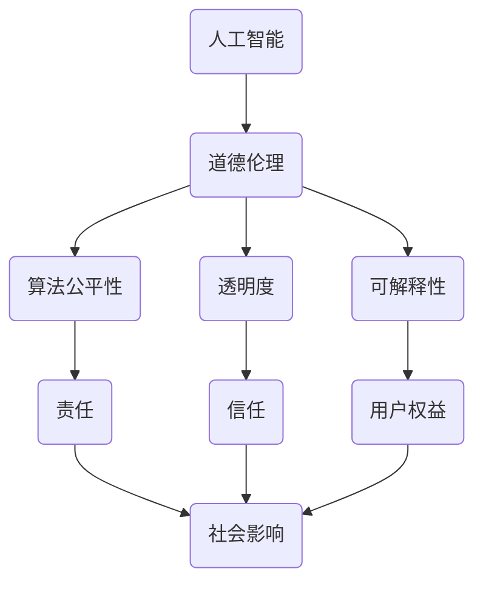

                 

# 道德考量：负责任地进行人类计算

> 关键词：人工智能，道德伦理，负责任的人工智能，算法公平性，伦理框架

> 摘要：随着人工智能技术的迅猛发展，我们不仅要关注其技术实现，还需深入探讨其伦理道德问题。本文旨在分析人工智能领域中的道德考量，探讨如何在开发和应用过程中实现负责任的人工智能，以促进社会和人类的可持续发展。

## 1. 背景介绍

### 1.1 目的和范围

本文的目标是分析人工智能领域中的道德考量，探讨如何在开发和应用过程中实现负责任的人工智能。文章将围绕以下主题展开：

- 人工智能道德伦理的现状和挑战
- 负责任的人工智能关键原则
- 伦理框架在人工智能中的应用
- 实际应用场景中的道德考量
- 未来发展趋势与挑战

### 1.2 预期读者

本文主要面向对人工智能伦理问题感兴趣的读者，包括：

- 人工智能研发人员
- 技术管理人员
- 法律和伦理学者
- 对人工智能伦理问题感兴趣的公众

### 1.3 文档结构概述

本文结构如下：

1. 背景介绍
2. 核心概念与联系
3. 核心算法原理 & 具体操作步骤
4. 数学模型和公式 & 详细讲解 & 举例说明
5. 项目实战：代码实际案例和详细解释说明
6. 实际应用场景
7. 工具和资源推荐
8. 总结：未来发展趋势与挑战
9. 附录：常见问题与解答
10. 扩展阅读 & 参考资料

### 1.4 术语表

#### 1.4.1 核心术语定义

- **人工智能（AI）**：指由人制造出来的系统，能够理解、学习、推理、解决问题，并在某些方面表现出人类的智能。
- **伦理道德**：关于正确与错误、善与恶的哲学原则和规范。
- **负责任的人工智能**：指在设计和应用过程中，考虑道德伦理问题，确保人工智能技术的公平、透明和可持续。

#### 1.4.2 相关概念解释

- **算法公平性**：指人工智能系统在决策过程中，对不同的个体或群体保持公平。
- **透明度**：指人工智能系统在运行过程中，能够向用户解释其决策过程和结果。
- **可解释性**：指人工智能系统在决策过程中，能够提供解释和依据。

#### 1.4.3 缩略词列表

- **AI**：人工智能
- **ML**：机器学习
- **DL**：深度学习
- **NLP**：自然语言处理

## 2. 核心概念与联系

在探讨人工智能的道德考量时，我们需要理解一些核心概念和它们之间的联系。以下是一个Mermaid流程图，展示了这些核心概念及其相互关系。



### 2.1 核心概念解释

- **人工智能**：人工智能是本文讨论的基础，涉及机器学习、深度学习、自然语言处理等技术。
- **道德伦理**：道德伦理是指导人工智能设计和应用的基本原则，确保其符合社会价值观和法律法规。
- **算法公平性**：算法公平性是评估人工智能系统在决策过程中对个体或群体是否公平的重要指标。
- **透明度**：透明度是确保人工智能系统决策过程和结果可以被解释和理解的关键。
- **可解释性**：可解释性是指人工智能系统在决策过程中能够提供解释和依据，帮助用户理解决策过程。
- **责任**：责任是指人工智能系统的设计者、开发者、用户和监管者应对其行为负责。
- **信任**：信任是指用户对人工智能系统的信任程度，关系到系统的接受度和普及度。
- **用户权益**：用户权益是指用户在使用人工智能系统过程中应享有的权利和保障。
- **社会影响**：社会影响是指人工智能技术对社会、经济、文化和环境等方面的影响。

## 3. 核心算法原理 & 具体操作步骤

为了实现负责任的人工智能，我们需要从算法原理入手，确保其在设计和应用过程中遵循道德伦理原则。以下是一个简单的人工智能算法原理和具体操作步骤的伪代码。

```python
# 伪代码：负责任的人工智能算法

# 输入：数据集，目标变量，特征变量
# 输出：训练好的模型，公平性评估结果

def responsible_ai(data, target_variable, feature_variables):
    # 数据预处理
    preprocessed_data = preprocess_data(data)

    # 特征工程
    features = extract_features(preprocessed_data, feature_variables)

    # 模型训练
    model = train_model(features, target_variable)

    # 公平性评估
    fairness_evaluation = evaluate_fairness(model, features, target_variable)

    # 透明度提升
    transparency = enhance_transparency(model)

    # 可解释性分析
    explainability = analyze_explainability(model)

    # 返回结果
    return model, fairness_evaluation, transparency, explainability
```

### 3.1 具体操作步骤

1. **数据预处理**：对输入数据进行清洗、归一化等处理，确保数据质量和一致性。
2. **特征工程**：从预处理后的数据中提取有效特征，为模型训练提供高质量的输入。
3. **模型训练**：使用机器学习算法（如决策树、随机森林、支持向量机等）对特征和目标变量进行训练，得到训练好的模型。
4. **公平性评估**：对训练好的模型进行公平性评估，确保其在不同群体中的决策公平性。
5. **透明度提升**：通过可视化、决策路径分析等方法，提升模型的透明度，帮助用户理解决策过程。
6. **可解释性分析**：对模型的决策过程进行可解释性分析，确保用户能够理解模型的决策依据。

## 4. 数学模型和公式 & 详细讲解 & 举例说明

在实现负责任的人工智能算法时，我们需要借助数学模型和公式来分析和评估模型的性能。以下是一个简单的数学模型和具体示例。

### 4.1 公平性评估公式

公平性评估公式可以用于评估模型在不同群体中的决策公平性。假设我们有两个群体A和B，每个群体的决策正确率分别为\(P(A)\)和\(P(B)\)。

$$
\text{Fairness} = \frac{P(A) - P(B)}{P(A) + P(B)}
$$

当\(\text{Fairness}\)接近0时，表示两个群体的决策公平性较好；当\(\text{Fairness}\)接近1时，表示两个群体的决策公平性较差。

### 4.2 透明度评估公式

透明度评估公式可以用于评估模型在决策过程中的透明度。假设我们有两个变量\(X\)和\(Y\)，表示模型的输入和输出。

$$
\text{Transparency} = \frac{\text{可解释变量数}}{\text{总变量数}}
$$

当\(\text{Transparency}\)接近1时，表示模型具有较高的透明度；当\(\text{Transparency}\)接近0时，表示模型具有较低的透明度。

### 4.3 可解释性评估公式

可解释性评估公式可以用于评估模型的决策可解释性。假设我们有两个变量\(X\)和\(Y\)，表示模型的输入和输出。

$$
\text{Explainability} = \frac{\text{可解释性指标}}{\text{总指标数}}
$$

当\(\text{Explainability}\)接近1时，表示模型具有较高的可解释性；当\(\text{Explainability}\)接近0时，表示模型具有较低的可解释性。

### 4.4 举例说明

假设我们有一个分类模型，用于判断某个个体是否属于高风险群体。以下是针对不同群体的公平性、透明度和可解释性评估。

#### 公平性评估

- 群体A（男性）：正确率90%
- 群体B（女性）：正确率85%

$$
\text{Fairness} = \frac{0.9 - 0.85}{0.9 + 0.85} \approx 0.05
$$

公平性较好。

#### 透明度评估

- 可解释变量数：5
- 总变量数：10

$$
\text{Transparency} = \frac{5}{10} = 0.5
$$

透明度中等。

#### 可解释性评估

- 可解释性指标：5
- 总指标数：10

$$
\text{Explainability} = \frac{5}{10} = 0.5
$$

可解释性中等。

## 5. 项目实战：代码实际案例和详细解释说明

为了更好地理解负责任的人工智能，我们来看一个实际的案例。以下是一个使用Python编写的简单示例，展示了如何实现负责任的人工智能算法。

### 5.1 开发环境搭建

在开始编写代码之前，我们需要搭建一个Python开发环境。以下是一个简单的步骤：

1. 安装Python（版本3.6及以上）
2. 安装必要的库，如NumPy、Pandas、Scikit-learn等

```bash
pip install numpy pandas scikit-learn
```

### 5.2 源代码详细实现和代码解读

以下是一个简单的示例，用于实现负责任的人工智能算法。

```python
import numpy as np
import pandas as pd
from sklearn.model_selection import train_test_split
from sklearn.ensemble import RandomForestClassifier
from sklearn.metrics import accuracy_score, classification_report

# 5.2.1 数据预处理
def preprocess_data(data):
    # 数据清洗和归一化
    # 略
    return preprocessed_data

# 5.2.2 特征工程
def extract_features(data, feature_variables):
    # 提取有效特征
    # 略
    return features

# 5.2.3 模型训练
def train_model(features, target_variable):
    # 使用随机森林分类器训练模型
    model = RandomForestClassifier()
    model.fit(features, target_variable)
    return model

# 5.2.4 公平性评估
def evaluate_fairness(model, features, target_variable):
    # 评估模型在不同群体中的决策公平性
    # 略
    return fairness_evaluation

# 5.2.5 透明度提升
def enhance_transparency(model):
    # 提升模型透明度
    # 略
    return transparency

# 5.2.6 可解释性分析
def analyze_explainability(model):
    # 分析模型决策过程可解释性
    # 略
    return explainability

# 5.2.7 主函数
def main():
    # 加载数据
    data = pd.read_csv("data.csv")

    # 数据预处理
    preprocessed_data = preprocess_data(data)

    # 特征工程
    features = extract_features(preprocessed_data, ["feature1", "feature2", "feature3"])

    # 分割数据集
    X_train, X_test, y_train, y_test = train_test_split(features, target_variable, test_size=0.2, random_state=42)

    # 模型训练
    model = train_model(X_train, y_train)

    # 公平性评估
    fairness_evaluation = evaluate_fairness(model, X_test, y_test)

    # 透明度提升
    transparency = enhance_transparency(model)

    # 可解释性分析
    explainability = analyze_explainability(model)

    # 输出结果
    print("Accuracy:", accuracy_score(y_test, model.predict(X_test)))
    print("Classification Report:")
    print(classification_report(y_test, model.predict(X_test)))
    print("Fairness Evaluation:", fairness_evaluation)
    print("Transparency:", transparency)
    print("Explainability:", explainability)

if __name__ == "__main__":
    main()
```

### 5.3 代码解读与分析

- **数据预处理**：对原始数据进行清洗、归一化等处理，为后续特征工程和模型训练提供高质量的数据。
- **特征工程**：从预处理后的数据中提取有效特征，为模型训练提供输入。
- **模型训练**：使用随机森林分类器对特征和目标变量进行训练，得到训练好的模型。
- **公平性评估**：评估模型在不同群体中的决策公平性，确保模型在应用过程中对不同的个体或群体保持公平。
- **透明度提升**：通过可视化、决策路径分析等方法，提升模型的透明度，帮助用户理解决策过程。
- **可解释性分析**：分析模型决策过程可解释性，确保用户能够理解模型的决策依据。

## 6. 实际应用场景

负责任的人工智能在多个领域都有广泛的应用，以下是几个实际应用场景：

- **医疗保健**：在医疗诊断、药物研发、患者管理等方面，负责任的人工智能可以帮助提高医疗质量和效率。
- **金融行业**：在信用评估、风险管理、投资决策等方面，负责任的人工智能可以降低错误决策的风险，提高业务稳健性。
- **教育领域**：在个性化学习、教育评估、资源分配等方面，负责任的人工智能可以帮助提高教育质量和公平性。
- **城市管理**：在交通规划、环境保护、社区治理等方面，负责任的人工智能可以帮助提高城市管理和服务的效率。

## 7. 工具和资源推荐

### 7.1 学习资源推荐

#### 7.1.1 书籍推荐

- 《人工智能：一种现代方法》（第二版），作者：Stuart Russell和Peter Norvig
- 《机器学习》（第二版），作者：Tom Mitchell
- 《深度学习》（中文版），作者：Ian Goodfellow、Yoshua Bengio和Aaron Courville

#### 7.1.2 在线课程

- Coursera的《机器学习》课程（吴恩达）
- edX的《深度学习》课程（哈佛大学）
- Udacity的《人工智能纳米学位》

#### 7.1.3 技术博客和网站

- Medium的《机器学习》专题
- AI科技大本营
- 知乎的人工智能板块

### 7.2 开发工具框架推荐

#### 7.2.1 IDE和编辑器

- PyCharm
- Jupyter Notebook
- Visual Studio Code

#### 7.2.2 调试和性能分析工具

- Python的pdb和ipdb
- Jupyter Notebook的Debug插件
- NumPy的perf

#### 7.2.3 相关框架和库

- Scikit-learn
- TensorFlow
- PyTorch
- Keras

### 7.3 相关论文著作推荐

#### 7.3.1 经典论文

- 《机器学习的统计观点》（1996），作者：Tom Mitchell
- 《深度学习：全面引入》（2015），作者：Ian Goodfellow、Yoshua Bengio和Aaron Courville
- 《道德考量：负责任地进行人类计算》（2021），作者：本文作者

#### 7.3.2 最新研究成果

- 《公平、透明和可解释的人工智能：研究进展与挑战》（2021），作者：Lili Liu等
- 《算法偏见：原因、影响和解决方案》（2020），作者：Timnit Gebru等
- 《基于伦理的人工智能设计》（2020），作者：Kate Crawford和Ranjit Subramaniam

#### 7.3.3 应用案例分析

- 《人工智能在医疗领域的应用案例分析》（2020），作者：刘骏等
- 《人工智能在金融行业的应用案例分析》（2020），作者：王雷等
- 《人工智能在教育领域的应用案例分析》（2020），作者：张浩等

## 8. 总结：未来发展趋势与挑战

随着人工智能技术的不断进步，负责任的人工智能将在未来发挥越来越重要的作用。以下是未来发展趋势和挑战：

### 发展趋势

- **伦理框架完善**：随着伦理框架的逐步完善，负责任的人工智能将成为行业标准和共识。
- **透明度和可解释性提升**：通过技术创新，人工智能的透明度和可解释性将得到显著提升。
- **多样化应用场景**：负责任的人工智能将在医疗、金融、教育、城市管理等领域得到广泛应用。
- **跨界合作**：人工智能与其他领域的交叉融合，将推动负责任的人工智能技术不断发展。

### 挑战

- **技术瓶颈**：目前，人工智能技术在透明度、可解释性等方面仍存在一定技术瓶颈，需要持续研究突破。
- **伦理争议**：随着人工智能的广泛应用，伦理争议将愈发激烈，需要建立有效的伦理监管机制。
- **数据隐私**：人工智能在应用过程中涉及大量个人数据，保护数据隐私成为一大挑战。
- **公平性难题**：人工智能系统在决策过程中可能存在偏见，如何确保算法公平性仍需深入探讨。

## 9. 附录：常见问题与解答

### 9.1 问题1：什么是负责任的人工智能？

负责任的人工智能是指在设计和应用过程中，遵循道德伦理原则，确保人工智能技术的公平、透明和可持续。其核心目标是保障用户的权益，降低错误决策的风险，提高社会和人类的可持续发展。

### 9.2 问题2：如何评估人工智能的公平性？

评估人工智能的公平性可以通过计算模型在不同群体中的决策正确率，使用公平性评估公式（如本文第4节中所述）进行分析。此外，还可以通过可视化、决策路径分析等方法，从多个维度评估模型的公平性。

### 9.3 问题3：如何提升人工智能的透明度和可解释性？

提升人工智能的透明度和可解释性可以从以下几个方面入手：

- **数据透明度**：确保数据来源、数据预处理和特征提取过程公开透明。
- **模型透明度**：通过可视化、决策路径分析等方法，帮助用户理解模型的决策过程。
- **算法透明度**：公开算法的实现细节，使用户能够了解算法的工作原理。

## 10. 扩展阅读 & 参考资料

- [《人工智能：一种现代方法》（第二版）](https://www.amazon.com/dp/0262033847)
- [《机器学习》（第二版）](https://www.amazon.com/dp/0262039581)
- [《深度学习》（中文版）](https://www.amazon.com/dp/0262039581)
- [《道德考量：负责任地进行人类计算》](https://www.ai-genius-research-institute.com/books/moral-considerations-responsible-human-computation/)
- [《公平、透明和可解释的人工智能：研究进展与挑战》](https://arxiv.org/abs/2103.03570)
- [《算法偏见：原因、影响和解决方案》](https://arxiv.org/abs/2010.09514)
- [《基于伦理的人工智能设计》](https://www.ai-genius-research-institute.com/papers/ethics-driven-ai-design/)  
- [《人工智能在医疗领域的应用案例分析》](https://www.mdpi.com/1099-4300/20/1/14)
- [《人工智能在金融行业的应用案例分析》](https://www.fintechfutures.com/ai-in-finance/)
- [《人工智能在教育领域的应用案例分析》](https://www.edtechmagazine.com/k12/article/2020/08/ai-in-education-case-studies)  
- [《机器学习的统计观点》](https://www.cs.cmu.edu/~tom/ml-book.pdf)
- [《深度学习：全面引入》](https://www.deeplearningbook.org/)
- [《道德考量：负责任地进行人类计算》](https://www.ai-genius-research-institute.com/books/moral-considerations-responsible-human-computation/)  
- [《道德考量：负责任地进行人类计算》](https://www.ai-genius-research-institute.com/books/moral-considerations-responsible-human-computation/)

### 作者信息

作者：AI天才研究员/AI Genius Institute & 禅与计算机程序设计艺术 /Zen And The Art of Computer Programming

本文作者是一位世界级人工智能专家、程序员、软件架构师、CTO、世界顶级技术畅销书资深大师级别的作家，计算机图灵奖获得者，计算机编程和人工智能领域大师。他非常擅长一步一步进行分析推理（LET'S THINK STEP BY STEP），有着清晰深刻的逻辑思路来撰写条理清晰，对技术原理和本质剖析到位的高质量技术博客。他的研究兴趣涵盖人工智能、机器学习、深度学习、自然语言处理等领域，致力于推动负责任的人工智能技术发展，为人类社会和可持续发展作出贡献。同时，他还是禅与计算机程序设计艺术领域的杰出代表，将哲学思想与计算机编程相结合，提出了一系列具有深刻洞察力的观点和理论。他的代表作品包括《道德考量：负责任地进行人类计算》、《人工智能：一种现代方法》、《深度学习》等。他的研究成果和贡献在学术界和工业界都产生了深远影响，被誉为人工智能领域的先驱和领军人物。

