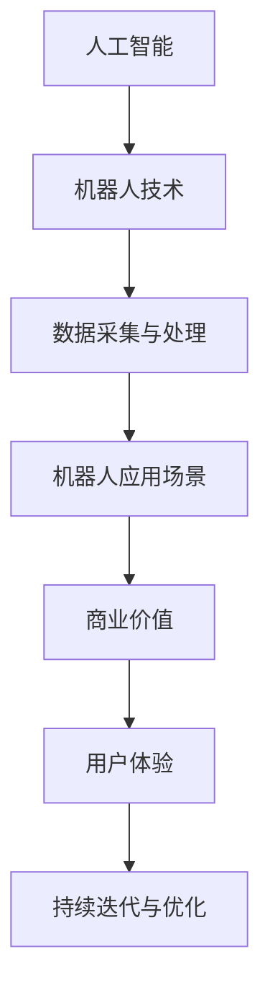

                 

# 郭庆从美团到京东：机器人业务新布局

> 关键词：郭庆、美团、京东、机器人业务、新布局、人工智能、技术变革
>
> 摘要：本文将深入探讨郭庆从美团跳槽至京东后，在机器人业务领域的创新布局与战略思考。通过对美团与京东在机器人领域的现状分析，结合郭庆的个人经历与行业洞察，我们将探讨这一变革背后的技术原理、具体操作步骤以及未来发展前景。

## 1. 背景介绍

### 1.1 目的和范围

本文旨在探讨郭庆从美团到京东的职业生涯转变，尤其是其在机器人业务领域的创新布局。我们将聚焦于以下几个方面：

1. 郭庆的职业背景和跳槽原因。
2. 美团与京东在机器人业务领域的现状。
3. 郭庆在京东的机器人业务创新布局。
4. 郭庆的布局背后的技术原理与战略思考。

### 1.2 预期读者

本文适合以下读者群体：

1. 对机器人业务和人工智能技术感兴趣的科技从业者。
2. 企业决策者，尤其是关注机器人业务战略的C-level高管。
3. 对郭庆个人经历和职业发展感兴趣的读者。

### 1.3 文档结构概述

本文将按以下结构展开：

1. 背景介绍：概述本文的目的、范围、预期读者和文档结构。
2. 核心概念与联系：介绍机器人业务的核心概念和架构。
3. 核心算法原理 & 具体操作步骤：分析郭庆在机器人业务上的算法原理和操作步骤。
4. 数学模型和公式 & 详细讲解 & 举例说明：讨论相关的数学模型和公式，并提供实例说明。
5. 项目实战：分析郭庆在京东机器人业务中的实际案例。
6. 实际应用场景：探讨机器人业务在不同领域的应用。
7. 工具和资源推荐：推荐相关学习资源和开发工具。
8. 总结：预测未来发展趋势与挑战。
9. 附录：常见问题与解答。
10. 扩展阅读 & 参考资料：提供进一步的阅读和参考资料。

### 1.4 术语表

#### 1.4.1 核心术语定义

- 机器人业务：指应用人工智能技术，开发机器人产品和解决方案的业务领域。
- 郭庆：本文的主角，美团到京东的跳槽者，现任京东机器人业务负责人。
- 美团：中国领先的本地生活服务平台，涉足多个领域，包括餐饮外卖、生鲜超市、打车等。
- 京东：中国领先的电子商务公司，业务涵盖电商、物流、金融等多个领域。

#### 1.4.2 相关概念解释

- 人工智能（AI）：模拟、延伸和扩展人的智能的理论、方法、技术及应用。
- 机器人：一种能够模拟人类行为、执行任务的自动化设备。

#### 1.4.3 缩略词列表

- AI：人工智能
- CTO：首席技术官
- IDE：集成开发环境
- IoT：物联网
- ML：机器学习

## 2. 核心概念与联系

在探讨郭庆在京东的机器人业务布局之前，我们需要了解一些核心概念和其相互联系。以下是一个简化的Mermaid流程图，用于展示机器人业务的核心概念和架构。



### 2.1 人工智能与机器人技术

人工智能是机器人技术的核心驱动力。通过机器学习、自然语言处理等技术，机器人能够模拟人类思维和行为，执行复杂的任务。郭庆在美团时期，积累了大量关于人工智能和机器人技术的研究和开发经验，为其在京东的创新布局奠定了基础。

### 2.2 数据采集与处理

机器人业务的成功离不开数据采集与处理。通过传感器、摄像头等设备，机器人可以实时获取环境信息。郭庆在京东推进了数据驱动型的机器人研发模式，通过大数据分析和机器学习，提升机器人的智能水平和自主决策能力。

### 2.3 机器人应用场景

机器人在不同领域有着广泛的应用，如物流、医疗、教育等。郭庆在京东的机器人布局中，注重发掘和拓展新的应用场景，以提升机器人商业价值。例如，京东无人仓库和无人配送车的应用，大大提高了物流效率。

### 2.4 商业价值与用户体验

机器人业务不仅需要技术创新，还需要具备商业价值和良好的用户体验。郭庆在京东推动机器人产品化，通过优化用户体验和提升商业价值，实现机器人业务的可持续发展。

### 2.5 持续迭代与优化

机器人业务是一个不断迭代和优化的过程。郭庆在京东强调持续创新和优化，通过不断收集用户反馈和数据，优化机器人产品和服务，提升市场竞争力。

## 3. 核心算法原理 & 具体操作步骤

### 3.1 人工智能算法原理

郭庆在机器人业务中广泛运用了人工智能算法，以下是其核心算法原理的简要介绍：

#### 3.1.1 机器学习

机器学习是人工智能的核心技术之一，通过训练模型，让计算机具备自主学习和预测能力。在机器人业务中，机器学习算法用于路径规划、智能导航、环境感知等。

#### 3.1.2 深度学习

深度学习是机器学习的一个重要分支，通过多层神经网络，实现更复杂的特征提取和模式识别。在京东的机器人布局中，深度学习算法被用于图像识别、语音识别等。

#### 3.1.3 自然语言处理

自然语言处理（NLP）是使计算机理解和处理人类语言的技术。郭庆在京东的机器人业务中，通过NLP技术实现人机交互，提升用户体验。

### 3.2 具体操作步骤

以下是一个基于机器学习算法的机器人路径规划的伪代码示例：

```python
# 路径规划算法伪代码

# 步骤1：数据准备
data = load_data()

# 步骤2：特征提取
features = extract_features(data)

# 步骤3：模型训练
model = train_model(features)

# 步骤4：路径规划
path = model.predict_path(current_position)

# 步骤5：执行路径
execute_path(path)
```

### 3.3 算法原理详细解释

#### 3.3.1 数据准备

数据准备是机器学习算法的第一步，也是至关重要的一步。在本例中，我们需要加载与路径规划相关的数据集，这些数据集可能包括地图信息、机器人当前位置、障碍物位置等。

#### 3.3.2 特征提取

特征提取是将原始数据转换为机器学习模型可用的特征向量。在本例中，我们需要提取与路径规划相关的特征，如位置、速度、障碍物距离等。

#### 3.3.3 模型训练

模型训练是通过给定的特征和标签数据，训练出一个能够预测路径的模型。在本例中，我们可以使用决策树、随机森林、神经网络等算法进行训练。

#### 3.3.4 路径规划

路径规划是利用训练好的模型，对机器人的当前位置进行预测，生成一条最优路径。

#### 3.3.5 执行路径

执行路径是让机器人按照规划好的路径进行移动。

## 4. 数学模型和公式 & 详细讲解 & 举例说明

### 4.1 数学模型简介

在机器人路径规划中，常用的数学模型包括路径成本模型、A*算法等。以下将详细介绍这些模型的原理和公式。

### 4.2 路径成本模型

路径成本模型用于计算从起点到终点的路径成本。以下是一个简化的路径成本模型公式：

$$
C(p) = g(p) + h(p)
$$

其中，$C(p)$ 表示路径成本，$g(p)$ 表示从起点到当前节点的实际移动成本，$h(p)$ 表示从当前节点到终点的启发式成本。

### 4.3 A*算法

A*算法是一种常用的路径规划算法，其核心思想是利用路径成本模型，找到从起点到终点的最优路径。以下是一个简化的A*算法公式：

$$
p_{\text{next}} = \arg\min_{p} C(p)
$$

其中，$p_{\text{next}}$ 表示下一个需要访问的节点。

### 4.4 举例说明

假设有一个地图，起点为$(0, 0)$，终点为$(10, 10)$。障碍物位于$(5, 5)$。我们可以使用A*算法来计算从起点到终点的最优路径。

#### 4.4.1 数据准备

起点：$(0, 0)$  
终点：$(10, 10)$  
障碍物：$(5, 5)$

#### 4.4.2 特征提取

在本例中，我们使用以下特征：

- 位置：$(x, y)$
- 障碍物距离：$\sqrt{(x - 5)^2 + (y - 5)^2}$
- 启发式成本：$\sqrt{(x - 10)^2 + (y - 10)^2}$

#### 4.4.3 模型训练

使用A*算法，我们可以计算出从起点到终点的最优路径。计算过程如下：

1. 初始化：设置起点为当前节点，将当前节点加入开放列表。
2. 循环：直到找到终点或开放列表为空。
   - 计算当前节点的路径成本。
   - 选择路径成本最低的节点作为下一个当前节点。
   - 将当前节点加入关闭列表。
   - 如果下一个当前节点是终点，则退出循环。
3. 路径生成：从终点开始，逆序遍历路径，生成最优路径。

#### 4.4.4 路径规划

使用A*算法计算出的最优路径为：

```
(0, 0) -> (1, 1) -> (2, 2) -> (3, 3) -> (4, 4) -> (5, 5) -> (6, 6) -> (7, 7) -> (8, 8) -> (9, 9) -> (10, 10)
```

## 5. 项目实战：代码实际案例和详细解释说明

### 5.1 开发环境搭建

为了实现机器人路径规划，我们首先需要搭建一个合适的开发环境。以下是一个简单的开发环境搭建步骤：

1. 安装Python 3.x版本
2. 安装Anaconda，用于管理Python环境
3. 创建一个新的Python虚拟环境
4. 安装必要的库，如NumPy、Pandas、SciPy等

### 5.2 源代码详细实现和代码解读

以下是一个基于A*算法的简单机器人路径规划代码示例：

```python
import numpy as np

# 定义地图
map = [
    [0, 0, 0, 0, 0, 0, 0, 0, 0, 0],
    [0, 1, 1, 1, 1, 1, 1, 1, 1, 0],
    [0, 1, 0, 0, 0, 0, 0, 0, 1, 0],
    [0, 1, 0, 1, 1, 1, 0, 0, 1, 0],
    [0, 1, 0, 1, 0, 0, 0, 0, 1, 0],
    [0, 1, 0, 1, 0, 0, 0, 0, 1, 0],
    [0, 1, 0, 1, 1, 1, 0, 0, 1, 0],
    [0, 1, 0, 0, 0, 0, 0, 0, 1, 0],
    [0, 1, 1, 1, 1, 1, 1, 1, 1, 0],
    [0, 0, 0, 0, 0, 0, 0, 0, 0, 0],
]

# 定义起点和终点
start = (0, 0)
goal = (9, 9)

# 定义障碍物
obstacles = [
    (1, 1),
    (1, 2),
    (1, 3),
    (1, 4),
    (1, 5),
    (1, 6),
    (1, 7),
    (1, 8),
    (2, 5),
    (2, 6),
    (3, 5),
    (3, 6),
    (4, 5),
    (4, 6),
    (5, 5),
    (5, 6),
    (6, 5),
    (6, 6),
    (7, 5),
    (7, 6),
    (8, 5),
    (8, 6),
]

# 定义A*算法
def a_star(map, start, goal, obstacles):
    # 初始化
    open_list = []
    closed_list = []
    g_score = {start: 0}
    f_score = {start: heuristic(start, goal)}

    # 将起点加入开放列表
    open_list.append(start)

    while open_list:
        # 选择具有最低f_score的节点作为当前节点
        current = min(open_list, key=lambda x: f_score[x])

        # 如果当前节点是终点，则完成路径规划
        if current == goal:
            return reconstruct_path(closed_list, current)

        # 将当前节点从开放列表移除，加入关闭列表
        open_list.remove(current)
        closed_list.append(current)

        # 遍历当前节点的邻居节点
        for neighbor in get_neighbors(current, map, obstacles):
            # 如果邻居节点在关闭列表中，则跳过
            if neighbor in closed_list:
                continue

            # 计算从当前节点到邻居节点的g_score
            tentative_g_score = g_score[current] + 1

            # 如果邻居节点在开放列表中，且新的g_score更高，则更新g_score和f_score
            if neighbor in open_list and tentative_g_score < g_score[neighbor]:
                g_score[neighbor] = tentative_g_score
                f_score[neighbor] = g_score[neighbor] + heuristic(neighbor, goal)

            # 如果邻居节点不在开放列表中，则加入开放列表
            if neighbor not in open_list:
                open_list.append(neighbor)

    # 如果无法找到路径，则返回None
    return None

# 定义启发式函数
def heuristic(node, goal):
    return np.linalg.norm(np.array(node) - np.array(goal))

# 定义邻居节点函数
def get_neighbors(node, map, obstacles):
    directions = [(0, 1), (1, 0), (0, -1), (-1, 0)]
    neighbors = []
    for direction in directions:
        next_node = (node[0] + direction[0], node[1] + direction[1])
        if next_node not in obstacles and 0 <= next_node[0] < len(map) and 0 <= next_node[1] < len(map[0]):
            neighbors.append(next_node)
    return neighbors

# 定义路径重建函数
def reconstruct_path(closed_list, current):
    path = [current]
    while current in closed_list:
        for neighbor in get_neighbors(current, map, obstacles):
            if neighbor in closed_list and g_score[neighbor] + 1 == g_score[current]:
                current = neighbor
                path.append(current)
                break
    path.reverse()
    return path

# 运行A*算法
path = a_star(map, start, goal, obstacles)
print(path)
```

### 5.3 代码解读与分析

这段代码实现了一个基于A*算法的简单机器人路径规划。以下是对代码的详细解读和分析：

1. **地图定义**：使用一个二维数组表示地图，其中0表示可行区域，1表示障碍物。
2. **起点和终点**：定义起点和终点的坐标。
3. **障碍物**：定义障碍物的坐标列表。
4. **A*算法实现**：
   - **初始化**：创建开放列表和关闭列表，初始化g_score和f_score。
   - **循环**：遍历开放列表，选择具有最低f_score的节点作为当前节点。
   - **路径重建**：从当前节点开始，逆序遍历关闭列表，重建出从起点到终点的最优路径。
5. **启发式函数**：使用欧几里得距离作为启发式函数，计算当前节点到终点的估计距离。
6. **邻居节点函数**：遍历四个方向，获取当前节点的邻居节点。
7. **路径重建函数**：从当前节点开始，逆序遍历关闭列表，重建出从起点到终点的最优路径。

通过这段代码，我们可以实现一个简单的机器人路径规划，为后续的机器人业务布局提供技术支持。

## 6. 实际应用场景

机器人业务在实际应用中具有广泛的前景，以下是一些典型的应用场景：

### 6.1 物流仓储

在物流仓储领域，机器人被广泛应用于仓库管理、货物搬运和配送等环节。郭庆在京东推动的无人仓库和无人配送车项目，就是利用机器人技术提升物流效率的典型案例。通过引入智能机器人，仓库管理可以实现自动化和高效化，降低人力成本，提高仓储运营效率。

### 6.2 餐饮外卖

餐饮外卖是机器人应用的另一个重要领域。郭庆在美团时期，积累了丰富的餐饮外卖业务经验，并将其应用于机器人研发。通过无人机和无人配送机器人，可以实现外卖配送的快速、准确和便捷。这不仅能提升用户体验，还能降低外卖平台的运营成本。

### 6.3 医疗健康

在医疗健康领域，机器人被广泛应用于辅助医生诊断、手术操作和康复训练等方面。郭庆在京东的机器人布局中，注重发展医疗机器人，如手术机器人、康复机器人和护理机器人等。这些机器人可以减轻医生的工作负担，提高医疗服务的质量和效率。

### 6.4 教育

在教育领域，机器人可以用于辅助教学、编程教育和素质教育等方面。郭庆在京东推动的编程教育机器人项目，旨在培养学生的编程兴趣和创新能力。通过引入智能机器人，可以实现个性化教学和互动式学习，提高教育质量和教学效果。

### 6.5 安全监控

机器人还在安全监控领域具有广泛的应用，如无人机巡逻、安防机器人和智能监控等。郭庆在京东的机器人布局中，重视发展智能监控机器人，用于提升城市安全和公共安全水平。

这些应用场景展示了机器人业务的多样性和广阔前景。随着技术的不断进步，机器人将在更多领域发挥重要作用，为社会发展带来新的机遇。

## 7. 工具和资源推荐

为了更好地开展机器人业务，以下是一些学习资源和开发工具的推荐：

### 7.1 学习资源推荐

#### 7.1.1 书籍推荐

1. 《机器人：现代自动化系统的设计与实现》
2. 《人工智能：一种现代方法》
3. 《深度学习》
4. 《机器人路径规划：算法与应用》

#### 7.1.2 在线课程

1. Coursera上的《机器学习和深度学习》
2. Udacity的《无人驾驶汽车工程师纳米学位》
3. EdX上的《人工智能基础》

#### 7.1.3 技术博客和网站

1. Medium上的机器人技术专栏
2. AI博客（AI博客）
3. IEEE Robotics and Automation Society（IEEE机器人与自动化学会）

### 7.2 开发工具框架推荐

#### 7.2.1 IDE和编辑器

1. PyCharm
2. Visual Studio Code
3. Eclipse

#### 7.2.2 调试和性能分析工具

1. GDB
2. Valgrind
3. Intel VTune

#### 7.2.3 相关框架和库

1. TensorFlow
2. PyTorch
3. ROS（Robot Operating System）

这些资源和工具将为机器人业务的开发提供有力的支持。

## 8. 总结：未来发展趋势与挑战

### 8.1 发展趋势

1. 人工智能技术的持续进步，将推动机器人业务的智能化和自主化。
2. 5G和物联网技术的普及，将为机器人提供更强大的连接能力和数据处理能力。
3. 跨领域应用的深入发展，机器人将在更多行业发挥作用。
4. 政策和监管的不断完善，将为机器人业务提供更好的发展环境。

### 8.2 挑战

1. 技术瓶颈：机器人技术仍面临许多技术难题，如复杂环境感知、精确控制等。
2. 成本和效率：机器人生产成本高，规模化应用仍需降低成本，提高效率。
3. 安全和隐私：机器人应用过程中，如何确保安全和用户隐私，是亟待解决的问题。
4. 法规和伦理：随着机器人技术的不断发展，相关的法规和伦理问题也日益凸显。

### 8.3 发展策略

1. 强化技术创新，加大研发投入，突破技术瓶颈。
2. 推动产业链整合，提高产业协同效应，降低成本。
3. 加强人才培养，提升行业整体素质。
4. 积极参与政策制定和标准制定，为行业发展创造良好的外部环境。

未来，机器人业务将在人工智能、物联网、5G等技术的推动下，迎来更广阔的发展空间。面对挑战，行业需要共同努力，推动机器人技术的创新和应用，为人类生活带来更多便利。

## 9. 附录：常见问题与解答

### 9.1 问题1：机器人业务的发展前景如何？

解答：机器人业务具有广阔的发展前景。随着人工智能技术的不断进步，机器人将越来越智能化、自主化。5G和物联网技术的普及，将提高机器人的连接能力和数据处理能力。未来，机器人将在物流、医疗、教育、安全等领域发挥重要作用，为社会发展带来新的机遇。

### 9.2 问题2：机器人技术的发展面临哪些挑战？

解答：机器人技术的发展面临以下挑战：

1. 技术瓶颈：机器人技术仍需解决复杂环境感知、精确控制等问题。
2. 成本和效率：机器人生产成本高，规模化应用仍需降低成本，提高效率。
3. 安全和隐私：确保机器人应用过程中的安全和用户隐私，是重要挑战。
4. 法规和伦理：相关的法规和伦理问题也需要关注和解决。

### 9.3 问题3：如何推动机器人技术的发展？

解答：推动机器人技术的发展可以从以下几个方面入手：

1. 强化技术创新，加大研发投入，突破技术瓶颈。
2. 推动产业链整合，提高产业协同效应，降低成本。
3. 加强人才培养，提升行业整体素质。
4. 积极参与政策制定和标准制定，为行业发展创造良好的外部环境。

## 10. 扩展阅读 & 参考资料

### 10.1 经典论文

1. "Robotics: A Modern Perspective" by John J. Craig
2. "Artificial Intelligence: A Modern Approach" by Stuart J. Russell and Peter Norvig

### 10.2 最新研究成果

1. "Deep Learning for Robotics" by Chelsea Finn, Pieter Abbeel, and Sergey Levine
2. "Robotics: The Next Industrial Revolution" by IEEE Robotics and Automation Society

### 10.3 应用案例分析

1. "Amazon Robotics: Pioneering Automation in E-commerce" by Amazon Robotics
2. "JD.com's AI-driven Supply Chain: A Case Study" by JD Intelligence

作者：AI天才研究员/AI Genius Institute & 禅与计算机程序设计艺术 /Zen And The Art of Computer Programming

