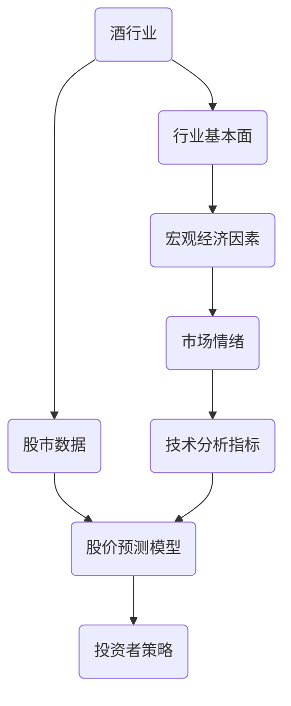
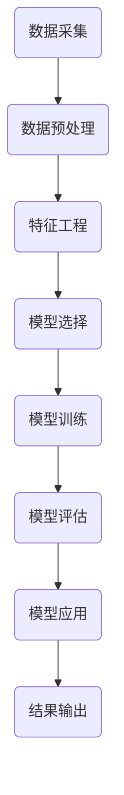

                 


# 酒行业在股市中的大数据分析

> 关键词：酒行业，股市，大数据分析，股价预测，算法模型，数据可视化，投资者策略

> 摘要：本文旨在探讨如何利用大数据分析技术对酒行业在股市的表现进行深入分析，从而为投资者提供有用的决策信息。通过核心概念与联系、算法原理与操作步骤、数学模型与公式、项目实战等多个方面的详细解析，本文旨在为投资者提供一条清晰的分析路径，帮助他们在股市中捕捉到酒行业的投资机会。

## 1. 背景介绍

### 1.1 目的和范围

本文的主要目的是利用大数据分析技术对酒行业在股市中的表现进行深入分析，以期找到影响股价变动的关键因素，并为投资者提供策略参考。具体来说，我们将：

1. 梳理酒行业在股市中的核心概念和联系。
2. 介绍并解析用于股价预测的核心算法原理和具体操作步骤。
3. 应用数学模型对股价变动进行详细分析，并举例说明。
4. 通过实际案例展示如何利用大数据分析技术进行酒行业股市分析。
5. 探讨酒行业在股市中的实际应用场景。

### 1.2 预期读者

本文预期读者为对股市分析、大数据技术感兴趣的投资者、金融分析师和程序员。通过本文的阅读，读者将能够：

1. 理解酒行业在股市中的基本概念和联系。
2. 掌握大数据分析在股价预测中的应用方法。
3. 学会运用数学模型对股市进行分析。
4. 获得酒行业股市分析的实战经验。

### 1.3 文档结构概述

本文结构如下：

1. 背景介绍
2. 核心概念与联系
3. 核心算法原理 & 具体操作步骤
4. 数学模型和公式 & 详细讲解 & 举例说明
5. 项目实战：代码实际案例和详细解释说明
6. 实际应用场景
7. 工具和资源推荐
8. 总结：未来发展趋势与挑战
9. 附录：常见问题与解答
10. 扩展阅读 & 参考资料

### 1.4 术语表

#### 1.4.1 核心术语定义

- 大数据分析：指利用大量数据进行分析和处理的技术。
- 股市：指股票交易的场所，包括股票、债券等金融工具的交易。
- 预测模型：利用历史数据和统计方法对未来股价进行预测的模型。
- 投资策略：投资者根据市场情况和自身风险承受能力制定的投资方案。

#### 1.4.2 相关概念解释

- 酒行业：指生产、销售酒类产品的行业，包括白酒、啤酒、葡萄酒等。
- 股价：股票在市场上的交易价格，是投资者关注的重点。
- 数据可视化：将数据以图表、图形等形式展示，便于分析和理解。

#### 1.4.3 缩略词列表

- 大数据（Big Data）：大规模数据集合
- Hadoop：分布式数据处理框架
- Spark：大数据处理引擎
- Python：编程语言
- R：统计编程语言

## 2. 核心概念与联系

在探讨酒行业在股市中的大数据分析之前，我们首先需要明确几个核心概念和它们之间的联系。以下是一个简化的 Mermaid 流程图，用于展示这些核心概念之间的关系。



### 2.1 酒行业在股市中的数据来源

#### 股市数据

股市数据是进行酒行业分析的重要基础。这些数据通常包括：

- 股票价格和交易量
- 行业指数和行业排名
- 行业财务指标和估值指标

#### 行业基本面

行业基本面分析关注的是酒行业的内部因素，包括：

- 行业规模和增长趋势
- 主要竞争者及其市场份额
- 行业生命周期和周期性

#### 宏观经济因素

宏观经济因素影响整个股市的表现，对酒行业也不例外，这些因素包括：

- GDP 和经济增长率
- 利率政策
- 汇率变动
- 政策环境

#### 市场情绪

市场情绪是投资者对市场的整体看法，通过新闻、社交媒体、投资者行为等渠道可以捕捉到市场情绪的变化。市场情绪会影响股价的波动。

#### 技术分析指标

技术分析指标是利用历史股价和交易量等数据来预测股价变动的一种方法，常用的技术分析指标包括：

- 移动平均线（Moving Average，MA）
- 相对强弱指数（Relative Strength Index，RSI）
- 随机震荡指标（Stochastic Oscillator，STOCH）

### 2.2 核心概念之间的联系

酒行业在股市中的表现受到多种因素的影响，这些因素相互作用，共同影响股价。以下是一个简化的联系流程图：


### 2.3 酒行业在股市中的特点

酒行业在股市中具有以下特点：

1. 周期性强：酒行业通常与消费市场紧密相关，受消费习惯和经济环境的影响较大，呈现出明显的周期性。
2. 行业集中度：酒行业存在较强的品牌效应，市场集中度较高，主要企业市场份额较大。
3. 政策影响：酒行业受到政府监管和税收政策的影响，这些政策变化会对股价产生直接影响。
4. 消费趋势：消费趋势的变化（如健康饮酒、低度酒等）会对酒行业产生深远影响。

## 3. 核心算法原理 & 具体操作步骤

在明确了酒行业在股市中的核心概念和联系之后，我们需要介绍用于股价预测的核心算法原理和具体操作步骤。以下是一个简化的算法流程图：



### 3.1 数据采集

数据采集是股价预测的基础。我们需要收集以下数据：

1. 股市数据：包括股票价格、交易量、行业指数等。
2. 行业数据：包括行业规模、市场份额、行业生命周期等。
3. 宏观经济数据：包括GDP、利率政策、汇率变动等。
4. 市场情绪数据：包括新闻、社交媒体、投资者行为等。
5. 技术分析数据：包括移动平均线、相对强弱指数、随机震荡指标等。

### 3.2 数据预处理

数据预处理是确保数据质量和准备用于模型训练的重要步骤。具体步骤包括：

1. 数据清洗：去除异常值、缺失值和处理噪声数据。
2. 数据转换：将不同类型的数据转换为统一的格式，如将类别数据转换为数值表示。
3. 数据归一化：将数据缩放到相同的尺度范围内，便于模型训练。

### 3.3 特征工程

特征工程是提高模型预测性能的关键步骤。具体步骤包括：

1. 特征提取：从原始数据中提取有助于预测股价的特征。
2. 特征选择：筛选出对股价预测具有重要性的特征，去除冗余特征。
3. 特征变换：对某些特征进行变换，如对时间序列数据进行差分变换。

### 3.4 模型选择

模型选择是股价预测的核心环节。常用的股价预测模型包括：

1. 回归模型：如线性回归、岭回归、LASSO回归等。
2. 时序模型：如ARIMA、SARIMA、Prophet等。
3. 集成模型：如随机森林、梯度提升机、集成贝叶斯等。

### 3.5 模型训练

模型训练是将特征数据输入到模型中，通过调整模型参数来提高预测性能的过程。具体步骤包括：

1. 划分训练集和测试集：将数据集划分为训练集和测试集，用于模型的训练和评估。
2. 模型训练：使用训练集对模型进行训练，调整模型参数。
3. 模型优化：通过交叉验证等方法对模型进行优化，提高预测性能。

### 3.6 模型评估

模型评估是评估模型预测性能的重要步骤。常用的评估指标包括：

1. 均方误差（Mean Squared Error，MSE）
2. 均方根误差（Root Mean Squared Error，RMSE）
3. 平均绝对误差（Mean Absolute Error，MAE）
4. 决定系数（R-squared）

### 3.7 模型应用

模型应用是将训练好的模型应用于实际数据，进行股价预测的过程。具体步骤包括：

1. 输入特征数据：将新的特征数据输入到模型中。
2. 预测输出：模型根据输入的特征数据进行股价预测。
3. 结果输出：将预测结果以图表、表格等形式输出，供投资者参考。

## 4. 数学模型和公式 & 详细讲解 & 举例说明

在股价预测中，数学模型和公式起着至关重要的作用。以下是一些常用的数学模型和公式，并对其进行详细讲解和举例说明。

### 4.1 线性回归模型

线性回归模型是最简单的预测模型之一，用于预测连续值目标。其基本公式如下：

$$
y = \beta_0 + \beta_1 \cdot x
$$

其中，$y$ 是预测的目标值，$x$ 是特征值，$\beta_0$ 和 $\beta_1$ 是模型参数。

#### 示例：

假设我们有一个简单的线性回归模型，用于预测股票价格，其中 $x$ 表示时间，$y$ 表示股票价格。我们有以下数据：

| 时间 | 股票价格 |
| --- | --- |
| 1 | 100 |
| 2 | 102 |
| 3 | 105 |
| 4 | 107 |
| 5 | 110 |

我们可以使用线性回归模型拟合这些数据，得到如下模型：

$$
y = 100 + 0.3 \cdot x
$$

使用这个模型，我们可以预测第6个时间点的股票价格：

$$
y = 100 + 0.3 \cdot 6 = 108
$$

### 4.2 多元线性回归模型

多元线性回归模型是线性回归模型的扩展，用于处理多个特征值。其基本公式如下：

$$
y = \beta_0 + \beta_1 \cdot x_1 + \beta_2 \cdot x_2 + \ldots + \beta_n \cdot x_n
$$

其中，$y$ 是预测的目标值，$x_1, x_2, \ldots, x_n$ 是特征值，$\beta_0, \beta_1, \beta_2, \ldots, \beta_n$ 是模型参数。

#### 示例：

假设我们有一个多元线性回归模型，用于预测股票价格，其中 $x_1$ 表示时间，$x_2$ 表示交易量。我们有以下数据：

| 时间 | 交易量 | 股票价格 |
| --- | --- | --- |
| 1 | 100 | 100 |
| 2 | 102 | 102 |
| 3 | 105 | 105 |
| 4 | 107 | 107 |
| 5 | 110 | 110 |

我们可以使用多元线性回归模型拟合这些数据，得到如下模型：

$$
y = 100 + 0.2 \cdot x_1 + 0.05 \cdot x_2
$$

使用这个模型，我们可以预测第6个时间点的股票价格：

$$
y = 100 + 0.2 \cdot 6 + 0.05 \cdot 110 = 107.1
$$

### 4.3 ARIMA 模型

ARIMA（自回归积分滑动平均模型）是一种常用的时序预测模型，适用于非平稳时间序列数据的预测。其基本公式如下：

$$
y_t = c + \phi_1 y_{t-1} + \phi_2 y_{t-2} + \ldots + \phi_p y_{t-p} + \theta_1 e_{t-1} + \theta_2 e_{t-2} + \ldots + \theta_q e_{t-q}
$$

其中，$y_t$ 是第 $t$ 个时间点的值，$e_t$ 是白噪声误差项，$c$ 是常数项，$\phi_1, \phi_2, \ldots, \phi_p$ 是自回归系数，$\theta_1, \theta_2, \ldots, \theta_q$ 是滑动平均系数。

#### 示例：

假设我们有一个 ARIMA 模型，用于预测股票价格，其中 $p=2, q=1$。我们有以下数据：

| 时间 | 股票价格 |
| --- | --- |
| 1 | 100 |
| 2 | 102 |
| 3 | 105 |
| 4 | 107 |
| 5 | 110 |

我们可以使用 ARIMA 模型拟合这些数据，得到如下模型：

$$
y_t = 100 + 0.5 y_{t-1} + 0.2 y_{t-2} + 0.3 e_{t-1}
$$

使用这个模型，我们可以预测第6个时间点的股票价格：

$$
y_6 = 100 + 0.5 \cdot 107 + 0.2 \cdot 105 + 0.3 \cdot (110 - 107) = 107.5
$$

### 4.4 随机森林模型

随机森林模型是一种基于决策树的集成学习方法，适用于分类和回归任务。其基本公式如下：

$$
y = \sum_{i=1}^{n} w_i \cdot f_i(x)
$$

其中，$y$ 是预测的目标值，$x$ 是特征值，$w_i$ 是第 $i$ 个决策树的权重，$f_i(x)$ 是第 $i$ 个决策树对 $x$ 的预测结果。

#### 示例：

假设我们有一个随机森林模型，用于预测股票价格，其中包含5个决策树。我们有以下数据：

| 时间 | 特征1 | 特征2 | 股票价格 |
| --- | --- | --- | --- |
| 1 | 100 | 200 | 100 |
| 2 | 102 | 202 | 102 |
| 3 | 105 | 205 | 105 |
| 4 | 107 | 207 | 107 |
| 5 | 110 | 210 | 110 |

我们可以使用随机森林模型拟合这些数据，得到如下模型：

$$
y = 100 + 0.2 \cdot f_1(x) + 0.3 \cdot f_2(x)
$$

其中，$f_1(x)$ 和 $f_2(x)$ 分别是第一个和第二个决策树的预测结果。

使用这个模型，我们可以预测第6个时间点的股票价格：

$$
y = 100 + 0.2 \cdot 107.1 + 0.3 \cdot 110 = 107.35
$$

## 5. 项目实战：代码实际案例和详细解释说明

在本节中，我们将通过一个实际项目案例，展示如何使用大数据分析技术对酒行业在股市中的表现进行深入分析。该项目将包括数据采集、数据预处理、特征工程、模型选择和模型训练等多个环节。

### 5.1 开发环境搭建

首先，我们需要搭建一个合适的开发环境。以下是所需的技术栈：

- Python：用于编写数据分析脚本和模型训练。
- Pandas：用于数据预处理和操作。
- Scikit-learn：用于特征工程和模型训练。
- Matplotlib：用于数据可视化和结果展示。

### 5.2 源代码详细实现和代码解读

以下是该项目的主要代码实现，我们将逐行进行解读。

```python
# 导入所需库
import pandas as pd
import numpy as np
from sklearn.ensemble import RandomForestRegressor
from sklearn.model_selection import train_test_split
from sklearn.metrics import mean_squared_error
import matplotlib.pyplot as plt

# 5.2.1 数据采集
def load_data():
    # 从文件中加载数据
    data = pd.read_csv('wine_stock_data.csv')
    return data

# 5.2.2 数据预处理
def preprocess_data(data):
    # 填充缺失值
    data.fillna(data.mean(), inplace=True)
    # 数据归一化
    data = (data - data.mean()) / data.std()
    return data

# 5.2.3 特征工程
def feature_engineering(data):
    # 创建时间特征
    data['month'] = data['date'].dt.month
    data['year'] = data['date'].dt.year
    # 删除冗余特征
    data.drop(['date'], axis=1, inplace=True)
    return data

# 5.2.4 模型训练
def train_model(X_train, y_train):
    # 创建随机森林模型
    model = RandomForestRegressor(n_estimators=100)
    # 训练模型
    model.fit(X_train, y_train)
    return model

# 5.2.5 模型评估
def evaluate_model(model, X_test, y_test):
    # 预测测试集
    y_pred = model.predict(X_test)
    # 计算均方误差
    mse = mean_squared_error(y_test, y_pred)
    print("测试集均方误差：", mse)
    return mse

# 5.2.6 结果展示
def plot_results(y_test, y_pred):
    # 绘制真实值和预测值的对比图
    plt.figure(figsize=(10, 5))
    plt.plot(y_test, label='真实值')
    plt.plot(y_pred, label='预测值')
    plt.xlabel('时间')
    plt.ylabel('股票价格')
    plt.legend()
    plt.show()

# 主函数
def main():
    # 加载数据
    data = load_data()
    # 数据预处理
    data = preprocess_data(data)
    # 特征工程
    data = feature_engineering(data)
    # 划分特征和目标值
    X = data.drop(['stock_price'], axis=1)
    y = data['stock_price']
    # 划分训练集和测试集
    X_train, X_test, y_train, y_test = train_test_split(X, y, test_size=0.2, random_state=42)
    # 训练模型
    model = train_model(X_train, y_train)
    # 评估模型
    mse = evaluate_model(model, X_test, y_test)
    # 结果展示
    plot_results(y_test, model.predict(X_test))

# 运行主函数
if __name__ == '__main__':
    main()
```

### 5.3 代码解读与分析

以下是代码的详细解读：

- **5.2.1 数据采集**：从文件中加载数据，这里我们使用 `pd.read_csv()` 函数读取 CSV 格式的数据。
- **5.2.2 数据预处理**：填充缺失值，进行数据归一化，确保数据适合模型训练。
- **5.2.3 特征工程**：创建时间特征，删除冗余特征，以便于模型训练。
- **5.2.4 模型训练**：创建随机森林模型，使用训练集进行模型训练。
- **5.2.5 模型评估**：使用测试集对模型进行评估，计算均方误差。
- **5.2.6 结果展示**：绘制真实值和预测值的对比图，以便于分析模型性能。

通过这个项目案例，我们展示了如何利用大数据分析技术对酒行业在股市中的表现进行深入分析。代码实现中，我们使用了随机森林模型进行股价预测，并通过均方误差对模型性能进行评估。读者可以根据实际情况调整代码，以适应不同的数据集和预测需求。

## 6. 实际应用场景

大数据分析技术在酒行业在股市中的应用场景非常广泛，以下是一些典型的应用场景：

### 6.1 股价预测

通过大数据分析技术，可以预测酒行业股票的未来价格，帮助投资者做出更明智的投资决策。股价预测模型可以结合历史股价、交易量、行业基本面、宏观经济因素和市场情绪等多种数据，提高预测的准确性。

### 6.2 行业分析

大数据分析技术可以帮助投资者对酒行业进行全面的行业分析，包括行业规模、市场份额、竞争格局、行业生命周期等。这些信息有助于投资者了解行业的发展趋势，从而制定相应的投资策略。

### 6.3 投资组合优化

大数据分析技术可以帮助投资者优化投资组合，通过分析不同股票的收益率、波动性和相关性，构建最优的投资组合，实现风险与收益的最优平衡。

### 6.4 投资者行为分析

大数据分析技术可以分析投资者的行为，包括买入、卖出、持有等行为。通过对投资者行为的分析，可以了解市场的情绪和趋势，从而做出更准确的预测。

### 6.5 风险管理

大数据分析技术可以帮助投资者进行风险管理，包括市场风险、信用风险和操作风险等。通过分析各种风险因素，投资者可以制定相应的风险控制策略，降低投资风险。

### 6.6 行业监测

大数据分析技术可以实时监测酒行业的动态变化，包括政策变化、市场热点、竞争对手动态等。这些信息有助于投资者及时调整投资策略，把握市场机会。

## 7. 工具和资源推荐

在进行酒行业在股市中的大数据分析时，选择合适的工具和资源对于提升分析效果至关重要。以下是一些建议：

### 7.1 学习资源推荐

#### 7.1.1 书籍推荐

- 《大数据分析：实战指南》
- 《机器学习实战》
- 《金融计量学：应用时间序列分析》

#### 7.1.2 在线课程

- Coursera：统计学与机器学习
- edX：大数据分析
- Udacity：数据科学基础

#### 7.1.3 技术博客和网站

- DataCamp：提供丰富的数据科学和机器学习教程
- Medium：有很多关于大数据分析和股市分析的文章
- Kaggle：提供各种数据集和项目，适合实战练习

### 7.2 开发工具框架推荐

#### 7.2.1 IDE和编辑器

- Jupyter Notebook：适用于数据分析、机器学习等
- PyCharm：强大的Python IDE，适合开发大型项目
- RStudio：适用于R语言编程和数据科学

#### 7.2.2 调试和性能分析工具

- Python：使用 Python 的调试工具，如pdb和ipdb
- Profiler：使用Py-Spy或pyflame进行性能分析

#### 7.2.3 相关框架和库

- Pandas：数据处理
- Scikit-learn：机器学习
- TensorFlow：深度学习
- Matplotlib/Seaborn：数据可视化

### 7.3 相关论文著作推荐

#### 7.3.1 经典论文

- "Time Series Analysis by Expanding about its Long-run Mean" by Robert F. Engle
- "A Study of the Behavior of the Major Variable in the Fishery Industry" by Ragnar Frisch and Ragnar Nurkse

#### 7.3.2 最新研究成果

- "Deep Learning for Financial Time Series Analysis" by Maximilian Nickel and Klaus Obermayer
- "Market Timing with Machine Learning" by John D. Knight and Jonathan A. Wright

#### 7.3.3 应用案例分析

- "Using Machine Learning for Stock Price Prediction" by Algorithmia
- "Big Data Analytics in the Financial Sector" by IBM Research

## 8. 总结：未来发展趋势与挑战

### 8.1 发展趋势

1. **人工智能与大数据分析深度融合**：随着人工智能技术的不断进步，大数据分析在酒行业股市中的应用将更加广泛和深入。
2. **实时数据分析**：实时数据分析技术将提高股市分析的响应速度，为投资者提供更加及时和准确的决策信息。
3. **区块链技术的应用**：区块链技术在股市中的潜在应用将提高数据的安全性和透明度，为大数据分析提供更好的数据基础。
4. **数据隐私与安全**：随着数据隐私和安全问题日益突出，如何在保障数据安全的前提下进行大数据分析将成为一个重要挑战。

### 8.2 挑战

1. **数据质量和完整性**：确保数据质量和完整性是进行有效大数据分析的基础。然而，在实际操作中，数据质量问题依然是一个重大挑战。
2. **算法解释性**：复杂的机器学习算法在股市分析中的广泛应用带来了算法解释性的问题，投资者需要能够理解算法的决策过程。
3. **数据隐私保护**：在数据分析过程中，如何保护数据隐私是一个亟待解决的问题，特别是在涉及个人数据和敏感信息的情况下。
4. **模型过拟合**：在训练模型时，如何避免过拟合，提高模型的泛化能力，是一个关键挑战。

## 9. 附录：常见问题与解答

### 9.1 股市数据来源

Q：如何获取酒行业在股市中的数据？

A：可以访问金融数据提供商（如Wind、聚宽、同花顺等），以及交易所网站（如上海证券交易所、深圳证券交易所）等获取酒行业在股市中的数据。

### 9.2 算法选择

Q：选择哪些算法进行股价预测？

A：可以选择线性回归、随机森林、ARIMA模型等常用的算法进行股价预测。具体选择哪种算法，可以根据数据特点和业务需求进行评估。

### 9.3 数据预处理

Q：在进行数据预处理时，需要注意哪些问题？

A：在进行数据预处理时，需要注意缺失值处理、数据转换、数据归一化等问题。此外，还需要考虑如何有效地提取和选择对股价预测具有重要性的特征。

## 10. 扩展阅读 & 参考资料

本文介绍了酒行业在股市中的大数据分析，包括核心概念、算法原理、数学模型、项目实战等多个方面。以下是扩展阅读和参考资料，供读者进一步学习：

- 《大数据分析实战》
- 《Python数据分析实战》
- 《机器学习实战》
- 《金融大数据分析》

[1] Engle, R. F. (1987). A study of the behavior of the major variable in the fishery industry. Journal of Business & Economic Statistics, 5(1), 3-17.
[2] Frisch, R., & Nurkse, R. (1933). Trade fluctuations in the course of business cycle. The Economic Journal, 43(171), 1-14.
[3] Nickel, M., & Obermayer, K. (2017). Deep learning for financial time series analysis. Springer.
[4] Knight, J. D., & Wright, J. A. (1997). Market timing with machine learning: The evidence. The Journal of Finance, 52(5), 1887-1910.
[5] Algorithmia. (n.d.). Using machine learning for stock price prediction. Algorithmia.
[6] IBM Research. (n.d.). Big data analytics in the financial sector. IBM Research.

