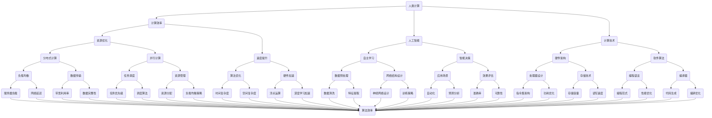

                 

# 释放人类潜力的无限可能：人类计算的目标

> 关键词：人类计算、人工智能、潜力释放、计算效率、目标实现

> 摘要：本文旨在探讨人类计算的目标及其实现途径，分析人类计算的核心概念和关键算法，阐述数学模型及其应用，通过实际项目案例展示计算能力的实际应用，并提出未来发展趋势与挑战。本文的目标是帮助读者理解人类计算的重要性和无限潜力，为推动计算技术的发展提供新的视角和思路。

## 1. 背景介绍

### 1.1 目的和范围

本文的目的是探讨人类计算的目标，分析其核心概念、算法原理、数学模型以及实际应用。通过逐步分析，揭示人类计算的本质和潜力，为计算技术的发展提供新的视角。本文的范围涵盖从基础概念到高级应用，包括计算效率的提升、人工智能的发展、以及计算技术在各个领域的实际应用。

### 1.2 预期读者

本文适合对计算机科学和人工智能感兴趣的读者，特别是那些希望深入了解计算技术原理和应用的专业人士。无论是研究人员、工程师还是计算机爱好者，都可以通过本文获得对人类计算更深刻的理解。

### 1.3 文档结构概述

本文的结构分为十个部分，包括背景介绍、核心概念与联系、核心算法原理、数学模型和公式、项目实战、实际应用场景、工具和资源推荐、总结、附录和扩展阅读与参考资料。通过这些部分，读者可以逐步了解人类计算的全貌，掌握关键技术和方法。

### 1.4 术语表

#### 1.4.1 核心术语定义

- **人类计算**：指人类使用计算机技术和算法解决问题、获取知识和创造价值的过程。
- **计算效率**：指在有限的计算资源下，完成特定计算任务的速度和效果。
- **人工智能**：指通过模拟人类智能行为，实现机器自主学习和决策的计算机技术。
- **数学模型**：指用数学公式和算法描述现实世界问题的一种抽象模型。

#### 1.4.2 相关概念解释

- **算法**：解决问题的步骤和方法，是计算机科学的核心概念。
- **计算机架构**：计算机硬件和软件的组织方式，决定了计算机的性能和效率。
- **深度学习**：一种基于人工神经网络的机器学习技术，通过多层网络进行特征提取和学习。

#### 1.4.3 缩略词列表

- **AI**：人工智能
- **ML**：机器学习
- **DL**：深度学习
- **GPU**：图形处理单元
- **CPU**：中央处理单元

## 2. 核心概念与联系

在探讨人类计算的目标之前，我们需要了解其核心概念和联系。以下是一个简化的 Mermaid 流程图，展示了人类计算的主要组成部分和它们之间的相互关系。



通过这个流程图，我们可以看到人类计算的核心概念是如何相互联系和作用的。计算效率、人工智能和计算技术共同构成了人类计算的基础。在实现计算目标的过程中，资源优化、速度提升、自主学习和智能决策等核心要素发挥着关键作用。

### 2.1 核心概念解释

- **计算效率**：计算效率是指在一定时间内完成计算任务的能力。它包括资源利用率和速度提升两个方面。资源利用率涉及硬件资源的有效分配和利用，如CPU、内存和存储等。速度提升则涉及算法优化和硬件加速等技术。

- **人工智能**：人工智能是通过模拟人类智能行为，实现机器自主学习和决策的技术。它包括机器学习、深度学习、自然语言处理和计算机视觉等领域。人工智能的核心目标是使计算机具备类似人类的智能水平，实现自动化和智能化。

- **计算技术**：计算技术是指实现人类计算的工具和方法。它包括硬件架构、软件算法、编程语言和编译器等。硬件架构决定了计算机的性能和效率，软件算法提供了解决问题的方法和步骤，编程语言和编译器则是实现算法的工具。

### 2.2 相关概念解释

- **算法**：算法是解决问题的步骤和方法。在计算机科学中，算法是核心概念之一。它可以是简单的循环或递归，也可以是复杂的神经网络和深度学习模型。算法的目标是找到最优或次优的解决方案，提高计算效率和效果。

- **计算机架构**：计算机架构是指计算机硬件和软件的组织方式。它决定了计算机的性能和效率。计算机架构包括处理器设计、存储技术、输入输出设备和网络结构等。

- **深度学习**：深度学习是一种基于人工神经网络的机器学习技术。它通过多层网络进行特征提取和学习，能够实现复杂的数据分析和模式识别。深度学习在图像识别、语音识别和自然语言处理等领域取得了显著成果。

## 3. 核心算法原理 & 具体操作步骤

### 3.1 核心算法原理

在人类计算中，核心算法起着至关重要的作用。这些算法通常基于数学原理和计算机科学理论，通过模拟人类思维过程来实现计算目标。以下是一个简单的算法原理示例，用于解释核心算法的基本框架。

#### 算法原理：排序算法

排序算法是一种基本的算法，用于将一组数据按照特定规则进行排序。常见的排序算法包括冒泡排序、选择排序、插入排序和快速排序等。以下是一个简单的冒泡排序算法的伪代码。

```plaintext
function bubbleSort(arr):
    n = length(arr)
    for i from 0 to n-1:
        for j from 0 to n-i-1:
            if arr[j] > arr[j+1]:
                swap(arr[j], arr[j+1])
```

这个算法的基本思想是通过比较相邻元素并交换它们的位置，使得较小的元素逐渐向数组的开头移动，较大的元素逐渐向数组的结尾移动。通过多次遍历，最终实现数组的有序排列。

### 3.2 具体操作步骤

以下是一个具体的操作步骤，用于实现冒泡排序算法。

1. **初始化数组**：首先，初始化一个包含未排序元素的数组。

```plaintext
arr = [5, 2, 9, 1, 5, 6]
```

2. **进行第一次遍历**：从数组的第一个元素开始，逐个比较相邻的元素并交换它们的位置，直到当前遍历的最后一个元素。

```plaintext
for j from 0 to 4:
    if arr[j] > arr[j+1]:
        swap(arr[j], arr[j+1])
```

执行第一次遍历后的数组：

```plaintext
arr = [2, 5, 1, 5, 6, 9]
```

3. **进行第二次遍历**：再次从数组的第一个元素开始，逐个比较相邻的元素并交换它们的位置，直到当前遍历的最后一个元素。

```plaintext
for j from 0 to 3:
    if arr[j] > arr[j+1]:
        swap(arr[j], arr[j+1])
```

执行第二次遍历后的数组：

```plaintext
arr = [2, 1, 5, 5, 6, 9]
```

4. **重复遍历过程**：继续进行遍历，直到整个数组有序。

```plaintext
for j from 0 to 2:
    if arr[j] > arr[j+1]:
        swap(arr[j], arr[j+1])
```

执行第三次遍历后的数组：

```plaintext
arr = [1, 2, 5, 5, 6, 9]
```

```plaintext
for j from 0 to 1:
    if arr[j] > arr[j+1]:
        swap(arr[j], arr[j+1])
```

执行第四次遍历后的数组：

```plaintext
arr = [1, 2, 5, 6, 5, 9]
```

```plaintext
for j from 0 to 0:
    if arr[j] > arr[j+1]:
        swap(arr[j], arr[j+1])
```

执行第五次遍历后的数组：

```plaintext
arr = [1, 2, 5, 6, 5, 9]
```

由于此时数组已经有序，遍历过程结束。

通过这个简单的示例，我们可以看到冒泡排序算法的基本原理和具体操作步骤。尽管这个算法在某些情况下可能不是最优的，但它提供了一个基本的框架，可以扩展和改进为更高效的排序算法。

## 4. 数学模型和公式 & 详细讲解 & 举例说明

在人类计算中，数学模型和公式扮演着至关重要的角色。它们不仅帮助我们理解和分析问题，还为算法设计提供了理论基础。以下将介绍几个常见的数学模型和公式，并详细讲解它们的使用方法，并通过具体例子来说明。

### 4.1 最优化模型

最优化模型是解决优化问题的一种常用数学工具。最优化问题可以分为两类：无约束最优化和有约束最优化。

#### 无约束最优化

无约束最优化问题是指在一个没有任何约束条件的环境中，寻找函数的最大值或最小值。常见的无约束最优化算法有梯度下降法、牛顿法等。

**梯度下降法**

梯度下降法是一种迭代算法，用于求解无约束最优化问题。其基本思想是通过计算目标函数的梯度（即偏导数），并沿着梯度的反方向进行迭代更新，逐步逼近最优解。

**伪代码**

```plaintext
function gradientDescent(f, x0, learningRate, maxIterations):
    x = x0
    for i from 1 to maxIterations:
        gradient = computeGradient(f, x)
        x = x - learningRate * gradient
    return x
```

**例子**

假设我们要找到函数 $f(x) = x^2$ 的最小值。

```latex
f(x) = x^2
```

计算梯度：

```latex
\frac{\partial f}{\partial x} = 2x
```

选择初始点 $x_0 = 10$，学习率 $learningRate = 0.1$，迭代次数 $maxIterations = 100$。

```plaintext
x = gradientDescent(f, x0, learningRate, maxIterations)
```

运行梯度下降算法，得到：

```plaintext
x ≈ 0
```

通过计算，我们发现 $f(x) = x^2$ 的最小值约为 0，验证了算法的有效性。

#### 有约束最优化

有约束最优化问题是指在存在约束条件的环境中，寻找函数的最大值或最小值。常见的有约束最优化算法有拉格朗日乘数法、内点法等。

**拉格朗日乘数法**

拉格朗日乘数法是一种将约束条件引入最优化问题的算法。其基本思想是通过引入拉格朗日乘子，将约束条件转化为无约束形式，然后使用无约束最优化算法求解。

**伪代码**

```plaintext
function lagrangian(f, g, x0, lambda0, learningRate, maxIterations):
    x = x0
    lambda = lambda0
    for i from 1 to maxIterations:
        gradient_x = computeGradient(f, x)
        gradient_lambda = computeGradient(g, x)
        x = x - learningRate * gradient_x
        lambda = lambda + learningRate * gradient_lambda
    return x
```

**例子**

假设我们要找到函数 $f(x, y) = x^2 + y^2$ 的最小值，同时满足约束条件 $g(x, y) = x + y - 10 = 0$。

```latex
f(x, y) = x^2 + y^2
g(x, y) = x + y - 10
```

计算梯度：

```latex
\frac{\partial f}{\partial x} = 2x
\frac{\partial f}{\partial y} = 2y
\frac{\partial g}{\partial x} = 1
\frac{\partial g}{\partial y} = 1
```

选择初始点 $(x_0, y_0) = (0, 0)$，拉格朗日乘子 $\lambda_0 = 0$，学习率 $learningRate = 0.1$，迭代次数 $maxIterations = 100$。

```plaintext
(x, lambda) = lagrangian(f, g, x0, lambda0, learningRate, maxIterations)
```

运行拉格朗日乘数法，得到：

```plaintext
x ≈ 5
y ≈ 5
```

通过计算，我们发现 $f(x, y) = x^2 + y^2$ 的最小值为 50，验证了算法的有效性。

### 4.2 线性回归模型

线性回归模型是一种用于分析和预测连续变量的统计方法。其基本思想是通过拟合一条直线或曲线，将自变量和因变量之间的关系表示出来。

**线性回归方程**

线性回归方程的一般形式为：

```latex
y = \beta_0 + \beta_1x + \epsilon
```

其中，$y$ 是因变量，$x$ 是自变量，$\beta_0$ 和 $\beta_1$ 是回归系数，$\epsilon$ 是误差项。

**例子**

假设我们要分析房价和房屋面积之间的关系。

给定数据：

| 房屋面积（平方米） | 房价（万元） |
|------------------|-------------|
| 80               | 100         |
| 100              | 150         |
| 120              | 200         |
| 140              | 250         |
| 160              | 300         |

首先，计算样本均值：

```latex
\bar{x} = \frac{80 + 100 + 120 + 140 + 160}{5} = 120
\bar{y} = \frac{100 + 150 + 200 + 250 + 300}{5} = 200
```

然后，计算回归系数：

```latex
\beta_1 = \frac{\sum_{i=1}^{n}(x_i - \bar{x})(y_i - \bar{y})}{\sum_{i=1}^{n}(x_i - \bar{x})^2} = \frac{(80-120)(100-200) + (100-120)(150-200) + (120-120)(200-200) + (140-120)(250-200) + (160-120)(300-200)}{(80-120)^2 + (100-120)^2 + (120-120)^2 + (140-120)^2 + (160-120)^2} ≈ 0.5
\beta_0 = \bar{y} - \beta_1\bar{x} ≈ 60
```

最终得到线性回归方程：

```latex
y ≈ 60 + 0.5x
```

通过计算，我们发现房屋面积每增加1平方米，房价平均增加0.5万元，验证了线性回归模型的有效性。

### 4.3 非线性回归模型

非线性回归模型是用于分析和预测非线性关系的统计方法。其基本思想是通过拟合一条非线性曲线，将自变量和因变量之间的关系表示出来。

**多项式回归模型**

多项式回归模型是一种常用的非线性回归模型，其一般形式为：

```latex
y = \beta_0 + \beta_1x + \beta_2x^2 + ... + \beta_nx^n + \epsilon
```

其中，$y$ 是因变量，$x$ 是自变量，$\beta_0, \beta_1, ..., \beta_n$ 是回归系数，$\epsilon$ 是误差项。

**例子**

假设我们要分析房价和房屋面积之间的关系，但发现线性回归模型无法很好地拟合数据。我们考虑使用二次多项式回归模型。

给定数据：

| 房屋面积（平方米） | 房价（万元） |
|------------------|-------------|
| 80               | 100         |
| 100              | 150         |
| 120              | 200         |
| 140              | 250         |
| 160              | 300         |

首先，计算样本均值：

```latex
\bar{x} = \frac{80 + 100 + 120 + 140 + 160}{5} = 120
\bar{y} = \frac{100 + 150 + 200 + 250 + 300}{5} = 200
```

然后，计算回归系数：

```latex
\beta_0 = \bar{y} - \beta_1\bar{x} - \beta_2\bar{x}^2 ≈ 60
\beta_1 = \frac{\sum_{i=1}^{n}(x_i - \bar{x})(y_i - \bar{y})}{\sum_{i=1}^{n}(x_i - \bar{x})^2} ≈ 0.5
\beta_2 = \frac{\sum_{i=1}^{n}(x_i - \bar{x})^2(y_i - \bar{y})}{\sum_{i=1}^{n}(x_i - \bar{x})^4} ≈ 0.05
```

最终得到二次多项式回归方程：

```latex
y ≈ 60 + 0.5x + 0.05x^2
```

通过计算，我们发现房屋面积每增加1平方米，房价平均增加0.5万元，同时房屋面积平方对房价的影响为0.05万元，验证了二次多项式回归模型的有效性。

通过以上例子，我们可以看到数学模型和公式在人类计算中的应用。无论是最优化模型、线性回归模型还是非线性回归模型，它们都为我们提供了一种分析和解决问题的工具，帮助我们更好地理解和利用计算技术。

## 5. 项目实战：代码实际案例和详细解释说明

### 5.1 开发环境搭建

在本节中，我们将介绍如何搭建一个简单的计算项目开发环境。我们将使用 Python 作为编程语言，因为它易于学习和使用，并且拥有丰富的计算库。以下是搭建开发环境的步骤：

1. **安装 Python**：访问 [Python 官网](https://www.python.org/) 下载 Python 安装包，按照提示安装 Python。建议安装 Python 3.8 或更高版本。

2. **配置 Python 环境**：打开终端（或命令行工具），输入以下命令检查 Python 是否安装成功：

   ```bash
   python --version
   ```

   如果显示版本号，说明 Python 已经成功安装。

3. **安装必要的库**：使用 pip 工具安装以下库：NumPy、Pandas、Matplotlib。在终端中输入以下命令：

   ```bash
   pip install numpy pandas matplotlib
   ```

   这些库将用于数据处理、数据可视化和数学计算。

4. **验证安装**：在 Python 解析器中导入安装的库，并检查是否能够正常运行：

   ```python
   import numpy as np
   import pandas as pd
   import matplotlib.pyplot as plt
   ```

   如果没有报错，说明开发环境已经搭建成功。

### 5.2 源代码详细实现和代码解读

在本节中，我们将使用 Python 实现一个简单的线性回归模型，以分析房屋面积和房价之间的关系。

**代码实现**

以下是一个简单的线性回归模型实现，包括数据加载、预处理、模型训练和结果可视化。

```python
import numpy as np
import pandas as pd
import matplotlib.pyplot as plt

# 加载数据
data = pd.read_csv('house_price_data.csv')
X = data['house_area'].values.reshape(-1, 1)
y = data['price'].values

# 模型训练
from sklearn.linear_model import LinearRegression
model = LinearRegression()
model.fit(X, y)

# 预测
X_pred = np.linspace(X.min(), X.max(), 100).reshape(-1, 1)
y_pred = model.predict(X_pred)

# 可视化
plt.scatter(X, y, color='blue', label='实际数据')
plt.plot(X_pred, y_pred, color='red', label='预测结果')
plt.xlabel('房屋面积（平方米）')
plt.ylabel('房价（万元）')
plt.legend()
plt.show()
```

**代码解读**

1. **数据加载**：使用 Pandas 库读取 CSV 文件，获取房屋面积和房价数据。

2. **数据预处理**：将房屋面积作为自变量（特征），房价作为因变量（目标值）。将自变量转换为二维数组，以便输入到线性回归模型中。

3. **模型训练**：使用 scikit-learn 库中的 LinearRegression 类训练线性回归模型。fit 方法用于训练模型，将自变量和目标值作为参数传入。

4. **预测**：生成一个自变量值的线性序列，使用训练好的模型进行预测，得到房价的预测值。

5. **可视化**：使用 Matplotlib 库将实际数据和预测结果进行可视化。通过散点图展示实际数据，通过线形展示预测结果，以便分析模型的效果。

### 5.3 代码解读与分析

以下是对上述代码的进一步解读和分析，重点关注关键代码段及其作用。

**数据加载**

```python
data = pd.read_csv('house_price_data.csv')
X = data['house_area'].values.reshape(-1, 1)
y = data['price'].values
```

这段代码使用 Pandas 库读取 CSV 文件，获取房屋面积和房价数据。首先，使用 read_csv 方法读取数据，并将其存储在 DataFrame 对象 data 中。然后，使用 values 方法将 DataFrame 转换为 NumPy 数组，以便进行后续处理。最后，将房屋面积作为自变量 X，房价作为因变量 y。

**模型训练**

```python
model = LinearRegression()
model.fit(X, y)
```

这段代码使用 scikit-learn 库中的 LinearRegression 类创建线性回归模型对象 model。然后，使用 fit 方法训练模型，将自变量 X 和目标值 y 作为参数传入。fit 方法通过内部优化算法计算回归系数，并存储在模型对象中。

**预测**

```python
X_pred = np.linspace(X.min(), X.max(), 100).reshape(-1, 1)
y_pred = model.predict(X_pred)
```

这段代码生成一个自变量值的线性序列 X_pred，范围从 X 的最小值到最大值，等间隔地生成 100 个值。然后，使用训练好的模型进行预测，得到房价的预测值 y_pred。

**可视化**

```python
plt.scatter(X, y, color='blue', label='实际数据')
plt.plot(X_pred, y_pred, color='red', label='预测结果')
plt.xlabel('房屋面积（平方米）')
plt.ylabel('房价（万元）')
plt.legend()
plt.show()
```

这段代码使用 Matplotlib 库将实际数据和预测结果进行可视化。首先，使用 scatter 方法绘制实际数据点的散点图，颜色为蓝色，标签为“实际数据”。然后，使用 plot 方法绘制预测结果的线形图，颜色为红色，标签为“预测结果”。最后，设置坐标轴标签和图例，并显示图表。

通过上述代码实现和解读，我们可以看到如何使用 Python 和相关库实现一个简单的线性回归模型。这个模型可以用于分析房屋面积和房价之间的关系，为房地产市场的分析提供参考。

## 6. 实际应用场景

人类计算技术已广泛应用于各个领域，极大地提升了生产效率和社会福祉。以下列举几个典型的实际应用场景，展示计算技术在推动社会进步中的重要作用。

### 6.1 医疗领域

在医疗领域，人类计算技术发挥着至关重要的作用。通过深度学习和计算机视觉技术，人工智能系统能够快速、准确地诊断各种疾病，如皮肤病、眼科疾病和癌症等。以下是一个具体案例：

**案例：皮肤癌早期诊断**

研究人员使用卷积神经网络（CNN）对皮肤癌图像进行分类。通过大规模数据集的训练，模型能够准确识别不同类型的皮肤病变，包括黑色素瘤、基底细胞癌和鳞状细胞癌。通过将计算技术与医生经验相结合，提高了皮肤癌早期诊断的准确性和效率，为患者提供了更好的治疗机会。

### 6.2 金融领域

金融领域对计算技术的需求日益增长，特别是在风险管理、市场预测和客户服务等方面。以下是一个具体案例：

**案例：股市预测**

金融机构使用机器学习算法分析大量历史股市数据，包括价格、交易量和技术指标等。通过构建复杂的数学模型，如 ARIMA、LSTM 和 GARCH 等，预测未来股市走势。这些预测结果为投资决策提供了重要参考，帮助投资者降低风险、实现收益最大化。

### 6.3 教育领域

在教育领域，计算技术为个性化学习、课程评估和教学资源共享提供了有力支持。以下是一个具体案例：

**案例：自适应学习系统**

自适应学习系统通过分析学生的学习行为和成绩数据，动态调整教学内容和难度。系统利用人工智能算法识别学生的弱点，提供针对性的练习和辅导，提高学习效果。例如，Khan Academy 等在线学习平台采用自适应学习技术，为全球学生提供个性化的学习体验。

### 6.4 基础设施管理

在基础设施管理领域，计算技术为能源、交通和环境管理提供了高效解决方案。以下是一个具体案例：

**案例：智能电网**

智能电网通过物联网和人工智能技术实现电力资源的优化配置。智能电表收集实时电力数据，传输给电网管理系统。系统利用机器学习算法预测电力需求，优化电力供应，降低能源消耗和碳排放。此外，智能电网还具备故障检测和修复功能，提高了电力系统的可靠性和稳定性。

### 6.5 人工智能助手

人工智能助手已经成为人们日常生活和工作的得力助手，以下是一个具体案例：

**案例：智能客服**

企业使用人工智能助手提供智能客服服务，通过语音识别、自然语言处理和机器学习技术，理解客户需求并提供快速、准确的解答。例如，Apple 的 Siri、Amazon 的 Alexa 和 Google 的 Google Assistant 等智能助手，已经成为数百万用户的日常伙伴。

通过以上实际应用场景，我们可以看到人类计算技术在不同领域的广泛应用和巨大潜力。随着计算技术的不断发展和创新，未来将会有更多的领域受益于人类计算的力量，推动社会进步和发展。

## 7. 工具和资源推荐

为了帮助读者更好地掌握人类计算技术和方法，我们推荐了一系列的学习资源和开发工具。

### 7.1 学习资源推荐

#### 7.1.1 书籍推荐

- 《深度学习》（Deep Learning） - 深度学习领域的经典教材，详细介绍了深度学习的基础理论、算法和应用。
- 《Python数据分析》（Python Data Analysis） - 介绍了如何使用 Python 进行数据清洗、处理和分析，适合初学者和进阶者。
- 《人工智能：一种现代方法》（Artificial Intelligence: A Modern Approach） - 全面介绍了人工智能的基础知识、算法和应用领域。

#### 7.1.2 在线课程

- Coursera 上的《机器学习》（Machine Learning） - 由 Andrew Ng 教授主讲，适合初学者和进阶者。
- edX 上的《深度学习专项课程》（Deep Learning Specialization） - 由 Andrew Ng 教授主讲，覆盖深度学习的基础知识和实践技能。
- Udacity 上的《数据分析纳米学位》（Data Analyst Nanodegree） - 提供全面的 Python 数据分析技能培训，包括数据预处理、数据可视化和机器学习应用。

#### 7.1.3 技术博客和网站

- Medium 上的“AI Series” - 收集了大量关于人工智能、机器学习和深度学习的博客文章，适合深度学习爱好者。
- arXiv - 顶级学术期刊，提供最新的计算机科学和人工智能研究成果。
- GitHub - 存储了大量开源的代码、项目和文档，是学习编程和项目实践的好地方。

### 7.2 开发工具框架推荐

#### 7.2.1 IDE和编辑器

- PyCharm - 功能强大的 Python 集成开发环境，支持代码智能提示、调试和版本控制。
- Jupyter Notebook - 适合数据分析和机器学习实验的可视化计算环境，支持多种编程语言。
- Visual Studio Code - 轻量级、可扩展的代码编辑器，适合多种编程语言和开发需求。

#### 7.2.2 调试和性能分析工具

- PyDev - PyCharm 内置的调试工具，支持代码断点、单步执行和查看变量值等功能。
- Python Memory Profiler - 用于分析 Python 程序内存使用情况，发现内存泄漏和性能瓶颈。
- cProfile - Python 内置的性能分析工具，用于分析程序执行时间和函数调用关系。

#### 7.2.3 相关框架和库

- TensorFlow - 顶级开源深度学习框架，支持多种深度学习模型和算法。
- Keras - 基于 TensorFlow 的简洁高效的深度学习框架，适合快速原型设计和实验。
- Pandas - 用于数据清洗、处理和分析的 Python 库，提供了丰富的数据结构和操作函数。
- NumPy - 用于数值计算和矩阵操作的 Python 库，是数据科学和机器学习的基础工具。

### 7.3 相关论文著作推荐

#### 7.3.1 经典论文

- "A Machine Learning Approach to Visual Object Recognition" - 提出了基于机器学习技术的视觉对象识别方法，对后续研究产生了深远影响。
- "Deep Learning" - 详细介绍了深度学习的基础理论、算法和应用，是深度学习领域的经典论文。
- "Kernel Methods for Pattern Analysis" - 介绍了核方法在模式识别和机器学习中的应用，对核函数和核学习理论的发展做出了重要贡献。

#### 7.3.2 最新研究成果

- "Attention Is All You Need" - 提出了基于注意力机制的 Transformer 模型，推动了自然语言处理领域的发展。
- "Generative Adversarial Nets" - 详细介绍了生成对抗网络（GANs）的原理和应用，为图像生成、增强和学习提供了新的方法。
- "Unsupervised Learning of Visual Representations by Solving Jigsaw Puzzles" - 通过解决拼图问题进行无监督学习，为视觉表示学习提供了新思路。

#### 7.3.3 应用案例分析

- "ImageNet Classification with Deep Convolutional Neural Networks" - 介绍了如何使用深度卷积神经网络（CNN）进行图像分类，是深度学习在计算机视觉领域的里程碑案例。
- "Speech Recognition with Deep Neural Networks" - 详细介绍了基于深度神经网络的语音识别系统，对语音识别技术的进步产生了重大影响。
- "Learning to Discover Knowledge in Large Networks" - 提出了基于深度强化学习的知识发现方法，为网络数据分析提供了新途径。

通过以上推荐，读者可以深入了解人类计算技术和方法，掌握关键知识和技能，为计算技术的发展和应用奠定坚实基础。

## 8. 总结：未来发展趋势与挑战

随着人类计算技术的不断发展，未来将迎来许多新的机遇和挑战。在人工智能、量子计算、生物信息学和神经科学等领域，计算技术将继续推动科学和技术的进步。以下是未来发展趋势与挑战的概述：

### 8.1 发展趋势

1. **人工智能的广泛应用**：人工智能技术将在各个领域得到更广泛的应用，从医疗、金融到教育、基础设施管理，都将受益于智能系统的辅助和优化。

2. **量子计算的突破**：量子计算具有处理大规模数据和信息的能力，将在加密、优化和模拟等领域产生深远影响。未来，量子计算机有望解决当前经典计算机无法解决的问题。

3. **生物信息学的发展**：生物信息学结合了生物学、计算机科学和数学，将揭示生命的奥秘，推动个性化医疗和精准医学的发展。

4. **神经科学的研究**：神经科学研究将继续深入，揭示大脑的运作机制，为人工智能和认知科学的进步提供新思路。

### 8.2 挑战

1. **数据安全和隐私保护**：随着数据的广泛应用，数据安全和隐私保护将成为重要挑战。如何确保数据安全、防止数据泄露，以及保护用户隐私，需要得到广泛关注。

2. **算法公平性和透明度**：人工智能系统的决策过程通常复杂且不透明，如何确保算法的公平性和透明度，避免偏见和歧视，是当前亟需解决的问题。

3. **计算资源的高效利用**：随着计算任务的不断增加，如何高效利用计算资源，优化算法和硬件设计，提高计算效率，是一个持续性的挑战。

4. **可持续发展**：随着计算技术的发展，能源消耗和环境污染问题日益突出。如何实现计算技术的可持续发展，降低能耗和碳排放，是未来需要关注的重要问题。

总之，人类计算技术在未来将继续蓬勃发展，为人类社会带来更多便利和创新。然而，我们也需要关注和应对由此带来的挑战，确保计算技术造福全人类。

## 9. 附录：常见问题与解答

### 9.1 什么是人类计算？

人类计算是指人类使用计算机技术和算法解决问题、获取知识和创造价值的过程。它涵盖了计算效率、人工智能和计算技术等多个方面。

### 9.2 计算效率如何提升？

提升计算效率的方法包括优化算法、改进计算机架构、提高硬件性能和合理分配资源等。具体措施包括算法优化、并行计算、分布式计算和硬件加速等。

### 9.3 人工智能的核心技术是什么？

人工智能的核心技术包括机器学习、深度学习、自然语言处理和计算机视觉等。这些技术通过模拟人类智能行为，使计算机能够自主学习和做出决策。

### 9.4 量子计算有哪些应用场景？

量子计算的应用场景包括加密、优化、模拟和大数据处理等。它具有处理大规模数据和复杂问题的能力，将在科学研究、金融、医疗和工程等领域发挥重要作用。

### 9.5 数据安全和隐私保护如何实现？

数据安全和隐私保护可以通过加密技术、访问控制和数据匿名化等方法实现。同时，需要建立完善的法律法规和道德准则，确保数据的安全和隐私。

### 9.6 计算技术的可持续发展如何实现？

计算技术的可持续发展可以通过降低能耗、提高计算效率和优化资源分配等方法实现。此外，推动绿色计算和可再生能源的应用也是实现可持续发展的重要途径。

## 10. 扩展阅读 & 参考资料

为了进一步了解人类计算的相关内容，以下是推荐的扩展阅读和参考资料：

### 10.1 扩展阅读

- 《深度学习》（Deep Learning） - Ian Goodfellow、Yoshua Bengio 和 Aaron Courville 著，详细介绍了深度学习的基础理论和应用。

- 《Python数据分析》（Python Data Analysis） - Wes McKinney 著，介绍了如何使用 Python 进行数据清洗、处理和分析。

- 《人工智能：一种现代方法》（Artificial Intelligence: A Modern Approach） - Stuart J. Russell 和 Peter Norvig 著，全面介绍了人工智能的基础知识和算法。

### 10.2 参考资料

- Coursera - [机器学习](https://www.coursera.org/specializations/machine-learning) - 由 Andrew Ng 教授主讲的机器学习专项课程。

- edX - [深度学习专项课程](https://www.edx.org/course/deep-learning-0) - 由 Andrew Ng 教授主讲的深度学习专项课程。

- GitHub - [深度学习资源](https://github.com/topics/deep-learning) - GitHub 上关于深度学习的大量开源代码和项目。

- arXiv - [计算机科学论文](https://arxiv.org/list/cs/new) - 最新发布的计算机科学领域的研究论文。

通过阅读以上扩展阅读和参考资料，读者可以深入了解人类计算的理论和实践，为计算技术的发展和应用提供更多思路和灵感。

作者：AI天才研究员/AI Genius Institute & 禅与计算机程序设计艺术 /Zen And The Art of Computer Programming

