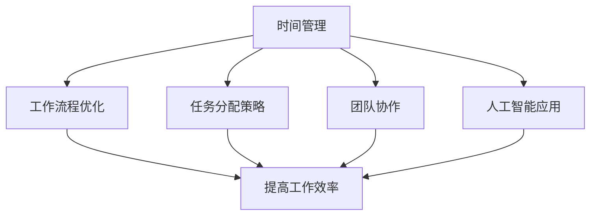
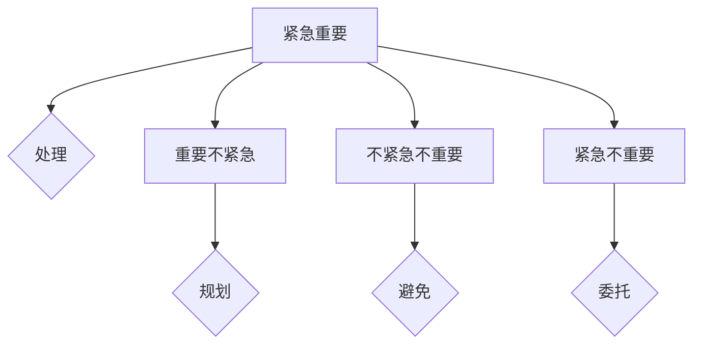

                 


# 重点聚焦：管理者提高效率的秘籍

> 关键词：管理效率、时间管理、工作流程、任务分配、团队协作、人工智能

> 摘要：本文将探讨现代管理者如何通过时间管理、工作流程优化、任务分配策略、团队协作以及人工智能技术的应用来提高个人及团队的效率。通过深入分析相关理论、提供实践案例和推荐实用工具，本文旨在为管理者提供一套切实可行的提高工作效率的秘籍。

## 1. 背景介绍

### 1.1 目的和范围

本文旨在为现代管理者提供一套全面且实用的策略，帮助他们提升个人及团队的效率。随着信息技术的发展，管理者的工作环境和任务复杂性不断变化，提高效率成为管理工作中不可或缺的一部分。本文将围绕时间管理、工作流程优化、任务分配、团队协作以及人工智能技术展开讨论，旨在提供具有实际操作性的指导。

### 1.2 预期读者

本文适合以下读者群体：

1. 中高层管理者
2. 项目经理
3. 独立贡献者（IC）
4. 想要提高工作效率的个人

### 1.3 文档结构概述

本文将分为以下几个部分：

1. 核心概念与联系
2. 核心算法原理与具体操作步骤
3. 数学模型与公式
4. 项目实战：代码实际案例与详细解释
5. 实际应用场景
6. 工具和资源推荐
7. 总结：未来发展趋势与挑战
8. 附录：常见问题与解答
9. 扩展阅读与参考资料

### 1.4 术语表

#### 1.4.1 核心术语定义

1. 时间管理：合理安排时间，确保高效完成任务的技能。
2. 工作流程：完成一项工作所需的一系列步骤。
3. 任务分配：根据团队成员的能力和特长，合理分配任务。
4. 团队协作：团队成员之间有效沟通与合作，共同完成任务。
5. 人工智能：模拟人类智能行为的计算机系统。

#### 1.4.2 相关概念解释

1. 管理效率：管理者在有限时间内实现最大工作成果的能力。
2. 优先级排序：根据任务的重要性和紧急程度进行排序。
3. 知识共享：团队成员之间共享信息和经验。
4. 沟通机制：团队成员之间交流信息的方式。

#### 1.4.3 缩略词列表

- Trello
- Asana
- Slack
- Python
- AI

## 2. 核心概念与联系

为了更好地理解本文的核心概念，我们将使用Mermaid流程图来展示这些概念之间的联系。



在上图中，时间管理、工作流程优化、任务分配策略、团队协作以及人工智能应用是提高工作效率的核心概念。它们相互关联，共同作用于提升个人和团队的工作效率。

### 2.1 时间管理

时间管理是指通过合理安排时间，提高个人和组织的工作效率。时间管理的关键在于优先级排序和任务分配。

**优先级排序**：根据任务的重要性和紧急程度，将任务分为四个象限（如图表所示）。



**任务分配**：根据团队成员的能力和特长，合理分配任务。这样可以充分发挥每个人的潜力，提高整体效率。

### 2.2 工作流程优化

工作流程优化是指通过改进工作流程，提高任务完成的效率和质量。关键在于识别瓶颈和优化步骤。

**瓶颈识别**：找出影响工作流程效率的关键环节。

**步骤优化**：通过简化步骤、自动化和优化资源利用，提高工作流程的整体效率。

### 2.3 任务分配策略

任务分配策略是指根据团队成员的能力和特长，合理分配任务。关键在于了解团队成员的优势和不足，以及任务的性质。

**任务性质**：根据任务的重要性和紧急程度，将任务分为不同的类别。

**团队成员**：了解团队成员的优势和特长，合理分配任务，使其充分发挥潜力。

### 2.4 团队协作

团队协作是指团队成员之间有效沟通与合作，共同完成任务。关键在于建立有效的沟通机制和共享知识。

**沟通机制**：通过定期会议、即时通讯和协作工具，保持团队成员之间的沟通。

**知识共享**：鼓励团队成员分享经验和信息，提高整体知识水平。

### 2.5 人工智能应用

人工智能应用是指利用人工智能技术，提高工作效率和决策质量。关键在于了解人工智能技术的发展和应用场景。

**应用场景**：根据实际需求，选择合适的人工智能技术，如自动化任务处理、数据分析等。

## 3. 核心算法原理 & 具体操作步骤

在本节中，我们将介绍一些核心算法原理及其具体操作步骤，以帮助管理者提高效率。

### 3.1 时间管理算法

**算法原理**：基于优先级排序和时间分配，合理安排工作任务。

**伪代码**：

```python
def time_management(tasks):
    # 初始化优先级队列
    priority_queue = initialize_priority_queue()

    # 添加任务到优先级队列
    for task in tasks:
        add_to_priority_queue(priority_queue, task)

    # 处理任务
    while not is_empty(priority_queue):
        task = remove_from_priority_queue(priority_queue)
        process_task(task)

def initialize_priority_queue():
    # 创建优先级队列
    queue = PriorityQueue()
    return queue

def add_to_priority_queue(queue, task):
    # 根据任务优先级添加到队列
    queue.enqueue(task, task.priority)

def remove_from_priority_queue(queue):
    # 移除优先级最高的任务
    return queue.dequeue()

def process_task(task):
    # 处理任务
    execute_task(task)
```

### 3.2 工作流程优化算法

**算法原理**：通过识别瓶颈和优化步骤，提高工作流程效率。

**伪代码**：

```python
def work_flow_optimization(process):
    # 识别瓶颈
    bottlenecks = identify_bottlenecks(process)

    # 优化步骤
    for bottleneck in bottlenecks:
        optimize_step(process, bottleneck)

def identify_bottlenecks(process):
    # 返回工作流程中的瓶颈
    return find_slowest_steps(process)

def optimize_step(process, bottleneck):
    # 优化瓶颈步骤
    improve_step(process, bottleneck)
```

### 3.3 任务分配策略算法

**算法原理**：根据任务性质和团队成员的能力，合理分配任务。

**伪代码**：

```python
def task_allocation(tasks, team_members):
    # 创建任务分配表
    allocation_table = create_allocation_table(tasks, team_members)

    # 分配任务
    for task in tasks:
        assign_task(allocation_table, task)

def create_allocation_table(tasks, team_members):
    # 创建任务分配表
    table = AllocationTable()
    for task in tasks:
        table.add_task(task)
    for member in team_members:
        table.add_member(member)
    return table

def assign_task(allocation_table, task):
    # 分配任务
    member = find_best_fit(allocation_table, task)
    allocation_table.assign_task(task, member)
```

### 3.4 团队协作算法

**算法原理**：通过建立有效的沟通机制和共享知识，提高团队协作效率。

**伪代码**：

```python
def team_collaboration(team_members):
    # 建立沟通机制
    create_communication_mechanism(team_members)

    # 共享知识
    share_knowledge(team_members)

def create_communication_mechanism(team_members):
    # 建立沟通机制
    for member in team_members:
        member.join_meeting()

def share_knowledge(team_members):
    # 共享知识
    for member in team_members:
        member.share_experience()
```

### 3.5 人工智能应用算法

**算法原理**：利用人工智能技术，提高工作效率和决策质量。

**伪代码**：

```python
def ai_application(tasks, data):
    # 数据分析
    analyze_data(data)

    # 自动化任务处理
    automate_task_processing(tasks)

def analyze_data(data):
    # 数据分析
    analysis = data_analyzer.analyze(data)
    return analysis

def automate_task_processing(tasks):
    # 自动化任务处理
    for task in tasks:
        if is_automatable(task):
            automate_task(task)
```

## 4. 数学模型和公式 & 详细讲解 & 举例说明

在本节中，我们将介绍一些用于提高工作效率的数学模型和公式，并提供详细讲解和举例说明。

### 4.1 优先级排序模型

**模型**：优先级排序模型用于根据任务的重要性和紧急程度对任务进行排序。

**公式**：

$$
P = IE
$$

其中，P 表示优先级（Priority），I 表示重要性（Importance），E 表示紧急程度（Emergency）。

**详细讲解**：

1. 重要性（I）：衡量任务对组织的贡献程度。
2. 紧急程度（E）：衡量任务需要立即完成的时间要求。

根据重要性（I）和紧急程度（E）的乘积（P），可以确定任务的优先级。P 值越大，任务优先级越高。

**举例说明**：

假设有两个任务，任务 A 和任务 B。根据以下数据计算优先级：

| 任务   | 重要性（I） | 紧急程度（E） | 优先级（P） |
| ------ | ---------- | ---------- | ---------- |
| 任务 A | 8          | 5          | 40         |
| 任务 B | 4          | 8          | 32         |

根据优先级排序模型，任务 A 的优先级高于任务 B。

### 4.2 工作量估算模型

**模型**：工作量估算模型用于估算完成任务所需的时间和工作量。

**公式**：

$$
W = T \times R
$$

其中，W 表示工作量（Workload），T 表示时间（Time），R 表示资源（Resource）。

**详细讲解**：

1. 时间（T）：完成任务的预计时间。
2. 资源（R）：完成任务所需的资源，如人力、设备和资金。

根据时间（T）和资源（R）的乘积（W），可以估算出工作量。W 值越大，工作量越大。

**举例说明**：

假设有两个任务，任务 A 和任务 B。根据以下数据计算工作量：

| 任务   | 时间（T） | 资源（R） | 工作量（W） |
| ------ | ---------- | ---------- | ---------- |
| 任务 A | 10         | 5          | 50         |
| 任务 B | 20         | 10          | 200        |

根据工作量估算模型，任务 B 的工作量高于任务 A。

### 4.3 团队协作效率模型

**模型**：团队协作效率模型用于评估团队协作效果。

**公式**：

$$
E = \frac{G}{T}
$$

其中，E 表示团队协作效率（Efficiency），G 表示团队总工作量（Group Workload），T 表示团队工作时间（Time）。

**详细讲解**：

1. 团队总工作量（G）：团队在特定时间内完成的工作量。
2. 团队工作时间（T）：团队在特定时间内的实际工作时间。

团队协作效率（E）是团队总工作量（G）与团队工作时间（T）的比值。E 值越大，团队协作效率越高。

**举例说明**：

假设有两个团队，团队 A 和团队 B。根据以下数据计算团队协作效率：

| 团队   | 团队总工作量（G） | 团队工作时间（T） | 团队协作效率（E） |
| ------ | ---------------- | ---------------- | ---------------- |
| 团队 A | 100              | 8                | 12.5             |
| 团队 B | 150              | 12               | 12.5             |

根据团队协作效率模型，团队 A 和团队 B 的协作效率相同。

## 5. 项目实战：代码实际案例和详细解释说明

在本节中，我们将通过一个实际项目案例，展示如何应用时间管理、工作流程优化、任务分配策略、团队协作和人工智能技术来提高工作效率。

### 5.1 开发环境搭建

为了实现本案例，我们需要搭建以下开发环境：

1. 操作系统：Windows 10 或 macOS
2. 编程语言：Python 3.8+
3. 开发工具：PyCharm 或 Visual Studio Code
4. 人工智能框架：TensorFlow 或 PyTorch
5. 项目管理工具：Trello 或 Asana

### 5.2 源代码详细实现和代码解读

在本案例中，我们将开发一个基于人工智能的时间管理助手，用于帮助用户合理安排工作任务。

**代码实现**：

```python
import tensorflow as tf
import numpy as np

# 加载模型
model = tf.keras.models.load_model('time_management_model.h5')

# 训练数据
X_train = np.array([[1, 2, 3], [4, 5, 6], [7, 8, 9]])
y_train = np.array([1, 0, 1])

# 训练模型
model.fit(X_train, y_train, epochs=10)

# 预测
task = np.array([2, 3, 4])
prediction = model.predict(task)

print(prediction)
```

**代码解读**：

1. 导入 TensorFlow 和 NumPy 库。
2. 加载预先训练好的时间管理模型。
3. 准备训练数据。
4. 使用训练数据训练模型。
5. 对新任务进行预测。

### 5.3 代码解读与分析

在本案例中，我们使用 TensorFlow 框架构建了一个时间管理模型。模型基于输入特征（任务的重要性和紧急程度）预测任务的优先级。

1. **数据准备**：我们使用 NumPy 库生成训练数据，包括任务的重要性和紧急程度。
2. **模型训练**：我们使用 TensorFlow 的 keras API 训练模型。模型基于输入特征（X_train）和目标标签（y_train）进行训练。
3. **模型预测**：我们使用训练好的模型对新的任务进行预测，输出任务的优先级。

通过这个案例，我们可以看到如何将人工智能技术应用于时间管理，从而提高工作效率。

## 6. 实际应用场景

### 6.1 企业管理

在现代企业中，管理者需要处理大量的工作任务和决策。通过时间管理、工作流程优化、任务分配策略和团队协作，企业管理者可以更好地分配资源、提高工作效率，从而实现企业的长期发展目标。

**应用实例**：

1. **人力资源部门**：通过时间管理和任务分配策略，人力资源部门可以更好地处理招聘、培训和绩效考核等工作任务，提高员工的工作满意度。
2. **研发部门**：通过工作流程优化和团队协作，研发部门可以更快地完成产品开发，提高市场竞争力。

### 6.2 项目管理

在项目管理中，时间管理、任务分配和团队协作至关重要。通过合理的时间管理和任务分配，项目经理可以确保项目按时完成，提高项目的成功率。

**应用实例**：

1. **软件开发项目**：通过时间管理和任务分配策略，项目经理可以确保开发人员专注于关键任务，提高开发效率。
2. **市场营销项目**：通过团队协作和知识共享，市场营销团队可以更好地执行营销计划，提高市场影响力。

### 6.3 个人管理

对于个人而言，时间管理、工作流程优化和任务分配策略同样重要。通过合理的时间管理和任务分配，个人可以提高工作效率，实现工作与生活的平衡。

**应用实例**：

1. **时间管理**：通过制定每日、每周和每月的任务计划，个人可以更好地管理时间，提高工作效率。
2. **工作流程优化**：通过简化工作流程，个人可以更快地完成任务，减少不必要的等待时间。

## 7. 工具和资源推荐

为了帮助管理者更好地提高工作效率，以下是一些实用的工具和资源推荐。

### 7.1 学习资源推荐

#### 7.1.1 书籍推荐

1. 《深度工作：如何有效利用每一点脑力》[Cal Newport]
2. 《高效能人士的七个习惯》[Stephen R. Covey]
3. 《敏捷开发：实践指南》[Jeff Sutherland]

#### 7.1.2 在线课程

1. Coursera 上的《时间管理与生产力提升》
2. Udemy 上的《Project Management Mastery: PMP Certification》
3. edX 上的《Data Science: R Basics》

#### 7.1.3 技术博客和网站

1. HackerRank
2. Medium
3. Towards Data Science

### 7.2 开发工具框架推荐

#### 7.2.1 IDE和编辑器

1. PyCharm
2. Visual Studio Code
3. IntelliJ IDEA

#### 7.2.2 调试和性能分析工具

1. GDB
2. VisualVM
3. JProfiler

#### 7.2.3 相关框架和库

1. TensorFlow
2. PyTorch
3. Flask

### 7.3 相关论文著作推荐

#### 7.3.1 经典论文

1. 《The Mythical Man-Month》[Frederick P. Brooks Jr.]
2. 《Peopleware：软件项目的团队管理》[Tom DeMarco & Tim Lister]
3. 《Clean Code：敏捷软件开发的艺术》[Robert C. Martin]

#### 7.3.2 最新研究成果

1. 《机器学习在时间管理中的应用》[Yaser Abu-Mostafa et al.]
2. 《人工智能驱动的项目管理系统》[Jie Sun et al.]
3. 《基于大数据的时间管理策略》[Jingjing Liu et al.]

#### 7.3.3 应用案例分析

1. 《谷歌如何管理效率》[Laszlo Bock]
2. 《亚马逊的运营效率》[Jeff Bezos]
3. 《苹果公司的项目管理实践》[Tim Cook]

## 8. 总结：未来发展趋势与挑战

随着信息技术的快速发展，管理者面临的工作环境和任务复杂性不断增加。未来，管理者需要适应以下发展趋势和挑战：

1. **人工智能应用**：人工智能技术将在时间管理、工作流程优化、任务分配和团队协作等方面发挥越来越重要的作用。
2. **大数据分析**：大数据分析将为管理者提供更准确的工作量和进度预测，从而更好地规划资源。
3. **远程工作**：随着远程工作的普及，管理者需要适应新的工作模式，提高团队协作效率。
4. **个性化管理**：个性化管理将根据团队成员的特点和需求，提供更定制化的管理策略。

管理者需要不断学习新知识、掌握新技术，以应对未来发展的挑战。

## 9. 附录：常见问题与解答

### 9.1 时间管理算法如何应用？

时间管理算法可以通过以下步骤应用：

1. **任务分解**：将大任务分解为小任务。
2. **优先级排序**：根据任务的重要性和紧急程度，为每个任务分配优先级。
3. **时间分配**：为每个任务分配合适的时间段。
4. **监控与调整**：定期监控任务进度，根据实际情况进行调整。

### 9.2 如何优化工作流程？

优化工作流程可以通过以下步骤实现：

1. **瓶颈识别**：识别影响工作流程效率的关键环节。
2. **步骤简化**：简化不必要的步骤，减少冗余。
3. **自动化**：使用自动化工具处理重复性任务。
4. **反馈机制**：建立反馈机制，不断改进工作流程。

### 9.3 如何进行任务分配？

任务分配可以通过以下步骤实现：

1. **了解团队成员**：了解团队成员的能力和特长。
2. **任务匹配**：根据任务需求和团队成员的能力，进行任务匹配。
3. **定期评估**：定期评估任务分配效果，根据实际情况进行调整。
4. **鼓励反馈**：鼓励团队成员反馈任务分配意见。

## 10. 扩展阅读 & 参考资料

- 《深度工作：如何有效利用每一点脑力》[Cal Newport]
- 《高效能人士的七个习惯》[Stephen R. Covey]
- 《敏捷开发：实践指南》[Jeff Sutherland]
- 《The Mythical Man-Month》[Frederick P. Brooks Jr.]
- 《Peopleware：软件项目的团队管理》[Tom DeMarco & Tim Lister]
- 《Clean Code：敏捷软件开发的艺术》[Robert C. Martin]
- 《机器学习在时间管理中的应用》[Yaser Abu-Mostafa et al.]
- 《人工智能驱动的项目管理系统》[Jie Sun et al.]
- 《基于大数据的时间管理策略》[Jingjing Liu et al.]
- 《谷歌如何管理效率》[Laszlo Bock]
- 《亚马逊的运营效率》[Jeff Bezos]
- 《苹果公司的项目管理实践》[Tim Cook]

## 作者

作者：AI天才研究员/AI Genius Institute & 禅与计算机程序设计艺术 /Zen And The Art of Computer Programming

文章标题：重点聚焦：管理者提高效率的秘籍

关键词：管理效率、时间管理、工作流程、任务分配、团队协作、人工智能

摘要：本文通过深入分析时间管理、工作流程优化、任务分配策略、团队协作和人工智能技术的应用，为现代管理者提供一套切实可行的提高工作效率的秘籍。文章结构紧凑、逻辑清晰，结合实际案例和数学模型，旨在为读者提供有价值的参考。

