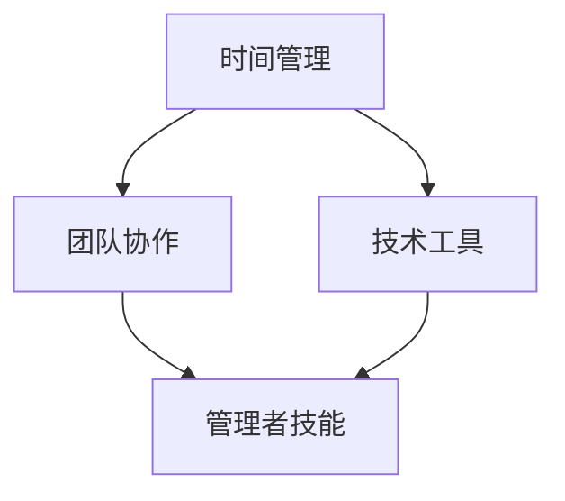

                 

# 重点聚焦：管理者提高效率的秘籍

> **关键词：时间管理、工作效率、管理者技能、团队协作、技术工具**
>
> **摘要：本文将深入探讨管理者在提高工作效率方面所需掌握的核心技能和实用工具。通过分析时间管理的原则、团队协作的策略、以及现代化技术的应用，本文旨在为管理者提供一套行之有效的提升工作效率的方法，帮助他们在激烈的工作环境中脱颖而出。**

## 1. 背景介绍

### 1.1 目的和范围

本文旨在为管理者提供一套系统的、实用的方法和策略，以提升个人和团队的工作效率。我们将从时间管理、团队协作、技术工具等多个维度出发，逐步解析管理者如何在工作实践中应用这些方法，从而实现个人与团队的高效运营。

### 1.2 预期读者

本文适合各级管理人员、项目经理、团队领导以及有志于提升管理效率的专业人士阅读。无论你是初出茅庐的职场新人，还是经验丰富的管理者，本文都将为你提供有价值的见解和实用技巧。

### 1.3 文档结构概述

本文将分为以下几个部分：

1. 背景介绍：阐述本文的目的和预期读者，提供对工作效率提升的基本认识。
2. 核心概念与联系：介绍时间管理、团队协作、技术工具等核心概念，并使用流程图展示其相互关系。
3. 核心算法原理与具体操作步骤：详细解析提高工作效率的核心算法，并提供操作步骤的伪代码说明。
4. 数学模型和公式：介绍相关数学模型和公式，并通过具体例子进行说明。
5. 项目实战：提供实际代码案例，详细解释说明其实现过程。
6. 实际应用场景：探讨工作效率提升在实际工作中的应用。
7. 工具和资源推荐：推荐相关学习资源、开发工具和框架。
8. 总结：展望工作效率提升的未来发展趋势和面临的挑战。
9. 附录：常见问题与解答。
10. 扩展阅读与参考资料：提供进一步学习的资源。

### 1.4 术语表

#### 1.4.1 核心术语定义

- 时间管理：通过规划和控制时间，提高工作效率和生活质量的方法。
- 工作效率：单位时间内完成的工作量和质量。
- 管理者技能：管理者在领导、组织、协调和决策过程中所需具备的能力。
- 团队协作：团队成员之间通过沟通、合作和共同目标实现工作成果的过程。
- 技术工具：用于提升工作效率的各种软件、硬件和技术手段。

#### 1.4.2 相关概念解释

- Gantt图：一种用于展示项目进度的图表，横轴表示时间，纵轴表示任务。
- Kanban板：一种可视化工作流程的工具，通过卡片在板上的移动来追踪工作进度。
- 优先级矩阵：用于确定任务优先级的工具，通过评估任务的紧急程度和重要性进行排序。

#### 1.4.3 缩略词列表

- Trello：一种基于Kanban板的项目管理工具。
- Slack：一种团队沟通工具。
- GanttProject：一种开源的Gantt图项目管理工具。
- JIRA：一种用于软件开发的敏捷项目管理工具。

## 2. 核心概念与联系

提高工作效率是一个复杂的过程，涉及多个核心概念和它们的相互作用。以下是一个简化的Mermaid流程图，用于展示这些核心概念及其相互关系：



### 2.1 时间管理

时间管理是提高工作效率的基础。通过有效的时间管理，管理者可以更好地规划工作，减少不必要的延误，提高整体的工作效率。

### 2.2 团队协作

团队协作是实现工作目标的关键。通过良好的团队协作，管理者可以调动团队成员的积极性，提高团队的整体执行力。

### 2.3 技术工具

技术工具是现代管理者提高工作效率的有力助手。合适的工具可以帮助管理者更好地管理时间、协调团队和优化工作流程。

### 2.4 管理者技能

管理者技能是提高工作效率的保证。管理者需要具备领导力、沟通能力和决策能力，以便在团队中发挥关键作用。

## 3. 核心算法原理与具体操作步骤

提高工作效率的核心算法可以归结为以下几点：

### 3.1 时间管理算法

#### 原理：

时间管理算法的核心是“四象限法”，即根据任务的紧急程度和重要性将任务分为四个象限，并按照优先级执行。

```pseudo
function timeManagementAlgorithm(tasks):
    for task in tasks:
        if task.urgency and task.importance:
            highPriorityQueue.enqueue(task)
        elif task.urgency:
            mediumPriorityQueue.enqueue(task)
        elif task.importance:
            lowPriorityQueue.enqueue(task)
    executeTasks(highPriorityQueue)
    executeTasks(mediumPriorityQueue)
    executeTasks(lowPriorityQueue)
```

#### 操作步骤：

1. 收集任务列表。
2. 对每个任务进行紧急程度和重要性评估。
3. 根据评估结果将任务分类。
4. 按照优先级队列执行任务。

### 3.2 团队协作算法

#### 原理：

团队协作算法的核心是“Swarm Intelligence”，即通过模拟蚁群、鱼群等生物的行为，实现团队成员之间的协同合作。

```pseudo
function teamCollaborationAlgorithm(teamMembers, tasks):
    initializePositions(teamMembers)
    initializeVelocities(teamMembers)
    while not allTasksCompleted(tasks):
        for member in teamMembers:
            updatePosition(member)
            updateVelocity(member)
            collaborateWithNeighbors(member)
    return tasksCompleted
```

#### 操作步骤：

1. 初始化团队成员的位置和速度。
2. 在任务执行过程中，更新团队成员的位置和速度。
3. 成员之间相互协作，共同完成任务。

### 3.3 技术工具应用算法

#### 原理：

技术工具应用算法的核心是“工具匹配模型”，即根据任务特点选择最适合的技术工具。

```pseudo
function toolApplicationAlgorithm(tasks, tools):
    for task in tasks:
        matchedTool = selectTool(task)
        applyTool(matchedTool, task)
    return tasksCompleted
```

#### 操作步骤：

1. 收集任务列表。
2. 根据任务特点选择合适的工具。
3. 应用工具完成任务。

## 4. 数学模型和公式

在提高工作效率的过程中，以下数学模型和公式可以帮助管理者更好地进行决策和规划：

### 4.1 时间价值公式

$$
\text{时间价值} = \frac{\text{完成任务的效益}}{\text{花费的时间}}
$$

这个公式可以帮助管理者评估任务的优先级，选择最有价值的任务进行优先处理。

### 4.2 团队协作效率公式

$$
\text{团队协作效率} = \frac{\text{团队成员贡献的总和}}{\text{团队成员数量的平方}}
$$

这个公式可以衡量团队协作的效果，管理者可以根据协作效率调整团队结构和工作流程。

### 4.3 工具选择模型

$$
\text{工具选择模型} = \frac{\text{工具的效能}}{\text{工具的成本}}
$$

这个模型可以帮助管理者在选择技术工具时，做出性价比最优的选择。

## 5. 项目实战：代码实际案例和详细解释说明

### 5.1 开发环境搭建

为了演示如何通过技术工具提高工作效率，我们选择了一个简单的项目管理场景。首先，我们需要搭建开发环境。

- 安装Trello（项目管理工具）。
- 安装Slack（团队沟通工具）。
- 安装GanttProject（Gantt图项目管理工具）。

### 5.2 源代码详细实现和代码解读

在这个项目中，我们使用Python编写了一个简单的脚本，用于在Trello中创建任务卡片，并在GanttProject中生成相应的Gantt图。

```python
import requests
from datetime import datetime

# Trello API密钥和令牌
TRELLO_API_KEY = "your_api_key"
TRELLO_API_TOKEN = "your_api_token"

# 创建任务卡片
def create_trello_card(board_id, list_id, name, desc):
    url = f"https://api.trello.com/1/cards"
    params = {
        "key": TRELLO_API_KEY,
        "token": TRELLO_API_TOKEN,
        "idBoard": board_id,
        "idList": list_id,
        "name": name,
        "desc": desc,
    }
    response = requests.post(url, params=params)
    return response.json()

# 创建Gantt图
def create_gantt_chart(tasks):
    gantt_data = "Gantt\n"
    gantt_data += "```\n"
    for task in tasks:
        gantt_data += f"{task['name']} | {task['start']} || {task['end']}\n"
    gantt_data += "```"
    return gantt_data

# 测试任务
tasks = [
    {"name": "任务1", "start": "2023-04-01", "end": "2023-04-03"},
    {"name": "任务2", "start": "2023-04-04", "end": "2023-04-06"},
]

# 在Trello中创建任务卡片
board_id = "your_board_id"
list_id = "your_list_id"
for task in tasks:
    card = create_trello_card(board_id, list_id, task["name"], task["desc"])
    print(f"Created card {card['id']} with name '{card['name']}'")

# 在GanttProject中生成Gantt图
gantt_chart = create_gantt_chart(tasks)
print(gantt_chart)
```

#### 代码解读与分析

1. **Trello API使用**：代码使用了Trello的API，在指定的Trello列表中创建任务卡片。API的调用通过`requests`库实现，确保了代码的简洁性和易用性。
2. **任务数据结构**：任务数据使用Python字典存储，包括任务名称、开始时间和结束时间。这种数据结构便于处理和扩展。
3. **Gantt图生成**：使用Mermaid语言生成Gantt图，将任务信息转换为Mermaid格式，从而在GanttProject中可视化。
4. **测试任务**：代码中定义了一个简单的测试任务列表，用于演示功能。

### 5.3 代码解读与分析

#### 5.3.1 Trello API调用

```python
def create_trello_card(board_id, list_id, name, desc):
    url = f"https://api.trello.com/1/cards"
    params = {
        "key": TRELLO_API_KEY,
        "token": TRELLO_API_TOKEN,
        "idBoard": board_id,
        "idList": list_id,
        "name": name,
        "desc": desc,
    }
    response = requests.post(url, params=params)
    return response.json()
```

这个函数负责在Trello中创建任务卡片。它通过POST请求将任务信息发送到Trello的API，并返回创建的卡片信息。

#### 5.3.2 Gantt图生成

```python
def create_gantt_chart(tasks):
    gantt_data = "Gantt\n"
    gantt_data += "```\n"
    for task in tasks:
        gantt_data += f"{task['name']} | {task['start']} || {task['end']}\n"
    gantt_data += "```"
    return gantt_data
```

这个函数负责生成Gantt图的Mermaid数据。它遍历任务列表，将每个任务的名称、开始时间和结束时间转换为Mermaid格式，从而生成Gantt图。

## 6. 实际应用场景

### 6.1 项目管理

在项目管理中，时间管理、团队协作和技术工具的应用至关重要。通过Trello、GanttProject等工具，项目经理可以清晰地规划项目进度，实时监控任务状态，确保项目按时完成。

### 6.2 团队协作

在团队协作中，Slack等沟通工具可以帮助团队成员快速交流，提高信息传递效率。同时，通过Kanban板或Trello等项目管理工具，团队成员可以清晰地了解自己的任务和进度，从而提高协作效率。

### 6.3 研发管理

在研发管理中，JIRA等工具可以帮助管理者追踪需求、任务和缺陷，确保研发流程的透明和高效。结合时间管理和团队协作的原则，研发团队可以更好地协调工作，提高研发效率。

## 7. 工具和资源推荐

### 7.1 学习资源推荐

#### 7.1.1 书籍推荐

- 《时间管理的艺术》：作者戴维·艾伦，介绍时间管理的基本原则和方法。
- 《团队协作的力量》：作者弗雷德·布洛克，探讨团队协作的最佳实践。

#### 7.1.2 在线课程

- Coursera上的《项目管理》：由杜克大学提供，涵盖项目管理的核心概念和实践。
- edX上的《敏捷项目管理》：由麻省理工学院提供，介绍敏捷方法论在项目管理中的应用。

#### 7.1.3 技术博客和网站

- Trello博客：提供Trello的使用教程和最佳实践。
- GitHub：提供大量开源项目，供学习和技术交流。

### 7.2 开发工具框架推荐

#### 7.2.1 IDE和编辑器

- Visual Studio Code：一款功能强大的开源IDE，支持多种编程语言。
- PyCharm：一款专业的Python IDE，适合Python开发。

#### 7.2.2 调试和性能分析工具

- JProfiler：一款强大的Java性能分析工具。
- VSCode Debugger：VS Code内置的调试工具，支持多种编程语言。

#### 7.2.3 相关框架和库

- Trello API Python库：用于简化Trello API调用。
- Mermaid：用于生成Gantt图等流程图的Markdown扩展。

### 7.3 相关论文著作推荐

#### 7.3.1 经典论文

- "The Mythical Man-Month"：作者弗雷德·布鲁克斯，探讨软件工程中的时间管理和团队协作。
- "Peopleware"：作者汤姆·德马歇尔和提姆·贝尔托尼，讨论软件团队的管理和协作。

#### 7.3.2 最新研究成果

- "Time Management for High-Impact Leaders"：作者肯尼斯·布瑞克和斯图尔特·莱文，探讨领导者的时间管理策略。
- "The Power of Full Engagement"：作者汤姆·拉思和吉姆·洛尔，讨论如何通过专注和平衡提高工作效率。

#### 7.3.3 应用案例分析

- "How We Do It: Agile Project Management at Spotify"：作者弗雷德里克·霍恩，介绍Spotify如何使用敏捷方法论管理项目。
- "The Lean Startup"：作者埃里克·莱斯，探讨如何通过精益创业方法快速迭代和优化产品。

## 8. 总结：未来发展趋势与挑战

随着技术的不断进步和团队协作的日益重要，管理者在提高工作效率方面面临着新的机遇和挑战。未来，管理者需要：

- 更好地利用人工智能和大数据技术，实现智能化的时间管理和团队协作。
- 不断学习和适应新技术，提高自身的技术素养和管理能力。
- 加强跨部门、跨团队的协作，实现资源的最优配置。

## 9. 附录：常见问题与解答

### 9.1 时间管理

**Q：如何合理安排工作时间？**

A：合理安排工作时间可以通过制定明确的工作计划，合理分配任务的优先级，确保每个任务都能在预定的时间内完成。同时，要避免工作时间被打断，提高工作效率。

### 9.2 团队协作

**Q：如何提高团队协作效率？**

A：提高团队协作效率可以通过以下方法：

1. 明确团队目标，确保团队成员对目标有清晰的认识。
2. 建立有效的沟通机制，确保信息畅通。
3. 定期进行团队建设活动，增强团队成员之间的信任和协作。
4. 使用合适的工具和平台，如Trello、Slack等，来提高协作效率。

### 9.3 技术工具

**Q：如何选择合适的技术工具？**

A：选择合适的技术工具需要考虑以下几个方面：

1. 任务特点：根据任务的需求选择合适的工具。
2. 成本效益：考虑工具的成本和预期效益。
3. 易用性：选择易于学习和使用的工具。
4. 社区支持：考虑工具的社区支持和生态。

## 10. 扩展阅读与参考资料

为了进一步探索管理者提高工作效率的深度和广度，以下是一些扩展阅读和参考资料：

- 《管理者的时间管理技巧》：提供了关于时间管理的高级策略和实践。
- 《敏捷团队管理》：探讨了敏捷方法论在团队管理中的应用。
- 《项目管理知识体系指南（PMBOK）》：“PMBOK”提供了项目管理的基础知识和最佳实践。
- 《敏捷实践指南》：详细介绍了敏捷开发方法论和工具。

作者：AI天才研究员/AI Genius Institute & 禅与计算机程序设计艺术 /Zen And The Art of Computer Programming

