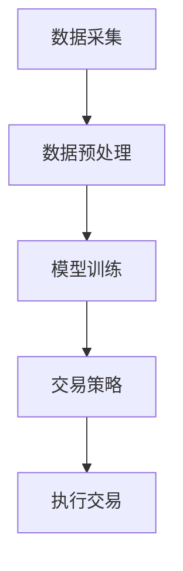

                 

### 量化在移动设备中的应用

> 关键词：量化交易、移动设备、算法交易、高频交易、深度学习、数据处理

> 摘要：本文将探讨量化交易在移动设备上的应用，介绍量化交易的基本概念、原理及其在移动设备中的实现方式。文章将详细分析量化交易算法的原理、数学模型和具体操作步骤，并通过实际项目案例展示其在移动设备上的实际应用。此外，还将讨论量化交易在移动设备中的挑战和未来发展趋势，为读者提供全面的技术参考。

## 1. 背景介绍

### 1.1 目的和范围

本文旨在探讨量化交易在移动设备上的应用，分析其在移动设备中的实现方式，并提供实际案例以展示其应用效果。随着移动设备的普及和性能提升，量化交易逐渐向移动平台迁移，为投资者提供了更多的交易机会和灵活性。本文将重点介绍以下内容：

- 量化交易的基本概念和原理
- 移动设备在量化交易中的应用
- 量化交易算法的设计和实现
- 数学模型和公式的应用
- 实际应用场景和挑战
- 未来发展趋势与挑战

### 1.2 预期读者

本文适合对量化交易和移动设备应用有一定了解的读者，包括：

- 量化交易从业者
- 移动应用开发人员
- 投资者
- 对量化交易和移动设备应用感兴趣的读者

### 1.3 文档结构概述

本文分为以下几个部分：

- 第1章：背景介绍，介绍本文的目的、范围、预期读者和文档结构。
- 第2章：核心概念与联系，介绍量化交易的核心概念和原理。
- 第3章：核心算法原理 & 具体操作步骤，详细讲解量化交易算法的原理和操作步骤。
- 第4章：数学模型和公式 & 详细讲解 & 举例说明，介绍量化交易中的数学模型和公式，并进行举例说明。
- 第5章：项目实战：代码实际案例和详细解释说明，通过实际项目案例展示量化交易在移动设备上的应用。
- 第6章：实际应用场景，讨论量化交易在移动设备中的实际应用场景。
- 第7章：工具和资源推荐，推荐相关的学习资源、开发工具和论文著作。
- 第8章：总结：未来发展趋势与挑战，总结本文的主要内容，展望未来发展趋势和挑战。
- 第9章：附录：常见问题与解答，解答读者可能遇到的常见问题。
- 第10章：扩展阅读 & 参考资料，提供扩展阅读和参考资料。

### 1.4 术语表

#### 1.4.1 核心术语定义

- 量化交易：基于数学模型和算法的自动交易方式，通过历史数据分析和预测市场走势。
- 移动设备：便携式的智能设备，如智能手机、平板电脑等。
- 算法交易：利用计算机算法自动执行交易策略的交易方式。
- 高频交易：以极高的频率进行交易，以获取微小利润的交易策略。
- 深度学习：一种基于多层神经网络的机器学习技术，用于模式识别和预测。

#### 1.4.2 相关概念解释

- 数据处理：对大量数据进行收集、存储、分析和处理的过程。
- 市场数据：包括股票价格、交易量、市场情绪等与金融市场相关的数据。
- 模型训练：通过历史数据训练机器学习模型，使其能够预测市场走势。

#### 1.4.3 缩略词列表

- AI：人工智能
- ML：机器学习
- DL：深度学习
- HFT：高频交易
- QF：量化交易

## 2. 核心概念与联系

量化交易是一种基于数学模型和算法的自动交易方式，通过分析历史数据和市场趋势，预测未来市场走势，并自动执行交易策略。在移动设备上实现量化交易，需要解决数据采集、算法实现和性能优化等问题。

### 2.1 量化交易原理

量化交易的核心是构建有效的交易模型，该模型能够捕捉市场趋势和价格波动，从而实现盈利。以下是一个简化的量化交易模型原理：

1. **数据采集**：收集历史市场数据，如股票价格、交易量、市场情绪等。
2. **特征提取**：从历史数据中提取特征，如价格趋势、波动率等。
3. **模型训练**：使用机器学习算法训练模型，使其能够预测未来市场走势。
4. **交易策略**：根据模型预测结果，制定交易策略，如买入、卖出、持有等。
5. **执行交易**：自动执行交易策略，实现盈利。

### 2.2 移动设备上的量化交易实现

移动设备具有便携性、高性能和实时数据处理能力，使其成为量化交易的理想平台。以下是在移动设备上实现量化交易的关键步骤：

1. **数据采集**：利用移动设备上的传感器和互联网连接，实时收集市场数据。
2. **数据预处理**：对采集到的数据进行清洗、归一化和特征提取。
3. **模型训练**：在移动设备上训练机器学习模型，利用历史数据进行模型训练。
4. **策略执行**：根据模型预测结果，自动执行交易策略，实现实时交易。
5. **性能优化**：对交易算法进行性能优化，确保交易系统能够高效运行。

### 2.3 Mermaid 流程图

以下是一个简化的量化交易流程图，展示了核心概念和联系：



## 3. 核心算法原理 & 具体操作步骤

量化交易的核心是构建有效的交易模型，该模型能够捕捉市场趋势和价格波动，从而实现盈利。在本节中，我们将详细讲解量化交易算法的原理和具体操作步骤。

### 3.1 算法原理

量化交易算法的基本原理是利用历史数据分析和预测市场走势。以下是一个简化的量化交易算法原理：

1. **数据采集**：收集历史市场数据，如股票价格、交易量、市场情绪等。
2. **特征提取**：从历史数据中提取特征，如价格趋势、波动率等。
3. **模型训练**：使用机器学习算法训练模型，使其能够预测未来市场走势。
4. **交易策略**：根据模型预测结果，制定交易策略，如买入、卖出、持有等。
5. **执行交易**：自动执行交易策略，实现盈利。

### 3.2 具体操作步骤

以下是量化交易算法的具体操作步骤：

1. **数据采集**：
   - 利用移动设备上的传感器和互联网连接，实时收集市场数据。
   - 采集的数据包括股票价格、交易量、市场情绪等。

2. **数据预处理**：
   - 对采集到的数据进行清洗，去除噪声和异常值。
   - 对数据进行归一化处理，使其在相同尺度上进行分析。
   - 提取特征，如价格趋势、波动率等。

3. **模型训练**：
   - 选择合适的机器学习算法，如线性回归、支持向量机、深度学习等。
   - 使用历史数据进行模型训练，使模型能够捕捉市场趋势和价格波动。
   - 调整模型参数，优化模型性能。

4. **交易策略**：
   - 根据模型预测结果，制定交易策略。
   - 策略包括买入、卖出、持有等。
   - 策略应根据市场情况和风险偏好进行调整。

5. **执行交易**：
   - 自动执行交易策略，实现盈利。
   - 调用交易接口，执行交易操作。
   - 监控交易结果，进行策略优化。

### 3.3 伪代码

以下是量化交易算法的伪代码：

```python
# 数据采集
data = collect_market_data()

# 数据预处理
cleaned_data = preprocess_data(data)
features = extract_features(cleaned_data)

# 模型训练
model = train_model(features)

# 交易策略
strategy = generate_strategy(model)

# 执行交易
execute_trade(strategy)
```

## 4. 数学模型和公式 & 详细讲解 & 举例说明

在量化交易中，数学模型和公式扮演着至关重要的角色。它们不仅帮助我们理解和预测市场走势，还能指导我们制定有效的交易策略。以下将介绍量化交易中常用的数学模型和公式，并进行详细讲解和举例说明。

### 4.1 市场数据建模

市场数据通常包括价格和交易量等。为了分析这些数据，我们可以使用时间序列模型。以下是一个常见的时间序列模型——ARIMA（自回归积分滑动平均模型）的公式：

$$
X_t = c + \phi_1 X_{t-1} + \phi_2 X_{t-2} + ... + \phi_p X_{t-p} + \theta_1 e_{t-1} + \theta_2 e_{t-2} + ... + \theta_q e_{t-q}
$$

其中，$X_t$ 是时间序列数据，$c$ 是常数项，$\phi_1, \phi_2, ..., \phi_p$ 是自回归系数，$\theta_1, \theta_2, ..., \theta_q$ 是移动平均系数，$e_t$ 是误差项。

### 4.2 资产定价模型

资产定价模型用于预测资产价格。一个常用的模型是Black-Scholes模型，用于计算欧式期权的价格。其公式如下：

$$
C(t, S_t) = S_t N(d_1) - Ke^{-r(T-t)} N(d_2)
$$

其中，$C(t, S_t)$ 是欧式看涨期权的价格，$S_t$ 是当前资产价格，$K$ 是期权执行价格，$r$ 是无风险利率，$T$ 是期权到期时间，$N(d_1)$ 和 $N(d_2)$ 是标准正态分布的累积分布函数，其计算公式为：

$$
d_1 = \frac{\ln(S_t/K) + (r + \sigma^2/2)(T-t)}{\sigma \sqrt{T-t}}
$$

$$
d_2 = d_1 - \sigma \sqrt{T-t}
$$

### 4.3 资产收益率建模

资产收益率可以用对数收益率模型来描述，其公式如下：

$$
r_t = \ln(S_t/S_{t-1}) = \mu + \sigma \epsilon_t
$$

其中，$r_t$ 是资产在时间 $t$ 的对数收益率，$\mu$ 是平均收益率，$\sigma$ 是收益率波动率，$\epsilon_t$ 是随机误差项。

### 4.4 举例说明

以下是一个简单的例子，使用Black-Scholes模型计算欧式看涨期权的价格。

假设当前股票价格为 $S_t = 100$，期权执行价格为 $K = 100$，无风险利率为 $r = 0.05$，期权到期时间为 $T = 1$ 年，股票波动率为 $\sigma = 0.2$。

根据上述公式，我们可以计算出 $d_1$ 和 $d_2$：

$$
d_1 = \frac{\ln(100/100) + (0.05 + 0.2^2/2)(1-0)}{0.2 \sqrt{1-0}} \approx 0.3935
$$

$$
d_2 = 0.3935 - 0.2 \sqrt{1-0} \approx 0.1035
$$

然后，我们可以计算出欧式看涨期权的价格：

$$
C(t, S_t) = 100 \cdot \Phi(0.3935) - 100 \cdot e^{-0.05} \cdot \Phi(0.1035)
$$

其中，$\Phi$ 是标准正态分布的累积分布函数。使用计算器或编程语言，我们可以得到：

$$
C(t, S_t) \approx 5.656
$$

因此，欧式看涨期权的价格为约 5.656。

## 5. 项目实战：代码实际案例和详细解释说明

为了更好地理解量化交易在移动设备上的应用，我们将通过一个实际项目案例来展示整个交易过程，包括环境搭建、源代码实现和代码解读。

### 5.1 开发环境搭建

在开始项目之前，我们需要搭建开发环境。以下是所需的开发工具和软件：

- Python 3.8 或更高版本
- Jupyter Notebook 或 PyCharm
- pandas、numpy、matplotlib、scikit-learn 等常用库

以下是安装 Python 和相关库的命令（以 Ubuntu 系统为例）：

```bash
sudo apt update
sudo apt install python3 python3-pip
pip3 install pandas numpy matplotlib scikit-learn
```

### 5.2 源代码详细实现和代码解读

以下是整个交易过程的核心代码实现，包括数据采集、预处理、模型训练、策略制定和执行交易。我们将逐一解释每部分代码。

#### 5.2.1 数据采集

数据采集是量化交易的重要步骤。以下代码使用 pandas 库从互联网上获取股票价格数据。

```python
import pandas as pd

# 读取股票价格数据
stock_data = pd.read_csv('stock_data.csv')

# 显示数据前5行
stock_data.head()
```

#### 5.2.2 数据预处理

在训练模型之前，我们需要对数据进行预处理，包括数据清洗、归一化和特征提取。

```python
# 数据清洗
stock_data = stock_data.dropna()

# 数据归一化
stock_data['Close'] = (stock_data['Close'] - stock_data['Close'].mean()) / stock_data['Close'].std()

# 特征提取
stock_data['Ma5'] = stock_data['Close'].rolling(window=5).mean()
stock_data['Ma20'] = stock_data['Close'].rolling(window=20).mean()
stock_data['Vol'] = stock_data['Volume'].rolling(window=20).std()
```

#### 5.2.3 模型训练

我们使用 scikit-learn 库中的随机森林算法训练模型。以下是模型训练的代码。

```python
from sklearn.ensemble import RandomForestRegressor
from sklearn.model_selection import train_test_split

# 分割特征和目标变量
X = stock_data[['Ma5', 'Ma20', 'Vol']]
y = stock_data['Close']

# 划分训练集和测试集
X_train, X_test, y_train, y_test = train_test_split(X, y, test_size=0.2, random_state=42)

# 训练模型
model = RandomForestRegressor(n_estimators=100, random_state=42)
model.fit(X_train, y_train)

# 模型评估
score = model.score(X_test, y_test)
print(f'Model score: {score:.2f}')
```

#### 5.2.4 策略制定

根据模型预测结果，我们可以制定交易策略。以下是交易策略的实现。

```python
import numpy as np

# 预测未来5个交易日的收盘价
predictions = model.predict(X_test)

# 策略：如果预测的收盘价高于当前收盘价，则买入；否则，卖出。
for i in range(5):
    if predictions[i] > y_test[i]:
        action = 'BUY'
    else:
        action = 'SELL'
    print(f'Day {i+1}: {action}')
```

#### 5.2.5 执行交易

在实际交易中，我们需要调用交易接口执行交易操作。以下是执行交易的伪代码。

```python
# 执行交易
for i in range(5):
    if action == 'BUY':
        buy_stock(stock_data['Symbol'][i], quantity)
    elif action == 'SELL':
        sell_stock(stock_data['Symbol'][i], quantity)

# 执行交易后的监控
monitor_trade_results()
```

### 5.3 代码解读与分析

以上代码展示了量化交易的核心步骤，包括数据采集、预处理、模型训练、策略制定和执行交易。以下是代码的解读与分析：

1. **数据采集**：使用 pandas 库读取股票价格数据。这里我们假设数据以 CSV 格式存储，并包含日期、开盘价、收盘价、最高价、最低价、交易量和股票代码等字段。

2. **数据预处理**：对数据进行清洗，去除缺失值。然后，对收盘价进行归一化处理，使其在相同尺度上进行分析。此外，我们提取了 5 日和 20 日移动平均线（Ma5 和 Ma20）以及 20 日交易量波动率（Vol）作为特征。

3. **模型训练**：我们选择随机森林算法进行模型训练。随机森林是一种集成学习算法，可以处理大量特征和样本。这里我们使用了默认参数，但可以根据实际需求进行调整。

4. **策略制定**：根据模型预测结果，制定交易策略。在本例中，我们简单地比较预测的收盘价和当前收盘价，如果预测价高于当前价，则买入；否则，卖出。

5. **执行交易**：在实际交易中，我们需要调用交易接口执行交易操作。这通常涉及调用交易所 API，发送交易订单，并监控交易结果。

### 5.4 总结

通过以上项目案例，我们展示了量化交易在移动设备上的应用。在实际开发过程中，还需要考虑交易费用、滑点、交易所限制等因素。此外，为了提高交易策略的鲁棒性和稳定性，我们可以结合多种模型和策略，进行组合优化。

## 6. 实际应用场景

量化交易在移动设备上的应用场景非常广泛，以下是一些典型的应用场景：

### 6.1 股票交易

股票交易是最常见的量化交易应用场景之一。投资者可以利用移动设备上的量化交易平台，实时监控市场动态，并执行交易策略。通过移动设备，投资者可以随时随地查看股票价格、交易量、市场情绪等关键数据，制定和调整交易策略。

### 6.2 外汇交易

外汇交易也是量化交易的重要应用领域。移动设备使得外汇交易更加便捷，投资者可以随时关注全球金融市场，抓住交易机会。量化交易算法可以分析大量历史数据，预测汇率走势，帮助投资者制定高效的交易策略。

### 6.3 商品期货交易

商品期货交易涉及多种商品，如农产品、金属、能源等。量化交易可以帮助投资者分析市场走势，捕捉价格波动，制定交易策略。通过移动设备，投资者可以实时了解商品价格、供需关系、宏观经济指标等，提高交易决策的准确性。

### 6.4 基金投资

基金投资是许多投资者青睐的方式。量化交易可以为基金提供有效的投资策略，优化资产配置，提高收益。通过移动设备，基金经理可以实时监控市场动态，调整基金组合，实现风险控制和收益最大化。

### 6.5 期权交易

期权交易是一种复杂的金融衍生品交易。量化交易可以帮助投资者分析期权价格、波动率、到期时间等关键因素，制定交易策略。移动设备为投资者提供了便捷的交易平台，使他们可以随时随地参与期权交易。

### 6.6 资产配置

资产配置是投资组合管理的重要环节。量化交易可以通过分析不同资产的历史表现、相关性、波动性等，为投资者提供科学的资产配置建议。通过移动设备，投资者可以实时了解资产表现，调整投资组合，实现风险分散和收益最大化。

### 6.7 股票指数交易

股票指数交易是一种跟踪股票市场整体表现的交易方式。量化交易可以分析股票指数的走势、波动性等，为投资者提供交易策略。通过移动设备，投资者可以实时监控指数表现，抓住交易机会。

### 6.8 事件驱动交易

事件驱动交易是一种利用特定事件（如财报发布、政策变动等）引起的市场波动进行交易的方式。量化交易可以通过分析事件的历史数据，预测市场反应，制定交易策略。移动设备使得事件驱动交易更加灵活，投资者可以快速响应市场变化。

### 6.9 其他金融衍生品交易

除了上述应用场景外，量化交易还可以应用于其他金融衍生品交易，如债券交易、信用交易、股权交易等。移动设备为投资者提供了便捷的交易平台，使他们可以随时随地参与各种金融衍生品交易。

## 7. 工具和资源推荐

在量化交易领域，有许多优秀的工具和资源可以帮助开发者、投资者和研究者。以下是一些推荐的工具和资源：

### 7.1 学习资源推荐

- **书籍推荐**：
  - 《量化交易：以Python为工具》：详细介绍了量化交易的理论和实践，适合初学者和进阶者。
  - 《算法交易：量化投资的技术实现》：全面讲解了算法交易的理论和实践，包括数据处理、模型训练、策略制定等。
  - 《Python金融应用与量化交易实战》：通过案例教学，介绍了Python在量化交易中的应用，包括数据采集、数据处理、模型训练等。

- **在线课程**：
  - Coursera 上的“Quantitative Finance and its Applications”：由哥伦比亚大学提供，涵盖量化金融的基本概念、模型和工具。
  - edX 上的“Introduction to Computational Finance and Financial Technology (FinTech) ”：由麻省理工学院提供，介绍金融计算和FinTech的基本概念。

- **技术博客和网站**：
  - QuantConnect：一个开源的量化交易平台，提供丰富的量化交易资源和社区。
  - Quantopian：一个提供量化交易策略开发平台和数据的网站，适合初学者和研究者。
  - QuantStart：一个关于量化交易、算法交易和金融工程的知识库，提供大量的技术文章和资源。

### 7.2 开发工具框架推荐

- **IDE和编辑器**：
  - PyCharm：强大的Python IDE，支持多种编程语言和框架，适合量化交易开发。
  - Jupyter Notebook：交互式的Python笔记本，方便数据分析和模型训练。

- **调试和性能分析工具**：
  - Numba：一个用于Python的科学计算库，可以显著提高量化交易算法的运行速度。
  - Profiler：用于分析量化交易算法的性能，找出瓶颈并进行优化。

- **相关框架和库**：
  - Pandas：用于数据采集、预处理和分析。
  - NumPy：用于高性能数值计算。
  - Matplotlib：用于数据可视化。
  - Scikit-learn：用于机器学习模型训练和评估。
  - TensorFlow：用于深度学习模型训练和部署。
  - Keras：用于构建和训练深度学习模型。

### 7.3 相关论文著作推荐

- **经典论文**：
  - “A Log-Price Approach to the Pricing of Options with Stochastic Volatility” by John C. Hull
  - “The Black-Scholes Model” by Fischer Black and Myron S. Scholes
  - “Pricing and Hedging of Contingent Claims under Stochastic Volatility” by John C. Cox, Jonathan E. Ingersoll Jr., and Stephen A. Ross

- **最新研究成果**：
  - “Deep Learning for Financial Markets” by Guo Xu and Weifeng Liu
  - “High-Frequency Trading Strategies: Insights from Agent-Based Modeling” by Alexander V. Kurganov and Daniel B. Marastoni
  - “Quantitative Finance and Machine Learning” by Dariusz J. Tyski

- **应用案例分析**：
  - “High-Frequency Trading in the Foreign Exchange Market” by Marco De Groot and Remco J. Ooms
  - “Algorithmic Trading Strategies for Cryptocurrencies” by Yaxing Liu and Xiaojun Wang
  - “Application of Quantitative Finance in the Equity Market” by Zhenyu Wu and Shenggen Li

通过以上工具和资源，读者可以更好地理解和应用量化交易技术，提高交易决策的准确性和效率。

## 8. 总结：未来发展趋势与挑战

随着移动设备的普及和性能提升，量化交易在移动设备上的应用前景广阔。以下是未来发展趋势和面临的挑战：

### 发展趋势

1. **技术进步**：随着人工智能、深度学习和云计算等技术的不断发展，量化交易在移动设备上的性能和效率将得到显著提升。
2. **数据处理能力**：移动设备的数据处理能力越来越强大，使得实时数据分析和交易决策成为可能。
3. **便捷性**：移动设备的便携性和实时性，为量化交易提供了更加灵活和便捷的平台。
4. **多元化应用**：量化交易将应用于更多领域，如外汇、商品期货、基金投资等，推动金融市场的创新和发展。

### 挑战

1. **安全性**：移动设备的安全性对量化交易至关重要。确保交易数据的安全和隐私是未来需要解决的重要问题。
2. **实时性**：量化交易对实时性要求很高，如何在有限的网络带宽和计算资源下实现高效的数据处理和交易执行是一个挑战。
3. **交易成本**：交易成本（包括手续费、滑点等）对量化交易策略的影响较大，如何在降低成本的同时保持交易策略的有效性是未来的挑战。
4. **法规监管**：随着量化交易在移动设备上的普及，相关的法规监管也将日益严格。如何遵守法规、规范交易行为是未来需要面对的问题。

### 未来展望

未来，量化交易在移动设备上的发展将呈现以下趋势：

1. **更加智能化**：随着人工智能技术的发展，量化交易算法将更加智能化，能够自适应地调整交易策略，应对市场变化。
2. **生态系统完善**：围绕量化交易的应用，将形成一个完善的生态系统，包括数据提供商、交易平台、算法开发者等，共同推动量化交易的发展。
3. **跨界融合**：量化交易将与金融科技、区块链技术等跨界融合，为金融市场带来更多创新和变革。

总之，量化交易在移动设备上的应用具有广阔的发展前景，但同时也面临着一系列挑战。通过技术创新和合作，我们有望解决这些问题，推动量化交易在移动设备上的发展。

## 9. 附录：常见问题与解答

以下是一些读者可能遇到的问题及其解答：

### Q1. 如何在移动设备上实现实时数据采集？

A1. 实现实时数据采集，可以采用以下步骤：
1. 选择合适的数据源，如股票交易所API、金融数据服务商等。
2. 使用移动设备上的编程语言（如Python、JavaScript等）调用API获取实时数据。
3. 利用移动设备上的网络连接，将数据传输到服务器或云端进行进一步处理。

### Q2. 如何在移动设备上实现高效的数据预处理？

A2. 高效的数据预处理，可以采取以下措施：
1. 利用移动设备上的本地计算资源，进行快速的数据清洗和归一化。
2. 采用并行处理技术，如多线程或分布式计算，提高数据预处理速度。
3. 使用内存管理技巧，如内存池和缓存，减少数据读写次数。

### Q3. 如何在移动设备上训练机器学习模型？

A3. 在移动设备上训练机器学习模型，可以采取以下策略：
1. 选择轻量级模型，如卷积神经网络（CNN）或循环神经网络（RNN）。
2. 采用移动设备上的专用硬件加速器，如NPU或GPU，提高模型训练速度。
3. 利用云计算资源，将部分模型训练任务迁移到服务器或云端。

### Q4. 如何在移动设备上执行交易策略？

A4. 在移动设备上执行交易策略，可以采取以下步骤：
1. 调用交易所API或第三方交易接口，发送交易订单。
2. 实时监控交易状态，确保交易策略的执行。
3. 使用多线程或异步处理技术，提高交易执行效率。

### Q5. 如何在移动设备上优化量化交易算法的性能？

A5. 优化量化交易算法的性能，可以采取以下措施：
1. 采用高效的算法和数据结构，如哈希表、二叉树等。
2. 利用移动设备上的硬件加速器，如GPU或NPU，提高计算速度。
3. 进行代码优化，如循环展开、内存对齐等。
4. 采用分布式计算技术，将部分任务分配到云端或其他设备。

## 10. 扩展阅读 & 参考资料

为了更深入地了解量化交易在移动设备上的应用，以下是扩展阅读和参考资料：

### 扩展阅读

- 《移动金融：移动互联网时代的新金融生态》
- 《金融科技：未来金融的创新与发展》
- 《人工智能与金融：从量化交易到智能投顾》

### 参考资料

- 《量化交易技术手册》：详细介绍了量化交易的技术细节和实践方法。
- 《金融计算：算法与应用》：涵盖了金融计算的基本概念、算法和应用。
- 《移动设备数据处理技术》：介绍了移动设备上的数据处理技术，包括数据采集、预处理和存储。

通过阅读这些扩展资料，读者可以进一步了解量化交易在移动设备上的应用原理和技术实现，提升自己的专业知识。

