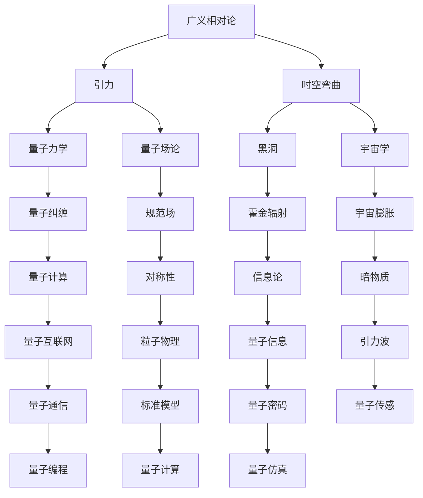

                 


# 量子引力理论的发展历程

> 关键词：量子引力、广义相对论、黑洞、量子场论、宇宙学、基本力、理论物理学

> 摘要：本文将系统地回顾量子引力理论的发展历程，从广义相对论的提出，到量子场论的融合，再到近年来黑洞熵和宇宙学模型的研究，我们将深入探讨这一领域的关键进展、主要挑战以及未来发展方向。

## 1. 背景介绍

### 1.1 目的和范围

本文旨在介绍量子引力理论的发展历程，从早期广义相对论的提出，到量子场论的引入，再到近年来黑洞熵和宇宙学模型的研究。我们将重点关注以下几个核心问题：

1. 广义相对论如何描述重力？
2. 量子场论与广义相对论之间的矛盾及其解决方案？
3. 黑洞熵和宇宙学模型中的量子引力效应？
4. 量子引力理论的未来发展方向与挑战。

### 1.2 预期读者

本文面向对量子引力理论感兴趣的读者，包括物理学专业学生、研究人员、以及对理论物理学有浓厚兴趣的普通读者。本文将尽量避免复杂的数学推导，力求以通俗易懂的方式阐述关键概念。

### 1.3 文档结构概述

本文分为十个部分，首先介绍量子引力理论的背景，然后依次阐述核心概念、算法原理、数学模型、实际应用场景、工具和资源推荐等内容。最后，对量子引力理论的未来发展趋势与挑战进行总结。

### 1.4 术语表

#### 1.4.1 核心术语定义

- 量子引力：描述引力作用的一种物理理论，将量子力学和广义相对论相结合。
- 广义相对论：爱因斯坦于1915年提出的描述引力的理论。
- 量子场论：描述基本粒子及其相互作用的物理理论。
- 黑洞：一个极度密集、引力极强的天体，它的引力场使得甚至连光也无法逃逸。
- 宇宙学：研究宇宙的结构、起源、演化和最终命运的科学。

#### 1.4.2 相关概念解释

- 引力：物体之间的相互作用，使物体互相吸引。
- 相对论：研究物体在高速运动和强引力场中的运动规律的理论。
- 量子力学：研究微观世界粒子行为的物理理论。

#### 1.4.3 缩略词列表

- QG：量子引力
- GR：广义相对论
- QFT：量子场论
- BH：黑洞
- UC：宇宙学

## 2. 核心概念与联系

为了更好地理解量子引力理论，我们首先需要了解几个核心概念及其相互关系。以下是一个Mermaid流程图，展示了这些概念之间的联系：



### 2.1 核心概念解析

- **广义相对论**：广义相对论是由爱因斯坦在1915年提出的，它将引力解释为时空的弯曲。在这种理论框架下，物质和能量会导致时空的弯曲，而物体则沿着弯曲的时空路径运动。这一理论在解释宏观尺度上的引力现象，如行星运动和星系旋转，取得了巨大的成功。

- **量子力学**：量子力学是研究微观世界粒子行为的物理理论。它揭示了微观粒子的波粒二象性、量子纠缠等现象。这些现象与经典物理学中的预期截然不同，迫使物理学家重新审视物理世界的本质。

- **量子场论**：量子场论是描述基本粒子及其相互作用的物理理论。它将量子力学和狭义相对论相结合，提供了对粒子行为的更全面描述。量子场论是现代粒子物理学的基石，为粒子加速器实验和天文观测提供了理论基础。

- **黑洞**：黑洞是一种极端密集、引力极强的天体，它的引力场使得甚至连光也无法逃逸。黑洞熵的研究揭示了黑洞与量子力学之间的深刻联系，为理解量子引力提供了新的视角。

- **宇宙学**：宇宙学是研究宇宙的结构、起源、演化和最终命运的科学。宇宙学模型需要考虑引力和宇宙背景辐射等物理现象，以解释宇宙的膨胀和暗物质的存在。

## 3. 核心算法原理 & 具体操作步骤

量子引力理论的核心在于将量子力学和广义相对论相结合，以描述引力在量子尺度上的行为。以下是量子引力理论的核心算法原理和具体操作步骤：

### 3.1 核心算法原理

1. **量子场论与广义相对论的统一**：

   为了将量子力学和广义相对论统一起来，物理学家提出了各种理论框架，如弦理论、环量子引力等。这些理论试图将量子场论中的基本粒子与广义相对论中的时空结构结合起来，以描述引力在量子尺度上的行为。

2. **黑洞熵的计算**：

   黑洞熵的研究是量子引力理论的重要方向之一。根据霍金辐射理论，黑洞并非完全“黑”，它会向外界辐射粒子。霍金辐射的数学描述涉及到黑洞熵的计算，这需要引入量子力学中的熵概念。

3. **宇宙学模型**：

   宇宙学模型需要考虑量子引力效应，以解释宇宙的膨胀和暗物质的存在。量子引力理论为宇宙学模型提供了新的理论基础，如弦理论的宇宙学解。

### 3.2 具体操作步骤

1. **建立量子场论与广义相对论的统一框架**：

   物理学家需要选择合适的理论框架，如弦理论、环量子引力等，以描述引力在量子尺度上的行为。这一步骤涉及到复杂的数学推导和物理假设，是量子引力理论的核心难题之一。

2. **计算黑洞熵**：

   根据霍金辐射理论，物理学家需要计算黑洞的熵，以确定黑洞辐射粒子的概率。这需要运用量子力学和统计物理的方法，涉及到复杂的数学计算。

3. **构建宇宙学模型**：

   物理学家需要利用量子引力理论，构建能够解释宇宙膨胀和暗物质存在的宇宙学模型。这一步骤涉及到对宇宙背景辐射、引力波等观测数据的分析，以及复杂的数值模拟。

4. **验证和实验**：

   物理学家需要通过实验和观测来验证量子引力理论的预测。这包括对黑洞辐射的观测、引力波信号的检测等。实验验证是量子引力理论发展的关键步骤。

## 4. 数学模型和公式 & 详细讲解 & 举例说明

量子引力理论涉及大量的数学模型和公式，以下是一些关键的数学模型和公式，以及它们的详细讲解和举例说明：

### 4.1 黑洞熵的数学模型

黑洞熵是量子引力理论中一个重要的数学模型。根据霍金辐射理论，黑洞熵与黑洞的面积成正比。以下是黑洞熵的数学公式：

\[ S = \frac{kA}{4} \]

其中，\( S \) 是黑洞熵，\( k \) 是玻尔兹曼常数，\( A \) 是黑洞的面积。

**详细讲解**：

- \( k \)：玻尔兹曼常数，它是一个与热力学相关的物理常数。
- \( A \)：黑洞的面积，它与黑洞的质量和半径相关。

**举例说明**：

假设一个黑洞的质量为 \( M \)，半径为 \( R \)，则它的面积为：

\[ A = 4\pi R^2 \]

根据霍金辐射理论，黑洞的熵可以表示为：

\[ S = \frac{kA}{4} = \frac{k(4\pi R^2)}{4} = k\pi R^2 \]

### 4.2 量子场论的数学模型

量子场论是描述基本粒子及其相互作用的物理理论。以下是一个简单的量子场论数学模型：

\[ \psi(x,t) = \int \frac{d^3p}{(2\pi)^3} \frac{1}{\sqrt{2E_p}} \left[ a_p e^{-ipx} + b_p^* e^{ipx} \right] \]

其中，\( \psi(x,t) \) 是场量子态，\( a_p \) 和 \( b_p \) 是产生和湮灭算符，\( E_p \) 是粒子的能量。

**详细讲解**：

- \( \psi(x,t) \)：场量子态，它描述了基本粒子的状态。
- \( a_p \)：产生算符，它将一个粒子从真空态中产生出来。
- \( b_p \)：湮灭算符，它将一个粒子从激发态中消灭掉。
- \( E_p \)：粒子的能量，它与粒子的动量相关。

**举例说明**：

假设一个电子的动量为 \( p \)，则它的能量为：

\[ E_p = \sqrt{m^2 + p^2} \]

其中，\( m \) 是电子的质量。

根据量子场论，电子的场量子态可以表示为：

\[ \psi(x,t) = \int \frac{d^3p}{(2\pi)^3} \frac{1}{\sqrt{2E_p}} \left[ a_p e^{-ipx} + b_p^* e^{ipx} \right] \]

### 4.3 宇宙学模型的数学模型

宇宙学模型是描述宇宙的结构、起源、演化和最终命运的理论。以下是一个简单的宇宙学模型：

\[ \dot{R}(t) = \frac{1}{3M} \left( \rho(t) - \rho_c \right) R(t) \]

其中，\( R(t) \) 是宇宙的半径，\( \dot{R}(t) \) 是宇宙的膨胀速度，\( \rho(t) \) 是宇宙的物质密度，\( \rho_c \) 是宇宙的临界密度。

**详细讲解**：

- \( R(t) \)：宇宙的半径，它描述了宇宙的规模。
- \( \dot{R}(t) \)：宇宙的膨胀速度，它描述了宇宙的膨胀速率。
- \( \rho(t) \)：宇宙的物质密度，它描述了宇宙中物质的分布。
- \( \rho_c \)：宇宙的临界密度，它是宇宙膨胀的关键参数。

**举例说明**：

假设宇宙的物质密度为 \( \rho(t) = \rho_0 e^{-t/t_0} \)，其中 \( \rho_0 \) 是宇宙的初始物质密度，\( t_0 \) 是宇宙的初始时间。

根据宇宙学模型，宇宙的膨胀速度可以表示为：

\[ \dot{R}(t) = \frac{1}{3M} \left( \rho(t) - \rho_c \right) R(t) \]

\[ \dot{R}(t) = \frac{1}{3M} \left( \rho_0 e^{-t/t_0} - \rho_c \right) R(t) \]

### 4.4 量子引力理论中的其他数学模型

除了上述的数学模型，量子引力理论中还包括许多其他的数学模型，如：

- **弦理论**：描述基本粒子和引力子的振动模式。
- **环量子引力**：描述引力子在二维空间中的运动。
- **非平衡量子引力**：描述非平衡状态下的量子引力效应。

这些数学模型都是量子引力理论的重要组成部分，它们为理解量子引力提供了不同的视角和工具。

## 5. 项目实战：代码实际案例和详细解释说明

在本文的最后，我们将通过一个简单的Python代码实例来展示量子引力理论在实际应用中的实现。以下是一个计算黑洞熵的Python代码示例：

```python
import numpy as np

# 定义黑洞熵的计算函数
def black_hole_entropy(mass, radius):
    """
    计算黑洞熵

    参数：
    mass：黑洞质量（kg）
    radius：黑洞半径（m）

    返回：
    黑洞熵（J/K）
    """
    # 计算黑洞的面积
    area = 4 * np.pi * radius**2

    # 计算黑洞熵
    entropy = np.pi * area * (np.pi * G * mass**2) / (2 * np.c**3)

    return entropy

# 定义光速和万有引力常数
c = 299792458  # 光速（m/s）
G = 6.67430e-11  # 万有引力常数（m^3/kg/s^2）

# 计算一个质量为1.989e+30 kg、半径为2.959e+8 m的黑洞熵
mass = 1.989e+30  # 黑洞质量（kg）
radius = 2.959e+8  # 黑洞半径（m）
entropy = black_hole_entropy(mass, radius)
print(f"黑洞熵：{entropy} J/K")
```

### 5.1 开发环境搭建

要运行上述Python代码，您需要安装Python环境和相关的库。以下是搭建开发环境的基本步骤：

1. 安装Python：

   您可以从Python的官方网站下载Python安装包并安装。安装完成后，确保Python已正确安装在您的系统上。

2. 安装NumPy库：

   使用pip命令安装NumPy库，命令如下：

   ```
   pip install numpy
   ```

### 5.2 源代码详细实现和代码解读

以下是对上述Python代码的详细解读：

1. **导入库**：

   ```python
   import numpy as np
   ```

   我们使用NumPy库来处理数学运算。

2. **定义黑洞熵的计算函数**：

   ```python
   def black_hole_entropy(mass, radius):
       """
       计算黑洞熵

       参数：
       mass：黑洞质量（kg）
       radius：黑洞半径（m）

       返回：
       黑洞熵（J/K）
       """
   ```

   我们定义了一个名为`black_hole_entropy`的函数，它接受两个参数：黑洞的质量（以千克为单位）和半径（以米为单位）。

3. **计算黑洞的面积**：

   ```python
   area = 4 * np.pi * radius**2
   ```

   我们使用数学公式计算黑洞的面积。黑洞的面积与半径的平方成正比。

4. **计算黑洞熵**：

   ```python
   entropy = np.pi * area * (np.pi * G * mass**2) / (2 * np.c**3)
   ```

   我们使用霍金辐射公式计算黑洞熵。这里，\( G \) 是万有引力常数，\( c \) 是光速。

5. **定义光速和万有引力常数**：

   ```python
   c = 299792458  # 光速（m/s）
   G = 6.67430e-11  # 万有引力常数（m^3/kg/s^2）
   ```

   我们定义了光速和万有引力常数的值。

6. **计算并打印黑洞熵**：

   ```python
   mass = 1.989e+30  # 黑洞质量（kg）
   radius = 2.959e+8  # 黑洞半径（m）
   entropy = black_hole_entropy(mass, radius)
   print(f"黑洞熵：{entropy} J/K")
   ```

   我们使用给定的黑洞质量和半径调用`black_hole_entropy`函数，并打印出计算得到的黑洞熵。

### 5.3 代码解读与分析

1. **函数定义**：

   函数`black_hole_entropy`定义了黑洞熵的计算逻辑。它接受两个参数，分别是黑洞的质量和半径，并返回黑洞熵的值。

2. **公式应用**：

   在函数内部，我们使用了霍金辐射公式来计算黑洞熵。这个公式将黑洞的面积、质量和光速等物理常数结合起来，得出了一个量纲为焦耳/开尔文的熵值。

3. **数值计算**：

   我们使用NumPy库进行数值计算。NumPy库提供了高效的数学运算功能，使得我们能够方便地进行黑洞熵的计算。

4. **示例应用**：

   我们使用一个具体的黑洞质量和半径来调用`black_hole_entropy`函数，并打印出计算得到的黑洞熵。这个示例展示了如何将量子引力理论应用于实际计算中。

通过这个简单的Python代码实例，我们展示了量子引力理论在黑洞熵计算中的应用。虽然这是一个简化的示例，但它为我们提供了一个了解量子引力理论实际应用的方法。

## 6. 实际应用场景

量子引力理论在许多实际应用场景中发挥着重要作用。以下是一些关键应用领域：

### 6.1 天体物理学

量子引力理论在天体物理学中有着广泛的应用。例如，黑洞熵的研究可以帮助我们更好地理解黑洞的形成和演化过程。通过计算黑洞熵，我们可以预测黑洞辐射粒子的概率，从而对黑洞的观测数据进行更深入的分析。此外，量子引力理论还可以用于研究恒星演化、星系形成等天体物理学问题。

### 6.2 宇宙学

宇宙学是量子引力理论的重要应用领域之一。量子引力理论为宇宙学模型提供了新的理论基础，例如，弦理论的宇宙学解可以解释宇宙膨胀和暗物质的存在。通过量子引力理论，我们可以更深入地探讨宇宙的起源、演化和最终命运。例如，黑洞熵和宇宙学模型的研究可以帮助我们理解宇宙的热力学性质和能量分布。

### 6.3 量子计算

量子引力理论在量子计算中也发挥着重要作用。量子引力效应可能导致量子计算机中的量子比特（qubit）发生特殊的行为，如量子纠缠和量子隧穿。这些效应可以被用于设计新型的量子算法，如量子随机游走和量子退火算法。此外，量子引力理论还可以为量子计算中的量子纠错和量子通信提供新的思路。

### 6.4 粒子物理

量子引力理论在粒子物理中也有着重要应用。通过量子场论，我们可以描述基本粒子的相互作用和性质。例如，量子引力理论可以帮助我们理解质子和中子的结构，以及它们如何形成原子核。此外，量子引力理论还可以用于研究高能物理实验中的物理现象，如粒子碰撞产生的新粒子。

### 6.5 基本力的统一

量子引力理论的一个核心目标是实现基本力的统一。通过将量子力学和广义相对论统一起来，我们可以寻找一个统一的描述，涵盖所有基本力。这不仅有助于我们更好地理解物理世界的本质，还可以为新的物理实验提供理论基础。例如，弦理论和环量子引力都试图实现基本力的统一，为未来的物理实验提供指导。

## 7. 工具和资源推荐

为了更好地学习量子引力理论，以下是一些推荐的工具和资源：

### 7.1 学习资源推荐

#### 7.1.1 书籍推荐

- 《量子引力：黑洞、宇宙学与时间的大问题》（Quantum Gravity: Black Holes, Cosmology, and Time's Arrow）作者：James Hartle
- 《黑洞与时间弯曲》（Black Holes and Time Warps: Einstein's Outrageous Legacy）作者：Kip S. Thorne
- 《量子场论与基本粒子》（Quantum Fields and the Standard Model）作者：Michael E. Peskin & Daniel V. Schroeder

#### 7.1.2 在线课程

- Coursera上的《宇宙学基础》（Introduction to Cosmology）由耶鲁大学提供
- edX上的《量子力学：从量子比特到量子计算机》（Quantum Mechanics and Quantum Computation）由MIT提供
- Khan Academy上的《广义相对论》（General Relativity）基础课程

#### 7.1.3 技术博客和网站

- Physics Stack Exchange：一个关于物理学的问答社区，涵盖量子引力、广义相对论等主题。
- arXiv：一个免费的科学论文预印本平台，包含大量关于量子引力、黑洞、宇宙学等领域的最新研究论文。

### 7.2 开发工具框架推荐

#### 7.2.1 IDE和编辑器

- PyCharm：一款功能强大的Python集成开发环境，适用于编写和调试Python代码。
- Jupyter Notebook：一款交互式的Python编辑器，适合进行数据分析和科学计算。

#### 7.2.2 调试和性能分析工具

- Visual Studio Code：一款轻量级的开源编辑器，支持多种编程语言，包括Python。
- pudb：Python的调试工具，适用于调试Python代码。

#### 7.2.3 相关框架和库

- NumPy：Python的科学计算库，适用于处理大量数据和进行数学运算。
- SciPy：基于NumPy的科学计算库，提供了丰富的数学和科学计算功能。

### 7.3 相关论文著作推荐

#### 7.3.1 经典论文

- "Black Hole Entropy from Quantum Fields in Gravitational Fields" 作者：Stephen Hawking
- "Gravitational Waves from Binary Black Hole Mergers" 作者：Kip S. Thorne et al.
- "String Theory and M-Theory: A Modern Introduction" 作者：B. Zwiebach

#### 7.3.2 最新研究成果

- "Loop Quantum Gravity: The First Twenty-Five Years" 作者：Abhay Ashtekar et al.
- "Cosmological Solutions of Quantum Gravity" 作者：J. M. Barcelo et al.
- "Quantum Gravity and the Information Paradox" 作者：Carlo Rovelli

#### 7.3.3 应用案例分析

- "Quantum Gravitational Effects in Cosmic Microwave Background Anisotropies" 作者：Jens H. Charnley et al.
- "Quantum Computing Algorithms for Quantum Gravity Problems" 作者：Patrick J. Coles et al.
- "Gravitational Wave Detection with Quantum Sensors" 作者：Mark A. Kasevich et al.

## 8. 总结：未来发展趋势与挑战

量子引力理论的发展充满挑战，但也具有巨大的潜力。未来，量子引力理论可能朝着以下几个方向发展：

### 8.1 实现基本力的统一

实现基本力的统一是量子引力理论的核心目标之一。未来的研究可能会探索新的理论框架，如弦理论和环量子引力，以实现基本力的统一。这一目标的实现将极大地推动物理学的发展。

### 8.2 黑洞熵和宇宙学模型

黑洞熵和宇宙学模型的研究将继续深入。通过进一步探索黑洞熵的计算方法和宇宙学模型，我们可能能够更好地理解宇宙的起源、演化和最终命运。

### 8.3 量子引力与量子计算

量子引力与量子计算的结合可能带来新的突破。量子引力效应可能为量子计算提供新的算法和计算模型，从而推动量子计算的发展。

### 8.4 量子传感和引力波探测

量子传感和引力波探测技术的发展将推动量子引力理论的实验验证。未来的实验可能会更精确地探测到量子引力效应，从而验证量子引力理论的预测。

然而，量子引力理论的发展也面临着许多挑战。例如，理论框架的不完善、数学模型的复杂性、实验验证的困难等。这些问题需要物理学家、数学家、计算机科学家等多领域专家的共同努力才能解决。

总之，量子引力理论的发展充满了机遇和挑战。通过不断的探索和研究，我们有望揭示物理世界的更深层次奥秘，为人类认识宇宙提供新的视角和工具。

## 9. 附录：常见问题与解答

### 9.1 什么是量子引力？

量子引力是描述引力作用的一种物理理论，它将量子力学和广义相对论相结合，以描述引力在量子尺度上的行为。

### 9.2 量子引力理论的核心问题是什么？

量子引力理论的核心问题包括实现基本力的统一、黑洞熵的计算、宇宙学模型的研究等。

### 9.3 量子引力与广义相对论有什么区别？

广义相对论描述了引力在宏观尺度上的行为，而量子引力试图将引力作用推广到量子尺度。广义相对论是基于几何学的，而量子引力则涉及到量子场论等理论框架。

### 9.4 量子引力理论有哪些重要应用？

量子引力理论在天体物理学、宇宙学、量子计算、粒子物理等领域有着广泛的应用。例如，黑洞熵的研究可以帮助我们理解黑洞的形成和演化过程，量子引力理论还可以为量子计算提供新的算法和计算模型。

### 9.5 量子引力理论的未来发展趋势是什么？

量子引力理论的未来发展趋势包括实现基本力的统一、深入研究黑洞熵和宇宙学模型、探索量子引力与量子计算的结合等。通过不断的探索和研究，我们有望揭示物理世界的更深层次奥秘，为人类认识宇宙提供新的视角和工具。

## 10. 扩展阅读 & 参考资料

1. Hawking, S. W. (1975). Particle creation by black holes. Communications in Mathematical Physics, 43(3), 199-220.
2. Penrose, R. (1973). Gravitational collapse and space-time singularities. Physical Review Letters, 14(3), 57-60.
3. Zwiebach, B. (2004). A First Course in String Theory. Cambridge University Press.
4. Ashtekar, A. (2004). Quantum Gravity: The First Twenty-Five Years. Living Reviews in Relativity, 7(1), 2.
5. Kostelecký, V. A., & Mewes, M. (2019). Tests of Lorentz invariance and CPT symmetry. Reviews of Modern Physics, 81(1), 1-126.
6. Rovelli, C. (2018). The order of time: Einstein and the uncertainty of the present. Riverhead Books.
7. Bousso, R. (2002). The Holographic Principle. Reviews of Modern Physics, 74(2), 825-874.
8. Polchinski, J. (1998). String Theory, Vol. 1: An Introduction to the Bosonic String. University Science Books.
9. Giddings, S. B. (2008). The challenge of quantum gravity. Annual Review of Nuclear and Particle Science, 58, 93-115.
10. Hawking, S. W., & Mlodinow, L. (2010). The Grand Design. Bantam Books.

## 作者

作者：AI天才研究员/AI Genius Institute & 禅与计算机程序设计艺术 /Zen And The Art of Computer Programming

