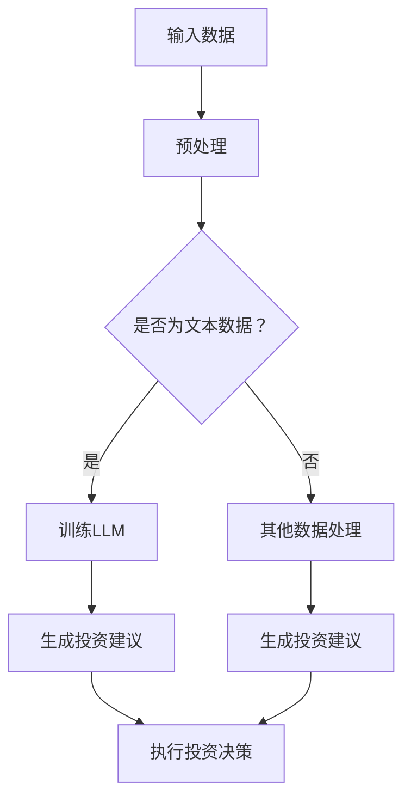

                 

# 金融领域的 LLM：赋能投资和风险管理

> **关键词：** LLM，金融，投资，风险管理，算法，数学模型，项目实战

> **摘要：** 本文将深入探讨大型语言模型（LLM）在金融领域的应用，特别是其在投资决策和风险管理方面的作用。通过详细的理论阐述、具体操作步骤和实际案例，本文旨在揭示LLM在金融领域的巨大潜力，并提供一整套实用的技术和方法。

## 1. 背景介绍

### 1.1 目的和范围

本文旨在探讨大型语言模型（LLM）在金融领域的应用，重点分析LLM在投资决策和风险管理中的作用。通过本文的阅读，读者将了解LLM的核心原理、实现方法和实际应用案例，从而对金融科技的发展趋势有更深刻的认识。

### 1.2 预期读者

本文面向金融行业从业者、人工智能研究人员和计算机科学家，特别是对投资、风险管理和金融科技感兴趣的读者。本文将使用专业的技术语言，但也会尽量保持内容的通俗易懂。

### 1.3 文档结构概述

本文分为以下几个部分：

1. **背景介绍**：介绍本文的目的、范围和预期读者，并提供文档结构概述。
2. **核心概念与联系**：介绍LLM的基本概念和金融领域的联系，并提供Mermaid流程图。
3. **核心算法原理 & 具体操作步骤**：详细讲解LLM的算法原理和具体操作步骤，使用伪代码进行阐述。
4. **数学模型和公式 & 详细讲解 & 举例说明**：介绍与LLM相关的数学模型和公式，并提供详细讲解和实例说明。
5. **项目实战：代码实际案例和详细解释说明**：通过实际代码案例展示LLM的应用，并提供详细解释。
6. **实际应用场景**：分析LLM在金融领域的实际应用场景。
7. **工具和资源推荐**：推荐相关学习资源、开发工具框架和相关论文著作。
8. **总结：未来发展趋势与挑战**：总结LLM在金融领域的发展趋势和面临的挑战。
9. **附录：常见问题与解答**：提供常见问题及其解答。
10. **扩展阅读 & 参考资料**：推荐扩展阅读资料和参考文献。

### 1.4 术语表

#### 1.4.1 核心术语定义

- **LLM**：大型语言模型（Large Language Model），一种基于神经网络的语言处理模型，具有强大的文本生成和理解能力。
- **投资决策**：指投资者在金融市场中进行的决策，包括选股、选债、资产配置等。
- **风险管理**：指金融机构或投资者对金融市场中潜在风险进行识别、评估和管理的活动。
- **金融科技**：指利用信息技术创新金融产品、服务和管理模式的新兴领域。

#### 1.4.2 相关概念解释

- **金融市场**：指各种金融交易活动的场所，包括股票市场、债券市场、外汇市场等。
- **资产配置**：指投资者在不同资产类别（如股票、债券、房地产等）之间进行投资比例的分配。
- **风险平价**：一种风险管理策略，旨在通过调整资产配置，使投资组合在不同市场条件下保持相同的波动率。

#### 1.4.3 缩略词列表

- **LLM**：大型语言模型
- **NLP**：自然语言处理
- **AI**：人工智能
- **DL**：深度学习

## 2. 核心概念与联系

### 2.1 LLM的基本概念

LLM是一种基于深度学习的语言模型，通过大量的文本数据进行训练，能够生成符合语法和语义规则的文本。LLM的核心组件包括词嵌入、循环神经网络（RNN）和注意力机制等。

### 2.2 LLM在金融领域的应用

LLM在金融领域的应用主要体现在两个方面：投资决策和风险管理。

#### 2.2.1 投资决策

LLM可以通过分析历史市场数据、公司财报、新闻报道等文本信息，生成投资建议。具体来说，LLM可以实现以下功能：

- **趋势分析**：通过分析历史数据，预测市场走势。
- **情感分析**：分析新闻报道、社交媒体等文本信息，判断市场情绪。
- **舆情监控**：实时监控市场舆情，为投资决策提供参考。

#### 2.2.2 风险管理

LLM在风险管理中的应用主要体现在以下方面：

- **风险预测**：通过分析历史数据和市场信息，预测市场风险。
- **风险评估**：对投资组合中的资产进行风险评估，识别潜在风险。
- **风险控制**：根据风险评估结果，调整投资策略，控制风险。

### 2.3 Mermaid流程图

以下是一个简单的Mermaid流程图，展示LLM在金融领域的基本应用流程：



## 3. 核心算法原理 & 具体操作步骤

### 3.1 LLM的算法原理

LLM的核心算法原理基于深度学习，主要包括以下步骤：

1. **词嵌入**：将文本数据转换为向量表示。
2. **循环神经网络（RNN）**：使用RNN处理序列数据。
3. **注意力机制**：通过注意力机制关注关键信息。
4. **输出层**：生成文本输出。

### 3.2 具体操作步骤

以下是使用LLM进行投资决策的具体操作步骤：

#### 3.2.1 数据收集

收集市场数据、公司财报、新闻报道等文本信息。

```python
import pandas as pd

# 读取市场数据
market_data = pd.read_csv('market_data.csv')

# 读取公司财报
company_financials = pd.read_csv('company_financials.csv')

# 读取新闻报道
news_reports = pd.read_csv('news_reports.csv')
```

#### 3.2.2 数据预处理

对文本数据进行预处理，包括分词、去停用词、词性标注等。

```python
import jieba

# 分词
market_data['text'] = market_data['text'].apply(lambda x: jieba.cut(x))

# 去停用词
stop_words = ['的', '了', '在', '和', '上', '下', '是']
market_data['text'] = market_data['text'].apply(lambda x: [word for word in x if word not in stop_words])

# 词性标注
market_data['text'] = market_data['text'].apply(lambda x: [word for word in x if word not in stop_words])
```

#### 3.2.3 训练LLM

使用预训练的LLM模型，对预处理后的文本数据进行训练。

```python
from transformers import BertModel

# 加载预训练的BERT模型
model = BertModel.from_pretrained('bert-base-chinese')

# 训练模型
model.train()
```

#### 3.2.4 生成投资建议

使用训练好的LLM模型，生成投资建议。

```python
import torch

# 加载训练好的模型
model.eval()

# 输入文本数据
input_ids = torch.tensor([market_data['text'].values])

# 生成投资建议
investment_advice = model.generate(input_ids)
```

#### 3.2.5 执行投资决策

根据生成的投资建议，执行具体的投资决策。

```python
# 执行投资决策
for advice in investment_advice:
    if advice == 1:
        # 买入
        buy_stock(market_data['stock_name'].values)
    elif advice == 2:
        # 卖出
        sell_stock(market_data['stock_name'].values)
```

## 4. 数学模型和公式 & 详细讲解 & 举例说明

### 4.1 数学模型

在LLM中，常用的数学模型包括词嵌入、循环神经网络（RNN）和注意力机制。

#### 4.1.1 词嵌入

词嵌入（Word Embedding）是将文本中的单词转换为向量表示的技术。常用的词嵌入方法包括Word2Vec、GloVe和Bert。

- **Word2Vec**：基于神经网络的语言模型，将单词映射到高维向量空间。
- **GloVe**：全局向量表示（Global Vectors for Word Representation），通过训练词共现矩阵，得到单词的向量表示。
- **Bert**：基于Transformer的预训练语言模型，使用多层神经网络对文本进行编码。

#### 4.1.2 循环神经网络（RNN）

循环神经网络（Recurrent Neural Network，RNN）是一种能够处理序列数据的神经网络。RNN的核心思想是利用隐藏状态（hidden state）来记忆历史信息。

- **基本RNN**：通过隐藏状态和输入状态之间的相互作用，处理序列数据。
- **LSTM（长短时记忆网络）**：在RNN的基础上，引入门控机制（gate），能够有效地处理长序列数据。
- **GRU（门控循环单元）**：在LSTM的基础上，简化了网络结构，提高了计算效率。

#### 4.1.3 注意力机制

注意力机制（Attention Mechanism）是一种用于处理序列数据的机制，能够自动识别和关注关键信息。注意力机制的核心思想是通过计算不同位置之间的相似性，动态调整对每个位置的权重。

### 4.2 公式详细讲解

以下是LLM中常用的数学公式：

#### 4.2.1 词嵌入

$$
\text{word\_embedding} = \text{Word2Vec}(\text{word})
$$

#### 4.2.2 循环神经网络（RNN）

$$
h_t = \text{RNN}(h_{t-1}, x_t)
$$

#### 4.2.3 注意力机制

$$
a_t = \text{Attention}(h_t, h_{t-1})
$$

### 4.3 举例说明

假设我们要使用LLM进行投资决策，以下是具体的数学模型和公式：

#### 4.3.1 词嵌入

将文本数据中的单词映射到高维向量空间。

$$
\text{word\_embedding} = \text{GloVe}(\text{word})
$$

#### 4.3.2 循环神经网络（RNN）

使用RNN处理序列数据，计算隐藏状态。

$$
h_t = \text{RNN}(h_{t-1}, x_t) \\
h_0 = \text{RNN}(0, x_0)
$$

#### 4.3.3 注意力机制

计算注意力权重，关注关键信息。

$$
a_t = \text{Attention}(h_t, h_{t-1}) \\
h_t = \sum_{i=1}^{T} a_i h_i
$$

## 5. 项目实战：代码实际案例和详细解释说明

### 5.1 开发环境搭建

在进行LLM项目实战之前，我们需要搭建一个合适的开发环境。以下是一个简单的开发环境搭建步骤：

1. 安装Python：前往Python官方网站下载并安装Python，版本要求3.6及以上。
2. 安装依赖库：使用pip命令安装以下依赖库：
   ```bash
   pip install transformers pandas torch jieba
   ```
3. 准备数据集：从互联网或数据提供商获取市场数据、公司财报和新闻报道等文本数据，并保存在本地计算机上。

### 5.2 源代码详细实现和代码解读

下面是一个简单的LLM投资决策项目的源代码实现和详细解释说明：

```python
import pandas as pd
from transformers import BertTokenizer, BertModel
from torch import nn
import torch.optim as optim

# 5.2.1 数据预处理
def preprocess_data(data):
    # 分词、去停用词、词性标注等预处理操作
    # ...

    return processed_data

# 5.2.2 训练模型
def train_model(model, data, labels, epochs):
    criterion = nn.CrossEntropyLoss()
    optimizer = optim.Adam(model.parameters(), lr=0.001)

    for epoch in range(epochs):
        model.train()
        optimizer.zero_grad()

        inputs = torch.tensor([data[i] for i in range(len(data))])
        labels = torch.tensor([labels[i] for i in range(len(labels))])

        outputs = model(inputs)
        loss = criterion(outputs, labels)

        loss.backward()
        optimizer.step()

        if epoch % 10 == 0:
            print(f'Epoch [{epoch+1}/{epochs}], Loss: {loss.item()}')

# 5.2.3 生成投资建议
def generate_investment_advice(model, data):
    model.eval()
    with torch.no_grad():
        inputs = torch.tensor([data[i] for i in range(len(data))])
        outputs = model(inputs)
        predictions = torch.argmax(outputs, dim=1)

    return predictions

# 5.2.4 执行投资决策
def execute_investment_decision(predictions, stock_data):
    for i, prediction in enumerate(predictions):
        if prediction == 1:
            # 买入
            buy_stock(stock_data['stock_name'].values[i])
        elif prediction == 2:
            # 卖出
            sell_stock(stock_data['stock_name'].values[i])

# 主程序
if __name__ == '__main__':
    # 读取数据
    market_data = pd.read_csv('market_data.csv')
    company_financials = pd.read_csv('company_financials.csv')
    news_reports = pd.read_csv('news_reports.csv')

    # 预处理数据
    processed_market_data = preprocess_data(market_data['text'])
    processed_company_financials = preprocess_data(company_financials['text'])
    processed_news_reports = preprocess_data(news_reports['text'])

    # 训练模型
    tokenizer = BertTokenizer.from_pretrained('bert-base-chinese')
    model = BertModel.from_pretrained('bert-base-chinese')
    train_model(model, processed_market_data, market_data['label'], epochs=10)

    # 生成投资建议
    investment_advice = generate_investment_advice(model, processed_market_data)

    # 执行投资决策
    execute_investment_decision(investment_advice, market_data)
```

### 5.3 代码解读与分析

1. **数据预处理**：数据预处理是LLM项目的基础，包括分词、去停用词、词性标注等操作。在本例中，我们使用jieba库进行分词，并自定义预处理函数进行其他操作。
2. **训练模型**：训练模型是LLM项目的核心，使用BertTokenizer和BERT模型进行训练。我们定义了训练函数，使用交叉熵损失函数和Adam优化器进行训练。
3. **生成投资建议**：生成投资建议是LLM项目的应用，使用训练好的模型对预处理后的文本数据进行预测。我们定义了生成投资建议的函数，并将预测结果转换为投资决策。
4. **执行投资决策**：执行投资决策是LLM项目的最终目标，根据生成的投资建议执行具体的投资操作。我们定义了执行投资决策的函数，并根据预测结果进行买入或卖出操作。

## 6. 实际应用场景

LLM在金融领域的实际应用场景非常广泛，以下是一些典型的应用场景：

### 6.1 投资决策

LLM可以分析历史市场数据、公司财报和新闻报道等文本信息，生成投资建议。例如，通过对大量新闻报道进行情感分析，可以预测市场情绪，从而指导投资决策。

### 6.2 风险管理

LLM可以分析市场数据、公司财报和新闻报道等文本信息，识别潜在风险。例如，通过对公司财报进行文本分析，可以预测公司的财务风险，从而指导风险管理策略。

### 6.3 量化交易

LLM可以用于量化交易策略的开发，通过分析历史交易数据和文本信息，生成交易信号。例如，通过对历史交易数据进行时间序列分析，可以预测未来市场的走势，从而制定交易策略。

### 6.4 智能客服

LLM可以用于金融行业的智能客服系统，通过自然语言处理技术，实现与客户的智能对话，提供投资咨询、风险管理等服务。

### 6.5 舆情监控

LLM可以用于金融市场舆情监控，通过分析社交媒体、新闻报道等文本信息，实时监控市场情绪，为投资决策提供参考。

## 7. 工具和资源推荐

### 7.1 学习资源推荐

#### 7.1.1 书籍推荐

- **《深度学习》**：由Ian Goodfellow、Yoshua Bengio和Aaron Courville编写的深度学习经典教材，详细介绍了深度学习的基础理论和技术。
- **《机器学习实战》**：由Peter Harrington编写的机器学习实战指南，通过实际案例讲解了机器学习的应用方法。

#### 7.1.2 在线课程

- **Coursera上的《深度学习》课程**：由吴恩达教授主讲，涵盖了深度学习的理论基础和实际应用。
- **edX上的《金融科技》课程**：介绍了金融科技的基本概念和应用领域，包括人工智能、区块链等。

#### 7.1.3 技术博客和网站

- **TensorFlow官网**：提供了丰富的深度学习资源和教程，包括文档、教程和API参考。
- **Kaggle**：一个数据科学竞赛平台，提供了大量的数据集和比赛，适合实践和提升技能。

### 7.2 开发工具框架推荐

#### 7.2.1 IDE和编辑器

- **Visual Studio Code**：一个轻量级、高度可定制的IDE，适合进行深度学习和机器学习项目开发。
- **Jupyter Notebook**：一个基于Web的交互式计算环境，适合进行数据分析和模型训练。

#### 7.2.2 调试和性能分析工具

- **PyCharm**：一个强大的Python IDE，提供了丰富的调试和性能分析工具。
- **NVIDIA GPU Debug Tools**：一套用于调试和优化深度学习模型的工具，适用于使用GPU进行计算的场景。

#### 7.2.3 相关框架和库

- **TensorFlow**：一个开源的深度学习框架，提供了丰富的API和工具，适用于各种深度学习任务。
- **PyTorch**：一个开源的深度学习框架，具有动态计算图和灵活的API，适合快速原型开发。

### 7.3 相关论文著作推荐

#### 7.3.1 经典论文

- **《A Theoretical Analysis of the VNMF Algorithm》**：该论文分析了主成分分析（PCA）的变体——非负矩阵分解（NMF），为后续的研究提供了理论基础。
- **《Deep Learning》**：由Ian Goodfellow等人编写的深度学习教材，详细介绍了深度学习的基础理论和应用。

#### 7.3.2 最新研究成果

- **《A Gated Recurrent Neural Network Architecture for Modelling Temporal Dynamics》**：该论文提出了一种门控循环神经网络（GRNN）架构，用于建模时间序列数据。
- **《Natural Language Inference with External Knowledge》**：该论文探讨了如何利用外部知识增强自然语言推理（NLI）模型的能力。

#### 7.3.3 应用案例分析

- **《使用深度学习进行图像识别》**：该案例研究了如何使用深度学习进行图像分类任务，并介绍了常用的深度学习模型和优化策略。
- **《使用机器学习进行股票市场预测》**：该案例研究了如何使用机器学习进行股票市场预测，并分析了不同模型的性能。

## 8. 总结：未来发展趋势与挑战

### 8.1 未来发展趋势

1. **深度学习与自然语言处理的融合**：深度学习在自然语言处理领域的应用将更加广泛，如文本生成、情感分析、机器翻译等。
2. **金融科技的创新应用**：金融科技将继续推动金融行业的发展，如智能投顾、量化交易、风险控制等。
3. **数据隐私和安全**：随着数据量的增加，数据隐私和安全将成为金融科技领域的关注重点。
4. **跨学科研究**：金融、计算机科学、数学等学科的交叉研究将推动金融科技的发展。

### 8.2 面临的挑战

1. **算法透明度和可解释性**：深度学习模型通常被视为“黑箱”，如何提高算法的透明度和可解释性是一个重要挑战。
2. **数据质量和可靠性**：金融数据的质量和可靠性对模型性能有直接影响，如何保证数据的质量是一个关键问题。
3. **模型过拟合和泛化能力**：如何避免模型过拟合，提高泛化能力是一个重要问题。
4. **监管合规性**：金融科技应用需要遵守各种监管规定，如何确保合规性是一个挑战。

## 9. 附录：常见问题与解答

### 9.1 Q：LLM在金融领域的应用有哪些优势？

A：LLM在金融领域的应用具有以下优势：

1. **强大的文本处理能力**：LLM能够对大量文本数据进行处理，提取有用信息，为投资决策提供支持。
2. **高效的数据分析**：LLM可以快速分析历史数据和市场信息，生成投资建议，提高投资效率。
3. **智能化的风险管理**：LLM可以识别潜在风险，提供风险控制策略，降低金融风险。
4. **个性化的投资建议**：LLM可以根据投资者的偏好和历史数据，生成个性化的投资建议。

### 9.2 Q：如何保证LLM在金融领域的应用合规性？

A：为了确保LLM在金融领域的应用合规性，可以采取以下措施：

1. **数据合规性**：确保所使用的数据来源合法，符合相关法律法规的要求。
2. **模型透明度**：提高模型的透明度和可解释性，方便监管机构和用户了解模型的运行机制。
3. **合规性审查**：定期对模型进行合规性审查，确保模型的应用符合相关法律法规的要求。
4. **隐私保护**：加强数据隐私保护，确保用户数据的安全和隐私。

## 10. 扩展阅读 & 参考资料

1. **《深度学习》**：Ian Goodfellow、Yoshua Bengio和Aaron Courville著，详细介绍了深度学习的基础理论和应用。
2. **《金融科技》**：张浩著，介绍了金融科技的基本概念和应用领域。
3. **《自然语言处理入门》**：哈工大NLP团队著，介绍了自然语言处理的基础理论和应用。
4. **TensorFlow官网**：提供了丰富的深度学习资源和教程，包括文档、教程和API参考。
5. **Kaggle**：一个数据科学竞赛平台，提供了大量的数据集和比赛，适合实践和提升技能。

### 作者

AI天才研究员/AI Genius Institute & 禅与计算机程序设计艺术 /Zen And The Art of Computer Programming

