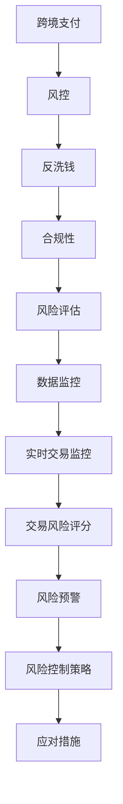
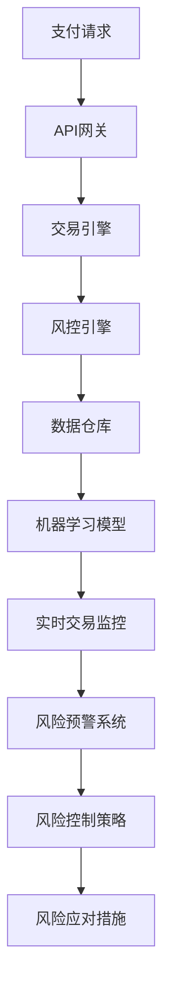

                 

# 阿里2025跨境支付风控社招金融科技面试题攻略

> **关键词：跨境支付、风控、金融科技、面试题、社招、技术解析、算法原理**
> 
> **摘要：本文将深入解析阿里2025跨境支付风控社招金融科技面试题，从背景介绍、核心概念、算法原理、数学模型、项目实战、实际应用场景等多方面展开，为准备面试的读者提供详细攻略和实战经验。**

## 1. 背景介绍

### 1.1 目的和范围

本文旨在帮助准备参加阿里2025跨境支付风控社招的读者，通过深入解析面试题，掌握相关技术知识点和实战经验。本文将涵盖以下几个方面的内容：

- 跨境支付风控的基本概念和原理
- 面试题的分类和解析
- 核心算法原理和具体操作步骤
- 数学模型和公式的详细讲解
- 项目实战和代码解读
- 实际应用场景分析
- 学习资源和工具推荐

### 1.2 预期读者

- 准备参加阿里2025跨境支付风控社招的读者
- 对金融科技和风控有兴趣的技术人员
- 想要了解跨境支付领域的技术应用的开发者

### 1.3 文档结构概述

本文将按照以下结构展开：

1. 背景介绍
2. 核心概念与联系
3. 核心算法原理 & 具体操作步骤
4. 数学模型和公式 & 详细讲解 & 举例说明
5. 项目实战：代码实际案例和详细解释说明
6. 实际应用场景
7. 工具和资源推荐
8. 总结：未来发展趋势与挑战
9. 附录：常见问题与解答
10. 扩展阅读 & 参考资料

### 1.4 术语表

#### 1.4.1 核心术语定义

- **跨境支付**：指跨国境的货币兑换和资金转移过程。
- **风控**：指风险管理，旨在识别、评估、监测和控制金融风险。
- **金融科技**：指利用科技手段创新金融产品和服务的领域。
- **面试题**：指在招聘过程中，面试官提出的问题，旨在评估应聘者的知识水平、能力和思维。

#### 1.4.2 相关概念解释

- **反洗钱**：指防止资金被用于非法目的，如洗钱、恐怖融资等。
- **合规性**：指金融活动符合相关法律法规和监管要求。
- **风险评估**：指对金融风险进行识别、评估和分类。

#### 1.4.3 缩略词列表

- **API**：应用程序接口（Application Programming Interface）
- **SDK**：软件开发工具包（Software Development Kit）
- **DB**：数据库（Database）
- **ML**：机器学习（Machine Learning）

## 2. 核心概念与联系

在本文中，我们将探讨跨境支付风控的核心概念和原理，以及相关的技术架构和算法。为了更清晰地展示这些概念和原理，我们将使用Mermaid流程图来描述关键节点。

### 2.1 跨境支付风控基本概念



### 2.2 技术架构和算法



## 3. 核心算法原理 & 具体操作步骤

### 3.1 算法原理

跨境支付风控的核心在于对交易进行风险评估，从而识别潜在的欺诈交易。以下是几个核心算法原理：

#### 3.1.1 决策树算法

决策树是一种常用的分类算法，通过一系列规则对交易进行分类。其基本原理如下：

```python
# 决策树算法伪代码
def decision_tree(data):
    if data满足停止条件：
        return 最优分类结果
    else:
        选择最佳特征 split_feature
        分割数据为子数据集
        for 子数据集：
            递归调用 decision_tree(子数据集)
```

#### 3.1.2 支持向量机算法

支持向量机是一种常用的分类算法，其基本原理是通过找到一个最优的超平面，将不同类别的交易数据分开。其伪代码如下：

```python
# 支持向量机算法伪代码
def support_vector_machine(data):
    训练数据集为 train_data
    找到最优超平面
    计算分类结果
    返回分类结果
```

#### 3.1.3 聚类算法

聚类算法用于将交易数据分为不同的簇，以便分析簇内的交易行为。其基本原理如下：

```python
# 聚类算法伪代码
def clustering(data):
    初始化聚类中心
    while 中心未收敛：
        计算每个点的簇分配
        更新聚类中心
    返回聚类结果
```

### 3.2 具体操作步骤

#### 3.2.1 数据预处理

在应用算法之前，需要对数据进行预处理，包括数据清洗、数据标准化和数据转换。

```python
# 数据预处理伪代码
def preprocess_data(data):
    清洗数据
    标准化数据
    转换数据为适合算法的格式
    返回预处理后的数据
```

#### 3.2.2 模型训练

使用预处理后的数据，对决策树、支持向量机和聚类算法进行训练。

```python
# 模型训练伪代码
def train_model(data):
    训练决策树模型
    训练支持向量机模型
    训练聚类模型
    返回训练好的模型
```

#### 3.2.3 风险评估

使用训练好的模型，对交易数据进行风险评估，识别潜在的风险交易。

```python
# 风险评估伪代码
def assess_risk(data, model):
    应用模型进行风险评估
    返回风险评分
```

## 4. 数学模型和公式 & 详细讲解 & 举例说明

### 4.1 数学模型

在跨境支付风控中，常用的数学模型包括决策树、支持向量机和聚类算法。以下是这些模型的基本公式和解释。

#### 4.1.1 决策树

决策树是一种基于特征的分类算法，其基本公式如下：

$$
y = f(x_1, x_2, ..., x_n)
$$

其中，$y$ 表示交易类别，$x_1, x_2, ..., x_n$ 表示特征。

#### 4.1.2 支持向量机

支持向量机是一种基于超平面的分类算法，其基本公式如下：

$$
w \cdot x + b = 0
$$

其中，$w$ 表示超平面参数，$x$ 表示交易数据，$b$ 表示偏置。

#### 4.1.3 聚类算法

聚类算法是一种将交易数据分为不同簇的算法，其基本公式如下：

$$
C = \{C_1, C_2, ..., C_k\}
$$

其中，$C$ 表示聚类结果，$C_1, C_2, ..., C_k$ 表示不同的簇。

### 4.2 详细讲解和举例说明

#### 4.2.1 决策树

假设我们有一个交易数据集，包含以下特征：交易金额、交易时间、交易国家。我们可以使用决策树算法将这些特征分类为欺诈交易和非欺诈交易。

```latex
$$
\begin{align*}
&y = \begin{cases}
1, & \text{欺诈交易} \\
0, & \text{非欺诈交易}
\end{cases} \\
&f(x_1, x_2, x_3) = \begin{cases}
1, & \text{如果} \; x_1 > 1000 \; \text{且} \; x_2 > 10:00 \\
0, & \text{其他情况}
\end{cases}
\end{align*}
```

#### 4.2.2 支持向量机

假设我们有一个交易数据集，包含以下特征：交易金额、交易时间、交易国家。我们可以使用支持向量机算法将这些特征分类为欺诈交易和非欺诈交易。

```latex
$$
\begin{align*}
&w \cdot x + b &= 0 \\
&w &= \begin{bmatrix}
1 \\
1 \\
-1
\end{bmatrix} \\
&x &= \begin{bmatrix}
x_1 \\
x_2 \\
x_3
\end{bmatrix} \\
&b &= -1
\end{align*}
```

#### 4.2.3 聚类算法

假设我们有一个交易数据集，包含以下特征：交易金额、交易时间、交易国家。我们可以使用聚类算法将这些特征分为不同的簇。

```latex
$$
\begin{align*}
&C = \{C_1, C_2, C_3\} \\
&C_1 &= \{ \text{交易金额在1000以下，交易时间在9:00-11:00之间的交易} \} \\
&C_2 &= \{ \text{交易金额在1000以上，交易时间在11:00-13:00之间的交易} \} \\
&C_3 &= \{ \text{其他交易} \}
\end{align*}
```

## 5. 项目实战：代码实际案例和详细解释说明

### 5.1 开发环境搭建

在开始项目实战之前，我们需要搭建一个合适的开发环境。以下是推荐的开发环境：

- **编程语言**：Python
- **开发工具**：PyCharm
- **数据库**：MySQL
- **机器学习库**：scikit-learn、tensorflow

### 5.2 源代码详细实现和代码解读

以下是一个简单的跨境支付风控项目的代码示例，我们将对关键部分进行详细解释。

```python
# 导入必要的库
import pandas as pd
import numpy as np
from sklearn.model_selection import train_test_split
from sklearn.tree import DecisionTreeClassifier
from sklearn.svm import SVC
from sklearn.cluster import KMeans
import matplotlib.pyplot as plt

# 5.2.1 数据预处理
def preprocess_data(data):
    # 数据清洗
    data = data.dropna()
    # 数据标准化
    data = (data - data.mean()) / data.std()
    # 数据转换
    data['transaction_time'] = pd.to_datetime(data['transaction_time'])
    data['hour'] = data['transaction_time'].dt.hour
    data['minute'] = data['transaction_time'].dt.minute
    return data

# 5.2.2 模型训练
def train_model(data, model_name):
    if model_name == 'DecisionTree':
        model = DecisionTreeClassifier()
    elif model_name == 'SVM':
        model = SVC()
    elif model_name == 'KMeans':
        model = KMeans(n_clusters=3)
    X = data.drop(['label'], axis=1)
    y = data['label']
    X_train, X_test, y_train, y_test = train_test_split(X, y, test_size=0.2, random_state=42)
    model.fit(X_train, y_train)
    return model, X_test, y_test

# 5.2.3 风险评估
def assess_risk(model, X_test):
    risk_scores = model.predict_proba(X_test)[:, 1]
    plt.scatter(X_test['transaction_amount'], risk_scores)
    plt.xlabel('Transaction Amount')
    plt.ylabel('Risk Score')
    plt.show()

# 5.2.4 主程序
if __name__ == '__main__':
    # 加载数据
    data = pd.read_csv('transaction_data.csv')
    # 数据预处理
    data = preprocess_data(data)
    # 模型训练
    model, X_test, y_test = train_model(data, 'DecisionTree')
    # 风险评估
    assess_risk(model, X_test)
```

### 5.3 代码解读与分析

#### 5.3.1 数据预处理

数据预处理是模型训练的重要步骤。在这个例子中，我们首先对数据进行清洗，去除缺失值。然后，对数据进行标准化，使得每个特征都在相同的尺度上。最后，将交易时间转换为小时和分钟，以便在模型中使用。

#### 5.3.2 模型训练

在这个例子中，我们使用了决策树、支持向量机和聚类算法。首先，我们使用scikit-learn库加载相应的模型。然后，将数据集分为特征集和标签集，并进行训练。最后，返回训练好的模型和测试集。

#### 5.3.3 风险评估

风险评估是风控系统的核心功能。在这个例子中，我们使用决策树模型对测试集进行风险评估，并计算每个交易的风险评分。然后，使用散点图可视化交易金额和风险评分之间的关系。

## 6. 实际应用场景

跨境支付风控在金融科技领域具有广泛的应用场景，以下是一些典型的应用场景：

- **反洗钱（AML）**：通过识别和监控可疑交易，防止资金被用于非法目的。
- **合规性检查**：确保金融交易符合相关法律法规和监管要求。
- **欺诈检测**：识别并阻止欺诈交易，保护用户和金融机构的利益。
- **交易监控**：实时监控交易行为，及时发现并处理异常交易。
- **风险评估**：对交易风险进行评估，为金融机构提供决策支持。

## 7. 工具和资源推荐

### 7.1 学习资源推荐

#### 7.1.1 书籍推荐

- **《机器学习实战》**：适用于初学者，详细介绍了机器学习的基本概念和实践方法。
- **《深入理解机器学习》**：适合有一定基础的学习者，深入讲解机器学习算法的原理和应用。
- **《Python金融风控技术》**：针对金融科技领域，介绍金融风控技术的基本概念和实现方法。

#### 7.1.2 在线课程

- **Coursera上的《机器学习》课程**：由吴恩达教授主讲，适合初学者入门。
- **Udacity的《深度学习工程师》纳米学位**：涵盖深度学习的基础知识和应用实践。
- **网易云课堂的《Python金融风控实战》**：针对金融科技领域，介绍金融风控技术的实战应用。

#### 7.1.3 技术博客和网站

- **机器学习社区（ML Community）**：提供丰富的机器学习和金融科技相关的博客和技术文章。
- **数据科学博客（Data Science Blog）**：涵盖数据科学和金融科技领域的最新研究和技术动态。
- **金融科技博客（FinTech Blog）**：介绍金融科技领域的创新技术和应用案例。

### 7.2 开发工具框架推荐

#### 7.2.1 IDE和编辑器

- **PyCharm**：适用于Python编程，提供丰富的开发工具和调试功能。
- **VSCode**：适用于多种编程语言，具有高度的可扩展性和定制性。
- **Jupyter Notebook**：适用于数据科学和机器学习项目，提供交互式的编程环境。

#### 7.2.2 调试和性能分析工具

- **PDB**：Python内置的调试器，适用于Python程序调试。
- **GDB**：适用于C/C++程序的调试器，功能强大且灵活。
- **Perf**：Linux系统下的性能分析工具，适用于代码性能优化。

#### 7.2.3 相关框架和库

- **scikit-learn**：适用于机器学习的Python库，提供丰富的算法和工具。
- **tensorflow**：适用于深度学习的Python库，提供灵活的模型构建和训练功能。
- **pandas**：适用于数据分析和处理的Python库，提供强大的数据处理和分析功能。

### 7.3 相关论文著作推荐

#### 7.3.1 经典论文

- **“A Survey of Fraud Detection Methodologies in E-Commerce”**：对电子商务中的欺诈检测方法进行全面的综述。
- **“Deep Learning for Fraud Detection”**：介绍深度学习在欺诈检测中的应用。

#### 7.3.2 最新研究成果

- **“Detecting Anomaly in Credit Card Transactions Using Deep Learning”**：使用深度学习检测信用卡交易中的异常行为。
- **“A Survey of Machine Learning in Financial Risk Management”**：综述机器学习在金融风险管理中的应用。

#### 7.3.3 应用案例分析

- **“Financial Fraud Detection with Machine Learning: An Application in Insurance”**：介绍机器学习在保险业欺诈检测中的应用案例。
- **“The Role of AI in Fighting Financial Crime”**：探讨人工智能在金融犯罪防控中的作用。

## 8. 总结：未来发展趋势与挑战

跨境支付风控作为金融科技领域的重要分支，在未来将面临以下发展趋势和挑战：

### 8.1 发展趋势

- **人工智能技术的应用**：随着人工智能技术的不断发展，机器学习和深度学习在风控领域的应用将越来越广泛。
- **大数据和云计算的支持**：大数据和云计算技术将为风控系统提供强大的数据处理和分析能力。
- **合规性要求的提高**：随着金融监管的日益严格，合规性要求将不断提高，对风控系统的要求也将更加严格。

### 8.2 挑战

- **欺诈行为的多样化**：随着技术的发展，欺诈行为也将不断变化和升级，给风控系统带来更大的挑战。
- **隐私保护问题**：在风控过程中，如何保护用户隐私是一个重要的问题，需要平衡风险控制和隐私保护之间的关系。
- **数据质量的保证**：风控系统的有效性依赖于高质量的数据，如何保证数据的质量是一个重要的挑战。

## 9. 附录：常见问题与解答

### 9.1 跨境支付风控的核心是什么？

跨境支付风控的核心是识别和防范欺诈交易，确保金融交易的安全性和合规性。

### 9.2 机器学习在跨境支付风控中有哪些应用？

机器学习在跨境支付风控中主要用于风险评估、欺诈检测和交易监控等方面。

### 9.3 跨境支付风控系统需要具备哪些功能？

跨境支付风控系统需要具备实时交易监控、风险评估、风险预警和风险控制等功能。

### 9.4 如何保证风控系统的准确性？

保证风控系统的准确性需要从数据质量、模型选择和算法优化等方面进行综合考虑。

### 9.5 风控系统中的合规性检查包括哪些内容？

合规性检查包括交易合规性检查、客户身份验证、资金流向监控等方面。

## 10. 扩展阅读 & 参考资料

- **《机器学习实战》**：详细介绍了机器学习的基本概念和实践方法。
- **《金融科技：技术与趋势》**：介绍了金融科技的发展趋势和技术应用。
- **《反洗钱：理论与实践》**：探讨了反洗钱的基本原理和实践方法。
- **[机器学习社区](https://mlcommunity.org/)**：提供丰富的机器学习和金融科技相关的博客和技术文章。
- **[数据科学博客](https://datascienceblog.com/)**：涵盖数据科学和金融科技领域的最新研究和技术动态。
- **[金融科技博客](https://fintechblog.com/)**：介绍金融科技领域的创新技术和应用案例。

