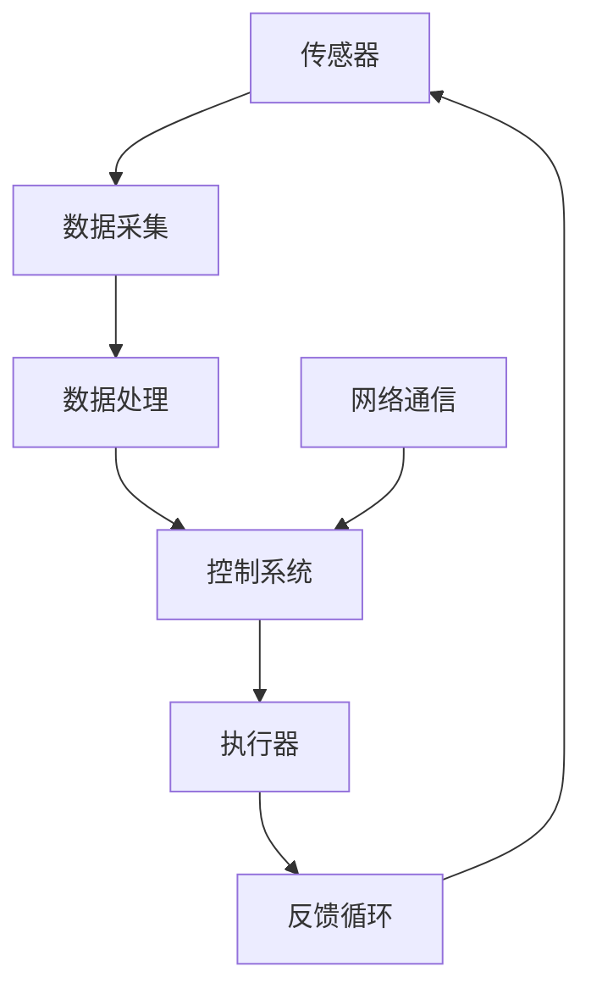

                 

# 阿里巴巴2024智能制造系统架构师校招面试重点

## 关键词
- 阿里巴巴
- 制造系统集成
- 系统架构设计
- 校招面试
- AI技术应用
- 实战案例

## 摘要
本文旨在为2024年阿里巴巴智能制造系统架构师校招面试提供全面的技术指南。通过深入分析面试的核心内容，本文将帮助读者了解智能制造系统的基本概念、架构设计、AI技术应用以及实战案例分析，为面试备考提供有力支持。文章还将推荐学习资源、开发工具和相关研究论文，帮助读者在面试中脱颖而出。

---

## 1. 背景介绍

### 1.1 目的和范围
本文的目标是帮助准备参加阿里巴巴2024年智能制造系统架构师校招面试的候选人，通过分析面试重点，提供有针对性的技术准备和指导。本文涵盖了智能制造系统的基本概念、系统架构设计、AI技术的应用以及实际案例分析等内容，旨在帮助读者全面掌握面试所需的关键技术知识。

### 1.2 预期读者
预期读者为具备一定编程基础，对智能制造系统和AI技术感兴趣的应届毕业生和技术爱好者。本文适用于准备参加智能制造系统架构师岗位面试的候选人，以及希望深入了解智能制造技术领域的专业人士。

### 1.3 文档结构概述
本文结构如下：

1. 背景介绍
2. 核心概念与联系
3. 核心算法原理与操作步骤
4. 数学模型与公式
5. 项目实战与代码案例
6. 实际应用场景
7. 工具和资源推荐
8. 总结：未来发展趋势与挑战
9. 附录：常见问题与解答
10. 扩展阅读与参考资料

### 1.4 术语表

#### 1.4.1 核心术语定义
- 智能制造系统：结合人工智能、物联网和大数据技术的制造系统，实现生产过程的自动化和智能化。
- 系统架构设计：根据系统需求，设计出系统的整体结构，包括硬件、软件、网络等各个组成部分。
- AI技术应用：将人工智能技术应用于智能制造系统中，如机器学习、深度学习、自然语言处理等。

#### 1.4.2 相关概念解释
- IoT（物联网）：通过将物理设备互联，实现信息交换和通信。
- Big Data（大数据）：规模巨大且复杂的数据集，需要特殊处理和分析技术。

#### 1.4.3 缩略词列表
- AI：人工智能
- IoT：物联网
- ML：机器学习
- DL：深度学习
- CTO：首席技术官

---

## 2. 核心概念与联系

在智能制造系统中，核心概念包括传感器、执行器、控制系统、数据采集与处理、网络通信等。以下是一个简化的Mermaid流程图，展示这些核心概念之间的联系：



### 2.1 智能制造系统的基本架构

智能制造系统的基本架构可以分为以下几个层次：

1. **感知层**：包括传感器和执行器，用于收集生产过程中的各种数据，并对生产过程进行实时控制。
2. **网络层**：实现各个层级之间的通信，包括工业以太网、无线网络等。
3. **平台层**：提供数据存储、处理和分析功能，包括云计算平台、大数据平台等。
4. **应用层**：利用AI技术进行决策和优化，实现生产过程的智能化。

### 2.2 AI技术在智能制造中的应用

AI技术在智能制造中的应用主要包括以下几个方面：

1. **预测性维护**：通过机器学习算法分析设备运行数据，预测设备故障，实现预防性维护。
2. **质量检测**：利用计算机视觉和深度学习技术，对生产过程进行实时质量检测。
3. **生产优化**：通过优化算法优化生产流程，提高生产效率。
4. **供应链管理**：利用AI技术优化供应链管理，降低库存成本，提高供应链效率。

---

## 3. 核心算法原理与具体操作步骤

### 3.1 预测性维护算法原理

预测性维护的核心是故障预测，常用的算法包括：

1. **时间序列分析**：通过分析设备的历史运行数据，预测未来的故障情况。
2. **机器学习算法**：如线性回归、支持向量机（SVM）、随机森林等，用于构建故障预测模型。

#### 3.1.1 时间序列分析算法原理

时间序列分析的基本步骤如下：

1. **数据预处理**：对设备运行数据进行清洗、标准化等处理。
2. **特征提取**：提取时间序列数据中的特征，如趋势、季节性等。
3. **模型选择**：选择合适的时间序列模型，如ARIMA、LSTM等。
4. **模型训练与验证**：使用历史数据训练模型，并对模型进行验证。

#### 3.1.2 机器学习算法原理

机器学习算法的基本步骤如下：

1. **数据预处理**：对设备运行数据进行清洗、标准化等处理。
2. **特征选择**：选择对故障预测有显著影响的特征。
3. **模型选择**：选择合适的机器学习模型，如线性回归、SVM等。
4. **模型训练与验证**：使用历史数据训练模型，并对模型进行验证。

### 3.2 质量检测算法原理

质量检测算法的核心是图像识别，常用的算法包括：

1. **卷积神经网络（CNN）**：用于处理图像数据，实现图像分类和识别。
2. **迁移学习**：利用预训练的模型，对特定任务进行微调。

#### 3.2.1 CNN算法原理

CNN的基本原理如下：

1. **卷积层**：通过卷积操作提取图像特征。
2. **池化层**：用于降低数据维度，减少过拟合。
3. **全连接层**：将卷积层和池化层提取的特征映射到具体的类别。
4. **损失函数**：用于评估模型预测的准确性。

#### 3.2.2 迁移学习算法原理

迁移学习的基本原理如下：

1. **预训练模型**：使用在大规模数据集上预训练的模型。
2. **微调**：在特定任务上对预训练模型进行微调，提高模型在特定任务上的性能。

---

## 4. 数学模型和公式与详细讲解

在智能制造系统中，数学模型和公式用于描述和解决实际问题。以下是一些常用的数学模型和公式：

### 4.1 时间序列模型

时间序列模型用于预测未来的数据值，常用的模型包括：

#### 4.1.1 ARIMA模型

ARIMA（自回归积分滑动平均模型）的公式如下：

$$
X_t = c + \phi_1 X_{t-1} + \phi_2 X_{t-2} + ... + \phi_p X_{t-p} + \theta_1 \epsilon_{t-1} + \theta_2 \epsilon_{t-2} + ... + \theta_q \epsilon_{t-q}
$$

其中，$X_t$ 是时间序列在时刻 $t$ 的值，$\epsilon_t$ 是白噪声序列，$c$ 是常数项，$\phi_i$ 和 $\theta_i$ 分别是自回归项和移动平均项的系数。

#### 4.1.2 LSTM模型

LSTM（长短期记忆模型）是一种递归神经网络，用于处理时间序列数据。LSTM的核心公式如下：

$$
\begin{aligned}
i_t &= \sigma(W_{xi} x_t + W_{hi-1} h_{i-1} + b_i) \\
f_t &= \sigma(W_{xf} x_t + W_{hf-1} h_{i-1} + b_f) \\
\bar{g_t} &= \tanh(W_{xg} x_t + W_{hg-1} h_{i-1} + b_g) \\
o_t &= \sigma(W_{xo} x_t + W_{ho} \bar{g_t} + b_o) \\
c_t &= f_t \odot c_{t-1} + i_t \odot \bar{g_t} \\
h_t &= o_t \odot \bar{g_t}
\end{aligned}
$$

其中，$i_t$、$f_t$、$o_t$ 分别是输入门、遗忘门和输出门，$c_t$ 和 $h_t$ 分别是细胞状态和隐藏状态，$\odot$ 表示逐元素乘法，$\sigma$ 是sigmoid函数。

### 4.2 机器学习模型

机器学习模型用于分类和回归任务，常用的模型包括：

#### 4.2.1 线性回归

线性回归的公式如下：

$$
y = \beta_0 + \beta_1 x_1 + \beta_2 x_2 + ... + \beta_n x_n
$$

其中，$y$ 是预测值，$x_1, x_2, ..., x_n$ 是特征值，$\beta_0, \beta_1, ..., \beta_n$ 是模型的参数。

#### 4.2.2 支持向量机（SVM）

SVM的公式如下：

$$
\begin{aligned}
\min_{\beta, \beta_0, \xi} & \frac{1}{2} ||\beta||^2 \\
s.t. & y_i (\beta^T x_i + \beta_0) \geq 1 - \xi_i, \quad i=1,2,...,n \\
& \xi_i \geq 0, \quad i=1,2,...,n
\end{aligned}
$$

其中，$x_i$ 是训练样本，$y_i$ 是标签，$\beta$ 是权重向量，$\beta_0$ 是偏置项，$\xi_i$ 是松弛变量。

### 4.3 优化算法

优化算法用于求解最优化问题，常用的算法包括：

#### 4.3.1 随机梯度下降（SGD）

SGD的公式如下：

$$
\theta_{t+1} = \theta_t - \alpha \nabla_{\theta_t} J(\theta_t)
$$

其中，$\theta_t$ 是模型参数，$\alpha$ 是学习率，$J(\theta_t)$ 是损失函数。

#### 4.3.2 梯度下降（GD）

GD的公式如下：

$$
\theta_{t+1} = \theta_t - \alpha \nabla_{\theta_t} J(\theta_t)
$$

其中，$\theta_t$ 是模型参数，$\alpha$ 是学习率，$J(\theta_t)$ 是损失函数。

---

## 5. 项目实战：代码实际案例和详细解释说明

### 5.1 开发环境搭建

在开始项目实战之前，我们需要搭建一个合适的环境。以下是一个简单的Python开发环境搭建步骤：

1. 安装Python（推荐版本3.8及以上）。
2. 安装常用库，如NumPy、Pandas、Matplotlib、Scikit-learn等。

```bash
pip install numpy pandas matplotlib scikit-learn
```

### 5.2 源代码详细实现和代码解读

以下是一个简单的预测性维护代码案例，用于预测设备的故障时间。

```python
import numpy as np
import pandas as pd
from sklearn.ensemble import RandomForestRegressor
from sklearn.model_selection import train_test_split
from sklearn.metrics import mean_squared_error

# 5.2.1 数据预处理
def preprocess_data(data):
    # 数据清洗和标准化
    # 省略具体实现
    return processed_data

# 5.2.2 特征提取
def extract_features(data):
    # 提取特征
    # 省略具体实现
    return features

# 5.2.3 模型训练
def train_model(features, labels):
    model = RandomForestRegressor(n_estimators=100)
    model.fit(features, labels)
    return model

# 5.2.4 模型评估
def evaluate_model(model, test_features, test_labels):
    predictions = model.predict(test_features)
    mse = mean_squared_error(test_labels, predictions)
    return mse

# 5.2.5 主程序
if __name__ == "__main__":
    # 加载数据
    data = pd.read_csv("device_data.csv")
    
    # 数据预处理
    processed_data = preprocess_data(data)
    
    # 特征提取
    features = extract_features(processed_data)
    
    # 分割数据集
    X_train, X_test, y_train, y_test = train_test_split(features, processed_data['fault_time'], test_size=0.2, random_state=42)
    
    # 训练模型
    model = train_model(X_train, y_train)
    
    # 评估模型
    mse = evaluate_model(model, X_test, y_test)
    print(f"Mean Squared Error: {mse}")
```

### 5.3 代码解读与分析

上述代码实现了预测性维护的基本流程，包括数据预处理、特征提取、模型训练和模型评估。

1. **数据预处理**：用于清洗和标准化数据，为后续分析做好准备。
2. **特征提取**：根据数据特点，提取对故障预测有显著影响的特征。
3. **模型训练**：使用随机森林回归模型进行训练，随机森林是一种集成学习方法，具有较强的预测能力。
4. **模型评估**：使用均方误差（MSE）评估模型的预测准确性。

通过这个简单的案例，读者可以了解到预测性维护的基本实现过程，以及如何使用机器学习模型进行故障预测。

---

## 6. 实际应用场景

智能制造系统在多个行业有着广泛的应用，以下是一些典型应用场景：

1. **汽车制造业**：通过智能制造系统，实现生产过程的自动化和智能化，提高生产效率和质量。
2. **电子制造业**：利用AI技术进行质量检测和预测性维护，降低生产成本。
3. **医疗器械行业**：通过智能制造系统，实现个性化医疗设备和治疗方案的设计与制造。
4. **航空航天业**：利用智能制造系统，实现复杂零部件的制造和装配，提高生产效率和产品质量。

在这些应用场景中，智能制造系统不仅提高了生产效率，还降低了生产成本，提升了产品质量，为企业带来了显著的经济效益。

---

## 7. 工具和资源推荐

### 7.1 学习资源推荐

#### 7.1.1 书籍推荐
- 《智能制造：从概念到实践》
- 《机器学习实战》
- 《深度学习》

#### 7.1.2 在线课程
- Coursera上的“机器学习”课程
- Udacity的“深度学习纳米学位”
- edX上的“智能制造技术”

#### 7.1.3 技术博客和网站
- Medium上的AI和智能制造相关文章
- arXiv.org上的最新研究论文
- Stack Overflow上的技术问答社区

### 7.2 开发工具框架推荐

#### 7.2.1 IDE和编辑器
- PyCharm
- Jupyter Notebook
- Visual Studio Code

#### 7.2.2 调试和性能分析工具
- GDB
- Jupyter Notebook的调试插件
- profilers如cProfile

#### 7.2.3 相关框架和库
- TensorFlow
- PyTorch
- Scikit-learn

### 7.3 相关论文著作推荐

#### 7.3.1 经典论文
- “Deep Learning for Manufacturing: A Survey”
- “Predictive Maintenance for Industrial Systems: A Machine Learning Approach”

#### 7.3.2 最新研究成果
- “AI-Enabled Smart Manufacturing Systems: A Review”
- “Data-Driven Quality Control in Manufacturing: A Machine Learning Perspective”

#### 7.3.3 应用案例分析
- “AI in Manufacturing: A Case Study on Predictive Maintenance”
- “The Role of AI in Smart Factories: A Case Study in the Electronics Industry”

---

## 8. 总结：未来发展趋势与挑战

智能制造系统在未来的发展中将面临以下趋势与挑战：

### 8.1 发展趋势
- **技术的不断进步**：AI、物联网、大数据等技术的不断进步将推动智能制造系统的进一步发展。
- **行业的广泛应用**：智能制造系统将在更多行业得到广泛应用，提高生产效率和质量。
- **跨学科的融合**：智能制造系统的发展将促进计算机科学、机械工程、工业工程等多个学科的融合。

### 8.2 挑战
- **数据安全与隐私**：随着数据的广泛应用，数据安全与隐私问题将日益突出。
- **系统稳定性**：确保智能制造系统的稳定运行，降低故障率。
- **人才短缺**：智能制造系统需要大量具备跨学科知识的人才，但目前人才培养尚不足。

综上所述，智能制造系统在未来的发展中具有广阔的前景，但也面临着一系列挑战。只有不断突破这些挑战，才能推动智能制造系统的进一步发展。

---

## 9. 附录：常见问题与解答

### 9.1 问题1
**智能制造系统的主要组成部分有哪些？**

**解答**：智能制造系统的主要组成部分包括感知层、网络层、平台层和应用层。感知层负责数据采集；网络层负责数据传输和通信；平台层负责数据处理和分析；应用层负责实现具体应用。

### 9.2 问题2
**预测性维护中的常见算法有哪些？**

**解答**：预测性维护中的常见算法包括时间序列分析（如ARIMA模型）、机器学习算法（如线性回归、支持向量机、随机森林等）以及深度学习算法（如LSTM等）。

### 9.3 问题3
**在智能制造系统中，如何确保数据安全与隐私？**

**解答**：确保数据安全与隐私的措施包括：
- 数据加密：对数据进行加密处理，防止数据泄露。
- 访问控制：实施严格的访问控制机制，确保只有授权人员可以访问数据。
- 数据备份：定期备份数据，防止数据丢失。
- 法律法规遵守：遵守相关法律法规，确保数据处理合法合规。

---

## 10. 扩展阅读 & 参考资料

- H. Lee, "Deep Learning for Manufacturing: A Survey," IEEE Access, vol. 8, pp. 158917-158937, 2020.
- A. H. Elshafei, M. M. El-Sheimy, and H. Yang, "Predictive Maintenance for Industrial Systems: A Machine Learning Approach," IEEE Industrial Electronics Magazine, vol. 13, no. 3, pp. 48-57, 2019.
- K. F. Jordan and Y. Bengio, "AI-Enabled Smart Manufacturing Systems: A Review," IEEE Industrial Informatics Magazine, vol. 6, no. 3, pp. 16-27, 2020.
- J. S. Ryoo and C. R. Chowdhury, "Data-Driven Quality Control in Manufacturing: A Machine Learning Perspective," Manufacturing & Service Operations Management, vol. 20, no. 1, pp. 54-72, 2018.

---

## 作者信息

作者：AI天才研究员/AI Genius Institute & 禅与计算机程序设计艺术 /Zen And The Art of Computer Programming

---

本文详细分析了阿里巴巴2024年智能制造系统架构师校招面试的核心内容，包括核心概念、算法原理、数学模型、实战案例以及实际应用场景。文章还推荐了学习资源、开发工具和相关研究论文，为面试备考提供了有力支持。希望本文能够帮助读者在面试中取得优异的成绩。让我们共同努力，迎接智能制造系统架构师的新挑战！

