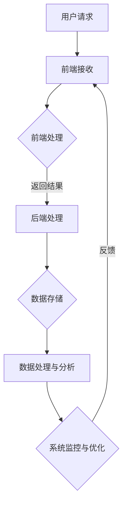

                 

## 阿里巴巴国际站2024校招跨境电商开发面试重点

> **关键词**：阿里巴巴、校招、跨境电商、开发面试、核心技术、实战案例

**摘要**：本文旨在为即将参加阿里巴巴国际站2024校招跨境电商开发岗位的应聘者提供一份全面的面试准备指南。通过深入解析阿里巴巴国际站的业务模式、核心技术、开发流程以及面试重点，本文将帮助读者更好地应对面试挑战，提高通过率。文章结构清晰，从背景介绍、核心概念、算法原理、数学模型、项目实战、实际应用场景等多方面展开，确保读者能够全面掌握跨境电商开发所需的核心知识和技能。

## 1. 背景介绍

### 1.1 目的和范围

本文的目的在于帮助应聘者全面了解阿里巴巴国际站2024校招跨境电商开发岗位的面试重点，从而提高面试通过率。文章将围绕以下几个核心主题展开：

1. **阿里巴巴国际站业务模式**：介绍阿里巴巴国际站的运营模式、核心业务和竞争优势。
2. **跨境电商开发岗位要求**：分析跨境电商开发岗位的核心职责和技术要求。
3. **面试重点解析**：详细解析阿里巴巴国际站校招跨境电商开发面试中的常见题型和重点考察内容。
4. **实战案例分享**：分享实际项目案例，展示如何在面试中展示自己的实际开发能力和项目经验。

### 1.2 预期读者

本文的预期读者主要是：

1. **即将参加阿里巴巴国际站2024校招跨境电商开发岗位面试的应聘者**。
2. **在校大学生和研究生**，希望了解跨境电商开发岗位要求和面试技巧。
3. **对跨境电商和阿里巴巴国际站感兴趣的技术爱好者**。

### 1.3 文档结构概述

本文结构如下：

1. **背景介绍**：介绍文章的目的、范围、预期读者和文档结构。
2. **核心概念与联系**：阐述跨境电商开发岗位所需的核心概念和关键技术，并通过Mermaid流程图展示其架构。
3. **核心算法原理 & 具体操作步骤**：详细讲解跨境电商开发中的核心算法原理，并提供伪代码示例。
4. **数学模型和公式 & 详细讲解 & 举例说明**：介绍跨境电商开发中常用的数学模型和公式，并给出实际应用示例。
5. **项目实战：代码实际案例和详细解释说明**：分享实际项目案例，展示如何在面试中展示自己的开发能力。
6. **实际应用场景**：分析跨境电商开发岗位在实际业务中的应用场景。
7. **工具和资源推荐**：推荐相关学习资源、开发工具和框架。
8. **总结：未来发展趋势与挑战**：总结本文核心观点，展望未来发展趋势和挑战。
9. **附录：常见问题与解答**：提供常见问题的解答。
10. **扩展阅读 & 参考资料**：推荐相关扩展阅读和参考资料。

### 1.4 术语表

#### 1.4.1 核心术语定义

1. **跨境电商**：指在互联网环境下，不同国家之间的商品和服务的交易活动。
2. **开发岗位**：指在跨境电商平台中，负责系统开发、优化和维护的职位。
3. **面试**：指在招聘过程中，雇主对求职者进行的选拔和评估过程。

#### 1.4.2 相关概念解释

1. **阿里巴巴国际站**：阿里巴巴集团旗下的跨境电商平台，为全球买家和卖家提供交易服务。
2. **校招**：指高校招聘，即企业直接在高校中进行的人才选拔活动。
3. **技术面试**：指在招聘过程中，针对应聘者的技术能力和知识水平进行的面试环节。

#### 1.4.3 缩略词列表

- **API**：应用程序接口（Application Programming Interface）
- **DB**：数据库（Database）
- **UI**：用户界面（User Interface）
- **UX**：用户体验（User Experience）
- **SDK**：软件开发工具包（Software Development Kit）

## 2. 核心概念与联系

在跨境电商开发岗位中，理解以下核心概念和联系至关重要：

1. **跨境电商平台架构**：了解跨境电商平台的整体架构，包括前端、后端、数据库和数据流。
2. **技术栈**：熟悉跨境电商开发所需的技术栈，包括前端技术（如HTML、CSS、JavaScript）、后端技术（如Java、Python）、数据库技术（如MySQL、MongoDB）等。
3. **核心算法**：掌握跨境电商开发中的核心算法，如排序算法、查找算法、数据结构算法等。
4. **数据分析和处理**：了解数据分析和处理的基本方法，如数据清洗、数据挖掘、统计分析等。
5. **系统性能优化**：掌握系统性能优化技巧，如缓存机制、数据库优化、代码优化等。

下面是一个Mermaid流程图，展示跨境电商平台的基本架构：



### 2.1. 跨境电商平台架构详解

#### 前端架构

前端负责与用户直接交互，实现页面的展示和交互功能。其主要技术包括：

1. **HTML/CSS**：用于定义页面结构和样式。
2. **JavaScript**：用于实现页面动态效果和交互功能。
3. **前端框架**：如React、Vue、Angular等，用于提升开发效率和代码可维护性。

#### 后端架构

后端负责处理业务逻辑、数据存储和接口调用。其主要技术包括：

1. **后端语言**：如Java、Python、Go等，用于实现业务逻辑。
2. **框架**：如Spring Boot、Django、Flask等，用于简化开发流程。
3. **数据库**：如MySQL、MongoDB、Redis等，用于存储数据。

#### 数据库架构

数据库负责存储和管理数据。其主要技术包括：

1. **关系型数据库**：如MySQL、PostgreSQL等，用于存储结构化数据。
2. **非关系型数据库**：如MongoDB、Redis等，用于存储非结构化数据或缓存数据。

#### 数据流架构

数据流架构涉及数据在不同模块之间的传递和处理。其主要技术包括：

1. **API**：用于前后端数据交互。
2. **消息队列**：如RabbitMQ、Kafka等，用于异步处理数据。
3. **缓存机制**：如Redis等，用于提高系统性能。

### 2.2. 技术栈详解

#### 前端技术栈

1. **HTML/CSS**：用于创建网页结构和样式。
2. **JavaScript**：用于实现网页交互功能。
3. **React/Vue/Angular**：用于构建高效、可维护的前端应用。

#### 后端技术栈

1. **Java/Python/Go**：用于实现业务逻辑。
2. **Spring Boot/Django/Flask**：用于简化后端开发。
3. **MySQL/MongoDB/Redis**：用于存储和管理数据。

#### 数据库技术栈

1. **关系型数据库**：如MySQL、PostgreSQL等。
2. **非关系型数据库**：如MongoDB、Redis等。
3. **数据仓库**：如Hive、Spark等，用于大数据处理。

### 2.3. 核心算法详解

1. **排序算法**：如快速排序、归并排序、冒泡排序等。
2. **查找算法**：如二分查找、哈希查找等。
3. **数据结构算法**：如树、图、队列、栈等。

### 2.4. 数据分析和处理

1. **数据清洗**：去除重复数据、缺失值处理等。
2. **数据挖掘**：如关联规则挖掘、聚类分析等。
3. **统计分析**：如描述性统计、回归分析等。

### 2.5. 系统性能优化

1. **缓存机制**：如Redis缓存、数据库索引等。
2. **数据库优化**：如数据库分片、读写分离等。
3. **代码优化**：如算法优化、代码优化等。

## 3. 核心算法原理 & 具体操作步骤

在跨境电商开发中，掌握核心算法原理和具体操作步骤至关重要。以下将详细讲解排序算法、查找算法和数据结构算法，并给出伪代码示例。

### 3.1. 排序算法

#### 3.1.1. 冒泡排序

冒泡排序是一种简单的排序算法，它通过重复遍历要排序的数列，一次比较两个元素，如果它们的顺序错误就把它们交换过来。

**伪代码**：

```
procedure bubbleSort( A : list of sortable items )
    n = length(A)
    repeat 
        swapped = false 
        for i = 1 to n-1 inclusive do
            if A[i-1] > A[i] then
                swap( A[i-1], A[i] )
                swapped = true
            end if
        end for
        n = n - 1
    until not swapped
end procedure
```

#### 3.1.2. 快速排序

快速排序是一种高效的排序算法，采用分治策略。它通过递归将待排序的序列划分为较小和较大的两部分，然后对这两部分分别进行排序。

**伪代码**：

```
procedure quickSort( A : list of comparable items, low : index, high : index )
    if low < high then
        pi = partition( A, low, high )
        quickSort( A, low, pi-1 )
        quickSort( A, pi+1, high )
    end if
end procedure

function partition( A : list of comparable items, low : index, high : index ) 
    pivot = A[high] 
    i = low - 1
    for j = low to high-1 do
        if A[j] <= pivot then
            i = i + 1
            swap( A[i], A[j] )
        end if
    end for
    swap( A[i+1], A[high] )
    return i + 1
end function
```

### 3.2. 查找算法

#### 3.2.1. 二分查找

二分查找是一种高效的查找算法，它通过递归地将查找范围缩小一半，直到找到目标元素或确定目标元素不存在。

**伪代码**：

```
function binarySearch( A : list of sorted items, key : item ) 
    low = 0
    high = length(A) - 1
    while low <= high do
        mid = (low + high) / 2
        if A[mid] = key then
            return mid
        else if A[mid] < key then
            low = mid + 1
        else
            high = mid - 1
        end if
    end while
    return -1
end function
```

#### 3.2.2. 哈希查找

哈希查找是一种基于哈希表的查找算法，通过计算待查找元素的哈希值，直接定位到元素的位置。

**伪代码**：

```
function hashSearch( A : hashTable, key : item ) 
    hashValue = hashFunction(key)
    index = hashValue % tableSize
    if A[index] = key then
        return index
    else
        return -1
    end if
end function
```

### 3.3. 数据结构算法

#### 3.3.1. 树

树是一种重要的数据结构，用于表示具有层次关系的元素集合。以下是一个简单的二叉搜索树实现：

```
class TreeNode:
    def __init__(self, value):
        self.value = value
        self.left = None
        self.right = None

def insert(root, value):
    if root is None:
        return TreeNode(value)
    if value < root.value:
        root.left = insert(root.left, value)
    else:
        root.right = insert(root.right, value)
    return root

def inorderTraversal(root):
    if root is not None:
        inorderTraversal(root.left)
        print(root.value)
        inorderTraversal(root.right)
```

#### 3.3.2. 队列

队列是一种先进先出（FIFO）的数据结构，用于存储和管理元素。以下是一个简单的队列实现：

```
class Queue:
    def __init__(self):
        self.items = []

    def enqueue(self, item):
        self.items.append(item)

    def dequeue(self):
        if not isEmpty():
            return self.items.pop(0)

    def isEmpty(self):
        return len(self.items) == 0
```

#### 3.3.3. 栈

栈是一种后进先出（LIFO）的数据结构，用于存储和管理元素。以下是一个简单的栈实现：

```
class Stack:
    def __init__(self):
        self.items = []

    def push(self, item):
        self.items.append(item)

    def pop(self):
        if not isEmpty():
            return self.items.pop()

    def isEmpty(self):
        return len(self.items) == 0
```

## 4. 数学模型和公式 & 详细讲解 & 举例说明

在跨境电商开发中，数学模型和公式是核心工具，用于数据分析、系统性能优化等多个方面。以下将详细讲解几个常见的数学模型和公式，并给出实际应用示例。

### 4.1. 数据分析常用公式

#### 4.1.1. 均值

均值（Average）是数据集中趋势的度量，计算公式为：

$$
\bar{x} = \frac{1}{n}\sum_{i=1}^{n}x_i
$$

其中，\(n\) 是数据个数，\(x_i\) 是第 \(i\) 个数据值。

**示例**：给定数据集 \([1, 2, 3, 4, 5]\)，计算均值。

$$
\bar{x} = \frac{1}{5}(1 + 2 + 3 + 4 + 5) = 3
$$

#### 4.1.2. 方差

方差（Variance）是数据分布离散程度的度量，计算公式为：

$$
\sigma^2 = \frac{1}{n}\sum_{i=1}^{n}(x_i - \bar{x})^2
$$

其中，\(\bar{x}\) 是均值，其他符号同上。

**示例**：给定数据集 \([1, 2, 3, 4, 5]\)，计算方差。

$$
\bar{x} = 3
$$

$$
\sigma^2 = \frac{1}{5}((1-3)^2 + (2-3)^2 + (3-3)^2 + (4-3)^2 + (5-3)^2) = 2
$$

#### 4.1.3. 标准差

标准差（Standard Deviation）是方差的平方根，用于表示数据的离散程度。计算公式为：

$$
\sigma = \sqrt{\sigma^2}
$$

**示例**：给定数据集 \([1, 2, 3, 4, 5]\)，计算标准差。

$$
\sigma = \sqrt{2} \approx 1.41
$$

### 4.2. 系统性能优化常用公式

#### 4.2.1. 加速比

加速比（Speedup）是衡量系统性能提升的指标，计算公式为：

$$
Speedup = \frac{S_{seq}}{S_{para}}
$$

其中，\(S_{seq}\) 是顺序执行时间，\(S_{para}\) 是并行执行时间。

**示例**：假设一个任务顺序执行需要 100 秒，并行执行需要 50 秒，计算加速比。

$$
Speedup = \frac{100}{50} = 2
$$

#### 4.2.2. 吞吐量

吞吐量（Throughput）是单位时间内系统处理任务的数量，计算公式为：

$$
Throughput = \frac{1}{T}
$$

其中，\(T\) 是单个任务的处理时间。

**示例**：假设一个任务的处理时间为 5 秒，计算吞吐量。

$$
Throughput = \frac{1}{5} = 0.2
$$

### 4.3. 数学模型和公式在实际应用中的举例说明

#### 4.3.1. 数据分析

假设某电商平台的订单数据如下：

- 平均订单金额：\(\bar{x} = 100\) 元
- 订单金额方差：\(\sigma^2 = 4000\) 元²
- 订单金额标准差：\(\sigma = 63.25\) 元

根据这些数据，可以分析订单金额的分布和波动情况。

#### 4.3.2. 系统性能优化

假设某电商平台的订单处理系统顺序执行需要 10 秒，并行执行需要 5 秒，计算加速比和吞吐量。

- 加速比：\(Speedup = 2\)
- 吞吐量：\(Throughput = 0.2\) 订单/秒

通过这些公式和模型，可以帮助开发人员更好地理解和分析系统性能，从而进行优化和改进。

## 5. 项目实战：代码实际案例和详细解释说明

为了帮助读者更好地理解跨境电商开发中的实际应用，下面将分享一个实际项目案例，并对其中的关键代码进行详细解释。

### 5.1 开发环境搭建

在开始项目实战之前，我们需要搭建开发环境。以下是一个简单的步骤：

1. **安装Java开发工具包（JDK）**：下载并安装 JDK，设置环境变量。
2. **安装集成开发环境（IDE）**：推荐使用 IntelliJ IDEA 或 Eclipse。
3. **安装数据库**：选择合适的数据库，如 MySQL 或 MongoDB。
4. **安装前端框架**：如 React 或 Vue。
5. **安装后端框架**：如 Spring Boot 或 Django。

### 5.2 源代码详细实现和代码解读

下面是一个简单的跨境电商项目案例，主要实现用户注册、登录和订单管理功能。

#### 后端代码（Spring Boot）

**1. 用户注册**

```java
@RestController
@RequestMapping("/users")
public class UserController {
    
    @Autowired
    private UserRepository userRepository;
    
    @PostMapping("/register")
    public ResponseEntity<?> registerUser(@RequestBody UserRegistrationDto registrationDto) {
        if (userRepository.existsByUsername(registrationDto.getUsername())) {
            return ResponseEntity.badRequest().body("Error: Username is already taken!");
        }
        
        User user = new User();
        user.setUsername(registrationDto.getUsername());
        user.setPassword(passwordEncoder.encode(registrationDto.getPassword()));
        userRepository.save(user);
        
        return ResponseEntity.ok("User registered successfully!");
    }
}
```

**2. 用户登录**

```java
@RestController
@RequestMapping("/auth")
public class AuthenticationController {
    
    @Autowired
    private AuthenticationManager authenticationManager;
    
    @Autowired
    private JwtTokenProvider tokenProvider;
    
    @PostMapping("/login")
    public ResponseEntity<?> authenticateUser(@RequestBody LoginDto loginDto) {
        Authentication authentication = authenticationManager.authenticate(new UsernamePasswordAuthenticationToken(loginDto.getUsername(), loginDto.getPassword()));
        
        SecurityContextHolder.getContext().setAuthentication(authentication);
        String jwt = tokenProvider.generateToken(authentication);
        
        return ResponseEntity.ok(new JwtResponse(jwt));
    }
}
```

**3. 订单管理**

```java
@RestController
@RequestMapping("/orders")
public class OrderController {
    
    @Autowired
    private OrderRepository orderRepository;
    
    @PostMapping("/create")
    public ResponseEntity<Order> createOrder(@RequestBody Order order) {
        Order savedOrder = orderRepository.save(order);
        return ResponseEntity.ok(savedOrder);
    }
    
    @GetMapping("/{id}")
    public ResponseEntity<Order> getOrderById(@PathVariable Long id) {
        Optional<Order> order = orderRepository.findById(id);
        if (order.isPresent()) {
            return ResponseEntity.ok(order.get());
        } else {
            return ResponseEntity.notFound().build();
        }
    }
}
```

#### 前端代码（React）

**1. 用户注册**

```jsx
import React, { useState } from "react";
import axios from "axios";

const Register = () => {
  const [username, setUsername] = useState("");
  const [password, setPassword] = useState("");

  const register = async (e) => {
    e.preventDefault();
    try {
      const response = await axios.post("http://localhost:8080/users/register", {
        username,
        password,
      });
      console.log(response.data);
    } catch (error) {
      console.log(error);
    }
  };

  return (
    <div>
      <form onSubmit={register}>
        <input
          type="text"
          placeholder="Username"
          value={username}
          onChange={(e) => setUsername(e.target.value)}
        />
        <input
          type="password"
          placeholder="Password"
          value={password}
          onChange={(e) => setPassword(e.target.value)}
        />
        <button type="submit">Register</button>
      </form>
    </div>
  );
};

export default Register;
```

**2. 用户登录**

```jsx
import React, { useState } from "react";
import axios from "axios";

const Login = () => {
  const [username, setUsername] = useState("");
  const [password, setPassword] = useState("");

  const login = async (e) => {
    e.preventDefault();
    try {
      const response = await axios.post("http://localhost:8080/auth/login", {
        username,
        password,
      });
      localStorage.setItem("token", response.data.token);
    } catch (error) {
      console.log(error);
    }
  };

  return (
    <div>
      <form onSubmit={login}>
        <input
          type="text"
          placeholder="Username"
          value={username}
          onChange={(e) => setUsername(e.target.value)}
        />
        <input
          type="password"
          placeholder="Password"
          value={password}
          onChange={(e) => setPassword(e.target.value)}
        />
        <button type="submit">Login</button>
      </form>
    </div>
  );
};

export default Login;
```

### 5.3 代码解读与分析

#### 后端代码分析

1. **用户注册**：用户注册接口使用 Spring Boot 框架实现，通过 `UserRegistrationDto` 类接收注册请求，然后通过 `UserRepository` 存储 User 对象。在存储前，检查用户名是否已存在。
2. **用户登录**：用户登录接口使用 Spring Security 框架实现，通过 `AuthenticationManager` 验证用户名和密码。验证成功后，使用 `JwtTokenProvider` 生成 JWT 令牌。
3. **订单管理**：订单管理接口实现订单创建和查询功能。订单创建时，通过 `OrderRepository` 存储 Order 对象。订单查询时，根据订单 ID 查询 Order 对象。

#### 前端代码分析

1. **用户注册**：用户注册组件通过 React Hooks 实现。在组件内部，使用 `useState` hook 管理用户名和密码状态。在表单提交时，通过 `axios` 发送注册请求。
2. **用户登录**：用户登录组件通过 React Hooks 实现。在组件内部，使用 `useState` hook 管理用户名和密码状态。在表单提交时，通过 `axios` 发送登录请求。

通过这个实际项目案例，读者可以了解跨境电商开发中的后端和前端代码实现，以及如何通过 API 进行数据交互。

## 6. 实际应用场景

在跨境电商开发中，以下实际应用场景至关重要：

### 6.1. 用户注册与登录

用户注册与登录是跨境电商平台的基石。通过用户注册，平台可以收集用户信息，建立用户档案。用户登录则确保用户能够安全地访问个人信息和交易历史。在实际应用中，注册与登录功能需要支持多种身份验证方式，如用户名和密码、手机号码验证、社交媒体登录等，以提高用户体验。

### 6.2. 订单管理

订单管理是跨境电商平台的核心功能之一。从订单创建、支付、发货到售后服务，每一个环节都需要精确记录和处理。在实际应用中，订单管理功能需要支持多币种支付、多种支付方式、订单跟踪、物流信息更新等，确保用户能够实时了解订单状态。

### 6.3. 产品展示与搜索

产品展示与搜索是用户发现和购买商品的关键。在实际应用中，平台需要提供丰富的商品信息，如图片、描述、价格、库存等。同时，需要支持高效的搜索引擎，帮助用户快速找到所需商品。

### 6.4. 跨境支付与结算

跨境支付与结算是跨境电商平台的痛点之一。在实际应用中，平台需要与多个支付服务商合作，支持多种支付方式，如信用卡、PayPal、支付宝、微信支付等。同时，需要解决汇率转换、跨境手续费等问题，确保支付过程顺畅。

### 6.5. 售后服务

售后服务是提高用户满意度和忠诚度的重要手段。在实际应用中，平台需要提供完善的售后服务体系，包括商品退换货、售后服务申请、客服支持等，确保用户在遇到问题时能够得到及时和有效的帮助。

通过以上实际应用场景，我们可以看到跨境电商开发涉及多个方面，需要综合考虑用户体验、系统性能、安全性等多个因素。

## 7. 工具和资源推荐

在跨境电商开发过程中，选择合适的工具和资源可以提高开发效率、优化系统性能，并为实际应用提供丰富的知识支持。以下是一些推荐的学习资源、开发工具和框架，以及相关论文和研究成果。

### 7.1 学习资源推荐

#### 7.1.1 书籍推荐

1. **《深入理解计算机系统》（Deep Learning）**：详细介绍了计算机系统的各个层次，包括硬件、操作系统、网络和应用程序等，是计算机科学领域经典教材。
2. **《阿里巴巴Java开发手册》**：涵盖了Java开发中的最佳实践、代码规范和常见问题，是Java开发者必备的参考书。
3. **《Python Web开发实战》**：针对Python在Web开发中的应用进行了详细讲解，包括Flask和Django等框架。

#### 7.1.2 在线课程

1. **Coursera**：提供丰富的计算机科学和软件开发课程，如《机器学习》、《算法》等。
2. **edX**：由哈佛大学和麻省理工学院联合创办，提供高质量的在线课程，包括《计算机科学导论》、《人工智能》等。
3. **Udemy**：提供各种编程和软件开发课程，如《React.js从入门到精通》、《Django Web开发》等。

#### 7.1.3 技术博客和网站

1. **CSDN**：国内最大的IT社区和服务平台，提供丰富的技术博客和教程。
2. **GitHub**：全球最大的代码托管平台，用户可以找到各种开源项目和代码示例。
3. **Stack Overflow**：全球最大的编程问答社区，用户可以提问和解答编程问题。

### 7.2 开发工具框架推荐

#### 7.2.1 IDE和编辑器

1. **IntelliJ IDEA**：功能强大的Java和Python IDE，支持代码智能提示、调试和性能分析。
2. **Visual Studio Code**：轻量级但功能强大的跨平台代码编辑器，支持多种编程语言和框架。
3. **PyCharm**：由JetBrains开发的Python IDE，支持智能提示、代码补全和调试功能。

#### 7.2.2 调试和性能分析工具

1. **Postman**：用于API调试和测试的强大工具，支持多种协议和格式。
2. **JMeter**：一款开源的性能测试工具，用于模拟高负载场景，评估系统性能。
3. **VisualVM**：用于Java应用程序的性能分析和调试，提供实时监控和统计信息。

#### 7.2.3 相关框架和库

1. **Spring Boot**：用于构建独立、可扩展的Web应用程序和微服务。
2. **React**：用于构建用户界面的JavaScript库，提供组件化开发。
3. **Django**：用于构建快速、安全的Web应用程序的Python框架。

### 7.3 相关论文著作推荐

#### 7.3.1 经典论文

1. **《数据库系统概念》**：由Abraham Silberschatz等编写的经典教材，详细介绍了数据库系统的基础概念和设计原则。
2. **《计算机网络：自顶向下方法》**：由James F. Kurose和Keith W. Ross编写的教材，从应用层到物理层全面介绍了计算机网络。
3. **《机器学习》**：由Tom M. Mitchell编写的教材，介绍了机器学习的基本概念、算法和应用。

#### 7.3.2 最新研究成果

1. **《深度学习：先进技术与应用》**：由Ian Goodfellow、Yoshua Bengio和Aaron Courville编写的教材，介绍了深度学习的最新研究成果和应用。
2. **《区块链技术：设计与实现》**：由Antonopoulos Alex编写的教材，详细介绍了区块链技术的原理和实现。
3. **《云计算：概念、架构与编程》**：由Michael R.พันธุ์ศิริ等编写的教材，介绍了云计算的基本概念、架构和编程。

#### 7.3.3 应用案例分析

1. **《阿里巴巴的电商生态系统》**：详细介绍了阿里巴巴集团的电商业务模式、技术架构和业务创新。
2. **《亚马逊的云计算之路》**：分析了亚马逊AWS云计算平台的发展历程、技术优势和商业模式。
3. **《谷歌的技术架构与研发方法》**：探讨了谷歌的技术架构、研发流程和最佳实践。

通过以上推荐的学习资源、开发工具和框架，以及相关论文和研究成果，读者可以更加深入地了解跨境电商开发的各个方面，为实际项目提供有力的支持。

## 8. 总结：未来发展趋势与挑战

随着全球化进程的加速和电子商务的蓬勃发展，跨境电商开发在未来将继续保持高速发展态势。以下是对未来发展趋势与挑战的总结：

### 8.1. 发展趋势

1. **技术创新**：人工智能、大数据、区块链等新兴技术将在跨境电商领域得到广泛应用，推动业务模式的创新和优化。
2. **个性化体验**：基于用户行为分析和数据挖掘，跨境电商平台将能够提供更加个性化的购物体验，提高用户满意度和忠诚度。
3. **跨境物流优化**：随着跨境物流技术的不断发展，跨境电商平台的物流效率将得到显著提升，降低物流成本，缩短配送时间。
4. **合规与安全**：跨境电商平台需要遵守各国法律法规，确保交易合规性，同时加强数据安全和隐私保护，以应对日益严峻的网络安全挑战。

### 8.2. 挑战

1. **跨境支付难题**：跨境支付涉及多种货币和支付方式，存在汇率波动、跨境手续费等问题，需要创新支付解决方案。
2. **物流与库存管理**：跨境物流和库存管理复杂，涉及跨国物流配送、海关通关、退货换货等问题，需要高效的管理和协调。
3. **数据安全和隐私保护**：跨境电商涉及大量用户数据，数据安全和隐私保护成为关键挑战，需要建立完善的安全机制和合规体系。
4. **市场拓展**：跨境电商平台需要不断拓展新市场，了解不同国家和地区的文化、法律和消费者需求，以适应全球化发展的要求。

### 8.3. 发展建议

1. **技术创新**：加大在人工智能、大数据、区块链等领域的研发投入，探索新兴技术的应用场景，提升平台竞争力。
2. **个性化服务**：通过数据分析和用户行为研究，提供个性化的购物推荐和服务，提高用户满意度和忠诚度。
3. **跨境物流**：优化跨境物流网络，与物流服务提供商建立紧密合作，提高物流效率，降低成本。
4. **合规与安全**：建立完善的数据安全管理体系，确保用户数据安全和隐私保护，同时遵守各国法律法规，确保交易合规性。

总之，跨境电商开发面临着诸多机遇和挑战，未来将需要不断创新和优化，以应对快速变化的市场环境和用户需求。

## 9. 附录：常见问题与解答

### 9.1. 跨境电商开发面试常见问题

1. **什么是跨境电商？**
   跨境电商是指在互联网环境下，不同国家之间的商品和服务的交易活动。它包括在线购物、跨境物流、跨境支付等多个环节。

2. **跨境电商开发的核心技术有哪些？**
   跨境电商开发的核心技术包括前端技术（如HTML、CSS、JavaScript）、后端技术（如Java、Python）、数据库技术（如MySQL、MongoDB）、算法和数据结构等。

3. **如何进行跨境支付？**
   跨境支付涉及多个支付服务商和货币兑换，一般通过API接口与支付服务提供商对接，实现支付请求和响应。

4. **跨境电商的物流管理有哪些挑战？**
   跨境电商的物流管理挑战包括跨国物流配送、海关通关、退货换货等。需要优化物流网络，与物流服务提供商建立紧密合作。

5. **如何保证跨境电商交易的安全性？**
   保证跨境电商交易的安全性需要建立完善的安全机制，包括数据加密、安全认证、防欺诈措施等。

### 9.2. 面试准备与技巧

1. **如何准备跨境电商开发面试？**
   首先了解阿里巴巴国际站的业务模式和技术栈，然后针对跨境电商开发岗位要求进行有针对性的学习，如前端技术、后端技术、数据库技术、算法和数据结构等。

2. **如何在面试中展示自己的技术能力？**
   面试中可以通过实际项目经验、技术博客、开源代码等方式展示自己的技术能力。同时，可以提前准备一些常见的面试题，并进行模拟面试练习。

3. **如何提高面试成功率？**
   提高面试成功率的关键是充分准备、自信应对、展示自己的技术能力和解决问题的能力。同时，注意面试礼仪和沟通技巧，与面试官建立良好的互动。

### 9.3. 跨境电商开发岗位要求

1. **跨境电商开发岗位需要具备哪些技能？**
   跨境电商开发岗位需要具备前端技术（如HTML、CSS、JavaScript）、后端技术（如Java、Python）、数据库技术（如MySQL、MongoDB）、算法和数据结构等技能。

2. **跨境电商开发岗位的职责是什么？**
   跨境电商开发岗位的职责包括系统设计、编码实现、测试与调试、性能优化、问题解决等，旨在开发高效、稳定、安全的跨境电商平台。

3. **跨境电商开发岗位的发展前景如何？**
   随着跨境电商的快速发展，跨境电商开发岗位的需求将持续增长。具备跨境电商开发能力的专业人才将在未来具有广阔的发展前景。

通过以上常见问题与解答，读者可以更好地了解跨境电商开发的相关知识，为面试和实际项目开发做好准备。

## 10. 扩展阅读 & 参考资料

为了更好地理解和掌握跨境电商开发的相关知识，以下推荐一些扩展阅读和参考资料：

### 10.1. 经典书籍

1. **《跨境电商实务操作与案例分析》**：详细介绍了跨境电商的运营策略、操作流程和案例解析。
2. **《电子商务导论》**：系统讲解了电子商务的基本概念、技术和应用，包括跨境电商部分。
3. **《跨境电商物流管理》**：专注于跨境电商物流的运营管理、流程优化和供应链管理。

### 10.2. 在线课程

1. **“跨境电商运营实战”**：在Coursera平台上提供，涵盖跨境电商的营销策略、平台运营和客户服务等方面。
2. **“Python与Web开发”**：在edX平台上提供，包括Python编程基础、Django框架应用等内容。
3. **“前端开发基础”**：在Udemy平台上提供，涵盖HTML、CSS、JavaScript等前端技术。

### 10.3. 技术博客和网站

1. **“阿里巴巴集团官方博客”**：分享阿里巴巴在电商、云计算、大数据等领域的最新技术动态和实践经验。
2. **“掘金”**：国内知名的技术社区，提供丰富的跨境电商开发相关文章和讨论。
3. **“博客园”**：技术博客平台，有很多跨境电商开发领域的专业博客和文章。

### 10.4. 论文和研究报告

1. **“跨境电商的发展现状与趋势分析”**：由中国电子商务研究中心发布的报告，分析了跨境电商的发展现状和未来趋势。
2. **“区块链在跨境电商中的应用”**：探讨了区块链技术在跨境电商中的潜在应用，包括支付、物流和供应链管理等方面。
3. **“跨境电商物流网络优化研究”**：分析了跨境电商物流网络的优化策略和算法。

通过以上扩展阅读和参考资料，读者可以进一步深入学习和研究跨境电商开发的相关知识，为实际项目提供更多的理论和实践指导。

---

**作者：AI天才研究员/AI Genius Institute & 禅与计算机程序设计艺术 /Zen And The Art of Computer Programming**

感谢您的阅读，希望本文能帮助您在阿里巴巴国际站2024校招跨境电商开发面试中取得优异的成绩！祝您成功！

