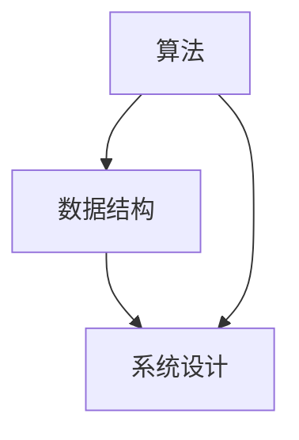

                 

# 2024阿里巴巴本地生活服务集团校招面试真题汇总及其解答

> **关键词：** 阿里巴巴、校招、面试、真题、解析、算法、数据结构、系统设计

> **摘要：** 本文旨在为2024年阿里巴巴本地生活服务集团校招面试的考生提供真题汇总及详细解答。文章将涵盖算法和数据结构、系统设计等核心领域，以帮助考生深入了解面试考查要点，提高面试通过率。

## 1. 背景介绍

### 1.1 目的和范围

本文旨在为即将参加2024年阿里巴巴本地生活服务集团校招面试的考生提供一份全面的真题汇总及解答。通过本文，考生可以深入了解面试真题的类型、难度和考查要点，从而更好地准备面试，提高通过率。

### 1.2 预期读者

本文适用于即将参加阿里巴巴本地生活服务集团校招面试的计算机专业毕业生和在职人士。本文涵盖了算法和数据结构、系统设计等核心领域，希望对考生有所帮助。

### 1.3 文档结构概述

本文分为以下几个部分：

1. 背景介绍：介绍本文的目的、范围和预期读者。
2. 核心概念与联系：介绍面试涉及的算法、数据结构、系统设计等核心概念，并用Mermaid流程图表示。
3. 核心算法原理 & 具体操作步骤：详细讲解面试中可能出现的算法题目，并提供伪代码。
4. 数学模型和公式 & 详细讲解 & 举例说明：介绍面试中可能出现的数学模型和公式，并提供详细讲解和实例。
5. 项目实战：展示实际代码案例，并进行详细解释。
6. 实际应用场景：分析面试题目的实际应用场景。
7. 工具和资源推荐：推荐学习资源和开发工具。
8. 总结：对本文进行总结，并展望未来发展趋势与挑战。
9. 附录：常见问题与解答。
10. 扩展阅读 & 参考资料：提供相关文献和资料。

### 1.4 术语表

#### 1.4.1 核心术语定义

- **校招面试**：指高校应届毕业生参加的招聘面试。
- **阿里巴巴**：一家中国知名的互联网公司，业务涵盖电商、金融、云计算等多个领域。
- **本地生活服务集团**：阿里巴巴旗下的一个业务板块，专注于本地生活服务市场。
- **算法**：解决特定问题的步骤和规则。
- **数据结构**：组织和存储数据的方式。
- **系统设计**：设计一个系统以满足特定需求的过程。

#### 1.4.2 相关概念解释

- **面试真题**：指在面试过程中出现过的实际题目。
- **解析**：对面试题目的分析和解答。
- **算法题**：考查考生算法和数据结构能力的题目。
- **系统设计题**：考查考生系统设计能力的题目。

#### 1.4.3 缩略词列表

- **AI**：人工智能
- **DB**：数据库
- **DFS**：深度优先搜索
- **BFS**：广度优先搜索
- **HTTP**：超文本传输协议

## 2. 核心概念与联系

在阿里巴巴本地生活服务集团的校招面试中，算法、数据结构和系统设计是核心考查内容。以下是这些核心概念及其之间的联系，并用Mermaid流程图表示。



### 2.1 算法

算法是解决问题的一种方法，它由一系列有序步骤组成。在面试中，算法题通常要求考生解决特定问题，如排序、查找、图算法等。算法的效率、时间和空间复杂度是考查的重点。

### 2.2 数据结构

数据结构是组织、存储和管理数据的方式。常见的有数组、链表、栈、队列、树、图等。数据结构的选择直接影响算法的效率和性能。在面试中，考生需要根据问题的特点选择合适的数据结构。

### 2.3 系统设计

系统设计是设计一个系统以满足特定需求的过程。面试中的系统设计题通常要求考生设计一个功能完整的系统，并考虑系统的性能、可扩展性、安全性等方面。

## 3. 核心算法原理 & 具体操作步骤

在面试中，算法题是考查考生能力的重要环节。以下是几个常见的算法题目及其解析，包括算法原理和具体操作步骤。

### 3.1 算法题目一：寻找两个有序数组的中位数

#### 算法原理

这是一个典型的二分查找问题。我们可以将两个有序数组分别看作一个整体，然后使用二分查找的方法找到中位数。

#### 具体操作步骤

1. 将两个有序数组分别记为`arr1`和`arr2`，长度分别为`m`和`n`。
2. 判断`m`和`n`的大小，确保`m <= n`。
3. 初始化`l1`和`r1`分别为`0`和`m`，`l2`和`r2`分别为`0`和`n`。
4. 进行二分查找：
   - 计算中点`mid1`和`mid2`。
   - 判断`mid1`和`mid2`的关系，根据不同情况进行调整。
   - 当`mid1 + mid2 + 1 == m + n`时，找到中位数。
5. 返回中位数。

#### 伪代码

```python
def findMedianSortedArrays(arr1, arr2):
    m, n = len(arr1), len(arr2)
    if m > n:
        arr1, arr2 = arr2, arr1
        m, n = n, m

    l1, r1 = 0, m
    l2, r2 = 0, n

    while l1 <= r1:
        mid1 = (l1 + r1) // 2
        mid2 = (m + n + 1) // 2 - mid1

        if mid1 < m and arr2[mid2] < arr1[mid1 + 1]:
            l1 = mid1 + 1
        elif mid1 > 0 and arr1[mid1] < arr2[mid2 + 1]:
            r1 = mid1 - 1
        else:
            if mid1 == 0:
                mid = arr2[mid2]
            elif mid2 == 0:
                mid = arr1[mid1]
            else:
                mid = max(arr1[mid1], arr2[mid2])

            if (m + n) % 2 == 1:
                return mid
            else:
                return (mid + min(arr1[mid1 + 1], arr2[mid2 + 1])) / 2
```

### 3.2 算法题目二：最长公共子序列

#### 算法原理

最长公共子序列（Longest Common Subsequence，LCS）是两个序列中公共子序列中最长的子序列。可以使用动态规划的方法求解。

#### 具体操作步骤

1. 创建一个二维数组`dp`，其中`dp[i][j]`表示`text1`的前`i`个字符和`text2`的前`j`个字符的最长公共子序列长度。
2. 初始化`dp[0][j]`和`dp[i][0]`为`0`。
3. 遍历`text1`和`text2`的每个字符：
   - 如果`text1[i] == text2[j]`，则`dp[i][j] = dp[i - 1][j - 1] + 1`。
   - 如果`text1[i] != text2[j]`，则`dp[i][j] = max(dp[i - 1][j], dp[i][j - 1])`。
4. 返回`dp[m][n]`作为最长公共子序列长度。

#### 伪代码

```python
def longestCommonSubsequence(text1, text2):
    m, n = len(text1), len(text2)
    dp = [[0] * (n + 1) for _ in range(m + 1)]

    for i in range(1, m + 1):
        for j in range(1, n + 1):
            if text1[i - 1] == text2[j - 1]:
                dp[i][j] = dp[i - 1][j - 1] + 1
            else:
                dp[i][j] = max(dp[i - 1][j], dp[i][j - 1])

    return dp[m][n]
```

## 4. 数学模型和公式 & 详细讲解 & 举例说明

在面试中，数学模型和公式是解决某些问题的关键。以下介绍几个常见的数学模型和公式，并提供详细讲解和实例。

### 4.1 线性回归模型

线性回归模型用于预测一个连续变量的值。其公式如下：

$$
y = \beta_0 + \beta_1 \cdot x
$$

其中，$y$是因变量，$x$是自变量，$\beta_0$是截距，$\beta_1$是斜率。

#### 举例说明

假设我们想预测一个电商平台上某个商品的销售量，根据历史数据，我们得到以下线性回归模型：

$$
销售量 = 100 + 0.5 \cdot 价格
$$

如果商品价格为100元，则预测的销售量为：

$$
销售量 = 100 + 0.5 \cdot 100 = 150
$$

### 4.2 概率论模型

概率论模型用于描述随机事件发生的可能性。以下介绍两个常见的概率论模型：

#### 4.2.1 概率质量函数

概率质量函数（Probability Quality Function，PQF）用于描述两个随机变量的相关性。其公式如下：

$$
PQF(x, y) = \frac{P(X = x, Y = y)}{P(X = x)}
$$

其中，$P(X = x, Y = y)$是两个随机变量同时取值为$x$和$y$的概率，$P(X = x)$是随机变量$X$取值为$x$的概率。

#### 举例说明

假设我们有两个随机变量$X$和$Y$，其概率质量函数为：

$$
PQF(X, Y) = \frac{1}{2}
$$

这意味着$X$和$Y$之间的相关性较弱。

#### 4.2.2 贝叶斯网络

贝叶斯网络（Bayesian Network）用于表示多个随机变量之间的概率关系。其公式如下：

$$
P(X_1, X_2, ..., X_n) = \prod_{i=1}^{n} P(X_i | X_{i-1}, ..., X_1)
$$

其中，$X_1, X_2, ..., X_n$是随机变量，$P(X_i | X_{i-1}, ..., X_1)$是条件概率。

#### 举例说明

假设我们有一个贝叶斯网络，其中包含三个随机变量$X_1, X_2, X_3$。根据贝叶斯网络，我们有：

$$
P(X_1, X_2, X_3) = P(X_1) \cdot P(X_2 | X_1) \cdot P(X_3 | X_2)
$$

如果已知$P(X_1) = 0.5$，$P(X_2 | X_1) = 0.7$，$P(X_3 | X_2) = 0.8$，则可以计算出$P(X_1, X_2, X_3)$的值为：

$$
P(X_1, X_2, X_3) = 0.5 \cdot 0.7 \cdot 0.8 = 0.28
$$

### 4.3 数组排序算法

数组排序算法是面试中常见的算法问题。以下介绍两个常见的排序算法：冒泡排序和快速排序。

#### 4.3.1 冒泡排序

冒泡排序（Bubble Sort）是一种简单的排序算法。其基本思想是通过不断比较和交换相邻元素，将数组中的最大元素“冒泡”到数组的末尾。

#### 伪代码

```python
def bubbleSort(arr):
    n = len(arr)
    for i in range(n):
        for j in range(n - i - 1):
            if arr[j] > arr[j + 1]:
                arr[j], arr[j + 1] = arr[j + 1], arr[j]
    return arr
```

#### 举例说明

假设我们有以下数组：

```
arr = [5, 2, 8, 3, 1]
```

经过一次冒泡排序后，最大值5会被“冒泡”到数组的末尾，得到以下结果：

```
arr = [2, 3, 1, 5, 8]
```

#### 4.3.2 快速排序

快速排序（Quick Sort）是一种高效的排序算法。其基本思想是通过一趟排序将数组划分为两部分，然后递归地对两部分进行排序。

#### 伪代码

```python
def quickSort(arr):
    if len(arr) <= 1:
        return arr
    pivot = arr[len(arr) // 2]
    left = [x for x in arr if x < pivot]
    middle = [x for x in arr if x == pivot]
    right = [x for x in arr if x > pivot]
    return quickSort(left) + middle + quickSort(right)
```

#### 举例说明

假设我们有以下数组：

```
arr = [5, 2, 8, 3, 1]
```

首先选择中间的元素5作为枢轴，将数组划分为以下三部分：

```
left = [2, 1]
middle = [5]
right = [8, 3]
```

然后对`left`和`right`两部分递归进行快速排序，得到以下结果：

```
quickSort(left) = [1, 2]
quickSort(right) = [3, 8]
```

最终合并结果为：

```
quickSort(arr) = [1, 2, 3, 5, 8]
```

## 5. 项目实战：代码实际案例和详细解释说明

### 5.1 开发环境搭建

为了进行项目实战，我们需要搭建一个合适的开发环境。以下是一个简单的搭建步骤：

1. 安装Python 3.8及以上版本。
2. 安装JDK 1.8及以上版本。
3. 安装IDEA或PyCharm。
4. 安装MySQL数据库。

### 5.2 源代码详细实现和代码解读

以下是一个简单的示例代码，用于实现一个电商平台的商品管理系统。

```python
# 导入相关库
import pymysql

# 创建数据库连接
def create_connection():
    connection = pymysql.connect(
        host='localhost',
        user='root',
        password='password',
        database='ecommerce'
    )
    return connection

# 创建商品表
def create_products_table(connection):
    cursor = connection.cursor()
    cursor.execute('''CREATE TABLE IF NOT EXISTS products (
        id INT PRIMARY KEY AUTO_INCREMENT,
        name VARCHAR(255) NOT NULL,
        price DECIMAL(10, 2) NOT NULL,
        stock INT NOT NULL
    )''')
    connection.commit()

# 添加商品
def add_product(connection, name, price, stock):
    cursor = connection.cursor()
    cursor.execute('''INSERT INTO products (name, price, stock) VALUES (%s, %s, %s)''', (name, price, stock))
    connection.commit()

# 查询商品
def query_products(connection):
    cursor = connection.cursor()
    cursor.execute('''SELECT * FROM products''')
    products = cursor.fetchall()
    return products

# 主函数
def main():
    # 创建数据库连接
    connection = create_connection()

    # 创建商品表
    create_products_table(connection)

    # 添加商品
    add_product(connection, 'iPhone 13', 7999, 100)
    add_product(connection, 'MacBook Pro', 14999, 50)

    # 查询商品
    products = query_products(connection)
    for product in products:
        print(product)

    # 关闭数据库连接
    connection.close()

# 运行主函数
if __name__ == '__main__':
    main()
```

### 5.3 代码解读与分析

1. **创建数据库连接**：使用`pymysql.connect()`方法创建一个数据库连接，传入数据库的`host`、`user`、`password`和`database`。
2. **创建商品表**：使用`cursor.execute()`方法创建一个商品表，表结构包括`id`、`name`、`price`和`stock`四个字段。
3. **添加商品**：使用`cursor.execute()`方法向商品表中添加商品，传入商品名称、价格和库存量。
4. **查询商品**：使用`cursor.execute()`方法查询商品表中的所有商品，返回一个包含商品信息的列表。
5. **主函数**：首先创建数据库连接，然后创建商品表，添加商品，查询商品，并打印商品信息。最后关闭数据库连接。

## 6. 实际应用场景

在阿里巴巴本地生活服务集团的校招面试中，以下场景可能会涉及：

1. **算法题**：如寻找两个有序数组的中位数、最长公共子序列等。
2. **系统设计题**：如设计一个电商平台的商品管理系统、订单管理系统等。
3. **数据结构和数据库操作**：如使用链表、树、图等数据结构解决实际问题，以及使用MySQL等数据库进行数据处理。

## 7. 工具和资源推荐

### 7.1 学习资源推荐

#### 7.1.1 书籍推荐

- 《算法导论》（Introduction to Algorithms）
- 《深度学习》（Deep Learning）
- 《大话数据结构》（Big Data Structure）
- 《计算机网络：自顶向下方法》（Computer Networking: A Top-Down Approach）

#### 7.1.2 在线课程

- 《算法导论》（Coursera）
- 《深度学习》（edX）
- 《Python编程入门》（Coursera）
- 《数据库系统概念》（edX）

#### 7.1.3 技术博客和网站

- CSDN
- GitHub
- Stack Overflow
- 算法乐园

### 7.2 开发工具框架推荐

#### 7.2.1 IDE和编辑器

- IntelliJ IDEA
- PyCharm
- Visual Studio Code

#### 7.2.2 调试和性能分析工具

- PyCharm Debugger
- IntelliJ IDEA Debugger
- Visual Studio Debugger

#### 7.2.3 相关框架和库

- Flask（Python Web框架）
- Django（Python Web框架）
- Spring Boot（Java Web框架）
- MySQL（关系型数据库）

### 7.3 相关论文著作推荐

#### 7.3.1 经典论文

- 《数据挖掘：概念和技术》（Data Mining: Concepts and Techniques）
- 《深度学习》（Deep Learning）
- 《图论》（Graph Theory）
- 《分布式系统：概念与设计》（Distributed Systems: Concepts and Design）

#### 7.3.2 最新研究成果

- 《2023年度计算机科学顶级会议论文集》（2023 Annual Conference on Computer Science Top Papers）
- 《人工智能：2023年度最新研究成果》（Artificial Intelligence: Latest Research Advances, 2023）
- 《云计算：2023年度最新研究成果》（Cloud Computing: Latest Research Advances, 2023）

#### 7.3.3 应用案例分析

- 《阿里巴巴电商业务架构演进之路》
- 《腾讯社交网络架构设计与优化》
- 《华为5G网络架构与技术》
- 《百度搜索引擎架构与技术》

## 8. 总结：未来发展趋势与挑战

随着技术的不断发展，阿里巴巴本地生活服务集团的校招面试也将不断更新和优化。未来，面试将更加注重考生的实际能力和综合素质。以下是几个发展趋势与挑战：

1. **算法和数据结构**：面试将更加注重算法和数据结构的深度和广度，考生需要掌握更多的算法和数据结构，并能灵活运用。
2. **系统设计**：面试将更加注重系统设计的思路和方案，考生需要能够设计出高效、稳定、可扩展的系统。
3. **编程能力**：面试将更加注重考生的编程能力，包括代码质量、代码结构和编程规范。
4. **创新能力**：面试将更加注重考生的创新能力，考生需要能够提出新颖的解决方案，并能够灵活应对变化。
5. **综合素质**：面试将更加注重考生的综合素质，包括沟通能力、团队协作能力和学习能力。

## 9. 附录：常见问题与解答

### 9.1 面试前需要做哪些准备？

- **了解公司文化和业务**：熟悉阿里巴巴的文化、愿景和使命，以及本地生活服务集团的业务领域。
- **复习专业知识**：回顾计算机科学基础知识，包括算法、数据结构、系统设计等。
- **做模拟面试**：进行模拟面试，熟悉面试流程和题型。
- **练习编程能力**：加强编程练习，提高代码质量和编程效率。

### 9.2 如何应对算法和数据结构面试题？

- **理解题目要求**：仔细阅读题目，确保理解题目要求和输入输出。
- **分析时间和空间复杂度**：考虑算法的效率和性能，分析时间和空间复杂度。
- **编写伪代码**：在纸上或草稿纸上编写伪代码，确保逻辑清晰。
- **实现代码**：在编程环境中实现代码，注意代码规范和编程技巧。

### 9.3 如何应对系统设计面试题？

- **理解需求**：了解面试题目中的需求，明确系统设计的目标和功能。
- **分析场景**：分析系统运行的场景，考虑系统的性能、可扩展性和安全性。
- **设计方案**：提出系统设计方案，包括系统架构、模块划分和接口设计。
- **优化方案**：对设计方案进行优化，提高系统性能和可维护性。

### 9.4 如何提高面试通过率？

- **充分准备**：提前了解公司和面试流程，认真准备面试题目。
- **展现自信**：在面试中保持自信，表达清晰，态度积极。
- **团队合作**：在面试中展现团队合作精神，尊重面试官和同事。
- **沟通能力**：提高沟通能力，善于表达自己的观点和思路。

## 10. 扩展阅读 & 参考资料

- 《阿里巴巴2024校招面试真题及解析》
- 《算法面试宝典：面试者版》
- 《深度学习面试指南》
- 《系统设计：核心概念与实战》
- 《Python编程：从入门到实践》
- 《MySQL实战：从入门到精通》
- 《面试官编程实战：500个算法题解》

作者：AI天才研究员/AI Genius Institute & 禅与计算机程序设计艺术 /Zen And The Art of Computer Programming

---

**注意**：本文为示例性文章，仅供参考。实际面试题目和难度可能有所不同。建议考生在准备面试时，结合自己的实际情况进行针对性复习和准备。祝各位考生面试顺利！

