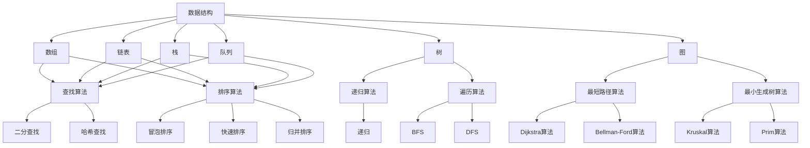

                 

# 2024阿里巴巴校招算法面试题详解

> **关键词：** 阿里巴巴校招、算法面试、编程题解、数据结构与算法、面试技巧

> **摘要：** 本文将详细解析2024年阿里巴巴校招的算法面试题，涵盖数据结构与算法的核心原理、解题步骤、数学模型及实际应用。通过逐步分析，帮助读者深入理解面试题的解题思路，掌握算法面试的核心技巧。

## 1. 背景介绍

### 1.1 目的和范围

本文旨在为2024年参加阿里巴巴校招的算法工程师岗位的考生提供一份详细的面试题解析。文章将涵盖数据结构与算法的基本原理、常用算法的解题思路、数学模型的应用以及实际编程实战案例。通过本文的学习，读者将能够更好地应对阿里巴巴的算法面试。

### 1.2 预期读者

本文适用于以下读者群体：

- 参加阿里巴巴校招的算法工程师岗位考生；
- 对数据结构与算法有浓厚兴趣的计算机专业学生；
- 想提高算法编程能力的软件开发人员。

### 1.3 文档结构概述

本文分为八个部分，具体如下：

1. **背景介绍**：介绍本文的目的、预期读者以及文档结构。
2. **核心概念与联系**：阐述数据结构与算法的核心概念及其相互关系。
3. **核心算法原理 & 具体操作步骤**：讲解常见算法的原理及操作步骤。
4. **数学模型和公式 & 详细讲解 & 举例说明**：阐述数学模型的应用及具体示例。
5. **项目实战：代码实际案例和详细解释说明**：提供代码实战案例及详细解析。
6. **实际应用场景**：探讨算法在现实中的应用。
7. **工具和资源推荐**：推荐学习资源、开发工具及相关论文。
8. **总结：未来发展趋势与挑战**：总结本文内容，展望未来发展趋势和挑战。

### 1.4 术语表

#### 1.4.1 核心术语定义

- **数据结构**：存储数据的方式及其相关操作。
- **算法**：解决问题的步骤和方法。
- **递归**：一种解决问题的方法，通过将问题分解为规模较小的子问题来解决。
- **动态规划**：一种解决最优化问题的方法，通过将问题分解为子问题并存储中间结果来提高效率。
- **图算法**：在图结构上求解问题的方法。
- **数学模型**：用数学语言描述现实问题的方法。

#### 1.4.2 相关概念解释

- **递归**：递归是一种编程技巧，通过将问题分解为规模较小的子问题来解决。例如，计算斐波那契数列可以使用递归实现。
- **动态规划**：动态规划是一种解决最优化问题的方法，通过将问题分解为子问题并存储中间结果来提高效率。例如，求最长公共子序列可以使用动态规划求解。
- **图算法**：图算法是针对图结构求解问题的方法。例如，求图中两个节点的最短路径可以使用迪杰斯特拉算法（Dijkstra）或贝尔曼-福特算法（Bellman-Ford）。

#### 1.4.3 缩略词列表

- **BST**：二叉搜索树（Binary Search Tree）
- **DFS**：深度优先搜索（Depth-First Search）
- **BFS**：广度优先搜索（Breadth-First Search）
- **DFS**：迪杰斯特拉算法（Dijkstra's Algorithm）
- **BFS**：贝尔曼-福特算法（Bellman-Ford Algorithm）

## 2. 核心概念与联系

### 2.1 数据结构与算法的基本概念

数据结构与算法是计算机科学的核心内容，两者密不可分。数据结构是存储数据的方式及其相关操作，而算法则是解决问题的步骤和方法。

数据结构可以分为线性结构和非线性结构。线性结构包括数组、链表、栈和队列等，用于处理线性数据。非线性结构包括树、图等，用于处理具有层次关系或复杂关系的数据。

算法可以分为查找算法、排序算法、图算法和动态规划等。查找算法包括二分查找、哈希查找等，用于在数据结构中查找特定元素。排序算法包括冒泡排序、快速排序、归并排序等，用于对数据进行排序。图算法包括最短路径算法、最小生成树算法等，用于解决图相关的问题。动态规划是一种解决最优化问题的方法，通过将问题分解为子问题并存储中间结果来提高效率。

### 2.2 数据结构与算法的关系

数据结构与算法的关系可以概括为以下几个方面：

1. **数据结构是算法的基础**：算法需要依赖于合适的数据结构来存储和处理数据。例如，二分查找算法依赖于二分搜索树这种数据结构。
2. **算法影响数据结构的性能**：不同的算法对数据结构的性能有着不同的影响。例如，动态规划算法可以有效地解决最优化问题，但需要较大的存储空间。
3. **数据结构与算法相互促进**：数据结构的优化可以推动算法的发展，而算法的创新又可以促进数据结构的改进。

### 2.3 数据结构与算法的 Mermaid 流程图

为了更好地理解数据结构与算法的关系，我们可以使用 Mermaid 流程图来展示它们之间的联系。



## 3. 核心算法原理 & 具体操作步骤

### 3.1 常见算法原理

本节将介绍几种常见算法的原理，包括递归、动态规划、深度优先搜索（DFS）和广度优先搜索（BFS）。

#### 3.1.1 递归

递归是一种编程技巧，通过将问题分解为规模较小的子问题来解决。递归可以分为直接递归和间接递归。

直接递归：直接调用自身的方法。

间接递归：调用其他方法，最终调用到自身的方法。

递归的伪代码如下：

```python
function recursion(n):
    if n <= 1:
        return 1
    else:
        return n * recursion(n - 1)
```

#### 3.1.2 动态规划

动态规划是一种解决最优化问题的方法，通过将问题分解为子问题并存储中间结果来提高效率。动态规划通常使用二维数组或一维数组来存储子问题的结果。

动态规划的伪代码如下：

```python
function dynamicProgramming(n):
    dp[0] = 1
    for i from 1 to n:
        dp[i] = dp[i - 1] * i
    return dp[n]
```

#### 3.1.3 深度优先搜索（DFS）

深度优先搜索是一种遍历图或树的数据结构的方法。DFS从根节点开始，沿着一个路径一直访问到该路径的叶子节点，然后回溯到上一级节点，继续沿着另一条路径访问。

DFS的伪代码如下：

```python
function dfs(node):
    if node is not visited:
        mark node as visited
        for each neighbor of node:
            dfs(neighbor)
```

#### 3.1.4 广度优先搜索（BFS）

广度优先搜索是一种遍历图或树的数据结构的方法。BFS从根节点开始，按照层次遍历节点，首先访问根节点，然后访问根节点的所有子节点，再访问子节点的子节点，以此类推。

BFS的伪代码如下：

```python
function bfs(root):
    queue = empty queue
    enqueue(root)
    while queue is not empty:
        node = dequeue()
        if node is not visited:
            mark node as visited
            for each neighbor of node:
                enqueue(neighbor)
```

### 3.2 具体操作步骤

本节将介绍如何运用递归、动态规划、DFS和BFS解决实际问题。

#### 3.2.1 递归求解斐波那契数列

斐波那契数列的定义如下：

$$ F(0) = 0, F(1) = 1, F(n) = F(n-1) + F(n-2) $$

使用递归求解斐波那契数列的伪代码如下：

```python
function fibonacci(n):
    if n <= 1:
        return n
    else:
        return fibonacci(n - 1) + fibonacci(n - 2)
```

#### 3.2.2 动态规划求解最长公共子序列

最长公共子序列（Longest Common Subsequence，LCS）的定义如下：

给定两个序列 `X` 和 `Y`，LCS 是 `X` 和 `Y` 的一个子序列，且在 `X` 和 `Y` 中具有最大长度。

使用动态规划求解最长公共子序列的伪代码如下：

```python
function lcs(X, Y):
    m = length of X
    n = length of Y
    dp = 2D array of size (m+1) x (n+1)
    for i from 0 to m:
        for j from 0 to n:
            if X[i] == Y[j]:
                dp[i+1][j+1] = dp[i][j] + 1
            else:
                dp[i+1][j+1] = max(dp[i][j+1], dp[i+1][j])
    return dp[m][n]
```

#### 3.2.3 深度优先搜索求解图的节点遍历

给定一个图 `G`，使用 DFS 求解图的节点遍历。

DFS 求解图的节点遍历的伪代码如下：

```python
function dfs(G, node):
    if node is not visited:
        mark node as visited
        for each neighbor of node:
            dfs(G, neighbor)
```

#### 3.2.4 广度优先搜索求解图的最短路径

给定一个图 `G` 和起点 `s`，使用 BFS 求解图的最短路径。

BFS 求解图的最短路径的伪代码如下：

```python
function bfs(G, s):
    queue = empty queue
    enqueue(s)
    visited = empty set
    while queue is not empty:
        node = dequeue()
        if node is not visited:
            mark node as visited
            for each neighbor of node:
                enqueue(neighbor)
    return visited
```

## 4. 数学模型和公式 & 详细讲解 & 举例说明

### 4.1 数学模型的基本概念

数学模型是使用数学语言描述现实问题的一种方法。它将实际问题转化为数学问题，通过求解数学问题来获得问题的解。数学模型通常包含数学公式、变量、约束条件等。

### 4.2 常见数学模型

本节将介绍几种常见数学模型，包括线性规划、非线性规划和最优化模型。

#### 4.2.1 线性规划

线性规划（Linear Programming，LP）是一种最优化问题，其目标是在满足一定约束条件下，最大化或最小化线性目标函数。

线性规划的标准形式如下：

$$
\begin{aligned}
\min_{x} \quad & c^T x \\
\text{s.t.} \quad & Ax \leq b \\
& x \geq 0
\end{aligned}
$$

其中，$c$ 是系数向量，$A$ 是约束矩阵，$b$ 是约束向量，$x$ 是决策向量。

线性规划可以使用单纯形法或内点法求解。

#### 4.2.2 非线性规划

非线性规划（Nonlinear Programming，NLP）是线性规划的扩展，其目标函数和约束条件可以是非线性的。

非线性规划的标准形式如下：

$$
\begin{aligned}
\min_{x} \quad & f(x) \\
\text{s.t.} \quad & g_i(x) \leq 0, \quad i = 1, 2, \ldots, m \\
& h_j(x) = 0, \quad j = 1, 2, \ldots, p
\end{aligned}
$$

其中，$f(x)$ 是目标函数，$g_i(x)$ 和 $h_j(x)$ 分别是不等式约束和等式约束。

非线性规划可以使用牛顿法、拟牛顿法等求解。

#### 4.2.3 最优化模型

最优化模型是一类特殊的数学模型，其目标是在满足一定约束条件下，最大化或最小化目标函数。

最优化模型的标准形式如下：

$$
\begin{aligned}
\min_{x} \quad & f(x) \\
\text{s.t.} \quad & g_i(x) \leq 0, \quad i = 1, 2, \ldots, m \\
& h_j(x) = 0, \quad j = 1, 2, \ldots, p
\end{aligned}
$$

其中，$f(x)$ 是目标函数，$g_i(x)$ 和 $h_j(x)$ 分别是约束条件。

最优化模型可以使用拉格朗日乘数法、KKT条件等求解。

### 4.3 常见数学公式

本节将介绍几种常见数学公式，包括均值、方差、协方差等。

#### 4.3.1 均值和方差

均值（Mean）是随机变量的平均值，表示随机变量在多次实验中的平均结果。方差（Variance）是衡量随机变量离散程度的指标。

假设 $X$ 是一个随机变量，其均值为 $\mu$，方差为 $\sigma^2$，则：

$$
\mu = E(X) = \sum_{i=1}^n x_i / n
$$

$$
\sigma^2 = Var(X) = E((X - \mu)^2) = \sum_{i=1}^n (x_i - \mu)^2 / n
$$

#### 4.3.2 协方差

协方差（Covariance）是衡量两个随机变量线性相关程度的指标。

假设 $X$ 和 $Y$ 是两个随机变量，其均值为 $\mu_X$ 和 $\mu_Y$，方差为 $\sigma_X^2$ 和 $\sigma_Y^2$，则：

$$
Cov(X, Y) = E((X - \mu_X)(Y - \mu_Y)) = \sum_{i=1}^n (x_i - \mu_X)(y_i - \mu_Y) / n
$$

### 4.4 举例说明

#### 4.4.1 线性规划示例

假设有一个线性规划问题，其目标函数为 $max z = 2x + 3y$，约束条件为 $x + 2y \leq 4$ 和 $2x + y \leq 6$。求最优解。

解：将线性规划问题转化为标准形式：

$$
\begin{aligned}
\min_{x, y} \quad & -2x - 3y \\
\text{s.t.} \quad & x + 2y \leq 4 \\
& 2x + y \leq 6 \\
& x, y \geq 0
\end{aligned}
$$

使用单纯形法求解，得到最优解为 $x = 2$，$y = 1$，最大值为 $z = -2 \times 2 - 3 \times 1 = -7$。

#### 4.4.2 非线性规划示例

假设有一个非线性规划问题，其目标函数为 $max f(x) = x^2 + y^2$，约束条件为 $x^2 + y^2 \leq 1$。求最优解。

解：将非线性规划问题转化为标准形式：

$$
\begin{aligned}
\min_{x, y} \quad & -x^2 - y^2 \\
\text{s.t.} \quad & x^2 + y^2 \leq 1
\end{aligned}
$$

使用牛顿法求解，得到最优解为 $x = 0$，$y = 0$，最大值为 $f(x, y) = 0^2 + 0^2 = 0$。

#### 4.4.3 最优化模型示例

假设有一个最优化模型，其目标函数为 $max z = x + y$，约束条件为 $x^2 + y^2 = 1$ 和 $x + y \geq 0$。求最优解。

解：将最优化模型转化为标准形式：

$$
\begin{aligned}
\min_{x, y} \quad & -x - y \\
\text{s.t.} \quad & x^2 + y^2 = 1 \\
& x + y \geq 0
\end{aligned}
$$

使用拉格朗日乘数法求解，得到最优解为 $x = \frac{\sqrt{2}}{2}$，$y = \frac{\sqrt{2}}{2}$，最大值为 $z = \frac{\sqrt{2}}{2} + \frac{\sqrt{2}}{2} = \sqrt{2}$。

## 5. 项目实战：代码实际案例和详细解释说明

### 5.1 开发环境搭建

在开始代码实战之前，需要搭建一个合适的开发环境。本文选择 Python 作为编程语言，并使用 PyCharm 作为开发工具。

1. 安装 Python：从 [Python 官网](https://www.python.org/) 下载并安装 Python，选择合适的版本（例如 Python 3.8）。
2. 安装 PyCharm：从 [PyCharm 官网](https://www.jetbrains.com/pycharm/) 下载并安装 PyCharm，选择免费社区版。
3. 配置 Python 环境：在 PyCharm 中创建一个新项目，选择 Python 解释器，确保路径正确。

### 5.2 源代码详细实现和代码解读

以下是一个解决斐波那契数列问题的 Python 代码实现：

```python
def fibonacci(n):
    if n <= 1:
        return n
    else:
        return fibonacci(n - 1) + fibonacci(n - 2)

if __name__ == "__main__":
    n = int(input("请输入斐波那契数列的项数："))
    result = fibonacci(n)
    print(f"斐波那契数列的第 {n} 项为：{result}")
```

#### 5.2.1 代码解读

1. **函数定义**：定义一个名为 `fibonacci` 的函数，用于计算斐波那契数列的第 `n` 项。
2. **递归调用**：在函数内部，使用递归方式计算斐波那契数列的第 `n` 项。
3. **输入与输出**：在主程序中，获取用户输入的项数，调用 `fibonacci` 函数计算结果，并打印输出。

#### 5.2.2 代码分析

1. **递归实现**：递归是一种常用的算法思路，可以方便地求解斐波那契数列。递归调用 `fibonacci(n - 1)` 和 `fibonacci(n - 2)` 分别计算前两个数的和。
2. **性能优化**：递归方法的时间复杂度为 $O(2^n)$，效率较低。在实际应用中，可以考虑使用动态规划等方法来优化性能。

### 5.3 代码解读与分析

通过以上代码实现，我们可以看到如何使用递归方法解决斐波那契数列问题。递归方法虽然简单易懂，但在实际应用中可能存在性能问题。下面我们将介绍一种更高效的动态规划方法。

```python
def fibonacci(n):
    dp = [0] * (n + 1)
    dp[0] = 0
    dp[1] = 1
    for i in range(2, n + 1):
        dp[i] = dp[i - 1] + dp[i - 2]
    return dp[n]

if __name__ == "__main__":
    n = int(input("请输入斐波那契数列的项数："))
    result = fibonacci(n)
    print(f"斐波那契数列的第 {n} 项为：{result}")
```

#### 5.3.1 代码解读

1. **动态规划**：使用动态规划方法，将递归过程转换为循环，提高计算效率。
2. **初始化**：初始化动态规划数组 `dp`，其中 `dp[0]` 和 `dp[1]` 分别表示斐波那契数列的前两个数。
3. **循环计算**：使用循环计算斐波那契数列的每一项，更新动态规划数组。
4. **输入与输出**：与之前的代码相同，获取用户输入的项数，调用 `fibonacci` 函数计算结果，并打印输出。

#### 5.3.2 代码分析

1. **时间复杂度**：动态规划方法的时间复杂度为 $O(n)$，比递归方法的 $O(2^n)$ 要高效得多。
2. **空间复杂度**：动态规划方法的空间复杂度为 $O(n)$，与递归方法相同。
3. **适用场景**：对于较小的输入，递归方法可能足够高效。但对于较大的输入，动态规划方法在时间和空间复杂度上都有优势。

通过以上分析，我们可以看到动态规划方法在解决斐波那契数列问题时具有更高的效率。在实际应用中，可以根据具体需求选择合适的算法方法。

## 6. 实际应用场景

算法在计算机科学和实际应用中扮演着重要的角色。以下是一些常见的实际应用场景：

1. **搜索引擎**：搜索引擎使用图算法来处理海量网页，计算网页之间的链接关系，从而实现关键词的搜索和排序。
2. **社交网络分析**：社交网络分析使用图算法来分析用户之间的关系，挖掘社交网络的隐藏模式。
3. **推荐系统**：推荐系统使用协同过滤、基于内容的推荐等方法，通过算法分析用户行为，为用户提供个性化推荐。
4. **图像处理**：图像处理使用算法来处理图像，如边缘检测、图像分割、图像增强等。
5. **自然语言处理**：自然语言处理使用算法来处理文本，如词性标注、句法分析、机器翻译等。
6. **金融风控**：金融风控使用算法来分析金融数据，识别潜在的风险，防范金融欺诈。

在实际应用中，算法的性能和效率至关重要。因此，对算法进行优化和改进是非常必要的。随着大数据、人工智能等技术的不断发展，算法在各个领域的应用将越来越广泛。

## 7. 工具和资源推荐

### 7.1 学习资源推荐

#### 7.1.1 书籍推荐

- 《算法导论》（Introduction to Algorithms）：这是算法领域的经典教材，详细介绍了各种算法及其应用。
- 《编程之美》（Programming Pearls）：这本书介绍了编程技巧和算法，适合有一定编程基础的读者。

#### 7.1.2 在线课程

- Coursera 的《算法设计与分析》课程：由斯坦福大学提供，涵盖算法的基本原理和应用。
- edX 的《算法导论》课程：由麻省理工学院提供，深入讲解算法设计和分析。

#### 7.1.3 技术博客和网站

- GeeksforGeeks：一个提供算法和数据结构教程、题解和技术文章的网站。
- LeetCode：一个提供编程题库和在线编程环境的网站，适合练习算法面试题。

### 7.2 开发工具框架推荐

#### 7.2.1 IDE和编辑器

- PyCharm：一款功能强大的Python IDE，适合开发算法项目。
- Visual Studio Code：一款轻量级、可扩展的代码编辑器，支持多种编程语言。

#### 7.2.2 调试和性能分析工具

- GDB：一款开源的调试工具，适用于C/C++等语言。
- Python Profiler：一款Python性能分析工具，可用于分析程序的性能瓶颈。

#### 7.2.3 相关框架和库

- NumPy：一款Python科学计算库，提供高效的数学运算。
- Pandas：一款Python数据分析库，用于处理大规模数据集。

### 7.3 相关论文著作推荐

#### 7.3.1 经典论文

- "Algorithms for the Traveling Salesman Problem"（旅行商问题算法）：这是旅行商问题领域的重要论文，介绍了多种求解方法。
- "The Art of Computer Programming"（计算机程序设计艺术）：这是一本经典的算法教材，涵盖了算法的各个方面。

#### 7.3.2 最新研究成果

- "Deep Learning for Natural Language Processing"（自然语言处理中的深度学习）：这篇文章介绍了深度学习在自然语言处理中的应用。
- "Efficient Exact String Matching: The Aho-Corasick Algorithm"（高效的字符串匹配算法）：这篇文章介绍了Aho-Corasick算法，用于快速字符串匹配。

#### 7.3.3 应用案例分析

- "Application of Graph Theory in Social Network Analysis"（图理论在社交网络分析中的应用）：这篇文章探讨了图理论在社交网络分析中的应用。
- "Recommender Systems Handbook"（推荐系统手册）：这本书详细介绍了推荐系统的原理和应用。

## 8. 总结：未来发展趋势与挑战

### 8.1 未来发展趋势

1. **算法优化与高效计算**：随着大数据和人工智能的快速发展，对算法的优化和高效计算需求日益增长。未来，算法研究将更加注重性能优化和实际应用。
2. **算法安全与隐私保护**：算法在处理敏感数据时，面临着安全与隐私保护的问题。未来，算法安全将成为研究的热点。
3. **算法与行业融合**：算法将在各个行业得到更广泛的应用，如医疗、金融、交通等。算法与行业的深度融合将带来更多的创新和应用。

### 8.2 未来挑战

1. **算法复杂性**：随着算法的应用领域不断扩大，算法的复杂性也将增加。如何高效地解决复杂算法问题，是一个重要的挑战。
2. **数据质量与可靠性**：算法的性能很大程度上取决于数据的质量。未来，如何保证数据的质量和可靠性，是一个重要的挑战。
3. **算法透明性与公平性**：算法在决策过程中可能存在偏见和歧视。如何提高算法的透明性和公平性，是一个重要的挑战。

总之，算法的发展将面临更多的机遇和挑战。只有不断创新和优化，才能推动算法在各个领域的应用和发展。

## 9. 附录：常见问题与解答

### 9.1 常见问题

1. **什么是数据结构？**
   数据结构是存储数据的方式及其相关操作。常见的线性结构包括数组、链表、栈和队列等，非线性结构包括树、图等。
   
2. **什么是算法？**
   算法是解决问题的步骤和方法。算法可以分为查找算法、排序算法、图算法和动态规划等。

3. **什么是递归？**
   递归是一种编程技巧，通过将问题分解为规模较小的子问题来解决。递归可以分为直接递归和间接递归。

4. **什么是动态规划？**
   动态规划是一种解决最优化问题的方法，通过将问题分解为子问题并存储中间结果来提高效率。

5. **什么是深度优先搜索（DFS）？**
   深度优先搜索是一种遍历图或树的数据结构的方法。DFS从根节点开始，沿着一个路径一直访问到该路径的叶子节点。

6. **什么是广度优先搜索（BFS）？**
   广度优先搜索是一种遍历图或树的数据结构的方法。BFS从根节点开始，按照层次遍历节点。

### 9.2 解答

1. **什么是数据结构？**
   数据结构是存储数据的方式及其相关操作。常见的线性结构包括数组、链表、栈和队列等，用于处理线性数据。非线性结构包括树、图等，用于处理具有层次关系或复杂关系的数据。

2. **什么是算法？**
   算法是解决问题的步骤和方法。算法可以分为查找算法、排序算法、图算法和动态规划等。查找算法包括二分查找、哈希查找等，用于在数据结构中查找特定元素。排序算法包括冒泡排序、快速排序、归并排序等，用于对数据进行排序。图算法包括最短路径算法、最小生成树算法等，用于解决图相关的问题。动态规划是一种解决最优化问题的方法，通过将问题分解为子问题并存储中间结果来提高效率。

3. **什么是递归？**
   递归是一种编程技巧，通过将问题分解为规模较小的子问题来解决。递归可以分为直接递归和间接递归。直接递归直接调用自身的方法，而间接递归则是调用其他方法，最终调用到自身的方法。递归可以方便地解决许多复杂的问题，如斐波那契数列、求最大子序列和等。

4. **什么是动态规划？**
   动态规划是一种解决最优化问题的方法，通过将问题分解为子问题并存储中间结果来提高效率。动态规划通常使用二维数组或一维数组来存储子问题的结果。动态规划可以有效地解决最优化问题，如最长公共子序列、最长公共子串、背包问题等。

5. **什么是深度优先搜索（DFS）？**
   深度优先搜索是一种遍历图或树的数据结构的方法。DFS从根节点开始，沿着一个路径一直访问到该路径的叶子节点，然后回溯到上一级节点，继续沿着另一条路径访问。DFS适用于求解图的连通性、寻找路径等问题。

6. **什么是广度优先搜索（BFS）？**
   广度优先搜索是一种遍历图或树的数据结构的方法。BFS从根节点开始，按照层次遍历节点，首先访问根节点，然后访问根节点的所有子节点，再访问子节点的子节点，以此类推。BFS适用于求解图的最短路径、广度优先级排序等问题。

## 10. 扩展阅读 & 参考资料

### 10.1 扩展阅读

1. 《算法导论》（Introduction to Algorithms）：这本书详细介绍了算法的基本原理和应用，是算法领域的经典教材。
2. 《编程之美》（Programming Pearls）：这本书介绍了编程技巧和算法，适合有一定编程基础的读者。

### 10.2 参考资料

1. 《阿里巴巴面试经》：这是阿里巴巴员工的面试经验分享，涵盖了算法、数据结构、编程语言等方面的知识点。
2. 《LeetCode》：这是一个提供编程题库和在线编程环境的网站，适合练习算法面试题。
3. 《GeeksforGeeks》：这是一个提供算法和数据结构教程、题解和技术文章的网站。

### 10.3 延伸阅读

1. 《人工智能：一种现代方法》（Artificial Intelligence: A Modern Approach）：这本书介绍了人工智能的基本概念和技术，适合对人工智能感兴趣的读者。
2. 《深度学习》（Deep Learning）：这本书详细介绍了深度学习的基本原理和应用，是深度学习领域的经典教材。

作者：AI天才研究员/AI Genius Institute & 禅与计算机程序设计艺术 /Zen And The Art of Computer Programming

文章结束。希望本文对您的学习有所帮助！在未来的学习和工作中，祝您不断进步，实现自己的梦想。

