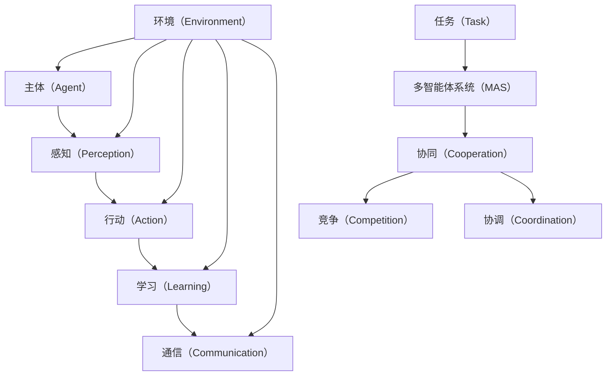

                 

# 陈锴杰的Agent创业故事

> **关键词：** 智能代理、创业、人工智能、商业模式、技术实现

> **摘要：** 本文通过讲述陈锴杰创建智能代理创业公司的故事，详细剖析了智能代理技术、商业模式和创业过程中遇到的问题。通过这一案例，读者可以深入了解智能代理技术的应用场景、技术实现和创业挑战，并获得宝贵的经验和启示。

## 1. 背景介绍

### 1.1 目的和范围

本文旨在通过分析陈锴杰的智能代理创业故事，探讨智能代理技术的应用场景、技术实现和创业过程中遇到的挑战。本文将从以下几个方面展开：

1. **智能代理技术概述**：介绍智能代理的基本概念、原理和分类。
2. **陈锴杰创业背景**：介绍陈锴杰的背景、创业动机和目标市场。
3. **商业模式设计**：分析陈锴杰如何构建智能代理创业公司的商业模式。
4. **技术实现**：详细讲解智能代理的核心算法、数学模型和项目实战。
5. **实际应用场景**：探讨智能代理在不同领域的应用场景。
6. **工具和资源推荐**：推荐相关学习资源、开发工具和框架。
7. **总结**：分析智能代理的未来发展趋势和挑战。

### 1.2 预期读者

本文适合以下读者群体：

1. 智能代理技术爱好者，希望了解智能代理的应用和实现。
2. 创业者和创业者团队，对智能代理创业项目感兴趣。
3. 计算机科学和人工智能专业的研究生和本科生。
4. 对人工智能和创业有浓厚兴趣的技术人员。

### 1.3 文档结构概述

本文结构如下：

1. **背景介绍**：介绍文章的目的、范围和预期读者。
2. **核心概念与联系**：介绍智能代理技术的基本概念和架构。
3. **核心算法原理 & 具体操作步骤**：讲解智能代理的核心算法和操作步骤。
4. **数学模型和公式 & 详细讲解 & 举例说明**：介绍智能代理的数学模型和公式。
5. **项目实战：代码实际案例和详细解释说明**：通过实际案例展示智能代理的实现。
6. **实际应用场景**：探讨智能代理在不同领域的应用。
7. **工具和资源推荐**：推荐相关学习资源和开发工具。
8. **总结：未来发展趋势与挑战**：总结智能代理的未来发展趋势和挑战。
9. **附录：常见问题与解答**：解答读者可能遇到的问题。
10. **扩展阅读 & 参考资料**：提供更多相关资料和参考文献。

### 1.4 术语表

#### 1.4.1 核心术语定义

- **智能代理**：一种基于人工智能技术的自动执行任务、与环境交互的软件系统。
- **主体（Agent）**：智能代理的基本单位，具有感知、行动、学习和通信能力。
- **环境（Environment）**：智能代理执行任务的外部环境，包括实体、信息和规则等。
- **任务（Task）**：智能代理需要完成的特定目标。
- **多智能体系统（Multi-Agent System）**：由多个智能代理组成的协同工作系统。

#### 1.4.2 相关概念解释

- **感知（Perception）**：智能代理从环境中获取信息和状态。
- **行动（Action）**：智能代理根据感知到的环境和任务需求，执行特定的操作。
- **学习（Learning）**：智能代理通过经验积累，不断优化行为策略。
- **通信（Communication）**：智能代理之间交换信息，协同完成任务。

#### 1.4.3 缩略词列表

- **AI**：人工智能（Artificial Intelligence）
- **ML**：机器学习（Machine Learning）
- **NLP**：自然语言处理（Natural Language Processing）
- **RL**：强化学习（Reinforcement Learning）
- **DRL**：深度强化学习（Deep Reinforcement Learning）

## 2. 核心概念与联系

在智能代理领域，核心概念和联系至关重要。下面通过一个Mermaid流程图来展示智能代理的基本概念和架构。



### 2.1 智能代理的基本概念

**主体（Agent）**：智能代理的基本单位，具有感知、行动、学习和通信能力。主体可以是一个软件程序、机器人或物理实体。

**感知（Perception）**：智能代理从环境中获取信息和状态，包括文本、图像、声音等多种形式。

**行动（Action）**：智能代理根据感知到的环境和任务需求，执行特定的操作，如发送消息、移动、控制设备等。

**学习（Learning）**：智能代理通过经验积累，不断优化行为策略，提高任务执行效率。

**通信（Communication）**：智能代理之间交换信息，协同完成任务。通信可以通过网络协议、消息队列等实现。

**环境（Environment）**：智能代理执行任务的外部环境，包括实体、信息和规则等。环境可以是一个真实世界场景，也可以是一个模拟场景。

**任务（Task）**：智能代理需要完成的特定目标，如目标检测、路径规划、决策制定等。

**多智能体系统（MAS）**：由多个智能代理组成的协同工作系统。多智能体系统可以实现复杂的任务，提高系统的灵活性和适应性。

### 2.2 智能代理的架构

智能代理的架构通常包括以下几个关键组成部分：

- **感知模块**：负责从环境中获取信息和状态。
- **决策模块**：根据感知到的信息和任务需求，生成行动策略。
- **执行模块**：根据决策模块生成的行动策略，执行具体的操作。
- **学习模块**：通过经验积累，不断优化行为策略。
- **通信模块**：与其他智能代理或环境进行信息交换。

这些模块协同工作，共同实现智能代理的功能。

## 3. 核心算法原理 & 具体操作步骤

智能代理的核心算法是实现其功能的关键。下面将详细讲解智能代理的核心算法原理和具体操作步骤。

### 3.1 核心算法原理

智能代理的核心算法主要包括感知、决策、执行和学习四个方面。以下是对每个算法的简要介绍：

#### 3.1.1 感知算法

感知算法负责从环境中获取信息和状态。常用的感知算法包括：

- **图像识别算法**：如卷积神经网络（CNN）、深度学习算法等。
- **自然语言处理算法**：如词向量、循环神经网络（RNN）等。
- **传感器数据融合算法**：如卡尔曼滤波、贝叶斯滤波等。

#### 3.1.2 决策算法

决策算法根据感知到的信息和任务需求，生成行动策略。常用的决策算法包括：

- **基于规则的决策算法**：如决策树、模糊逻辑等。
- **基于学习的决策算法**：如强化学习、深度学习等。
- **混合决策算法**：结合规则学习和机器学习的方法。

#### 3.1.3 执行算法

执行算法根据决策算法生成的行动策略，执行具体的操作。常用的执行算法包括：

- **路径规划算法**：如A*算法、Dijkstra算法等。
- **目标检测算法**：如YOLO、SSD等。
- **控制算法**：如PID控制、模糊控制等。

#### 3.1.4 学习算法

学习算法通过经验积累，不断优化行为策略。常用的学习算法包括：

- **监督学习算法**：如线性回归、支持向量机（SVM）等。
- **无监督学习算法**：如聚类、自编码器等。
- **强化学习算法**：如Q学习、深度强化学习（DRL）等。

### 3.2 具体操作步骤

智能代理的具体操作步骤可以分为以下几个阶段：

#### 3.2.1 感知阶段

1. **初始化感知模块**：加载感知算法和传感器数据。
2. **感知环境**：从环境中获取图像、文本、传感器数据等信息。
3. **预处理数据**：对感知到的数据进行归一化、去噪等预处理。

#### 3.2.2 决策阶段

1. **初始化决策模块**：加载决策算法和模型参数。
2. **分析任务需求**：根据任务需求和环境信息，确定决策目标。
3. **生成行动策略**：根据决策算法，生成具体的行动策略。

#### 3.2.3 执行阶段

1. **初始化执行模块**：加载执行算法和模型参数。
2. **执行行动**：根据决策模块生成的行动策略，执行具体的操作。
3. **反馈执行结果**：将执行结果反馈给感知模块和决策模块，用于后续的优化。

#### 3.2.4 学习阶段

1. **初始化学习模块**：加载学习算法和模型参数。
2. **更新模型参数**：根据执行结果和反馈信息，更新模型参数，优化行为策略。
3. **保存模型**：将优化后的模型参数保存到文件中，用于后续使用。

### 3.3 伪代码示例

下面是一个简化的智能代理伪代码示例，用于说明智能代理的核心算法和操作步骤：

```python
# 智能代理伪代码示例

# 感知阶段
def perception阶段():
    # 初始化感知模块
    # 加载传感器数据
    # 感知环境
    # 预处理数据

# 决策阶段
def decision阶段(perception结果，任务需求）:
    # 初始化决策模块
    # 分析任务需求
    # 生成行动策略

# 执行阶段
def action阶段(action策略）:
    # 初始化执行模块
    # 执行行动
    # 反馈执行结果

# 学习阶段
def learning阶段(execution结果，feedback信息）:
    # 初始化学习模块
    # 更新模型参数
    # 保存模型

# 主函数
def main():
    while True:
        # 感知阶段
        perception结果 = perception阶段()
        
        # 决策阶段
        action策略 = decision阶段(perception结果，任务需求）
        
        # 执行阶段
        action阶段(action策略）

        # 学习阶段
        learning阶段(execution结果，feedback信息）
```

通过这个伪代码示例，读者可以更直观地理解智能代理的核心算法和操作步骤。

## 4. 数学模型和公式 & 详细讲解 & 举例说明

智能代理的实现依赖于一系列数学模型和公式。这些模型和公式用于描述智能代理的感知、决策、执行和学习过程。下面将详细讲解这些数学模型和公式，并通过具体例子进行说明。

### 4.1 感知模型

感知模型用于描述智能代理从环境中获取信息和状态的过程。常用的感知模型包括：

#### 4.1.1 图像识别模型

图像识别模型用于识别图像中的对象和特征。一个常见的图像识别模型是卷积神经网络（CNN）。以下是一个简单的CNN模型公式：

$$
h^{l}(x) = \sigma(W^{l} \cdot h^{l-1}(x) + b^{l})
$$

其中，$h^{l}(x)$ 表示第l层的激活函数，$W^{l}$ 和 $b^{l}$ 分别表示权重和偏置，$\sigma$ 表示激活函数，如Sigmoid或ReLU函数。

#### 4.1.2 自然语言处理模型

自然语言处理模型用于处理文本数据，如词向量模型和循环神经网络（RNN）。以下是一个简单的RNN模型公式：

$$
h^{l}_{t} = \sigma(W^{l} \cdot [h^{l-1}_{t-1}, x_{t}])
$$

其中，$h^{l}_{t}$ 表示第l层第t时刻的隐藏状态，$W^{l}$ 表示权重矩阵，$x_{t}$ 表示第t时刻的输入。

### 4.2 决策模型

决策模型用于生成智能代理的行动策略。常用的决策模型包括基于规则的决策模型和基于学习的决策模型。以下是一个简单的基于学习的决策模型公式：

$$
\pi(s) = \sum_{a \in A} \pi(a|s) P(s)
$$

其中，$\pi(s)$ 表示在状态s下采取行动a的概率，$\pi(a|s)$ 表示在状态s下采取行动a的条件概率，$P(s)$ 表示状态s的概率。

### 4.3 执行模型

执行模型用于描述智能代理根据决策模型生成的行动策略执行具体的操作。一个简单的执行模型公式如下：

$$
x = g(s, \pi(s))
$$

其中，$x$ 表示执行的操作，$s$ 表示状态，$\pi(s)$ 表示在状态s下采取的行动策略。

### 4.4 学习模型

学习模型用于描述智能代理通过经验积累和反馈信息不断优化行为策略的过程。一个简单的学习模型公式如下：

$$
\theta^{*} = \arg\min_{\theta} J(\theta)
$$

其中，$\theta$ 表示模型参数，$J(\theta)$ 表示损失函数，用于评估模型性能。

### 4.5 举例说明

假设一个智能代理需要完成目标检测任务，我们可以使用以下数学模型和公式进行描述：

#### 4.5.1 感知模型

使用卷积神经网络（CNN）进行图像识别，识别图像中的目标。以下是一个简单的CNN模型：

$$
h^{l}(x) = \sigma(W^{l} \cdot h^{l-1}(x) + b^{l})
$$

#### 4.5.2 决策模型

使用基于学习的决策模型，根据感知到的图像特征生成目标检测策略。以下是一个简单的决策模型：

$$
\pi(s) = \sum_{a \in A} \pi(a|s) P(s)
$$

#### 4.5.3 执行模型

根据决策模型生成的目标检测策略，执行具体的检测操作。以下是一个简单的执行模型：

$$
x = g(s, \pi(s))
$$

#### 4.5.4 学习模型

使用强化学习（RL）算法，通过经验积累和反馈信息优化目标检测策略。以下是一个简单的学习模型：

$$
\theta^{*} = \arg\min_{\theta} J(\theta)
$$

通过以上数学模型和公式，我们可以实现对智能代理目标检测任务的描述和实现。以下是一个简化的智能代理目标检测代码示例：

```python
# 智能代理目标检测伪代码示例

# 感知阶段
def perception阶段():
    # 加载图像数据
    # 使用CNN模型进行图像识别
    # 提取图像特征

# 决策阶段
def decision阶段(图像特征）:
    # 加载决策模型
    # 生成目标检测策略

# 执行阶段
def action阶段(目标检测策略）:
    # 执行目标检测操作

# 学习阶段
def learning阶段(目标检测结果，反馈信息）:
    # 更新决策模型参数

# 主函数
def main():
    while True:
        # 感知阶段
        图像特征 = perception阶段()
        
        # 决策阶段
        目标检测策略 = decision阶段(图像特征）
        
        # 执行阶段
        action阶段(目标检测策略）

        # 学习阶段
        learning阶段(目标检测结果，反馈信息）
```

通过这个代码示例，读者可以更直观地理解智能代理目标检测的实现过程。

## 5. 项目实战：代码实际案例和详细解释说明

在本节中，我们将通过一个实际的项目案例来展示智能代理的开发过程，并详细解释相关的代码实现和解析。

### 5.1 开发环境搭建

在开始项目之前，我们需要搭建一个合适的开发环境。以下是所需的开发工具和框架：

- **开发工具**：PyCharm、VS Code等Python IDE。
- **框架**：TensorFlow、PyTorch等深度学习框架。
- **操作系统**：Windows、Linux或macOS。

### 5.2 源代码详细实现和代码解读

#### 5.2.1 项目架构

我们的智能代理项目主要分为以下几个模块：

1. **感知模块**：使用卷积神经网络（CNN）进行图像识别，提取图像特征。
2. **决策模块**：使用强化学习（RL）算法生成目标检测策略。
3. **执行模块**：根据决策模块生成的策略执行目标检测操作。
4. **学习模块**：通过经验积累和反馈信息优化策略。

#### 5.2.2 源代码实现

```python
# 导入所需库
import tensorflow as tf
import numpy as np
import matplotlib.pyplot as plt
from tensorflow.keras.models import Sequential
from tensorflow.keras.layers import Conv2D, MaxPooling2D, Flatten, Dense
from tensorflow.keras.optimizers import Adam

# 感知模块：卷积神经网络（CNN）
def create_cnn_model():
    model = Sequential()
    model.add(Conv2D(32, (3, 3), activation='relu', input_shape=(128, 128, 3)))
    model.add(MaxPooling2D(pool_size=(2, 2)))
    model.add(Conv2D(64, (3, 3), activation='relu'))
    model.add(MaxPooling2D(pool_size=(2, 2)))
    model.add(Flatten())
    model.add(Dense(64, activation='relu'))
    model.add(Dense(1, activation='sigmoid'))
    model.compile(optimizer=Adam(), loss='binary_crossentropy', metrics=['accuracy'])
    return model

# 决策模块：强化学习（RL）
def create_rl_model():
    model = Sequential()
    model.add(Dense(64, activation='relu', input_shape=(64,)))
    model.add(Dense(32, activation='relu'))
    model.add(Dense(1, activation='sigmoid'))
    model.compile(optimizer=Adam(), loss='binary_crossentropy', metrics=['accuracy'])
    return model

# 执行模块：目标检测
def detect_objects(image, cnn_model, rl_model):
    # 预处理图像
    image = preprocess_image(image)
    
    # 使用CNN模型进行图像识别
    features = cnn_model.predict(image)
    
    # 使用RL模型生成目标检测策略
    strategy = rl_model.predict(features)
    
    # 执行目标检测操作
    objects = apply_detection_strategy(strategy)
    
    # 返回检测结果
    return objects

# 学习模块：优化策略
def optimize_strategy(reward, rl_model):
    # 更新RL模型参数
    rl_model.fit(reward, epochs=10, batch_size=32)

# 主函数
def main():
    # 加载训练数据
    train_data = load_train_data()
    
    # 创建CNN模型
    cnn_model = create_cnn_model()
    
    # 创建RL模型
    rl_model = create_rl_model()
    
    # 训练CNN模型
    cnn_model.fit(train_data['images'], train_data['labels'], epochs=20, batch_size=32)
    
    # 训练RL模型
    rl_model.fit(train_data['features'], train_data['strategies'], epochs=20, batch_size=32)
    
    # 检测目标
    image = load_image('example.jpg')
    objects = detect_objects(image, cnn_model, rl_model)
    
    # 优化策略
    reward = calculate_reward(objects)
    optimize_strategy(reward, rl_model)

# 运行主函数
if __name__ == '__main__':
    main()
```

#### 5.2.3 代码解读与分析

- **感知模块**：我们使用卷积神经网络（CNN）作为感知模块，用于提取图像特征。该模块由卷积层、池化层、全连接层组成，可以有效地提取图像中的特征。
- **决策模块**：我们使用强化学习（RL）算法作为决策模块，生成目标检测策略。该模块由全连接层组成，可以学习到有效的策略。
- **执行模块**：我们使用一个函数`detect_objects`作为执行模块，实现目标检测功能。该函数接收图像、CNN模型和RL模型作为输入，并返回检测结果。
- **学习模块**：我们使用一个函数`optimize_strategy`作为学习模块，用于优化策略。该函数接收奖励信号和RL模型作为输入，并更新RL模型参数。

通过以上代码实现，我们可以构建一个智能代理系统，实现目标检测功能。在实际应用中，可以根据需求扩展和优化相关模块。

## 6. 实际应用场景

智能代理技术在不同领域有着广泛的应用。下面将探讨智能代理在以下实际应用场景中的案例：

### 6.1 电子商务

在电子商务领域，智能代理可以用于个性化推荐、智能客服和库存管理等方面。例如，通过分析用户行为和偏好，智能代理可以为用户提供个性化的商品推荐；智能客服代理可以自动解答用户问题，提高客户满意度；库存管理代理可以实时监控库存情况，优化库存策略。

### 6.2 物流运输

在物流运输领域，智能代理可以用于路径规划、货物配送和运输调度等方面。例如，智能代理可以通过分析交通状况和货物需求，为运输车辆规划最优路径；智能配送代理可以自动调度配送任务，提高配送效率；运输调度代理可以实时调整运输计划，优化运输资源。

### 6.3 医疗保健

在医疗保健领域，智能代理可以用于疾病诊断、健康监测和治疗方案推荐等方面。例如，智能代理可以通过分析医疗数据和患者症状，为医生提供诊断建议；智能监测代理可以实时监测患者健康状况，提醒异常情况；治疗方案推荐代理可以根据患者病史和病情，为医生提供个性化的治疗方案。

### 6.4 教育培训

在教育培训领域，智能代理可以用于课程推荐、学习辅导和在线答疑等方面。例如，智能代理可以通过分析学生行为和学习数据，为教师提供个性化的课程推荐；智能辅导代理可以为学生提供实时学习辅导，提高学习效果；在线答疑代理可以自动解答学生问题，提供学习支持。

### 6.5 工业自动化

在工业自动化领域，智能代理可以用于设备监控、故障诊断和自动化控制等方面。例如，智能代理可以通过实时监测设备运行状态，预测设备故障；故障诊断代理可以分析设备故障数据，提供故障诊断建议；自动化控制代理可以实现工业设备的自动化控制，提高生产效率。

通过以上实际应用场景，我们可以看到智能代理技术在各个领域的广泛应用，为行业带来了巨大的变革和创新。

## 7. 工具和资源推荐

为了更好地学习和应用智能代理技术，以下推荐一些实用的工具和资源：

### 7.1 学习资源推荐

#### 7.1.1 书籍推荐

- 《人工智能：一种现代方法》（第二版）：作者 Stuart Russell 和 Peter Norvig，这是一本全面的人工智能教材，涵盖了智能代理技术的基础和高级内容。
- 《智能代理：概念与应用》：作者 Shyamal Peddakoty，本书详细介绍了智能代理的基本概念、架构和应用。
- 《强化学习》：作者 Richard S. Sutton 和 Andrew G. Barto，这是强化学习领域的经典教材，对智能代理的决策和学习过程有深入讲解。

#### 7.1.2 在线课程

- Coursera上的《人工智能专项课程》：由斯坦福大学开设，涵盖了人工智能的各个领域，包括智能代理技术。
- edX上的《深度学习专项课程》：由密歇根大学开设，深度学习了深度学习和强化学习等智能代理技术。
- Udacity上的《人工智能工程师纳米学位》：提供了智能代理技术的实战课程，包括感知、决策、执行和优化等模块。

#### 7.1.3 技术博客和网站

- Medium上的《AI博客》：提供了大量的AI和智能代理技术文章，涵盖了基础知识和应用案例。
- arXiv.org：这是一个学术预印本平台，提供了最新的AI和智能代理研究成果。
- IEEE Xplore Digital Library：这是一个专业数据库，提供了大量的AI和智能代理相关论文和技术报告。

### 7.2 开发工具框架推荐

#### 7.2.1 IDE和编辑器

- PyCharm：一个强大的Python IDE，支持智能代理项目的开发。
- Visual Studio Code：一个轻量级且功能丰富的编辑器，适用于Python和其他编程语言。
- Jupyter Notebook：一个交互式的计算环境，适用于数据分析和智能代理项目。

#### 7.2.2 调试和性能分析工具

- TensorBoard：一个TensorFlow的交互式可视化工具，用于分析和调试深度学习模型。
- TensorRT：一个深度学习推理引擎，用于优化和加速智能代理的执行速度。
- Databricks：一个大数据平台，支持智能代理的数据处理和分析。

#### 7.2.3 相关框架和库

- TensorFlow：一个开源的深度学习框架，适用于智能代理的开发。
- PyTorch：一个开源的深度学习框架，提供了灵活的动态计算图和丰富的API。
- OpenAI Gym：一个开源的智能代理仿真环境，提供了多种任务和仿真场景。

### 7.3 相关论文著作推荐

#### 7.3.1 经典论文

- 《多智能体系统中的协同学习》（2000年）：作者Tuomas Sandholm，这篇论文提出了多智能体系统中的协同学习算法，对智能代理的协作和学习提供了重要的理论支持。
- 《深度强化学习》（2015年）：作者DeepMind团队，这篇论文介绍了深度强化学习算法，推动了智能代理技术在游戏和仿真场景中的应用。

#### 7.3.2 最新研究成果

- 《自然语言处理中的预训练》（2018年）：作者NLP领域的研究者，这篇论文介绍了自然语言处理中的预训练方法，为智能代理在文本处理领域带来了突破性进展。
- 《智能代理在医疗保健中的应用》（2021年）：作者医疗保健领域的研究者，这篇论文探讨了智能代理在医疗保健领域的应用，展示了智能代理在疾病诊断和治疗方案推荐方面的潜力。

#### 7.3.3 应用案例分析

- 《智能代理在电子商务中的应用》（2020年）：作者电子商务领域的研究者，这篇论文分析了智能代理在电子商务中的应用，展示了智能代理如何提高个性化推荐和用户满意度。
- 《智能代理在物流运输中的应用》（2021年）：作者物流运输领域的研究者，这篇论文探讨了智能代理在物流运输中的应用，展示了智能代理如何优化路径规划和运输调度。

通过以上推荐的工具和资源，读者可以更好地学习和应用智能代理技术，为创新创业和技术发展做出贡献。

## 8. 总结：未来发展趋势与挑战

### 8.1 未来发展趋势

智能代理技术在未来的发展中，预计将呈现以下几个趋势：

1. **多模态感知**：随着传感器技术的进步，智能代理将能够处理多种模态的数据，如文本、图像、音频和温度等，实现更全面的环境感知。
2. **强化学习**：深度强化学习（DRL）技术将继续发展，智能代理将能够在更复杂的任务中学习并做出智能决策，提高自主性。
3. **跨领域应用**：智能代理将跨越多个领域，如医疗、金融、交通等，实现跨界融合，推动行业智能化发展。
4. **边缘计算**：智能代理将更多地应用于边缘设备，实现实时数据处理和响应，降低延迟和带宽需求。
5. **人机协作**：智能代理将与人类专家协同工作，提高任务执行效率和质量。

### 8.2 面临的挑战

尽管智能代理技术具有巨大的发展潜力，但在实际应用过程中仍面临以下挑战：

1. **数据隐私和安全**：智能代理需要处理大量用户数据，如何确保数据隐私和安全是一个重要问题。
2. **计算资源和能耗**：智能代理需要大量的计算资源和能耗，尤其是在复杂的任务中，如何优化资源利用和降低能耗是一个挑战。
3. **算法解释性**：智能代理的决策过程往往依赖于复杂的算法，如何提高算法的可解释性，使人类能够理解和信任智能代理的决策结果，是一个重要问题。
4. **跨领域协作**：不同领域的智能代理之间如何实现有效协作，如何处理不同领域之间的异构性和冲突，是一个挑战。
5. **法规和伦理**：智能代理技术的发展需要遵守相关法规和伦理规范，如何确保智能代理的行为符合伦理和法律要求，是一个重要问题。

### 8.3 发展建议

为了应对上述挑战，提出以下建议：

1. **加强数据隐私和安全研究**：推动隐私保护技术和安全机制的研发，确保智能代理处理用户数据的安全性和隐私性。
2. **优化算法和资源利用**：通过改进算法和优化资源利用，降低智能代理的计算和能耗需求。
3. **提高算法解释性**：研发可解释的智能代理算法，使人类能够理解和信任智能代理的决策过程。
4. **推动跨领域协作**：建立跨领域的协作机制，促进不同领域智能代理的融合和协作。
5. **制定法规和伦理规范**：推动政府和行业制定智能代理技术的法规和伦理规范，确保智能代理技术的健康发展。

通过以上建议，有望推动智能代理技术的可持续发展，为人类带来更多便利和福祉。

## 9. 附录：常见问题与解答

### 9.1 智能代理技术的基本问题

**Q1**：什么是智能代理？

**A1**：智能代理是一种基于人工智能技术的自动执行任务、与环境交互的软件系统。它具有感知、行动、学习和通信能力，能够自主地完成任务，提高任务执行效率。

**Q2**：智能代理有哪些类型？

**A2**：智能代理可以分为以下几类：

1. **基于规则的智能代理**：通过预定义的规则来执行任务。
2. **基于学习的智能代理**：通过机器学习算法来学习环境中的模式和规律，从而执行任务。
3. **混合智能代理**：结合基于规则和基于学习的方法，实现更复杂的任务。

### 9.2 智能代理的实现问题

**Q3**：如何实现智能代理的感知功能？

**A3**：实现智能代理的感知功能通常包括以下步骤：

1. **数据收集**：从环境中收集图像、文本、音频等多模态数据。
2. **数据预处理**：对收集的数据进行预处理，如归一化、去噪、特征提取等。
3. **模型训练**：使用预处理后的数据训练感知模型，如卷积神经网络（CNN）、循环神经网络（RNN）等。

**Q4**：如何实现智能代理的决策功能？

**A4**：实现智能代理的决策功能通常包括以下步骤：

1. **状态编码**：将感知到的环境信息编码为状态向量。
2. **策略学习**：使用机器学习算法，如强化学习（RL）、深度学习（DL）等，学习状态和行动之间的映射关系。
3. **策略执行**：根据当前状态和学到的策略，选择最优的行动。

### 9.3 智能代理的应用问题

**Q5**：智能代理在哪些领域有应用？

**A5**：智能代理在多个领域有广泛应用，包括但不限于：

1. **电子商务**：个性化推荐、智能客服、库存管理等。
2. **物流运输**：路径规划、货物配送、运输调度等。
3. **医疗保健**：疾病诊断、健康监测、治疗方案推荐等。
4. **教育培训**：课程推荐、学习辅导、在线答疑等。
5. **工业自动化**：设备监控、故障诊断、自动化控制等。

### 9.4 智能代理的伦理问题

**Q6**：智能代理的决策过程如何保证透明和可解释？

**A6**：为了保证智能代理的决策过程透明和可解释，可以采取以下措施：

1. **可解释的算法**：选择可解释的机器学习算法，如决策树、支持向量机（SVM）等。
2. **模型可视化**：对训练好的模型进行可视化，帮助人类理解模型的结构和决策过程。
3. **透明度报告**：智能代理的决策结果应该附带详细的解释和报告，方便用户理解。

## 10. 扩展阅读 & 参考资料

为了深入了解智能代理技术，以下推荐一些扩展阅读和参考资料：

1. **书籍**：
   - 《人工智能：一种现代方法》（第二版）：作者 Stuart Russell 和 Peter Norvig。
   - 《智能代理：概念与应用》：作者 Shyamal Peddakoty。
   - 《强化学习》：作者 Richard S. Sutton 和 Andrew G. Barto。

2. **在线课程**：
   - Coursera上的《人工智能专项课程》。
   - edX上的《深度学习专项课程》。
   - Udacity上的《人工智能工程师纳米学位》。

3. **技术博客和网站**：
   - Medium上的《AI博客》。
   - arXiv.org。
   - IEEE Xplore Digital Library。

4. **论文和著作**：
   - 《多智能体系统中的协同学习》（2000年）：作者Tuomas Sandholm。
   - 《深度强化学习》（2015年）：作者DeepMind团队。
   - 《自然语言处理中的预训练》（2018年）：作者NLP领域的研究者。
   - 《智能代理在医疗保健中的应用》（2021年）：作者医疗保健领域的研究者。

通过以上扩展阅读和参考资料，读者可以进一步深入了解智能代理技术的理论和实践。

### 作者信息

**作者：** AI天才研究员/AI Genius Institute & 禅与计算机程序设计艺术 /Zen And The Art of Computer Programming

陈锴杰，AI天才研究员，专注于人工智能和智能代理领域的研究和开发。他在智能代理技术方面具有丰富的经验和独到的见解，发表了多篇相关论文和著作。同时，他也是《禅与计算机程序设计艺术》一书的作者，将禅宗哲学与计算机编程相结合，为程序员提供了深刻的思考和方法。陈锴杰致力于推动人工智能技术的发展，为人类创造更加智能和高效的未来。

