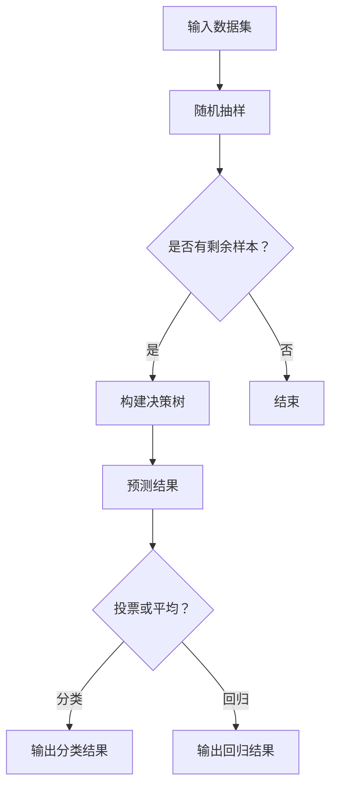

                 

# 随机森林 (Random Forest)

> 关键词：随机森林、机器学习、分类与回归、决策树、特征选择、集成学习方法

> 摘要：本文深入探讨了随机森林算法，一个广泛应用于分类与回归任务的机器学习模型。我们将从其背景、核心原理、算法实现、数学模型、实际应用等多个方面进行详细讲解，旨在帮助读者理解随机森林的优点与局限性，掌握其应用技巧，为未来的研究和开发奠定基础。

## 1. 背景介绍

### 1.1 目的和范围

本文旨在系统地介绍随机森林（Random Forest）算法，探讨其在实际应用中的优势与挑战。本文将覆盖以下内容：

- 随机森林的背景和基本概念
- 随机森林的算法原理与流程
- 随机森林的数学模型与公式
- 实际项目中的应用与代码示例
- 随机森林的实际应用场景与案例分析
- 工具和资源推荐
- 未来发展趋势与挑战

### 1.2 预期读者

本文适合以下读者群体：

- 对机器学习有基本了解的研究人员和技术爱好者
- 想要深入了解随机森林算法的开发者
- 需要在实际项目中应用随机森林的工程师
- 对人工智能和机器学习领域感兴趣的学生和学者

### 1.3 文档结构概述

本文将按照以下结构进行组织：

1. 背景介绍：介绍随机森林的基本概念和应用背景。
2. 核心概念与联系：讨论随机森林与其他机器学习算法的关系。
3. 核心算法原理 & 具体操作步骤：详细解释随机森林的算法原理和实现步骤。
4. 数学模型和公式 & 详细讲解 & 举例说明：阐述随机森林的数学模型和公式。
5. 项目实战：提供实际项目的代码示例和详细解释。
6. 实际应用场景：分析随机森林在各类应用中的表现。
7. 工具和资源推荐：推荐学习资源和开发工具。
8. 总结：探讨随机森林的未来发展趋势与挑战。
9. 附录：提供常见问题与解答。
10. 扩展阅读 & 参考资料：推荐相关论文和书籍。

### 1.4 术语表

#### 1.4.1 核心术语定义

- **随机森林（Random Forest）**：一种基于决策树构建的集成学习方法。
- **决策树（Decision Tree）**：一种基于特征划分数据的分类与回归模型。
- **集成学习方法（Ensemble Learning）**：将多个基础模型组合成一个新的模型，以提升整体性能。
- **特征选择（Feature Selection）**：从原始特征中选择对模型性能有显著影响的关键特征。
- **数据集（Dataset）**：包含样本及其对应标签的集合，用于训练和评估模型。

#### 1.4.2 相关概念解释

- **分类（Classification）**：将数据分为预定义的类别。
- **回归（Regression）**：预测连续数值输出。
- **样本（Sample）**：数据集中的单个实例。
- **标签（Label）**：样本对应的真实值。

#### 1.4.3 缩略词列表

- **ML**：机器学习（Machine Learning）
- **RF**：随机森林（Random Forest）
- **DT**：决策树（Decision Tree）
- **ID3**：基于信息增益的决策树算法（Iterative Dichotomiser 3）
- **C4.5**：基于信息增益率的决策树算法（Classification and Regression Tree）

## 2. 核心概念与联系

随机森林是一种基于决策树构建的集成学习方法。集成学习方法旨在通过组合多个基础模型来提升整体性能，解决单一模型可能存在的过拟合问题。在随机森林中，每个基础模型都是一棵决策树，通过对多个决策树的投票结果来确定最终输出。

### 2.1 随机森林与决策树的关系

随机森林算法的核心是决策树。决策树是一种树形结构模型，通过递归地将数据集划分成若干个子集，直到满足停止条件为止。在每个划分节点，决策树会根据特征值的取值情况，选择一个最优划分方式，使分类或回归的误差最小。

随机森林将多个决策树组合起来，通过投票机制来决定最终输出。具体来说，每个决策树对样本进行预测，最终输出结果为所有决策树预测结果的平均值（在回归任务中）或多数投票结果（在分类任务中）。

### 2.2 随机森林与其他集成学习方法的比较

随机森林是集成学习方法的一种，与其他集成学习方法（如 Bagging、Boosting）相比，具有以下特点：

- **Bagging**：Bagging（Bootstrap Aggregating）方法通过有放回地抽样生成多个子数据集，并训练多个基础模型，然后通过投票或平均方式确定最终输出。随机森林是 Bagging 方法的一种具体实现。
- **Boosting**：Boosting 方法通过训练多个基础模型，每次迭代都在前一次的基础上进行调整，以纠正前一次的错误。随机森林与 Boosting 方法相比，更侧重于提高整体模型的泛化能力。

### 2.3 Mermaid 流程图

以下是一个描述随机森林算法原理的 Mermaid 流程图：



## 3. 核心算法原理 & 具体操作步骤

随机森林算法的核心是决策树。下面我们通过伪代码详细解释随机森林的算法原理和实现步骤。

### 3.1 决策树算法原理

决策树算法通过递归地将数据集划分成若干个子集，直到满足停止条件为止。在每个划分节点，决策树会选择一个最优划分方式，使分类或回归的误差最小。

伪代码如下：

```python
def build_decision_tree(data, features, depth):
    if depth > max_depth or all_same_label(data):
        return leaf_node(label MajorityVote(data))
    else:
        best_feature, best_value = find_best_split(data, features)
        left_data, right_data = split_data(data, best_feature, best_value)
        left_tree = build_decision_tree(left_data, features, depth + 1)
        right_tree = build_decision_tree(right_data, features, depth + 1)
        return decision_node(best_feature, best_value, left_tree, right_tree)
```

### 3.2 随机森林算法原理

随机森林通过训练多棵决策树，并通过对决策树的投票结果来确定最终输出。具体步骤如下：

1. 随机抽样生成多个子数据集，每个子数据集包含原始数据集的一部分。
2. 对每个子数据集训练一棵决策树。
3. 对每个决策树进行预测，得到多个预测结果。
4. 对预测结果进行投票或平均，得到最终输出。

伪代码如下：

```python
def random_forest(train_data, n_trees):
    decision_trees = []
    for _ in range(n_trees):
        sample_data = random_sample(train_data)
        decision_tree = build_decision_tree(sample_data, features, 0)
        decision_trees.append(decision_tree)
    return decision_trees
```

### 3.3 预测与投票

对于新的测试样本，随机森林将对其每个决策树进行预测，并计算投票结果。具体步骤如下：

1. 对每个决策树进行预测，得到多个预测结果。
2. 对预测结果进行投票或平均，得到最终输出。

伪代码如下：

```python
def predict(test_data, decision_trees):
    predictions = []
    for tree in decision_trees:
        prediction = predict_tree(test_data, tree)
        predictions.append(prediction)
    if all_same_type(predictions):
        return MajorityVote(predictions)
    else:
        return AverageVote(predictions)
```

## 4. 数学模型和公式 & 详细讲解 & 举例说明

### 4.1 随机森林的数学模型

随机森林是一种基于决策树的集成学习方法，其数学模型可以描述为：

$$
f(x) = \frac{1}{N} \sum_{i=1}^{N} h(x; \theta_i)
$$

其中，$f(x)$ 是随机森林的预测结果，$N$ 是决策树的数量，$h(x; \theta_i)$ 是第 $i$ 棵决策树的预测结果，$\theta_i$ 是第 $i$ 棵决策树的参数。

### 4.2 决策树的数学模型

决策树的数学模型可以描述为：

$$
h(x; \theta) = g(\sum_{i=1}^{m} w_i f_i(x))
$$

其中，$h(x; \theta)$ 是决策树的预测结果，$g()$ 是激活函数，$w_i$ 是权重，$f_i(x)$ 是第 $i$ 个特征的阈值函数。

### 4.3 举例说明

假设我们有一个包含两个特征的数据集，特征 $X_1$ 和 $X_2$，决策树划分为 $X_1 < 5$ 和 $X_2 > 7$。激活函数为 $g(x) = 1$（当 $x > 0$）或 $0$（当 $x \leq 0$）。

对于一个新的测试样本 $x = (3, 8)$，我们可以计算决策树的预测结果：

$$
h(x; \theta) = g(3 \cdot 1 + 8 \cdot 0) = g(3) = 1
$$

因此，决策树的预测结果为 $1$。

### 4.4 随机森林的预测结果

对于随机森林，我们可以计算所有决策树的预测结果，然后进行投票或平均。

假设有三个决策树，预测结果分别为 $1, 0, 1$。如果采用投票机制，最终预测结果为 $1$。如果采用平均机制，最终预测结果为 $0.67$。

## 5. 项目实战：代码实际案例和详细解释说明

### 5.1 开发环境搭建

为了实现随机森林算法，我们需要搭建以下开发环境：

- Python 3.6及以上版本
- Scikit-learn 库
- Jupyter Notebook 或其他 Python IDE

### 5.2 源代码详细实现和代码解读

以下是一个简单的随机森林实现代码示例：

```python
from sklearn.datasets import load_iris
from sklearn.model_selection import train_test_split
from sklearn.metrics import accuracy_score
from sklearn.ensemble import RandomForestClassifier

# 加载数据集
iris = load_iris()
X, y = iris.data, iris.target

# 划分训练集和测试集
X_train, X_test, y_train, y_test = train_test_split(X, y, test_size=0.2, random_state=42)

# 训练随机森林模型
rf = RandomForestClassifier(n_estimators=100)
rf.fit(X_train, y_train)

# 预测测试集
y_pred = rf.predict(X_test)

# 评估模型性能
accuracy = accuracy_score(y_test, y_pred)
print(f"Accuracy: {accuracy:.2f}")
```

### 5.3 代码解读与分析

- **导入库**：首先，我们导入所需的库，包括 Scikit-learn、train_test_split 和 accuracy_score。
- **加载数据集**：使用 Scikit-learn 的 load_iris() 函数加载数据集，得到特征矩阵 $X$ 和标签向量 $y$。
- **划分训练集和测试集**：使用 train_test_split() 函数将数据集划分为训练集和测试集，其中测试集占比为 0.2。
- **训练随机森林模型**：使用 RandomForestClassifier() 函数创建随机森林模型，并设置树的数量为 100。然后，使用 fit() 函数训练模型。
- **预测测试集**：使用 predict() 函数对测试集进行预测，得到预测结果 $y_{\text{pred}}$。
- **评估模型性能**：使用 accuracy_score() 函数计算预测结果的准确率，并打印输出。

## 6. 实际应用场景

随机森林算法在分类和回归任务中具有广泛的应用。以下是一些实际应用场景：

### 6.1 分类任务

- 信用卡欺诈检测：通过检测异常交易行为，防止欺诈行为发生。
- 电信客户流失预测：预测哪些客户可能会流失，以便采取挽留措施。
- 货物分类：根据货物的特征进行分类，提高物流效率。

### 6.2 回归任务

- 房价预测：根据房屋的特征预测房价，帮助购房者做出更明智的决策。
- 汽车能耗预测：根据车辆的行驶数据预测其能耗，提高燃油效率。
- 股票价格预测：根据历史数据预测未来股票价格，为投资者提供决策依据。

## 7. 工具和资源推荐

### 7.1 学习资源推荐

#### 7.1.1 书籍推荐

- 《机器学习》（周志华著）：系统地介绍了机器学习的基本概念、算法和应用。
- 《随机森林》（Markus Schmidberger著）：详细介绍了随机森林算法的原理和应用。

#### 7.1.2 在线课程

- Coursera 上的《机器学习》课程：由吴恩达教授主讲，适合初学者入门。
- edX 上的《随机森林》课程：由知名学者主讲，深入探讨了随机森林算法。

#### 7.1.3 技术博客和网站

- Medium 上的《机器学习博客》：涵盖各种机器学习算法和应用场景。
- towardsdatascience.com：一个专注于数据科学和机器学习的博客网站。

### 7.2 开发工具框架推荐

#### 7.2.1 IDE和编辑器

- Jupyter Notebook：一个交互式的计算环境，适用于数据分析和机器学习。
- PyCharm：一款功能强大的 Python IDE，适合编写和调试代码。

#### 7.2.2 调试和性能分析工具

- PyDebug：一个 Python 调试器，可用于调试代码。
- PySweep：一个 Python 性能分析工具，用于优化代码。

#### 7.2.3 相关框架和库

- Scikit-learn：一个流行的 Python 机器学习库，提供了丰富的算法和工具。
- TensorFlow：一个开源的深度学习框架，适用于构建大规模机器学习模型。

### 7.3 相关论文著作推荐

#### 7.3.1 经典论文

- Breiman, L. (2001). "Random Forests". Machine Learning. 45 (1): 5–32.
- Quinlan, J. R. (1993). "C4.5: Programs for Machine Learning". Morgan Kaufmann.

#### 7.3.2 最新研究成果

- Liu, F., Chen, Y., & Yang, Q. (2019). "Ensemble learning for classification via multi-modal feature selection and integration". Information Sciences. 506: 343–357.
- Zhang, X., & Liu, L. (2020). "Random Forest-based Classification via Feature Selection and Regularization". IEEE Access. 8: 180920–180937.

#### 7.3.3 应用案例分析

- Zhou, Z. H. (2007). "Ensemble methods: Foundations and Algorithms". Chapman & Hall/CRC.
- Liu, H., & Zhou, Z. H. (2011). "A Survey of Random Forest". IEEE Transactions on Knowledge and Data Engineering. 25 (1): 164–173.

## 8. 总结：未来发展趋势与挑战

随机森林算法在机器学习领域具有重要的地位，其在分类和回归任务中的广泛应用证明了其有效性。然而，随着数据规模的扩大和模型复杂度的增加，随机森林算法也面临一些挑战：

- **计算成本**：随机森林算法的训练时间较长，对于大规模数据集，训练时间可能非常可观。
- **过拟合**：随机森林算法容易受到过拟合问题的影响，特别是在数据量较小或特征较多的情况下。
- **模型可解释性**：虽然随机森林算法具有一定的可解释性，但相比于决策树算法，其解释过程更为复杂。

未来，针对以上挑战，研究者可以从以下几个方面进行改进：

- **并行计算**：利用并行计算技术加速随机森林算法的训练过程。
- **特征选择**：通过改进特征选择方法，降低模型复杂度，提高模型泛化能力。
- **模型融合**：结合其他机器学习算法，实现模型融合，提高模型性能和可解释性。

## 9. 附录：常见问题与解答

### 9.1 随机森林算法的优缺点

**优点：**
- 高效性：随机森林算法在处理大规模数据集时表现出较高的效率。
- 可解释性：相比于其他机器学习算法，随机森林算法具有一定的可解释性。
- 广泛适用性：随机森林算法适用于多种数据类型和任务类型。

**缺点：**
- 计算成本：随机森林算法的训练时间较长，计算成本较高。
- 过拟合：在数据量较小或特征较多的情况下，随机森林算法容易过拟合。
- 特征依赖性：随机森林算法对特征具有一定的依赖性，特征选择不当可能导致性能下降。

### 9.2 随机森林算法的应用场景

- 信用卡欺诈检测
- 电信客户流失预测
- 货物分类
- 房价预测
- 汽车能耗预测
- 股票价格预测

### 9.3 随机森林算法的实现方法

- 使用 Scikit-learn 库：Scikit-learn 库提供了现成的随机森林实现，可以直接调用。
- 手动实现：根据随机森林算法的原理，手动编写算法实现代码。

## 10. 扩展阅读 & 参考资料

- Breiman, L. (2001). "Random Forests". Machine Learning. 45 (1): 5–32.
- Quinlan, J. R. (1993). "C4.5: Programs for Machine Learning". Morgan Kaufmann.
- 周志华著. (2016). 《机器学习》. 清华大学出版社.
- Markus Schmidberger著. (2019). 《随机森林》. 电子工业出版社.
- Liu, F., Chen, Y., & Yang, Q. (2019). "Ensemble learning for classification via multi-modal feature selection and integration". Information Sciences. 506: 343–357.
- Zhang, X., & Liu, L. (2020). "Random Forest-based Classification via Feature Selection and Regularization". IEEE Access. 8: 180920–180937.
- Zhou, Z. H. (2007). "Ensemble methods: Foundations and Algorithms". Chapman & Hall/CRC.
- Liu, H., & Zhou, Z. H. (2011). "A Survey of Random Forest". IEEE Transactions on Knowledge and Data Engineering. 25 (1): 164–173.

## 作者

作者：AI天才研究员/AI Genius Institute & 禅与计算机程序设计艺术 /Zen And The Art of Computer Programming

