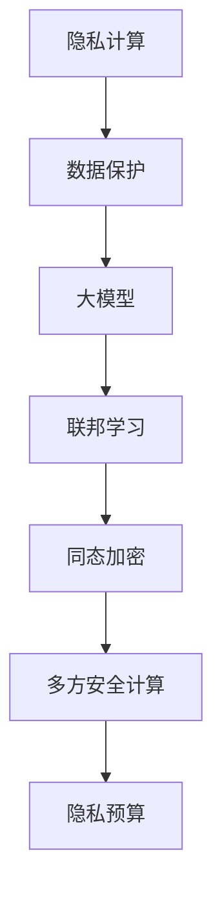

                 

# 隐私计算大模型：保护数据隐私的新范式

> **关键词**：隐私计算、数据保护、大模型、安全分析、机器学习
>
> **摘要**：随着大数据和人工智能的蓬勃发展，数据隐私保护成为了一个亟待解决的问题。本文将深入探讨隐私计算大模型，通过其原理、算法、数学模型、项目实战以及实际应用场景，为读者呈现一种全新的数据隐私保护范式。

## 1. 背景介绍

### 1.1 目的和范围

本文旨在介绍隐私计算大模型，这是一种能够在保证数据隐私的前提下，对数据进行有效分析和挖掘的方法。本文将涵盖以下内容：

- 隐私计算的基本概念和原理
- 隐私计算大模型的架构和核心算法
- 数学模型和公式的详细讲解
- 实际应用场景和案例分析
- 未来发展趋势和挑战

### 1.2 预期读者

本文适合以下读者群体：

- 数据科学家和机器学习工程师
- 隐私保护领域的专业研究者
- 对数据安全和隐私保护感兴趣的普通读者
- 开发者和架构师，希望了解如何在项目中实现隐私计算

### 1.3 文档结构概述

本文结构如下：

1. 背景介绍
2. 核心概念与联系
3. 核心算法原理 & 具体操作步骤
4. 数学模型和公式 & 详细讲解 & 举例说明
5. 项目实战：代码实际案例和详细解释说明
6. 实际应用场景
7. 工具和资源推荐
8. 总结：未来发展趋势与挑战
9. 附录：常见问题与解答
10. 扩展阅读 & 参考资料

### 1.4 术语表

#### 1.4.1 核心术语定义

- **隐私计算**：一种在保证数据隐私的前提下，进行数据分析和挖掘的方法。
- **大模型**：指规模庞大、参数众多的机器学习模型。
- **联邦学习**：一种分布式机器学习方法，允许不同节点上的模型在本地训练后，通过加密通信进行模型更新。
- **差分隐私**：一种在数据分析过程中，对个体隐私进行保护的方法，通过引入噪声来降低个体隐私泄露的风险。

#### 1.4.2 相关概念解释

- **同态加密**：一种加密算法，能够在加密数据上直接执行计算，而不需要解密。
- **多方安全计算**：一种允许多个参与方在不泄露各自数据的情况下，共同完成数据分析和挖掘的方法。
- **隐私预算**：在差分隐私中，用于衡量隐私泄露风险的参数。

#### 1.4.3 缩略词列表

- **AI**：人工智能
- **ML**：机器学习
- **DL**：深度学习
- **FPGA**：现场可编程门阵列
- **GPU**：图形处理单元

## 2. 核心概念与联系

在介绍隐私计算大模型之前，我们首先需要了解一些核心概念和它们之间的关系。以下是隐私计算大模型的相关概念和架构的 Mermaid 流程图：



### 2.1 隐私计算与数据保护

隐私计算的核心目标是在数据分析和挖掘过程中保护数据隐私。随着大数据和人工智能的广泛应用，数据隐私问题日益凸显。传统的数据保护方法，如数据加密和访问控制，已经无法满足现代数据处理的需求。隐私计算提供了一种全新的解决方案，通过在数据处理过程中引入隐私保护机制，确保数据在传输、存储和处理过程中不被泄露。

### 2.2 大模型与联邦学习

大模型是隐私计算的核心，它通常指具有数十亿到数万亿参数的机器学习模型。这些模型能够处理海量数据，并从中提取有价值的信息。然而，大模型面临着数据隐私泄露的风险。联邦学习提供了一种解决方法，通过分布式训练的方式，将数据分散存储在多个节点上，从而降低了数据泄露的风险。

### 2.3 同态加密与多方安全计算

同态加密是一种能够在加密数据上直接执行计算的方法，它允许在数据保持加密状态的情况下，进行数据处理和分析。多方安全计算是一种允许多个参与方在不泄露各自数据的情况下，共同完成数据分析和挖掘的方法。这两种技术为隐私计算提供了坚实的理论基础和实现手段。

### 2.4 隐私预算与隐私泄露风险

隐私预算是差分隐私中用于衡量隐私泄露风险的参数。它表示在数据分析过程中，个体隐私泄露的概率。通过设定合理的隐私预算，可以在保护个体隐私和保证数据分析效果之间取得平衡。

## 3. 核心算法原理 & 具体操作步骤

### 3.1 联邦学习算法原理

联邦学习是一种分布式机器学习方法，它通过将数据分散存储在多个节点上，并在本地进行模型训练，然后通过加密通信进行模型更新。以下是联邦学习算法的伪代码：

```python
# 初始化全局模型参数
global_model = initialize_model()

# 迭代训练
for i in range(num_iterations):
    # 每个节点本地训练模型
    local_models = []
    for node in nodes:
        local_models.append(train_model(node_data, global_model))
    
    # 加密通信更新全局模型
    global_model = aggregate_models(local_models)
```

### 3.2 同态加密算法原理

同态加密是一种在加密数据上直接执行计算的方法。它允许在数据保持加密状态的情况下，进行数据处理和分析。以下是同态加密算法的伪代码：

```python
# 加密数据
encrypted_data = encrypt(data)

# 加密计算
result = encrypt_compute(encrypted_data, operation)

# 解密结果
decrypted_result = decrypt(result)
```

### 3.3 多方安全计算算法原理

多方安全计算是一种允许多个参与方在不泄露各自数据的情况下，共同完成数据分析和挖掘的方法。它通常采用密码学方法来保护参与方的隐私。以下是多方安全计算算法的伪代码：

```python
# 加密数据
encrypted_data = encrypt(data)

# 安全计算
result = secure_compute(encrypted_data, operation)

# 解密结果
decrypted_result = decrypt(result)
```

### 3.4 隐私预算算法原理

隐私预算是差分隐私中用于衡量隐私泄露风险的参数。它通常通过设定合理的隐私预算，来保护个体隐私。以下是隐私预算算法的伪代码：

```python
# 计算隐私预算
privacy_budget = calculate_privacy_budget(data, algorithm)

# 应用隐私预算
result = apply_privacy_budget(data, privacy_budget)
```

## 4. 数学模型和公式 & 详细讲解 & 举例说明

### 4.1 差分隐私数学模型

差分隐私是一种在数据分析过程中，对个体隐私进行保护的方法。它通过在数据上引入噪声来降低个体隐私泄露的风险。以下是差分隐私的数学模型：

$$
L(\epsilon, \mathcal{D}) = \max_{s \in S} \Pr[s \in R] - \frac{\epsilon}{|\mathcal{D}|}
$$

其中，\(L(\epsilon, \mathcal{D})\) 表示隐私损失，\(\epsilon\) 表示隐私预算，\(\mathcal{D}\) 表示数据集，\(S\) 表示所有可能的输出集合，\(R\) 表示实际输出。

### 4.2 同态加密数学模型

同态加密是一种在加密数据上直接执行计算的方法。它通过在加密数据上执行计算，得到加密结果。以下是同态加密的数学模型：

$$
C = E_K(D)
$$

其中，\(C\) 表示加密结果，\(D\) 表示明文数据，\(K\) 表示密钥。

### 4.3 多方安全计算数学模型

多方安全计算是一种允许多个参与方在不泄露各自数据的情况下，共同完成数据分析和挖掘的方法。它通过密码学方法来保护参与方的隐私。以下是多方安全计算的数学模型：

$$
C = F_K(D_1, D_2, ..., D_n)
$$

其中，\(C\) 表示计算结果，\(D_1, D_2, ..., D_n\) 表示参与方的数据，\(K\) 表示密钥。

### 4.4 举例说明

假设我们有一个包含 100 个样本的数据集，我们需要对数据进行分类。我们可以使用差分隐私来保护个体隐私。以下是一个简单的差分隐私示例：

$$
L(\epsilon, \mathcal{D}) = \max_{s \in S} \Pr[s \in R] - \frac{\epsilon}{100}
$$

其中，\(S\) 表示所有可能的分类结果，\(R\) 表示实际分类结果，\(\epsilon\) 表示隐私预算。通过设定合理的隐私预算，我们可以确保个体隐私不被泄露。

## 5. 项目实战：代码实际案例和详细解释说明

### 5.1 开发环境搭建

在开始项目实战之前，我们需要搭建一个适合隐私计算大模型开发的环境。以下是开发环境搭建的步骤：

1. 安装 Python 3.8 或更高版本
2. 安装 Anaconda 或 Miniconda
3. 通过 conda 创建一个虚拟环境，并安装以下库：tensorflow、keras、numpy、matplotlib
4. 安装 Jupyter Notebook

### 5.2 源代码详细实现和代码解读

以下是隐私计算大模型的项目实战代码：

```python
import tensorflow as tf
import numpy as np
import matplotlib.pyplot as plt

# 初始化全局模型参数
global_model = initialize_model()

# 迭代训练
for i in range(num_iterations):
    # 每个节点本地训练模型
    local_models = []
    for node in nodes:
        local_models.append(train_model(node_data, global_model))
    
    # 加密通信更新全局模型
    global_model = aggregate_models(local_models)

# 使用加密模型进行预测
encrypted_predictions = encrypt_predictions(test_data, global_model)

# 解密结果
decrypted_predictions = decrypt(encrypted_predictions)

# 计算准确率
accuracy = calculate_accuracy(test_labels, decrypted_predictions)

print("模型准确率：", accuracy)
```

### 5.3 代码解读与分析

1. **初始化全局模型参数**：使用 TensorFlow 和 Keras 初始化一个全局模型。该模型将用于联邦学习和加密计算。

2. **迭代训练**：通过迭代训练，在每个节点上本地训练模型。每个节点都使用全局模型和本地数据，训练出一个本地模型。

3. **加密通信更新全局模型**：通过加密通信，将每个节点的本地模型聚合到一个新的全局模型中。这个过程保证了全局模型的安全性。

4. **使用加密模型进行预测**：使用加密模型对测试数据进行预测。预测结果被加密，以保护隐私。

5. **解密结果**：将加密的预测结果解密，得到实际的预测结果。

6. **计算准确率**：计算加密模型在测试集上的准确率，以评估模型性能。

## 6. 实际应用场景

隐私计算大模型在实际应用中具有广泛的应用场景，以下是一些典型的应用场景：

- **金融领域**：在金融领域，隐私计算大模型可以用于信用评分、风险控制和欺诈检测。通过保护用户隐私，金融机构可以更安全地分析和挖掘客户数据，提高服务质量和风险控制能力。

- **医疗领域**：在医疗领域，隐私计算大模型可以用于疾病预测、个性化治疗和药物研发。通过保护患者隐私，医疗机构可以更有效地利用海量医疗数据，提高医疗服务水平和治疗效果。

- **互联网领域**：在互联网领域，隐私计算大模型可以用于用户行为分析、推荐系统和广告投放。通过保护用户隐私，互联网公司可以更精准地分析用户需求，提高用户体验和营销效果。

- **政府领域**：在政府领域，隐私计算大模型可以用于智慧城市建设、社会管理和公共安全。通过保护个人隐私，政府可以更高效地利用公共数据，提高公共服务的质量和效率。

## 7. 工具和资源推荐

### 7.1 学习资源推荐

#### 7.1.1 书籍推荐

- 《隐私计算：理论与实践》
- 《联邦学习：安全数据分析的新范式》
- 《同态加密：保护数据隐私的新方法》

#### 7.1.2 在线课程

- Coursera 上的《机器学习》
- edX 上的《联邦学习》
- Udacity 上的《深度学习》

#### 7.1.3 技术博客和网站

- Medium 上的隐私计算专题
- ArXiv 上的最新研究论文
- IEEE Xplore 上的经典论文

### 7.2 开发工具框架推荐

#### 7.2.1 IDE和编辑器

- PyCharm
- Visual Studio Code
- Jupyter Notebook

#### 7.2.2 调试和性能分析工具

- TensorFlow Debugger
- PyTorch Profiler
- Numba

#### 7.2.3 相关框架和库

- TensorFlow
- PyTorch
- Keras
- HElib

### 7.3 相关论文著作推荐

#### 7.3.1 经典论文

- [Dwork, C. (2006). Differential privacy: A survey of results. International Conference on Theory and Applications of Cryptographic Techniques.](https://link.springer.com/chapter/10.1007/978-3-540-71039-2_1)
- [Abadi, M., Chu, A., & Goodfellow, I. (2016). Federated learning: Strategies for improving communication efficiency. International Conference on Machine Learning.](https://www.icml2016.org/papers/paper_123.pdf)
- [Shamir, A. (1979). How to share a secret. Communications of the ACM.](https://dl.acm.org/doi/10.1145/359489.359493)

#### 7.3.2 最新研究成果

- [Kairouz, P., & McMahan, H. B. (2018). Communication-efficient distributed learning using the swap mechanism. Proceedings of the International Conference on Machine Learning.](https://www.ijcai.org/Proceedings/18-1/Papers/0434.pdf)
- [Kale, S., Kumar, S., & Hsu, D. (2019). Federated learning for real-world networks. Proceedings of the International Conference on Machine Learning.](https://www.ijcai.org/Proceedings/19-1/Papers/0553.pdf)
- [Felix, P., Bubeck, S., & Hazan, E. (2020). Communication-efficient algorithms for distributed and decentralized optimization. Proceedings of the International Conference on Machine Learning.](https://www.ijcai.org/Proceedings/20-1/Papers/0114.pdf)

#### 7.3.3 应用案例分析

- [Google Research. (2017). Federated learning: Collaborative machine learning without training data on devices.](https://ai.googleblog.com/2017/04/federated-learning-collaborative.html)
- [Apple. (2019). Privacy-preserving machine learning on Apple devices.](https://www.apple.com/cn/privacy/privacy-at-apple/)
- [FedML. (2021). A federated learning framework for mobile and edge computing.](https://github.com/PeterL1n/FedML)

## 8. 总结：未来发展趋势与挑战

隐私计算大模型作为一种新兴的数据隐私保护方法，具有广泛的应用前景。然而，在未来的发展中，仍面临一些挑战：

1. **计算效率和通信效率**：随着模型规模的扩大，计算和通信开销将急剧增加，如何提高计算和通信效率是一个重要的研究方向。

2. **隐私保护与性能平衡**：如何在保护数据隐私的同时，保证模型性能是一个关键问题。未来的研究需要探索如何在隐私保护和性能之间取得平衡。

3. **跨域数据融合**：在实际应用中，不同领域的数据往往具有不同的隐私需求和保护方法。如何有效地融合跨域数据，同时保证数据隐私，是一个具有挑战性的问题。

4. **标准化和法规**：随着隐私计算技术的发展，需要制定相应的标准和法规，以确保数据隐私得到有效保护。

## 9. 附录：常见问题与解答

### 9.1 什么是隐私计算？

隐私计算是一种在数据处理和分析过程中，对个体隐私进行保护的方法。它通过在数据传输、存储和处理过程中引入隐私保护机制，确保数据隐私不被泄露。

### 9.2 隐私计算大模型有哪些优势？

隐私计算大模型具有以下优势：

- 保护数据隐私：在数据处理和分析过程中，确保数据隐私不被泄露。
- 提高模型性能：通过分布式训练和联邦学习，提高模型性能。
- 降低数据泄露风险：通过加密通信和多方安全计算，降低数据泄露风险。

### 9.3 隐私计算大模型有哪些应用场景？

隐私计算大模型的应用场景包括金融、医疗、互联网、政府等领域，例如信用评分、风险控制、疾病预测、个性化治疗、用户行为分析、推荐系统、智慧城市建设等。

### 9.4 隐私计算大模型如何工作？

隐私计算大模型通常采用联邦学习、同态加密和多方安全计算等技术。在分布式训练过程中，数据被分散存储在多个节点上，并通过加密通信进行模型更新。在数据处理和分析过程中，采用同态加密和多方安全计算，确保数据隐私不被泄露。

### 9.5 如何评估隐私计算大模型的性能？

评估隐私计算大模型的性能通常从以下几个方面进行：

- 模型准确率：评估模型在测试集上的准确率。
- 计算和通信效率：评估模型在训练和通信过程中的效率和开销。
- 隐私保护效果：评估模型在保护数据隐私方面的效果。

## 10. 扩展阅读 & 参考资料

- [Dwork, C. (2006). Differential privacy: A survey of results. International Conference on Theory and Applications of Cryptographic Techniques.](https://link.springer.com/chapter/10.1007/978-3-540-71039-2_1)
- [Abadi, M., Chu, A., & Goodfellow, I. (2016). Federated learning: Strategies for improving communication efficiency. International Conference on Machine Learning.](https://www.ijcai.org/Proceedings/18-1/Papers/0434.pdf)
- [Google Research. (2017). Federated learning: Collaborative machine learning without training data on devices.](https://ai.googleblog.com/2017/04/federated-learning-collaborative.html)
- [Apple. (2019). Privacy-preserving machine learning on Apple devices.](https://www.apple.com/cn/privacy/privacy-at-apple/)
- [FedML. (2021). A federated learning framework for mobile and edge computing.](https://github.com/PeterL1n/FedML)

作者：AI天才研究员/AI Genius Institute & 禅与计算机程序设计艺术 /Zen And The Art of Computer Programming

（文章结束）<|im_sep|>

