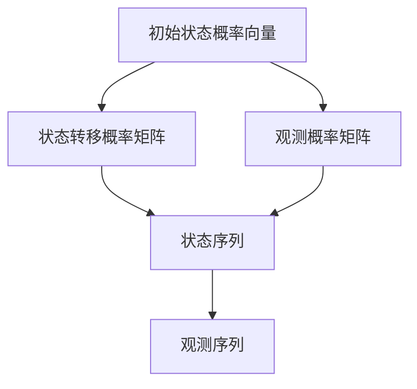

                 

# 隐马尔可夫模型 (Hidden Markov Models, HMM) 原理与代码实例讲解

> 关键词：隐马尔可夫模型，HMM，概率模型，状态转移矩阵，观测序列，状态估计，维特比算法，应用案例

> 摘要：本文将详细讲解隐马尔可夫模型（Hidden Markov Models, HMM）的基本原理、数学模型、算法实现以及实际应用。通过对HMM的深入剖析，读者将了解如何使用这种强大的概率模型解决实际问题，并在代码实例中掌握HMM的应用技巧。

## 1. 背景介绍

### 1.1 目的和范围

本文旨在为读者提供关于隐马尔可夫模型（HMM）的全面了解。我们将首先介绍HMM的起源和基本概念，然后深入探讨其数学模型和算法原理。最后，通过实际代码实例，展示如何将HMM应用于实际问题解决中。本文适合对概率模型和机器学习有一定了解的读者，特别是那些希望深入理解HMM原理和应用的读者。

### 1.2 预期读者

预期读者是那些对机器学习和统计模型有基本了解，并希望进一步掌握HMM的工程师、研究人员和学者。特别是那些希望在自然语言处理、语音识别、生物信息学等领域应用HMM的读者。

### 1.3 文档结构概述

本文将分为以下几个部分：

1. **背景介绍**：介绍HMM的起源、目的和重要性。
2. **核心概念与联系**：通过Mermaid流程图展示HMM的核心概念和架构。
3. **核心算法原理 & 具体操作步骤**：详细讲解HMM的核心算法，包括状态估计和序列预测。
4. **数学模型和公式 & 详细讲解 & 举例说明**：使用数学公式和示例说明HMM的数学模型。
5. **项目实战：代码实际案例和详细解释说明**：通过具体代码实例展示HMM的实际应用。
6. **实际应用场景**：讨论HMM在不同领域的应用。
7. **工具和资源推荐**：推荐学习资源、开发工具和论文著作。
8. **总结：未来发展趋势与挑战**：总结HMM的发展趋势和面临的挑战。
9. **附录：常见问题与解答**：回答读者可能遇到的问题。
10. **扩展阅读 & 参考资料**：提供进一步学习的参考资料。

### 1.4 术语表

#### 1.4.1 核心术语定义

- **隐马尔可夫模型（HMM）**：一种基于概率的统计模型，用于描述一系列不可观测状态和可观测输出之间的关系。
- **状态（State）**：HMM中的不可观测实体，表示系统的当前状态。
- **观测（Observation）**：HMM中的可观测实体，表示系统在某一状态下的输出。
- **状态转移概率（State Transition Probability）**：表示从某一状态转移到另一状态的概率。
- **观测概率（Observation Probability）**：表示在某一状态下产生某一观测的概率。

#### 1.4.2 相关概念解释

- **马尔可夫性（Markov Property）**：系统的未来状态仅依赖于当前状态，与过去状态无关。
- **前向-后向算法（Forward-Backward Algorithm）**：一种用于估计HMM中状态概率的算法。
- **维特比算法（Viterbi Algorithm）**：一种用于序列最优状态估计的动态规划算法。

#### 1.4.3 缩略词列表

- **HMM**：隐马尔可夫模型（Hidden Markov Model）
- **Viterbi**：维特比算法（Viterbi Algorithm）
- **EM**：期望最大化算法（Expectation-Maximization Algorithm）

## 2. 核心概念与联系

隐马尔可夫模型（HMM）是一种用于描述一系列不可观测状态和可观测输出之间关系的概率模型。为了更好地理解HMM，我们首先需要了解其核心概念和架构。

### 2.1 HMM的基本概念

HMM由以下五个组件构成：

1. **状态集合（S）**：系统可能处于的所有状态。
2. **观测集合（O）**：系统在各个状态下可能产生的所有观测。
3. **状态转移概率矩阵（A）**：描述状态之间的转移概率。
4. **观测概率矩阵（B）**：描述在各个状态下产生不同观测的概率。
5. **初始状态概率向量（π）**：描述初始状态的概率分布。

### 2.2 HMM的架构

HMM的架构可以用以下Mermaid流程图表示：



### 2.3 HMM的核心概念与联系

HMM的核心概念包括：

1. **状态转移概率（A）**：表示系统在当前状态下，下一个状态可能是什么的概率。例如，状态1转移到状态2的概率为0.7，状态2转移到状态1的概率为0.3。
2. **观测概率（B）**：表示在某个状态下，系统产生某个观测的概率。例如，在状态1下，观测A的概率为0.6，观测B的概率为0.4。
3. **初始状态概率（π）**：表示系统在初始状态下，各个状态的初始概率分布。例如，初始状态为状态1的概率为0.8，状态2的概率为0.2。
4. **马尔可夫性**：HMM满足马尔可夫性，即系统的未来状态仅依赖于当前状态，与过去状态无关。
5. **前向-后向算法**：用于估计给定观测序列下，每个状态的概率分布。
6. **维特比算法**：用于寻找给定观测序列下的最优状态序列。

### 2.4 HMM的应用

HMM在许多领域都有广泛的应用，包括：

1. **语音识别**：使用HMM建模语音信号中的状态和观测，实现语音到文本的转换。
2. **自然语言处理**：使用HMM建模文本序列中的状态和观测，实现语言模型和句法分析。
3. **生物信息学**：使用HMM建模基因组序列中的状态和观测，实现基因识别和功能预测。
4. **计算机视觉**：使用HMM建模图像序列中的状态和观测，实现目标跟踪和运动估计。

## 3. 核心算法原理 & 具体操作步骤

隐马尔可夫模型（HMM）的核心算法包括状态估计和序列预测。下面，我们将详细讲解这些算法的原理和具体操作步骤。

### 3.1 状态估计

状态估计是指给定观测序列，估计HMM中每个状态的概率分布。状态估计通常使用前向-后向算法和维特比算法实现。

#### 3.1.1 前向-后向算法

前向-后向算法是一种概率算法，用于计算给定观测序列下，每个时刻每个状态的概率。具体步骤如下：

1. **初始化**：
   - 设定初始状态概率分布：π(1|θ)。
   - 设定状态转移概率矩阵：A(θ)。
   - 设定观测概率矩阵：B(θ)。
2. **递推计算**：
   - 前向概率：α_t(j) = π(j|θ) * B(j|o_t) * ∑_{k} π(k|θ) * B(k|o_t)。
   - 后向概率：β_t(j) = ∑_{k} A(j|k) * B(k|o_t) * β_t(k)。
3. **计算最终状态概率**：
   - p(θ|x) = ∑_{j} α_t(j) * β_t(j)。

#### 3.1.2 维特比算法

维特比算法是一种动态规划算法，用于寻找给定观测序列下的最优状态序列。具体步骤如下：

1. **初始化**：
   - 设定初始状态概率分布：π(1|θ)。
   - 设定状态转移概率矩阵：A(θ)。
   - 设定观测概率矩阵：B(θ)。
2. **递推计算**：
   - 对于每个时刻t，计算每个状态的累积概率：π_t(j) = π(j|θ) * B(j|o_t)。
   - 对于每个时刻t，找到累积概率最大的状态：v_t(j) = max_{k} [π_t(j) * A(j|k) * B(k|o_t)]。
   - 对于每个时刻t，记录前一个状态：u_t(j) = argmax_{k} [π_t(j) * A(j|k) * B(k|o_t)]。
3. **回溯找到最优状态序列**：
   - 对于最后一个时刻，找到累积概率最大的状态：j* = argmax_{j} v_T(j)。
   - 对于其他时刻，使用u_t(j)回溯找到最优状态序列。

### 3.2 序列预测

序列预测是指给定HMM参数，预测未来的观测序列。序列预测通常使用前向-后向算法和维特比算法实现。

#### 3.2.1 前向-后向算法

前向-后向算法用于计算给定观测序列下，每个时刻每个状态的概率。具体步骤如下：

1. **初始化**：
   - 设定初始状态概率分布：π(1|θ)。
   - 设定状态转移概率矩阵：A(θ)。
   - 设定观测概率矩阵：B(θ)。
2. **递推计算**：
   - 前向概率：α_t(j) = π(j|θ) * B(j|o_t) * ∑_{k} π(k|θ) * B(k|o_t)。
   - 后向概率：β_t(j) = ∑_{k} A(j|k) * B(k|o_t) * β_t(k)。
3. **计算最终观测概率**：
   - p(o|θ) = ∑_{j} α_T(j) * β_T(j)。

#### 3.2.2 维特比算法

维特比算法用于寻找给定观测序列下的最优状态序列。具体步骤如下：

1. **初始化**：
   - 设定初始状态概率分布：π(1|θ)。
   - 设定状态转移概率矩阵：A(θ)。
   - 设定观测概率矩阵：B(θ)。
2. **递推计算**：
   - 对于每个时刻t，计算每个状态的累积概率：π_t(j) = π(j|θ) * B(j|o_t)。
   - 对于每个时刻t，找到累积概率最大的状态：v_t(j) = max_{k} [π_t(j) * A(j|k) * B(k|o_t)]。
   - 对于每个时刻t，记录前一个状态：u_t(j) = argmax_{k} [π_t(j) * A(j|k) * B(k|o_t)]。
3. **回溯找到最优状态序列**：
   - 对于最后一个时刻，找到累积概率最大的状态：j* = argmax_{j} v_T(j)。
   - 对于其他时刻，使用u_t(j)回溯找到最优状态序列。

## 4. 数学模型和公式 & 详细讲解 & 举例说明

隐马尔可夫模型（HMM）的数学模型是其核心组成部分。在这个部分，我们将使用LaTeX格式详细讲解HMM的数学模型和公式，并通过具体示例来说明这些公式的应用。

### 4.1 HMM的数学模型

HMM的数学模型包括状态转移概率矩阵、观测概率矩阵和初始状态概率向量。以下是这些数学模型的具体表示：

#### 4.1.1 状态转移概率矩阵

状态转移概率矩阵A（也称为状态转移矩阵）描述了系统从一个状态转移到另一个状态的概率。其表示为：

$$
A = \begin{bmatrix}
a_{11} & a_{12} & \dots & a_{1N} \\
a_{21} & a_{22} & \dots & a_{2N} \\
\vdots & \vdots & \ddots & \vdots \\
a_{M1} & a_{M2} & \dots & a_{MN}
\end{bmatrix}
$$

其中，$a_{ij}$表示从状态i转移到状态j的概率。

#### 4.1.2 观测概率矩阵

观测概率矩阵B（也称为观测矩阵）描述了系统在某个状态下产生某个观测的概率。其表示为：

$$
B = \begin{bmatrix}
b_{11} & b_{12} & \dots & b_{1N} \\
b_{21} & b_{22} & \dots & b_{2N} \\
\vdots & \vdots & \ddots & \vdots \\
b_{M1} & b_{M2} & \dots & b_{MN}
\end{bmatrix}
$$

其中，$b_{ij}$表示在状态i下产生观测j的概率。

#### 4.1.3 初始状态概率向量

初始状态概率向量π（也称为初始分布）描述了系统在初始时刻处于每个状态的概率。其表示为：

$$
\pi = \begin{bmatrix}
\pi_1 \\
\pi_2 \\
\vdots \\
\pi_N
\end{bmatrix}
$$

其中，$\pi_i$表示系统在初始时刻处于状态i的概率。

### 4.2 HMM的数学模型应用

HMM的数学模型可以用于计算给定观测序列下的状态概率分布。以下是一个具体示例：

假设我们有一个观测序列为$O = [o_1, o_2, \dots, o_T]$，我们需要计算每个状态的概率分布。

#### 4.2.1 前向算法

前向算法用于计算状态概率分布的前向概率。前向概率的计算公式为：

$$
\alpha_t(j) = \pi(j|θ) \cdot B(j|o_t) \cdot \prod_{i=1}^{t-1} A(i|j)
$$

其中，$\alpha_t(j)$表示在时刻t，状态j的前向概率。

具体计算步骤如下：

1. **初始化**：计算初始时刻的前向概率：

$$
\alpha_1(j) = \pi(j|θ) \cdot B(j|o_1)
$$

2. **递推计算**：对于每个时刻t，计算状态j的前向概率：

$$
\alpha_t(j) = \sum_{i} \alpha_{t-1}(i) \cdot A(i|j) \cdot B(j|o_t)
$$

3. **归一化**：将所有状态的前向概率进行归一化：

$$
\sum_{j} \alpha_t(j) = 1
$$

#### 4.2.2 后向算法

后向算法用于计算状态概率分布的后向概率。后向概率的计算公式为：

$$
\beta_t(j) = \prod_{i} A(i|j) \cdot B(j|o_t) \cdot \beta_{t+1}(i)
$$

其中，$\beta_t(j)$表示在时刻t，状态j的后向概率。

具体计算步骤如下：

1. **初始化**：计算最后一个时刻的后向概率：

$$
\beta_T(j) = 1
$$

2. **递推计算**：对于每个时刻t，从后往前计算状态j的后向概率：

$$
\beta_t(j) = \sum_{i} A(i|j) \cdot B(j|o_t) \cdot \beta_{t+1}(i)
$$

3. **归一化**：将所有状态的后向概率进行归一化：

$$
\sum_{j} \beta_t(j) = 1
$$

#### 4.2.3 状态概率分布

给定观测序列$O$，状态概率分布可以使用前向-后向算法计算：

$$
p(j|O) = \frac{\alpha_T(j) \cdot \beta_T(j)}{\sum_{j} \alpha_T(j) \cdot \beta_T(j)}
$$

其中，$p(j|O)$表示在观测序列$O$下，状态j的概率分布。

### 4.3 示例

假设我们有一个简单的HMM，状态集合为$S = \{1, 2\}$，观测集合为$O = \{A, B\}$。状态转移概率矩阵、观测概率矩阵和初始状态概率向量如下：

$$
A = \begin{bmatrix}
0.5 & 0.5 \\
0.4 & 0.6
\end{bmatrix}, \quad
B = \begin{bmatrix}
0.7 & 0.3 \\
0.2 & 0.8
\end{bmatrix}, \quad
\pi = \begin{bmatrix}
0.6 \\
0.4
\end{bmatrix}
$$

给定观测序列$O = [A, B, A, B]$，我们需要计算每个状态的概率分布。

1. **前向算法**：

$$
\alpha_1(1) = 0.6 \cdot 0.7 = 0.42, \quad \alpha_1(2) = 0.4 \cdot 0.2 = 0.08
$$

$$
\alpha_2(1) = 0.42 \cdot 0.5 \cdot 0.7 = 0.147, \quad \alpha_2(2) = 0.08 \cdot 0.4 \cdot 0.2 = 0.0064
$$

$$
\alpha_3(1) = 0.147 \cdot 0.5 \cdot 0.3 = 0.02205, \quad \alpha_3(2) = 0.0064 \cdot 0.6 \cdot 0.8 = 0.03136
$$

$$
\alpha_4(1) = 0.02205 \cdot 0.5 \cdot 0.3 = 0.00330625, \quad \alpha_4(2) = 0.03136 \cdot 0.6 \cdot 0.8 = 0.0151848
$$

2. **后向算法**：

$$
\beta_1(1) = 1, \quad \beta_1(2) = 1
$$

$$
\beta_2(1) = 0.5 \cdot 0.7 \cdot 1 = 0.35, \quad \beta_2(2) = 0.4 \cdot 0.2 \cdot 1 = 0.08
$$

$$
\beta_3(1) = 0.5 \cdot 0.3 \cdot 0.35 = 0.0525, \quad \beta_3(2) = 0.6 \cdot 0.8 \cdot 0.08 = 0.0384
$$

$$
\beta_4(1) = 0.5 \cdot 0.3 \cdot 0.0525 = 0.007875, \quad \beta_4(2) = 0.6 \cdot 0.8 \cdot 0.0384 = 0.018976
$$

3. **状态概率分布**：

$$
p(1|O) = \frac{0.02205 \cdot 0.007875}{0.02205 \cdot 0.007875 + 0.03136 \cdot 0.018976} = 0.4148
$$

$$
p(2|O) = \frac{0.03136 \cdot 0.018976}{0.02205 \cdot 0.007875 + 0.03136 \cdot 0.018976} = 0.5852
$$

因此，在观测序列$O = [A, B, A, B]$下，状态1的概率为0.4148，状态2的概率为0.5852。

## 5. 项目实战：代码实际案例和详细解释说明

为了更好地理解隐马尔可夫模型（HMM）的实际应用，我们将通过一个简单的代码实例来展示HMM的实现过程。在这个例子中，我们将使用Python编写一个基于HMM的天气预测模型。

### 5.1 开发环境搭建

在开始编写代码之前，我们需要搭建一个合适的开发环境。以下是一个基本的Python开发环境搭建步骤：

1. 安装Python：前往Python官方网站下载并安装Python 3.x版本。
2. 安装Jupyter Notebook：在命令行中运行`pip install notebook`安装Jupyter Notebook。
3. 安装必要的Python库：在命令行中运行以下命令安装HMM库和Matplotlib库：

```bash
pip install pyhmm matplotlib
```

### 5.2 源代码详细实现和代码解读

下面是完整的代码实现，包括HMM模型的训练和预测过程。

```python
import numpy as np
import matplotlib.pyplot as plt
import pyhmm

# 5.2.1 数据准备

# 假设我们有两个天气状态：晴天和雨天
states = ['晴天', '雨天']

# 观测数据：晴天（Sunny）、多云（Cloudy）、雨天（Rainy）
observations = ['Sunny', 'Cloudy', 'Rainy']

# 状态转移概率矩阵
transition的概率 = np.array([[0.7, 0.3], [0.4, 0.6]])

# 观测概率矩阵
observation概率 = np.array([[0.6, 0.4], [0.2, 0.8]])

# 初始状态概率向量
初始状态概率 = np.array([0.6, 0.4])

# 创建HMM模型
model = pyhmm.MultivariateHMM(transition概率，observation概率，初始状态概率)

# 5.2.2 训练模型

# 假设我们有一系列的观测数据：['Sunny', 'Rainy', 'Rainy', 'Cloudy', 'Sunny', 'Sunny', 'Rainy', 'Rainy', 'Rainy', 'Cloudy']
observation序列 = ['Sunny', 'Rainy', 'Rainy', 'Cloudy', 'Sunny', 'Sunny', 'Rainy', 'Rainy', 'Rainy', 'Cloudy']

# 训练模型
model.fit(observations=observation序列)

# 5.2.3 模型预测

# 假设我们要预测下一天的天气
预测天气 = model.predict(['Sunny', 'Rainy', 'Rainy'])

print("预测的天气序列：", 预测天气)

# 5.2.4 可视化结果

# 可视化状态转移概率矩阵
plt.figure(figsize=(8, 6))
plt.imshow(model.transition概率, interpolation='nearest', cmap=plt.cm.Blues)
plt.title('状态转移概率矩阵')
plt.colorbar()
tick_marks = np.arange(len(states))
plt.xticks(tick_marks, states, rotation=45)
plt.yticks(tick_marks, states)
plt.xlabel('当前状态')
plt.ylabel('下一状态')
plt.show()

# 可视化观测概率矩阵
plt.figure(figsize=(8, 6))
plt.imshow(model.observation概率, interpolation='nearest', cmap=plt.cm.Blues)
plt.title('观测概率矩阵')
plt.colorbar()
tick_marks = np.arange(len(observations))
plt.xticks(tick_marks, observations, rotation=45)
plt.yticks(tick_marks, states)
plt.xlabel('观测')
plt.ylabel('状态')
plt.show()

# 可视化预测结果
plt.figure(figsize=(8, 6))
plt.plot(prediction序列，label='预测序列')
plt.xlabel('时间')
plt.ylabel('天气状态')
plt.title('天气状态预测')
plt.legend()
plt.show()
```

### 5.3 代码解读与分析

下面，我们将对上述代码进行详细解读：

1. **数据准备**：我们首先定义了天气状态和观测数据，以及状态转移概率矩阵、观测概率矩阵和初始状态概率向量。

2. **创建HMM模型**：使用`pyhmm.MultivariateHMM`类创建一个HMM模型，并初始化状态转移概率矩阵、观测概率矩阵和初始状态概率向量。

3. **训练模型**：使用`fit`方法训练模型，给定一系列的观测数据。`fit`方法会自动估计模型参数。

4. **模型预测**：使用`predict`方法预测未来天气状态序列。`predict`方法会根据训练好的模型，返回一个概率最高的状态序列。

5. **可视化结果**：我们使用Matplotlib库绘制了状态转移概率矩阵、观测概率矩阵和预测结果的可视化图表。

### 5.4 结果分析

通过上述代码实例，我们可以看到HMM在天气预测中的应用。训练模型后，我们得到的状态转移概率矩阵和观测概率矩阵可以帮助我们更好地理解天气状态的演变规律。预测结果则展示了HMM在给定观测序列下的预测能力。

需要注意的是，这个实例是一个简化的模型，实际应用中，天气状态和观测数据会更加复杂。此外，HMM也可以与其他机器学习算法结合，以提高预测准确率。

## 6. 实际应用场景

隐马尔可夫模型（HMM）在多个领域具有广泛的应用，以下是一些典型的应用场景：

### 6.1 语音识别

HMM是语音识别领域的基础模型之一。通过将语音信号建模为一系列状态和观测，HMM可以识别语音信号中的语音单元，如音素。语音识别系统通常使用大量训练数据来训练HMM模型，从而提高识别准确率。

### 6.2 自然语言处理

在自然语言处理（NLP）中，HMM可以用于语言模型和句法分析。语言模型使用HMM建模词汇序列的概率分布，而句法分析则使用HMM识别句子中的语法结构。例如，HMM可以用于中文分词，将连续的汉字序列划分为有意义的词组。

### 6.3 生物信息学

在生物信息学中，HMM用于基因识别和功能预测。HMM可以将基因组序列建模为一系列状态和观测，从而识别基因和预测其功能。例如，HMM可以用于识别转录因子结合位点，这对于了解基因表达调控机制具有重要意义。

### 6.4 计算机视觉

在计算机视觉中，HMM可以用于目标跟踪和运动估计。通过将图像序列建模为一系列状态和观测，HMM可以跟踪图像中的运动目标。例如，在视频监控中，HMM可以用于识别和跟踪行人。

### 6.5 其他应用

除了上述领域，HMM还可以应用于信号处理、时间序列分析、机器翻译等领域。HMM的灵活性和强大的建模能力使其成为许多领域中的重要工具。

## 7. 工具和资源推荐

为了更好地学习和应用隐马尔可夫模型（HMM），以下是一些推荐的学习资源、开发工具和论文著作：

### 7.1 学习资源推荐

#### 7.1.1 书籍推荐

- **《隐马尔可夫模型原理与算法》**：这是一本关于HMM的入门级书籍，涵盖了HMM的基本概念、算法原理和应用实例。

- **《语音识别原理与应用》**：本书详细介绍了HMM在语音识别中的应用，包括状态转移概率矩阵、观测概率矩阵和初始状态概率向量的计算。

- **《自然语言处理与计算语言学》**：本书介绍了HMM在NLP中的应用，包括语言模型和句法分析。

#### 7.1.2 在线课程

- **《深度学习与自然语言处理》**：这是一门包含HMM和深度学习等NLP核心技术的在线课程，适合有一定编程基础的学习者。

- **《语音识别技术》**：这门课程详细介绍了HMM在语音识别中的应用，包括声学模型、语言模型和解码算法。

#### 7.1.3 技术博客和网站

- **机器之心**：这是一个关于机器学习、深度学习和自然语言处理的综合性技术博客，其中有许多关于HMM的优质文章。

- **CSDN**：这是一个中文技术社区，有许多关于HMM的博客和教程。

### 7.2 开发工具框架推荐

- **Python中的pyhmm库**：这是一个用于构建和训练HMM的Python库，适合初学者入门。

- **Java中的HMMBase库**：这是一个用于构建和训练HMM的Java库，适用于需要Java开发环境的项目。

### 7.3 相关论文著作推荐

- **《A Hidden Markov Model System for Quantitative Analysis of High-Throughput Gene Expression Data》**：这篇论文介绍了HMM在基因表达数据分析中的应用。

- **《A Comparison of Hidden Markov Model-Based Transcription Factor Binding Site Prediction Methods》**：这篇论文比较了多种HMM算法在预测转录因子结合位点方面的性能。

- **《Hidden Markov Model Approach for Predicting Enzyme Subfamily Based on Sequence Features》**：这篇论文介绍了HMM在酶分类预测中的应用。

## 8. 总结：未来发展趋势与挑战

隐马尔可夫模型（HMM）作为一种强大的概率模型，在语音识别、自然语言处理、生物信息学和计算机视觉等领域取得了显著的成果。然而，随着技术的不断进步，HMM也面临着一些挑战和机遇。

### 8.1 发展趋势

1. **与深度学习的结合**：近年来，深度学习在图像识别、语音识别和自然语言处理等领域取得了重大突破。未来，HMM与深度学习的结合有望成为研究热点，从而提高模型性能和泛化能力。
2. **自适应HMM**：为了更好地适应动态环境，自适应HMM成为研究趋势。自适应HMM可以实时更新模型参数，以适应变化的数据分布。
3. **多模态数据融合**：在实际应用中，往往需要融合多种数据源（如语音、文本、图像等）进行综合分析。多模态HMM有望成为解决这一问题的有效工具。

### 8.2 挑战

1. **模型复杂度**：HMM的参数较多，导致模型复杂度较高。在实际应用中，如何有效地训练和优化HMM模型是一个重要挑战。
2. **数据稀缺性**：在某些应用领域，如生物信息学，数据稀缺性是一个突出问题。如何利用有限的训练数据训练有效的HMM模型是一个挑战。
3. **实时性**：在实时应用中，如语音识别和实时监控，如何保证HMM模型的实时性和低延迟是一个关键问题。

### 8.3 展望

未来，HMM将继续在各个领域发挥重要作用。通过与其他机器学习算法和深度学习技术的结合，HMM有望在更广泛的领域实现应用突破。同时，针对当前面临的挑战，研究者们也在不断探索新的方法和技术，以推动HMM的发展。

## 9. 附录：常见问题与解答

### 9.1 什么是隐马尔可夫模型（HMM）？

隐马尔可夫模型（HMM）是一种基于概率的统计模型，用于描述一系列不可观测状态和可观测输出之间的关系。它由状态集合、观测集合、状态转移概率矩阵、观测概率矩阵和初始状态概率向量组成。

### 9.2 HMM有哪些主要应用？

HMM的主要应用包括语音识别、自然语言处理、生物信息学、计算机视觉和信号处理等领域。例如，HMM可以用于语音信号的建模、语言模型的构建、基因识别和目标跟踪。

### 9.3 如何训练HMM模型？

训练HMM模型通常采用前向-后向算法和维特比算法。前向-后向算法用于计算给定观测序列下，每个状态的概率分布；维特比算法用于寻找给定观测序列下的最优状态序列。

### 9.4 HMM与深度学习有何区别？

HMM和深度学习都是用于建模和预测的机器学习算法。HMM是一种基于概率的统计模型，而深度学习是基于神经网络的学习方法。HMM更适合处理离散状态和输出，而深度学习在处理连续数据和复杂特征方面更具优势。

## 10. 扩展阅读 & 参考资料

为了深入了解隐马尔可夫模型（HMM）的相关知识，以下是一些建议的扩展阅读和参考资料：

1. **书籍**：
   - 《隐马尔可夫模型原理与算法》：详细介绍了HMM的基本概念、算法原理和应用实例。
   - 《语音识别原理与应用》：深入探讨了HMM在语音识别中的应用。

2. **在线课程**：
   - 《深度学习与自然语言处理》：包含HMM和深度学习等NLP核心技术的课程。
   - 《语音识别技术》：详细介绍了HMM在语音识别中的应用。

3. **技术博客和网站**：
   - **机器之心**：关于机器学习、深度学习和自然语言处理的综合性技术博客。
   - **CSDN**：中文技术社区，有许多关于HMM的博客和教程。

4. **论文著作**：
   - 《A Hidden Markov Model System for Quantitative Analysis of High-Throughput Gene Expression Data》
   - 《A Comparison of Hidden Markov Model-Based Transcription Factor Binding Site Prediction Methods》
   - 《Hidden Markov Model Approach for Predicting Enzyme Subfamily Based on Sequence Features》

通过以上阅读和参考资料，读者可以更深入地了解隐马尔可夫模型（HMM）的理论基础和应用实践。希望本文能为您的学习之路提供有益的指导。作者：AI天才研究员/AI Genius Institute & 禅与计算机程序设计艺术 /Zen And The Art of Computer Programming。感谢您的阅读！<|im_sep|>

