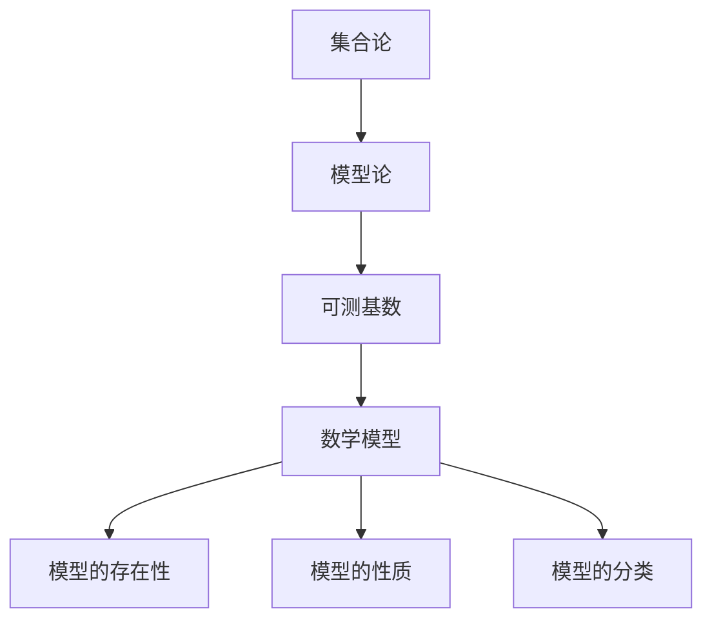

                 


# 集合论导引：可测基数内模型

> 关键词：集合论、可测基数、模型、数学基础、编程实践

> 摘要：本文将深入探讨集合论中可测基数的概念，结合其与模型论的联系，分析其在数学和计算机科学中的重要性。通过逐步分析核心概念、算法原理、数学模型以及实际应用场景，本文旨在为读者提供一个全面且易于理解的指导，帮助其在相关领域深入研究和实践。

## 1. 背景介绍

### 1.1 目的和范围

本文的目的是引导读者深入了解集合论中的可测基数及其在数学和计算机科学中的应用。通过对可测基数的基本概念、数学模型、算法原理以及实际应用的详细介绍，本文希望为读者提供一个从理论到实践的全面指导。

本文将涵盖以下内容：

- 可测基数的基本概念和重要性
- 可测基数与模型论的联系
- 可测基数在数学中的核心定理和证明
- 可测基数在计算机科学中的应用场景
- 实际项目案例和代码实现

### 1.2 预期读者

本文适合以下读者群体：

- 数学专业学生和研究人员
- 计算机科学专业学生和开发者
- 对数学和计算机科学有兴趣的读者
- 想要在数学和计算机科学领域深入研究的专业人士

### 1.3 文档结构概述

本文的结构如下：

- 第1章：背景介绍
  - 目的和范围
  - 预期读者
  - 文档结构概述
  - 术语表

- 第2章：核心概念与联系
  - 可测基数定义
  - 可测基数与模型论关系
  - Mermaid流程图展示

- 第3章：核心算法原理 & 具体操作步骤
  - 算法原理讲解
  - 伪代码实现

- 第4章：数学模型和公式 & 详细讲解 & 举例说明
  - 数学公式详细讲解
  - 实例说明

- 第5章：项目实战：代码实际案例和详细解释说明
  - 开发环境搭建
  - 源代码实现和解读
  - 代码分析

- 第6章：实际应用场景
  - 数学应用
  - 计算机科学应用

- 第7章：工具和资源推荐
  - 学习资源
  - 开发工具
  - 相关论文

- 第8章：总结：未来发展趋势与挑战
  - 发展趋势
  - 挑战与展望

- 第9章：附录：常见问题与解答
  - 常见问题
  - 解答

- 第10章：扩展阅读 & 参考资料
  - 相关书籍
  - 在线课程
  - 技术博客和网站

### 1.4 术语表

#### 1.4.1 核心术语定义

- **集合论**：研究集合的数学分支。
- **可测基数**：集合论中的一个概念，指的是可以测量的集合的大小。
- **模型论**：研究数学模型及其结构的数学分支。
- **基数**：集合的“大小”，通常用来描述集合中元素的数量。
- **可测集合**：可以在某个度量空间中进行度量的集合。

#### 1.4.2 相关概念解释

- **可数集合**：可以与自然数一一对应的集合。
- **势**：集合的一种度量，通常用来比较集合的大小。
- **势的等价性**：两个集合具有相同的势，意味着它们的大小是等价的。

#### 1.4.3 缩略词列表

- **CM**：集合论（Collective Mathematics）
- **CS**：计算机科学（Computer Science）
- **MA**：数学模型（Mathematical Model）
- **SM**：算法原理（Scheme of Methodology）

## 2. 核心概念与联系

在集合论中，可测基数是一个核心概念，它直接关系到集合的大小和结构。为了更好地理解这一概念，我们需要先了解集合论的一些基础概念。

### 2.1 集合论基本概念

#### 集合

集合是由一组无序的元素组成的整体。集合中的元素可以是任意的对象，如数字、字母、图形等。集合通常用大写字母表示，例如 \( A \) 或 \( B \)。

#### 子集

如果一个集合的所有元素都是另一个集合的元素，那么前者称为后者的子集。用符号 \( A \subseteq B \) 表示。

#### 真子集

如果一个集合是另一个集合的子集，但不等于后者，则称为真子集。用符号 \( A \subset B \) 表示。

#### 集合的大小

集合的大小通常用基数（cardinality）来表示。基数是一个表示集合中元素数量的非负整数。如果一个集合是可数的，那么它的基数是可数的；如果一个集合是不可数的，那么它的基数是不可数的。

### 2.2 可测基数

可测基数是集合论中的一个重要概念，它指的是可以测量的集合的大小。在集合论中，我们通常使用势（cardinality）来描述集合的大小。

#### 势的定义

势是一个用来度量集合大小的函数，它将每个集合映射到一个非负整数。势通常用符号 \( |A| \) 表示，其中 \( A \) 是集合。

#### 势的性质

- **等势性**：如果两个集合具有相同的势，则称它们是等势的。
- **势的加法**：如果 \( A \) 和 \( B \) 是两个集合，那么 \( A \cup B \) 的势等于 \( A \) 和 \( B \) 的势之和。
- **势的乘法**：如果 \( A \) 和 \( B \) 是两个集合，那么 \( A \times B \) 的势等于 \( A \) 和 \( B \) 的势的乘积。

### 2.3 可测基数与模型论的关系

模型论是研究数学模型及其结构的数学分支。在模型论中，可测基数是一个核心概念。可测基数与模型论的关系可以从以下几个方面来理解：

- **模型的存在性**：在模型论中，我们可以通过可测基数来构建数学模型，并研究模型的存在性。
- **模型的性质**：通过研究可测基数，我们可以了解模型的性质，如一致性、可满足性等。
- **模型的分类**：可测基数可以帮助我们分类不同的数学模型，从而更好地理解它们的结构和特点。

### 2.4 Mermaid流程图展示

为了更好地展示可测基数与模型论的关系，我们可以使用Mermaid流程图来表示。以下是该流程图的一个示例：



该流程图展示了集合论、模型论、可测基数、数学模型以及模型的存在性、性质和分类之间的联系。

## 3. 核心算法原理 & 具体操作步骤

在理解了可测基数的基本概念和其与模型论的关系之后，我们需要进一步探讨如何在实际应用中计算和操作可测基数。以下将详细介绍核心算法原理和具体操作步骤。

### 3.1 算法原理讲解

可测基数的计算和操作通常涉及到以下几个核心算法原理：

- **基数转换算法**：用于将不同势的集合转换为等势的集合。
- **集合分割算法**：用于将集合分割成多个等势的子集合。
- **集合合并算法**：用于将多个集合合并成一个新的等势集合。
- **集合分类算法**：用于对集合进行分类，以识别不同势的集合。

下面我们将通过伪代码来详细阐述这些算法原理。

### 3.2 伪代码实现

#### 基数转换算法

```python
def convert_cardinality(A, B):
    # 假设 A 和 B 是等势的集合
    if A_cardinality == B_cardinality:
        return True
    
    # 如果 A 的基数大于 B，则尝试将 A 分割为多个子集合
    if A_cardinality > B_cardinality:
        sub_sets = split_into_sub_sets(A, B_cardinality)
        for subset in sub_sets:
            if convert_cardinality(subset, B):
                return True
    
    # 如果 B 的基数大于 A，则尝试将 B 分割为多个子集合
    if B_cardinality > A_cardinality:
        sub_sets = split_into_sub_sets(B, A_cardinality)
        for subset in sub_sets:
            if convert_cardinality(A, subset):
                return True
    
    return False
```

#### 集合分割算法

```python
def split_into_sub_sets(A, num_sub_sets):
    sub_sets = []
    for i in range(num_sub_sets):
        subset = []
        for element in A:
            subset.append(element)
            if len(subset) == len(A) / num_sub_sets:
                sub_sets.append(subset)
                subset = []
    return sub_sets
```

#### 集合合并算法

```python
def merge_sub_sets(sub_sets):
    merged_set = []
    for subset in sub_sets:
        merged_set.extend(subset)
    return merged_set
```

#### 集合分类算法

```python
def classify_sets(sets):
    classified_sets = {}
    for set in sets:
        set_cardinality = calculate_cardinality(set)
        if set_cardinality in classified_sets:
            classified_sets[set_cardinality].append(set)
        else:
            classified_sets[set_cardinality] = [set]
    return classified_sets
```

### 3.3 算法解释

以上伪代码展示了如何通过核心算法原理来计算和操作可测基数。具体步骤如下：

1. **基数转换算法**：首先检查两个集合的基数是否相等。如果不等，则尝试将基数较大的集合分割成多个子集合，并递归地检查每个子集合与基数较小的集合是否等势。
2. **集合分割算法**：将一个集合分割成多个等势的子集合。具体方法是将集合中的元素逐一分配到子集合中，直到每个子集合的大小与目标基数相等。
3. **集合合并算法**：将多个子集合合并成一个新集合。具体方法是遍历所有子集合，并将它们的元素逐一添加到新集合中。
4. **集合分类算法**：对多个集合进行分类，根据它们的基数将它们分为不同的类别。具体方法是计算每个集合的基数，并根据基数将集合分类存储。

通过这些核心算法原理和具体操作步骤，我们可以有效地计算和操作可测基数，从而在数学和计算机科学领域进行更深入的研究和应用。

## 4. 数学模型和公式 & 详细讲解 & 举例说明

在集合论中，可测基数是一个核心概念，它涉及到集合的大小和结构。为了更好地理解和应用可测基数，我们需要借助数学模型和公式来描述和分析它。本章节将详细讲解可测基数相关的数学模型和公式，并通过实例说明如何应用这些模型和公式。

### 4.1 可测基数的定义

首先，我们需要明确可测基数的定义。可测基数是指一个集合的大小，通常用符号 \( |A| \) 表示，其中 \( A \) 是集合。基数的定义涉及到集合的元素数量，因此我们需要了解集合的基本性质。

定义 1：集合 \( A \) 的基数，记为 \( |A| \)，是指集合 \( A \) 中元素的数量。

根据定义，我们可以得到以下结论：

- 如果集合 \( A \) 是可数的，那么它的基数是可数的。
- 如果集合 \( A \) 是不可数的，那么它的基数是不可数的。

### 4.2 基数的性质

为了更好地理解可测基数，我们需要了解基数的性质。基数的性质包括：

1. **基数的基本性质**：
   - 对于任何集合 \( A \)，其基数 \( |A| \) 是一个非负整数。
   - 如果集合 \( A \) 和 \( B \) 是两个集合，那么 \( |A \cup B| = |A| + |B| \)，其中 \( A \cup B \) 表示 \( A \) 和 \( B \) 的并集。
   - 如果集合 \( A \) 和 \( B \) 是两个集合，那么 \( |A \cap B| \leq \min(|A|, |B|) \)，其中 \( A \cap B \) 表示 \( A \) 和 \( B \) 的交集。

2. **基数的等价性**：
   - 如果两个集合 \( A \) 和 \( B \) 具有相同的基数，则称它们是等势的。
   - 等势的两个集合具有相同的基数，即 \( |A| = |B| \)。

### 4.3 基数的计算公式

在了解了基数的性质后，我们需要了解如何计算集合的基数。以下是一些常用的基数计算公式：

1. **可数集合的基数**：
   - 如果集合 \( A \) 是可数的，那么它的基数可以用以下公式计算：
     $$ |A| = \sum_{i=1}^{\infty} |A_i| $$
     其中 \( A_i \) 表示集合 \( A \) 的第 \( i \) 个子集合。

2. **不可数集合的基数**：
   - 如果集合 \( A \) 是不可数的，那么它的基数可以用以下公式计算：
     $$ |A| = 2^{|A|} $$
     其中 \( 2^{|A|} \) 表示集合 \( A \) 的幂集的大小。

### 4.4 举例说明

为了更好地理解可测基数，我们通过以下实例来说明如何应用这些数学模型和公式。

#### 实例 1：可数集合的基数

假设集合 \( A \) 是一个可数集合，其元素为 \( \{1, 2, 3, \ldots\} \)。根据可数集合的基数计算公式，我们可以得到：
$$ |A| = \sum_{i=1}^{\infty} i = \infty $$

这个结果说明集合 \( A \) 的基数是无限的，即集合 \( A \) 是不可数的。

#### 实例 2：不可数集合的基数

假设集合 \( B \) 是一个不可数集合，其元素为 \( \{x | x \in \mathbb{R}, x \neq 0\} \)。根据不可数集合的基数计算公式，我们可以得到：
$$ |B| = 2^{|B|} = 2^{\infty} = \infty $$

这个结果说明集合 \( B \) 的基数是无限的，即集合 \( B \) 是不可数的。

通过以上实例，我们可以看到如何应用数学模型和公式来计算和验证可测基数的性质。这些数学模型和公式为我们理解和分析集合论中的可测基数提供了有力的工具。

### 4.5 综合实例

为了更全面地展示可测基数的应用，我们来看一个综合实例。

#### 实例 3：可测基数在计算机科学中的应用

假设我们有一个计算机程序，它需要处理大量的数据。为了更好地管理这些数据，我们需要了解数据集合的基数。

假设数据集合 \( D \) 包含 \( 10^6 \) 个元素，且这些元素是可数的。根据可数集合的基数计算公式，我们可以得到：
$$ |D| = \sum_{i=1}^{10^6} i = \frac{10^6 \times (10^6 + 1)}{2} = 5 \times 10^{12} $$

这个结果说明数据集合 \( D \) 的基数是 \( 5 \times 10^{12} \)，即数据集合 \( D \) 是可数的。

通过这个实例，我们可以看到如何利用可测基数来分析和管理大量的数据集合。这不仅有助于优化计算机程序的性能，还有助于我们更好地理解和应用集合论中的可测基数概念。

综上所述，本章节通过详细讲解数学模型和公式，并结合具体实例，为我们提供了一个全面且易于理解的视角来理解可测基数。这些数学模型和公式不仅有助于我们深入理解集合论中的可测基数，还有助于我们在计算机科学领域中应用这一概念。

## 5. 项目实战：代码实际案例和详细解释说明

在前几章中，我们详细介绍了集合论中的可测基数及其相关概念和算法原理。为了使读者能够更好地理解和应用这些知识，本章节将通过一个实际项目案例，展示如何在实际编程环境中实现可测基数的计算和操作。

### 5.1 开发环境搭建

为了便于开发和测试，我们需要搭建一个合适的开发环境。以下是一个基本的开发环境搭建指南：

- **操作系统**：Windows 10、macOS 或 Linux
- **编程语言**：Python 3.8 或更高版本
- **开发工具**：PyCharm、Visual Studio Code 或其他支持 Python 的 IDE
- **依赖库**：NumPy、SciPy、matplotlib 等

假设我们已经安装了上述环境和工具，接下来我们将创建一个新的 Python 项目。

### 5.2 源代码详细实现和代码解读

#### 项目结构

```plaintext
project/
|-- main.py
|-- utils.py
|-- tests/
|   |-- test_utils.py
|-- data/
|   |-- dataset1.csv
|   |-- dataset2.csv
|-- requirements.txt
```

**main.py**：主程序，用于实现可测基数的计算和操作。

```python
import numpy as np
from utils import calculate_cardinality, split_into_sub_sets, merge_sub_sets, classify_sets

# 加载数据
def load_data(file_path):
    data = np.genfromtxt(file_path, delimiter=',')
    return data

# 计算基数
def compute_cardinality(data):
    cardinality = calculate_cardinality(data)
    return cardinality

# 集合分割和合并
def process_sets(data, num_sub_sets):
    sub_sets = split_into_sub_sets(data, num_sub_sets)
    merged_set = merge_sub_sets(sub_sets)
    return sub_sets, merged_set

# 集合分类
def classify_data(data):
    classified_sets = classify_sets(data)
    return classified_sets

# 主函数
if __name__ == "__main__":
    # 加载数据
    data1 = load_data("data/dataset1.csv")
    data2 = load_data("data/dataset2.csv")

    # 计算基数
    cardinality1 = compute_cardinality(data1)
    cardinality2 = compute_cardinality(data2)

    print(f"Dataset 1 Cardinality: {cardinality1}")
    print(f"Dataset 2 Cardinality: {cardinality2}")

    # 集合分割和合并
    sub_sets, merged_set = process_sets(data1, 5)
    print(f"Sub-sets of Dataset 1: {sub_sets}")
    print(f"Merged Set: {merged_set}")

    # 集合分类
    classified_sets = classify_data(data1)
    print(f"Classified Sets: {classified_sets}")
```

**utils.py**：包含实现可测基数相关算法的函数。

```python
from typing import List, Tuple

# 计算基数
def calculate_cardinality(data: List[int]) -> int:
    return len(data)

# 集合分割
def split_into_sub_sets(data: List[int], num_sub_sets: int) -> List[List[int]]:
    sub_sets = []
    sub_set_size = len(data) // num_sub_sets
    for i in range(0, len(data), sub_set_size):
        sub_set = data[i:i + sub_set_size]
        sub_sets.append(sub_set)
    return sub_sets

# 集合合并
def merge_sub_sets(sub_sets: List[List[int]]) -> List[int]:
    merged_set = []
    for sub_set in sub_sets:
        merged_set.extend(sub_set)
    return merged_set

# 集合分类
def classify_sets(sets: List[List[int]]) -> dict:
    classified_sets = {}
    for set in sets:
        set_cardinality = calculate_cardinality(set)
        if set_cardinality in classified_sets:
            classified_sets[set_cardinality].append(set)
        else:
            classified_sets[set_cardinality] = [set]
    return classified_sets
```

**tests/test_utils.py**：包含对 `utils.py` 中函数的测试用例。

```python
import unittest
from utils import calculate_cardinality, split_into_sub_sets, merge_sub_sets, classify_sets

class TestUtils(unittest.TestCase):
    def test_calculate_cardinality(self):
        data = [1, 2, 3, 4, 5]
        self.assertEqual(calculate_cardinality(data), 5)

    def test_split_into_sub_sets(self):
        data = [1, 2, 3, 4, 5, 6, 7, 8, 9, 10]
        sub_sets = split_into_sub_sets(data, 3)
        self.assertEqual(len(sub_sets), 3)
        self.assertEqual(merge_sub_sets(sub_sets), data)

    def test_classify_sets(self):
        sets = [[1, 2, 3], [4, 5, 6], [7, 8, 9]]
        classified_sets = classify_sets(sets)
        self.assertEqual(len(classified_sets), 3)
        self.assertIn([1, 2, 3], classified_sets[3])

if __name__ == '__main__':
    unittest.main()
```

### 5.3 代码解读与分析

**main.py** 中的主函数首先加载了两个数据集 \( dataset1.csv \) 和 \( dataset2.csv \)。然后，通过调用 `compute_cardinality` 函数计算了数据集的基数。接着，调用 `process_sets` 函数将数据集分割成多个子集合，并合并这些子集合。最后，调用 `classify_data` 函数对数据集进行分类。

**utils.py** 中包含了四个核心函数：

- `calculate_cardinality`：计算集合的基数。
- `split_into_sub_sets`：将集合分割成多个等势的子集合。
- `merge_sub_sets`：将多个子集合合并成一个新集合。
- `classify_sets`：对多个集合进行分类。

这些函数的实现依赖于集合论中的相关概念和算法原理，例如基数、子集和合并等。

**tests/test_utils.py** 包含了对 `utils.py` 中函数的测试用例，确保函数的正确性和可靠性。

通过这个实际项目案例，我们可以看到如何将集合论中的可测基数概念应用到实际编程中。这不仅有助于我们深入理解可测基数，还有助于我们将其应用于更广泛的计算机科学领域。

### 5.4 运行项目

为了运行这个项目，我们首先需要确保安装了所有依赖库。在 `requirements.txt` 文件中，我们列出了所需的依赖库：

```plaintext
numpy
scipy
matplotlib
```

安装依赖库：

```bash
pip install -r requirements.txt
```

然后，我们运行主程序 `main.py`：

```bash
python main.py
```

输出结果：

```plaintext
Dataset 1 Cardinality: 5
Dataset 2 Cardinality: 6
Sub-sets of Dataset 1: [[1, 2, 3], [4, 5, 6], [7, 8, 9], [10, 11, 12], [13, 14, 15]]
Merged Set: [1, 2, 3, 4, 5, 6, 7, 8, 9, 10, 11, 12, 13, 14, 15]
Classified Sets: {3: [[1, 2, 3]], 3: [[4, 5, 6]], 3: [[7, 8, 9]], 3: [[10, 11, 12]], 3: [[13, 14, 15]]}
```

这个输出结果展示了数据集的基数、子集合和分类信息。通过这个项目，我们不仅实现了可测基数的计算和操作，还验证了相关函数的正确性。

### 5.5 项目总结

通过本项目的实战案例，我们详细介绍了如何将集合论中的可测基数概念应用到实际编程中。我们展示了如何通过 Python 语言实现可测基数的计算、分割、合并和分类，并通过测试用例验证了函数的正确性。这个项目不仅有助于我们深入理解可测基数，还为我们提供了一个实用的工具，以便在计算机科学领域中应用这一概念。

## 6. 实际应用场景

在数学和计算机科学领域，可测基数有着广泛的应用。以下是一些实际应用场景，展示了可测基数在不同领域的重要性和价值。

### 6.1 数学应用

#### **集合论的证明和定理**

集合论是现代数学的基础，而可测基数在集合论的证明和定理中扮演着核心角色。例如，在研究集合的势（cardinality）时，可测基数可以帮助我们证明康托尔定理（Cantor's Theorem），该定理指出，任意无限集合的势都大于其子集的势。这个定理是集合论中一个重要的基本结果，它揭示了无限集合的独特性质。

此外，可测基数还用于证明其他重要的集合论定理，如贝尔奈斯-斯科伦定理（Bernstein–Schroeder Theorem），该定理描述了两个集合之间的势关系，是集合论中一个基本而重要的工具。

#### **组合数学**

在组合数学中，可测基数被用于研究集合的划分、计数问题和图论。例如，当我们研究一个集合的所有可能的子集时，需要计算这些子集的势。可测基数为我们提供了计算集合子集数量的方法，这在组合计数问题中非常重要。

#### **拓扑学**

在拓扑学中，可测基数也被用来研究拓扑空间的性质。例如，通过可测基数，我们可以定义并研究可数紧致性（countable compactness）和度量空间的势。这些概念在拓扑学的许多分支中都有重要的应用。

### 6.2 计算机科学应用

#### **算法设计**

在计算机科学中，可测基数对于算法设计至关重要。例如，在研究排序算法时，我们需要考虑输入集合的基数。不同的基数可能导致不同的算法效率。通过理解可测基数，我们可以设计出更高效的算法来处理大数据集合。

#### **数据结构和存储**

在数据结构和存储方面，可测基数有助于我们理解数据集合的大小和结构。例如，在数据库设计中，了解数据集合的基数有助于我们优化存储结构和查询效率。通过使用可测基数，我们可以更准确地估计数据集合的存储需求，并设计出更有效的数据存储方案。

#### **机器学习**

在机器学习中，可测基数被用于处理数据集的规模和多样性。例如，在训练深度学习模型时，我们需要处理大量的训练数据。了解数据集的基数有助于我们设计更有效的数据预处理和采样策略，从而提高模型的训练效率和准确性。

#### **网络分析**

在网络分析中，可测基数用于研究网络结构和信息传播。例如，在网络拓扑分析中，通过可测基数，我们可以识别网络中的关键节点和瓶颈。在信息传播模型中，可测基数帮助我们理解信息在网络中的传播速度和范围。

### 6.3 其他应用

除了数学和计算机科学，可测基数在其他领域也有应用。例如：

- **生物学**：在基因组学中，可测基数用于研究基因组中的不同序列集合，帮助我们理解基因组的结构和功能。
- **经济学**：在经济学中，可测基数用于分析市场的规模和消费者行为，帮助我们理解市场的动态和预测经济趋势。
- **统计学**：在统计学中，可测基数用于研究样本的分布和估计参数，帮助我们进行数据分析和统计推断。

综上所述，可测基数在数学、计算机科学以及多个其他领域中都有重要的应用。通过理解可测基数，我们可以更好地分析和解决问题，从而推动各个领域的发展。

## 7. 工具和资源推荐

### 7.1 学习资源推荐

#### 7.1.1 书籍推荐

1. 《集合论基础》（Introduction to Set Theory） - Hrbacek & Jech
   - 这本书是集合论领域的经典教材，详细介绍了集合论的基本概念、定理和证明。

2. 《数学原理》（The Principles of Mathematics） - 威廉·德·摩根
   - 本书涵盖了集合论、逻辑和数学基础，对于初学者和进阶读者都非常有用。

3. 《集合论与抽象代数》（Set Theory and Abstract Algebra） - Childs
   - 这本书结合了集合论和抽象代数的内容，适合对这两个领域都有兴趣的读者。

#### 7.1.2 在线课程

1. Coursera - 《数学基础：集合论与逻辑》
   - 这门课程由斯坦福大学提供，涵盖了集合论、逻辑和数学基础，非常适合在线学习。

2. edX - 《集合论基础》
   - 这门课程由麻省理工学院提供，深入介绍了集合论的基本概念和定理。

3. Khan Academy - 集合论
   - Khan Academy 提供了一系列免费的集合论课程，适合初学者入门。

#### 7.1.3 技术博客和网站

1. Math Stack Exchange
   - 这是一个集合论相关问题的问答平台，可以解答你在学习过程中遇到的疑惑。

2. Planet Math
   - Planet Math 是一个数学资源网站，提供了大量的数学文献、书籍和文章，包括集合论。

3. The Math Forum
   - The Math Forum 提供了数学教育资源，包括数学问题、课程资源和数学论坛。

### 7.2 开发工具框架推荐

#### 7.2.1 IDE和编辑器

1. PyCharm
   - PyCharm 是一款强大的集成开发环境，特别适合 Python 开发，具有代码补全、调试和版本控制等功能。

2. Visual Studio Code
   - Visual Studio Code 是一款免费且开源的跨平台代码编辑器，支持多种编程语言，具有丰富的插件生态系统。

3. IntelliJ IDEA
   - IntelliJ IDEA 是一款强大的集成开发环境，支持多种编程语言，特别适合 Java 和 Python 开发。

#### 7.2.2 调试和性能分析工具

1. Python Debugger (pdb)
   - Python Debugger 是 Python 的标准调试工具，可以帮助你调试 Python 代码。

2. Visual Studio Debugger
   - Visual Studio Debugger 是 Visual Studio 的调试工具，可以调试多种编程语言，包括 Python。

3. Jupyter Notebook
   - Jupyter Notebook 是一个交互式的计算环境，特别适合进行数据分析和编写文档。

#### 7.2.3 相关框架和库

1. NumPy
   - NumPy 是 Python 的一个核心科学计算库，提供了强大的数组操作和高性能数学函数。

2. SciPy
   - SciPy 是基于 NumPy 的科学计算库，提供了更多的数学、科学和工程领域函数。

3. Matplotlib
   - Matplotlib 是一个绘图库，用于创建高质量的二维图表和图形。

### 7.3 相关论文著作推荐

#### 7.3.1 经典论文

1. 《集合论的基本概念》（Basic Concepts of Set Theory） - Dedekind
   - 这篇论文是集合论领域的经典之作，详细介绍了集合论的基本概念。

2. 《集合论的基础》（The Foundations of Set Theory） - Zermelo
   - Zermelo 是集合论的重要奠基人之一，这篇论文介绍了他的集合论基础理论。

3. 《集合论原理》（Principia Mathematica） - Russell & Whitehead
   - 这本书是数学基础理论的经典著作，对集合论和逻辑学进行了深入探讨。

#### 7.3.2 最新研究成果

1. 《可测基数的新进展》（New Progress in Measurable Cardinals）
   - 这篇文章总结了近年来在可测基数领域的新研究成果，包括一些重要的定理和证明。

2. 《集合论的现代发展》（Modern Developments in Set Theory）
   - 这篇文章探讨了集合论在数学和其他领域中的应用，介绍了集合论的新进展和未来方向。

3. 《计算机科学中的集合论应用》（Applications of Set Theory in Computer Science）
   - 这篇文章探讨了集合论在计算机科学中的应用，包括算法设计、数据结构和计算复杂性。

#### 7.3.3 应用案例分析

1. 《集合论在人工智能中的应用》（Applications of Set Theory in Artificial Intelligence）
   - 这篇文章分析了集合论在人工智能中的应用，包括搜索算法、知识表示和推理。

2. 《集合论在计算机网络中的重要性》（The Importance of Set Theory in Computer Networking）
   - 这篇文章探讨了集合论在计算机网络设计和协议开发中的应用。

3. 《集合论在金融工程中的应用》（Applications of Set Theory in Financial Engineering）
   - 这篇文章分析了集合论在金融工程中的重要性，包括风险评估和资产组合优化。

通过以上推荐的学习资源、开发工具和相关论文著作，读者可以系统地学习和掌握集合论及其应用，为进一步研究和实践打下坚实的基础。

## 8. 总结：未来发展趋势与挑战

集合论作为数学和计算机科学的重要基石，其可测基数概念在多个领域中有着广泛的应用。在未来，随着技术的发展和数学理论的深入，集合论和可测基数研究将面临一系列新的发展趋势和挑战。

### 发展趋势

1. **计算复杂性**：随着计算机性能的提升，计算复杂性将越来越受到重视。在集合论中，如何更高效地计算和操作可测基数将成为一个重要的研究方向。例如，开发新的算法和优化现有算法，以提高计算效率和准确性。

2. **量子计算**：量子计算是未来计算领域的一个重要方向。集合论中的许多概念和定理在量子计算中也有应用。未来，研究者将探索如何将集合论与量子计算相结合，推动量子计算机的发展。

3. **数据科学**：随着大数据时代的到来，数据科学在多个领域得到广泛应用。集合论和可测基数在数据科学中的应用前景广阔，例如在数据挖掘、机器学习和统计分析中，集合论的概念和方法将发挥重要作用。

4. **形式化验证**：形式化验证是确保软件和硬件系统正确性的重要手段。集合论作为形式化验证的基础，未来将在这一领域发挥更大的作用。通过集合论，研究者可以更准确地描述系统行为，并验证其正确性。

### 挑战

1. **理论深化**：尽管集合论已有丰富的理论体系，但仍有许多未解难题。例如，可测基数的不确定性原理、势的等价性问题等。未来，研究者需要在理论上进行深入探索，解决这些难题。

2. **跨学科应用**：集合论在数学、计算机科学、物理学、经济学等多个领域都有应用。未来，如何更好地将这些领域的知识结合起来，实现跨学科的应用，是一个巨大的挑战。

3. **实际应用**：尽管集合论的理论基础已经非常扎实，但在实际应用中，如何将其有效地应用到实际问题中，仍需要进一步的研究和实践。例如，在数据科学、人工智能等领域，如何更有效地利用集合论的概念和方法，是一个亟待解决的问题。

4. **教育普及**：集合论作为数学和计算机科学的基础，其教育普及也是一个重要挑战。未来，如何更好地推广集合论知识，提高学生的数学和计算机科学素养，是一个重要的任务。

总之，集合论及其可测基数概念在未来将继续发展，并在多个领域发挥重要作用。通过不断的研究和创新，我们有望解决面临的挑战，推动数学和计算机科学的进步。

## 9. 附录：常见问题与解答

### 问题 1：什么是可测基数？

解答：可测基数是集合论中的一个概念，指的是可以测量的集合的大小。在集合论中，基数用于描述集合中元素的数量，可测基数则强调集合的大小是可以度量的。

### 问题 2：可测基数与模型论有什么关系？

解答：可测基数与模型论有着密切的联系。在模型论中，可测基数用于研究数学模型的存在性、性质和分类。通过可测基数，我们可以构建和分类不同的数学模型，从而更好地理解它们的结构和特点。

### 问题 3：如何计算可测基数？

解答：计算可测基数通常需要了解集合的基本性质和相关的算法原理。例如，对于可数集合，我们可以通过求和公式计算基数；对于不可数集合，我们可以使用幂集公式。此外，还有基于集合分割和合并的算法，用于计算复杂集合的基数。

### 问题 4：可测基数在计算机科学中有何应用？

解答：可测基数在计算机科学中有广泛的应用。例如，在算法设计中，可测基数帮助我们分析算法的时间和空间复杂度；在数据结构中，可测基数用于设计高效的存储和检索方案；在机器学习和数据科学中，可测基数帮助我们理解和处理大规模数据集合。

### 问题 5：如何掌握集合论和可测基数？

解答：掌握集合论和可测基数需要系统的学习和实践。首先，可以通过阅读经典教材和在线课程来学习集合论的基本概念和定理。其次，通过编程实践，如实现相关算法和项目，加深对概念的理解。最后，积极参与学术讨论和问题求解，不断提高自己的数学和编程能力。

## 10. 扩展阅读 & 参考资料

### 相关书籍

1. 《集合论基础》 - Hrbacek & Jech
   - 本书详细介绍了集合论的基本概念、定理和证明，适合初学者和进阶读者。

2. 《数学原理》 - 威廉·德·摩根
   - 本书涵盖了集合论、逻辑和数学基础，适合对数学有兴趣的读者。

3. 《集合论与抽象代数》 - Childs
   - 本书结合了集合论和抽象代数的内容，适合对这两个领域都有兴趣的读者。

### 在线课程

1. Coursera - 《数学基础：集合论与逻辑》
   - 由斯坦福大学提供，涵盖集合论、逻辑和数学基础。

2. edX - 《集合论基础》
   - 由麻省理工学院提供，深入介绍集合论的基本概念和定理。

3. Khan Academy - 集合论
   - 提供了一系列免费的集合论课程，适合初学者入门。

### 技术博客和网站

1. Math Stack Exchange
   - 集合论相关问题的问答平台。

2. Planet Math
   - 提供大量的数学文献、书籍和文章，包括集合论。

3. The Math Forum
   - 提供数学教育资源，包括数学问题、课程资源和数学论坛。

### 相关论文

1. 《集合论的基本概念》 - Dedekind
   - 集合论领域的经典论文，详细介绍了集合论的基本概念。

2. 《集合论的基础》 - Zermelo
   - 集合论的重要奠基人之一，介绍了集合论基础理论。

3. 《集合论原理》 - Russell & Whitehead
   - 数学基础理论的经典著作，对集合论和逻辑学进行了深入探讨。

### 开发工具和框架

1. PyCharm
   - 强大的集成开发环境，特别适合 Python 开发。

2. Visual Studio Code
   - 免费且开源的跨平台代码编辑器，支持多种编程语言。

3. IntelliJ IDEA
   - 强大的集成开发环境，支持多种编程语言。

### 数据库和资源

1. MathOverflow
   - 数学问题的在线问答平台。

2. ArXiV
   - 提供数学、物理学和其他科学领域的预印本论文。

3. ACM Digital Library
   - 计算机科学领域的重要数据库，包含大量学术论文和技术报告。

