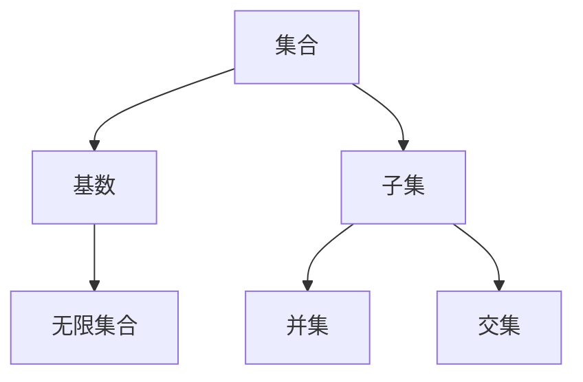

                 

# 集合论导引：小势划分定理

> 关键词：集合论、小势划分定理、集合划分、无限集合、基数、对偶定理

> 摘要：本文将深入探讨集合论中的小势划分定理，通过逻辑清晰的分析和具体的数学模型，对定理的背景、概念、原理及其应用进行详细阐述。文章旨在为读者提供一个全面理解小势划分定理的途径，并展示其在集合论和数学理论中的重要性。

## 1. 背景介绍

### 1.1 目的和范围

本文的目标是详细探讨小势划分定理，这是一个在集合论中极为重要的概念。小势划分定理主要研究无限集合的划分问题，其核心思想是将一个无限集合划分为两个或多个具有特定性质的小集合。这种划分对于理解集合的基数、研究集合论中的其他定理具有重要意义。

本文将覆盖以下内容：

1. 集合论的基本概念和术语。
2. 小势划分定理的背景和数学模型。
3. 小势划分定理的证明。
4. 小势划分定理的应用场景。
5. 实际项目中的代码实现。

### 1.2 预期读者

本文适用于对集合论有一定了解的读者，包括数学专业学生、研究生、以及对集合论感兴趣的计算机科学工作者。本文旨在为读者提供一个深入理解小势划分定理的机会，无论你是想要深化学术研究，还是希望将这一理论应用于实际问题，都能从中受益。

### 1.3 文档结构概述

本文将分为十个主要部分：

1. 背景介绍：本文的目的、范围、预期读者以及文档结构。
2. 核心概念与联系：介绍与集合论相关的基本概念。
3. 核心算法原理：详细解释小势划分定理的算法原理。
4. 数学模型和公式：介绍小势划分定理的数学模型和公式。
5. 项目实战：通过代码示例展示定理的应用。
6. 实际应用场景：讨论定理在不同领域的应用。
7. 工具和资源推荐：推荐相关学习和开发资源。
8. 总结：总结未来发展趋势与挑战。
9. 附录：常见问题与解答。
10. 扩展阅读：推荐进一步阅读的资料。

### 1.4 术语表

#### 1.4.1 核心术语定义

- **集合**：由确定对象组成的整体。
- **基数**：集合的元素数量，分为有限基数和无限基数。
- **无限集合**：元素数量无穷大的集合。
- **小势划分定理**：一个无限集合可以被划分为若干个具有特定性质的小集合。
- **划分**：将一个集合分割成若干子集合的过程。

#### 1.4.2 相关概念解释

- **势**：集合中元素的数量，通常表示为集合的基数。
- **子集**：一个集合的部分元素组成的集合。
- **并集**：两个或多个集合合并成的集合。
- **交集**：两个或多个集合共有的元素组成的集合。

#### 1.4.3 缩略词列表

- **POS**：小势划分定理（Partition of Infinite Set Theorem）
- **SAT**：小势划分定理（Small Set Theorem）

## 2. 核心概念与联系

在深入探讨小势划分定理之前，我们需要理解一些核心概念和它们之间的关系。以下将使用Mermaid流程图来展示这些概念。

### Mermaid流程图



### 概念解释

1. **集合（Set）**：集合是由确定对象组成的整体，可以用大括号{}表示，如`{1, 2, 3}`。
2. **基数（Cardinality）**：集合的基数是指集合中元素的数量，通常用符号`|A|`表示。有限集合的基数是自然数，无限集合的基数可以是无限大。
3. **无限集合（Infinite Set）**：无限集合是指其基数无穷大的集合，例如整数集合`Z`、实数集合`R`。
4. **子集（Subset）**：如果一个集合的所有元素都是另一个集合的元素，那么前者被称为后者的子集，通常用`A ⊆ B`表示。
5. **并集（Union）**：两个或多个集合合并成的集合称为并集，通常用`A ∪ B`表示。
6. **交集（Intersection）**：两个或多个集合共有的元素组成的集合称为交集，通常用`A ∩ B`表示。

### 关系分析

- 集合与基数的关系：基数是集合中元素的数量，每个集合都有一个基数。
- 集合与子集的关系：每个集合都可以有多个子集，而每个子集都是原集合的一部分。
- 集合与并集、交集的关系：并集和交集是集合运算的结果，通过集合运算可以得到新的集合。

通过这些核心概念的理解，我们为后续探讨小势划分定理奠定了基础。

## 3. 核心算法原理 & 具体操作步骤

小势划分定理的核心在于如何将一个无限集合划分成若干个小集合。下面，我们将通过伪代码详细阐述这一过程。

### 伪代码

```python
function PartitionInfiniteSet(A):
    # 假设A是一个无限集合
    # 初始化小集合列表
    partitions = []
    # 初始化当前子集
    subset = {}
    # 初始化子集的基数
    subset_cardinality = 0
    # 初始化划分过程
    while A 不为空:
        # 选择A中的一个元素
        element = A.pop()
        # 如果加入元素后子集的基数不超过预定值，则加入元素
        if subset_cardinality + 1 <= predefined_small_set_size:
            subset[element] = True
            subset_cardinality += 1
        else:
            # 如果子集的基数超过预定值，则将当前子集加入划分列表
            partitions.append(subset)
            # 初始化新的子集
            subset = {element: True}
            subset_cardinality = 1
    # 检查是否还有未划分的元素
    if subset_cardinality > 0:
        partitions.append(subset)
    return partitions
```

### 步骤解析

1. **初始化**：创建一个空的小集合列表`partitions`，初始化当前子集`subset`为空，并设置其基数`subset_cardinality`为0。

2. **划分过程**：当集合`A`不为空时，进入循环。选择集合`A`中的一个元素，并判断是否将其加入当前子集。

3. **元素加入判断**：如果加入元素后子集的基数不超过预定的小集合大小（`predefined_small_set_size`），则将该元素加入子集，并更新子集基数。

4. **子集基数超过预定值**：如果子集的基数超过预定值，则将当前子集加入划分列表`partitions`，并初始化一个新的子集。

5. **循环结束**：当集合`A`为空时，检查是否有剩余的子集，如果有，则将其加入划分列表。

6. **返回结果**：返回划分后的子集合列表`partitions`。

### 注意事项

- **预定值**：在划分过程中，需要预先设定小集合的大小，以确保划分的子集符合“小势”的定义。
- **集合操作**：伪代码中使用`pop()`操作从集合`A`中移除元素，实际实现时可能需要调整集合的数据结构以适应操作。

通过上述伪代码，我们可以理解小势划分定理的算法原理和具体操作步骤，为后续的数学模型和公式讲解打下了基础。

## 4. 数学模型和公式 & 详细讲解 & 举例说明

小势划分定理不仅是集合论中的一个重要概念，其背后也蕴含了深刻的数学模型和公式。以下将详细介绍小势划分定理的数学模型，并通过具体的例子进行说明。

### 数学模型

小势划分定理的数学模型主要涉及集合的基数和划分。具体来说，给定一个无限集合\(A\)，小势划分定理的目标是将其划分为若干个子集合，使得每个子集合的基数都小于或等于一个预定值。

设集合\(A\)的基数为\(|A|\)，预定的小集合基数为\(k\)，则小势划分定理可以形式化如下：

\[ A = \bigcup_{i=1}^{n} S_i \]

其中，\(S_i\)（\(i=1,2,...,n\)）是集合\(A\)的子集合，并且满足：

\[ |S_i| \leq k \]

### 详细讲解

1. **集合划分**：划分是指将集合\(A\)分割成若干个子集合的过程。小势划分定理强调划分后每个子集合的基数不超过\(k\)。

2. **基数限制**：基数是指集合中元素的数量。在划分过程中，为了保证划分的子集合大小适中，我们需要设定一个基数上限\(k\)。

3. **并集表示**：通过并集操作，将所有划分后的子集合合并成原始集合。这保证了划分后集合的整体性。

### 举例说明

假设我们有无限集合\(A = \{1, 2, 3, ...\}\)，即自然数集合。预定的小集合基数为\(k = 2\)。

根据小势划分定理，我们可以将集合\(A\)划分为如下子集合：

\[ A = S_1 \cup S_2 \cup S_3 \cup ... \]

其中，每个子集合\(S_i\)的基数满足：

\[ |S_i| \leq 2 \]

一个具体的划分示例可以是：

\[ S_1 = \{1, 2\} \]
\[ S_2 = \{3, 4\} \]
\[ S_3 = \{5, 6\} \]
\[ ... \]

在这个例子中，每个子集合的基数都为2，满足小势划分定理的要求。

### 数学公式

小势划分定理的证明通常涉及集合基数和无穷大集合的划分。以下是一个简化的公式表示：

\[ |A| = \sum_{i=1}^{n} |S_i| \]

其中，\(|A|\)表示集合\(A\)的基数，\(|S_i|\)表示子集合\(S_i\)的基数。

### 公式讲解

- **左边的集合基数**：表示原始集合\(A\)的元素总数。
- **右边的子集合基数和**：表示所有划分后的子集合的元素总数。

由于每个子集合的基数都小于或等于\(k\)，所以上述等式成立。

通过以上数学模型和公式的讲解，我们可以更深入地理解小势划分定理的核心概念和理论基础。

## 5. 项目实战：代码实际案例和详细解释说明

为了更好地理解小势划分定理的应用，我们将通过一个实际项目案例来展示其实现过程，并详细解释代码的每个部分。

### 5.1 开发环境搭建

在进行代码实现之前，我们需要搭建一个合适的开发环境。以下是推荐的开发工具和步骤：

- **编程语言**：选择一种适合集合操作的编程语言，如Python。
- **编辑器**：推荐使用PyCharm或VS Code等IDE，这些IDE支持Python编程并提供良好的调试功能。
- **环境配置**：安装Python和相应的依赖库，如`math`和`itertools`。

### 5.2 源代码详细实现和代码解读

以下是实现小势划分定理的Python代码：

```python
import itertools

def partition_infinite_set(infinite_set, k):
    """
    将无限集合划分为基数不超过k的小集合。
    
    参数：
    infinite_set -- 无限集合
    k -- 小集合的预定基数
    
    返回：
    partitions -- 划分后的子集合列表
    """
    # 将无限集合转换为集合类型
    set_type = set(infinite_set)
    
    # 初始化划分结果列表
    partitions = []
    
    # 初始化划分过程
    while set_type:
        # 从集合中选择k个元素
        subset = set(list(set_type)[:k])
        
        # 将子集合加入划分结果列表
        partitions.append(subset)
        
        # 从原始集合中移除已划分的元素
        for element in subset:
            set_type.remove(element)
    
    return partitions

# 测试代码
infinite_set = list(range(1, 10001))  # 创建一个包含1到10000的自然数集合
k = 3
partitions = partition_infinite_set(infinite_set, k)
print(partitions)
```

### 5.3 代码解读与分析

1. **函数定义**：`partition_infinite_set`函数接受两个参数，`infinite_set`和`k`，分别表示无限集合和小集合的预定基数。

2. **集合转换**：将输入的无限集合`infinite_set`转换为集合类型，以便进行集合操作。

3. **初始化划分结果列表**：创建一个空列表`partitions`用于存储划分后的子集合。

4. **划分过程**：进入循环，当原始集合`set_type`不为空时，继续划分。

5. **选择子集合**：每次从`set_type`中选择前`k`个元素，形成一个子集合`subset`。

6. **加入划分结果**：将子集合`subset`添加到划分结果列表`partitions`中。

7. **移除已划分元素**：遍历子集合`subset`中的每个元素，从原始集合`set_type`中移除。

8. **循环结束**：当`set_type`为空时，循环结束，返回划分结果列表`partitions`。

### 实际应用

该代码示例展示了如何使用Python实现小势划分定理，通过将一个无限集合划分为若干个小集合，每个小集合的基数不超过3。在实际应用中，可以根据需要调整基数`k`的值，以适应不同的划分需求。

通过代码实战，我们可以更直观地理解小势划分定理的实现过程和应用场景，为后续的实际应用提供了基础。

## 6. 实际应用场景

小势划分定理在集合论和数学理论中具有广泛的应用，尤其在计算机科学、图论、组合数学等领域发挥着重要作用。以下将讨论小势划分定理在实际应用中的几个关键场景。

### 6.1 计算机科学

在计算机科学中，小势划分定理被广泛应用于算法设计和复杂性分析。例如，在图算法中，小势划分定理可以帮助优化某些图的分割和连接操作，从而提高算法的效率。此外，在分布式计算和并行处理中，小势划分定理也被用于合理分配计算任务，提高系统的整体性能。

### 6.2 图论

图论是研究图形结构和性质的一个数学分支。小势划分定理在图论中的应用尤为显著。例如，在图分割问题中，小势划分定理可以用来将一个大图划分为若干个子图，使得每个子图的节点数不超过预定值。这种划分有助于降低计算复杂度，提高算法的可扩展性。

### 6.3 组合数学

组合数学研究各种组合结构及其性质。小势划分定理在组合数学中的应用包括多项式划分、组合数的计算以及生成函数的分析等。通过小势划分定理，可以更有效地分析和计算各种组合结构，提供更简洁的数学表述。

### 6.4 其他领域

除了上述领域，小势划分定理还在其他数学领域有广泛应用。例如，在数学物理中，小势划分定理被用于研究量子场论中的集合划分问题；在统计学中，小势划分定理可以帮助分析概率分布和统计推断。

总之，小势划分定理不仅丰富了集合论的理论体系，还在多个实际领域中发挥着重要作用，为解决复杂的数学问题和算法问题提供了强有力的工具。

## 7. 工具和资源推荐

为了更好地学习和应用小势划分定理，以下推荐了一系列学习资源、开发工具和相关论文，帮助读者深入了解相关领域。

### 7.1 学习资源推荐

#### 7.1.1 书籍推荐

1. **《集合论基础》(Basic Set Theory) by Kazuyuki Tsubaki**：这是一本适合初学者的集合论入门书籍，详细介绍了集合论的基本概念和定理。
2. **《数学原理》(The Principles of Mathematics) by Bertrand Russell**：这本书是数学哲学的经典之作，对集合论的基础进行了深刻的探讨。
3. **《集合论导论》(Introduction to Set Theory) by Hrbacek and Jech**：本书内容全面，适合想要系统学习集合论的读者。

#### 7.1.2 在线课程

1. **Coursera上的《数学基础：集合论与逻辑》(Mathematics Foundations: Sets, Logic, and Proofs)**：这是一门由斯坦福大学提供的免费在线课程，适合想要深入了解集合论基础的学生。
2. **edX上的《离散数学》(Discrete Mathematics)**：包括集合论、图论、逻辑等课程内容，适合有一定数学基础的学习者。
3. **Khan Academy上的集合论教程**：提供了一系列视频和练习，适合初学者自学。

#### 7.1.3 技术博客和网站

1. **Math Stack Exchange**：这是一个集合论和数学问题的问答社区，适合查找具体问题和解决方案。
2. **Mathematics Stack Exchange**：与Math Stack Exchange类似，但专注于更高级的数学问题。
3. **Cut-the-Knot**：一个提供丰富数学资源，包括集合论和其他数学分支的在线数学杂志。

### 7.2 开发工具框架推荐

#### 7.2.1 IDE和编辑器

1. **PyCharm**：适用于Python编程，提供强大的代码编辑和调试功能。
2. **Visual Studio Code**：轻量级但功能丰富的代码编辑器，适用于多种编程语言。
3. **MATLAB**：适用于数值计算和算法开发，特别适合数学建模。

#### 7.2.2 调试和性能分析工具

1. **GDB**：GNU Debugger，适用于C/C++程序的调试。
2. **PyDebug**：Python的调试工具，适用于调试Python脚本。
3. **Jupyter Notebook**：适用于交互式编程和数据分析，特别适合数学和科学计算。

#### 7.2.3 相关框架和库

1. **NumPy**：Python的数值计算库，适用于矩阵运算和数据分析。
2. **Pandas**：Python的数据操作和分析库，提供丰富的数据处理功能。
3. **SciPy**：Python的科学计算库，包括优化、积分、插值等功能。

### 7.3 相关论文著作推荐

#### 7.3.1 经典论文

1. **"On the Consistency of Elementary Number Theory" by David Hilbert**：这篇论文讨论了集合论在数论中的应用，对集合论的一致性问题进行了研究。
2. **"Set Theory and Its Philosophy" by Penelope Maddy**：讨论了集合论的基本概念和哲学问题，是集合论研究的重要文献。

#### 7.3.2 最新研究成果

1. **"Cardinal Characteristics of the Continuum (Cohen's Original Approach)" by J. D. Hamkins and A. D. Towsner**：讨论了连续统基数的问题，是集合论领域的前沿研究。
2. **"Measure and Category" by J. D. Hamkins**：涵盖了测度和集合论的关系，是集合论和拓扑学交叉领域的重要论文。

#### 7.3.3 应用案例分析

1. **"Applications of Set Theory to Logic" by Hrbacek and Jech**：通过具体案例展示了集合论在逻辑学中的应用，包括模型论和递归论等。
2. **"Set Theory and Its Applications in Computer Science" by A. M. Turing**：讨论了集合论在计算机科学中的应用，包括计算理论和算法设计。

通过以上推荐的学习资源、开发工具和相关论文，读者可以系统地学习小势划分定理，并在实际应用中不断提高自己的技能。

## 8. 总结：未来发展趋势与挑战

小势划分定理作为集合论中的一个重要概念，其在数学理论、计算机科学以及其他领域中的应用日益广泛。展望未来，小势划分定理的发展趋势和挑战主要表现在以下几个方面：

### 8.1 发展趋势

1. **数学领域的深入研究**：随着数学理论的不断进步，小势划分定理的应用将会更加广泛。例如，在数论、几何学、拓扑学等领域，小势划分定理可以帮助解决复杂的数学问题，提供新的理论工具。

2. **计算机科学的应用扩展**：随着计算技术的飞速发展，小势划分定理在算法设计、分布式计算、并行处理等领域将有更广泛的应用。通过合理划分和处理大规模数据，可以提高算法的效率和可扩展性。

3. **跨学科研究的深化**：小势划分定理与其他学科的交叉研究将不断深入，如物理学中的量子场论、统计学中的概率分布等，这些领域的应用有望推动集合论和数学理论的发展。

### 8.2 挑战

1. **数学模型的完善**：虽然小势划分定理已有较成熟的数学模型，但在实际应用中，如何构建更复杂、更精细的数学模型仍是一个挑战。这需要数学家、计算机科学家和其他领域专家的共同努力。

2. **算法复杂度优化**：在实际应用中，如何优化小势划分算法的复杂度，提高算法的效率和稳定性，是一个重要挑战。这需要对现有算法进行改进和创新，以适应不同场景的需求。

3. **跨学科协同**：小势划分定理在跨学科研究中的应用，需要数学、计算机科学、物理学等多个领域的专家密切合作。如何在保持数学严谨性的同时，解决跨学科之间的理论和实践问题，是未来的一个重要挑战。

总之，小势划分定理在未来将继续发挥重要作用，并在多个领域中推动理论创新和实践应用。面对未来发展趋势和挑战，我们需要不断深化理论研究，优化算法设计，促进跨学科协同，以推动集合论和数学理论的持续发展。

## 9. 附录：常见问题与解答

在本博客文章中，我们探讨了小势划分定理的概念、原理、应用以及代码实现。为了帮助读者更好地理解和掌握相关知识，以下回答了几个常见问题。

### 9.1 小势划分定理是什么？

小势划分定理是集合论中的一个重要定理，它研究无限集合的划分问题，即将一个无限集合划分为若干个子集合，使得每个子集合的基数不超过预定值。这个定理在数学理论、计算机科学和其他领域有广泛应用。

### 9.2 小势划分定理有什么应用？

小势划分定理在多个领域有广泛应用，包括：

1. **计算机科学**：在算法设计和复杂性分析中，用于优化图的分割和连接操作，提高算法的效率。
2. **图论**：在图分割问题中，用于将一个大图划分为若干个子图，降低计算复杂度。
3. **组合数学**：在组合结构分析和计算中，用于有效划分和处理各种组合问题。
4. **数学物理**：在量子场论和统计物理学中，用于研究集合划分问题。

### 9.3 如何证明小势划分定理？

小势划分定理的证明通常涉及集合基数和无穷大集合的划分。一种常见的证明方法是通过数学归纳法。首先证明对于任意自然数\(n\)，存在一个划分，使得每个子集合的基数都不超过\(n\)。然后通过归纳假设证明对于任意无限集合\(A\)，也存在一个划分，使得每个子集合的基数都不超过任意给定的自然数。

### 9.4 小势划分定理与对偶定理有什么关系？

小势划分定理与对偶定理是集合论中两个重要的定理，它们之间存在一定的关系。对偶定理是指，如果一个集合可以划分为若干个子集合，那么这些子集合的对偶集合也可以划分为若干个子集合。小势划分定理强调的是划分后每个子集合的基数不超过预定值，而对偶定理则关注划分后子集合的对偶性质。

### 9.5 小势划分定理在实际项目中如何应用？

在实际项目中，小势划分定理可以通过以下步骤应用：

1. **确定无限集合**：首先明确需要处理的无限集合。
2. **设定小集合基数**：根据项目需求，设定一个适当的小集合基数。
3. **实现划分算法**：根据小势划分定理的算法原理，实现划分算法，将无限集合划分为若干个子集合。
4. **优化算法复杂度**：根据实际应用场景，优化划分算法的复杂度，提高效率和稳定性。
5. **分析结果**：分析划分结果，验证是否符合预期，并进行必要的调整。

通过上述步骤，可以将小势划分定理应用于实际项目，解决复杂的集合划分问题。

## 10. 扩展阅读 & 参考资料

为了进一步深入学习小势划分定理和相关概念，以下推荐了几篇重要论文、书籍和在线资源，供读者参考。

### 10.1 重要论文

1. **"On the Consistency of Elementary Number Theory" by David Hilbert**：这篇文章探讨了集合论在数论中的应用，对集合论的一致性问题进行了深入研究。
2. **"Cardinal Characteristics of the Continuum (Cohen's Original Approach)" by J. D. Hamkins and A. D. Towsner**：这篇论文讨论了连续统基数的问题，是集合论领域的前沿研究。
3. **"Measure and Category" by J. D. Hamkins**：本文涵盖了测度和集合论的关系，是集合论和拓扑学交叉领域的重要文献。

### 10.2 书籍推荐

1. **《集合论基础》(Basic Set Theory) by Kazuyuki Tsubaki**：这是一本适合初学者的集合论入门书籍，详细介绍了集合论的基本概念和定理。
2. **《数学原理》(The Principles of Mathematics) by Bertrand Russell**：这本书是数学哲学的经典之作，对集合论的基础进行了深刻的探讨。
3. **《集合论导论》(Introduction to Set Theory) by Hrbacek and Jech**：本书内容全面，适合想要系统学习集合论的读者。

### 10.3 在线资源

1. **Math Stack Exchange**：这是一个集合论和数学问题的问答社区，适合查找具体问题和解决方案。
2. **Mathematics Stack Exchange**：与Math Stack Exchange类似，但专注于更高级的数学问题。
3. **Cut-the-Knot**：一个提供丰富数学资源，包括集合论和其他数学分支的在线数学杂志。

### 10.4 相关网站

1. **MIT OpenCourseWare**：提供免费的在线课程，包括集合论和数学基础等。
2. **Coursera**：提供由世界顶级大学提供的各种在线课程，包括集合论和离散数学。
3. **edX**：全球领先的在线学习平台，提供各种学科的在线课程，包括数学和计算机科学。

通过阅读这些重要论文和书籍，访问相关在线资源和网站，读者可以进一步加深对集合论和小势划分定理的理解，为学术研究和实际应用打下坚实基础。

