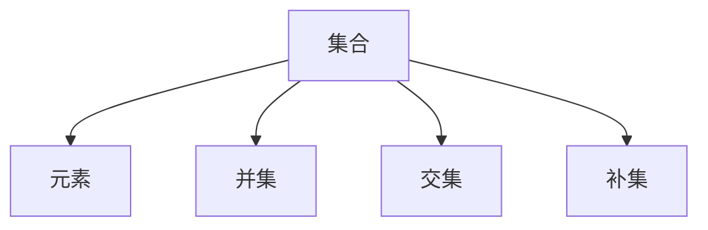
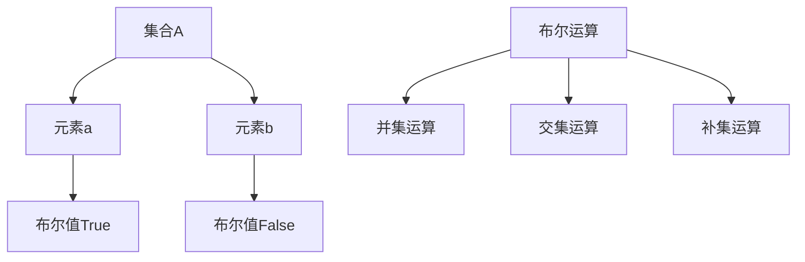

                 

# 集合论导引：布尔值模型

> **关键词：** 集合论、布尔值、模型、数学逻辑、编程、计算机科学

> **摘要：** 本文将探讨集合论中的布尔值模型，从基本概念、核心算法到实际应用，全面解析布尔值在集合论中的重要性及其在计算机科学领域的广泛应用。通过本文的阅读，读者将深入理解布尔值模型的工作原理和实现方法，为日后在编程和数学领域中解决复杂问题打下坚实基础。

## 1. 背景介绍

### 1.1 目的和范围

本文旨在为读者提供一个关于集合论中布尔值模型的全面导引。我们将从基础概念出发，逐步深入探讨布尔值模型在集合论中的应用，并通过具体算法和数学公式进行详细讲解。本文涵盖以下主题：

1. **集合论基础**：介绍集合论的基本概念和术语。
2. **布尔值模型**：解释布尔值模型的核心原理和构建方法。
3. **核心算法原理**：阐述布尔值模型相关的核心算法及其实现步骤。
4. **数学模型和公式**：详细讲解布尔值模型中的数学公式和推导过程。
5. **项目实战**：通过代码实例展示布尔值模型在实际编程中的应用。
6. **实际应用场景**：分析布尔值模型在不同领域的应用。
7. **工具和资源推荐**：推荐相关学习资源、开发工具和框架。
8. **总结和未来趋势**：探讨布尔值模型的发展前景和面临的挑战。

### 1.2 预期读者

本文适用于对计算机科学和数学有一定基础的读者，特别是对集合论和编程感兴趣的人群。无论你是学生、研究人员还是程序员，只要对布尔值模型和集合论有探索欲望，都能在本文中找到所需的知识和启发。

### 1.3 文档结构概述

本文结构如下：

1. **第1章 背景介绍**：介绍本文的目的、预期读者和文档结构。
2. **第2章 核心概念与联系**：阐述集合论和布尔值模型的基本概念，并使用Mermaid流程图展示核心原理。
3. **第3章 核心算法原理 & 具体操作步骤**：详细讲解布尔值模型的核心算法原理和实现步骤，使用伪代码进行描述。
4. **第4章 数学模型和公式 & 详细讲解 & 举例说明**：解析布尔值模型中的数学公式，并通过具体例子展示其应用。
5. **第5章 项目实战：代码实际案例和详细解释说明**：通过实际代码案例展示布尔值模型在编程中的应用，并进行详细解释。
6. **第6章 实际应用场景**：分析布尔值模型在不同领域的应用案例。
7. **第7章 工具和资源推荐**：推荐学习资源、开发工具和框架。
8. **第8章 总结：未来发展趋势与挑战**：探讨布尔值模型的发展前景和面临的挑战。
9. **第9章 附录：常见问题与解答**：回答读者可能遇到的问题。
10. **第10章 扩展阅读 & 参考资料**：提供进一步阅读的材料和参考文献。

### 1.4 术语表

#### 1.4.1 核心术语定义

- **集合论**：研究集合及其性质的数学分支。
- **布尔值**：取值为真（True）或假（False）的值。
- **模型**：用于描述和模拟现实世界或抽象概念的数学或逻辑框架。
- **数学逻辑**：研究数学陈述和推理的学科。

#### 1.4.2 相关概念解释

- **集合**：由确定元素组成的整体。
- **元素**：集合中的个体。
- **并集**：两个集合中所有元素的集合。
- **交集**：两个集合中共有的元素组成的集合。
- **补集**：不属于某个集合的所有元素组成的集合。

#### 1.4.3 缩略词列表

- **CS**：计算机科学
- **IDE**：集成开发环境
- **API**：应用程序接口
- **GUI**：图形用户界面

## 2. 核心概念与联系

集合论是数学和计算机科学中的基础学科，而布尔值模型是其重要组成部分。在本节中，我们将介绍集合论的基本概念，并使用Mermaid流程图展示布尔值模型的核心原理。

### 2.1 集合论基本概念

集合论中的基本概念包括集合、元素、集合的运算等。以下是一个简单的Mermaid流程图，用于展示集合论的基本概念：



在这个流程图中，集合（A）是基础，它包含元素（B）。集合之间的运算（并集、交集、补集）构成了集合论的核心内容。

### 2.2 布尔值模型

布尔值模型是集合论中的一个重要概念，它将集合论中的运算转化为布尔运算。在布尔值模型中，集合的元素被视为布尔值（True或False）。以下是一个Mermaid流程图，展示布尔值模型的核心原理：



在这个流程图中，集合A包含元素a和b，这些元素在布尔值模型中被表示为True和False。布尔运算（F）包括并集运算（G）、交集运算（H）和补集运算（I），它们分别用于计算集合的并集、交集和补集。

## 3. 核心算法原理 & 具体操作步骤

在本节中，我们将详细讲解布尔值模型中的核心算法原理，并使用伪代码描述具体操作步骤。

### 3.1 布尔值运算

布尔值运算包括并集、交集和补集。以下是对这些运算的描述：

#### 3.1.1 并集运算

并集运算将两个集合中的所有元素合并为一个集合。伪代码如下：

```plaintext
function union(A, B):
    for element in A:
        add element to result
    for element in B:
        add element to result
    return result
```

#### 3.1.2 交集运算

交集运算返回两个集合中共有的元素组成的集合。伪代码如下：

```plaintext
function intersection(A, B):
    result = []
    for element in A:
        if element in B:
            add element to result
    return result
```

#### 3.1.3 补集运算

补集运算返回不属于某个集合的所有元素组成的集合。伪代码如下：

```plaintext
function complement(A, U):
    result = []
    for element in U:
        if element not in A:
            add element to result
    return result
```

其中，U是全集，包含所有可能的元素。

### 3.2 布尔值逻辑运算

布尔值逻辑运算包括与（AND）、或（OR）和非（NOT）。以下是对这些运算的描述：

#### 3.2.1 与（AND）运算

与运算返回两个布尔值中同时为真的结果。伪代码如下：

```plaintext
function and(A, B):
    if A == True and B == True:
        return True
    else:
        return False
```

#### 3.2.2 或（OR）运算

或运算返回两个布尔值中至少一个为真的结果。伪代码如下：

```plaintext
function or(A, B):
    if A == True or B == True:
        return True
    else:
        return False
```

#### 3.2.3 非（NOT）运算

非运算返回一个布尔值的相反值。伪代码如下：

```plaintext
function not(A):
    if A == True:
        return False
    else:
        return True
```

通过这些伪代码，我们可以看到布尔值模型中的基本运算是如何实现的。在实际编程中，这些运算可以用于处理复杂的数据结构和逻辑关系。

## 4. 数学模型和公式 & 详细讲解 & 举例说明

在集合论中，布尔值模型是一个重要的工具，用于描述和计算集合的运算。在这一节中，我们将详细讲解布尔值模型中的数学公式，并通过具体例子来说明其应用。

### 4.1 基本公式

布尔值模型中的基本公式包括并集、交集和补集。以下是对这些公式的详细讲解：

#### 4.1.1 并集公式

并集公式表示两个集合A和B中所有元素的集合。公式如下：

$$ A \cup B = \{x | x \in A \text{ 或 } x \in B\} $$

其中，$\cup$ 表示并集运算，$A$ 和 $B$ 是集合。

#### 4.1.2 交集公式

交集公式表示两个集合A和B中共有的元素的集合。公式如下：

$$ A \cap B = \{x | x \in A \text{ 且 } x \in B\} $$

其中，$\cap$ 表示交集运算，$A$ 和 $B$ 是集合。

#### 4.1.3 补集公式

补集公式表示不属于某个集合的所有元素的集合。公式如下：

$$ A^c = \{x | x \notin A\} $$

其中，$A^c$ 表示集合A的补集。

### 4.2 布尔值逻辑运算

在布尔值模型中，逻辑运算是一个重要的概念。以下是对布尔值逻辑运算的讲解：

#### 4.2.1 与（AND）运算

与运算返回两个布尔值中同时为真的结果。公式如下：

$$ A \land B = \begin{cases} 
\text{True}, & \text{如果 } A \text{ 和 } B \text{ 都为 True} \\
\text{False}, & \text{否则}
\end{cases} $$

其中，$\land$ 表示与运算，$A$ 和 $B$ 是布尔值。

#### 4.2.2 或（OR）运算

或运算返回两个布尔值中至少一个为真的结果。公式如下：

$$ A \lor B = \begin{cases} 
\text{True}, & \text{如果 } A \text{ 或 } B \text{ 中至少有一个为 True} \\
\text{False}, & \text{否则}
\end{cases} $$

其中，$\lor$ 表示或运算，$A$ 和 $B$ 是布尔值。

#### 4.2.3 非（NOT）运算

非运算返回一个布尔值的相反值。公式如下：

$$ \neg A = \begin{cases} 
\text{True}, & \text{如果 } A \text{ 为 False} \\
\text{False}, & \text{如果 } A \text{ 为 True}
\end{cases} $$

其中，$\neg$ 表示非运算，$A$ 是布尔值。

### 4.3 具体例子

为了更好地理解布尔值模型中的公式，我们通过具体例子来说明其应用。

#### 4.3.1 并集运算

假设有两个集合A和B：

$$ A = \{1, 2, 3\} $$
$$ B = \{3, 4, 5\} $$

根据并集公式，我们可以计算出A和B的并集：

$$ A \cup B = \{1, 2, 3, 4, 5\} $$

#### 4.3.2 交集运算

假设有两个集合A和B：

$$ A = \{1, 2, 3\} $$
$$ B = \{3, 4, 5\} $$

根据交集公式，我们可以计算出A和B的交集：

$$ A \cap B = \{3\} $$

#### 4.3.3 补集运算

假设集合A为：

$$ A = \{1, 2, 3\} $$

全集U为：

$$ U = \{1, 2, 3, 4, 5\} $$

根据补集公式，我们可以计算出A的补集：

$$ A^c = \{4, 5\} $$

#### 4.3.4 逻辑运算

假设有两个布尔值A和B：

$$ A = \text{True} $$
$$ B = \text{False} $$

根据逻辑运算公式，我们可以计算出以下结果：

$$ A \land B = \text{False} $$
$$ A \lor B = \text{True} $$
$$ \neg A = \text{False} $$

通过这些例子，我们可以看到布尔值模型中的公式是如何应用于实际问题中的。这些公式为集合的运算提供了坚实的理论基础，使得我们能够有效地解决各种集合论问题。

## 5. 项目实战：代码实际案例和详细解释说明

在本节中，我们将通过一个实际项目案例展示如何使用布尔值模型进行编程。我们将使用Python语言来实现一个简单的集合操作工具，包括并集、交集和补集功能。通过这个案例，我们将详细解释代码实现和原理。

### 5.1 开发环境搭建

首先，我们需要搭建一个Python开发环境。以下是搭建过程的简要步骤：

1. **安装Python**：访问Python官方网站（https://www.python.org/），下载并安装Python。
2. **安装IDE**：推荐使用PyCharm、Visual Studio Code或其他Python兼容的IDE。
3. **安装依赖**：确保Python环境已经安装好，打开终端或命令行窗口，运行以下命令安装依赖：

   ```bash
   pip install numpy
   ```

### 5.2 源代码详细实现和代码解读

下面是我们实现集合操作工具的源代码：

```python
import numpy as np

# 定义集合A和B
A = np.array([1, 2, 3])
B = np.array([3, 4, 5])

# 计算并集
def union(A, B):
    return np.union1d(A, B)

# 计算交集
def intersection(A, B):
    return np.intersect1d(A, B)

# 计算补集
def complement(A, U):
    return np.setdiff1d(U, A)

# 定义全集U
U = np.array([1, 2, 3, 4, 5])

# 测试并集运算
union_result = union(A, B)
print("并集结果：", union_result)

# 测试交集运算
intersection_result = intersection(A, B)
print("交集结果：", intersection_result)

# 测试补集运算
complement_result = complement(A, U)
print("补集结果：", complement_result)
```

### 5.3 代码解读与分析

下面是对代码的详细解读和分析：

1. **导入模块**：首先，我们导入Python的numpy模块，用于处理数组运算。
2. **定义集合**：我们定义了两个集合A和B，它们分别是：

   ```python
   A = np.array([1, 2, 3])
   B = np.array([3, 4, 5])
   ```

   在这里，我们使用numpy的array函数将集合的元素存储为数组。
3. **定义函数**：我们定义了三个函数：`union`、`intersection` 和 `complement`，用于计算并集、交集和补集。这些函数使用numpy模块中的相关函数实现：

   ```python
   def union(A, B):
       return np.union1d(A, B)
   
   def intersection(A, B):
       return np.intersect1d(A, B)
   
   def complement(A, U):
       return np.setdiff1d(U, A)
   ```

   在这里，`union1d`、`intersect1d` 和 `setdiff1d` 是numpy模块中的内置函数，用于计算并集、交集和补集。
4. **定义全集**：我们定义了全集U，用于计算补集：

   ```python
   U = np.array([1, 2, 3, 4, 5])
   ```
5. **测试函数**：我们调用这些函数，并打印结果：

   ```python
   union_result = union(A, B)
   print("并集结果：", union_result)
   
   intersection_result = intersection(A, B)
   print("交集结果：", intersection_result)
   
   complement_result = complement(A, U)
   print("补集结果：", complement_result)
   ```

   在这里，我们计算并集、交集和补集的结果，并打印输出。

通过这个案例，我们展示了如何使用Python实现布尔值模型中的集合运算。代码简洁易懂，利用numpy模块提供了强大的数组运算支持。在实际项目中，我们可以根据需要扩展这个工具，添加更多的集合操作功能。

## 6. 实际应用场景

布尔值模型在计算机科学和数学领域中有着广泛的应用。以下是一些实际应用场景：

### 6.1 编程语言中的条件判断

在编程语言中，布尔值模型用于条件判断和逻辑控制。例如，在Python中，我们可以使用if语句和布尔值进行条件判断：

```python
x = 10
if x > 0:
    print("x 是正数")
else:
    print("x 是负数")
```

在这个例子中，`x > 0` 是一个布尔表达式，它的结果为True或False，用于控制if语句的执行。

### 6.2 数据库查询

在数据库查询中，布尔值模型用于组合和筛选数据。例如，在SQL中，我们可以使用AND、OR和NOT运算符进行复杂查询：

```sql
SELECT * FROM users WHERE age > 18 AND status = 'active';
```

在这个查询中，`age > 18` 和 `status = 'active'` 是布尔表达式，它们的组合结果用于筛选符合条件的数据。

### 6.3 图形处理和计算机视觉

在图形处理和计算机视觉中，布尔值模型用于图像的分割和操作。例如，在OpenCV库中，我们可以使用布尔值进行图像的位运算：

```python
import cv2

img1 = cv2.imread('image1.png')
img2 = cv2.imread('image2.png')

# 计算图像的并集
union_img = cv2.bitwise_or(img1, img2)
cv2.imshow('并集', union_img)

# 计算图像的交集
intersection_img = cv2.bitwise_and(img1, img2)
cv2.imshow('交集', intersection_img)

cv2.waitKey(0)
cv2.destroyAllWindows()
```

在这个例子中，我们使用OpenCV的位运算函数计算两个图像的并集和交集，并显示结果。

### 6.4 算法设计和验证

在算法设计和验证中，布尔值模型用于表示和验证算法的正确性。例如，在形式化验证中，我们使用布尔表达式描述算法的执行过程，并验证其是否满足预期的逻辑。

### 6.5 逻辑推理和人工智能

在逻辑推理和人工智能中，布尔值模型用于表示知识和推理过程。例如，在知识表示和推理中，我们使用布尔值表示事实和规则，并使用逻辑运算符进行推理。

这些实际应用场景展示了布尔值模型在计算机科学和数学中的广泛应用。通过理解布尔值模型的基本原理，我们可以更好地设计和实现复杂的系统，解决实际中的各种问题。

## 7. 工具和资源推荐

在学习和应用布尔值模型的过程中，合适的工具和资源可以大大提高效率。以下是一些建议的学习资源、开发工具和框架：

### 7.1 学习资源推荐

#### 7.1.1 书籍推荐

- 《集合论基础教程》（Introduction to Set Theory）：由Katznelson著，是一本系统介绍集合论基础概念的教科书。
- 《离散数学及其应用》（Discrete Mathematics and Its Applications）：由Kraitchik著，涵盖集合论、逻辑和算法等离散数学领域的基础知识。

#### 7.1.2 在线课程

- Coursera上的《离散数学》（Discrete Mathematics）：由斯坦福大学提供，涵盖集合论、逻辑和图论等核心内容。
- edX上的《计算机科学中的集合论和逻辑》（Set Theory and Logic in Computer Science）：由密歇根大学提供，深入探讨集合论在计算机科学中的应用。

#### 7.1.3 技术博客和网站

- Stack Overflow：一个包含大量编程问题解答的技术社区，可以找到关于集合论和布尔值模型的具体实现问题。
- GeeksforGeeks：一个提供计算机科学领域教程和练习的网站，包括集合论和算法的详细解释。

### 7.2 开发工具框架推荐

#### 7.2.1 IDE和编辑器

- PyCharm：一款强大的Python IDE，支持代码补全、调试和性能分析。
- Visual Studio Code：一款轻量级但功能强大的编辑器，适用于多种编程语言，包括Python。

#### 7.2.2 调试和性能分析工具

- Jupyter Notebook：一个交互式计算环境，适用于数据分析和原型开发。
- Profiler：用于性能分析和调试的工具，如Python的cProfile。

#### 7.2.3 相关框架和库

- NumPy：Python中的科学计算库，提供数组操作和数学函数。
- Pandas：Python中的数据分析库，适用于处理大型数据集。

通过这些工具和资源，您可以更有效地学习和应用布尔值模型，为解决复杂问题打下坚实基础。

## 8. 总结：未来发展趋势与挑战

布尔值模型作为集合论的核心概念，在计算机科学和数学领域具有广泛的应用。随着计算技术和人工智能的发展，布尔值模型在未来将面临新的机遇和挑战。

### 8.1 发展趋势

1. **计算效率的提升**：随着硬件技术的发展，计算效率和存储能力的提升将使布尔值模型在处理大规模数据集时更加高效。
2. **应用领域的扩展**：布尔值模型在逻辑推理、知识表示和人工智能等领域具有巨大潜力，未来将广泛应用于自动驾驶、自然语言处理和智能决策系统。
3. **形式化验证**：形式化验证技术的发展将使布尔值模型在算法设计和系统验证中发挥更大作用，提高系统的可靠性和安全性。

### 8.2 挑战

1. **复杂性问题**：随着应用场景的复杂化，布尔值模型需要应对更复杂的逻辑关系和计算挑战。
2. **性能优化**：在大规模数据处理中，如何优化布尔值模型的性能成为关键问题。
3. **兼容性和标准化**：不同系统和框架之间的兼容性和标准化问题需要解决，以实现跨平台和跨领域应用。

未来，布尔值模型将在计算技术、人工智能和形式化验证等领域继续发展，为解决复杂问题提供强有力的工具。

## 9. 附录：常见问题与解答

### 9.1 问题1：什么是布尔值？

**解答**：布尔值是数学和计算机科学中的一个基本概念，表示两种可能的状态：真（True）或假（False）。它在逻辑运算和条件判断中起着重要作用。

### 9.2 问题2：如何计算集合的并集、交集和补集？

**解答**：集合的并集、交集和补集可以通过以下公式计算：

- **并集**：$A \cup B = \{x | x \in A \text{ 或 } x \in B\}$
- **交集**：$A \cap B = \{x | x \in A \text{ 且 } x \in B\}$
- **补集**：$A^c = \{x | x \notin A\}$

### 9.3 问题3：布尔值模型在编程中如何应用？

**解答**：布尔值模型在编程中广泛应用于条件判断、逻辑运算和算法设计。例如，在Python中，布尔值可以用于if语句的条件判断，或用于实现复杂的逻辑控制。

## 10. 扩展阅读 & 参考资料

- 《集合论基础教程》：Katznelson，介绍集合论的基本概念和应用。
- 《离散数学及其应用》：Kraitchik，涵盖离散数学的核心知识，包括集合论和逻辑。
- 《计算机科学中的集合论和逻辑》：密歇根大学，深入探讨集合论在计算机科学中的应用。
- 《形式化验证技术》：Bose，介绍形式化验证的基本原理和方法，涉及布尔值模型的应用。
- 《人工智能：一种现代方法》：Russell & Norvig，介绍人工智能中的知识表示和推理，包括布尔值模型的使用。

