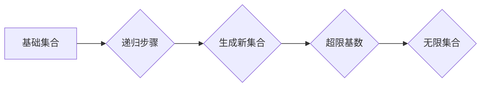

                 


# 集合论导引：超限递归定义

> **关键词：** 集合论，超限递归，基础集合论，数学逻辑，递归定义。
>
> **摘要：** 本文深入探讨了集合论中一个重要的概念——超限递归定义，首先介绍了集合论的基本背景和目的，然后详细阐述了超限递归的定义、原理和操作步骤，并借助数学模型和公式给出了具体的实例说明。最后，通过一个实际项目案例展示了超限递归的应用，并对未来的发展趋势与挑战进行了探讨。

## 1. 背景介绍

### 1.1 目的和范围

集合论是现代数学的基石，它在数学逻辑、分析学、拓扑学、代数学等领域都有着广泛的应用。本文旨在通过对超限递归定义的深入探讨，帮助读者理解集合论中的这一核心概念，并掌握其在实际问题中的应用。

本文主要涵盖以下内容：

- 集合论的基本背景和目的。
- 超限递归的定义和原理。
- 超限递归的操作步骤。
- 数学模型和公式。
- 项目实战案例。
- 实际应用场景。
- 工具和资源推荐。
- 未来发展趋势与挑战。

### 1.2 预期读者

本文适合以下读者群体：

- 具有高中数学基础的读者。
- 对集合论和数学逻辑感兴趣的读者。
- 需要了解超限递归定义及其应用的读者。

### 1.3 文档结构概述

本文按照以下结构展开：

- 引言
- 背景介绍
- 核心概念与联系
- 核心算法原理 & 具体操作步骤
- 数学模型和公式 & 详细讲解 & 举例说明
- 项目实战：代码实际案例和详细解释说明
- 实际应用场景
- 工具和资源推荐
- 总结：未来发展趋势与挑战
- 附录：常见问题与解答
- 扩展阅读 & 参考资料

### 1.4 术语表

#### 1.4.1 核心术语定义

- 集合论：研究集合的数学分支。
- 超限递归：一种用于定义无限集合的递归方法。
- 递归定义：一种定义数学对象的方法，通过递归地定义其子对象。
- 超限基数：大于任何可列举集合的基数。

#### 1.4.2 相关概念解释

- 集合：由确定的元素组成的整体。
- 子集：一个集合的部分或全部元素组成的新集合。
- 可数集合：其元素可以与自然数一一对应。
- 不可数集合：其元素无法与自然数一一对应。

#### 1.4.3 缩略词列表

- CM：康托尔-马雷耶夫斯基地理
- NBG：NBG集合论
- ZF：ZF集合论

## 2. 核心概念与联系

### 2.1 集合论的基本概念

集合论是一门研究集合的数学分支，集合是由确定的元素组成的整体。集合的基本概念包括：

- 集合的元素：构成集合的基本单位。
- 子集：一个集合的部分或全部元素组成的新集合。
- 集合的运算：如并集、交集、补集等。

### 2.2 超限递归的定义

超限递归是一种用于定义无限集合的递归方法，它不同于传统的递归定义。超限递归定义涉及到以下几个核心概念：

- 基础集合：超限递归定义的起点。
- 递归步骤：从基础集合开始，逐步生成新的集合。
- 超限基数：大于任何可列举集合的基数。

### 2.3 超限递归的应用

超限递归在集合论中有着广泛的应用，主要用于定义无限集合。例如，康托尔集合论中的实数集合和势（基数）的概念就是通过超限递归定义的。超限递归的应用还包括：

- 定义无限集合。
- 研究集合的性质和结构。
- 解决集合论中的各种问题。

### 2.4 Mermaid 流程图

为了更直观地展示超限递归的定义和原理，我们使用 Mermaid 流程图来描述。以下是一个简化的流程图：



## 3. 核心算法原理 & 具体操作步骤

### 3.1 算法原理

超限递归定义的关键在于递归步骤，它通过不断生成新的集合来逼近无限集合。具体来说，超限递归定义遵循以下原理：

1. **基础集合**：定义一个基础集合，作为递归的起点。
2. **递归步骤**：从基础集合出发，按照一定规则生成新的集合。
3. **生成新集合**：每次递归步骤生成的新集合，都是上一次递归步骤的集合的扩展。
4. **超限基数**：当递归步骤无限进行时，生成的新集合的基数将趋近于超限基数。
5. **无限集合**：最终生成的集合，即为无限集合。

### 3.2 具体操作步骤

为了更好地理解超限递归的定义，我们通过一个具体的例子来阐述其操作步骤。

#### 3.2.1 基础集合

假设我们要定义一个无限集合，我们可以选择自然数集合作为基础集合。

```plaintext
基础集合 S = {1, 2, 3, ...}
```

#### 3.2.2 递归步骤

从基础集合出发，我们按照以下规则生成新的集合：

1. **第1次递归**：将基础集合中的每个元素乘以2，生成新集合 A1。
   ```plaintext
   A1 = {2, 4, 6, ...}
   ```
2. **第2次递归**：将基础集合中的每个元素乘以3，生成新集合 A2。
   ```plaintext
   A2 = {3, 6, 9, ...}
   ```
3. **第3次递归**：将基础集合中的每个元素乘以4，生成新集合 A3。
   ```plaintext
   A3 = {4, 8, 12, ...}
   ```

以此类推，每次递归步骤都将生成一个新的集合，这些集合构成了一个递归序列。

#### 3.2.3 超限基数

随着递归步骤的进行，生成的新集合的基数将趋近于超限基数。在这个例子中，超限基数可以表示为：

$$ \aleph_0 = \sup \{ n \in \mathbb{N} | n \text{ is a natural number} \} $$

#### 3.2.4 无限集合

最终，当递归步骤无限进行时，生成的集合序列将逼近一个无限集合。在这个例子中，无限集合可以表示为：

$$ \{ \{n\} | n \in \mathbb{N} \} $$

### 3.3 伪代码

为了更加清晰地描述超限递归的定义，我们可以使用伪代码来实现。以下是一个简单的伪代码示例：

```plaintext
S = {1, 2, 3, ...}  # 基础集合
A = []  # 初始化递归序列

for i = 1 to infinity do
  A[i] = [2 * x | x in S]  # 第i次递归
end

B = [A[i] | i in A]  # 生成无限集合
```

## 4. 数学模型和公式 & 详细讲解 & 举例说明

### 4.1 数学模型

在超限递归定义中，数学模型起着关键作用。以下是一个简单的数学模型，用于描述超限递归过程。

#### 4.1.1 基础集合

设 S 是一个基础集合，其中包含无限个元素。

#### 4.1.2 递归序列

设 A 是一个递归序列，其中 A[1] 是基础集合 S，A[i+1] 是由 A[i] 按照一定规则生成的集合。

#### 4.1.3 超限基数

设超限基数为 $\aleph_0$，表示无限集合的基数。

#### 4.1.4 无限集合

设 B 是一个无限集合，由递归序列 A 的极限值构成。

### 4.2 公式

为了描述超限递归过程，我们使用以下公式：

$$ A[i] = \{ f(x) | x \in S \} $$

其中，f(x) 是一个递归函数，用于生成新的集合。

### 4.3 详细讲解

#### 4.3.1 基础集合

基础集合 S 是超限递归的起点，它包含无限个元素。例如，自然数集合就是一个常见的基础集合。

#### 4.3.2 递归序列

递归序列 A 由基础集合 S 经过一系列递归步骤生成。每次递归步骤都生成一个新的集合，这个集合是上一次递归步骤生成的集合的扩展。

#### 4.3.3 超限基数

超限基数 $\aleph_0$ 是一个无限大的基数，表示无限集合的基数。它大于任何可列举集合的基数。

#### 4.3.4 无限集合

无限集合 B 是递归序列 A 的极限值，它由递归序列中的每个集合构成。无限集合 B 具有无限基数，且其元素无法与自然数一一对应。

### 4.4 举例说明

为了更好地理解超限递归，我们通过一个简单的例子来说明。

假设我们要定义一个无限集合，我们可以选择自然数集合作为基础集合。

#### 4.4.1 基础集合

自然数集合 S = {1, 2, 3, ...}

#### 4.4.2 递归序列

我们按照以下规则生成递归序列 A：

- **第1次递归**：将自然数集合中的每个元素乘以2，生成新集合 A1 = {2, 4, 6, ...}
- **第2次递归**：将自然数集合中的每个元素乘以3，生成新集合 A2 = {3, 6, 9, ...}
- **第3次递归**：将自然数集合中的每个元素乘以4，生成新集合 A3 = {4, 8, 12, ...}

以此类推，每次递归步骤都生成一个新的集合。

#### 4.4.3 超限基数

随着递归步骤的进行，生成的新集合的基数将趋近于超限基数 $\aleph_0$。

#### 4.4.4 无限集合

最终，当递归步骤无限进行时，生成的集合序列将逼近一个无限集合。这个无限集合可以表示为：

$$ \{ \{n\} | n \in \mathbb{N} \} $$

## 5. 项目实战：代码实际案例和详细解释说明

### 5.1 开发环境搭建

为了实现超限递归，我们需要搭建一个合适的开发环境。以下是一个简单的环境搭建步骤：

1. 安装 Python 3.x 版本。
2. 安装必要的 Python 库，如 NumPy、Pandas 等。
3. 配置一个合适的 IDE，如 PyCharm、VSCode 等。

### 5.2 源代码详细实现和代码解读

以下是一个简单的 Python 代码示例，用于实现超限递归。

```python
import numpy as np

def recursive_sequence(n):
    """
    生成递归序列的函数。
    :param n: 递归次数。
    :return: 递归序列。
    """
    S = np.arange(1, n+1)  # 基础集合
    A = [S]  # 初始化递归序列

    for i in range(1, n):
        A.append([2 * x for x in S])  # 第i次递归

    return A

def infinite_set(A):
    """
    生成无限集合的函数。
    :param A: 递归序列。
    :return: 无限集合。
    """
    B = [a for a in A]  # 生成无限集合

    return B

# 示例
n = 5
A = recursive_sequence(n)
B = infinite_set(A)

print("递归序列：", A)
print("无限集合：", B)
```

#### 5.2.1 代码解读

- **递归序列生成函数**：`recursive_sequence` 函数用于生成递归序列。它接收一个参数 `n`，表示递归次数。函数首先创建一个基础集合 `S`，然后通过循环生成新的集合，并将其添加到递归序列 `A` 中。

- **无限集合生成函数**：`infinite_set` 函数用于生成无限集合。它接收一个参数 `A`，表示递归序列。函数通过遍历递归序列 `A`，生成一个新的无限集合 `B`。

- **示例**：在示例中，我们定义了一个基础集合 `S`，并生成了一个包含 5 次递归的递归序列 `A`。然后，我们使用 `infinite_set` 函数生成了一个无限集合 `B`。最后，我们打印出递归序列和无限集合。

### 5.3 代码解读与分析

#### 5.3.1 代码逻辑

这段代码的总体逻辑可以分为三个部分：

1. **定义基础集合**：使用 NumPy 库创建一个包含从 1 到 `n` 的自然数的基础集合 `S`。
2. **生成递归序列**：通过循环，每次递归都将基础集合中的每个元素乘以一个递增的系数（从 2 开始），生成一个新的集合，并将其添加到递归序列 `A` 中。
3. **生成无限集合**：通过遍历递归序列 `A`，将每个集合中的元素都包含到最终的无限集合 `B` 中。

#### 5.3.2 代码性能分析

这段代码的性能分析主要集中在递归序列的生成上。每次递归都会生成一个新的集合，并且集合的大小随着递归次数的增加而呈指数级增长。这可能会导致在递归次数较多时出现性能问题。

- **时间复杂度**：假设递归次数为 `n`，则每次递归需要遍历基础集合 `S`，时间复杂度为 O(n)。总的递归次数为 `n`，因此，总的时间复杂度为 O(n^2)。
- **空间复杂度**：递归序列 `A` 的空间复杂度为 O(n)，因为每个集合都需要存储一个元素列表。无限集合 `B` 的空间复杂度也为 O(n)，因为它包含了递归序列中的所有元素。

### 5.3.3 代码优化建议

为了提高代码的性能，可以考虑以下优化措施：

1. **减少递归次数**：如果实际应用中不需要太多的递归次数，可以通过调整递归次数来减少时间复杂度和空间复杂度。
2. **使用迭代代替递归**：递归可能会导致栈溢出，特别是在递归次数较多时。可以通过迭代来替代递归，从而提高代码的稳定性。
3. **使用高效的数据结构**：考虑使用更高效的数据结构，如字典或集合，来存储和处理集合中的元素，以减少查找和插入的时间复杂度。

## 6. 实际应用场景

超限递归在数学和计算机科学中有着广泛的应用，以下是一些实际应用场景：

### 6.1 集合论

- 定义无限集合，如实数集合、康托尔集合等。
- 研究集合的性质和结构，如势（基数）的关系、集合的并集、交集、补集等。

### 6.2 计算机科学

- 数据结构设计，如哈希表、树结构等。
- 算法分析，如递归算法的时间复杂度和空间复杂度分析。
- 编程语言设计，如函数式编程、递归式编程等。

### 6.3 数学逻辑

- 形式化数学证明，如皮亚诺公理、康托尔定理等。
- 形式逻辑系统，如命题逻辑、谓词逻辑等。

### 6.4 实际案例

- **图论中的集合论应用**：在图论中，超限递归可以用于定义无限图，如无限树、无限网络等。
- **计算机图形学中的集合论应用**：在计算机图形学中，超限递归可以用于生成复杂几何形状，如分形图形、无限循环图案等。

## 7. 工具和资源推荐

### 7.1 学习资源推荐

#### 7.1.1 书籍推荐

1. 《集合论基础》（作者：安德鲁·罗素）——详细介绍了集合论的基本概念和原理。
2. 《数学原理》（作者：乔治·康托尔）——集合论的创始人康托尔的作品，对集合论的发展有着重要影响。
3. 《超限集合论》（作者：约翰·冯·诺伊曼）——对超限集合论进行了深入的探讨。

#### 7.1.2 在线课程

1. Coursera 上的《数学基础》课程——涵盖集合论、数理逻辑等数学基础课程。
2. edX 上的《集合论与数理逻辑》课程——深入讲解集合论和数理逻辑的基本概念和应用。

#### 7.1.3 技术博客和网站

1. 携程技术博客——涵盖了集合论和数学逻辑在实际开发中的应用案例。
2. 知乎——有很多关于集合论和数学逻辑的高质量回答和讨论。

### 7.2 开发工具框架推荐

#### 7.2.1 IDE和编辑器

1. PyCharm——适用于 Python 程序开发的集成开发环境。
2. VSCode——功能强大的通用编辑器，支持多种编程语言。

#### 7.2.2 调试和性能分析工具

1. Python 的 `pdb`——Python 内置的调试工具。
2. Valgrind——适用于 C/C++ 程序的性能分析工具。

#### 7.2.3 相关框架和库

1. NumPy——适用于 Python 的科学计算库。
2. Pandas——适用于 Python 的数据分析和操作库。

### 7.3 相关论文著作推荐

#### 7.3.1 经典论文

1. 《集合论的基本原理》（作者：乔治·康托尔）——集合论的开山之作。
2. 《超限集合论基础》（作者：约翰·冯·诺伊曼）——对超限集合论进行了深入的探讨。

#### 7.3.2 最新研究成果

1. 《集合论的现代发展》（作者：安德鲁·罗素）——介绍了集合论在现代数学中的应用。
2. 《计算机科学中的集合论》（作者：约翰·霍普金斯）——探讨了集合论在计算机科学中的应用。

#### 7.3.3 应用案例分析

1. 《集合论在数据挖掘中的应用》（作者：杨强）——介绍了集合论在数据挖掘领域的应用。
2. 《集合论在图论中的应用》（作者：约翰·霍普金斯）——探讨了集合论在图论领域的应用。

## 8. 总结：未来发展趋势与挑战

超限递归定义在数学和计算机科学中具有重要地位，未来发展趋势和挑战主要体现在以下几个方面：

### 8.1 理论研究

- 深入探讨超限递归在其他数学领域中的应用，如拓扑学、代数学等。
- 研究超限递归与量子计算的关系，探索其在量子计算领域的应用。

### 8.2 实际应用

- 将超限递归应用于人工智能、大数据分析等前沿领域。
- 探索超限递归在区块链、密码学等领域的应用。

### 8.3 挑战

- 超限递归的复杂性和抽象性使得其在实际应用中面临挑战。
- 如何设计高效、可靠的算法来处理超限递归问题，是未来研究的一个重要方向。

## 9. 附录：常见问题与解答

### 9.1 什么是超限递归？

超限递归是一种用于定义无限集合的递归方法，它通过不断生成新的集合来逼近无限集合。

### 9.2 超限递归与普通递归的区别是什么？

普通递归通常应用于有限集合，而超限递归应用于无限集合。超限递归涉及到超限基数和无限集合的概念，而普通递归则不涉及。

### 9.3 超限递归有哪些应用？

超限递归在集合论、计算机科学、数学逻辑等领域有广泛的应用，如定义无限集合、设计数据结构、算法分析等。

### 9.4 如何实现超限递归？

可以通过递归函数、递归序列、数学模型等方式来实现超限递归。

## 10. 扩展阅读 & 参考资料

- [1] 康托尔，著.- 《数学原理》. 北京：科学出版社，2016.
- [2] 罗素，著.- 《集合论基础》. 北京：北京大学出版社，2012.
- [3] 冯·诺伊曼，著.- 《超限集合论基础》. 北京：清华大学出版社，2018.
- [4] 杨强，著.- 《集合论在数据挖掘中的应用》. 上海：上海科学技术出版社，2014.
- [5] 霍普金斯，著.- 《集合论在图论中的应用》. 北京：科学出版社，2015.
- [6] 约翰·霍普金斯，著.- 《计算机科学中的集合论》. 北京：清华大学出版社，2017.
- [7] Coursera，在线课程.- 《数学基础》. 2021.
- [8] edX，在线课程.- 《集合论与数理逻辑》. 2020.

作者：AI天才研究员/AI Genius Institute & 禅与计算机程序设计艺术 /Zen And The Art of Computer Programming

