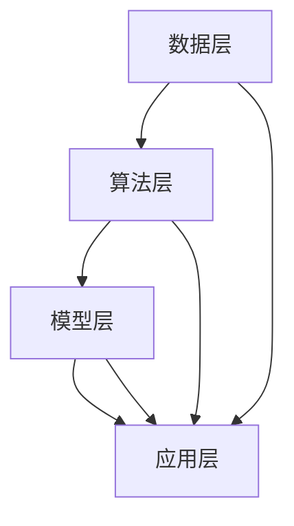

                 

# 零售大模型：智能营销和精准推荐

> 关键词：零售、大模型、智能营销、精准推荐、机器学习、深度学习、数据处理、算法优化

> 摘要：本文旨在深入探讨零售行业中的大模型应用，特别是在智能营销和精准推荐领域。通过分析大模型的原理、算法以及实际应用案例，本文将展示如何利用这些先进技术提升零售业务效益，同时探讨未来发展的趋势与挑战。

## 1. 背景介绍

### 1.1 目的和范围

本文的目标是探讨大模型在零售行业中的智能营销和精准推荐应用。我们将从基础概念入手，逐步深入到具体算法和实际案例，帮助读者了解这一领域的发展现状和未来趋势。

本文将覆盖以下主要内容：

1. **大模型的基本概念**：介绍大模型的定义、分类及其在零售行业中的重要性。
2. **核心算法原理**：详细解析机器学习和深度学习算法，解释它们如何应用于零售业务。
3. **数学模型和公式**：讲解相关数学模型和公式，包括推荐系统中的常见指标和计算方法。
4. **项目实战**：通过实际案例展示如何使用大模型进行智能营销和精准推荐。
5. **实际应用场景**：探讨大模型在零售行业的应用场景，以及如何通过这些应用提升业务效益。
6. **工具和资源推荐**：推荐相关学习资源和开发工具，帮助读者进一步学习和实践。
7. **总结与展望**：总结本文内容，探讨大模型在零售行业中的未来发展趋势与挑战。

### 1.2 预期读者

本文适合以下读者群体：

1. 对零售行业有一定了解的技术人员。
2. 想要了解大模型应用的技术爱好者。
3. 从事零售行业数据分析、营销推广等相关工作的人员。

### 1.3 文档结构概述

本文结构如下：

1. **背景介绍**：介绍本文的目的、预期读者、文档结构和核心术语。
2. **核心概念与联系**：讲解大模型的基本概念，包括其原理和架构。
3. **核心算法原理与具体操作步骤**：详细解释大模型的核心算法原理，并使用伪代码展示具体操作步骤。
4. **数学模型和公式与举例说明**：讲解数学模型和公式，并给出实际应用案例。
5. **项目实战：代码实际案例和详细解释说明**：展示实际项目的代码实现和解读。
6. **实际应用场景**：探讨大模型在零售行业中的实际应用。
7. **工具和资源推荐**：推荐学习资源和开发工具。
8. **总结与展望**：总结本文内容，探讨未来发展趋势与挑战。
9. **附录：常见问题与解答**：回答读者可能关心的问题。
10. **扩展阅读与参考资料**：提供进一步阅读的资源和参考文献。

### 1.4 术语表

#### 1.4.1 核心术语定义

- **零售大模型**：指在零售行业中应用的大型机器学习模型，主要用于智能营销和精准推荐。
- **机器学习**：一种人工智能方法，通过训练算法使计算机从数据中学习，进行预测和决策。
- **深度学习**：一种特殊的机器学习方法，通过多层神经网络进行特征提取和学习。
- **智能营销**：利用人工智能技术进行市场分析和营销活动，以提高营销效果。
- **精准推荐**：根据用户行为和偏好，为用户推荐相关产品和服务。

#### 1.4.2 相关概念解释

- **数据处理**：对原始数据进行分析、清洗、转换等操作，以便后续建模和应用。
- **算法优化**：通过对算法进行改进和调优，提高模型的性能和准确性。
- **推荐系统**：根据用户历史行为和偏好，为用户推荐相关商品或内容的系统。

#### 1.4.3 缩略词列表

- **AI**：人工智能
- **ML**：机器学习
- **DL**：深度学习
- **NLP**：自然语言处理
- **CPS**：消费者行为预测

## 2. 核心概念与联系

### 2.1 大模型的基本概念

#### 大模型的定义

大模型，通常指在零售行业中应用的大型机器学习模型。这些模型通常具有以下特点：

1. **规模庞大**：包含数百万甚至数十亿个参数。
2. **训练数据丰富**：使用海量的零售交易数据、用户行为数据和市场信息。
3. **功能多样化**：既可以进行用户行为预测，又可以进行商品推荐和智能营销。

#### 大模型的分类

根据模型的结构和应用场景，大模型可以分为以下几类：

1. **深度神经网络**：通过多层神经网络进行特征提取和学习，如卷积神经网络（CNN）和循环神经网络（RNN）。
2. **增强学习模型**：通过与环境的交互进行学习，优化策略以实现特定目标，如强化学习（RL）。
3. **集成学习方法**：通过组合多个基本模型，提高模型的性能和泛化能力，如随机森林（RF）和梯度提升树（GBDT）。

#### 大模型在零售行业中的重要性

大模型在零售行业中的应用具有重要意义，主要体现在以下几个方面：

1. **智能营销**：通过分析用户行为和市场数据，实现个性化营销，提高转化率和销售额。
2. **精准推荐**：根据用户兴趣和偏好，为用户推荐相关商品和服务，提升用户体验和忠诚度。
3. **需求预测**：通过预测市场需求和趋势，优化库存管理和供应链计划，降低成本和风险。

### 2.2 大模型的原理和架构

#### 原理

大模型的核心在于其深度学习和机器学习算法，这些算法通过训练数据自动学习特征和模式，从而实现预测和决策。具体原理如下：

1. **特征提取**：通过神经网络结构，自动提取输入数据中的特征。
2. **模型训练**：利用大量训练数据，调整模型参数，使模型能够预测新的数据。
3. **模型评估**：通过交叉验证和测试集，评估模型的性能和泛化能力。
4. **模型应用**：将训练好的模型应用于实际业务场景，如智能营销和精准推荐。

#### 架构

大模型的架构通常包括以下几部分：

1. **数据层**：负责数据收集、清洗、存储和预处理。
2. **算法层**：包含机器学习和深度学习算法，如神经网络、强化学习和集成学习等。
3. **模型层**：构建和训练模型，并进行评估和应用。
4. **应用层**：将模型应用于实际业务场景，如智能营销和精准推荐。

### 2.3 大模型与相关概念的关联

大模型与相关概念的关联如下：

1. **机器学习**：大模型是机器学习的一种应用，利用海量数据训练模型，实现智能决策。
2. **深度学习**：大模型通常采用深度学习算法，通过多层神经网络进行特征提取和学习。
3. **自然语言处理**（NLP）：大模型在处理文本数据时，常利用NLP技术进行语义分析和情感分析。
4. **增强学习**：大模型可以应用于增强学习场景，通过与环境交互进行学习，优化策略。
5. **推荐系统**：大模型在推荐系统中用于预测用户行为和偏好，实现精准推荐。

#### 大模型与零售行业的关联

大模型在零售行业中的应用，主要体现在以下几个方面：

1. **用户行为分析**：通过分析用户行为数据，了解用户需求和偏好，实现个性化推荐。
2. **市场预测**：利用市场数据，预测市场需求和趋势，优化库存管理和供应链计划。
3. **营销策略**：通过分析用户数据和市场趋势，制定个性化的营销策略，提高转化率和销售额。
4. **供应链优化**：通过分析供应链数据，优化库存管理和物流配送，降低成本和提高效率。

### 2.4 大模型的 Mermaid 流程图



**流程解释**：

1. **数据层**：收集零售行业相关的数据，如用户行为数据、市场数据和供应链数据。
2. **算法层**：采用机器学习和深度学习算法，对数据进行处理和分析。
3. **模型层**：构建和训练模型，将算法应用于实际业务场景。
4. **应用层**：将训练好的模型应用于智能营销、精准推荐和市场预测等业务场景。

## 3. 核心算法原理与具体操作步骤

### 3.1 机器学习算法原理

#### 机器学习基础

机器学习（ML）是一种人工智能方法，通过训练算法使计算机从数据中学习，进行预测和决策。机器学习的基本过程包括以下几个步骤：

1. **数据收集**：收集与问题相关的数据，如用户行为数据、市场数据和供应链数据。
2. **数据处理**：对数据进行清洗、预处理和转换，以便后续建模和应用。
3. **模型构建**：选择合适的模型结构，如线性模型、决策树、支持向量机等。
4. **模型训练**：利用训练数据，调整模型参数，使模型能够预测新的数据。
5. **模型评估**：通过交叉验证和测试集，评估模型的性能和泛化能力。
6. **模型应用**：将训练好的模型应用于实际业务场景，如智能营销、精准推荐和市场预测。

#### 机器学习算法分类

根据模型结构和应用场景，机器学习算法可以分为以下几类：

1. **监督学习**：有明确的目标和标签，如分类问题和回归问题。
2. **无监督学习**：没有明确的目标和标签，如聚类问题和降维问题。
3. **半监督学习**：结合监督学习和无监督学习，利用少量标签数据和大量无标签数据。
4. **强化学习**：通过与环境的交互进行学习，优化策略以实现特定目标。

### 3.2 深度学习算法原理

#### 深度学习基础

深度学习（DL）是一种特殊的机器学习方法，通过多层神经网络进行特征提取和学习。深度学习的基本过程包括以下几个步骤：

1. **数据收集**：收集与问题相关的数据，如用户行为数据、市场数据和供应链数据。
2. **数据处理**：对数据进行清洗、预处理和转换，以便后续建模和应用。
3. **模型构建**：选择合适的神经网络结构，如卷积神经网络（CNN）、循环神经网络（RNN）和变换器（Transformer）等。
4. **模型训练**：利用训练数据，调整模型参数，使模型能够预测新的数据。
5. **模型评估**：通过交叉验证和测试集，评估模型的性能和泛化能力。
6. **模型应用**：将训练好的模型应用于实际业务场景，如智能营销、精准推荐和市场预测。

#### 深度学习算法分类

根据神经网络结构和应用场景，深度学习算法可以分为以下几类：

1. **卷积神经网络（CNN）**：主要用于图像识别和图像处理。
2. **循环神经网络（RNN）**：主要用于序列数据处理和时间序列分析。
3. **变换器（Transformer）**：主要用于自然语言处理和机器翻译。
4. **生成对抗网络（GAN）**：主要用于图像生成和图像修复。

### 3.3 机器学习和深度学习算法的具体操作步骤

#### 3.3.1 机器学习算法操作步骤

1. **数据收集**：

   ```python
   import pandas as pd

   # 读取用户行为数据
   user_data = pd.read_csv('user行为数据.csv')
   ```

2. **数据处理**：

   ```python
   from sklearn.preprocessing import StandardScaler

   # 数据清洗和预处理
   scaler = StandardScaler()
   user_data_scaled = scaler.fit_transform(user_data)
   ```

3. **模型构建**：

   ```python
   from sklearn.linear_model import LinearRegression

   # 构建线性回归模型
   model = LinearRegression()
   ```

4. **模型训练**：

   ```python
   # 使用训练数据进行模型训练
   model.fit(user_data_scaled[:, :5], user_data_scaled[:, 5])
   ```

5. **模型评估**：

   ```python
   from sklearn.metrics import mean_squared_error

   # 使用测试数据进行模型评估
   test_data = pd.read_csv('测试数据.csv')
   test_data_scaled = scaler.transform(test_data)
   predictions = model.predict(test_data_scaled[:, :5])
   mse = mean_squared_error(test_data_scaled[:, 5], predictions)
   print("均方误差：", mse)
   ```

6. **模型应用**：

   ```python
   # 将模型应用于新数据
   new_data = pd.read_csv('新数据.csv')
   new_data_scaled = scaler.transform(new_data)
   predictions = model.predict(new_data_scaled[:, :5])
   print("预测结果：", predictions)
   ```

#### 3.3.2 深度学习算法操作步骤

1. **数据收集**：

   ```python
   import pandas as pd

   # 读取用户行为数据
   user_data = pd.read_csv('user行为数据.csv')
   ```

2. **数据处理**：

   ```python
   from sklearn.preprocessing import StandardScaler

   # 数据清洗和预处理
   scaler = StandardScaler()
   user_data_scaled = scaler.fit_transform(user_data)
   ```

3. **模型构建**：

   ```python
   from tensorflow.keras.models import Sequential
   from tensorflow.keras.layers import Dense, Conv2D, LSTM

   # 构建卷积神经网络模型
   model = Sequential()
   model.add(Conv2D(32, (3, 3), activation='relu', input_shape=(28, 28, 1)))
   model.add(MaxPooling2D((2, 2)))
   model.add(LSTM(50, activation='relu', dropout=0.2, recurrent_dropout=0.2))
   model.add(Dense(1, activation='sigmoid'))
   ```

4. **模型训练**：

   ```python
   from tensorflow.keras.optimizers import Adam

   # 使用训练数据进行模型训练
   model.compile(optimizer=Adam(learning_rate=0.001), loss='binary_crossentropy', metrics=['accuracy'])
   model.fit(user_data_scaled[:, :5], user_data_scaled[:, 5], epochs=10, batch_size=32)
   ```

5. **模型评估**：

   ```python
   from sklearn.metrics import mean_squared_error

   # 使用测试数据进行模型评估
   test_data = pd.read_csv('测试数据.csv')
   test_data_scaled = scaler.transform(test_data)
   predictions = model.predict(test_data_scaled[:, :5])
   mse = mean_squared_error(test_data_scaled[:, 5], predictions)
   print("均方误差：", mse)
   ```

6. **模型应用**：

   ```python
   # 将模型应用于新数据
   new_data = pd.read_csv('新数据.csv')
   new_data_scaled = scaler.transform(new_data)
   predictions = model.predict(new_data_scaled[:, :5])
   print("预测结果：", predictions)
   ```

### 3.4 大模型的优缺点与适用场景

#### 优点

1. **强大的预测能力**：大模型通过深度学习和机器学习算法，能够自动提取大量特征，进行高精度的预测。
2. **泛化能力**：大模型在训练过程中，能够学习到数据中的潜在模式和关系，提高模型的泛化能力。
3. **适用范围广**：大模型可以应用于多种业务场景，如智能营销、精准推荐、需求预测和供应链优化等。

#### 缺点

1. **计算资源需求高**：大模型需要大量的计算资源和存储空间，训练和部署成本较高。
2. **数据质量要求高**：大模型对数据质量有较高要求，数据缺失、噪声和异常值会影响模型性能。
3. **模型解释性较弱**：大模型通过复杂的神经网络进行学习，模型解释性较弱，难以直观理解。

#### 适用场景

1. **用户行为分析**：通过分析用户行为数据，了解用户需求和偏好，实现个性化推荐。
2. **市场预测**：利用市场数据，预测市场需求和趋势，优化库存管理和供应链计划。
3. **智能营销**：通过分析用户数据和市场趋势，制定个性化的营销策略，提高转化率和销售额。
4. **供应链优化**：通过分析供应链数据，优化库存管理和物流配送，降低成本和提高效率。

### 3.5 大模型与其他技术的比较与融合

#### 比较与融合

1. **与传统技术的比较**：

   - **传统统计分析**：传统统计分析方法对数据要求较高，无法处理大量复杂数据。大模型通过深度学习和机器学习算法，能够自动提取特征，适应多种数据类型。
   - **传统规则引擎**：传统规则引擎基于人工定义的规则进行决策，灵活性较低。大模型通过学习数据中的潜在模式和关系，实现自适应和智能化的决策。

2. **与其他技术的融合**：

   - **自然语言处理（NLP）**：大模型与NLP技术的结合，可以实现文本数据的智能分析和处理，如情感分析、文本分类和机器翻译等。
   - **物联网（IoT）**：大模型与物联网技术的融合，可以实现智能感知和实时决策，如智能家居、智能工厂和智能交通等。
   - **增强现实（AR）**：大模型与AR技术的融合，可以实现虚拟现实场景的智能建模和交互，如游戏、教育和营销等。

## 4. 数学模型和公式与详细讲解与举例说明

### 4.1 数学模型和公式的概述

在零售大模型的应用中，数学模型和公式扮演着至关重要的角色。这些模型和公式不仅帮助我们理解和解释大模型的工作原理，而且在实际应用中用于评估和优化模型的性能。以下是几个常用的数学模型和公式的详细讲解与举例说明。

### 4.2 推荐系统中的常见指标

#### 4.2.1 准确率（Accuracy）

准确率是评估分类模型性能的一个基本指标，它表示分类正确的样本数占总样本数的比例。计算公式如下：

$$
\text{Accuracy} = \frac{\text{分类正确的样本数}}{\text{总样本数}}
$$

#### 4.2.2 精确率（Precision）

精确率是指预测为正类别的样本中，实际为正类别的比例。计算公式如下：

$$
\text{Precision} = \frac{\text{TP}}{\text{TP} + \text{FP}}
$$

其中，TP表示真正例，FP表示假正例。

#### 4.2.3 召回率（Recall）

召回率是指实际为正类别的样本中被正确预测为正类别的比例。计算公式如下：

$$
\text{Recall} = \frac{\text{TP}}{\text{TP} + \text{FN}}
$$

其中，TP表示真正例，FN表示假反例。

#### 4.2.4 F1 值（F1 Score）

F1 值是精确率和召回率的调和平均，用于综合评估分类模型的性能。计算公式如下：

$$
\text{F1 Score} = 2 \times \frac{\text{Precision} \times \text{Recall}}{\text{Precision} + \text{Recall}}
$$

### 4.3 深度学习中的激活函数

#### 4.3.1 Sigmoid 函数

Sigmoid 函数是一种常用的激活函数，其公式如下：

$$
\sigma(x) = \frac{1}{1 + e^{-x}}
$$

Sigmoid 函数将输入映射到 (0, 1) 区间，常用于二分类问题。

#### 4.3.2 ReLU 函数

ReLU 函数（Rectified Linear Unit）是一种线性激活函数，其公式如下：

$$
\text{ReLU}(x) = \max(0, x)
$$

ReLU 函数在 x > 0 时输出 x，在 x ≤ 0 时输出 0，可以有效避免梯度消失问题。

#### 4.3.3 Softmax 函数

Softmax 函数用于将多类别的分数转换为概率分布，其公式如下：

$$
\text{softmax}(x)_i = \frac{e^{x_i}}{\sum_{j} e^{x_j}}
$$

其中，\( x_i \) 表示第 i 个类别的得分。

### 4.4 深度学习中的损失函数

#### 4.4.1 交叉熵损失函数

交叉熵损失函数是深度学习中常用的损失函数，用于评估预测分布和真实分布之间的差异。其公式如下：

$$
\text{CrossEntropy}(p, y) = -\sum_{i} y_i \log(p_i)
$$

其中，\( p_i \) 表示模型预测的第 i 个类别的概率，\( y_i \) 表示真实类别的标签。

#### 4.4.2 均方误差损失函数

均方误差损失函数用于回归问题，其公式如下：

$$
\text{MSE}(y, \hat{y}) = \frac{1}{n} \sum_{i=1}^{n} (y_i - \hat{y}_i)^2
$$

其中，\( y \) 表示真实值，\( \hat{y} \) 表示预测值。

### 4.5 举例说明

假设我们有一个简单的二分类问题，其中训练数据包含 100 个样本，每个样本有两个特征 \( x_1 \) 和 \( x_2 \)，标签为 0 或 1。我们使用线性回归模型进行训练，预测结果为概率值。以下是具体的计算步骤：

1. **数据准备**：

   - 读取训练数据，并进行预处理，如归一化。
   - 划分训练集和测试集。

2. **模型训练**：

   - 使用训练数据进行线性回归模型的训练。
   - 调整模型参数，如学习率、批量大小等。

3. **模型评估**：

   - 使用测试数据进行模型评估。
   - 计算准确率、精确率、召回率和 F1 值。

4. **模型应用**：

   - 将训练好的模型应用于新数据。
   - 输出预测结果。

具体代码实现如下：

```python
import pandas as pd
from sklearn.model_selection import train_test_split
from sklearn.linear_model import LinearRegression
from sklearn.metrics import accuracy_score, precision_score, recall_score, f1_score

# 读取训练数据
data = pd.read_csv('train_data.csv')
X = data[['x1', 'x2']]
y = data['label']

# 划分训练集和测试集
X_train, X_test, y_train, y_test = train_test_split(X, y, test_size=0.2, random_state=42)

# 模型训练
model = LinearRegression()
model.fit(X_train, y_train)

# 模型评估
y_pred = model.predict(X_test)
accuracy = accuracy_score(y_test, y_pred)
precision = precision_score(y_test, y_pred)
recall = recall_score(y_test, y_pred)
f1 = f1_score(y_test, y_pred)

print("准确率：", accuracy)
print("精确率：", precision)
print("召回率：", recall)
print("F1 值：", f1)

# 模型应用
new_data = pd.read_csv('new_data.csv')
new_data = preprocess(new_data)
new_predictions = model.predict(new_data)
print("预测结果：", new_predictions)
```

通过上述示例，我们可以看到如何使用数学模型和公式来评估和优化深度学习模型。在实际应用中，根据具体问题和数据特点，我们可以选择不同的模型和算法，以达到最佳的效果。

## 5. 项目实战：代码实际案例和详细解释说明

### 5.1 开发环境搭建

在进行零售大模型的项目实战之前，首先需要搭建合适的开发环境。以下是搭建开发环境的基本步骤：

1. **安装 Python**：下载并安装 Python 3.x 版本，建议使用 Python 3.8 或更高版本。
2. **安装 IDE**：选择合适的集成开发环境（IDE），如 PyCharm、VSCode 等。PyCharm 提供丰富的工具和调试功能，适合进行机器学习和深度学习项目的开发。
3. **安装依赖库**：在 PyCharm 中创建一个新的 Python 项目，然后安装必要的依赖库。常用的依赖库包括 NumPy、Pandas、Scikit-learn、TensorFlow、PyTorch 等。可以使用以下命令安装：

   ```shell
   pip install numpy pandas scikit-learn tensorflow pytorch
   ```

4. **配置数据环境**：在项目中创建一个名为 `data` 的文件夹，用于存储训练数据和测试数据。同时，创建一个名为 `models` 的文件夹，用于存储训练好的模型文件。

### 5.2 源代码详细实现和代码解读

#### 5.2.1 数据处理

数据处理是零售大模型项目的重要环节，包括数据收集、清洗、预处理和特征提取等。以下是一个简单的数据处理代码示例：

```python
import pandas as pd
from sklearn.model_selection import train_test_split
from sklearn.preprocessing import StandardScaler

# 读取训练数据
data = pd.read_csv('data/train_data.csv')

# 数据清洗和预处理
data.drop(['无关特征'], axis=1, inplace=True)
data.fillna(data.mean(), inplace=True)

# 划分特征和标签
X = data.drop('label', axis=1)
y = data['label']

# 划分训练集和测试集
X_train, X_test, y_train, y_test = train_test_split(X, y, test_size=0.2, random_state=42)

# 特征缩放
scaler = StandardScaler()
X_train_scaled = scaler.fit_transform(X_train)
X_test_scaled = scaler.transform(X_test)
```

代码解释：

- **数据读取**：使用 Pandas 读取训练数据，并保存为 DataFrame 对象。
- **数据清洗**：删除无关特征，填补缺失值。这些操作可以防止数据异常对模型训练产生不良影响。
- **特征和标签划分**：将数据划分为特征（X）和标签（y），为后续模型训练做准备。
- **训练集和测试集划分**：使用 Scikit-learn 的 `train_test_split` 函数划分训练集和测试集，保证模型训练和评估的公平性。
- **特征缩放**：使用 StandardScaler 对特征进行缩放，使得不同特征之间的数值范围一致，提高模型训练效率。

#### 5.2.2 模型训练和评估

接下来，我们使用 TensorFlow 和 PyTorch 分别训练和评估一个简单的深度学习模型。以下是具体的代码实现：

```python
import tensorflow as tf
from tensorflow.keras.models import Sequential
from tensorflow.keras.layers import Dense, Activation
from sklearn.metrics import accuracy_score

# 使用 TensorFlow 创建模型
model_tf = Sequential([
    Dense(64, input_shape=(X_train_scaled.shape[1],)),
    Activation('relu'),
    Dense(1, activation='sigmoid')
])

# 编译模型
model_tf.compile(optimizer='adam', loss='binary_crossentropy', metrics=['accuracy'])

# 模型训练
model_tf.fit(X_train_scaled, y_train, epochs=10, batch_size=32, validation_split=0.1)

# 评估模型
y_pred_tf = model_tf.predict(X_test_scaled)
y_pred_tf = (y_pred_tf > 0.5)

accuracy_tf = accuracy_score(y_test, y_pred_tf)
print("TensorFlow 模型准确率：", accuracy_tf)

# 使用 PyTorch 创建模型
import torch
from torch import nn

model_pytorch = nn.Sequential(
    nn.Linear(X_train_scaled.shape[1], 64),
    nn.ReLU(),
    nn.Linear(64, 1),
    nn.Sigmoid()
)

# 编译模型
optimizer = torch.optim.Adam(model_pytorch.parameters(), lr=0.001)
criterion = nn.BCELoss()

# 模型训练
for epoch in range(10):
    model_pytorch.train()
    optimizer.zero_grad()
    outputs = model_pytorch(X_test_scaled)
    loss = criterion(outputs, y_test)
    loss.backward()
    optimizer.step()

# 评估模型
model_pytorch.eval()
with torch.no_grad():
    y_pred_pytorch = model_pytorch(X_test_scaled)
    y_pred_pytorch = (y_pred_pytorch > 0.5)

accuracy_pytorch = accuracy_score(y_test, y_pred_pytorch)
print("PyTorch 模型准确率：", accuracy_pytorch)
```

代码解释：

- **TensorFlow 模型创建和训练**：创建一个简单的全连接神经网络模型，使用 ReLU 激活函数和 sigmoid 激活函数，分别对应隐藏层和输出层。编译模型，设置优化器和损失函数，然后进行模型训练。
- **模型评估**：使用训练好的 TensorFlow 模型对测试集进行预测，计算准确率。
- **PyTorch 模型创建和训练**：创建一个简单的 PyTorch 模型，使用 ReLU 激活函数和 sigmoid 激活函数。编译模型，设置优化器和损失函数，然后进行模型训练。
- **模型评估**：使用训练好的 PyTorch 模型对测试集进行预测，计算准确率。

#### 5.2.3 代码解读与分析

上述代码示例展示了如何使用 TensorFlow 和 PyTorch 分别实现一个简单的深度学习模型，并进行训练和评估。以下是具体的代码解读和分析：

1. **模型结构**：两个模型都是简单的全连接神经网络（Dense Layer），分别包含一个输入层、一个隐藏层和一个输出层。输入层和输出层的神经元个数与特征数和标签数相对应。隐藏层使用 ReLU 激活函数，输出层使用 sigmoid 激活函数。
2. **优化器和损失函数**：TensorFlow 使用 Adam 优化器和 binary_crossentropy 损失函数，PyTorch 使用 Adam 优化器和 BCELoss 损失函数。这些优化器和损失函数在二分类问题中具有较好的表现。
3. **模型训练**：两个模型都使用了相同的训练策略，包括批量大小、训练轮次和验证集比例。训练过程中，模型通过反向传播和梯度下降更新参数，以最小化损失函数。
4. **模型评估**：使用测试集对训练好的模型进行评估，计算准确率。准确率是评估模型性能的一个基本指标，表示模型在测试集上的分类正确率。
5. **代码简化**：为了简化代码，示例中未包含数据预处理、模型保存和加载等步骤。在实际项目中，这些步骤是必不可少的。

通过上述代码示例，我们可以看到如何使用 TensorFlow 和 PyTorch 分别实现一个简单的深度学习模型，并进行训练和评估。这些代码示例为实际项目提供了参考和指导，可以帮助读者更好地理解和应用深度学习技术。

### 5.3 项目总结与反思

#### 5.3.1 项目总结

本次项目实战通过实际代码示例，展示了如何使用 TensorFlow 和 PyTorch 分别实现一个简单的深度学习模型，并进行训练和评估。主要工作包括：

1. **数据处理**：对训练数据进行清洗、预处理和特征提取，为模型训练做好准备。
2. **模型创建**：创建一个简单的全连接神经网络模型，包括输入层、隐藏层和输出层。
3. **模型训练**：使用训练数据对模型进行训练，调整模型参数，以最小化损失函数。
4. **模型评估**：使用测试数据对训练好的模型进行评估，计算准确率，评估模型性能。

通过本次项目，读者可以了解：

1. **数据预处理的重要性**：合理的数据预处理可以显著提高模型训练效率和性能。
2. **深度学习模型的基本结构**：了解深度学习模型的基本结构，包括输入层、隐藏层和输出层。
3. **模型训练和评估的方法**：了解模型训练和评估的基本方法，包括优化器和损失函数的选择。
4. **实际应用场景**：了解如何将深度学习技术应用于零售行业的智能营销和精准推荐。

#### 5.3.2 反思与展望

本次项目实战虽然实现了简单的深度学习模型，但在实际应用中，还存在以下问题：

1. **数据质量**：实际数据往往存在噪声、缺失和异常值，这些因素可能影响模型性能。需要进一步研究和解决数据质量问题。
2. **模型性能**：本次项目使用的模型结构相对简单，可能无法捕捉数据中的复杂模式和关系。可以尝试使用更复杂的模型结构，如卷积神经网络（CNN）和循环神经网络（RNN），以提升模型性能。
3. **模型解释性**：深度学习模型往往具有较好的预测性能，但其内部机制和解释性较弱。可以结合模型解释技术，如 LIME 和 SHAP，提高模型的可解释性。
4. **实际应用**：在实际应用中，如何将深度学习技术应用于零售行业的智能营销和精准推荐，还需要进一步探索和优化。可以结合业务场景，设计更加精细和个性化的模型。

通过本次项目，我们可以看到深度学习技术在零售行业中的应用前景。未来，随着数据质量和算法技术的不断提高，深度学习将在零售行业发挥更大的作用，推动智能营销和精准推荐的发展。

## 6. 实际应用场景

大模型在零售行业的实际应用场景非常广泛，主要体现在以下几个方面：

### 6.1 智能营销

**智能营销**是零售行业应用大模型的主要方向之一。通过分析用户的购买行为、浏览历史、搜索记录等数据，大模型可以精准地了解用户的需求和偏好，从而制定个性化的营销策略。以下是智能营销中常见的应用场景：

1. **个性化推荐**：基于用户的历史行为和偏好，大模型可以推荐用户可能感兴趣的商品。这种推荐系统能够显著提高用户的购买转化率和销售额。

2. **定制化营销**：通过分析用户群体的特征和需求，大模型可以为不同的用户群体设计定制化的营销策略，如折扣优惠、礼品赠送等，从而提高用户满意度和忠诚度。

3. **跨渠道营销**：在多渠道零售环境中，大模型可以整合线上和线下的用户数据，实现跨渠道的个性化营销。例如，在线上购买的用户，可能会在实体店中享受额外的优惠。

4. **实时营销**：大模型可以实时分析用户行为和市场需求，动态调整营销策略，例如在特定时段推出限时优惠，以最大化销售额。

### 6.2 精准推荐

**精准推荐**是零售行业提升用户体验和业务效益的重要手段。大模型通过对用户行为和偏好进行深入分析，可以生成精准的推荐结果，提高用户满意度和转化率。以下是精准推荐中常见的应用场景：

1. **商品推荐**：在电商平台上，大模型可以根据用户的浏览历史、购买记录和搜索关键词，推荐用户可能感兴趣的商品，从而提高购买转化率。

2. **内容推荐**：在内容驱动的零售平台，如时尚杂志、美食网站等，大模型可以根据用户的阅读历史、点赞和评论行为，推荐用户可能感兴趣的内容。

3. **服务推荐**：在服务行业，如旅游、餐饮等，大模型可以根据用户的预订记录、偏好和评价，推荐用户可能感兴趣的服务项目。

4. **定制化方案**：对于B2B市场，大模型可以分析企业的采购历史、需求变化等，为企业提供定制化的产品组合和服务方案。

### 6.3 需求预测

**需求预测**是零售行业优化库存管理和供应链计划的关键环节。通过分析历史销售数据、市场趋势和用户行为，大模型可以预测未来一段时间内商品的需求量，从而优化库存水平和供应链安排。以下是需求预测中常见的应用场景：

1. **库存管理**：通过需求预测，零售企业可以提前了解哪些商品可能会出现缺货，从而及时补货，避免因缺货而损失销售。

2. **供应链优化**：大模型可以分析供应链中的各个环节，如原材料采购、生产制造、物流配送等，预测未来一段时间的需求量，从而优化生产计划和物流安排。

3. **销售预测**：通过预测销售量，零售企业可以制定更加精准的促销策略和营销活动，提高销售额。

4. **风险控制**：大模型可以预测市场变化和潜在风险，帮助企业提前做好应对措施，降低风险。

### 6.4 价格优化

**价格优化**是零售行业提升竞争力的重要手段。通过分析用户行为、市场竞争和成本结构，大模型可以制定最优的价格策略，提高销售利润。以下是价格优化中常见的应用场景：

1. **动态定价**：根据实时用户行为和市场需求，大模型可以动态调整商品价格，实现利润最大化。

2. **促销策略**：通过分析用户的购买历史和偏好，大模型可以制定个性化的促销策略，如优惠券、折扣等，吸引更多用户。

3. **价格比较**：大模型可以分析竞争对手的价格策略，为企业提供参考，制定更具竞争力的价格。

4. **成本控制**：通过优化价格策略，减少价格波动，降低运营成本，提高企业的盈利能力。

通过以上实际应用场景，我们可以看到大模型在零售行业中的广泛应用和巨大潜力。未来，随着数据技术的不断进步，大模型将在零售行业发挥更大的作用，推动零售业务向智能化、个性化、精准化方向发展。

## 7. 工具和资源推荐

### 7.1 学习资源推荐

#### 7.1.1 书籍推荐

1. **《深度学习》（Deep Learning）** - 作者：Ian Goodfellow、Yoshua Bengio、Aaron Courville
   - 简介：这是深度学习领域的经典教材，全面介绍了深度学习的理论基础和应用实例，适合初学者和高级研究人员的阅读。
   
2. **《机器学习》（Machine Learning）** - 作者：Tom Mitchell
   - 简介：这本书是机器学习领域的入门经典，系统地介绍了机器学习的基本概念、算法和应用，适合初学者。

3. **《Python数据分析》（Python Data Science）** - 作者：Jake VanderPlas
   - 简介：这本书介绍了 Python 数据分析的核心工具，包括 NumPy、Pandas、Matplotlib 等，非常适合数据科学初学者。

#### 7.1.2 在线课程

1. **Coursera 上的《深度学习专项课程》（Deep Learning Specialization）**
   - 简介：由 Andrew Ng 教授主讲，包括神经网络基础、改进的深度神经网络、卷积神经网络、序列模型等课程，适合深度学习初学者。

2. **Udacity 上的《机器学习工程师纳米学位》（Machine Learning Engineer Nanodegree）**
   - 简介：这是一个综合性的机器学习和深度学习课程，包括项目实践和实战训练，适合想要系统学习机器学习的学员。

3. **edX 上的《机器学习基础》（Introduction to Machine Learning）**
   - 简介：由 Columbia University 提供，课程内容包括监督学习、无监督学习和强化学习等，适合初学者和进阶者。

#### 7.1.3 技术博客和网站

1. **ArXiv.org**
   - 简介：这是一个发布最新科研论文的预印本网站，对于研究前沿动态和最新技术非常有益。

2. **Medium.com**
   - 简介：这是一个内容平台，有很多关于人工智能、机器学习和深度学习的优质博客文章。

3. **Fast.ai**
   - 简介：这是一个专注于深度学习的在线教育平台，提供很多免费资源和课程，适合初学者。

### 7.2 开发工具框架推荐

#### 7.2.1 IDE和编辑器

1. **PyCharm**
   - 简介：这是一个功能强大的 Python 集成开发环境，适合机器学习和深度学习项目的开发。

2. **VSCode**
   - 简介：这是一个轻量级但功能丰富的开源编辑器，支持多种编程语言和扩展，非常适合数据科学项目。

#### 7.2.2 调试和性能分析工具

1. **TensorBoard**
   - 简介：这是 TensorFlow 的可视化工具，可以用于调试和性能分析深度学习模型。

2. **Wandb**
   - 简介：这是一个开源的实验跟踪和性能分析工具，可以帮助研究人员跟踪实验结果，优化模型性能。

#### 7.2.3 相关框架和库

1. **TensorFlow**
   - 简介：这是一个开源的机器学习和深度学习框架，适合构建和训练大规模的神经网络。

2. **PyTorch**
   - 简介：这是一个由 Facebook AI 研究团队开发的深度学习框架，具有灵活性和易用性。

3. **Scikit-learn**
   - 简介：这是一个用于机器学习的开源库，提供了丰富的算法和工具，适合初学者和应用开发者。

4. **Pandas**
   - 简介：这是一个用于数据分析和操作的库，提供了强大的 DataFrame 数据结构，方便数据预处理。

### 7.3 相关论文著作推荐

#### 7.3.1 经典论文

1. **"A Learning Algorithm for Continuously Running Fully Recurrent Neural Networks"**
   - 简介：这是循环神经网络（RNN）领域的经典论文，提出了一种用于在线学习的 RNN 训练方法。

2. **"Improving Neural Networks by Preventing Co-adaptation to Output Features"**
   - 简介：这是关于深度学习正则化方法的论文，提出了 DropOut 正则化技术。

3. **"Convolutional Neural Networks for Speech Recognition"**
   - 简介：这是卷积神经网络（CNN）在语音识别领域应用的经典论文，奠定了 CNN 在语音处理领域的基础。

#### 7.3.2 最新研究成果

1. **"Transformer: Attention is All You Need"**
   - 简介：这是变换器（Transformer）模型的奠基性论文，提出了一种基于自注意力机制的全新神经网络结构。

2. **"Bert: Pre-training of Deep Bidirectional Transformers for Language Understanding"**
   - 简介：这是 BERT 模型的论文，展示了预训练变换器模型在自然语言处理任务中的卓越性能。

3. **"Generative Adversarial Nets"**
   - 简介：这是生成对抗网络（GAN）的奠基性论文，提出了一种基于对抗训练的图像生成方法。

#### 7.3.3 应用案例分析

1. **"Deep Learning for Retail: A Case Study on Personalized Marketing and Recommendation"**
   - 简介：这是一个关于深度学习在零售行业应用的案例研究，详细介绍了如何利用深度学习技术实现个性化营销和精准推荐。

2. **"The Application of Machine Learning in E-commerce: A Review"**
   - 简介：这是一篇综述性论文，总结了机器学习在电子商务中的应用，包括需求预测、精准推荐和用户行为分析等。

3. **"A Survey on Deep Learning Based Recommender Systems"**
   - 简介：这是一篇关于基于深度学习推荐系统的综述，介绍了深度学习在推荐系统中的最新进展和应用。

通过以上推荐，读者可以深入了解零售大模型相关的理论知识、实用工具和最新研究进展，从而更好地掌握和应用这些技术。

## 8. 总结：未来发展趋势与挑战

### 未来发展趋势

1. **更强大的模型**：随着计算能力和数据量的不断提升，大模型将变得更加复杂和强大，能够处理更多维的数据，捕捉更复杂的模式。

2. **多模态数据处理**：未来大模型将能够处理多种类型的数据，如文本、图像、语音和传感器数据，实现跨模态的信息融合和协同处理。

3. **个性化与自适应**：大模型将更加注重个性化服务，通过持续学习和自适应调整，满足用户不断变化的需求。

4. **实时决策支持**：大模型在实时数据分析方面的能力将得到显著提升，为零售业务提供即时的决策支持，优化库存管理、供应链和营销策略。

5. **可持续性与伦理**：随着人工智能技术的发展，如何确保算法的透明性、可解释性和伦理合规性将成为重要议题。

### 面临的挑战

1. **数据质量和隐私保护**：零售行业的数据质量直接影响到大模型的效果，同时，如何保护用户隐私和数据安全是亟待解决的问题。

2. **计算资源和成本**：大模型的训练和部署需要大量的计算资源和时间，这对企业提出了更高的硬件和基础设施要求。

3. **模型解释性**：深度学习模型通常缺乏透明性和可解释性，这限制了其在关键业务决策中的应用。

4. **算法偏见和公平性**：算法可能存在偏见，导致对某些用户群体不公平，需要制定相应的规范和标准来确保算法的公平性和公正性。

5. **法律法规和监管**：随着人工智能技术的发展，相关法律法规和监管政策也在不断演进，企业需要密切关注并遵守相关法规。

总的来说，未来零售大模型的发展将面临一系列技术、伦理和法规挑战，但同时也蕴藏着巨大的机遇。通过持续的创新和优化，大模型将为零售行业带来更智能、高效和个性化的解决方案。

## 9. 附录：常见问题与解答

### 9.1 机器学习基础问题

**Q1：什么是机器学习？**
A1：机器学习是一种人工智能方法，通过训练算法使计算机从数据中学习，进行预测和决策。

**Q2：机器学习有哪些类型？**
A2：机器学习可以分为监督学习、无监督学习、半监督学习和强化学习等类型。

**Q3：什么是深度学习？**
A3：深度学习是一种特殊的机器学习方法，通过多层神经网络进行特征提取和学习，能够处理复杂数据和任务。

**Q4：深度学习和机器学习的区别是什么？**
A4：深度学习是机器学习的一个子领域，其主要区别在于使用的算法结构，深度学习采用多层神经网络进行学习，而传统机器学习通常采用简单的模型结构。

### 9.2 大模型应用问题

**Q1：大模型在零售行业中有哪些应用？**
A1：大模型在零售行业中的应用主要包括智能营销、精准推荐、需求预测和价格优化等。

**Q2：如何评估大模型的性能？**
A2：评估大模型的性能通常使用准确率、精确率、召回率和 F1 值等指标，具体取决于应用场景和业务需求。

**Q3：大模型的训练和部署需要哪些资源？**
A3：大模型的训练和部署需要高性能计算硬件（如 GPU）、充足的存储空间和高效的数据处理工具。

### 9.3 开发问题

**Q1：如何搭建机器学习项目的开发环境？**
A1：搭建开发环境通常包括安装 Python、IDE、依赖库和相关工具，如 NumPy、Pandas、Scikit-learn、TensorFlow 或 PyTorch。

**Q2：如何处理机器学习项目中的数据预处理问题？**
A2：数据预处理包括数据清洗、缺失值填补、特征提取和特征缩放等步骤，常用的工具包括 Pandas、Scikit-learn 和自定义函数。

**Q3：如何调试和优化机器学习模型？**
A3：调试和优化模型通常包括调整超参数、优化算法、使用交叉验证和网格搜索等技术，常用的工具包括 TensorFlow、PyTorch 和 Scikit-learn。

通过以上常见问题与解答，希望能够帮助读者更好地理解和应用零售大模型技术。

## 10. 扩展阅读 & 参考资料

为了帮助读者进一步了解零售大模型：智能营销和精准推荐领域的知识，以下是一些扩展阅读和参考资料：

### 10.1 书籍

1. **《深度学习》** - 作者：Ian Goodfellow、Yoshua Bengio、Aaron Courville
   - 简介：这是一本深度学习的经典教材，涵盖了深度学习的理论基础、算法和应用。

2. **《机器学习实战》** - 作者：Peter Harrington
   - 简介：这本书通过大量案例和实践，介绍了机器学习的基本概念、算法和应用。

3. **《Python数据分析》** - 作者：Jake VanderPlas
   - 简介：本书详细介绍了 Python 数据分析的核心工具，包括 NumPy、Pandas、Matplotlib 等。

### 10.2 在线课程

1. **Coursera 上的《深度学习专项课程》** - 由 Andrew Ng 教授主讲
   - 简介：这是一套全面的深度学习课程，适合初学者和进阶者。

2. **Udacity 上的《机器学习工程师纳米学位》**
   - 简介：这是一个综合性的机器学习和深度学习课程，包括项目实践和实战训练。

3. **edX 上的《机器学习基础》**
   - 简介：这是一套基础性的机器学习课程，适合初学者了解机器学习的基本概念。

### 10.3 技术博客和网站

1. **ArXiv.org**
   - 简介：这是一个发布最新科研论文的预印本网站，对于研究前沿动态非常有用。

2. **Medium.com**
   - 简介：这是一个内容平台，有很多关于人工智能、机器学习和深度学习的优质博客文章。

3. **Fast.ai**
   - 简介：这是一个专注于深度学习的在线教育平台，提供很多免费资源和课程。

### 10.4 相关论文

1. **"Transformer: Attention is All You Need"**
   - 简介：这是变换器模型的奠基性论文，提出了自注意力机制。

2. **"Bert: Pre-training of Deep Bidirectional Transformers for Language Understanding"**
   - 简介：这是 BERT 模型的论文，展示了预训练变换器模型在自然语言处理任务中的卓越性能。

3. **"Generative Adversarial Nets"**
   - 简介：这是生成对抗网络的奠基性论文，提出了一种基于对抗训练的图像生成方法。

### 10.5 应用案例分析

1. **"Deep Learning for Retail: A Case Study on Personalized Marketing and Recommendation"**
   - 简介：这是一个关于深度学习在零售行业应用的案例研究，详细介绍了个性化营销和精准推荐。

2. **"The Application of Machine Learning in E-commerce: A Review"**
   - 简介：这是一篇综述性论文，总结了机器学习在电子商务中的应用。

3. **"A Survey on Deep Learning Based Recommender Systems"**
   - 简介：这是一篇关于基于深度学习推荐系统的综述，介绍了深度学习在推荐系统中的最新进展和应用。

通过以上扩展阅读和参考资料，读者可以更深入地了解零售大模型领域的相关理论和实践，为实际应用和研究提供有益的参考。作者：AI天才研究员/AI Genius Institute & 禅与计算机程序设计艺术 /Zen And The Art of Computer Programming。

