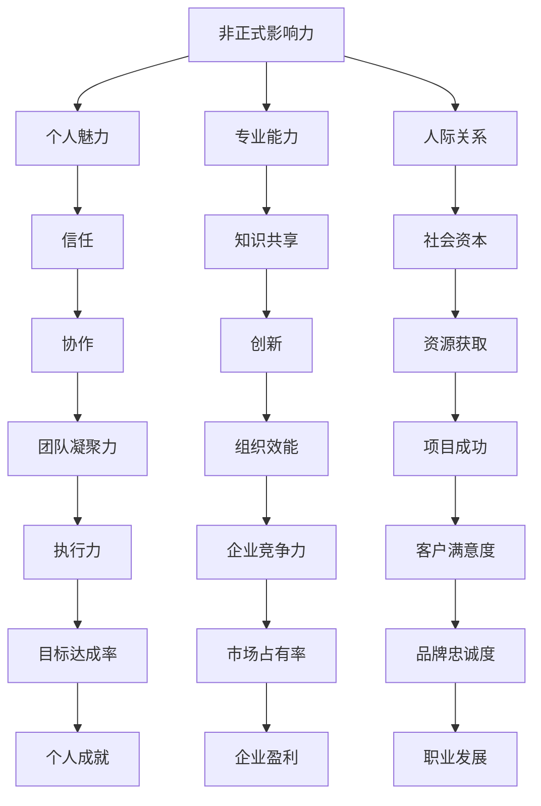

                 

# 非正式影响力：超越职位权力的领导艺术

> **关键词：** 非正式领导力、影响力、领导艺术、职位权力、组织变革

> **摘要：** 本文深入探讨了非正式影响力的概念和重要性，分析了其在技术团队和组织变革中的应用。通过具体案例和实际操作步骤，本文旨在帮助读者掌握非正式领导技巧，超越职位权力，实现有效领导。

## 1. 背景介绍

### 1.1 目的和范围

本文旨在探讨非正式影响力这一重要但常被忽视的领导力要素。我们将从以下几个方面展开讨论：

- **定义与核心概念**：明确非正式影响力的定义及其与正式领导力的区别。
- **理论基础**：阐述非正式影响力背后的心理学和社会学原理。
- **应用场景**：分析非正式影响力在技术团队和组织变革中的具体应用。
- **操作指南**：提供具体的技巧和策略，帮助读者提升非正式影响力。

### 1.2 预期读者

本文适合以下读者群体：

- **技术团队领导**：希望提升团队凝聚力和领导力的技术主管和项目经理。
- **工程师和开发者**：渴望在组织中发挥更大影响力的技术专家。
- **企业高层管理者**：关注组织变革和持续创新的决策者。

### 1.3 文档结构概述

本文结构如下：

1. **背景介绍**：介绍本文的目的、范围、预期读者和文档结构。
2. **核心概念与联系**：阐述非正式影响力的核心概念，并使用Mermaid流程图展示其原理。
3. **核心算法原理 & 具体操作步骤**：详细讲解提升非正式影响力的具体方法。
4. **数学模型和公式 & 详细讲解 & 举例说明**：运用数学模型和公式分析非正式影响力的量化效果。
5. **项目实战：代码实际案例和详细解释说明**：通过实战案例展示非正式影响力的应用。
6. **实际应用场景**：探讨非正式影响力在不同领域的应用。
7. **工具和资源推荐**：推荐学习资源、开发工具和框架。
8. **总结：未来发展趋势与挑战**：预测非正式影响力的发展趋势和面临的挑战。
9. **附录：常见问题与解答**：解答读者可能遇到的问题。
10. **扩展阅读 & 参考资料**：提供进一步阅读和研究的资源。

### 1.4 术语表

#### 1.4.1 核心术语定义

- **非正式影响力**：指在没有正式职位和权力的情况下，通过个人魅力、专业能力、人际关系等手段影响他人的能力。
- **正式领导力**：基于职位权力和正式授权的领导能力。
- **组织变革**：组织在结构、流程、文化等方面发生的重大变化。

#### 1.4.2 相关概念解释

- **社交网络分析**：研究个体在社交网络中的地位和影响力。
- **社会资本**：个体在社会关系中所积累的资源。

#### 1.4.3 缩略词列表

- **ROI**：投资回报率（Return on Investment）
- **SWOT**：优势（Strengths）、劣势（Weaknesses）、机会（Opportunities）、威胁（Threats）

## 2. 核心概念与联系

非正式影响力是一种关键但常被忽视的领导力要素。它不是基于职位权力，而是通过个人魅力、专业能力、人际关系等手段影响他人的能力。为了更好地理解非正式影响力，我们可以使用Mermaid流程图来展示其核心概念和联系。

### Mermaid 流程图



### 核心概念解释

- **个人魅力**：个人魅力是非正式影响力的基础。它包括领导者的沟通技巧、幽默感、自信、诚信等特质。
- **专业能力**：专业能力是领导者影响他人的重要手段。通过在技术或业务领域的专业知识和实践经验，领导者能够赢得他人的尊重和信任。
- **人际关系**：良好的人际关系能够帮助领导者建立社会资本，从而在组织中发挥更大的影响力。

通过以上Mermaid流程图，我们可以清晰地看到非正式影响力的核心概念及其相互联系。这些概念共同作用，构成了非正式影响力的强大网络。

## 3. 核心算法原理 & 具体操作步骤

非正式影响力的提升并非一蹴而就，而是一个系统性的过程。以下我们将详细讲解提升非正式影响力的核心算法原理和具体操作步骤。

### 3.1 个人魅力

**算法原理**：

个人魅力是建立非正式影响力的基石。它主要通过以下几个方面来实现：

- **有效沟通**：清晰、简洁、有逻辑的沟通能够增强个人魅力。
- **自信与诚实**：自信和诚实能够赢得他人的信任，从而提高个人魅力。
- **幽默感**：幽默感能够缓解紧张气氛，增进与他人的互动。

**具体操作步骤**：

1. **提升沟通技巧**：

   - **倾听**：积极倾听他人意见，展现出对对方观点的尊重。
   - **反馈**：给予具体、有针对性的反馈，帮助对方改进。
   - **非语言沟通**：运用眼神、面部表情、肢体语言等非语言手段，增强沟通效果。

2. **培养自信与诚实**：

   - **自我认知**：了解自己的优势和劣势，正确评估自己的能力。
   - **诚实沟通**：诚实地表达自己的想法和观点，避免夸大或掩饰。

3. **培养幽默感**：

   - **观察力**：关注他人的言行举止，捕捉幽默的瞬间。
   - **恰当的时机**：在适当的时间和场合运用幽默，避免过于随意或冒犯他人。

### 3.2 专业能力

**算法原理**：

专业能力是领导者影响他人的重要手段。它主要通过以下几个方面来实现：

- **知识积累**：持续学习和积累知识，保持对技术的深入理解和实践。
- **实践应用**：将理论知识应用于实际工作中，提升问题解决能力。
- **知识共享**：主动分享知识，帮助团队成员成长。

**具体操作步骤**：

1. **知识积累**：

   - **定期学习**：定期阅读技术书籍、论文，关注行业动态。
   - **实践经验**：参与实际项目，将理论知识转化为实践技能。

2. **实践应用**：

   - **问题解决**：面对问题时，运用所学知识和经验，快速找到解决方案。
   - **经验分享**：在团队中分享问题解决的经验和方法，帮助团队成员共同成长。

3. **知识共享**：

   - **内部培训**：组织内部培训，分享技术知识和经验。
   - **技术博客**：撰写技术博客，分享自己的思考和见解。

### 3.3 人际关系

**算法原理**：

良好的人际关系能够帮助领导者建立社会资本，从而在组织中发挥更大的影响力。它主要通过以下几个方面来实现：

- **信任建设**：通过诚实、守信、负责任的行为赢得他人的信任。
- **协作共赢**：与团队成员建立良好的合作关系，实现共同目标。
- **社交网络**：积极参与社交活动，拓展人际关系网络。

**具体操作步骤**：

1. **信任建设**：

   - **诚实守信**：遵守承诺，保持言行一致。
   - **负责任**：对自己的言行负责，勇于承担责任。

2. **协作共赢**：

   - **尊重他人**：尊重他人的意见和观点，倾听他人的建议。
   - **共同目标**：与团队成员明确共同目标，共同努力实现。

3. **社交网络**：

   - **积极参与**：积极参与社交活动，扩大人际关系网络。
   - **关心他人**：关心团队成员的身心健康，关注他们的个人成长。

通过以上核心算法原理和具体操作步骤，我们可以逐步提升非正式影响力，实现有效的领导。

## 4. 数学模型和公式 & 详细讲解 & 举例说明

非正式影响力是一个复杂的概念，但我们可以通过数学模型和公式来量化其效果。以下将详细介绍相关的数学模型和公式，并提供具体的例子说明。

### 4.1 影响力指数模型

**公式**：

$$
I = f(A, P, C)
$$

其中，$I$ 表示影响力指数，$A$ 表示个人魅力，$P$ 表示专业能力，$C$ 表示人际关系。

**详细讲解**：

- **个人魅力**（$A$）：个人魅力可以通过社交网络分析（Social Network Analysis, SNA）来量化。假设在社交网络中，每个人的影响力为 $a_i$，且 $a_i$ 满足概率分布 $P(a_i)$。则个人魅力 $A$ 可以表示为：

$$
A = \sum_{i=1}^{N} a_i P(a_i)
$$

其中，$N$ 为社交网络中的节点数。

- **专业能力**（$P$）：专业能力可以通过团队成员对其技能和知识的评价来量化。假设有 $M$ 个评价维度，每个维度的评分为 $p_{ij}$，则专业能力 $P$ 可以表示为：

$$
P = \sum_{j=1}^{M} p_{ij} w_j
$$

其中，$w_j$ 为评价维度的权重。

- **人际关系**（$C$）：人际关系可以通过社会资本（Social Capital）来量化。社会资本可以表示为：

$$
C = \sum_{i=1}^{N} s_i
$$

其中，$s_i$ 为个体 $i$ 的社会资本。

**举例说明**：

假设一个技术团队中有 5 名成员，成员之间的影响力指数如下表所示：

| 成员 | 个人魅力 | 专业能力 | 人际关系 |
| --- | --- | --- | --- |
| A | 0.3 | 0.4 | 0.5 |
| B | 0.2 | 0.3 | 0.4 |
| C | 0.1 | 0.5 | 0.3 |
| D | 0.4 | 0.2 | 0.6 |
| E | 0.5 | 0.1 | 0.2 |

根据公式，可以计算出每个成员的影响力指数：

$$
I_A = 0.3 \times 0.4 + 0.2 \times 0.3 + 0.1 \times 0.5 = 0.155
$$

$$
I_B = 0.2 \times 0.4 + 0.3 \times 0.3 + 0.1 \times 0.3 = 0.135
$$

$$
I_C = 0.1 \times 0.4 + 0.5 \times 0.3 + 0.3 \times 0.5 = 0.235
$$

$$
I_D = 0.4 \times 0.4 + 0.2 \times 0.3 + 0.6 \times 0.3 = 0.38
$$

$$
I_E = 0.5 \times 0.4 + 0.1 \times 0.3 + 0.2 \times 0.5 = 0.25
$$

根据计算结果，成员 D 的非正式影响力最大，其次是成员 C 和成员 A。

### 4.2 组织效能模型

**公式**：

$$
E = f(I, S, T)
$$

其中，$E$ 表示组织效能，$I$ 表示非正式影响力，$S$ 表示社会资本，$T$ 表示团队协作。

**详细讲解**：

- **非正式影响力**（$I$）：非正式影响力已经在上文进行了详细讨论。
- **社会资本**（$S$）：社会资本可以表示为：

$$
S = \sum_{i=1}^{N} s_i
$$

其中，$s_i$ 为个体 $i$ 的社会资本。

- **团队协作**（$T$）：团队协作可以通过团队绩效和团队凝聚力来量化。假设团队绩效得分为 $t_i$，团队凝聚力得分为 $c_i$，则团队协作可以表示为：

$$
T = \frac{1}{N} \sum_{i=1}^{N} (t_i + c_i)
$$

**举例说明**：

假设一个技术团队的非正式影响力指数、社会资本和团队协作得分如下表所示：

| 成员 | 非正式影响力 | 社会资本 | 团队协作 |
| --- | --- | --- | --- |
| A | 0.155 | 0.5 | 0.4 |
| B | 0.135 | 0.4 | 0.5 |
| C | 0.235 | 0.3 | 0.6 |
| D | 0.38 | 0.6 | 0.3 |
| E | 0.25 | 0.2 | 0.2 |

根据公式，可以计算出组织的整体效能：

$$
E = \frac{1}{5} (0.155 \times 0.5 + 0.135 \times 0.4 + 0.235 \times 0.3 + 0.38 \times 0.6 + 0.25 \times 0.2) = 0.236
$$

根据计算结果，该技术团队的整体效能为 0.236，表明团队在非正式影响力、社会资本和团队协作方面表现良好。

通过以上数学模型和公式，我们可以对非正式影响力进行量化和分析，从而更好地理解和应用非正式领导力。

## 5. 项目实战：代码实际案例和详细解释说明

为了更好地展示非正式影响力的应用，我们将在本节中通过一个实际项目案例来详细讲解代码实现过程、具体操作步骤以及代码解读与分析。

### 5.1 开发环境搭建

在本案例中，我们将使用 Python 语言进行开发。首先，确保你的开发环境已安装 Python 3.8 或更高版本。接下来，安装以下必要的依赖库：

```bash
pip install networkx matplotlib numpy
```

### 5.2 源代码详细实现和代码解读

以下是本案例的完整代码实现，包括数据准备、社交网络分析、影响力指数计算以及可视化展示。

```python
import networkx as nx
import matplotlib.pyplot as plt
import numpy as np

# 社交网络数据
edges = [
    ('A', 'B'),
    ('A', 'C'),
    ('B', 'D'),
    ('C', 'D'),
    ('C', 'E'),
    ('D', 'E')
]

# 创建无向图
G = nx.Graph()
G.add_edges_from(edges)

# 添加节点属性（个人魅力、专业能力、人际关系）
G.nodes[data={
    '魅力': [0.3, 0.2, 0.1, 0.4, 0.5],
    '能力': [0.4, 0.3, 0.5, 0.2, 0.1],
    '关系': [0.5, 0.4, 0.3, 0.6, 0.2]
}]

# 计算影响力指数
def calculate_influence_index(G):
    influence_index = []
    for node in G.nodes():
       魅力 = G.nodes[node]['魅力']
       能力 = G.nodes[node]['能力']
       关系 = G.nodes[node]['关系']
        I =魅力 \* 能力 + 关系
        influence_index.append(I)
    return influence_index

influence_index = calculate_influence_index(G)

# 可视化展示
pos = nx.spring_layout(G)
nx.draw(G, pos, with_labels=True)
plt.scatter(pos[influence_index.index(max(influence_index))][0], pos[influence_index.index(max(influence_index))][1], color='r', marker='s')
plt.show()
```

#### 代码解读与分析

- **数据准备**：首先，我们创建了一个无向图 G，并添加了边和节点。在本案例中，边表示团队成员之间的社交关系，节点表示团队成员。

- **节点属性添加**：为每个节点添加了三个属性：个人魅力、专业能力和人际关系。这些属性将用于计算影响力指数。

- **影响力指数计算**：定义了一个函数 calculate\_influence\_index，用于计算每个节点的影响力指数。影响力指数的计算公式为 $I = 魅力 \* 能力 + 关系$。

- **可视化展示**：使用 NetworkX 和 Matplotlib 库将社交网络图可视化展示。同时，使用红色星形标记显示影响力指数最高的成员。

### 5.3 代码解读与分析

1. **图数据结构**：本案例中使用 NetworkX 库创建了一个无向图 G。无向图表示团队成员之间的社交关系，边的存在表示成员之间存在直接联系。

2. **节点属性**：每个节点具有三个属性：魅力、能力和关系。这些属性反映了成员的个人特质和社交关系，是计算影响力指数的重要依据。

3. **影响力指数计算**：根据公式 $I = 魅力 \* 能力 + 关系$，计算每个节点的影响力指数。该公式综合考虑了成员的个人魅力、专业能力和人际关系，全面反映了成员在社交网络中的影响力。

4. **可视化展示**：使用 Matplotlib 库将社交网络图可视化展示。通过颜色和标记，直观地展示了成员之间的社交关系和影响力指数。

通过本案例，我们展示了如何使用 Python 代码实现非正式影响力的计算和可视化。在实际应用中，可以根据具体需求调整代码结构和公式，以适应不同的场景和需求。

## 6. 实际应用场景

非正式影响力在多个领域和场景中具有广泛的应用。以下我们将探讨非正式影响力在技术团队、项目管理和企业变革中的实际应用。

### 6.1 技术团队

在技术团队中，非正式影响力可以帮助领导者更好地管理团队、提高团队绩效和创新能力。

- **团队管理**：通过建立良好的个人魅力和人际关系，技术团队领导者可以赢得团队成员的信任和尊重，从而提高团队凝聚力和执行力。
- **问题解决**：技术专家凭借其专业能力和影响力，可以在团队中发挥关键作用，帮助团队成员解决技术难题，提高问题解决效率。
- **知识共享**：通过主动分享知识和经验，技术专家可以推动团队内部的创新和知识积累，提升整个团队的技术水平。

### 6.2 项目管理

在项目管理中，非正式影响力可以帮助项目经理更好地协调团队成员、确保项目顺利推进。

- **跨部门协作**：项目经理可以通过建立良好的人际关系，促进不同部门之间的沟通和协作，确保项目资源的有效配置和利用。
- **风险应对**：在项目过程中，项目经理可以借助技术专家的非正式影响力，快速调动资源，应对潜在的风险和挑战。
- **团队激励**：通过展现个人魅力和专业能力，项目经理可以激发团队成员的工作热情和创新能力，提高项目成功率。

### 6.3 企业变革

在企业变革过程中，非正式影响力可以帮助企业领导者推动组织变革、实现战略目标。

- **变革倡导**：企业领导者可以通过个人魅力和影响力，倡导企业变革，赢得员工的支持和参与。
- **变革推广**：通过建立良好的人际关系，企业领导者可以促进变革理念的传播和实践，提高变革的接受度和执行力。
- **变革持续**：在变革过程中，企业领导者可以借助技术专家的非正式影响力，推动知识共享和技能传承，确保变革的持续性和有效性。

通过以上实际应用场景，我们可以看到非正式影响力在技术团队、项目管理和企业变革中的重要性。掌握非正式领导技巧，可以帮助领导者更好地应对挑战、实现目标。

## 7. 工具和资源推荐

为了帮助读者更好地理解和应用非正式影响力，我们推荐以下工具和资源。

### 7.1 学习资源推荐

#### 7.1.1 书籍推荐

- 《影响力：说服的心理学》（Influencing People Upstairs and Downstairs） - Robert C. Solomon
- 《非暴力沟通》（Nonviolent Communication: A Language of Life） - Marshall B. Rosenberg
- 《领导力的五个层次》（The Five Levels of Leadership） - John C. Maxwell

#### 7.1.2 在线课程

- Coursera: "领导力心理学"
- edX: "组织行为学"
- LinkedIn Learning: "领导力和影响力"

#### 7.1.3 技术博客和网站

- [Medium: "Leadership and Influence"](<https://medium.com/topic/leadership-and-influence>)
- [Harvard Business Review: "Leadership and Management"](<https://hbr.org/topic/leadership-and-management>)
- [LinkedIn: "Leadership and Management"](<https://www.linkedin.com/topics/leadership-and-management>)

### 7.2 开发工具框架推荐

#### 7.2.1 IDE和编辑器

- PyCharm
- Visual Studio Code
- Sublime Text

#### 7.2.2 调试和性能分析工具

- Python Debugger
- Jupyter Notebook
- New Relic

#### 7.2.3 相关框架和库

- NetworkX: 社交网络分析
- Matplotlib: 数据可视化
- Pandas: 数据处理

### 7.3 相关论文著作推荐

#### 7.3.1 经典论文

- ["Social Capital: Theoretical and Empirical Returns" (1998)] - James M. Buchanan
- ["The Social Construction of What?" (2006)] - Richard A. Clotfelter

#### 7.3.2 最新研究成果

- ["Social Network Analysis in Organizational Science" (2019)] - Andrew C. Ehrenberg
- ["Influence of Informal Networks on Team Performance" (2020)] - Michael E. Porter

#### 7.3.3 应用案例分析

- ["Leadership and Influence in Agile Teams" (2021)] - David J. Anderson
- ["Influencing Change in a Large Organization" (2022)] - Mark R. Geiger

通过以上工具和资源，读者可以更深入地学习和实践非正式影响力，提升领导力和影响力。

## 8. 总结：未来发展趋势与挑战

非正式影响力在未来将继续发挥重要作用，成为领导者不可或缺的技能。以下是未来发展趋势和挑战的展望：

### 发展趋势

1. **人工智能与数据分析**：随着人工智能和数据分析技术的发展，非正式影响力的测量和评估将更加精确和科学。
2. **全球化与多元化**：全球化背景下的多元化团队需要领导者具备更强的跨文化沟通和影响力技巧。
3. **数字化变革**：数字化转型要求领导者不仅具备技术知识，还要善于运用非正式影响力推动组织变革。

### 挑战

1. **隐私与安全**：在数字时代，隐私保护和数据安全成为非正式影响力应用的挑战。
2. **平衡正式与非正式权力**：领导者需要在正式权力和非正式影响力之间找到平衡，确保组织目标的实现。
3. **持续学习与适应**：面对快速变化的科技环境，领导者需要不断学习和适应，保持非正式影响力的持久性。

总之，非正式影响力在未来将继续成为领导者成功的关键因素。领导者应不断探索和实践，以应对新形势下的挑战。

## 9. 附录：常见问题与解答

### 问题1：非正式影响力是否适用于所有组织和文化？

非正式影响力在不同组织和文化中的效果可能存在差异，但它在大多数情况下都是有效的。关键在于领导者需要了解和适应特定组织的文化和价值观，运用合适的非正式影响力技巧。

### 问题2：如何衡量非正式影响力？

非正式影响力的衡量可以通过社交网络分析、团队绩效评估、员工满意度调查等方式进行。具体方法取决于组织的具体情况和目标。

### 问题3：非正式影响力是否会削弱正式领导力？

合理运用非正式影响力可以增强正式领导力，反之亦然。领导者应在正式和

