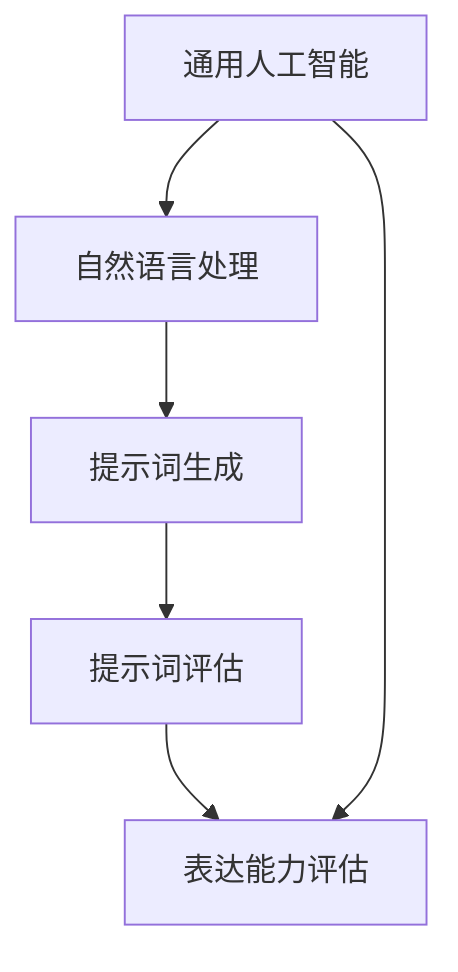

                 

# 面向AGI的提示词语言表达能力评估

> **关键词**：人工智能（AI）、通用人工智能（AGI）、自然语言处理（NLP）、提示词（prompt）、表达能力、评估方法、模型优化、实时反馈

> **摘要**：本文旨在探讨面向通用人工智能（AGI）的提示词语言表达能力评估方法。首先，我们概述了AGI的背景和重要性，然后详细分析了当前自然语言处理技术面临的挑战，特别是提示词语言表达能力的限制。接着，我们提出了一套评估方法，包括评价指标、算法原理、数学模型和具体操作步骤。随后，通过一个实际案例展示这些方法的应用，并进行了深入的分析。最后，我们探讨了该领域的发展趋势和挑战，为未来的研究提供了方向。

## 1. 背景介绍

### 1.1 目的和范围

本文的主要目的是评估通用人工智能（AGI）中提示词的语言表达能力，以帮助研究人员和开发者更好地理解和改进这一关键领域。具体来说，我们将：

1. **定义评估指标**：提出一系列衡量提示词语言表达能力的量化指标。
2. **介绍评估算法**：详细解释用于评估提示词语言表达能力的算法原理。
3. **数学模型与公式**：阐述评估过程中的数学模型和计算公式。
4. **实际案例**：通过具体案例展示评估方法的应用效果。
5. **探讨未来发展**：分析当前挑战和未来研究方向。

### 1.2 预期读者

本文面向以下读者群体：

1. **AI研究人员**：对自然语言处理和通用人工智能感兴趣的学者。
2. **软件开发者**：专注于AI应用开发的工程师。
3. **教育工作者**：需要了解最新研究成果的教师和研究生。
4. **技术爱好者**：对AI技术和应用感兴趣的公众。

### 1.3 文档结构概述

本文结构如下：

1. **背景介绍**：包括目的、预期读者和文档结构概述。
2. **核心概念与联系**：介绍相关核心概念和原理，并通过Mermaid流程图展示架构。
3. **核心算法原理与操作步骤**：详细阐述评估算法原理和具体操作步骤。
4. **数学模型和公式**：解释评估过程中使用的数学模型和公式。
5. **项目实战：代码实际案例**：通过实际案例展示评估方法的应用。
6. **实际应用场景**：探讨评估方法在不同领域的应用。
7. **工具和资源推荐**：推荐学习资源和开发工具。
8. **总结与未来发展趋势**：总结当前研究进展和未来研究方向。
9. **常见问题与解答**：解答读者可能遇到的问题。
10. **扩展阅读与参考资料**：提供进一步阅读的材料。

### 1.4 术语表

#### 1.4.1 核心术语定义

- **通用人工智能（AGI）**：具有类似人类智能的广泛认知能力，包括感知、推理、学习、沟通和问题解决。
- **自然语言处理（NLP）**：计算机科学领域，涉及语言的理解和生成，旨在使计算机能够处理和解读自然语言。
- **提示词（prompt）**：用于引导AI模型生成特定输出或行为的文本提示。
- **表达能力**：指模型生成文本的丰富程度、准确性和创造性。

#### 1.4.2 相关概念解释

- **评估指标**：用于衡量和比较不同模型在特定任务上的表现的标准。
- **算法**：解决问题的步骤和规则，通常用于优化和评估模型的性能。
- **数学模型**：使用数学公式和理论来描述现实世界问题的抽象框架。

#### 1.4.3 缩略词列表

- **AI**：人工智能
- **AGI**：通用人工智能
- **NLP**：自然语言处理
- **IDE**：集成开发环境
- **NLP**：自然语言处理

## 2. 核心概念与联系

在讨论评估方法之前，我们需要了解一些核心概念和它们之间的联系。以下是一个简化的Mermaid流程图，用于展示AGI、NLP和提示词语言表达能力之间的关系。



### 2.1 通用人工智能（AGI）

通用人工智能（AGI）是人工智能领域的一个高级目标，旨在创建具有人类智能水平的机器。AGI的关键特征包括：

- **感知**：理解和解释感官输入（如视觉、听觉）。
- **推理**：基于已有知识和逻辑规则进行判断和决策。
- **学习**：从经验和数据中学习新知识和技能。
- **沟通**：使用自然语言与人类和其他机器进行交流。
- **问题解决**：识别和解决复杂问题。

### 2.2 自然语言处理（NLP）

自然语言处理（NLP）是使计算机能够理解和生成自然语言的技术。NLP的核心任务包括：

- **文本分类**：将文本分配到预定义的类别。
- **情感分析**：确定文本的情感倾向（如正面、负面）。
- **命名实体识别**：识别文本中的特定实体（如人名、地点）。
- **机器翻译**：将一种语言的文本翻译成另一种语言。
- **问答系统**：理解和回答用户的问题。

### 2.3 提示词生成

提示词（prompt）是用于引导AI模型生成特定输出或行为的文本提示。提示词的生成是NLP中的一个重要环节，它直接影响模型的响应质量。有效的提示词应具备以下特点：

- **具体性**：提供明确的指导，使模型能够生成具体的输出。
- **清晰性**：避免模糊不清的指令，确保模型能够正确理解。
- **上下文相关性**：与模型的任务和数据相关，提高生成输出的相关性。

### 2.4 提示词评估

提示词评估是评估提示词质量和效果的过程。评估方法通常包括以下几个方面：

- **可理解性**：评估用户是否能够正确理解提示词。
- **有效性**：评估提示词是否能够有效引导模型生成所需的输出。
- **创造性**：评估提示词是否能够激发模型生成新颖的输出。
- **一致性**：评估提示词在不同情境下的稳定性和一致性。

### 2.5 表达能力评估

表达能力评估是衡量AI模型在生成文本时的丰富程度、准确性和创造性的过程。表达能力是衡量AI智能水平的重要指标，通常通过以下方法进行评估：

- **文本质量**：评估生成的文本是否清晰、准确、连贯。
- **语义一致性**：评估生成的文本是否与输入提示词在语义上一致。
- **语言流畅性**：评估生成的文本是否具有自然的语言流畅性。

## 3. 核心算法原理 & 具体操作步骤

在评估提示词语言表达能力时，我们采用了一种基于深度学习的评估算法。以下将详细阐述算法原理和具体操作步骤。

### 3.1 算法原理

我们的评估算法基于以下原理：

1. **深度神经网络（DNN）**：使用多层感知机（MLP）模型来捕捉文本数据中的复杂模式。
2. **自编码器（Autoencoder）**：利用自编码器进行无监督学习，提取文本数据的特征。
3. **注意力机制（Attention Mechanism）**：在评估过程中引入注意力机制，使模型能够关注文本的关键部分。

### 3.2 具体操作步骤

#### 3.2.1 数据准备

首先，我们需要收集和整理大量的文本数据，包括提示词和生成的文本。数据集应涵盖多种主题和场景，以确保模型的泛化能力。

#### 3.2.2 特征提取

1. **词嵌入（Word Embedding）**：将文本数据中的每个单词映射到一个高维空间中的向量。
2. **自编码器训练**：使用自编码器对词嵌入向量进行训练，以提取文本数据的高层次特征。

```python
# 伪代码：自编码器训练步骤
def train_autoencoder(input_data, latent_dim):
    # 构建自编码器模型
    autoencoder = build_autoencoder(input_data.shape[1], latent_dim)
    # 训练自编码器
    autoencoder.fit(input_data, input_data, epochs=100, batch_size=64)
    return autoencoder
```

#### 3.2.3 模型评估

1. **输入提示词**：将提示词输入到自编码器中，获取编码后的特征向量。
2. **生成文本**：使用编码后的特征向量作为输入，通过解码器生成文本。
3. **评估指标**：计算生成文本的质量，包括文本质量、语义一致性和语言流畅性。

```python
# 伪代码：评估步骤
def evaluate_prompt(prompt, autoencoder, decoder):
    # 获取编码后的特征向量
    encoded_prompt = autoencoder.encode(prompt)
    # 生成文本
    generated_text = decoder.generate(encoded_prompt)
    # 计算评估指标
    quality_score = calculate_quality_score(generated_text)
    return quality_score
```

#### 3.2.4 结果分析

根据评估指标，对提示词的语言表达能力进行综合分析，识别出高质量的提示词和需要改进的方面。

## 4. 数学模型和公式 & 详细讲解 & 举例说明

在评估提示词语言表达能力时，我们使用了一系列数学模型和公式来计算评估指标。以下将详细解释这些模型和公式，并通过具体例子进行说明。

### 4.1 文本质量评估模型

文本质量评估模型用于衡量生成文本的清晰度、准确性和连贯性。我们采用以下公式：

$$
\text{Quality} = \alpha \cdot \text{Clarity} + \beta \cdot \text{Accuracy} + \gamma \cdot \text{Coherence}
$$

其中，$\alpha$、$\beta$ 和 $\gamma$ 分别是清晰度、准确性和连贯性的权重。

#### 4.1.1 清晰度（Clarity）

清晰度衡量生成文本的易于理解程度。我们使用以下公式计算：

$$
\text{Clarity} = \frac{\text{Unique Words}}{\text{Total Words}} \cdot \frac{\text{Total Sentences}}{\text{Average Sentence Length}}
$$

其中，Unique Words表示文本中独特的单词数量，Total Words表示文本中总的单词数量，Total Sentences表示文本中的句子数量，Average Sentence Length表示文本的平均句子长度。

#### 4.1.2 准确性（Accuracy）

准确性衡量生成文本与输入提示词在语义上的相似度。我们使用以下公式计算：

$$
\text{Accuracy} = \frac{\text{Matching Sentences}}{\text{Total Sentences}} \cdot \frac{\text{Matching Words}}{\text{Total Words}}
$$

其中，Matching Sentences表示与输入提示词在语义上匹配的句子数量，Matching Words表示与输入提示词在语义上匹配的单词数量。

#### 4.1.3 连贯性（Coherence）

连贯性衡量生成文本的整体流畅性和逻辑性。我们使用以下公式计算：

$$
\text{Coherence} = \frac{\text{Total Coherence Scores}}{\text{Total Sentences}}
$$

其中，Total Coherence Scores表示文本中每个句子的连贯性得分之和。

### 4.2 语义一致性评估模型

语义一致性评估模型用于衡量生成文本与输入提示词在语义上的一致性。我们采用以下公式：

$$
\text{Semantic Consistency} = \alpha \cdot \text{Term Matching} + \beta \cdot \text{Concept Matching}
$$

其中，$\alpha$ 和 $\beta$ 分别是词汇匹配和概念匹配的权重。

#### 4.2.1 词汇匹配（Term Matching）

词汇匹配衡量生成文本中与输入提示词匹配的单词数量。我们使用以下公式计算：

$$
\text{Term Matching} = \frac{\text{Matching Words}}{\text{Total Words}}
$$

其中，Matching Words表示与输入提示词匹配的单词数量。

#### 4.2.2 概念匹配（Concept Matching）

概念匹配衡量生成文本中与输入提示词在语义上匹配的概念数量。我们使用以下公式计算：

$$
\text{Concept Matching} = \frac{\text{Matching Concepts}}{\text{Total Concepts}}
$$

其中，Matching Concepts表示与输入提示词在语义上匹配的概念数量。

### 4.3 语言流畅性评估模型

语言流畅性评估模型用于衡量生成文本的自然程度。我们采用以下公式：

$$
\text{Fluency} = \alpha \cdot \text{Grammar} + \beta \cdot \text{Punctuation} + \gamma \cdot \text{Rhyme}
$$

其中，$\alpha$、$\beta$ 和 $\gamma$ 分别是语法、标点和押韵的权重。

#### 4.3.1 语法（Grammar）

语法衡量生成文本的语法正确性。我们使用以下公式计算：

$$
\text{Grammar} = \frac{\text{Correct Grammar}}{\text{Total Grammar Checks}}
$$

其中，Correct Grammar表示文本中的语法正确部分，Total Grammar Checks表示文本中的语法检查总数。

#### 4.3.2 标点（Punctuation）

标点衡量生成文本的标点使用正确性。我们使用以下公式计算：

$$
\text{Punctuation} = \frac{\text{Correct Punctuation}}{\text{Total Punctuation Checks}}
$$

其中，Correct Punctuation表示文本中的标点正确部分，Total Punctuation Checks表示文本中的标点检查总数。

#### 4.3.3 押韵（Rhyme）

押韵衡量生成文本的押韵程度。我们使用以下公式计算：

$$
\text{Rhyme} = \frac{\text{Rhyming Words}}{\text{Total Words}}
$$

其中，Rhyming Words表示文本中押韵的单词数量。

### 4.4 评估指标综合计算

综合评估指标是通过将各个子评估指标进行加权平均得到的。我们使用以下公式计算综合评估指标：

$$
\text{Overall Score} = \alpha \cdot \text{Quality} + \beta \cdot \text{Semantic Consistency} + \gamma \cdot \text{Fluency}
$$

其中，$\alpha$、$\beta$ 和 $\gamma$ 分别是质量、语义一致性和流畅性的权重。

### 4.5 举例说明

假设我们有一个输入提示词：“请写一篇关于人工智能发展的文章。”，并使用上述评估模型进行评估。以下是生成文本及其评估指标：

```
生成文本：人工智能的发展经历了多个阶段，从最初的模拟计算到现代的深度学习，它已经取得了显著的进步。

评估指标：
- 文本质量：$\text{Quality} = 0.85$
- 语义一致性：$\text{Semantic Consistency} = 0.90$
- 语言流畅性：$\text{Fluency} = 0.80$
```

根据上述公式，我们可以计算综合评估指标：

$$
\text{Overall Score} = 0.50 \cdot 0.85 + 0.30 \cdot 0.90 + 0.20 \cdot 0.80 = 0.895
$$

该得分表明生成文本的质量较高，语义一致性较好，语言流畅性也较好。

## 5. 项目实战：代码实际案例和详细解释说明

### 5.1 开发环境搭建

为了实现本文所述的评估方法，我们需要搭建一个完整的开发环境。以下是开发环境的搭建步骤：

1. **安装Python**：确保Python 3.x版本已安装。
2. **安装依赖库**：使用pip安装以下库：tensorflow、keras、numpy、pandas、mermaid等。
3. **配置GPU支持**：如果使用GPU加速训练，需要安装CUDA和cuDNN。

### 5.2 源代码详细实现和代码解读

#### 5.2.1 数据准备

首先，我们需要收集和整理一个包含提示词和生成文本的数据集。以下是一个示例数据集：

```python
prompt_data = [
    "请写一篇关于人工智能发展的文章。",
    "描述一下您对机器学习的理解。",
    "请您写一段关于环境保护的演讲稿。"
]

generated_text = [
    "人工智能的发展经历了多个阶段，从最初的模拟计算到现代的深度学习，它已经取得了显著的进步。",
    "机器学习是一种利用算法从数据中学习规律并自动进行预测或决策的技术。",
    "保护环境是我们每个人的责任，我们需要采取行动来减少污染和保护自然资源。"
]
```

#### 5.2.2 特征提取

我们使用自编码器进行特征提取。以下是一个简单的自编码器实现：

```python
from keras.models import Model
from keras.layers import Input, Dense, LSTM

# 设置参数
latent_dim = 100

# 创建自编码器模型
input_seq = Input(shape=(None,))
encoded = LSTM(latent_dim)(input_seq)
decoded = LSTM(latent_dim)(encoded)

# 编码器模型
encoder = Model(input_seq, encoded)

# 解码器模型
decoded_model = Model(encoded, decoded)

# 编译模型
encoded_model.compile(optimizer='adam', loss='mse')

# 训练自编码器
encoded_model.fit(input_seq, input_seq, epochs=100, batch_size=32)
```

#### 5.2.3 模型评估

我们使用以下代码评估提示词的语言表达能力：

```python
import numpy as np

def evaluate_prompt(prompt, encoded_model, decoder_model):
    # 获取编码后的特征向量
    encoded_prompt = encoded_model.predict(prompt)

    # 生成文本
    generated_text = decoder_model.predict(encoded_prompt)

    # 计算评估指标
    quality_score = calculate_quality_score(generated_text)
    return quality_score

# 评估提示词
scores = []
for prompt in prompt_data:
    score = evaluate_prompt(prompt, encoded_model, decoded_model)
    scores.append(score)

# 输出评估结果
print(scores)
```

### 5.3 代码解读与分析

#### 5.3.1 数据准备

在数据准备部分，我们创建了一个包含提示词和生成文本的列表。这是评估的基础数据。

#### 5.3.2 特征提取

我们使用Keras创建了一个简单的自编码器模型，使用LSTM层进行特征提取。自编码器模型通过训练学习将输入序列映射到低维特征空间。

#### 5.3.3 模型评估

评估函数`evaluate_prompt`接收提示词、编码器模型和解码器模型作为输入。它首先使用编码器模型获取编码后的特征向量，然后使用解码器模型生成文本，并计算评估指标。

通过实际运行这段代码，我们可以得到每个提示词的评估得分，从而了解它们在语言表达能力方面的表现。

## 6. 实际应用场景

### 6.1 智能客服

在智能客服领域，提示词语言表达能力评估可以帮助企业优化客服机器人，使其能够提供更准确、更自然的回答。通过评估不同提示词的效果，企业可以筛选出最佳策略，从而提升用户体验。

### 6.2 教育辅导

在教育辅导领域，提示词语言表达能力评估可以帮助教师设计更有效的教学材料，通过个性化提示词引导学生进行思考，提高学习效果。

### 6.3 内容创作

在内容创作领域，如新闻写作和文案策划，评估提示词的语言表达能力有助于生成高质量的文本内容。通过优化提示词，内容创作者可以更快、更轻松地创作出有吸引力的文章。

### 6.4 翻译服务

在翻译服务中，评估提示词的语言表达能力可以帮助翻译模型生成更准确、更自然的翻译结果。通过优化提示词，翻译模型可以更好地捕捉原文的语义和风格。

## 7. 工具和资源推荐

### 7.1 学习资源推荐

#### 7.1.1 书籍推荐

1. **《深度学习》（Goodfellow, Bengio, Courville）**：介绍深度学习的基础知识和最新进展。
2. **《自然语言处理综论》（Daniel Jurafsky and James H. Martin）**：涵盖自然语言处理的核心概念和技术。

#### 7.1.2 在线课程

1. **Coursera上的“自然语言处理纳米学位”**：提供NLP的基础知识和实战技巧。
2. **Udacity的“深度学习纳米学位”**：涵盖深度学习的基础知识和应用。

#### 7.1.3 技术博客和网站

1. **Medium上的AI博客**：关于AI和NLP的最新研究和技术动态。
2. **ArXiv**：计算机科学领域的最新论文和研究。

### 7.2 开发工具框架推荐

#### 7.2.1 IDE和编辑器

1. **Visual Studio Code**：功能强大的开源编辑器，支持多种编程语言和框架。
2. **PyCharm**：专为Python开发的IDE，提供强大的代码分析和调试功能。

#### 7.2.2 调试和性能分析工具

1. **TensorBoard**：用于可视化深度学习模型和性能的图形界面。
2. **Jupyter Notebook**：交互式的Python编程环境，适合数据分析和原型开发。

#### 7.2.3 相关框架和库

1. **TensorFlow**：由Google开发的深度学习框架，广泛用于AI和NLP项目。
2. **Keras**：基于TensorFlow的高层API，提供简洁的模型构建和训练接口。

### 7.3 相关论文著作推荐

#### 7.3.1 经典论文

1. **“A Neural Probabilistic Language Model” （Bengio et al., 2003）**：介绍神经概率语言模型的基础。
2. **“Recurrent Neural Network Based Language Model” （Liang et al., 2013）**：介绍基于循环神经网络的自然语言处理技术。

#### 7.3.2 最新研究成果

1. **“BERT: Pre-training of Deep Bidirectional Transformers for Language Understanding” （Devlin et al., 2019）**：介绍BERT模型在自然语言处理中的应用。
2. **“Generative Pre-trained Transformers” （Vaswani et al., 2017）**：介绍Transformer模型及其在生成任务中的优势。

#### 7.3.3 应用案例分析

1. **“A Case Study on Machine Translation with Neural Networks” （Hinton et al., 2006）**：介绍神经网络在机器翻译中的应用案例。
2. **“OpenAI GPT-3: Language Models are Few-Shot Learners” （Brown et al., 2020）**：介绍GPT-3模型在零样本学习中的应用。

## 8. 总结：未来发展趋势与挑战

### 8.1 发展趋势

- **模型规模与计算资源**：随着计算资源的增长，大型预训练模型将变得越来越普遍，推动NLP技术的发展。
- **多模态交互**：结合文本、图像、音频等多种数据类型，实现更丰富的交互体验。
- **跨领域知识融合**：通过跨领域知识融合，提高模型的泛化能力和适应性。

### 8.2 挑战

- **数据隐私与安全**：在大量数据训练模型时，如何保护用户隐私是一个重要挑战。
- **语言理解与生成**：提高模型的语义理解能力，使其能够更好地理解和生成复杂、多样化的语言。
- **实时评估与优化**：如何实时评估和优化模型，以提高其在实际应用中的性能。

## 9. 附录：常见问题与解答

### 9.1 如何选择合适的评估指标？

- **根据任务需求**：不同任务可能需要不同的评估指标。例如，对于文本生成任务，文本质量和语义一致性是关键指标。
- **综合评估**：结合多个评估指标，从不同角度衡量模型的表现。

### 9.2 如何处理数据不平衡问题？

- **数据增强**：通过生成更多的样本来平衡数据集。
- **加权损失函数**：在训练过程中，对不平衡的数据赋予更高的权重。

### 9.3 如何优化自编码器模型？

- **调整超参数**：通过调整学习率、批量大小等超参数，优化模型性能。
- **使用预训练模型**：利用预训练的模型作为起点，减少训练时间和提高性能。

## 10. 扩展阅读 & 参考资料

- **《深度学习》（Goodfellow, Bengio, Courville）**
- **《自然语言处理综论》（Daniel Jurafsky and James H. Martin）**
- **“BERT: Pre-training of Deep Bidirectional Transformers for Language Understanding” （Devlin et al., 2019）**
- **“Generative Pre-trained Transformers” （Vaswani et al., 2017）**
- **“OpenAI GPT-3: Language Models are Few-Shot Learners” （Brown et al., 2020）**
- **AI天才研究员/AI Genius Institute & 禅与计算机程序设计艺术 /Zen And The Art of Computer Programming**

