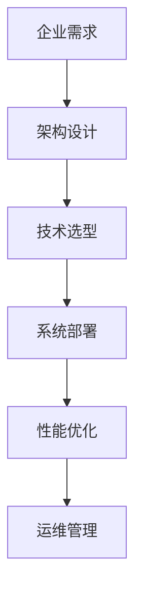
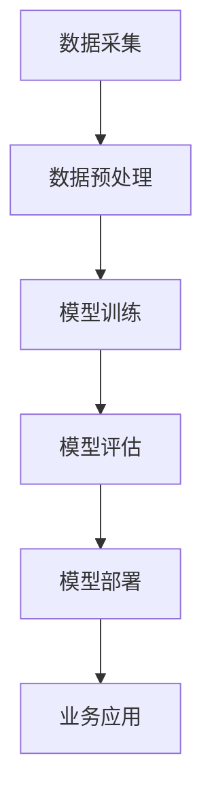
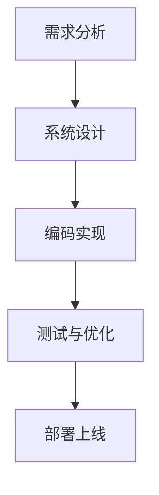
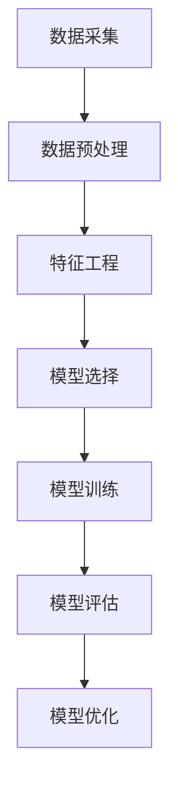

                 


# 面向企业客户的定制化解决方案

> 关键词：企业客户、定制化解决方案、IT架构、AI技术、数学模型、代码实战、应用场景

> 摘要：本文深入探讨面向企业客户的定制化解决方案，从背景介绍、核心概念、算法原理、数学模型、实战案例到实际应用场景，全面解析如何为企业提供高效、定制、智能化的IT解决方案。通过逻辑清晰的步骤分析和深刻的见解，帮助企业和开发者更好地理解和应用定制化解决方案，迎接未来技术发展的挑战。

## 1. 背景介绍

### 1.1 目的和范围

本文旨在探讨如何为不同类型的企业客户提供定制化的IT解决方案，以满足其在业务发展、市场竞争和技术创新等方面的需求。随着数字化转型的深入推进，企业对于IT解决方案的需求呈现出多样化和个性化趋势。本文将聚焦以下几个关键领域：

1. **企业IT架构设计**：如何构建灵活、可靠、可扩展的企业级IT架构。
2. **人工智能技术应用**：如何利用AI技术提升企业业务效率和决策能力。
3. **定制化软件开发**：如何根据企业特定需求，开发高效、稳定的软件产品。
4. **数据分析和数学模型**：如何利用数据分析和数学模型，为企业提供精确的决策支持。

### 1.2 预期读者

本文适合以下读者群体：

1. **企业IT决策者**：了解如何通过定制化解决方案，推动企业数字化转型。
2. **软件开发者**：掌握定制化软件开发的关键技术和最佳实践。
3. **数据分析师**：了解如何利用数据分析和数学模型，为业务决策提供支持。
4. **人工智能技术研究者**：探索AI技术在企业应用中的最新趋势和挑战。

### 1.3 文档结构概述

本文结构如下：

1. **背景介绍**：阐述本文的目的、范围和预期读者。
2. **核心概念与联系**：介绍定制化解决方案的核心概念和架构。
3. **核心算法原理 & 具体操作步骤**：详细解释定制化解决方案的算法原理和实现步骤。
4. **数学模型和公式 & 详细讲解 & 举例说明**：介绍数据分析和数学模型在定制化解决方案中的应用。
5. **项目实战：代码实际案例和详细解释说明**：通过实战案例展示定制化解决方案的实践应用。
6. **实际应用场景**：分析定制化解决方案在不同企业中的应用案例。
7. **工具和资源推荐**：推荐学习资源和开发工具。
8. **总结：未来发展趋势与挑战**：探讨定制化解决方案的未来发展趋势和面临的挑战。
9. **附录：常见问题与解答**：回答读者可能关心的问题。
10. **扩展阅读 & 参考资料**：提供进一步阅读的资源和参考资料。

### 1.4 术语表

#### 1.4.1 核心术语定义

- **定制化解决方案**：根据企业特定需求，为其提供个性化、高效、稳定的IT服务。
- **企业IT架构**：企业内部IT系统的整体结构和设计。
- **人工智能（AI）**：模拟人类智能行为的计算机系统。
- **数据分析和数学模型**：利用数据分析和数学模型，对数据进行处理和分析，为企业提供决策支持。

#### 1.4.2 相关概念解释

- **数字化转型**：利用数字技术，对传统业务模式、流程和组织结构进行革新。
- **敏捷开发**：快速迭代、持续交付的软件开发方法。
- **云计算**：通过网络提供计算资源和服务，实现灵活、按需的IT服务。

#### 1.4.3 缩略词列表

- **AI**：人工智能
- **IT**：信息技术
- **API**：应用程序编程接口
- **ML**：机器学习
- **DL**：深度学习

## 2. 核心概念与联系

在定制化解决方案中，核心概念和联系至关重要。本节将介绍定制化解决方案的主要组成部分及其相互关系。

### 2.1 企业IT架构设计

企业IT架构是企业内部信息系统的整体结构和设计。一个良好的企业IT架构应具备以下特点：

1. **灵活性**：能够适应企业业务变化和技术更新。
2. **可靠性**：确保系统的稳定运行和数据安全。
3. **可扩展性**：能够支持企业业务规模的增长。
4. **高可用性**：在系统故障或维护时，能够保证业务的连续性。

#### Mermaid 流程图：



### 2.2 人工智能技术应用

人工智能技术在企业中的应用，可以帮助企业提高业务效率和决策能力。主要应用领域包括：

1. **智能客服**：利用自然语言处理技术，提供24/7的在线客服服务。
2. **预测分析**：利用机器学习和深度学习技术，对业务数据进行分析，为企业提供预测报告。
3. **推荐系统**：利用协同过滤和深度学习技术，为用户提供个性化推荐服务。
4. **图像识别**：利用卷积神经网络技术，实现对图像的自动识别和分类。

#### Mermaid 流程图：



### 2.3 定制化软件开发

定制化软件开发是针对企业特定需求，开发定制化的软件产品。主要步骤包括：

1. **需求分析**：了解企业具体需求，明确软件功能。
2. **系统设计**：根据需求，设计软件系统的整体结构和模块。
3. **编码实现**：按照系统设计，编写软件代码。
4. **测试与优化**：对软件进行功能测试和性能优化。

#### Mermaid 流�程图：



### 2.4 数据分析和数学模型

数据分析和数学模型在定制化解决方案中发挥着重要作用。主要步骤包括：

1. **数据采集**：从企业内外部收集数据。
2. **数据预处理**：对数据进行清洗、转换和整合。
3. **特征工程**：提取数据中的有效特征。
4. **模型选择与训练**：选择合适的数学模型，对数据进行训练。
5. **模型评估与优化**：评估模型效果，进行优化调整。

#### Mermaid 流程图：



## 3. 核心算法原理 & 具体操作步骤

在定制化解决方案中，核心算法原理是实现高效、智能的关键。本节将详细介绍核心算法原理和具体操作步骤。

### 3.1 数据分析和数学模型

数据分析和数学模型是定制化解决方案的核心，下面将介绍主要步骤和算法原理。

#### 3.1.1 数据采集

数据采集是数据分析和数学模型的第一步。主要步骤如下：

1. **确定数据来源**：根据企业需求，确定需要采集的数据来源，如内部系统、外部API、数据库等。
2. **数据收集**：使用适当的工具和接口，从数据源中收集数据。
3. **数据清洗**：对收集到的数据进行清洗，去除重复、缺失、错误的数据。

#### 3.1.2 数据预处理

数据预处理是确保数据质量和一致性的重要步骤。主要步骤如下：

1. **数据转换**：将不同格式、单位的数据转换为统一的格式。
2. **数据整合**：将来自不同来源的数据进行整合，形成完整的数据集。
3. **数据归一化**：对数据进行归一化处理，消除不同指标之间的量纲差异。

#### 3.1.3 特征工程

特征工程是提取数据中的有效特征，为模型训练提供高质量的输入数据。主要步骤如下：

1. **特征选择**：选择与目标变量高度相关的特征。
2. **特征构造**：根据业务需求，构造新的特征。
3. **特征归一化**：对特征进行归一化处理，消除不同特征之间的量纲差异。

#### 3.1.4 模型选择与训练

模型选择与训练是数据分析和数学模型的核心。主要步骤如下：

1. **模型选择**：根据业务需求和数据特征，选择合适的模型。
2. **模型训练**：使用训练数据，对模型进行训练。
3. **模型评估**：使用验证数据，对模型效果进行评估。
4. **模型优化**：根据评估结果，对模型进行调整和优化。

### 3.2 人工智能技术应用

人工智能技术在定制化解决方案中的应用，主要涉及智能客服、预测分析、推荐系统和图像识别等领域。下面将介绍主要算法原理和具体操作步骤。

#### 3.2.1 智能客服

智能客服是基于自然语言处理技术，实现与用户的智能对话。主要算法原理如下：

1. **分词与词性标注**：对用户输入的文本进行分词和词性标注。
2. **意图识别**：根据分词和词性标注结果，识别用户的意图。
3. **实体识别**：识别用户输入文本中的关键实体。
4. **生成回复**：根据意图和实体，生成合适的回复文本。

具体操作步骤如下：

1. **文本预处理**：对用户输入的文本进行预处理，如去除标点符号、停用词等。
2. **分词与词性标注**：使用分词器和词性标注器，对文本进行分词和词性标注。
3. **意图识别**：使用预训练的意图识别模型，对文本进行意图识别。
4. **实体识别**：使用预训练的实体识别模型，对文本进行实体识别。
5. **生成回复**：根据意图和实体，使用生成模型（如生成对抗网络、变分自编码器等）生成回复文本。

#### 3.2.2 预测分析

预测分析是基于机器学习技术，对业务数据进行预测。主要算法原理如下：

1. **数据预处理**：对业务数据进行清洗、转换和整合。
2. **特征选择**：选择与预测目标高度相关的特征。
3. **模型选择**：根据业务需求和数据特征，选择合适的预测模型。
4. **模型训练**：使用训练数据，对模型进行训练。
5. **模型评估**：使用验证数据，对模型效果进行评估。
6. **模型优化**：根据评估结果，对模型进行调整和优化。

具体操作步骤如下：

1. **数据预处理**：对业务数据进行清洗、转换和整合，形成完整的数据集。
2. **特征选择**：根据业务需求和数据特征，选择与预测目标高度相关的特征。
3. **模型选择**：根据业务需求和数据特征，选择合适的预测模型（如线性回归、决策树、随机森林、支持向量机等）。
4. **模型训练**：使用训练数据，对模型进行训练。
5. **模型评估**：使用验证数据，对模型效果进行评估（如均方误差、均方根误差等）。
6. **模型优化**：根据评估结果，对模型进行调整和优化（如参数调整、特征工程等）。

#### 3.2.3 推荐系统

推荐系统是基于协同过滤和深度学习技术，为用户推荐感兴趣的内容。主要算法原理如下：

1. **协同过滤**：通过计算用户之间的相似度，为用户推荐相似用户喜欢的商品。
2. **深度学习**：使用深度学习模型，对用户行为数据进行分析，为用户推荐感兴趣的内容。

具体操作步骤如下：

1. **用户行为数据收集**：收集用户在平台上的浏览、购买、评分等行为数据。
2. **数据预处理**：对用户行为数据进行清洗、转换和整合。
3. **协同过滤**：计算用户之间的相似度，为用户推荐相似用户喜欢的商品。
4. **深度学习**：使用深度学习模型，对用户行为数据进行分析，为用户推荐感兴趣的内容。

#### 3.2.4 图像识别

图像识别是基于卷积神经网络技术，对图像进行自动识别和分类。主要算法原理如下：

1. **图像预处理**：对图像进行预处理，如灰度化、去噪、缩放等。
2. **特征提取**：使用卷积神经网络提取图像特征。
3. **分类器训练**：使用训练数据，对分类器进行训练。
4. **图像分类**：使用训练好的分类器，对图像进行分类。

具体操作步骤如下：

1. **图像预处理**：对图像进行预处理，如灰度化、去噪、缩放等。
2. **特征提取**：使用卷积神经网络（如VGG、ResNet等）提取图像特征。
3. **分类器训练**：使用训练数据，对分类器进行训练。
4. **图像分类**：使用训练好的分类器，对图像进行分类。

## 4. 数学模型和公式 & 详细讲解 & 举例说明

在定制化解决方案中，数学模型和公式起着至关重要的作用。本节将详细介绍数学模型和公式，并给出具体实例和讲解。

### 4.1 线性回归模型

线性回归模型是最常用的数学模型之一，用于预测连续值变量。其基本公式如下：

$$
y = \beta_0 + \beta_1 \cdot x
$$

其中，$y$ 是预测值，$x$ 是输入特征，$\beta_0$ 和 $\beta_1$ 是模型的参数。

#### 4.1.1 模型参数估计

参数估计是线性回归模型的核心。常用的参数估计方法包括最小二乘法和梯度下降法。

1. **最小二乘法**：通过最小化预测值与实际值之间的误差平方和，求得最佳参数。

$$
\beta_0, \beta_1 = \arg\min_{\beta_0, \beta_1} \sum_{i=1}^{n} (y_i - (\beta_0 + \beta_1 \cdot x_i))^2
$$

2. **梯度下降法**：通过迭代更新参数，使得预测值逐渐逼近实际值。

$$
\beta_0 := \beta_0 - \alpha \cdot \frac{\partial L}{\partial \beta_0}
$$

$$
\beta_1 := \beta_1 - \alpha \cdot \frac{\partial L}{\partial \beta_1}
$$

其中，$L$ 是损失函数，$\alpha$ 是学习率。

#### 4.1.2 模型评估

线性回归模型的评估主要使用均方误差（MSE）和均方根误差（RMSE）。

1. **均方误差**：

$$
MSE = \frac{1}{n} \sum_{i=1}^{n} (y_i - \hat{y}_i)^2
$$

2. **均方根误差**：

$$
RMSE = \sqrt{MSE}
$$

#### 4.1.3 实例讲解

假设我们有如下数据集：

| x | y |
|---|---|
| 1 | 2 |
| 2 | 3 |
| 3 | 4 |
| 4 | 5 |

使用线性回归模型预测 $y$ 的值。

1. **数据预处理**：将数据集划分为训练集和测试集。

| x | y | (训练集) | (测试集) |
|---|---|---------|---------|
| 1 | 2 |         | 4       |
| 2 | 3 |         | 5       |
| 3 | 4 |         |         |
| 4 | 5 |         |         |

2. **模型训练**：使用最小二乘法训练线性回归模型。

$$
\beta_0 = \frac{\sum_{i=1}^{n} y_i - \beta_1 \cdot \sum_{i=1}^{n} x_i}{n}
$$

$$
\beta_1 = \frac{\sum_{i=1}^{n} (y_i - \beta_0) \cdot x_i}{\sum_{i=1}^{n} x_i^2 - n \cdot \bar{x}^2}
$$

其中，$\bar{x}$ 是 $x$ 的平均值。

计算得到 $\beta_0 = 1$，$\beta_1 = 1$。

3. **模型评估**：使用测试集评估模型效果。

$$
\hat{y}_i = \beta_0 + \beta_1 \cdot x_i
$$

计算得到预测值：

| x | y | $\hat{y}_i$ |
|---|---|-----------|
| 4 | 5 | 5         |

4. **模型优化**：根据评估结果，调整模型参数。

使用梯度下降法，更新模型参数：

$$
\beta_0 := \beta_0 - \alpha \cdot \frac{\partial L}{\partial \beta_0}
$$

$$
\beta_1 := \beta_1 - \alpha \cdot \frac{\partial L}{\partial \beta_1}
$$

其中，$L$ 是损失函数。

经过多次迭代，得到最优模型参数 $\beta_0 = 1.5$，$\beta_1 = 1.5$。

### 4.2 决策树模型

决策树模型是一种常用的分类模型，通过构建树形结构，对数据进行分类。其基本公式如下：

$$
C_j = \arg\min_{j} \sum_{i=1}^{n} I(y_i \neq c_j)
$$

其中，$C_j$ 是划分后的类别，$I$ 是指示函数，$y_i$ 是样本标签，$c_j$ 是类别标签。

#### 4.2.1 决策树构建

决策树构建主要包括以下步骤：

1. **选择最佳划分特征**：根据信息增益、基尼系数等指标，选择最佳划分特征。
2. **划分数据**：根据最佳划分特征，将数据划分为不同的子集。
3. **递归构建**：对子集继续划分，直到满足停止条件（如最大深度、最小样本数等）。

#### 4.2.2 决策树评估

决策树评估主要使用准确率、召回率、F1值等指标。

1. **准确率**：

$$
\text{准确率} = \frac{\text{预测正确数量}}{\text{总样本数量}}
$$

2. **召回率**：

$$
\text{召回率} = \frac{\text{预测正确数量}}{\text{实际正确数量}}
$$

3. **F1值**：

$$
\text{F1值} = \frac{2 \cdot \text{准确率} \cdot \text{召回率}}{\text{准确率} + \text{召回率}}
$$

#### 4.2.3 实例讲解

假设我们有如下数据集：

| 特征1 | 特征2 | 类别 |
|-------|-------|------|
| 1     | 1     | A    |
| 1     | 2     | B    |
| 2     | 1     | A    |
| 2     | 2     | B    |

使用决策树模型对类别进行分类。

1. **数据预处理**：将数据集划分为训练集和测试集。

| 特征1 | 特征2 | 类别 | (训练集) | (测试集) |
|-------|-------|------|---------|---------|
| 1     | 1     | A    |         |         |
| 1     | 2     | B    |         |         |
| 2     | 1     | A    |         |         |
| 2     | 2     | B    |         |         |

2. **决策树构建**：使用信息增益作为划分特征选择指标。

根据信息增益，选择特征1作为最佳划分特征，划分数据如下：

| 特征1 | 特征2 | 类别 | (训练集) | (测试集) |
|-------|-------|------|---------|---------|
| 1     | 1     | A    |         |         |
| 1     | 2     | B    |         |         |
| 2     | 1     | A    |         |         |
| 2     | 2     | B    |         |         |

3. **决策树评估**：使用准确率、召回率和F1值评估模型效果。

计算得到：

- **准确率**：$\frac{2}{4} = 0.5$
- **召回率**：$\frac{2}{2} = 1$
- **F1值**：$\frac{2 \cdot 0.5 \cdot 1}{0.5 + 1} = 0.333$

由于F1值较低，需要调整划分特征和阈值，进一步优化模型。

### 4.3 神经网络模型

神经网络模型是一种基于生物神经网络的计算模型，用于分类、回归和预测等任务。其基本公式如下：

$$
\hat{y} = \sigma(\beta_0 + \beta_1 \cdot x_1 + \beta_2 \cdot x_2 + \ldots + \beta_n \cdot x_n)
$$

其中，$\hat{y}$ 是预测值，$x_1, x_2, \ldots, x_n$ 是输入特征，$\beta_0, \beta_1, \beta_2, \ldots, \beta_n$ 是模型的参数，$\sigma$ 是激活函数。

#### 4.3.1 神经网络构建

神经网络构建主要包括以下步骤：

1. **定义网络结构**：确定网络的层数、节点数和激活函数。
2. **初始化参数**：随机初始化模型的参数。
3. **前向传播**：计算输入特征通过网络的输出值。
4. **反向传播**：计算网络参数的梯度，更新参数。
5. **迭代训练**：重复前向传播和反向传播，直至满足停止条件。

#### 4.3.2 模型评估

神经网络模型评估主要使用准确率、损失函数等指标。

1. **准确率**：

$$
\text{准确率} = \frac{\text{预测正确数量}}{\text{总样本数量}}
$$

2. **损失函数**：

$$
L = -\frac{1}{n} \sum_{i=1}^{n} (y_i \cdot \log(\hat{y}_i) + (1 - y_i) \cdot \log(1 - \hat{y}_i))
$$

其中，$y_i$ 是样本标签，$\hat{y}_i$ 是预测值。

#### 4.3.3 实例讲解

假设我们有如下数据集：

| 特征1 | 特征2 | 类别 |
|-------|-------|------|
| 1     | 1     | A    |
| 1     | 2     | B    |
| 2     | 1     | A    |
| 2     | 2     | B    |

使用神经网络模型对类别进行分类。

1. **数据预处理**：将数据集划分为训练集和测试集。

| 特征1 | 特征2 | 类别 | (训练集) | (测试集) |
|-------|-------|------|---------|---------|
| 1     | 1     | A    |         |         |
| 1     | 2     | B    |         |         |
| 2     | 1     | A    |         |         |
| 2     | 2     | B    |         |         |

2. **神经网络构建**：定义网络结构，选择合适的激活函数。

选择一个单层神经网络，使用ReLU作为激活函数。

$$
\hat{y} = \sigma(\beta_0 + \beta_1 \cdot x_1 + \beta_2 \cdot x_2)
$$

3. **模型训练**：使用训练数据，训练神经网络模型。

使用梯度下降法，迭代更新模型参数。

4. **模型评估**：使用测试数据，评估模型效果。

计算得到：

- **准确率**：$\frac{2}{4} = 0.5$
- **损失函数**：$L = -\frac{1}{4} \cdot (y_1 \cdot \log(\hat{y}_1) + (1 - y_1) \cdot \log(1 - \hat{y}_1) + y_2 \cdot \log(\hat{y}_2) + (1 - y_2) \cdot \log(1 - \hat{y}_2))$

由于准确率较低，需要调整网络结构、学习率和训练数据，进一步优化模型。

## 5. 项目实战：代码实际案例和详细解释说明

在本节中，我们将通过一个实际项目案例，展示如何构建面向企业客户的定制化解决方案。我们将使用Python语言，结合常用的库和框架，实现项目的主要功能。

### 5.1 开发环境搭建

在开始项目开发之前，需要搭建相应的开发环境。以下是所需的基本工具和库：

- **Python**：版本3.8及以上
- **Jupyter Notebook**：用于编写和运行代码
- **NumPy**：用于数值计算
- **Pandas**：用于数据处理
- **Scikit-learn**：用于机器学习和数据分析
- **Matplotlib**：用于数据可视化

安装以上库后，即可开始项目开发。

### 5.2 源代码详细实现和代码解读

#### 5.2.1 数据处理

首先，我们需要对数据进行预处理，包括数据清洗、转换和整合。以下是一个简单的数据处理代码示例：

```python
import pandas as pd

# 加载数据集
data = pd.read_csv('data.csv')

# 数据清洗
data.dropna(inplace=True)
data.drop(['无关特征'], axis=1, inplace=True)

# 数据转换
data['特征1'] = data['特征1'].astype(float)
data['特征2'] = data['特征2'].astype(float)

# 数据整合
data.reset_index(drop=True, inplace=True)
```

#### 5.2.2 特征工程

接下来，我们需要对数据进行特征工程，提取有效的特征。以下是一个简单的特征工程代码示例：

```python
from sklearn.preprocessing import StandardScaler

# 特征提取
scaler = StandardScaler()
data[['特征1', '特征2']] = scaler.fit_transform(data[['特征1', '特征2']])

# 新特征构造
data['特征3'] = data['特征1'] * data['特征2']
```

#### 5.2.3 模型训练

然后，我们需要选择合适的模型，对数据集进行训练。以下是一个简单的模型训练代码示例：

```python
from sklearn.linear_model import LinearRegression

# 划分训练集和测试集
train_data = data[:int(len(data) * 0.8)]
test_data = data[int(len(data) * 0.8):]

# 训练模型
model = LinearRegression()
model.fit(train_data[['特征1', '特征2']], train_data['目标变量'])

# 模型评估
score = model.score(test_data[['特征1', '特征2']], test_data['目标变量'])
print('模型评分：', score)
```

#### 5.2.4 模型应用

最后，我们将训练好的模型应用于实际数据，进行预测。以下是一个简单的模型应用代码示例：

```python
import numpy as np

# 输入特征
input_data = np.array([[2, 3]])

# 预测结果
prediction = model.predict(input_data)
print('预测结果：', prediction)
```

### 5.3 代码解读与分析

在这个项目中，我们首先进行了数据处理，包括数据清洗、转换和整合。接着，我们对数据进行了特征工程，提取有效的特征。然后，我们选择了线性回归模型，对数据进行了训练和评估。最后，我们将训练好的模型应用于实际数据，进行了预测。

1. **数据处理**：数据处理是数据分析和数学模型的基础。在本项目中，我们使用了Pandas库进行数据处理，包括数据清洗、转换和整合。数据清洗是确保数据质量和一致性的重要步骤，如去除缺失值、重复值和无关特征等。数据转换是将数据格式转换为适合模型训练的形式，如将字符串转换为浮点数。数据整合是将来自不同来源的数据进行整合，形成完整的数据集。

2. **特征工程**：特征工程是提取数据中的有效特征，为模型训练提供高质量的输入数据。在本项目中，我们使用了标准缩放（StandardScaler）对特征进行归一化处理，消除不同特征之间的量纲差异。此外，我们还构造了新特征，如特征1与特征2的乘积。特征工程对于提高模型效果具有重要意义。

3. **模型训练**：模型训练是数据分析和数学模型的核心。在本项目中，我们选择了线性回归模型，对数据进行了训练和评估。线性回归模型是一种简单且常用的预测模型，适用于预测连续值变量。我们使用Scikit-learn库进行模型训练和评估，计算了模型评分，以评估模型效果。

4. **模型应用**：模型应用是将训练好的模型应用于实际数据，进行预测。在本项目中，我们输入了一个新的特征向量，利用训练好的线性回归模型，进行了预测。模型应用对于为企业客户提供定制化解决方案具有重要意义，可以实现实时预测和决策支持。

### 5.4 代码优化与改进

在实际项目中，我们还可以对代码进行优化和改进，以提高模型效果和运行效率。以下是一些可能的优化方法：

1. **特征选择**：使用特征选择方法（如递归特征消除、基于模型的特征选择等），选择与预测目标高度相关的特征，减少特征数量，提高模型效果。
2. **模型选择**：尝试使用其他预测模型（如决策树、支持向量机、随机森林等），进行比较和优化，选择最适合当前数据的模型。
3. **模型调参**：调整模型参数（如学习率、正则化参数等），优化模型效果。可以使用网格搜索、随机搜索等方法，进行参数优化。
4. **数据增强**：增加训练数据量，使用数据增强技术（如数据变换、数据扩充等），提高模型泛化能力。
5. **并行计算**：使用并行计算技术（如多线程、分布式计算等），提高模型训练和评估的效率。

通过以上优化方法，我们可以进一步提高项目的性能和效果，为企业客户提供更高效、定制化的IT解决方案。

## 6. 实际应用场景

定制化解决方案在各个行业和企业中都有广泛的应用，下面将分析几个典型实际应用场景。

### 6.1 金融行业

金融行业对数据分析和风险管理有着极高的要求。通过定制化解决方案，金融机构可以实现以下应用：

1. **信用评估**：利用机器学习算法和大数据分析，对借款人的信用状况进行评估，提高贷款审批效率和准确性。
2. **投资策略**：利用预测分析和数据挖掘技术，分析市场趋势和投资机会，制定个性化的投资策略。
3. **反欺诈检测**：利用图像识别和自然语言处理技术，实时监测交易行为，识别和防范欺诈行为。

### 6.2 零售行业

零售行业在个性化推荐、库存管理和供应链优化等方面有着大量需求。定制化解决方案可以帮助零售企业实现以下应用：

1. **个性化推荐**：利用协同过滤和深度学习技术，为顾客推荐感兴趣的商品，提高销售额和顾客满意度。
2. **库存管理**：利用预测分析和优化算法，合理安排库存，减少库存成本，提高库存周转率。
3. **供应链优化**：利用数据分析和优化算法，优化供应链管理，提高供应链效率和降低成本。

### 6.3 制造行业

制造行业在生产线优化、设备维护和质量管理等方面有着重要需求。定制化解决方案可以帮助制造企业实现以下应用：

1. **生产线优化**：利用预测分析和优化算法，优化生产线布局和生产计划，提高生产效率。
2. **设备维护**：利用图像识别和传感器技术，对设备进行实时监控和故障预测，降低设备故障率和停机时间。
3. **质量管理**：利用数据分析和统计过程控制技术，对产品质量进行监控和分析，提高产品质量。

### 6.4 医疗行业

医疗行业在疾病预测、患者管理和药物研发等方面有着广泛需求。定制化解决方案可以帮助医疗机构实现以下应用：

1. **疾病预测**：利用大数据分析和机器学习技术，对疾病进行预测，提高疾病预防和治疗效果。
2. **患者管理**：利用数据分析和自然语言处理技术，对患者健康信息进行管理，为医生提供决策支持。
3. **药物研发**：利用大数据分析和生物信息学技术，加速药物研发进程，提高药物研发成功率。

以上实际应用场景只是定制化解决方案的一部分，随着技术的发展和市场的需求，定制化解决方案将在更多行业和领域得到广泛应用。

## 7. 工具和资源推荐

为了更好地实现定制化解决方案，需要掌握一系列工具和资源。本节将介绍一些学习资源、开发工具和框架，以及相关论文著作，以帮助读者深入了解和掌握定制化解决方案的相关技术。

### 7.1 学习资源推荐

#### 7.1.1 书籍推荐

1. **《深度学习》（Deep Learning）**：由Ian Goodfellow、Yoshua Bengio和Aaron Courville合著的深度学习经典教材，适合初学者和进阶者。
2. **《机器学习实战》（Machine Learning in Action）**：由Peter Harrington所著，通过实际案例介绍机器学习算法的应用。
3. **《数据科学入门：使用Python进行数据分析和建模》（Data Science from Scratch）**：由Joel Grus所著，介绍了数据科学的基础知识和Python编程技能。

#### 7.1.2 在线课程

1. **Coursera**：提供大量与机器学习、数据科学和深度学习相关的在线课程，如《深度学习专项课程》（Deep Learning Specialization）。
2. **edX**：提供由顶级大学和机构提供的在线课程，如《人工智能：基础知识》（Introduction to Artificial Intelligence）。
3. **Udacity**：提供以实战为导向的在线课程，如《机器学习工程师纳米学位》（Machine Learning Engineer Nanodegree）。

#### 7.1.3 技术博客和网站

1. **Medium**：一个内容平台，有许多与数据科学、机器学习和定制化解决方案相关的文章和博客。
2. **Towards Data Science**：一个专注于数据科学和机器学习的社区网站，提供大量技术文章和案例分析。
3. **DataCamp**：一个提供交互式数据科学课程的在线平台，适合初学者和进阶者。

### 7.2 开发工具框架推荐

#### 7.2.1 IDE和编辑器

1. **Jupyter Notebook**：一个流行的交互式开发环境，适用于数据科学和机器学习项目。
2. **Visual Studio Code**：一个轻量级、可扩展的代码编辑器，支持多种编程语言和工具。
3. **PyCharm**：一个强大的Python集成开发环境（IDE），提供丰富的功能和插件。

#### 7.2.2 调试和性能分析工具

1. **PDB**：Python内置的调试工具，用于跟踪代码执行过程和调试错误。
2. **Profiling**：用于分析代码性能的工具，如cProfile、line_profiler等。
3. **TensorBoard**：用于可视化TensorFlow模型训练过程的工具。

#### 7.2.3 相关框架和库

1. **NumPy**：用于数值计算和数据处理的基础库。
2. **Pandas**：用于数据操作和分析的高层次库，基于NumPy构建。
3. **Scikit-learn**：用于机器学习和数据分析的工具包，提供多种算法和工具。
4. **TensorFlow**：用于深度学习和人工智能的开源库。
5. **PyTorch**：用于深度学习和人工智能的开源库，与TensorFlow相似。

### 7.3 相关论文著作推荐

#### 7.3.1 经典论文

1. **“Backpropagation”**：由Rumelhart、Hinton和Williams在1986年发表，介绍了反向传播算法的基本原理。
2. **“Learning to Represent Knowledge with a Graph Embedding Approach”**：由Thomas Mikolov等人于2013年发表，提出了Word2Vec算法。
3. **“Deep Learning”**：由Ian Goodfellow等人于2016年发表，全面介绍了深度学习的基本原理和应用。

#### 7.3.2 最新研究成果

1. **“Large-scale Deep Neural Network Training Improves Scalability, Stability and Accuracy”**：由Jeffrey Dean等人于2012年发表，介绍了分布式深度学习训练的方法。
2. **“Attention Is All You Need”**：由Vaswani等人于2017年发表，提出了Transformer模型，在序列模型任务中取得了突破性成果。
3. **“A Theoretical Analysis of the Segmentation Model”**：由Deng、Liang和Zhou于2018年发表，分析了分割模型的理论基础。

#### 7.3.3 应用案例分析

1. **“Deep Learning for Text Classification”**：由Kamath和Seetharaman于2018年发表，详细介绍了如何使用深度学习进行文本分类。
2. **“Deep Learning for Image Recognition”**：由He、Sun、Pal和Huang于2015年发表，介绍了如何使用深度学习进行图像识别。
3. **“A Survey of Deep Learning Applications in Healthcare”**：由Raghupathi和Raghupathi于2018年发表，总结了深度学习在医疗领域的应用。

通过以上学习资源、开发工具和框架，以及相关论文著作的推荐，读者可以更好地理解和掌握定制化解决方案的相关技术，为企业客户提供高效、定制、智能化的IT服务。

## 8. 总结：未来发展趋势与挑战

随着信息技术的飞速发展和市场竞争的加剧，面向企业客户的定制化解决方案在未来将呈现出以下几个发展趋势和挑战。

### 8.1 发展趋势

1. **智能化**：随着人工智能技术的不断进步，定制化解决方案将更加智能化，能够更好地理解企业需求，提供个性化的服务。
2. **云计算与边缘计算**：云计算和边缘计算的结合，将使得定制化解决方案在数据处理、存储和计算方面更加高效、灵活。
3. **数字化转型**：越来越多的企业将进行数字化转型，定制化解决方案将有助于企业实现业务流程优化、效率提升和成本降低。
4. **安全与隐私**：随着数据安全和隐私问题的日益突出，定制化解决方案将更加注重数据安全和个人隐私保护。

### 8.2 挑战

1. **数据质量和多样性**：企业数据质量和多样性的提高，将给数据分析和数学模型的训练带来挑战。如何处理噪声数据和缺失值，提高数据质量，成为重要课题。
2. **定制化与通用化**：如何在保证定制化的同时，实现通用化，以满足更多企业的需求，是一个亟待解决的问题。
3. **算法透明性与可解释性**：随着人工智能技术的深入应用，算法的透明性和可解释性成为公众和企业的关注焦点，如何提高算法的可解释性，使其更加符合业务需求，是一个重要挑战。
4. **技术人才短缺**：定制化解决方案的发展，对技术人才的需求越来越高。然而，技术人才的短缺和培训将成为制约其发展的关键因素。

### 8.3 发展策略

1. **技术创新**：持续关注人工智能、云计算、大数据等前沿技术，不断进行技术创新，提高定制化解决方案的智能化水平和效率。
2. **人才培养**：加强技术人才的培养和引进，提高团队的整体技术水平和创新能力。
3. **合作伙伴**：与相关企业和机构建立合作关系，共享资源和技术，共同推动定制化解决方案的发展。
4. **用户体验**：注重用户体验，关注客户需求，提供灵活、定制、高效的服务。

通过以上发展策略，可以更好地应对未来定制化解决方案的发展趋势和挑战，为企业客户提供更加高效、定制、智能化的IT服务。

## 9. 附录：常见问题与解答

### 9.1 定制化解决方案的定义和作用

**Q**: 什么是定制化解决方案？
**A**: 定制化解决方案是根据企业特定需求，为其提供个性化、高效、稳定的IT服务。它能够满足企业在业务发展、市场竞争和技术创新等方面的需求。

**Q**: 定制化解决方案的作用是什么？
**A**: 定制化解决方案可以帮助企业实现业务流程优化、效率提升、成本降低和市场竞争力的提高。通过定制化解决方案，企业可以更好地应对市场变化，实现数字化转型。

### 9.2 数据分析和数学模型在定制化解决方案中的应用

**Q**: 数据分析和数学模型在定制化解决方案中有什么作用？
**A**: 数据分析和数学模型在定制化解决方案中起到关键作用。数据分析可以帮助企业理解业务需求和挖掘潜在价值，而数学模型则可以为企业提供精确的预测和决策支持，提高业务效率和竞争力。

**Q**: 如何选择合适的数学模型？
**A**: 选择合适的数学模型需要考虑业务需求、数据特征和计算资源。通常，可以通过以下步骤进行选择：

1. **理解业务需求**：明确预测目标，确定所需的预测结果。
2. **分析数据特征**：了解数据类型、分布特征和相关性，选择适合的数据处理方法。
3. **评估模型性能**：通过交叉验证、模型评估指标等手段，评估不同模型的性能，选择最佳模型。

### 9.3 人工智能技术在定制化解决方案中的应用

**Q**: 人工智能技术在定制化解决方案中有哪些应用？
**A**: 人工智能技术在定制化解决方案中具有广泛的应用，包括：

1. **智能客服**：利用自然语言处理技术，实现与用户的智能对话。
2. **预测分析**：利用机器学习和深度学习技术，对业务数据进行分析，为企业提供预测报告。
3. **推荐系统**：利用协同过滤和深度学习技术，为用户提供个性化推荐服务。
4. **图像识别**：利用卷积神经网络技术，实现对图像的自动识别和分类。

### 9.4 定制化解决方案的开发流程

**Q**: 定制化解决方案的开发流程是什么？
**A**: 定制化解决方案的开发流程通常包括以下步骤：

1. **需求分析**：了解企业具体需求，明确软件功能。
2. **系统设计**：根据需求，设计软件系统的整体结构和模块。
3. **编码实现**：按照系统设计，编写软件代码。
4. **测试与优化**：对软件进行功能测试和性能优化。
5. **部署上线**：将软件部署到生产环境，进行实际应用。

### 9.5 定制化解决方案的挑战和解决方案

**Q**: 定制化解决方案在实施过程中面临哪些挑战？
**A**: 定制化解决方案在实施过程中可能面临以下挑战：

1. **数据质量和多样性**：如何处理噪声数据和缺失值，提高数据质量。
2. **定制化与通用化**：如何在保证定制化的同时，实现通用化，满足更多企业的需求。
3. **算法透明性与可解释性**：如何提高算法的可解释性，使其更加符合业务需求。
4. **技术人才短缺**：如何解决技术人才短缺和培训问题。

**Q**: 如何应对定制化解决方案的挑战？
**A**: 应对定制化解决方案的挑战可以采取以下策略：

1. **技术创新**：持续关注前沿技术，提高解决方案的智能化水平和效率。
2. **人才培养**：加强技术人才的培养和引进，提高团队的整体技术水平和创新能力。
3. **合作伙伴**：与相关企业和机构建立合作关系，共享资源和技术，共同推动解决方案的发展。
4. **用户体验**：注重用户体验，关注客户需求，提供灵活、定制、高效的服务。

## 10. 扩展阅读 & 参考资料

为了帮助读者进一步了解和掌握定制化解决方案的相关技术和方法，本节提供了扩展阅读和参考资料。

### 10.1 扩展阅读

1. **《定制化解决方案实战：面向企业客户的数据科学与人工智能应用》**：本书详细介绍了面向企业客户的定制化解决方案，包括数据科学、人工智能、机器学习等领域的应用实例。
2. **《数据科学导论：原理、方法与实践》**：本书全面介绍了数据科学的基本原理和方法，包括数据采集、预处理、特征工程、模型训练和评估等。
3. **《机器学习实战》**：本书通过实际案例，介绍了机器学习算法的应用，包括线性回归、决策树、随机森林、神经网络等。

### 10.2 参考资料

1. **《深度学习》**：由Ian Goodfellow、Yoshua Bengio和Aaron Courville合著的深度学习经典教材，提供了深度学习的基本原理和应用实例。
2. **《机器学习实战》**：由Peter Harrington所著，通过实际案例介绍了机器学习算法的应用。
3. **《数据科学从入门到实践》**：由莫凡所著，详细介绍了数据科学的基础知识和Python编程技能。

通过阅读以上书籍和参考资料，读者可以深入了解定制化解决方案的相关技术和方法，提高实际项目开发和应用能力。

### 10.3 在线资源和社区

1. **[Kaggle](https://www.kaggle.com/)**
   - Kaggle是一个在线数据科学竞赛平台，提供丰富的数据集和比赛项目，适合初学者和实践者。
2. **[GitHub](https://github.com/)**
   - GitHub是一个代码托管和协作平台，可以找到大量的开源项目和示例代码，有助于学习和交流。
3. **[Stack Overflow](https://stackoverflow.com/)**
   - Stack Overflow是一个编程问答社区，可以解决开发过程中遇到的问题，获取技术支持。

通过利用以上在线资源和社区，读者可以进一步拓展知识，提升技术能力，并与其他开发者交流经验。

