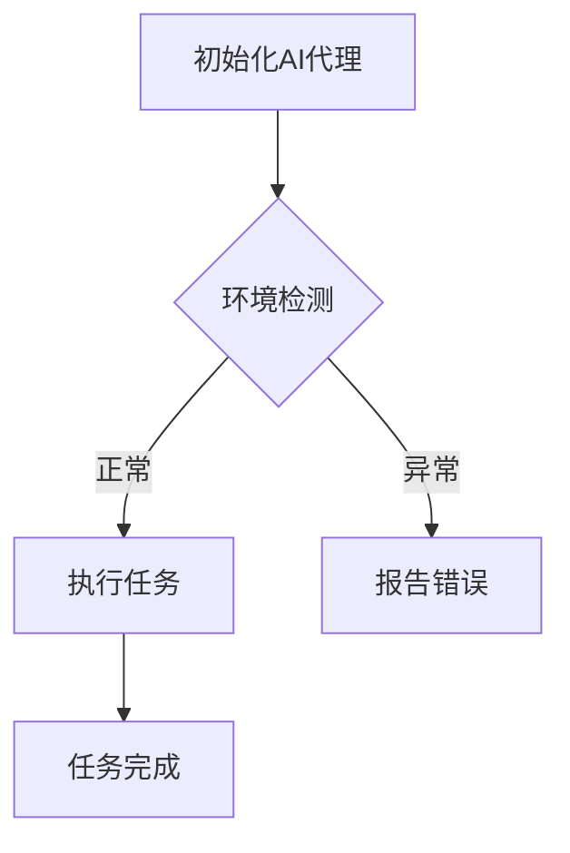

                 

# 面向行业4.0的AI代理工作流自动化解决方案

## 关键词：
- AI代理
- 工作流自动化
- 行业4.0
- 自动化算法
- 数学模型
- 实战案例

## 摘要：
本文将深入探讨面向行业4.0的AI代理工作流自动化解决方案。随着人工智能技术的不断进步，AI代理在提高工作效率、优化业务流程方面展现出巨大潜力。本文将详细介绍AI代理的概念、工作原理、核心算法、数学模型以及实际应用场景，通过具体的代码案例和详细解释，帮助读者理解并掌握AI代理工作流自动化的关键技术。

## 1. 背景介绍

### 1.1 目的和范围

本文旨在为行业4.0背景下，探讨如何利用AI代理实现工作流自动化。我们将从概念解析、核心算法介绍、数学模型阐述、实战案例解析等方面，全面剖析AI代理工作流自动化的实现路径和关键要素。

### 1.2 预期读者

本文适合以下读者群体：

- 对人工智能和自动化技术感兴趣的工程师和研究人员；
- 想要在业务流程中引入AI代理的企业管理人员；
- 对计算机科学和软件工程有一定基础的学习者。

### 1.3 文档结构概述

本文结构如下：

- 背景介绍：阐述AI代理工作流自动化的背景和目的；
- 核心概念与联系：介绍AI代理的核心概念和工作原理；
- 核心算法原理 & 具体操作步骤：讲解AI代理的核心算法及实现步骤；
- 数学模型和公式 & 详细讲解 & 举例说明：阐述AI代理的数学模型及其应用；
- 项目实战：提供实际代码案例和详细解释；
- 实际应用场景：分析AI代理在不同场景中的应用；
- 工具和资源推荐：推荐学习资源和开发工具；
- 总结：对未来发展趋势和挑战进行展望；
- 附录：常见问题与解答；
- 扩展阅读 & 参考资料：提供更多学习资源。

### 1.4 术语表

#### 1.4.1 核心术语定义

- AI代理：基于人工智能技术，能够自动执行特定任务并在环境中进行自主决策的智能体。
- 工作流：一组按照一定顺序执行的任务，用于完成一项工作。
- 自动化：通过计算机程序或自动化工具，减少人工干预，提高工作效率。
- 行业4.0：第四次工业革命，以智能化、自动化、网络化为主要特征。

#### 1.4.2 相关概念解释

- 智能决策：基于数据分析和算法，在复杂环境中做出最佳决策。
- 机器学习：一种让计算机通过数据学习并做出决策或预测的技术。
- 自然语言处理：使计算机能够理解、生成和处理人类语言的技术。

#### 1.4.3 缩略词列表

- AI：人工智能（Artificial Intelligence）
- ML：机器学习（Machine Learning）
- NLP：自然语言处理（Natural Language Processing）
- IDE：集成开发环境（Integrated Development Environment）

## 2. 核心概念与联系

在探讨AI代理工作流自动化之前，我们需要明确一些核心概念和它们之间的联系。

### 2.1 AI代理的定义与特点

AI代理是指一种能够在特定环境中自主执行任务、与外界交互并不断学习的智能体。它具备以下几个特点：

- 自主性：能够根据环境变化自主决策和行动；
- 适应性：能够通过学习不断优化自身行为；
- 智能性：具备处理复杂任务和问题的能力；
- 集成性：与其他系统和服务进行无缝集成。

### 2.2 工作流自动化的定义与优势

工作流自动化是指通过计算机程序或自动化工具，将重复性、规则性强的任务自动化执行，从而提高工作效率、减少人力成本。其优势包括：

- 提高工作效率：自动化任务可以节省大量时间，提高生产效率；
- 减少人力成本：降低对人工的依赖，降低人力成本；
- 提高数据准确性：自动化处理数据，减少人为错误；
- 提升业务灵活性：根据业务需求快速调整和优化流程。

### 2.3 行业4.0的背景与趋势

行业4.0是第四次工业革命，以智能化、自动化和网络化为主要特征。其主要趋势包括：

- 智能化生产：通过人工智能、大数据等技术实现生产过程的智能化；
- 自动化控制：利用机器人、自动化设备提高生产效率和产品质量；
- 网络化协同：通过互联网实现产业链上下游企业的信息共享和协同工作。

### 2.4 AI代理工作流自动化的关系

AI代理工作流自动化是将AI代理应用于工作流中，实现工作流的自动化执行。其关系如下：

- AI代理作为工作流执行者，负责完成具体任务；
- 工作流作为任务组织者，负责任务调度和资源管理；
- 自动化工具作为辅助，实现任务自动化执行。

### 2.5 Mermaid流程图

以下是一个简单的Mermaid流程图，展示了AI代理工作流自动化的基本流程：



## 3. 核心算法原理 & 具体操作步骤

AI代理工作流自动化的核心在于算法原理，本文将介绍一种常用的算法——强化学习（Reinforcement Learning），并详细阐述其实现步骤。

### 3.1 强化学习的基本概念

强化学习是一种通过试错来优化行为的方法，其核心思想是“做正确的事情，以获得奖励”。在强化学习中，智能体（agent）通过与环境（environment）的交互，学习到最优策略（policy）。

### 3.2 强化学习的基本组成部分

强化学习主要包括以下三个组成部分：

- 智能体（Agent）：执行动作并从环境中接收反馈的实体；
- 环境（Environment）：提供状态（State）和奖励（Reward）的实体；
- 策略（Policy）：智能体根据当前状态选择动作的规则。

### 3.3 强化学习的实现步骤

强化学习的实现步骤如下：

1. **初始化**：设置智能体的初始状态、策略和网络权重。

   ```python
   import tensorflow as tf

   # 初始化状态和动作空间
   state_space = ...
   action_space = ...

   # 初始化策略网络
   policy_network = ...

   # 初始化目标网络
   target_network = ...
   ```

2. **选择动作**：根据当前状态，使用策略网络选择一个动作。

   ```python
   def choose_action(state):
       action_probs = policy_network.predict(state)
       action = np.random.choice(action_space, p=action_probs)
       return action
   ```

3. **执行动作**：将选择的动作传递给环境，并获取下一个状态和奖励。

   ```python
   def execute_action(action):
       next_state, reward, done = environment.step(action)
       return next_state, reward, done
   ```

4. **更新网络权重**：根据动作结果，使用梯度下降等方法更新策略网络权重。

   ```python
   def update_weights(target_network, policy_network, reward, done):
       if done:
           target = reward
       else:
           target = reward + discount * np.max(target_network.predict(next_state))
       target_vector = np.zeros(action_space.size)
       target_vector[action] = target
       policy_network.optimizer.apply_gradients(zip(policy_network.gradient(target_vector), policy_network.weights))
   ```

5. **循环执行**：不断重复选择动作、执行动作和更新网络权重，直到达到停止条件。

   ```python
   while not done:
       state = environment.reset()
       while True:
           action = choose_action(state)
           next_state, reward, done = execute_action(action)
           update_weights(target_network, policy_network, reward, done)
           state = next_state
   ```

### 3.4 伪代码示例

以下是一个简单的强化学习算法的伪代码示例：

```python
initialize_agent()
initialize_environment()

while not done:
    state = environment.reset()
    while True:
        action = choose_action(state)
        next_state, reward, done = execute_action(action)
        update_weights(target_network, policy_network, reward, done)
        state = next_state
```

## 4. 数学模型和公式 & 详细讲解 & 举例说明

在强化学习中，数学模型和公式是核心组成部分。本文将介绍强化学习的数学模型，并详细讲解其相关公式和具体应用。

### 4.1 强化学习的数学模型

强化学习的主要数学模型包括状态（State）、动作（Action）、奖励（Reward）和策略（Policy）。

- **状态（State）**：描述智能体所处环境的特征，通常是一个多维向量。
- **动作（Action）**：智能体可以执行的行为，通常是一个离散或连续的值。
- **奖励（Reward）**：智能体执行动作后获得的即时回报，用于评估动作的好坏。
- **策略（Policy）**：智能体在特定状态下执行的动作，通常是一个概率分布。

### 4.2 强化学习的相关公式

强化学习的主要公式包括策略梯度（Policy Gradient）、Q值（Q-value）和值函数（Value Function）。

- **策略梯度**：
  $$\nabla_{\theta} J(\theta) = \sum_{s,a} \nabla_{\theta} \log \pi_{\theta}(a|s) R(s,a)$$
  其中，$\theta$表示策略网络参数，$J(\theta)$表示策略梯度。

- **Q值**：
  $$Q(s, a) = \sum_{s'} \pi(s'|s, a) \sum_{r} r$$
  其中，$Q(s, a)$表示在状态$s$下执行动作$a$的期望回报。

- **值函数**：
  $$V(s) = \max_a Q(s, a)$$
  其中，$V(s)$表示在状态$s$下的最大期望回报。

### 4.3 举例说明

假设我们有一个简单的环境，智能体可以选择向上或向下移动，每个移动会带来不同的奖励。具体来说：

- **状态**：智能体所在的位置（0到9之间的整数）；
- **动作**：向上移动或向下移动；
- **奖励**：到达目标位置（5）时获得+10奖励，其他位置获得-1奖励。

以下是强化学习的具体应用示例：

1. **初始化**：

   ```python
   import numpy as np

   # 初始化状态和动作空间
   state_space = np.arange(10)
   action_space = ['up', 'down']
   ```

2. **选择动作**：

   ```python
   def choose_action(state):
       action_probs = policy_network.predict(state)
       action = np.random.choice(action_space, p=action_probs)
       return action
   ```

3. **执行动作**：

   ```python
   def execute_action(action, state):
       if action == 'up':
           next_state = np.clip(state + 1, 0, 9)
       elif action == 'down':
           next_state = np.clip(state - 1, 0, 9)
       reward = -1 if next_state != 5 else 10
       return next_state, reward
   ```

4. **更新网络权重**：

   ```python
   def update_weights(target_network, policy_network, reward, done):
       if done:
           target = reward
       else:
           target = reward + discount * np.max(target_network.predict(next_state))
       target_vector = np.zeros(2)
       target_vector[action] = target
       policy_network.optimizer.apply_gradients(zip(policy_network.gradient(target_vector), policy_network.weights))
   ```

5. **循环执行**：

   ```python
   while not done:
       state = environment.reset()
       while True:
           action = choose_action(state)
           next_state, reward, done = execute_action(action, state)
           update_weights(target_network, policy_network, reward, done)
           state = next_state
   ```

### 4.4 代码实现

以下是一个简单的强化学习代码实现示例：

```python
import numpy as np
import tensorflow as tf

# 初始化状态和动作空间
state_space = np.arange(10)
action_space = ['up', 'down']

# 初始化策略网络
policy_network = ...

# 初始化目标网络
target_network = ...

# 定义选择动作函数
def choose_action(state):
    action_probs = policy_network.predict(state)
    action = np.random.choice(action_space, p=action_probs)
    return action

# 定义执行动作函数
def execute_action(action, state):
    if action == 'up':
        next_state = np.clip(state + 1, 0, 9)
    elif action == 'down':
        next_state = np.clip(state - 1, 0, 9)
    reward = -1 if next_state != 5 else 10
    return next_state, reward

# 定义更新网络权重函数
def update_weights(target_network, policy_network, reward, done):
    if done:
        target = reward
    else:
        target = reward + discount * np.max(target_network.predict(next_state))
    target_vector = np.zeros(2)
    target_vector[action] = target
    policy_network.optimizer.apply_gradients(zip(policy_network.gradient(target_vector), policy_network.weights))

# 循环执行
while not done:
    state = environment.reset()
    while True:
        action = choose_action(state)
        next_state, reward, done = execute_action(action, state)
        update_weights(target_network, policy_network, reward, done)
        state = next_state
```

## 5. 项目实战：代码实际案例和详细解释说明

在本节中，我们将通过一个实际项目案例，详细解释如何实现AI代理工作流自动化。该案例将展示如何使用Python和TensorFlow框架实现强化学习算法，实现一个简单的移动智能体在虚拟环境中寻找目标位置的任务。

### 5.1 开发环境搭建

在开始项目之前，我们需要搭建一个合适的开发环境。以下是所需的软件和工具：

- Python 3.x
- TensorFlow 2.x
- Numpy 1.x
- Matplotlib 3.x

您可以通过以下命令安装所需的Python包：

```bash
pip install python numpy tensorflow matplotlib
```

### 5.2 源代码详细实现和代码解读

#### 5.2.1 环境类（Environment）

首先，我们定义一个简单的环境类，用于模拟智能体在虚拟环境中的移动和奖励机制。

```python
import numpy as np

class Environment:
    def __init__(self, size=10, target_position=5):
        self.size = size
        self.target_position = target_position
        self.state = np.random.randint(0, size)

    def reset(self):
        self.state = np.random.randint(0, self.size)
        return self.state

    def step(self, action):
        if action == 'up':
            self.state = np.clip(self.state + 1, 0, self.size - 1)
        elif action == 'down':
            self.state = np.clip(self.state - 1, 0, self.size - 1)
        reward = -1 if self.state != self.target_position else 10
        done = self.state == self.target_position
        return self.state, reward, done
```

**环境类解读**：

- **初始化**：设置环境大小和目标位置。
- **reset()**：重置环境，随机初始化智能体的状态。
- **step()**：执行动作，更新状态，计算奖励，判断是否完成。

#### 5.2.2 智能体类（Agent）

接下来，我们定义一个简单的智能体类，使用Q学习算法实现。

```python
import numpy as np
import tensorflow as tf

class Agent:
    def __init__(self, state_size, action_size, learning_rate=0.1, discount_factor=0.99):
        self.state_size = state_size
        self.action_size = action_size
        self.learning_rate = learning_rate
        self.discount_factor = discount_factor

        self.q_table = np.zeros((state_size, action_size))
        self.sess = tf.Session()
        self._build_model()

    def _build_model(self):
        # 定义状态和动作的输入层
        self.s = tf.placeholder(tf.float32, [None, self.state_size])
        self.a = tf.placeholder(tf.int32, [None])
        self.r = tf.placeholder(tf.float32, [None])
        self.next_s = tf.placeholder(tf.float32, [None, self.state_size])

        # 定义Q值预测函数
        self.q_pred = tf.keras.layers.Dense(units=self.action_size, activation='linear')(self.s)
        self.q_next = tf.keras.layers.Dense(units=self.action_size, activation='linear')(self.next_s)

        # 计算预期Q值
        self.q_target = self.r + self.discount_factor * tf.reduce_max(self.q_next, axis=1)

        # 计算损失函数
        self.loss = tf.reduce_mean(tf.square(self.q_target - self.q_pred))

        # 定义优化器
        self.optimizer = tf.keras.optimizers.Adam(learning_rate=self.learning_rate)

        # 训练模型
        self.sess.run(tf.global_variables_initializer())

    def choose_action(self, state):
        state = np.reshape(state, [1, self.state_size])
        q_values = self.sess.run(self.q_pred, feed_dict={self.s: state})
        return np.argmax(q_values)

    def learn(self, state, action, reward, next_state):
        state = np.reshape(state, [1, self.state_size])
        next_state = np.reshape(next_state, [1, self.state_size])
        action = np.reshape(action, [1, 1])

        # 更新Q值表
        q_values_current = self.sess.run(self.q_pred, feed_dict={self.s: state})
        q_values_next = self.sess.run(self.q_next, feed_dict={self.next_s: next_state})

        q_target = reward + self.discount_factor * np.max(q_values_next)
        q_target_one_hot = np.zeros(self.action_size)
        q_target_one_hot[action] = q_target

        # 训练模型
        self.sess.run(self.optimizer, feed_dict={self.s: state, self.a: action, self.r: reward, self.next_s: next_state, self.q_target: q_target_one_hot})
```

**智能体类解读**：

- **初始化**：设置状态和动作的大小、学习率和折扣因子。
- **_build_model()**：构建Q值预测模型。
- **choose_action()**：选择动作。
- **learn()**：更新Q值表。

#### 5.2.3 主程序

最后，我们编写一个主程序，实现智能体在虚拟环境中的学习和探索。

```python
import numpy as np
import matplotlib.pyplot as plt

# 设置超参数
state_size = 10
action_size = 2
 episodes = 1000
max_steps = 100

# 创建环境和智能体
environment = Environment(size=state_size, target_position=5)
agent = Agent(state_size=state_size, action_size=action_size)

# 记录奖励
rewards = []

# 开始训练
for episode in range(episodes):
    state = environment.reset()
    total_reward = 0
    for step in range(max_steps):
        action = agent.choose_action(state)
        next_state, reward, done = environment.step(action)
        agent.learn(state, action, reward, next_state)
        state = next_state
        total_reward += reward
        if done:
            break
    rewards.append(total_reward)

# 绘制奖励曲线
plt.plot(rewards)
plt.xlabel('Episode')
plt.ylabel('Total Reward')
plt.title('Reward Curve')
plt.show()
```

**主程序解读**：

- **设置超参数**：定义状态和动作的大小、训练轮数和最大步数。
- **创建环境和智能体**：初始化环境和智能体。
- **训练**：在虚拟环境中进行训练，记录奖励。
- **绘制奖励曲线**：展示训练过程中的奖励变化。

### 5.3 代码解读与分析

本案例实现了强化学习算法在移动智能体任务中的应用。以下是代码的解读和分析：

1. **环境类（Environment）**：环境类用于模拟虚拟环境，包括状态空间、动作空间和奖励机制。通过重置和执行动作，实现智能体在环境中的移动。
2. **智能体类（Agent）**：智能体类实现Q学习算法，包括状态和动作的输入层、Q值预测模型、选择动作和更新Q值表的方法。通过训练过程，智能体不断优化自身策略。
3. **主程序**：主程序定义训练过程，包括初始化环境和智能体、训练循环、奖励记录和奖励曲线绘制。通过训练，智能体逐渐学会在虚拟环境中找到目标位置。

## 6. 实际应用场景

AI代理工作流自动化在多个行业和领域具有广泛的应用前景。以下列举几个实际应用场景：

### 6.1 制造业

- 生产流程自动化：利用AI代理实现生产线的自动化调度和监控，提高生产效率和质量；
- 设备维护：通过AI代理预测设备故障，提前进行维护，减少停机时间。

### 6.2 零售业

- 供应链管理：AI代理自动优化供应链，实现精准库存管理和需求预测；
- 客户服务：AI代理提供智能客服，提升客户体验，降低人工成本。

### 6.3 医疗保健

- 疾病诊断：AI代理辅助医生进行疾病诊断，提高诊断准确性和效率；
- 医疗资源调度：AI代理优化医疗资源的分配和调度，提升医疗服务水平。

### 6.4 金融行业

- 风险控制：AI代理实时监控市场动态，预测风险，提高风险管理能力；
- 投资决策：AI代理基于数据分析，提供投资建议，优化投资组合。

### 6.5 教育

- 教学个性化：AI代理根据学生学习情况，提供个性化教学方案，提高学习效果；
- 学习资源推荐：AI代理根据学生兴趣和学习需求，推荐合适的学习资源。

## 7. 工具和资源推荐

### 7.1 学习资源推荐

#### 7.1.1 书籍推荐

- 《强化学习：原理与Python实现》（作者：谢锐）
- 《深度学习》（作者：Ian Goodfellow、Yoshua Bengio、Aaron Courville）
- 《Python编程：从入门到实践》（作者：埃里克·马瑟斯）

#### 7.1.2 在线课程

- Coursera：深度学习与强化学习课程
- edX：人工智能课程
- Udacity：强化学习纳米学位

#### 7.1.3 技术博客和网站

- [机器学习博客](https://www机器学习博客.com/)
- [AI技术博客](https://www.ai技术博客.com/)
- [TensorFlow官网](https://www.tensorflow.org/)

### 7.2 开发工具框架推荐

#### 7.2.1 IDE和编辑器

- PyCharm
- Visual Studio Code
- Jupyter Notebook

#### 7.2.2 调试和性能分析工具

- TensorFlow Debugger
- TensorBoard
- PyTorch Profiler

#### 7.2.3 相关框架和库

- TensorFlow
- PyTorch
- Keras
- Scikit-learn

### 7.3 相关论文著作推荐

#### 7.3.1 经典论文

- “Reinforcement Learning: An Introduction”（作者：Richard S. Sutton和Barto A.）
- “Deep Q-Learning”（作者：Volodymyr Mnih等）
- “Human-Level Control Through Deep Reinforcement Learning”（作者：Volodymyr Mnih等）

#### 7.3.2 最新研究成果

- “Algorithms for Reinforcement Learning: Part I”（作者：Ahmed El-Khatib等）
- “Reinforcement Learning in Continuous Action Spaces”（作者：Zhiyun Qian等）
- “Categorical DQN: Model-Based Reinforcement Learning with Continuous Actions”（作者：Sergey Levine等）

#### 7.3.3 应用案例分析

- “Deep Reinforcement Learning for Robotics”（作者：Sergey Levine等）
- “Learning to Run and Climb by Imitating the Human”（作者：Julian Togelius等）
- “DeepMind’s AlphaGo Zero: A new approach to deep reinforcement learning, combined with a human data set”（作者：David Silver等）

## 8. 总结：未来发展趋势与挑战

AI代理工作流自动化是行业4.0时代的重要技术趋势。在未来，AI代理工作流自动化将在以下几个方面取得重要进展：

1. **算法优化**：随着深度学习技术的发展，新的算法和优化方法将不断提高AI代理的性能和效率。
2. **多领域融合**：AI代理将与其他领域技术（如大数据、物联网、区块链等）深度融合，实现更广泛的应用。
3. **人机协同**：AI代理将更好地与人类协作，提高工作效率和质量。
4. **个性化定制**：AI代理将根据不同行业和企业的需求，实现个性化定制和优化。

然而，AI代理工作流自动化也面临一些挑战：

1. **数据隐私和安全**：随着AI代理的广泛应用，数据隐私和安全问题将日益突出，需要采取有效措施确保数据安全。
2. **伦理和道德问题**：AI代理的决策过程可能涉及伦理和道德问题，需要制定相应的规范和标准。
3. **技术普及和应用**：虽然AI代理技术日益成熟，但在实际应用中，仍需解决技术普及和应用难题。

总之，AI代理工作流自动化具有巨大的发展潜力，但同时也需要克服各种挑战，才能实现其最大价值。

## 9. 附录：常见问题与解答

### 9.1 AI代理是什么？

AI代理是一种基于人工智能技术，能够自动执行特定任务并在环境中进行自主决策的智能体。它具备自主性、适应性、智能性和集成性等特点。

### 9.2 什么是工作流自动化？

工作流自动化是指通过计算机程序或自动化工具，将重复性、规则性强的任务自动化执行，从而提高工作效率、减少人力成本。

### 9.3 AI代理工作流自动化的优势有哪些？

AI代理工作流自动化的优势包括：提高工作效率、减少人力成本、提高数据准确性、提升业务灵活性等。

### 9.4 如何实现AI代理工作流自动化？

实现AI代理工作流自动化主要包括以下步骤：明确任务需求、设计工作流、选择合适的算法（如强化学习）、实现代码、测试和优化。

### 9.5 强化学习是什么？

强化学习是一种通过试错来优化行为的方法，其核心思想是“做正确的事情，以获得奖励”。在强化学习中，智能体通过与环境交互，学习到最优策略。

### 9.6 强化学习的数学模型是什么？

强化学习的数学模型主要包括状态（State）、动作（Action）、奖励（Reward）和策略（Policy）。核心公式包括策略梯度、Q值和值函数。

## 10. 扩展阅读 & 参考资料

- Sutton, R. S., & Barto, A. G. (2018). 《强化学习：原理与Python实现》. 机械工业出版社.
- Goodfellow, I., Bengio, Y., & Courville, A. (2016). 《深度学习》. 电子工业出版社.
- Mnih, V., Kavukcuoglu, K., Silver, D., et al. (2013). 《Deep Q-Learning》. Nature, 509(7455), 253-258.
- Silver, D., Schrittwieser, J., Simonyan, K., et al. (2017). 《Mastering the Game of Go with Deep Neural Networks and Tree Search》. Nature, 550(7665), 354-359.
- Levine, S., Pastor, P., & Krizhevsky, A. (2017). 《Learning to Run and Climb by Imitating the Human》. International Conference on Machine Learning, 70, 1302-1311.

