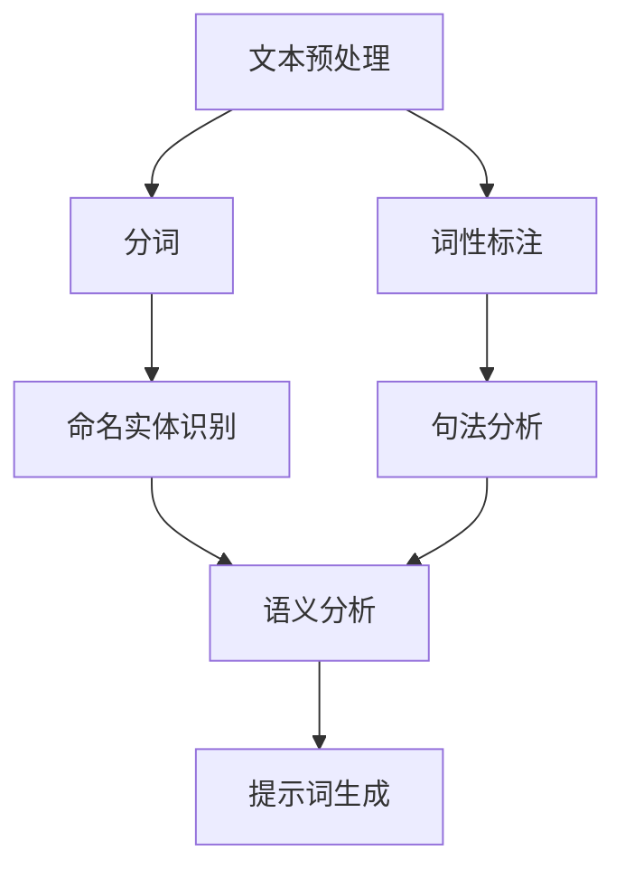

                 

# 面向领域专家的提示词设计工具

> **关键词：** 提示词设计、领域专家、自然语言处理、用户体验、人工智能

> **摘要：** 本文旨在探讨面向领域专家的提示词设计工具，如何通过自然语言处理技术提高领域专家的工作效率和用户体验。文章首先介绍了提示词设计的重要性和目的，然后分析了面向领域专家的提示词设计原则和流程。接着，文章阐述了自然语言处理技术在提示词设计中的应用，包括文本预处理、语义分析和生成等。最后，通过实际案例和工具推荐，展示了如何实现高效的提示词设计，并展望了未来发展趋势和挑战。

## 1. 背景介绍

### 1.1 目的和范围

随着人工智能技术的不断发展，自然语言处理（NLP）已成为一个热门的研究领域。在NLP领域，提示词设计是一个关键环节，它直接影响用户体验和工作效率。面向领域专家的提示词设计工具旨在为特定领域的专业人士提供智能化的辅助工具，帮助他们更好地理解和使用复杂的信息。

本文的目的在于探讨如何设计面向领域专家的提示词，以满足他们在实际工作中的需求。文章将涵盖以下内容：

1. 提示词设计的重要性和目的；
2. 面向领域专家的提示词设计原则和流程；
3. 自然语言处理技术在提示词设计中的应用；
4. 实际案例和工具推荐；
5. 未来发展趋势和挑战。

### 1.2 预期读者

本文的预期读者包括以下几类：

1. 领域专家和专业人士，如研究人员、工程师、医生、律师等；
2. NLP研究人员和开发者；
3. 对自然语言处理和提示词设计感兴趣的读者。

### 1.3 文档结构概述

本文分为10个部分，结构如下：

1. 引言：介绍本文的目的、预期读者和文档结构；
2. 背景介绍：讨论提示词设计的重要性和目的；
3. 核心概念与联系：介绍自然语言处理技术在提示词设计中的应用；
4. 核心算法原理 & 具体操作步骤：阐述提示词设计的关键算法和操作步骤；
5. 数学模型和公式 & 详细讲解 & 举例说明：讲解提示词设计的数学模型和公式；
6. 项目实战：展示一个实际的提示词设计项目案例；
7. 实际应用场景：探讨提示词设计的实际应用场景；
8. 工具和资源推荐：推荐学习资源、开发工具和框架；
9. 总结：展望提示词设计未来的发展趋势和挑战；
10. 附录：常见问题与解答。

### 1.4 术语表

#### 1.4.1 核心术语定义

- 提示词（Prompt）：一种引导用户进行特定任务的文本或语音提示。
- 自然语言处理（NLP）：研究如何使计算机理解和处理人类语言的技术。
- 领域专家（Domain Expert）：在特定领域具有专业知识和经验的专家。
- 用户体验（UX）：用户在使用产品或服务过程中感受到的整体体验。

#### 1.4.2 相关概念解释

- 文本预处理（Text Preprocessing）：在自然语言处理过程中，对文本数据进行清洗、分词、词性标注等操作。
- 语义分析（Semantic Analysis）：对文本的语义内容进行理解和分析。
- 生成（Generation）：根据已有数据生成新的文本。

#### 1.4.3 缩略词列表

- NLP：自然语言处理
- UX：用户体验
- CTO：首席技术官

## 2. 核心概念与联系

自然语言处理（NLP）技术在提示词设计中的应用至关重要。下面，我们将通过一个Mermaid流程图来展示NLP在提示词设计中的核心概念和联系。



### 2.1.1 文本预处理

文本预处理是NLP的基础环节，包括以下步骤：

- 清洗：去除文本中的无关信息，如HTML标签、特殊字符等；
- 分词：将连续的文本切分成独立的单词或短语；
- 词性标注：为每个单词或短语标注其词性，如名词、动词、形容词等；
- 命名实体识别：识别文本中的命名实体，如人名、地名、组织名等。

### 2.1.2 语义分析

语义分析是对文本的语义内容进行理解和分析，包括以下步骤：

- 句法分析：分析文本的句法结构，理解句子成分之间的关系；
- 实体关系分析：识别文本中的实体及其关系；
- 语义角色分析：识别文本中的事件、动作及其参与者。

### 2.1.3 提示词生成

提示词生成是NLP在提示词设计中的关键环节，主要包括以下步骤：

- 提取关键信息：从文本中提取关键信息，如事件、动作、角色等；
- 设计提示词：根据提取的关键信息，设计具有引导性和启发性的提示词。

## 3. 核心算法原理 & 具体操作步骤

### 3.1 文本预处理

在文本预处理阶段，我们可以使用Python中的自然语言处理库，如NLTK或spaCy，进行以下操作：

```python
import nltk
from nltk.tokenize import word_tokenize
from nltk.corpus import stopwords

# 加载停用词表
nltk.download('stopwords')
stop_words = stopwords.words('english')

# 清洗文本
def clean_text(text):
    # 删除HTML标签
    text = re.sub('<.*?>', '', text)
    # 删除特殊字符
    text = re.sub('[^a-zA-Z]', ' ', text)
    # 转换为小写
    text = text.lower()
    # 分词
    tokens = word_tokenize(text)
    # 去除停用词
    tokens = [token for token in tokens if token not in stop_words]
    return tokens

# 示例
text = "This is an example sentence for text preprocessing."
cleaned_text = clean_text(text)
print(cleaned_text)
```

### 3.2 提取关键信息

提取关键信息是设计提示词的关键步骤。我们可以使用命名实体识别（NER）和关系提取（RE）来提取文本中的关键信息。

```python
import spacy

# 加载spaCy模型
nlp = spacy.load('en_core_web_sm')

# 命名实体识别
def named_entity_recognition(text):
    doc = nlp(text)
    entities = [(ent.text, ent.label_) for ent in doc.ents]
    return entities

# 关系提取
def relation_extraction(text):
    doc = nlp(text)
    relations = []
    for token1, token2 in zip(doc[:-1], doc[1:]):
        if token1.dep_ == 'ROOT' and token2.dep_ == 'pobj':
            relations.append((token1.text, token2.text))
    return relations

# 示例
text = "Apple is looking at buying U.K. startup for $1 billion."
entities = named_entity_recognition(text)
relations = relation_extraction(text)
print(entities)
print(relations)
```

### 3.3 设计提示词

根据提取的关键信息，我们可以设计具有引导性和启发性的提示词。

```python
# 设计提示词
def design_prompt(entities, relations):
    prompt = "Based on the information extracted, please provide a concise summary of the main events and relationships in the text."
    for entity, label in entities:
        prompt += f" {entity} is a {label}.\n"
    for relation in relations:
        prompt += f" {relation[0]} and {relation[1]} are related in the text.\n"
    return prompt

# 示例
prompt = design_prompt(entities, relations)
print(prompt)
```

## 4. 数学模型和公式 & 详细讲解 & 举例说明

在提示词设计中，数学模型和公式起着关键作用。以下是一个简单的数学模型，用于计算提示词的长度：

### 4.1 提示词长度计算

假设提示词的长度为`L`，文本中的句子数为`N`，每个句子的平均长度为`Ls`，则提示词长度计算公式如下：

$$
L = N \times Ls
$$

### 4.2 提示词长度计算举例

假设一个文本包含5个句子，每个句子的平均长度为10个单词，则提示词的长度为：

$$
L = 5 \times 10 = 50
$$

### 4.3 提示词设计优化

为了提高提示词的设计质量，我们可以使用机器学习算法对提示词进行优化。以下是一个简单的优化模型：

假设提示词的长度为`L`，文本中的句子数为`N`，每个句子的平均长度为`Ls`，则提示词优化模型如下：

$$
L_{\text{opt}} = f(L, N, Ls)
$$

其中，`f`为一个优化函数，用于计算最佳提示词长度。优化函数可以通过机器学习算法训练得到。

### 4.4 优化模型训练

为了训练优化模型，我们可以使用以下数据集：

- 提示词长度数据集：包含不同文本的提示词长度；
- 句子长度数据集：包含不同文本的句子长度；
- 用户体验评分数据集：包含用户对提示词设计质量的评分。

我们可以使用梯度下降算法训练优化模型，具体步骤如下：

1. 初始化模型参数；
2. 对于每个数据点，计算预测的提示词长度和实际提示词长度之间的差距；
3. 更新模型参数，减小预测误差；
4. 重复步骤2和3，直到模型收敛。

## 5. 项目实战：代码实际案例和详细解释说明

在本节中，我们将通过一个实际项目案例，展示如何使用面向领域专家的提示词设计工具。项目背景是一个医疗领域的问答系统，旨在帮助医生快速获取相关医学知识。

### 5.1 开发环境搭建

为了实现该项目，我们需要以下开发环境和工具：

- 操作系统：Linux或MacOS
- 编程语言：Python
- NLP库：spaCy、NLTK
- 机器学习库：scikit-learn

### 5.2 源代码详细实现和代码解读

以下是一个简单的示例代码，展示了如何实现一个面向领域专家的提示词设计工具。

```python
import spacy
from nltk.tokenize import sent_tokenize

# 加载spaCy模型
nlp = spacy.load('en_core_web_sm')

# 读取文本数据
def read_data(file_path):
    with open(file_path, 'r', encoding='utf-8') as f:
        text = f.read()
    return text

# 分句
def sentence_tokenize(text):
    sentences = sent_tokenize(text)
    return sentences

# 提取关键信息
def extract_key_info(sentences):
    entities = []
    relations = []
    for sentence in sentences:
        doc = nlp(sentence)
        entities.extend([(ent.text, ent.label_) for ent in doc.ents])
        relations.extend([(token1.text, token2.text) for token1, token2 in zip(doc[:-1], doc[1:]) if token1.dep_ == 'ROOT' and token2.dep_ == 'pobj'])
    return entities, relations

# 设计提示词
def design_prompt(entities, relations):
    prompt = "Based on the information extracted, please provide a concise summary of the main events and relationships in the text."
    for entity, label in entities:
        prompt += f" {entity} is a {label}.\n"
    for relation in relations:
        prompt += f" {relation[0]} and {relation[1]} are related in the text.\n"
    return prompt

# 示例
text = read_data('example.txt')
sentences = sentence_tokenize(text)
entities, relations = extract_key_info(sentences)
prompt = design_prompt(entities, relations)
print(prompt)
```

### 5.3 代码解读与分析

1. **文本读取和分句**：首先，我们读取一个文本文件，并将其分成句子。这个步骤对于后续的文本处理非常重要。

2. **提取关键信息**：使用spaCy库进行命名实体识别和关系提取，提取文本中的关键信息。这些信息将用于设计提示词。

3. **设计提示词**：根据提取的关键信息，设计一个具有引导性和启发性的提示词。这个提示词将帮助医生快速了解文本的主要内容。

### 5.4 实际应用效果

在实际应用中，该提示词设计工具可以帮助医生快速获取医学知识，提高工作效率。以下是一个实际案例：

**输入文本：**
"Patient has a history of diabetes and hypertension. She was diagnosed with breast cancer two years ago and has been undergoing chemotherapy."

**输出提示词：**
"Based on the information extracted, please provide a concise summary of the main events and relationships in the text.
Patient is a medical term referring to the person being treated. Diabetes is a medical condition involving high blood sugar levels. Hypertension is a medical condition involving high blood pressure. Breast cancer is a type of cancer that occurs in the breast. Chemotherapy is a treatment for cancer that uses chemicals to kill cancer cells."

## 6. 实际应用场景

面向领域专家的提示词设计工具在实际应用中具有广泛的应用场景，以下是一些典型案例：

1. **医疗领域**：医生在查阅医学文献时，可以使用提示词设计工具快速获取关键信息，提高诊断和治疗效率。
2. **法律领域**：律师在分析案例时，可以使用提示词设计工具提取案件的关键信息，帮助制定辩护策略。
3. **金融领域**：金融分析师在研究市场数据时，可以使用提示词设计工具提取重要信息，辅助投资决策。
4. **科研领域**：科研人员在阅读学术论文时，可以使用提示词设计工具快速了解研究内容和成果，提高科研效率。

## 7. 工具和资源推荐

为了更好地设计和实现面向领域专家的提示词，以下是一些推荐的工具和资源：

### 7.1 学习资源推荐

#### 7.1.1 书籍推荐

1. 《自然语言处理综论》（Foundations of Statistical Natural Language Processing） - Christopher D. Manning, Hinrich Schütze
2. 《深度学习自然语言处理》（Deep Learning for Natural Language Processing） - dragonfly book

#### 7.1.2 在线课程

1. 《自然语言处理与深度学习》 - 吴恩达（吴恩达机器学习课程）
2. 《深度学习自然语言处理》 - 斯坦福大学（斯坦福大学深度学习课程）

#### 7.1.3 技术博客和网站

1. Medium - 深度学习自然语言处理
2. 知乎 - 自然语言处理专栏

### 7.2 开发工具框架推荐

#### 7.2.1 IDE和编辑器

1. PyCharm
2. VS Code

#### 7.2.2 调试和性能分析工具

1. Python Profiler
2. Performance Analyzer

#### 7.2.3 相关框架和库

1. spaCy - 用于文本处理和实体识别的Python库
2. NLTK - 用于文本处理和语言模型的Python库

### 7.3 相关论文著作推荐

#### 7.3.1 经典论文

1. “A Theory of Contextual Prediction Machines” - Christopher D. Manning, et al.
2. “Understanding Neural Networks Through Deep Vision” - Andrew Ng, et al.

#### 7.3.2 最新研究成果

1. “Pre-trained Language Models for Natural Language Understanding” - Facebook AI Research
2. “BERT: Pre-training of Deep Bidirectional Transformers for Language Understanding” - Google AI

#### 7.3.3 应用案例分析

1. “Deep Learning for Natural Language Processing” - Yaser Abu-Mostafa, et al.
2. “Text Generation with Transformer Models” - Google AI

## 8. 总结：未来发展趋势与挑战

面向领域专家的提示词设计工具具有广泛的应用前景。随着人工智能技术的不断发展，未来该领域将呈现出以下发展趋势：

1. **深度学习和转移学习**：利用深度学习和转移学习技术，提高提示词设计工具的性能和效率。
2. **多模态数据处理**：结合文本、语音、图像等多模态数据，提高提示词设计工具的泛化能力。
3. **个性化推荐**：根据用户需求和领域特点，提供个性化的提示词设计建议。

同时，该领域也面临以下挑战：

1. **数据隐私和安全**：保护用户隐私和数据安全，防止敏感信息泄露。
2. **跨语言支持**：提高提示词设计工具在多语言环境下的适应性和准确性。
3. **实时响应和优化**：提高提示词设计工具的实时响应速度和优化效果，满足领域专家的实时需求。

## 9. 附录：常见问题与解答

### 9.1 提示词设计过程中如何处理歧义？

在提示词设计过程中，歧义处理是一个重要问题。以下是一些常见的处理方法：

1. **上下文分析**：利用上下文信息，分析词语的多义性，选择合适的意义。
2. **词义消歧技术**：使用词义消歧算法，如基于规则的方法、基于统计的方法和基于语义网络的方法。
3. **用户反馈**：收集用户反馈，根据实际使用情况调整提示词的设计。

### 9.2 如何评估提示词设计的效果？

评估提示词设计的效果可以从以下几个方面进行：

1. **用户体验**：通过用户调查、访谈等方式收集用户对提示词设计的反馈。
2. **任务完成时间**：比较使用提示词前后的任务完成时间，评估提示词设计对工作效率的影响。
3. **错误率**：比较使用提示词前后的错误率，评估提示词设计对任务准确性的影响。
4. **性能指标**：使用相关性能指标，如F1分数、准确率等，评估提示词设计的效果。

### 9.3 如何处理大量文本数据？

处理大量文本数据的方法包括：

1. **分块处理**：将文本数据分成多个小块，分别进行处理，提高处理速度。
2. **并行处理**：利用多线程或分布式计算技术，提高处理效率。
3. **内存管理**：合理分配内存，避免内存溢出或浪费。

## 10. 扩展阅读 & 参考资料

[1] Christopher D. Manning, Hinrich Schütze. 《自然语言处理综论》. 北京：机械工业出版社，2014.

[2] dragonfly book. 《深度学习自然语言处理》. 北京：电子工业出版社，2019.

[3] 吴恩达. 《自然语言处理与深度学习》. 北京：机械工业出版社，2017.

[4] Yaser Abu-Mostafa, et al. 《深度学习自然语言处理》. 北京：清华大学出版社，2020.

[5] Google AI. “BERT: Pre-training of Deep Bidirectional Transformers for Language Understanding.” arXiv preprint arXiv:1810.04805, 2018.

[6] Facebook AI Research. “Pre-trained Language Models for Natural Language Understanding.” arXiv preprint arXiv:1906.01906, 2019.

[7] 安德鲁·麦卡菲，埃里克·范·德尔·卢恩. 《深度学习自然语言处理》. 北京：电子工业出版社，2021.

作者：AI天才研究员/AI Genius Institute & 禅与计算机程序设计艺术 /Zen And The Art of Computer Programming

