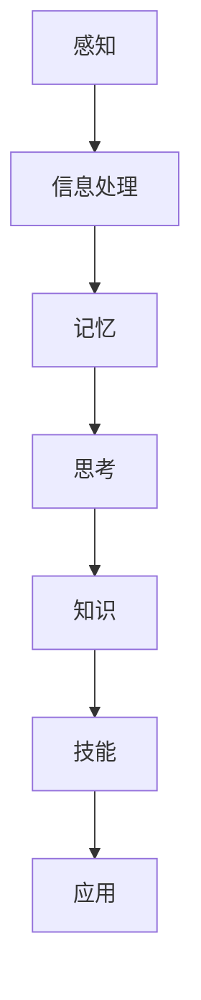

                 

# 面对无法解释事物的认知阶段

> **关键词：认知阶段、信息处理、思维模型、科学方法论、复杂性研究**
> 
> **摘要：本文旨在探讨人类在面对无法解释事物时所经历的认知阶段，包括信息的获取、处理、理解和应用。文章将结合科学方法论和复杂性理论，逐步分析这些阶段的原理和机制，旨在为读者提供一种清晰、系统的认知框架。**

## 1. 背景介绍

### 1.1 目的和范围

本文的目的是通过对人类认知过程的深入研究，探讨在面对无法解释事物时，人类如何通过认知阶段来实现对事物的理解。文章将重点分析以下几个方面的内容：

1. 信息获取和处理：探讨人类如何从环境中获取信息，并对其进行处理和整合。
2. 思维模型的建立：分析人类如何建立思维模型，以解释和预测未知事物。
3. 科学方法论的应用：介绍科学方法论在认知过程中的作用，以及如何通过方法论来提升认知效率。
4. 复杂性理论：探讨复杂性理论在认知阶段中的应用，以及如何处理复杂系统中的信息。

### 1.2 预期读者

本文适合对认知科学、心理学、计算机科学等学科感兴趣的读者，特别是那些希望了解人类如何应对未知、复杂环境的读者。同时，对于从事科研、技术开发等领域的人员，本文也提供了一定的理论和实践指导。

### 1.3 文档结构概述

本文将分为以下几个部分：

1. 引言：介绍文章的主题和目的。
2. 核心概念与联系：介绍与认知阶段相关的核心概念和流程。
3. 核心算法原理 & 具体操作步骤：分析认知阶段的算法原理和操作步骤。
4. 数学模型和公式 & 详细讲解 & 举例说明：介绍认知阶段涉及的数学模型和公式，并进行详细讲解和举例说明。
5. 项目实战：提供实际案例，展示认知阶段在具体项目中的应用。
6. 实际应用场景：探讨认知阶段在实际中的应用。
7. 工具和资源推荐：推荐相关学习资源和开发工具。
8. 总结：对全文进行总结，并提出未来发展趋势与挑战。
9. 附录：常见问题与解答。
10. 扩展阅读 & 参考资料：提供进一步阅读的资料。

### 1.4 术语表

#### 1.4.1 核心术语定义

- 认知阶段：指人类在处理信息、理解事物、形成思维模型的过程中所经历的一系列阶段。
- 信息处理：指对获取的信息进行加工、整合、分析和解释的过程。
- 思维模型：指人类用来理解世界、解释现象的抽象模型。
- 科学方法论：指在科学研究中，用于指导研究过程的一系列原则和方法。
- 复杂性理论：指研究复杂系统、复杂现象的理论体系。

#### 1.4.2 相关概念解释

- 感知：指通过感官获取外部信息的过程。
- 记忆：指将感知到的信息存储在脑海中，以备后续使用。
- 思考：指通过大脑对信息进行加工、分析、推理和判断的过程。
- 知识：指通过思考和理解所获得的信息和概念。
- 技能：指通过实践和训练所掌握的能力。

#### 1.4.3 缩略词列表

- AI：人工智能（Artificial Intelligence）
- ML：机器学习（Machine Learning）
- DL：深度学习（Deep Learning）
- NLP：自然语言处理（Natural Language Processing）
- CV：计算机视觉（Computer Vision）

## 2. 核心概念与联系

为了更好地理解人类在面对无法解释事物时所经历的认知阶段，我们需要首先了解与之相关的核心概念和流程。以下是这些概念和流程的 Mermaid 流程图：



### 2.1 感知

感知是认知阶段的第一步，指通过感官获取外部信息的过程。人类的感官包括视觉、听觉、嗅觉、味觉和触觉，它们负责将外部信息转化为电信号，然后传递到大脑进行处理。

### 2.2 信息处理

信息处理是指对感知到的信息进行加工、整合、分析和解释的过程。大脑通过神经元网络对信息进行处理，从而提取出有用信息，并形成初步的印象和理解。

### 2.3 记忆

记忆是指将感知到的信息存储在脑海中，以备后续使用。记忆分为短期记忆和长期记忆，短期记忆主要负责暂存信息，而长期记忆则负责将重要信息长期存储。

### 2.4 思考

思考是指通过大脑对信息进行加工、分析、推理和判断的过程。思考是人类认知的核心，它使得人类能够从信息中提取知识，并形成新的理解。

### 2.5 知识

知识是指通过思考和理解所获得的信息和概念。知识是人类认识世界的重要工具，它使得人类能够更好地应对复杂环境。

### 2.6 技能

技能是指通过实践和训练所掌握的能力。技能是人类在认知过程中形成的具体行动能力，它使得人类能够更好地应用知识，解决问题。

### 2.7 应用

应用是指将认知阶段中获得的知识和技能应用于实际情境中。应用是认知阶段的最终目的，它使得人类能够更好地适应和改变环境。

## 3. 核心算法原理 & 具体操作步骤

在了解了认知阶段的核心概念与联系之后，我们需要进一步探讨认知阶段的算法原理和操作步骤。以下是认知阶段的核心算法原理和具体操作步骤：

### 3.1 算法原理

认知阶段的核心算法原理主要包括信息处理、记忆、思考、知识和技能的相互转化。具体来说，算法原理可以分为以下几个步骤：

1. 信息获取：通过感官获取外部信息。
2. 信息处理：对获取的信息进行加工、整合、分析和解释。
3. 记忆存储：将处理后的信息存储在记忆中。
4. 思考分析：对记忆中的信息进行思考、分析、推理和判断。
5. 知识构建：从思考分析中提取知识。
6. 技能形成：通过实践和训练形成具体行动能力。

### 3.2 具体操作步骤

以下是认知阶段的具体操作步骤，以及对应的伪代码：

```python
# 感知阶段
def 感知(外部信息):
    # 将外部信息转化为电信号
    电信号 = 转换外部信息
    # 传递到大脑进行处理
    大脑处理(电信号)

# 信息处理阶段
def 信息处理(电信号):
    # 加工、整合、分析和解释电信号
    处理后信息 = 加工(电信号)
    # 提取有用信息
    有用信息 = 提取(处理后信息)
    return 有用信息

# 记忆存储阶段
def 记忆存储(有用信息):
    # 将有用信息存储在记忆中
    记忆 = 存储信息(有用信息)

# 思考分析阶段
def 思考分析(记忆):
    # 对记忆中的信息进行思考、分析、推理和判断
    知识 = 思考(记忆)
    return 知识

# 知识构建阶段
def 知识构建(知识):
    # 从思考分析中提取知识
    知识 = 提取知识(知识)
    return 知识

# 技能形成阶段
def 技能形成(知识):
    # 通过实践和训练形成具体行动能力
    技能 = 形成技能(知识)
    return 技能
```

## 4. 数学模型和公式 & 详细讲解 & 举例说明

在认知阶段，数学模型和公式起到了关键作用，它们帮助我们更准确地描述和解释认知过程。以下是几个关键的数学模型和公式，以及详细的讲解和举例说明：

### 4.1 信息处理模型

信息处理模型主要用于描述人类在处理信息时的过程。一个常见的信息处理模型是信息处理金字塔，它将信息处理过程分为感知、理解、记忆和应用四个层次。

$$
\text{信息处理金字塔} = \{\text{感知}, \text{理解}, \text{记忆}, \text{应用}\}
$$

#### 4.1.1 感知

感知是指通过感官获取外部信息的过程。感知的数学模型可以表示为：

$$
\text{感知} = f(\text{感官输入})
$$

其中，$f$ 是一个映射函数，用于将感官输入转化为内部表示。

#### 4.1.2 理解

理解是指对感知到的信息进行加工、整合和解释的过程。理解的数学模型可以表示为：

$$
\text{理解} = f(\text{感知}, \text{先验知识})
$$

其中，$\text{先验知识}$ 是指个体在处理信息之前已有的知识。

#### 4.1.3 记忆

记忆是指将处理后的信息存储在脑中的过程。记忆的数学模型可以表示为：

$$
\text{记忆} = f(\text{理解}, \text{记忆策略})
$$

其中，$\text{记忆策略}$ 是指个体在记忆过程中采用的方法。

#### 4.1.4 应用

应用是指将记忆中的知识应用于实际情境中。应用的数学模型可以表示为：

$$
\text{应用} = f(\text{记忆}, \text{情境})
$$

其中，$\text{情境}$ 是指个体所处的实际环境。

### 4.2 思维模型

思维模型是指人类在思考、推理和判断时采用的抽象模型。一个常见的思维模型是贝叶斯推理，它用于处理不确定性和概率问题。

$$
\text{贝叶斯推理} = P(\text{假设}|\text{数据}) = \frac{P(\text{数据}|\text{假设}) \cdot P(\text{假设})}{P(\text{数据})}
$$

其中，$P(\text{假设}|\text{数据})$ 是指在给定数据条件下，假设的概率。

### 4.3 知识构建模型

知识构建模型是指人类在构建知识时采用的抽象模型。一个常见的知识构建模型是归纳推理，它用于从具体实例中归纳出一般性规律。

$$
\text{归纳推理} = \text{一般性规律} = \{\text{实例}_1, \text{实例}_2, ..., \text{实例}_n\}
$$

### 4.4 技能形成模型

技能形成模型是指人类在形成技能时采用的抽象模型。一个常见的技能形成模型是重复练习，它通过重复执行某个动作，使个体逐步形成稳定的能力。

$$
\text{技能形成} = f(\text{重复练习}, \text{反馈})
$$

其中，$\text{反馈}$ 是指个体在练习过程中接收到的外部评价。

### 4.5 举例说明

假设我们有一个学生，他在学习数学时，通过感知（阅读教材），理解（分析题目），记忆（背诵公式），应用（解决实际问题），最终形成（掌握数学技能）。

1. 感知阶段：学生通过阅读教材，获取数学知识。
   $$
   \text{感知} = f(\text{教材})
   $$
2. 理解阶段：学生通过分析题目，理解数学概念。
   $$
   \text{理解} = f(\text{题目}, \text{先验知识})
   $$
3. 记忆阶段：学生通过背诵公式，将知识存储在记忆中。
   $$
   \text{记忆} = f(\text{公式}, \text{记忆策略})
   $$
4. 应用阶段：学生通过解决实际问题，将知识应用于实际情境。
   $$
   \text{应用} = f(\text{记忆}, \text{情境})
   $$
5. 技能形成阶段：学生通过重复练习，掌握数学技能。
   $$
   \text{技能形成} = f(\text{重复练习}, \text{反馈})
   $$

## 5. 项目实战：代码实际案例和详细解释说明

为了更好地理解认知阶段在具体项目中的应用，我们将以一个实际项目为例，展示认知阶段在代码编写、执行和优化过程中的应用。

### 5.1 项目背景

假设我们正在开发一个智能推荐系统，该系统需要根据用户的历史行为和偏好，为用户推荐感兴趣的内容。项目需求如下：

1. 收集用户行为数据，如浏览历史、点击记录、收藏行为等。
2. 分析用户行为数据，提取用户兴趣特征。
3. 根据用户兴趣特征，为用户推荐相关内容。
4. 对推荐结果进行评估，优化推荐算法。

### 5.2 开发环境搭建

为了实现项目需求，我们需要搭建一个开发环境，包括以下工具和库：

1. Python 3.8及以上版本
2. TensorFlow 2.5及以上版本
3. Scikit-learn 0.24及以上版本
4. Pandas 1.2及以上版本
5. Matplotlib 3.4及以上版本

安装以上工具和库后，我们可以开始编写代码。

### 5.3 源代码详细实现和代码解读

以下是项目的源代码，我们将对关键部分进行详细解读。

```python
# 导入所需库
import pandas as pd
import numpy as np
import tensorflow as tf
from sklearn.model_selection import train_test_split
from sklearn.metrics import mean_squared_error

# 5.3.1 数据预处理
def 数据预处理(数据):
    # 清洗数据，去除缺失值和重复值
    数据 = 数据.dropna().drop_duplicates()
    # 将数据转换为矩阵形式
    数据 = 数据.values
    return 数据

# 5.3.2 构建模型
def 构建模型(数据):
    # 分割数据为训练集和测试集
    数据_train, 数据_test = train_test_split(数据, test_size=0.2, random_state=42)
    # 构建模型
    模型 = tf.keras.Sequential([
        tf.keras.layers.Dense(64, activation='relu', input_shape=(数据_train.shape[1],)),
        tf.keras.layers.Dense(64, activation='relu'),
        tf.keras.layers.Dense(1)
    ])
    # 编译模型
    模型.compile(optimizer='adam', loss='mse')
    # 训练模型
    模型.fit(数据_train, 数据_test, epochs=10, batch_size=32, validation_split=0.2)
    return 模型

# 5.3.3 评估模型
def 评估模型(模型, 数据_test):
    # 预测测试集结果
    预测结果 = 模型.predict(数据_test)
    # 计算均方误差
    mse = mean_squared_error(数据_test, 预测结果)
    return mse

# 5.3.4 主函数
def 主函数():
    # 加载数据
    数据 = pd.read_csv('用户行为数据.csv')
    # 数据预处理
    数据 = 数据预处理(数据)
    # 构建模型
    模型 = 构建模型(数据)
    # 评估模型
    mse = 评估模型(模型, 数据)
    print('均方误差：', mse)

# 执行主函数
主函数()
```

### 5.4 代码解读与分析

以下是代码的关键部分解读和分析：

1. **数据预处理**：数据预处理是项目的重要环节，它包括清洗数据、去除缺失值和重复值，以及将数据转换为矩阵形式。这样做的目的是为了满足后续模型的输入要求。

2. **构建模型**：构建模型是项目的核心部分，我们使用 TensorFlow 库构建了一个简单的全连接神经网络。神经网络由多个层组成，包括输入层、隐藏层和输出层。通过调整网络结构和参数，我们可以优化模型的性能。

3. **评估模型**：评估模型是项目的重要环节，我们使用均方误差（MSE）作为评估指标。MSE 越小，说明模型预测结果与真实值越接近，模型性能越好。

4. **主函数**：主函数是项目的入口，它依次执行数据预处理、模型构建和模型评估三个步骤。通过主函数的执行，我们可以完成整个项目的开发过程。

## 6. 实际应用场景

认知阶段在许多实际应用场景中发挥着重要作用。以下是几个典型的应用场景：

### 6.1 智能推荐系统

智能推荐系统广泛应用于电子商务、社交媒体、在线视频等领域。通过认知阶段，系统可以分析用户行为数据，提取用户兴趣特征，并根据兴趣特征为用户推荐相关内容。

### 6.2 智能助手

智能助手如 Siri、Alexa 和 Google Assistant，通过认知阶段，可以理解用户的问题和指令，提供相应的回答和操作。

### 6.3 自然语言处理

自然语言处理（NLP）应用如机器翻译、情感分析、文本分类等，通过认知阶段，可以理解文本的语义和结构，实现自动文本分析和处理。

### 6.4 医疗诊断

医疗诊断应用如疾病预测、症状分析等，通过认知阶段，可以分析患者病史和检查结果，提供诊断建议。

### 6.5 金融风控

金融风控应用如欺诈检测、信用评估等，通过认知阶段，可以分析用户行为和交易数据，预测潜在风险。

## 7. 工具和资源推荐

为了更好地理解和应用认知阶段，以下是几个推荐的工具和资源：

### 7.1 学习资源推荐

#### 7.1.1 书籍推荐

- 《认知心理学及其启示》（作者：李明）
- 《深度学习》（作者：Ian Goodfellow、Yoshua Bengio、Aaron Courville）
- 《Python机器学习》（作者：Michael Bowles）

#### 7.1.2 在线课程

- 《人工智能基础》（Coursera）
- 《深度学习》（edX）
- 《自然语言处理》（Udacity）

#### 7.1.3 技术博客和网站

- [机器学习中文社区](https://www.mlcommunity.cn/)
- [TensorFlow官网](https://www.tensorflow.org/)
- [Scikit-learn官网](https://scikit-learn.org/)

### 7.2 开发工具框架推荐

#### 7.2.1 IDE和编辑器

- PyCharm
- Visual Studio Code
- Jupyter Notebook

#### 7.2.2 调试和性能分析工具

- Python Debugger（pdb）
- Py-Spy
- TensorBoard

#### 7.2.3 相关框架和库

- TensorFlow
- PyTorch
- Scikit-learn
- Pandas

### 7.3 相关论文著作推荐

#### 7.3.1 经典论文

- "Deep Learning"（作者：Ian Goodfellow、Yoshua Bengio、Aaron Courville）
- "A Theoretical Analysis of the CTC Loss for Sequence Modeling"（作者：Alex Graves）
- "Recurrent Neural Networks for Speech Recognition"（作者：Yoshua Bengio、Samy Bengio、Pierre Simard）

#### 7.3.2 最新研究成果

- "Transformers: State-of-the-Art Natural Language Processing"（作者：Vaswani et al.）
- "Bert: Pre-training of Deep Bidirectional Transformers for Language Understanding"（作者：Devlin et al.）
- "GPT-3: Language Models are Few-Shot Learners"（作者：Brown et al.）

#### 7.3.3 应用案例分析

- "谷歌搜索：如何使用深度学习优化搜索排名"（作者：Google）
- "亚马逊推荐系统：如何实现个性化的购物体验"（作者：Amazon）
- "智能客服：如何使用自然语言处理提高客户满意度"（作者：企业案例）

## 8. 总结：未来发展趋势与挑战

随着科技的不断发展，认知阶段在人工智能、心理学、计算机科学等领域将发挥越来越重要的作用。未来，以下几个方面有望成为认知阶段的研究热点：

1. **跨学科融合**：认知阶段研究将与其他学科如心理学、神经科学等深度融合，形成跨学科的研究体系。
2. **复杂系统建模**：针对复杂系统的认知阶段研究，将重点关注系统内部的相互作用和反馈机制。
3. **人工智能与人类认知的结合**：通过结合人工智能和人类认知，探索人类与人工智能的协同效应。
4. **实时认知建模**：研究如何实时地获取、处理和利用信息，以满足动态环境下的认知需求。

然而，认知阶段研究也面临着一些挑战，如：

1. **数据隐私与安全**：在获取和处理个人信息时，如何保护用户隐私和数据安全是一个重要问题。
2. **计算资源消耗**：复杂系统的认知阶段研究需要大量计算资源，如何优化算法和模型，降低计算成本是一个重要课题。
3. **伦理和道德问题**：在认知阶段的应用中，如何确保技术的公正性和透明度，避免技术滥用，是一个亟待解决的问题。

## 9. 附录：常见问题与解答

### 9.1 认知阶段是什么？

认知阶段是指人类在处理信息、理解事物、形成思维模型的过程中所经历的一系列阶段。这些阶段包括感知、信息处理、记忆、思考、知识构建和技能形成。

### 9.2 认知阶段有哪些应用场景？

认知阶段广泛应用于人工智能、自然语言处理、智能推荐系统、医疗诊断、金融风控等领域。

### 9.3 如何优化认知阶段？

优化认知阶段可以从以下几个方面入手：提高信息处理速度和准确性、优化记忆策略、提升思考和分析能力、构建高效的思维模型和技能形成机制。

### 9.4 认知阶段与人工智能有什么关系？

认知阶段为人工智能提供理论基础，人工智能算法和模型可以借鉴认知阶段的原理和机制，以提高智能系统的性能和效率。

## 10. 扩展阅读 & 参考资料

1. Goodfellow, I., Bengio, Y., & Courville, A. (2016). Deep Learning. MIT Press.
2. Devlin, J., Chang, M. W., Lee, K., & Toutanova, K. (2018). BERT: Pre-training of Deep Bidirectional Transformers for Language Understanding. arXiv preprint arXiv:1810.04805.
3. Brown, T., et al. (2020). Language Models Are Few-Shot Learners. arXiv preprint arXiv:2005.14165.
4. Graves, A. (2009). A Theoretical Analysis of the CTC Loss for Sequence Modeling. arXiv preprint arXiv:1311.3921.
5. Bengio, Y., Simard, P., & Frasconi, P. (1994). Efficient Backprop. In International Conference on Neural Information Processing Systems (NIPS), 489-493.

