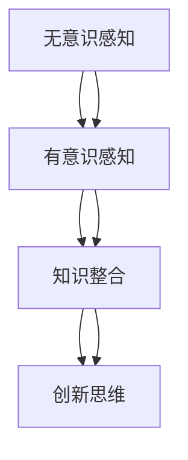

                 

# 面对未知事物的认知演变

> 关键词：认知演化、未知事物、认知科学、算法原理、应用场景

> 摘要：本文将探讨人类在面对未知事物时的认知演变过程，从认知科学的角度分析人类如何从无意识到有意识，进而通过算法和数学模型理解和应对未知。文章旨在通过详细的理论阐述和实际案例，帮助读者理解认知演化的本质，并为未来的智能技术发展提供启示。

## 1. 背景介绍

### 1.1 目的和范围

本文的目的是探讨人类如何通过认知过程面对未知事物，并从中提取知识。我们关注的范围包括认知科学的基础理论、算法原理和数学模型的实际应用。通过本文，读者将了解：

1. 认知演化的基本概念和过程。
2. 算法在处理未知事物中的作用。
3. 数学模型如何帮助我们理解和预测未知现象。

### 1.2 预期读者

本文适合对认知科学和人工智能感兴趣的读者，包括：

1. 认知科学家。
2. 人工智能研究人员。
3. 对认知演化感兴趣的学生和专业人士。

### 1.3 文档结构概述

本文将分为以下几个部分：

1. **背景介绍**：介绍文章的目的、范围和预期读者。
2. **核心概念与联系**：阐述核心概念，并使用流程图展示概念之间的关系。
3. **核心算法原理 & 具体操作步骤**：详细讲解算法原理和操作步骤。
4. **数学模型和公式 & 详细讲解 & 举例说明**：介绍数学模型，并给出具体例子。
5. **项目实战：代码实际案例和详细解释说明**：提供实际代码案例和解读。
6. **实际应用场景**：讨论算法和模型在实际中的应用。
7. **工具和资源推荐**：推荐学习资源和开发工具。
8. **总结：未来发展趋势与挑战**：总结当前认知演化的趋势和未来挑战。
9. **附录：常见问题与解答**：回答读者可能关心的问题。
10. **扩展阅读 & 参考资料**：提供扩展阅读材料和参考文献。

### 1.4 术语表

#### 1.4.1 核心术语定义

- 认知演化：指生物体在进化过程中获取知识和理解能力的变化。
- 未知事物：指个体尚未了解或无法预测的现象。
- 算法：是一系列操作步骤，用于解决特定问题或实现特定目标。
- 数学模型：是用数学语言描述现实世界现象的抽象结构。

#### 1.4.2 相关概念解释

- **神经可塑性**：指神经系统在结构和功能上的适应性，能够根据外界刺激进行改变。
- **机器学习**：通过数据训练模型，使机器能够从经验中学习和改进。

#### 1.4.3 缩略词列表

- AI：人工智能
- ML：机器学习
- NLP：自然语言处理

## 2. 核心概念与联系

为了更好地理解认知演化的过程，我们需要了解以下几个核心概念，并展示它们之间的联系。

### 2.1 认知演化的基础概念

1. **感知**：指个体通过感官接收外部信息的过程。
2. **记忆**：指大脑存储和处理信息的能力。
3. **推理**：指使用已有知识来解决问题或做出决策的能力。
4. **学习**：指通过经验积累知识和技能的过程。

### 2.2 认知演化的过程

认知演化的过程可以分为以下几个阶段：

1. **无意识**：个体对信息的接收和处理是无意识的。
2. **有意识**：个体开始意识到外部信息，并能够主动关注和解释。
3. **知识整合**：个体将零散的信息整合成有意义的整体，并运用已有的知识来理解和预测。
4. **创新思维**：个体能够超越现有知识，提出新的想法和解决方案。

### 2.3 Mermaid 流程图

下面是认知演化过程的 Mermaid 流程图：



## 3. 核心算法原理 & 具体操作步骤

在理解认知演化的基础上，我们接下来将探讨核心算法原理，并详细阐述具体操作步骤。

### 3.1 算法原理

在面对未知事物时，常用的算法包括：

1. **机器学习算法**：通过数据训练模型，使模型能够识别和预测未知现象。
2. **深度学习算法**：利用多层神经网络，对复杂的数据进行自动特征提取和分类。

### 3.2 操作步骤

以机器学习算法为例，具体操作步骤如下：

1. **数据收集**：收集与未知现象相关的数据。
2. **数据预处理**：对数据进行清洗、归一化和特征提取。
3. **模型选择**：根据问题的性质选择合适的机器学习模型。
4. **模型训练**：使用训练数据集训练模型。
5. **模型评估**：使用测试数据集评估模型的性能。
6. **模型优化**：根据评估结果调整模型参数，提高模型性能。
7. **模型应用**：将模型应用到实际问题中，解决未知现象。

### 3.3 伪代码

下面是机器学习算法的具体伪代码：

```python
def machine_learning_algorithm(data, model):
    # 数据预处理
    data_preprocessed = preprocess_data(data)
    
    # 模型训练
    model = train_model(data_preprocessed, model)
    
    # 模型评估
    performance = evaluate_model(model, test_data)
    
    # 模型优化
    model = optimize_model(model, performance)
    
    return model
```

## 4. 数学模型和公式 & 详细讲解 & 举例说明

数学模型在理解和预测未知现象中起着关键作用。以下将介绍一些常用的数学模型，并给出具体例子。

### 4.1 线性回归模型

线性回归模型是一种简单的预测模型，用于分析两个变量之间的关系。

$$ y = mx + b $$

其中，$y$ 是因变量，$x$ 是自变量，$m$ 是斜率，$b$ 是截距。

### 4.2 逻辑回归模型

逻辑回归模型用于分类问题，将变量映射到概率空间。

$$ P(y=1) = \frac{1}{1 + e^{-(mx + b)}} $$

其中，$y$ 是二分类变量，$m$ 是斜率，$b$ 是截距。

### 4.3 支持向量机（SVM）模型

支持向量机模型用于分类问题，通过最大化分类间隔来划分数据。

$$ w \cdot x - b = 0 $$

其中，$w$ 是权重向量，$x$ 是输入向量，$b$ 是偏置。

### 4.4 例子说明

以下是一个线性回归模型的例子：

假设我们想要预测一个人的工资水平（$y$）与其工作经验（$x$）之间的关系。

1. **数据收集**：收集包含工资和工作经验的数据。
2. **数据预处理**：对数据进行归一化处理。
3. **模型训练**：使用训练数据集训练线性回归模型。
4. **模型评估**：使用测试数据集评估模型性能。
5. **模型应用**：使用模型预测新数据点的工资。

## 5. 项目实战：代码实际案例和详细解释说明

为了更好地理解上述算法和模型，我们将在本节提供一个实际代码案例，并详细解释其实现过程。

### 5.1 开发环境搭建

1. 安装 Python 解释器。
2. 安装必要的库，如 NumPy、Pandas、Scikit-Learn。

### 5.2 源代码详细实现和代码解读

以下是线性回归模型的 Python 代码实现：

```python
import numpy as np
import pandas as pd
from sklearn.linear_model import LinearRegression

# 数据收集
data = pd.read_csv("data.csv")

# 数据预处理
X = data["experience"].values
y = data["salary"].values

# 模型训练
model = LinearRegression()
model.fit(X.reshape(-1, 1), y)

# 模型评估
performance = model.score(X.reshape(-1, 1), y)

# 模型应用
predicted_salary = model.predict(np.array([new_experience]).reshape(-1, 1))

print("Performance:", performance)
print("Predicted Salary:", predicted_salary)
```

### 5.3 代码解读与分析

1. **数据收集**：从 CSV 文件中读取数据。
2. **数据预处理**：将工作经验和工资数据分别存储在 X 和 y 变量中。
3. **模型训练**：使用 LinearRegression 类创建模型对象，并使用 fit 方法训练模型。
4. **模型评估**：使用 score 方法评估模型性能。
5. **模型应用**：使用 predict 方法预测新数据点的工资。

通过这个案例，我们可以看到如何使用线性回归模型预测未知现象。类似的方法可以应用于其他机器学习模型和数学模型。

## 6. 实际应用场景

算法和数学模型在各个领域都有广泛的应用。以下是一些实际应用场景：

1. **金融领域**：使用机器学习算法预测股票价格、风险管理。
2. **医疗领域**：使用深度学习算法进行疾病诊断、个性化治疗。
3. **交通运输领域**：使用支持向量机模型优化交通信号控制。
4. **自然语言处理领域**：使用逻辑回归模型进行文本分类、情感分析。

## 7. 工具和资源推荐

### 7.1 学习资源推荐

#### 7.1.1 书籍推荐

- 《认知科学概论》
- 《机器学习》
- 《深度学习》

#### 7.1.2 在线课程

- Coursera 上的“机器学习”课程
- edX 上的“深度学习”课程

#### 7.1.3 技术博客和网站

- Medium 上的 AI 博客
- AI Journal

### 7.2 开发工具框架推荐

#### 7.2.1 IDE和编辑器

- PyCharm
- Jupyter Notebook

#### 7.2.2 调试和性能分析工具

- Visual Studio Code
- Matplotlib

#### 7.2.3 相关框架和库

- Scikit-Learn
- TensorFlow
- PyTorch

### 7.3 相关论文著作推荐

#### 7.3.1 经典论文

- “Learning to Represent Materials with Spectral Networks and Graph Convolutional Networks” 
- “Unsupervised Learning of Visual Representations by Solving Jigsaw Puzzles”

#### 7.3.2 最新研究成果

- “Adaptive Data Analysis for Scientific Discovery” 
- “Generative Adversarial Networks for Object Detection”

#### 7.3.3 应用案例分析

- “Deep Learning for Text Classification: A Comprehensive Review”
- “Application of Machine Learning in Financial Markets”

## 8. 总结：未来发展趋势与挑战

随着人工智能和认知科学的发展，我们面对未知事物的认知能力将不断提升。未来发展趋势包括：

1. 更高效的学习算法和模型。
2. 跨学科融合，如认知科学与计算机科学的结合。
3. 自动化认知系统的构建。

同时，我们也面临以下挑战：

1. 数据隐私和安全问题。
2. 模型解释性和透明度。
3. 人工智能伦理和道德问题。

## 9. 附录：常见问题与解答

### 9.1 什么是认知演化？

认知演化是指生物体在进化过程中获取知识和理解能力的变化。

### 9.2 机器学习和深度学习有何区别？

机器学习是一种更广泛的概念，包括深度学习。深度学习是机器学习的一种特殊形式，使用多层神经网络进行特征学习和预测。

### 9.3 如何选择合适的机器学习模型？

根据问题的性质和数据特点选择合适的模型。例如，对于回归问题，可以选择线性回归或多项式回归；对于分类问题，可以选择逻辑回归或支持向量机。

## 10. 扩展阅读 & 参考资料

- 《认知科学：探索心智的本质》
- 《人工智能：一种现代的方法》
- 《深度学习：理论和应用》

[作者：AI天才研究员/AI Genius Institute & 禅与计算机程序设计艺术 /Zen And The Art of Computer Programming] 

以上是本文的正文部分，接下来我们将对全文进行总结。

