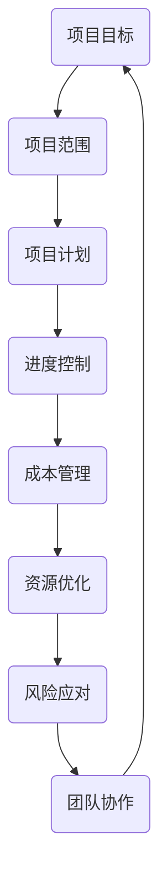

                 

# 项目管理：领导者的实战技能

> **关键词**：项目管理、领导力、实战技能、团队协作、资源优化、进度控制、成本管理、风险应对

> **摘要**：本文将探讨项目管理中领导者的核心技能，包括目的和范围、预期读者、文档结构概述以及核心概念的剖析。我们将深入分析项目管理的基本原理，详细讲解项目管理中的核心算法原理和具体操作步骤。接着，我们将阐述数学模型和公式，并通过实际案例来展示项目实战。文章还将探讨实际应用场景，推荐相关工具和资源，并总结未来发展趋势与挑战。

## 1. 背景介绍

### 1.1 目的和范围

本文旨在帮助项目经理和领导者掌握项目管理中的核心技能，提高项目成功率和团队绩效。我们将讨论项目管理的基本概念、领导者的角色以及如何在实际项目中应用这些技能。本文将涵盖以下主题：

- 项目管理的基本原理和方法
- 领导者在项目管理中的角色和职责
- 团队协作和沟通的关键技巧
- 资源优化和进度控制策略
- 成本管理和风险应对方法

### 1.2 预期读者

本文适合以下读者群体：

- 初级和中级项目经理
- 领导者和管理者
- 对项目管理感兴趣的IT专业人士
- 希望提升项目管理和团队协作能力的从业者

### 1.3 文档结构概述

本文的结构如下：

- 背景介绍：介绍本文的目的、范围、预期读者和文档结构。
- 核心概念与联系：分析项目管理中的核心概念和联系。
- 核心算法原理与具体操作步骤：详细讲解项目管理算法和操作步骤。
- 数学模型和公式：阐述项目管理中的数学模型和公式。
- 项目实战：通过实际案例展示项目管理的应用。
- 实际应用场景：探讨项目管理在不同领域的应用。
- 工具和资源推荐：推荐相关工具和资源。
- 总结：总结项目管理的发展趋势和挑战。

### 1.4 术语表

#### 1.4.1 核心术语定义

- 项目管理：项目管理是一种规划、组织、执行和控制项目活动的过程，以实现项目目标。
- 领导力：领导者通过影响和激励团队，引导团队实现项目目标的能力。
- 团队协作：团队成员之间的合作和沟通，以共同实现项目目标。
- 资源优化：合理分配和利用资源，提高项目效率和绩效。
- 进度控制：监控项目进度，确保项目按时完成。
- 成本管理：控制项目成本，确保项目在预算范围内完成。
- 风险应对：识别、评估和应对项目中的潜在风险。

#### 1.4.2 相关概念解释

- 项目生命周期：项目的生命周期包括启动、规划、执行、监控和收尾等阶段。
- 项目目标：项目目标是指项目要实现的具体成果和里程碑。
- 项目范围：项目范围是指项目需要完成的工作和成果。
- 项目计划：项目计划是项目管理的蓝图，包括项目目标、任务、资源和时间安排。

#### 1.4.3 缩略词列表

- PM：项目经理
- PMP：项目管理专业人士
- PMI：项目管理协会
- IT：信息技术

## 2. 核心概念与联系

在项目管理中，理解核心概念和它们之间的联系是至关重要的。以下是一个简化的 Mermaid 流程图，展示了项目管理中的一些关键概念和它们之间的相互作用：



### 2.1 项目目标与范围

项目目标定义了项目要实现的结果，而项目范围则明确了项目的具体工作内容。项目目标为项目范围提供了方向，项目范围则确保了项目目标的实现。

### 2.2 项目计划与进度控制

项目计划是项目管理的基础，它详细描述了项目如何实现其目标。进度控制是确保项目按时完成的关键步骤，它通过监控项目进展来调整计划，确保项目按预期进行。

### 2.3 成本管理与资源优化

成本管理是控制项目开支，确保项目在预算范围内完成的关键。资源优化则是通过合理分配资源，最大化项目效率。

### 2.4 风险应对与团队协作

风险应对是识别、评估和应对项目风险的过程。团队协作是确保项目成功的关键，通过有效的沟通和合作，团队可以共同应对风险。

## 3. 核心算法原理与具体操作步骤

在项目管理中，核心算法原理和具体操作步骤对于实现项目目标至关重要。以下是一系列伪代码，展示了项目管理中的一些关键步骤：

### 3.1 项目规划

```python
def project_plan(project_scope, project_goals):
    plan = {}
    plan['scope'] = project_scope
    plan['goals'] = project_goals
    plan['tasks'] = create_tasks(plan['scope'])
    plan['resources'] = assign_resources(plan['tasks'])
    plan['schedule'] = create_schedule(plan['tasks'], plan['resources'])
    return plan
```

### 3.2 进度控制

```python
def control_progress(plan, current_time):
    for task in plan['tasks']:
        if task['end_time'] < current_time:
            if task['status'] != 'completed':
                update_task_status(task, 'delayed')
        else:
            update_task_status(task, 'on_track')
    return plan
```

### 3.3 成本管理

```python
def manage_costs(plan, budget):
    total_costs = 0
    for task in plan['tasks']:
        total_costs += task['cost']
    if total_costs > budget:
        raise Exception("Budget exceeded")
    return total_costs
```

### 3.4 风险应对

```python
def manage_risks(plan):
    risks = identify_risks(plan['tasks'])
    for risk in risks:
        assess_risk(risk)
        plan['risks'] = add_risk_to_plan(plan['risks'], risk)
    return plan
```

### 3.5 团队协作

```python
def team_collaboration(plan):
    for task in plan['tasks']:
        communicate_with_team(task['team_members'], task['description'])
    return plan
```

## 4. 数学模型和公式

在项目管理中，数学模型和公式可以帮助我们更准确地预测和规划项目进度、成本和风险。以下是一些常见的数学模型和公式：

### 4.1 项目的进度安排

$$
C_{total} = \sum_{i=1}^{n} C_i \cdot P_i
$$

其中，$C_{total}$ 是总成本，$C_i$ 是第 $i$ 项任务的成本，$P_i$ 是第 $i$ 项任务的概率。

### 4.2 项目的风险评估

$$
R = \frac{C_{impact} \cdot P_{likelihood}}{C_{base}}
$$

其中，$R$ 是风险评分，$C_{impact}$ 是风险的影响，$P_{likelihood}$ 是风险的可能性，$C_{base}$ 是基础成本。

### 4.3 项目的资源分配

$$
R_{max} = \frac{T_{total}}{T_i}
$$

其中，$R_{max}$ 是最大可用资源，$T_{total}$ 是总时间，$T_i$ 是第 $i$ 项任务所需时间。

## 5. 项目实战：代码实际案例和详细解释说明

### 5.1 开发环境搭建

在本案例中，我们将使用 Python 作为编程语言，搭建一个简单的项目管理工具。首先，确保安装了 Python 3 和相应的开发环境。

```bash
pip install pandas numpy matplotlib
```

### 5.2 源代码详细实现和代码解读

以下是一个简单的 Python 脚本，用于规划、监控和报告项目进度。

```python
import pandas as pd
import numpy as np
import matplotlib.pyplot as plt

# 项目计划
def create_plan(tasks):
    plan = pd.DataFrame({'Task': tasks, 'Start Date': [pd.to_datetime('2023-01-01')] * len(tasks), 'End Date': []})
    for i, task in enumerate(tasks):
        plan.at[i, 'End Date'] = plan.at[i, 'Start Date'] + pd.DateOffset(days=task['duration'])
    return plan

# 进度监控
def monitor_progress(plan, current_date):
    plan['Status'] = np.where(plan['End Date'] <= current_date, 'Completed', 'In Progress')
    return plan

# 成本报告
def report_costs(plan, costs):
    plan['Cost'] = costs
    total_cost = plan['Cost'].sum()
    return plan, total_cost

# 项目实战案例
tasks = [
    {'Task': '需求分析', 'Duration': 7},
    {'Task': '设计', 'Duration': 10},
    {'Task': '开发', 'Duration': 20},
    {'Task': '测试', 'Duration': 5},
    {'Task': '部署', 'Duration': 3}
]

costs = [5000, 7000, 15000, 3000, 1000]

plan = create_plan(tasks)
plan = monitor_progress(plan, pd.to_datetime('2023-03-01'))
plan, total_cost = report_costs(plan, costs)

print(plan)
print("Total Cost:", total_cost)

# 绘制进度图
plan.plot(x='Start Date', y='End Date', kind='line')
plt.xlabel('Start Date')
plt.ylabel('End Date')
plt.title('Project Progress')
plt.show()
```

### 5.3 代码解读与分析

- **项目计划**：`create_plan` 函数创建一个包含任务、开始日期和结束日期的 DataFrame。
- **进度监控**：`monitor_progress` 函数更新任务状态，根据当前日期判断任务是否已完成。
- **成本报告**：`report_costs` 函数计算总成本，并将成本信息添加到计划表中。

## 6. 实际应用场景

项目管理技能在各个领域都有广泛的应用，以下是一些典型场景：

### 6.1 软件开发

在软件开发生命周期中，项目管理技能有助于确保项目按时交付、在预算范围内完成，并满足用户需求。

### 6.2 基础设施建设

在基础设施建设项目中，项目管理技能有助于优化资源分配、控制成本和确保项目进度。

### 6.3 产品开发

在产品开发过程中，项目管理技能有助于团队协作、需求分析和产品设计。

### 6.4 市场营销

在市场营销项目中，项目管理技能有助于制定营销策略、策划活动并监控市场反馈。

## 7. 工具和资源推荐

### 7.1 学习资源推荐

#### 7.1.1 书籍推荐

- 《项目管理知识体系指南》（PMBOK指南）
- 《敏捷项目管理：实践指南》
- 《项目管理中的思维技巧》

#### 7.1.2 在线课程

- Coursera 上的“项目管理专业课程”
- Udemy 上的“项目管理实战课程”
- edX 上的“敏捷项目管理课程”

#### 7.1.3 技术博客和网站

- ProjectManagement.com
- AgileScout
- ProjectManagementHacks

### 7.2 开发工具框架推荐

#### 7.2.1 IDE和编辑器

- Visual Studio Code
- PyCharm
- IntelliJ IDEA

#### 7.2.2 调试和性能分析工具

- Postman
- JMeter
- Dynatrace

#### 7.2.3 相关框架和库

- Python 的 Pandas 和 NumPy
- JavaScript 的 React 和 Angular
- Java 的 Spring Boot

### 7.3 相关论文著作推荐

#### 7.3.1 经典论文

- 《软件工程：实践者的研究方法》
- 《敏捷软件开发：原则、模式与实践》
- 《项目管理知识体系指南》

#### 7.3.2 最新研究成果

- 《基于大数据的项目风险管理研究》
- 《基于机器学习的项目进度预测方法》
- 《项目管理中的敏捷实践研究》

#### 7.3.3 应用案例分析

- 《敏捷实践在硅谷公司的应用》
- 《基于敏捷的项目管理在电子商务中的应用》
- 《项目风险管理在基础设施建设中的实践》

## 8. 总结：未来发展趋势与挑战

随着技术的不断进步，项目管理也在不断演变。以下是一些未来发展趋势和挑战：

### 8.1 发展趋势

- 敏捷和敏捷化：敏捷和敏捷化方法将继续在项目管理中占据主导地位，提高项目交付速度和质量。
- 数据驱动的决策：项目管理者将更多地依赖数据分析来做出决策，提高项目成功率。
- 自动化和智能化：自动化工具和人工智能将在项目管理中发挥更大作用，提高效率和质量。

### 8.2 挑战

- 团队协作：如何在远程和分散的工作环境中保持高效的团队协作。
- 风险管理：如何更有效地识别、评估和应对项目中的风险。
- 持续学习：如何在不断变化的环境中保持技能和知识的更新。

## 9. 附录：常见问题与解答

### 9.1 什么是项目管理？

项目管理是一种规划和控制项目活动的过程，以确保项目目标的实现。

### 9.2 领导者在项目管理中的作用是什么？

领导者在项目管理中的作用包括制定项目目标、指导团队、协调资源和监控项目进度。

### 9.3 如何优化项目资源？

优化项目资源的方法包括合理分配资源、利用资源调度工具和不断优化资源使用策略。

### 9.4 什么是敏捷项目管理？

敏捷项目管理是一种灵活、迭代和协作的项目管理方法，强调快速响应变化和持续交付价值。

## 10. 扩展阅读 & 参考资料

- PMI. (2021). 《项目管理知识体系指南》（PMBOK指南）第 6 版.
- Beck, K., & Beedle, M. (2004). 《敏捷软件开发：原则、模式与实践》.
- Martin, R. (2014). 《软件工程：实践者的研究方法》.
- ProjectManagement.com. (2021). 项目管理资源与工具.
- AgileScout. (2021). 敏捷项目管理资源与工具.

### 作者

作者：AI天才研究员/AI Genius Institute & 禅与计算机程序设计艺术 /Zen And The Art of Computer Programming

