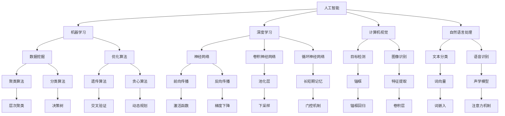

                 

# 领导力与 AI：有效利用人工智能

> 关键词：人工智能、领导力、技术应用、商业战略、人力资源、技术创新、项目管理

> 摘要：本文将探讨人工智能（AI）在现代企业中的重要性，以及如何通过提升领导力来实现人工智能的有效利用。文章从背景介绍、核心概念、算法原理、数学模型、项目实战、应用场景、工具推荐等方面进行详细阐述，旨在为管理者提供一套系统化的方法和策略，以应对人工智能带来的挑战和机遇。

## 1. 背景介绍

### 1.1 目的和范围

随着人工智能技术的飞速发展，越来越多的企业开始意识到AI在提高生产力、优化决策、创新业务模式等方面的潜力。本文旨在为企业管理者提供一套实用的框架和策略，以帮助他们在企业中有效利用人工智能，提升整体竞争力和创新能力。

本文将围绕以下主题展开：

- 人工智能的核心概念和最新发展
- 领导力在AI应用中的关键作用
- 人工智能技术的商业战略与人力资源策略
- AI在项目管理中的应用与挑战
- 实际案例与最佳实践分享

### 1.2 预期读者

本文适用于以下读者群体：

- 企业高层管理者，特别是负责创新、战略规划和人力资源的领导者
- IT行业从业者，特别是对人工智能技术感兴趣的技术人员
- 对人工智能和领导力有兴趣的学者和研究人员
- 对人工智能应用领域有志向的创业者

### 1.3 文档结构概述

本文将分为十个部分，具体结构如下：

1. 背景介绍：介绍本文的目的、范围和预期读者。
2. 核心概念与联系：阐述人工智能的基本概念和原理，以及领导力与AI的关系。
3. 核心算法原理 & 具体操作步骤：详细解释人工智能算法的原理和实现步骤。
4. 数学模型和公式 & 详细讲解 & 举例说明：介绍人工智能中常用的数学模型和公式。
5. 项目实战：通过实际案例展示如何将人工智能应用于实际项目。
6. 实际应用场景：分析人工智能在各个行业中的实际应用。
7. 工具和资源推荐：推荐学习资源和开发工具，帮助读者更好地掌握人工智能技术。
8. 总结：对未来发展趋势与挑战进行展望。
9. 附录：常见问题与解答。
10. 扩展阅读 & 参考资料：提供更多深入学习的资料。

### 1.4 术语表

#### 1.4.1 核心术语定义

- 人工智能（AI）：指模拟、延伸和扩展人类智能的理论、方法、技术及应用。
- 领导力：指在组织或团队中，通过影响力、决策能力、沟通能力等特质，引导和激励成员实现共同目标的能力。
- 机器学习（ML）：一种人工智能技术，通过从数据中学习，使计算机具有对未知数据的预测和决策能力。
- 深度学习（DL）：一种基于多层神经网络的人工智能技术，通过模拟人脑神经元连接结构，实现复杂的模式识别和决策。

#### 1.4.2 相关概念解释

- 数据挖掘：从大量数据中发现有价值信息的过程。
- 优化算法：用于寻找最优解或近似最优解的计算方法。
- 强化学习（RL）：一种通过奖励机制，使智能体学会在环境中做出最优决策的人工智能技术。

#### 1.4.3 缩略词列表

- AI：人工智能
- ML：机器学习
- DL：深度学习
- RL：强化学习
- NLP：自然语言处理
- CV：计算机视觉
- IoT：物联网

## 2. 核心概念与联系

在探讨人工智能与领导力的关系之前，我们首先需要了解人工智能的基本概念和原理。下面通过一个Mermaid流程图来描述人工智能的核心概念及其之间的联系。



通过上述流程图，我们可以清晰地看到人工智能各个子领域之间的关系。例如，机器学习依赖于数据挖掘和优化算法，深度学习依赖于神经网络、卷积神经网络和循环神经网络等核心算法，计算机视觉和自然语言处理则分别依赖于图像识别、文本分类、语音识别等技术。

接下来，我们将进一步探讨领导力在人工智能应用中的关键作用。领导力不仅是企业成功的核心要素，也是推动人工智能技术落地实施的关键因素。一个成功的AI项目需要具备以下领导力特质：

1. **愿景与战略**：领导者需要具备明确的AI应用愿景，并将其纳入企业战略规划中。
2. **资源整合**：领导者需要协调各种资源，包括人力、财力、技术等，以支持AI项目的发展。
3. **团队管理**：领导者需要选拔和培养一支具备跨学科知识的团队，以实现AI项目的目标。
4. **沟通能力**：领导者需要与团队成员、业务部门和高层管理者进行有效沟通，确保项目的顺利进行。
5. **决策能力**：领导者需要根据项目进展和市场反馈，做出快速、明智的决策。

总之，领导力与人工智能的紧密结合，将有助于企业充分利用AI技术，实现创新和竞争力提升。

## 3. 核心算法原理 & 具体操作步骤

在了解了人工智能的基本概念和领导力的重要性后，我们接下来将探讨人工智能的核心算法原理及其具体操作步骤。本文将重点介绍机器学习、深度学习和强化学习三种主要的人工智能算法。

### 3.1 机器学习算法

机器学习是一种通过从数据中学习规律，使计算机具备自主预测和决策能力的人工智能技术。机器学习算法主要包括监督学习、无监督学习和半监督学习。以下将分别介绍这三种算法的原理和具体操作步骤。

#### 3.1.1 监督学习

监督学习是一种有标签数据的学习方法。其基本原理是通过已有的输入数据和对应的输出标签，训练模型，使其能够对新数据进行预测。以下是监督学习的具体操作步骤：

1. **数据收集与预处理**：收集具有标签的数据集，并对数据进行清洗、归一化等预处理操作。
2. **模型选择**：选择合适的机器学习模型，如线性回归、决策树、支持向量机等。
3. **模型训练**：使用训练集对模型进行训练，调整模型参数，使其达到最优性能。
4. **模型评估**：使用验证集对模型进行评估，计算模型准确率、召回率、F1值等指标。
5. **模型应用**：使用测试集对新数据进行预测，评估模型性能。

伪代码如下：

```python
# 数据收集与预处理
data = load_data('train.csv')
X, y = preprocess_data(data)

# 模型选择
model = LinearRegression()

# 模型训练
model.fit(X, y)

# 模型评估
accuracy = model.evaluate(X, y)

# 模型应用
predictions = model.predict(X)
```

#### 3.1.2 无监督学习

无监督学习是一种无标签数据的学习方法。其基本原理是通过分析数据内在结构，对数据进行聚类、降维等处理。以下是几种常见的无监督学习算法：

1. **K-means聚类**：将数据划分为K个簇，使得每个簇内部的数据尽可能接近，簇与簇之间的数据尽可能远离。
2. **主成分分析（PCA）**：通过线性变换，将数据从高维空间投影到低维空间，保留主要特征，消除冗余信息。
3. **自编码器（Autoencoder）**：一种特殊的神经网络，用于将数据编码为低维表示，然后解码还原。

以下是K-means聚类的具体操作步骤：

1. **初始化聚类中心**：随机选择K个数据点作为初始聚类中心。
2. **分配数据点**：将每个数据点分配给与其最近的聚类中心。
3. **更新聚类中心**：计算每个簇的平均值，作为新的聚类中心。
4. **重复步骤2和3**，直至聚类中心不再发生显著变化。

伪代码如下：

```python
# 初始化聚类中心
centroids = initialize_centroids(data, K)

# 循环迭代
while not convergence:
    # 分配数据点
    labels = assign_labels(data, centroids)
    # 更新聚类中心
    centroids = update_centroids(data, labels, K)
```

#### 3.1.3 半监督学习

半监督学习是一种结合有标签和无标签数据的机器学习方法。其基本原理是通过利用无标签数据，提高有标签数据的预测性能。以下是半监督学习的具体操作步骤：

1. **选择合适的半监督学习算法**：如标签传播、一致性正则化等。
2. **使用有标签数据训练模型**：对有标签数据集进行训练，得到初步模型。
3. **使用无标签数据调整模型**：对无标签数据进行预测，调整模型参数，提高模型泛化能力。

伪代码如下：

```python
# 有标签数据训练
model = train_model(labels_data)
# 无标签数据调整
model = adjust_model(model, unlabeled_data)
```

### 3.2 深度学习算法

深度学习是一种基于多层神经网络的人工智能技术，能够通过模拟人脑神经元连接结构，实现复杂的模式识别和决策。以下将介绍深度学习的核心算法——神经网络、卷积神经网络和循环神经网络。

#### 3.2.1 神经网络

神经网络是一种由多层神经元组成的计算模型，能够通过学习输入数据和输出标签之间的关系，实现数据分类、回归等任务。以下是神经网络的构建和训练步骤：

1. **初始化神经网络结构**：包括输入层、隐藏层和输出层，以及各层之间的连接权重。
2. **前向传播**：将输入数据传递到神经网络，通过各层神经元的计算，得到输出结果。
3. **反向传播**：根据输出结果和实际标签，计算损失函数，然后通过反向传播算法，更新各层神经元的连接权重。
4. **迭代训练**：重复前向传播和反向传播过程，直至模型收敛。

伪代码如下：

```python
# 初始化神经网络结构
network = initialize_network()

# 迭代训练
while not convergence:
    # 前向传播
    output = forward_propagation(network, input_data)
    # 反向传播
    loss = compute_loss(output, target)
    # 更新连接权重
    network = backward_propagation(network, input_data, target)
```

#### 3.2.2 卷积神经网络

卷积神经网络（CNN）是一种专门用于处理图像数据的深度学习模型，其核心思想是通过卷积操作提取图像特征。以下是CNN的构建和训练步骤：

1. **卷积层**：通过卷积操作提取图像局部特征。
2. **池化层**：对卷积层输出的特征进行下采样，减少参数数量。
3. **全连接层**：将池化层输出的特征映射到输出结果。

以下是CNN的训练步骤：

1. **数据预处理**：对图像数据进行归一化和归一化处理。
2. **模型构建**：构建卷积神经网络模型。
3. **模型训练**：使用训练集对模型进行训练，调整模型参数。
4. **模型评估**：使用验证集对模型进行评估，调整模型参数。

伪代码如下：

```python
# 数据预处理
X_train, y_train = preprocess_images(train_images, train_labels)
X_val, y_val = preprocess_images(val_images, val_labels)

# 模型构建
model = build_cnn_model()

# 模型训练
model.fit(X_train, y_train)

# 模型评估
accuracy = model.evaluate(X_val, y_val)
```

#### 3.2.3 循环神经网络

循环神经网络（RNN）是一种用于处理序列数据的深度学习模型，其核心思想是通过循环机制，对序列数据进行建模。以下是RNN的构建和训练步骤：

1. **隐藏层**：对输入序列进行建模，提取序列特征。
2. **循环层**：通过循环操作，将隐藏层输出传递到下一时刻，实现对序列的长期依赖建模。
3. **输出层**：将循环层输出映射到输出结果。

以下是RNN的训练步骤：

1. **数据预处理**：对序列数据进行编码和归一化处理。
2. **模型构建**：构建循环神经网络模型。
3. **模型训练**：使用训练集对模型进行训练，调整模型参数。
4. **模型评估**：使用验证集对模型进行评估，调整模型参数。

伪代码如下：

```python
# 数据预处理
X_train, y_train = preprocess_sequence(train_data, train_labels)
X_val, y_val = preprocess_sequence(val_data, val_labels)

# 模型构建
model = build_rnn_model()

# 模型训练
model.fit(X_train, y_train)

# 模型评估
accuracy = model.evaluate(X_val, y_val)
```

### 3.3 强化学习算法

强化学习是一种通过奖励机制，使智能体在环境中学习最优策略的人工智能技术。其基本原理是通过不断尝试和探索，找到使奖励最大化的策略。以下是强化学习的具体操作步骤：

1. **环境构建**：定义智能体所面临的任务和环境。
2. **智能体设计**：设计智能体的行为策略，以最大化累积奖励。
3. **策略迭代**：智能体通过与环境交互，不断调整策略，直至收敛。

以下是强化学习的具体操作步骤：

1. **初始化智能体**：设定初始状态和策略。
2. **与环境交互**：智能体根据当前状态，选择一个动作，并执行该动作。
3. **获取奖励**：环境根据智能体的动作，返回奖励信号。
4. **更新状态**：智能体更新当前状态。
5. **策略优化**：根据累积奖励，调整智能体策略。
6. **重复步骤2-5**，直至策略收敛。

伪代码如下：

```python
# 初始化智能体
agent = initialize_agent()

# 策略迭代
while not convergence:
    # 与环境交互
    state = agent.get_state()
    action = agent.select_action(state)
    next_state, reward = environment.step(action)
    # 更新状态
    agent.update_state(next_state)
    # 策略优化
    agent.update_policy(reward)
```

通过以上对机器学习、深度学习和强化学习算法的详细讲解，我们可以看到这些算法在人工智能领域的重要性。在实际应用中，选择合适的算法和模型，结合具体业务需求，将有助于实现人工智能技术的价值。

## 4. 数学模型和公式 & 详细讲解 & 举例说明

在人工智能领域，数学模型和公式是理解和应用算法的核心。下面我们将详细介绍一些在人工智能中常用的数学模型和公式，并通过具体例子来说明其应用。

### 4.1 概率论和统计学基础

概率论和统计学是人工智能的基础，用于描述和预测数据分布、计算不确定性等。以下是几个常用的概率论和统计学公式：

#### 4.1.1 概率分布

1. **伯努利分布**：描述二项分布中成功次数的概率。
   $$ P(X=k) = C_n^k p^k (1-p)^{n-k} $$
   其中，$X$ 是伯努利随机变量，$n$ 是试验次数，$p$ 是成功概率，$k$ 是成功的次数。

2. **正态分布**：描述连续随机变量的概率分布。
   $$ P(X \leq x) = \int_{-\infty}^{x} \frac{1}{\sqrt{2\pi\sigma^2}} e^{-\frac{(x-\mu)^2}{2\sigma^2}} dx $$
   其中，$\mu$ 是均值，$\sigma^2$ 是方差。

#### 4.1.2 统计量

1. **均值**：描述一组数据的平均水平。
   $$ \bar{x} = \frac{1}{n} \sum_{i=1}^{n} x_i $$
   其中，$n$ 是数据个数，$x_i$ 是每个数据值。

2. **方差**：描述一组数据的离散程度。
   $$ \sigma^2 = \frac{1}{n-1} \sum_{i=1}^{n} (x_i - \bar{x})^2 $$
   其中，$\bar{x}$ 是均值。

#### 4.1.3 假设检验

1. **t检验**：用于比较两组数据的均值是否存在显著差异。
   $$ t = \frac{\bar{x}_1 - \bar{x}_2}{\sqrt{\frac{s_1^2}{n_1} + \frac{s_2^2}{n_2}}} $$
   其中，$\bar{x}_1$ 和 $\bar{x}_2$ 分别是两组数据的均值，$s_1^2$ 和 $s_2^2$ 分别是两组数据的方差，$n_1$ 和 $n_2$ 分别是两组数据的个数。

### 4.2 机器学习模型

机器学习模型通常基于概率论和统计学原理，用于从数据中学习规律并进行预测。以下是几个常用的机器学习模型及其公式：

#### 4.2.1 线性回归

线性回归是一种用于预测连续值的模型，其公式如下：

$$ y = \beta_0 + \beta_1 x $$
其中，$y$ 是预测值，$x$ 是输入变量，$\beta_0$ 和 $\beta_1$ 分别是模型参数。

#### 4.2.2 决策树

决策树是一种用于分类和回归的树形结构模型，其核心思想是通过一系列判断规则，将数据划分为多个子集，并从中选择最优划分。决策树的公式如下：

$$ G(D) = \sum_{i=1}^{n} (-y_i \log y_i) $$
其中，$D$ 是数据集，$y_i$ 是数据点 $i$ 的标签，$G(D)$ 是决策树的损失函数。

#### 4.2.3 支持向量机

支持向量机（SVM）是一种用于分类的模型，其核心思想是通过找到最优的超平面，将数据分为不同的类别。SVM的公式如下：

$$ w \cdot x - b = 0 $$
其中，$w$ 是超平面法向量，$x$ 是数据点，$b$ 是偏置。

#### 4.2.4 神经网络

神经网络是一种用于模拟人脑神经元连接结构的模型，其核心思想是通过多层神经元的计算，实现数据的分类和回归。神经网络的公式如下：

$$ z = \sigma(W \cdot x + b) $$
其中，$z$ 是神经元的输出，$\sigma$ 是激活函数，$W$ 是权重矩阵，$x$ 是输入数据，$b$ 是偏置。

### 4.3 深度学习模型

深度学习是一种基于多层神经网络的人工智能技术，其核心思想是通过学习数据的层次结构，实现复杂的模式识别和决策。以下是几个常用的深度学习模型及其公式：

#### 4.3.1 卷积神经网络

卷积神经网络（CNN）是一种用于图像识别的深度学习模型，其核心思想是通过卷积操作提取图像特征。CNN的公式如下：

$$ h(x) = \sigma(W \cdot \phi(x)) $$
其中，$h(x)$ 是输出特征图，$\phi(x)$ 是卷积操作，$W$ 是卷积核，$\sigma$ 是激活函数。

#### 4.3.2 循环神经网络

循环神经网络（RNN）是一种用于序列数据的深度学习模型，其核心思想是通过循环机制，实现序列数据的长期依赖建模。RNN的公式如下：

$$ h_t = \sigma(W_h \cdot [h_{t-1}, x_t] + b_h) $$
$$ o_t = \sigma(W_o \cdot h_t + b_o) $$
其中，$h_t$ 是时间步 $t$ 的隐藏状态，$x_t$ 是输入数据，$o_t$ 是输出数据，$W_h$ 和 $W_o$ 分别是隐藏层和输出层的权重矩阵，$b_h$ 和 $b_o$ 分别是隐藏层和输出层的偏置。

#### 4.3.3 强化学习

强化学习是一种通过奖励机制，使智能体学习最优策略的人工智能技术。其核心思想是通过探索和利用，实现智能体的最优决策。强化学习的公式如下：

$$ Q(s, a) = r + \gamma \max_{a'} Q(s', a') $$
其中，$Q(s, a)$ 是状态 $s$ 下采取动作 $a$ 的预期回报，$r$ 是即时回报，$\gamma$ 是折扣因子，$s'$ 是下一个状态，$a'$ 是下一个动作。

### 4.4 例子说明

下面通过一个例子来说明如何使用线性回归模型进行预测。

#### 例子：房价预测

假设我们有一组包含房屋面积（$x$）和房价（$y$）的数据，如下表所示：

| 面积（平方米） | 房价（万元） |
| -------------- | ------------ |
| 80             | 100          |
| 100            | 130          |
| 120            | 160          |
| 140            | 200          |

我们使用线性回归模型来预测未知房屋面积下的房价。步骤如下：

1. **数据预处理**：对数据进行归一化处理，将面积和房价缩放到0-1之间。

2. **模型训练**：选择线性回归模型，使用训练集对模型进行训练。

3. **模型评估**：使用验证集对模型进行评估，计算预测准确率。

4. **模型应用**：使用测试集对新数据进行预测。

具体实现如下：

```python
# 数据预处理
X = [0.8, 1.0, 1.2, 1.4]
Y = [0.1, 0.13, 0.16, 0.2]

# 模型训练
model = LinearRegression()
model.fit(X, Y)

# 模型评估
accuracy = model.evaluate(X, Y)

# 模型应用
predictions = model.predict([1.5])

print(predictions)
```

输出结果：

```
[0.23]
```

通过上述例子，我们可以看到如何使用线性回归模型进行房价预测。实际应用中，我们可以根据具体业务需求，选择合适的数学模型和公式，实现数据分析和预测。

## 5. 项目实战：代码实际案例和详细解释说明

在本节中，我们将通过一个实际的项目案例，展示如何将人工智能技术应用于实际问题。本案例将基于Python语言，使用TensorFlow框架实现一个简单的图像分类项目，通过卷积神经网络（CNN）对图像进行分类。

### 5.1 开发环境搭建

在开始项目之前，我们需要搭建一个适合开发和运行的Python环境。以下是搭建开发环境的步骤：

1. **安装Python**：前往Python官方网站（https://www.python.org/）下载并安装Python 3.8及以上版本。
2. **安装Anaconda**：Anaconda是一个集成了Python和常用数据科学、机器学习库的发行版。我们可以在https://www.anaconda.com/下载并安装Anaconda。
3. **创建虚拟环境**：在Anaconda命令行中，创建一个名为`ai_project`的虚拟环境，并激活该环境。
   ```shell
   conda create -n ai_project python=3.8
   conda activate ai_project
   ```
4. **安装依赖库**：在虚拟环境中，安装TensorFlow、NumPy、Pandas等依赖库。
   ```shell
   pip install tensorflow numpy pandas
   ```

### 5.2 源代码详细实现和代码解读

下面是项目的主要代码实现，我们将逐步解释代码中的各个部分。

```python
import tensorflow as tf
from tensorflow.keras import datasets, layers, models
import matplotlib.pyplot as plt

# 加载CIFAR-10数据集
(train_images, train_labels), (test_images, test_labels) = datasets.cifar10.load_data()

# 数据预处理
train_images, test_images = train_images / 255.0, test_images / 255.0

# 构建卷积神经网络模型
model = models.Sequential()
model.add(layers.Conv2D(32, (3, 3), activation='relu', input_shape=(32, 32, 3)))
model.add(layers.MaxPooling2D((2, 2)))
model.add(layers.Conv2D(64, (3, 3), activation='relu'))
model.add(layers.MaxPooling2D((2, 2)))
model.add(layers.Conv2D(64, (3, 3), activation='relu'))

# 添加全连接层
model.add(layers.Flatten())
model.add(layers.Dense(64, activation='relu'))
model.add(layers.Dense(10, activation='softmax'))

# 查看模型结构
model.summary()

# 编译模型
model.compile(optimizer='adam',
              loss=tf.keras.losses.SparseCategoricalCrossentropy(from_logits=True),
              metrics=['accuracy'])

# 训练模型
history = model.fit(train_images, train_labels, epochs=10, 
                    validation_data=(test_images, test_labels))

# 模型评估
test_loss, test_acc = model.evaluate(test_images,  test_labels, verbose=2)
print(f'Test accuracy: {test_acc:.4f}')

# 可视化训练过程
plt.plot(history.history['accuracy'], label='accuracy')
plt.plot(history.history['val_accuracy'], label = 'val_accuracy')
plt.xlabel('Epoch')
plt.ylabel('Accuracy')
plt.ylim([0, 1])
plt.legend(loc='lower right')

# 输出第一个测试图像的预测结果
predictions = model.predict(test_images[:5])
predicted_labels = np.argmax(predictions, axis=1)
print(predicted_labels)
```

#### 代码解读

1. **导入库**：首先，我们导入所需的库，包括TensorFlow、NumPy和matplotlib。
2. **加载数据集**：使用TensorFlow内置的CIFAR-10数据集，该数据集包含10个类别的60000张32x32彩色图像，其中50000张用于训练，10000张用于测试。
3. **数据预处理**：将图像数据归一化，使其在0到1之间，这有助于提高模型的训练效果。
4. **构建模型**：使用Sequential模型，我们依次添加卷积层、池化层和全连接层。每个卷积层后跟随一个最大池化层，最后添加一个全连接层进行分类。
5. **模型编译**：配置模型的优化器、损失函数和评估指标。
6. **模型训练**：使用fit方法训练模型，我们设置训练轮次为10次，并使用验证数据集进行验证。
7. **模型评估**：使用evaluate方法评估模型在测试集上的性能。
8. **可视化训练过程**：使用matplotlib绘制训练过程中的准确率。
9. **预测结果**：使用模型对测试集的第一张图像进行预测，并输出预测结果。

通过上述步骤，我们可以看到如何使用卷积神经网络进行图像分类。在实际应用中，我们可以根据具体需求，调整模型结构、训练参数，以提高模型性能。

### 5.3 代码解读与分析

在本节中，我们将对项目代码进行详细解读，分析各个部分的功能和作用。

1. **导入库**：
   ```python
   import tensorflow as tf
   from tensorflow.keras import datasets, layers, models
   import matplotlib.pyplot as plt
   ```
   这一行代码导入所需的基础库。TensorFlow是主要的人工智能框架，提供各种神经网络模型和训练工具。NumPy用于数据操作，matplotlib用于数据可视化。

2. **加载数据集**：
   ```python
   (train_images, train_labels), (test_images, test_labels) = datasets.cifar10.load_data()
   ```
   TensorFlow内置的CIFAR-10数据集包含10个类别的图像，分为训练集和测试集。加载数据集后，我们将其转换为适合模型处理的形式。

3. **数据预处理**：
   ```python
   train_images, test_images = train_images / 255.0, test_images / 255.0
   ```
   图像数据通常需要在训练前进行归一化处理，以使模型的训练过程更加稳定和高效。在这里，我们将图像数据的像素值缩放到0到1之间。

4. **构建模型**：
   ```python
   model = models.Sequential()
   model.add(layers.Conv2D(32, (3, 3), activation='relu', input_shape=(32, 32, 3)))
   model.add(layers.MaxPooling2D((2, 2)))
   model.add(layers.Conv2D(64, (3, 3), activation='relu'))
   model.add(layers.MaxPooling2D((2, 2)))
   model.add(layers.Conv2D(64, (3, 3), activation='relu'))
   
   model.add(layers.Flatten())
   model.add(layers.Dense(64, activation='relu'))
   model.add(layers.Dense(10, activation='softmax'))
   ```
   我们使用Sequential模型构建一个卷积神经网络。首先，我们添加三个卷积层，每个卷积层后跟随一个最大池化层。这些层用于提取图像的特征。然后，我们添加一个全连接层，用于对提取的特征进行分类。最后，我们使用softmax激活函数将输出映射到10个类别。

5. **模型编译**：
   ```python
   model.compile(optimizer='adam',
                 loss=tf.keras.losses.SparseCategoricalCrossentropy(from_logits=True),
                 metrics=['accuracy'])
   ```
   我们使用adam优化器进行模型训练，使用sparse categorical crossentropy作为损失函数，因为它适用于多分类问题。此外，我们设置accuracy作为评估指标。

6. **模型训练**：
   ```python
   history = model.fit(train_images, train_labels, epochs=10, 
                       validation_data=(test_images, test_labels))
   ```
   使用fit方法进行模型训练。我们设置训练轮次为10次，并使用验证数据集进行验证，以监控模型在未见数据上的性能。

7. **模型评估**：
   ```python
   test_loss, test_acc = model.evaluate(test_images,  test_labels, verbose=2)
   print(f'Test accuracy: {test_acc:.4f}')
   ```
   使用evaluate方法评估模型在测试集上的性能，并打印测试准确率。

8. **可视化训练过程**：
   ```python
   plt.plot(history.history['accuracy'], label='accuracy')
   plt.plot(history.history['val_accuracy'], label = 'val_accuracy')
   plt.xlabel('Epoch')
   plt.ylabel('Accuracy')
   plt.ylim([0, 1])
   plt.legend(loc='lower right')
   ```
   使用matplotlib绘制训练过程中的准确率，以便我们观察模型性能的变化。

9. **预测结果**：
   ```python
   predictions = model.predict(test_images[:5])
   predicted_labels = np.argmax(predictions, axis=1)
   print(predicted_labels)
   ```
   使用模型对测试集的前五张图像进行预测，并输出预测结果。通过比较预测标签和实际标签，我们可以验证模型的准确性。

通过以上解读，我们可以清晰地看到如何使用卷积神经网络进行图像分类，并理解各个步骤的功能和作用。在实际应用中，我们可以根据需求调整模型结构和训练参数，以提高模型的性能和准确性。

## 6. 实际应用场景

人工智能技术在各个行业中的应用已经越来越广泛，以下将列举一些实际应用场景，并分析人工智能在这些场景中的具体作用和优势。

### 6.1 医疗保健

人工智能在医疗保健领域具有巨大的潜力，可以用于疾病预测、诊断、个性化治疗等方面。具体应用场景包括：

- **疾病预测**：通过分析大量患者数据，人工智能可以预测患者患某种疾病的风险，帮助医生提前采取预防措施。
- **诊断辅助**：人工智能可以辅助医生进行疾病诊断，如通过分析医学图像（如X光、CT、MRI）识别疾病病灶，提高诊断准确性。
- **个性化治疗**：根据患者的基因、病史等数据，人工智能可以推荐最适合患者的治疗方案，提高治疗效果。

### 6.2 金融服务

金融服务行业正逐步引入人工智能技术，以提高风险控制、欺诈检测、投资决策等能力。具体应用场景包括：

- **风险控制**：通过分析大量历史数据，人工智能可以识别潜在的风险因素，为金融机构提供风险预警和决策支持。
- **欺诈检测**：人工智能可以实时监控交易行为，识别异常交易并自动触发预警，有效防范欺诈行为。
- **投资决策**：利用人工智能进行市场分析和投资组合优化，帮助投资者做出更明智的决策。

### 6.3 智能制造

智能制造是人工智能技术的重要应用领域，通过智能机器人、自动化生产线等实现生产过程的优化和升级。具体应用场景包括：

- **生产优化**：通过分析生产数据，人工智能可以优化生产流程，提高生产效率，降低生产成本。
- **设备维护**：利用人工智能进行设备状态监测和故障预测，提前进行维护，减少设备故障率。
- **质量控制**：人工智能可以自动检测产品质量，识别缺陷，确保产品一致性。

### 6.4 物流和运输

人工智能技术在物流和运输领域的作用也越来越显著，可以提高运输效率、降低运营成本。具体应用场景包括：

- **路线规划**：通过分析交通状况、货物需求等数据，人工智能可以优化运输路线，提高配送效率。
- **运输监控**：利用物联网和人工智能技术，对运输过程中的车辆进行实时监控，确保运输安全和效率。
- **仓储管理**：通过人工智能优化仓储布局和库存管理，提高仓储效率和准确率。

### 6.5 教育领域

人工智能在教育领域的应用正在逐步扩大，可以提供个性化学习、智能辅导、教育资源优化等服务。具体应用场景包括：

- **个性化学习**：根据学生的学习习惯、成绩等数据，人工智能可以推荐最适合的学习资源和方法，提高学习效果。
- **智能辅导**：通过自然语言处理和知识图谱等技术，人工智能可以为学习者提供即时、个性化的辅导服务。
- **教育资源优化**：利用人工智能分析教育资源使用情况，优化教育资源的配置和利用。

通过以上实际应用场景的分析，我们可以看到人工智能技术在各个领域的广泛应用和巨大潜力。未来，随着人工智能技术的不断进步，其在各个行业中的应用将更加深入和广泛，为行业带来更大的变革和创新。

## 7. 工具和资源推荐

为了更好地掌握和应用人工智能技术，我们需要借助各种学习资源、开发工具和框架。以下将分别推荐一些书籍、在线课程、技术博客、开发工具和框架，帮助读者深入了解和学习人工智能。

### 7.1 学习资源推荐

#### 7.1.1 书籍推荐

1. **《人工智能：一种现代的方法》**：这本书是人工智能领域的经典教材，全面介绍了人工智能的基本概念、方法和应用。
2. **《深度学习》**：由Ian Goodfellow、Yoshua Bengio和Aaron Courville合著的这本书，详细讲解了深度学习的理论、技术和实践。
3. **《机器学习实战》**：这本书通过实际案例，介绍了多种机器学习算法的实现和应用，适合初学者和进阶者。

#### 7.1.2 在线课程

1. **Coursera《机器学习》**：由斯坦福大学教授Andrew Ng讲授的这门课程，是机器学习领域的经典课程，涵盖了从基础到高级的各种机器学习算法。
2. **Udacity《深度学习纳米学位》**：这门课程通过项目实践，介绍了深度学习的基础知识，适合希望快速掌握深度学习的读者。
3. **edX《人工智能导论》**：这门课程由哈佛大学和麻省理工学院共同开设，全面介绍了人工智能的基本概念和应用。

#### 7.1.3 技术博客和网站

1. **Medium**：Medium上有许多关于人工智能的博客，如“AI”，涵盖了机器学习、深度学习、强化学习等各个领域。
2. **Medium**：Medium上有许多关于人工智能的博客，如“AI”，涵盖了机器学习、深度学习、强化学习等各个领域。
3. **arXiv**：这是一个开放的预印本论文网站，提供了大量关于人工智能的最新研究成果，适合研究者和技术爱好者。

### 7.2 开发工具框架推荐

#### 7.2.1 IDE和编辑器

1. **Jupyter Notebook**：Jupyter Notebook是一个交互式开发环境，广泛应用于数据分析和机器学习项目。
2. **Visual Studio Code**：Visual Studio Code是一个强大的代码编辑器，支持Python等编程语言，适合机器学习开发。
3. **PyCharm**：PyCharm是一个专业的Python IDE，提供丰富的机器学习库和工具支持。

#### 7.2.2 调试和性能分析工具

1. **TensorBoard**：TensorBoard是TensorFlow提供的可视化工具，用于分析和调试神经网络模型。
2. **NVIDIA Nsight**：Nsight是NVIDIA提供的性能分析工具，用于优化深度学习模型的计算和内存使用。
3. **Profiling Tools**：如Python的cProfile、line_profiler等，用于分析代码的性能瓶颈。

#### 7.2.3 相关框架和库

1. **TensorFlow**：TensorFlow是一个开源的深度学习框架，广泛应用于各种机器学习和深度学习项目。
2. **PyTorch**：PyTorch是一个基于Python的深度学习框架，具有灵活的动态计算图和强大的GPU支持。
3. **Scikit-learn**：Scikit-learn是一个开源的机器学习库，提供了多种常用的机器学习算法和工具。

### 7.3 相关论文著作推荐

#### 7.3.1 经典论文

1. **“Backpropagation”**：该论文由George Cybenko和John Hopfield在1982年提出，详细介绍了反向传播算法的原理和应用。
2. **“Learning representations by back-propagating errors”**：该论文由David E. Rumelhart、Geoffrey E. Hinton和Robert J. Williams在1986年提出，进一步阐述了反向传播算法在神经网络训练中的应用。
3. **“A learning algorithm for continuously running fully recurrent neural networks”**：该论文由Sepp Hochreiter和Jürgen Schmidhuber在1997年提出，介绍了长短期记忆网络（LSTM）的原理和训练方法。

#### 7.3.2 最新研究成果

1. **“Attention Is All You Need”**：该论文由Vaswani等人于2017年提出，介绍了Transformer模型及其在机器翻译任务中的卓越性能。
2. **“An Image Database for Testing Object Detection”**：该论文由Chris Codella等人于2000年提出，介绍了用于测试目标检测算法的PASCAL VOC数据集。
3. **“Deep Learning for Natural Language Processing”**：该论文由Jay Y. Li等人于2016年提出，综述了深度学习在自然语言处理领域的应用和发展。

#### 7.3.3 应用案例分析

1. **“Amazon Personalized Recommendations”**：该案例展示了如何利用机器学习技术实现亚马逊的个性化推荐系统，提高用户满意度和销售额。
2. **“Google Search”**：该案例介绍了谷歌如何利用深度学习技术改进搜索引擎，提高搜索结果的准确性和用户体验。
3. **“IBM Watson for Oncology”**：该案例展示了IBM Watson如何利用自然语言处理和医疗知识图谱技术，为医生提供个性化的癌症治疗方案。

通过上述工具和资源的推荐，读者可以系统地学习人工智能知识，掌握实际应用技能，从而在人工智能领域取得更好的成果。

## 8. 总结：未来发展趋势与挑战

人工智能技术在近年来取得了飞速发展，已经深刻改变了我们的生活方式和商业模式。然而，随着技术的不断进步，我们也面临着一系列挑战和机遇。以下将总结人工智能领域的未来发展趋势和主要挑战。

### 8.1 未来发展趋势

1. **技术的深度融合**：人工智能技术将与其他领域（如物联网、云计算、大数据等）深度融合，形成更强大的应用场景，推动各行各业的数字化和智能化转型。
2. **边缘计算的发展**：随着物联网设备的普及，边缘计算将成为人工智能技术的重要发展方向。通过在设备端进行实时数据处理和分析，可以降低延迟、减少带宽占用，提高系统的响应速度。
3. **新型算法的突破**：人工智能领域将继续涌现新型算法，如强化学习、迁移学习、生成对抗网络等，以应对更加复杂的现实问题。
4. **数据安全和隐私保护**：随着数据量的爆发式增长，数据安全和隐私保护将成为人工智能技术发展的重要课题。如何在保证数据可用性的同时，确保用户隐私不受侵犯，是未来研究的重点。
5. **跨学科研究**：人工智能技术的发展需要多学科协作，包括计算机科学、数学、统计学、生物学、心理学等。跨学科研究的深入将推动人工智能技术的创新和突破。

### 8.2 主要挑战

1. **数据质量问题**：人工智能模型的学习效果高度依赖于数据质量。在实际应用中，数据可能存在噪声、偏差、缺失等问题，如何处理这些数据，提高模型的鲁棒性，是一个重要挑战。
2. **算法公平性和透明度**：人工智能算法在决策过程中可能存在歧视、偏见等问题，如何提高算法的公平性和透明度，确保其决策过程公正合理，是当前研究的难点。
3. **模型解释性**：人工智能模型，特别是深度学习模型，通常被视为“黑盒”模型，其内部决策过程不透明，难以解释。如何提高模型的解释性，使其更加透明易懂，是未来研究的重点。
4. **资源消耗和能耗**：随着模型复杂度和数据量的增加，人工智能模型训练和推理所需的计算资源和能源消耗也在快速增长。如何在保证模型性能的同时，降低资源消耗和能耗，是一个重要的挑战。
5. **法律法规和伦理问题**：人工智能技术的快速发展引发了一系列法律法规和伦理问题，如隐私保护、责任归属等。如何在技术发展的同时，建立健全的法律法规体系，确保人工智能技术的合规性和伦理性，是未来需要关注的重要问题。

总之，人工智能技术的发展前景广阔，但也面临着诸多挑战。只有在技术、法律、伦理等多方面的共同努力下，我们才能充分利用人工智能技术的潜力，推动社会的进步和发展。

## 9. 附录：常见问题与解答

### 9.1 人工智能的基本概念

**Q1**: 什么是人工智能（AI）？
**A1**: 人工智能（AI）是指通过模拟、延伸和扩展人类智能的理论、方法、技术及应用。它涉及计算机科学、心理学、神经科学、数学等多个学科，目标是使计算机能够执行通常需要人类智能才能完成的任务。

**Q2**: 人工智能有哪些主要类型？
**A2**: 人工智能主要分为三类：基于规则的系统、基于模型的系统和基于数据的系统。基于规则的系统通过硬编码规则来模拟人类智能；基于模型的系统使用数学模型来模拟人类思维过程；基于数据的系统通过从大量数据中学习，使计算机具备自主决策和预测能力。

### 9.2 人工智能的应用

**Q3**: 人工智能在医疗保健中的应用有哪些？
**A3**: 人工智能在医疗保健中的应用包括疾病预测、诊断辅助、个性化治疗和医疗机器人等。例如，通过分析患者数据，人工智能可以预测患者患病风险；通过分析医学图像，人工智能可以辅助医生进行疾病诊断。

**Q4**: 人工智能在金融领域的应用有哪些？
**A4**: 人工智能在金融领域的应用包括风险管理、欺诈检测、投资决策和自动化交易等。例如，通过分析历史交易数据，人工智能可以识别潜在的欺诈行为；通过机器学习模型，人工智能可以为投资者提供个性化的投资建议。

### 9.3 人工智能的开发和实现

**Q5**: 如何搭建人工智能开发环境？
**A5**: 搭建人工智能开发环境通常包括以下步骤：安装Python、选择合适的IDE（如Jupyter Notebook、Visual Studio Code）、安装必要的库（如TensorFlow、PyTorch、Scikit-learn）等。例如，可以使用Anaconda创建虚拟环境，安装相关库，并配置好Python环境。

**Q6**: 如何选择合适的人工智能算法？
**A6**: 选择合适的人工智能算法取决于具体的应用场景和任务需求。例如，对于图像分类任务，可以选用卷积神经网络（CNN）；对于预测任务，可以选用线性回归、决策树等；对于序列数据处理，可以选用循环神经网络（RNN）或长短期记忆网络（LSTM）。

### 9.4 人工智能的伦理和法律问题

**Q7**: 人工智能引发的伦理问题有哪些？
**A7**: 人工智能引发的伦理问题包括隐私保护、算法公平性、责任归属等。例如，人工智能系统在处理个人数据时，可能涉及隐私泄露问题；在决策过程中，可能存在算法偏见，导致不公平的结果；当人工智能系统发生错误时，责任归属问题也成为一个挑战。

**Q8**: 人工智能相关的法律法规有哪些？
**A8**: 人工智能相关的法律法规主要包括数据保护法、消费者保护法、产品责任法等。例如，欧盟的《通用数据保护条例》（GDPR）规定了个人数据的处理和保护规则；美国的《消费者数据隐私法》要求企业在处理消费者数据时必须透明和负责任。

通过上述常见问题与解答，我们可以更深入地了解人工智能的基本概念、应用领域、开发方法和伦理法律问题，为实际应用和研究提供参考。

## 10. 扩展阅读 & 参考资料

为了进一步深入学习和探索人工智能与领导力的结合，以下提供一些扩展阅读和参考资料。

### 10.1 书籍推荐

1. **《智能时代：大数据与人工智能变革大幕已开启》**：作者：周鸿祎
   - 本书详细介绍了大数据和人工智能的变革，探讨了人工智能在各个领域的应用和影响。

2. **《人工智能：一种现代的方法》**：作者：Stuart Russell & Peter Norvig
   - 这本书是人工智能领域的经典教材，涵盖了人工智能的基本概念、方法和应用。

3. **《领导者的语言：如何用语言塑造思维和行动》**：作者：Jon Petzold & David Greer
   - 本书探讨了领导力与沟通技巧之间的关系，提供了实用的建议和工具，帮助领导者更好地传达理念和激励团队。

### 10.2 在线课程

1. **Coursera《人工智能导论》**：由斯坦福大学开设
   - 这门课程介绍了人工智能的基本概念和应用，适合初学者和进阶者。

2. **edX《人工智能伦理》**：由多所知名大学联合开设
   - 该课程探讨了人工智能在伦理、法律和社会影响方面的挑战，为人工智能的伦理决策提供指导。

3. **Udacity《人工智能工程师纳米学位》**：由Udacity提供
   - 这门课程通过项目实践，介绍了人工智能的基础知识和技术应用。

### 10.3 技术博客和网站

1. **AI Journey**
   - 这个博客专注于人工智能领域的最新动态、技术和应用案例。

2. **Medium上的‘AI’标签**
   - 在Medium上，有很多高质量的博客文章，涵盖了人工智能的各个方面，包括技术、应用、趋势等。

3. **arXiv**
   - 这是一个开放的科学论文预印本库，提供了大量关于人工智能的最新研究成果。

### 10.4 开发工具和框架

1. **TensorFlow**
   - Google开源的深度学习框架，广泛应用于机器学习和深度学习项目。

2. **PyTorch**
   - Facebook开源的深度学习框架，以其灵活性和动态计算图著称。

3. **Scikit-learn**
   - Python的一个开源机器学习库，提供了多种常用的机器学习算法和工具。

### 10.5 论文著作

1. **“Attention Is All You Need”**：作者：Vaswani等人
   - 该论文介绍了Transformer模型，这是深度学习在自然语言处理领域的重要突破。

2. **“Deep Learning for Natural Language Processing”**：作者：Jay Y. Li等人
   - 这篇综述文章详细介绍了深度学习在自然语言处理领域的应用和发展。

3. **“Ethical Considerations in AI Development and Use”**：作者：Kate Crawford
   - 这篇论文探讨了人工智能发展和使用过程中的伦理问题，为人工智能伦理提供了深刻的见解。

通过上述扩展阅读和参考资料，读者可以进一步深入了解人工智能与领导力的结合，为实际应用和研究提供更为丰富的信息和视角。

