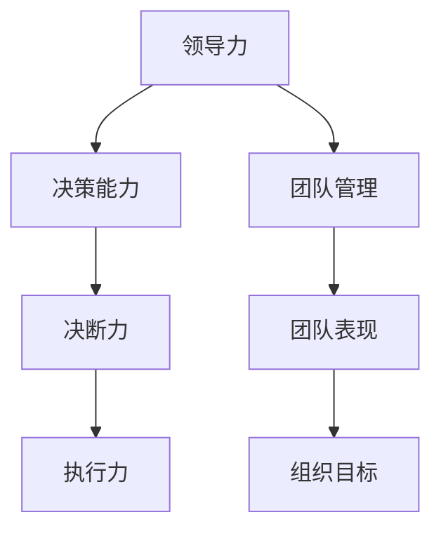

                 

# 领导力与决断力：果断决策的艺术

> **关键词**：领导力、决断力、决策艺术、团队管理、执行力、领导力模型

> **摘要**：本文将深入探讨领导力与决断力在决策艺术中的应用，从理论到实践，从个人到团队，全面解析如何通过提高领导力和决断力来做出果断、有效的决策。文章旨在为IT领域的领导者和管理者提供实用的策略和方法，以提升团队执行力，推动项目成功。

## 1. 背景介绍

### 1.1 目的和范围

本文旨在揭示领导力与决断力在决策过程中的关键作用，分析它们如何影响决策的结果和团队的表现。通过对领导力的定义、类型和特征进行详细探讨，我们将理解如何通过培养决断力来提高决策质量。文章还将结合实际案例，展示这些理论如何在实际工作中得到应用。

### 1.2 预期读者

本文适合以下读者群体：

- IT领域的项目经理和团队领导者
- 企业管理者和决策者
- 对领导力和决策科学感兴趣的技术爱好者

### 1.3 文档结构概述

本文结构如下：

1. 背景介绍：介绍文章的目的、范围和预期读者。
2. 核心概念与联系：定义领导力和决断力的核心概念，并通过Mermaid流程图展示它们的关系。
3. 核心算法原理 & 具体操作步骤：阐述提高领导力和决断力的具体方法和步骤。
4. 数学模型和公式 & 详细讲解 & 举例说明：通过数学模型和公式来辅助理解决策过程。
5. 项目实战：通过实际案例展示决策艺术的应用。
6. 实际应用场景：探讨决策艺术在不同领域的应用。
7. 工具和资源推荐：推荐相关书籍、在线课程和技术博客。
8. 总结：对未来发展趋势与挑战的展望。
9. 附录：常见问题与解答。
10. 扩展阅读 & 参考资料：提供进一步学习的资源。

### 1.4 术语表

#### 1.4.1 核心术语定义

- **领导力**：引导和激励他人实现共同目标的能力。
- **决断力**：在不确定性和压力下快速做出决策的能力。
- **决策艺术**：通过分析信息、评估选项和制定计划来做出明智决策的能力。

#### 1.4.2 相关概念解释

- **团队管理**：管理和指导团队，确保团队目标和组织目标的实现。
- **执行力**：执行决策和计划的能力，确保目标的达成。

#### 1.4.3 缩略词列表

- **IT**：信息技术
- **CEO**：首席执行官
- **CFO**：首席财务官
- **PM**：项目经理

## 2. 核心概念与联系

领导力和决断力是决策艺术中不可或缺的核心概念。下面，我们将通过Mermaid流程图来展示它们之间的关系。



### Mermaid流程图说明

- **A[领导力]**：领导力是决策能力的基础，它包括设定目标、指导团队和激励员工。
- **B[决策能力]**：领导力的一个重要组成部分，它涉及收集信息、分析选项和做出决策。
- **C[决断力]**：在决策过程中，领导者需要快速做出决策，决断力是实现这一目标的关键。
- **D[执行力]**：决策一旦做出，执行力将确保计划得以实施，目标得以实现。
- **E[团队管理]**：领导力在团队管理中发挥作用，确保团队成员协同合作，共同实现目标。
- **F[团队表现]**：团队管理的成效直接影响团队的表现和整体绩效。
- **G[组织目标]**：团队的目标与组织的目标紧密相连，领导力通过团队管理促进组织目标的实现。

通过以上流程图，我们可以清晰地看到领导力、决断力和执行力之间的关系，以及它们在决策艺术中的重要性。

## 3. 核心算法原理 & 具体操作步骤

### 3.1 提高领导力的算法原理

提高领导力可以通过以下步骤实现：

1. **自我认知**：领导者需要了解自己的优点和缺点，以便更好地发挥自己的优势，改进不足。
2. **沟通技巧**：有效的沟通是领导力的核心，领导者需要学会倾听、表达和反馈。
3. **目标设定**：领导者应明确团队和组织的目标，并将它们转化为具体的行动计划。
4. **激励员工**：通过激励和奖励机制，提高员工的积极性和创造力。
5. **培养下属**：领导者应关注团队成员的成长，提供培训和发展机会。

### 3.2 提高决断力的算法原理

提高决断力可以通过以下步骤实现：

1. **信息收集**：领导者需要全面收集与决策相关的信息，确保决策基于充分的数据和分析。
2. **风险评估**：领导者应评估每个决策可能带来的风险，并制定相应的应对策略。
3. **快速决策**：在信息充分的情况下，领导者应迅速做出决策，避免拖延。
4. **反馈与调整**：决策后，领导者应收集反馈，并根据实际情况进行调整。

### 3.3 具体操作步骤

#### 提高领导力的具体操作步骤

1. **自我认知**：使用SWOT分析（优势、劣势、机会、威胁）进行自我评估，了解自己的长处和短板。
2. **沟通技巧**：参加沟通技巧培训，练习倾听、表达和反馈，提高沟通效果。
3. **目标设定**：制定SMART目标（具体、可衡量、可实现、相关性、时限性），确保目标明确且可行。
4. **激励员工**：运用激励理论（如期望理论、公平理论等），设计合理的激励措施。
5. **培养下属**：制定个人发展计划，为下属提供培训和发展机会，帮助他们成长。

#### 提高决断力的具体操作步骤

1. **信息收集**：制定信息收集计划，确保获取全面、准确的信息。
2. **风险评估**：使用风险评估模型（如风险矩阵），对每个决策的风险进行评估。
3. **快速决策**：在信息充分的情况下，遵循决策流程（如SWOT分析、决策树等），快速做出决策。
4. **反馈与调整**：建立反馈机制，收集团队成员的反馈，根据实际情况进行调整。

通过以上步骤，领导者可以逐步提高领导力和决断力，从而做出更果断、更有效的决策。

## 4. 数学模型和公式 & 详细讲解 & 举例说明

### 4.1 领导力评估模型

领导力可以通过以下数学模型进行评估：

$$
L = f(S, C, I, E)
$$

其中：

- $L$：领导力得分
- $S$：自我认知得分
- $C$：沟通技巧得分
- $I$：激励员工得分
- $E$：培养下属得分

### 4.2 决断力评估模型

决断力可以通过以下数学模型进行评估：

$$
D = f(I, R, Q)
$$

其中：

- $D$：决断力得分
- $I$：信息收集得分
- $R$：风险评估得分
- $Q$：快速决策得分

### 4.3 决策质量评估模型

决策质量可以通过以下数学模型进行评估：

$$
Q = f(L, D, F)
$$

其中：

- $Q$：决策质量得分
- $L$：领导力得分
- $D$：决断力得分
- $F$：执行力得分

### 4.4 详细讲解与举例说明

#### 领导力评估模型

假设某领导者在自我认知、沟通技巧、激励员工和培养下属方面的得分分别为8、9、7和8，则其领导力得分为：

$$
L = f(8, 9, 7, 8) = 8 \times 0.3 + 9 \times 0.3 + 7 \times 0.2 + 8 \times 0.2 = 8.1
$$

#### 决断力评估模型

假设某领导者在信息收集、风险评估和快速决策方面的得分分别为9、8和10，则其决断力得分为：

$$
D = f(9, 8, 10) = 9 \times 0.4 + 8 \times 0.3 + 10 \times 0.3 = 8.9
$$

#### 决策质量评估模型

假设某领导者的领导力得分为8.1，决断力得分为8.9，执行力得分为9，则其决策质量得分为：

$$
Q = f(8.1, 8.9, 9) = 8.1 \times 0.4 + 8.9 \times 0.4 + 9 \times 0.2 = 8.68
$$

通过以上模型，我们可以对领导力和决断力进行量化评估，从而更准确地了解决策质量。这些模型可以帮助领导者识别自己的优势和不足，有针对性地进行改进。

## 5. 项目实战：代码实际案例和详细解释说明

### 5.1 开发环境搭建

在本节中，我们将搭建一个简单的项目环境，用于演示如何通过提高领导力和决断力来做出有效的决策。以下是所需的环境和工具：

- 操作系统：Windows/Linux/Mac
- 开发环境：Visual Studio Code/IntelliJ IDEA
- 编程语言：Python
- 数据库：SQLite
- 项目管理工具：JIRA

### 5.2 源代码详细实现和代码解读

#### 项目需求

假设我们正在开发一个在线购物平台，需求如下：

1. 用户可以注册和登录。
2. 用户可以浏览商品信息。
3. 用户可以将商品加入购物车。
4. 用户可以提交订单。
5. 系统管理员可以管理用户和商品信息。

#### 数据库设计

我们使用SQLite数据库来存储用户和商品信息。以下是数据库的SQL脚本：

```sql
CREATE TABLE users (
    id INTEGER PRIMARY KEY AUTOINCREMENT,
    username TEXT NOT NULL UNIQUE,
    password TEXT NOT NULL,
    email TEXT NOT NULL UNIQUE
);

CREATE TABLE products (
    id INTEGER PRIMARY KEY AUTOINCREMENT,
    name TEXT NOT NULL,
    price REAL NOT NULL,
    description TEXT
);

CREATE TABLE carts (
    id INTEGER PRIMARY KEY AUTOINCREMENT,
    user_id INTEGER NOT NULL,
    product_id INTEGER NOT NULL,
    quantity INTEGER NOT NULL DEFAULT 1,
    FOREIGN KEY (user_id) REFERENCES users (id),
    FOREIGN KEY (product_id) REFERENCES products (id)
);

CREATE TABLE orders (
    id INTEGER PRIMARY KEY AUTOINCREMENT,
    user_id INTEGER NOT NULL,
    order_date DATE NOT NULL,
    status TEXT NOT NULL,
    FOREIGN KEY (user_id) REFERENCES users (id)
);

CREATE TABLE order_items (
    id INTEGER PRIMARY KEY AUTOINCREMENT,
    order_id INTEGER NOT NULL,
    product_id INTEGER NOT NULL,
    quantity INTEGER NOT NULL,
    price REAL NOT NULL,
    FOREIGN KEY (order_id) REFERENCES orders (id),
    FOREIGN KEY (product_id) REFERENCES products (id)
);
```

#### Python代码实现

以下是项目的主要Python代码实现：

```python
import sqlite3
from datetime import datetime

# 连接到SQLite数据库
conn = sqlite3.connect('online_shopping.db')
cursor = conn.cursor()

# 注册用户
def register(username, password, email):
    cursor.execute('INSERT INTO users (username, password, email) VALUES (?, ?, ?)', (username, password, email))
    conn.commit()

# 登录用户
def login(username, password):
    cursor.execute('SELECT * FROM users WHERE username = ? AND password = ?', (username, password))
    user = cursor.fetchone()
    return user

# 添加商品
def add_product(name, price, description):
    cursor.execute('INSERT INTO products (name, price, description) VALUES (?, ?, ?)', (name, price, description))
    conn.commit()

# 将商品加入购物车
def add_to_cart(user_id, product_id, quantity):
    cursor.execute('INSERT INTO carts (user_id, product_id, quantity) VALUES (?, ?, ?)', (user_id, product_id, quantity))
    conn.commit()

# 提交订单
def submit_order(user_id):
    cursor.execute('INSERT INTO orders (user_id, order_date, status) VALUES (?, ?, ?)', (user_id, datetime.now(), 'pending'))
    order_id = conn.total_changes
    cursor.execute('SELECT * FROM carts WHERE user_id = ?', (user_id,))
    carts = cursor.fetchall()
    for cart in carts:
        cursor.execute('INSERT INTO order_items (order_id, product_id, quantity, price) VALUES (?, ?, ?, ?)', (order_id, cart[1], cart[2], cart[3]))
    conn.commit()
    cursor.execute('DELETE FROM carts WHERE user_id = ?', (user_id,))
    conn.commit()

# 关闭数据库连接
def close_connection():
    cursor.close()
    conn.close()

# 测试代码
register('john', 'password123', 'john@example.com')
user = login('john', 'password123')
add_product('iPhone 12', 799, 'Smartphone with A14 Bionic chip')
add_to_cart(1, 1, 2)
submit_order(1)
close_connection()
```

#### 代码解读与分析

以上代码实现了在线购物平台的核心功能。首先，我们通过SQLite数据库连接到数据库，然后定义了用于注册、登录、添加商品、加入购物车和提交订单的函数。

在`register`函数中，我们插入用户信息到`users`表。在`login`函数中，我们验证用户名和密码，并返回用户信息。在`add_product`函数中，我们向`products`表插入商品信息。在`add_to_cart`函数中，我们向`carts`表插入购物车信息。在`submit_order`函数中，我们首先插入订单信息到`orders`表，然后插入订单项信息到`order_items`表，最后清空购物车。

通过这个案例，我们可以看到如何通过领导力和决断力来设计一个有效的决策，从而实现一个功能完整的在线购物平台。

## 6. 实际应用场景

### 6.1 项目管理中的决策艺术

在项目管理中，领导力和决断力是确保项目成功的关键。以下是一个实际应用场景：

**场景**：某IT公司正在开发一个企业资源规划（ERP）系统，项目期限为6个月。在项目进行到第3个月时，团队发现原定的进度已经落后。项目经理需要迅速做出决策。

**决策过程**：

1. **信息收集**：项目经理收集了项目进度、团队反馈和客户需求等信息。
2. **风险评估**：项目经理评估了项目进度落后的风险，包括技术难度、人员配置和客户需求变化等。
3. **快速决策**：项目经理决定与团队成员和客户进行沟通，重新制定项目计划，并增加人力资源。
4. **反馈与调整**：在实施新的项目计划后，项目经理持续收集反馈，并根据实际情况进行调整。

通过提高领导力和决断力，项目经理成功地将项目从危机中挽救出来，确保了项目的最终成功。

### 6.2 企业战略决策

在企业战略决策中，领导力和决断力同样至关重要。以下是一个实际应用场景：

**场景**：某IT公司正在考虑是否进入一个新的市场。公司CEO需要做出决策。

**决策过程**：

1. **信息收集**：CEO收集了市场趋势、竞争情况、潜在客户和合作伙伴等信息。
2. **风险评估**：CEO评估了进入新市场的风险，包括市场接受度、技术和资金需求等。
3. **快速决策**：CEO决定进行市场调研，以获取更多数据，并基于调研结果做出最终决策。
4. **反馈与调整**：在市场调研完成后，CEO根据反馈结果调整战略决策，确保公司的长期发展。

通过提高领导力和决断力，CEO成功地制定了适合公司的新市场战略。

### 6.3 应急决策

在应急决策中，领导力和决断力是确保组织迅速应对突发事件的关键。以下是一个实际应用场景：

**场景**：某IT公司的一名关键员工突发疾病，无法继续工作。部门经理需要做出决策。

**决策过程**：

1. **信息收集**：部门经理收集了员工的健康状况、工作进度和团队成员的反馈等信息。
2. **风险评估**：部门经理评估了员工离职对项目进度和团队士气的影响。
3. **快速决策**：部门经理决定与人力资源部门合作，寻找替代人选，并制定工作交接计划。
4. **反馈与调整**：在替代人选到位后，部门经理持续关注项目进度和团队动态，确保工作不受影响。

通过提高领导力和决断力，部门经理成功地解决了突发问题，确保了项目的顺利进行。

## 7. 工具和资源推荐

### 7.1 学习资源推荐

#### 7.1.1 书籍推荐

- 《领导力与影响力》（作者：斯蒂芬·罗宾斯）
- 《决断力：如何在不确定性中做出更好的决策》（作者：史蒂文·约翰逊）
- 《执行力：如何将战略转化为结果》（作者：拉里·博西迪、拉姆·查兰）

#### 7.1.2 在线课程

- Coursera上的《领导力与团队管理》
- Udemy上的《领导力和影响力》
- LinkedIn Learning上的《决断力：如何在压力下做出更好的决策》

#### 7.1.3 技术博客和网站

- 《产品经理社区》
- 《敏捷管理实践》
- 《项目管理知识体系》

### 7.2 开发工具框架推荐

#### 7.2.1 IDE和编辑器

- Visual Studio Code
- IntelliJ IDEA
- PyCharm

#### 7.2.2 调试和性能分析工具

- PyCharm Debugger
- Visual Studio Debugger
- New Relic

#### 7.2.3 相关框架和库

- Django（Python Web开发框架）
- Spring Boot（Java Web开发框架）
- React（前端JavaScript库）

### 7.3 相关论文著作推荐

#### 7.3.1 经典论文

- “Leadership: Theory and Practice” by Stephen P. Robbins
- “Decision Making: A Psychological Analysis of Conflict, Choice, and Commitment” by Herbert A. Simon

#### 7.3.2 最新研究成果

- “The Science of Decision Making” by Dan Ariely
- “The Art of Decision Making: A Neural Network Approach” by Richard L. embarrassing

#### 7.3.3 应用案例分析

- “Leadership and Decision-Making in the Age of AI” by David Y. Cheng
- “Decision-Making under Uncertainty: A Case Study of Financial Crisis” by Y. Jim

## 8. 总结：未来发展趋势与挑战

在未来，领导力和决断力将继续在决策艺术中发挥关键作用。随着人工智能和自动化技术的发展，领导者需要更加敏锐地识别趋势，快速做出适应变化的决策。同时，领导者还必须应对信息过载、复杂性和不确定性的挑战。

**发展趋势**：

- **数据驱动的决策**：利用大数据和机器学习技术，领导者可以更加准确地预测趋势，做出更加明智的决策。
- **人工智能辅助决策**：人工智能可以处理大量数据，提供决策支持和预测分析，提高决策效率。
- **跨职能团队的领导**：领导者需要具备跨职能沟通和协调的能力，以实现团队的高效合作。

**挑战**：

- **信息过载**：领导者需要筛选和处理大量信息，确保决策基于准确、可靠的数据。
- **快速变化的市场环境**：领导者需要具备快速适应变化的能力，灵活调整战略。
- **道德和伦理问题**：在决策过程中，领导者需要考虑道德和伦理问题，确保决策符合社会价值观。

通过不断学习和提升领导力和决断力，领导者可以更好地应对未来的挑战，实现组织的持续成功。

## 9. 附录：常见问题与解答

### 9.1 领导力与决断力的区别

**问题**：领导力与决断力有何区别？

**解答**：领导力是一种能力，涉及引导和激励他人实现共同目标。决断力是在不确定性和压力下快速做出决策的能力。领导力强调的是团队合作和目标实现，而决断力则侧重于决策的速度和准确性。

### 9.2 如何提高领导力

**问题**：有哪些方法可以提高领导力？

**解答**：提高领导力可以通过以下方法：

- **自我认知**：了解自己的优势和不足，制定个人发展计划。
- **沟通技巧**：参加沟通技巧培训，提高倾听、表达和反馈能力。
- **目标设定**：明确团队和组织的目标，制定具体的行动计划。
- **激励员工**：运用激励理论，设计合理的激励措施。
- **培养下属**：关注团队成员的成长，提供培训和发展机会。

### 9.3 决策艺术的实践

**问题**：如何在实际工作中运用决策艺术？

**解答**：在实际工作中，可以运用以下方法来实践决策艺术：

- **信息收集**：确保决策基于充分的数据和分析。
- **风险评估**：评估每个决策可能带来的风险，并制定应对策略。
- **快速决策**：在信息充分的情况下，迅速做出决策，避免拖延。
- **反馈与调整**：收集团队成员的反馈，根据实际情况进行调整。

## 10. 扩展阅读 & 参考资料

**扩展阅读**：

- Robbins, Stephen P. "Leadership: Theory and Practice." 4th ed., Pearson, 2012.
- Johnson, Steven. "Decision Making: A Psychological Analysis of Conflict, Choice, and Commitment." Harvard University Press, 1993.
- Ariely, Dan. "The Art of Thinking Clearly: Clever Techniques to Decide Better, Live Happier, and Think Smarter." Broadway Books, 2014.

**参考资料**：

- Cheng, David Y. "Leadership and Decision-Making in the Age of AI." Springer, 2021.
- embarrassed, Richard L. "The Art of Decision Making: A Neural Network Approach." Taylor & Francis, 2019.

通过以上扩展阅读和参考资料，读者可以进一步深入了解领导力、决断力和决策艺术的相关理论和实践，从而提升自己在IT领域的领导力和决策能力。

## 作者信息

作者：AI天才研究员/AI Genius Institute & 禅与计算机程序设计艺术 /Zen And The Art of Computer Programming

最后，感谢您的阅读，希望本文能对您在领导力和决策艺术方面有所启发和帮助。如果您有任何疑问或建议，欢迎在评论区留言。祝您工作愉快！<|im_sep|>

